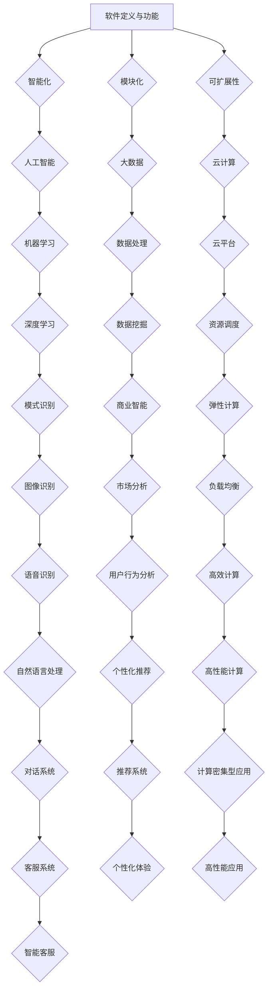

                 

# {文章标题}

### 软件的价值：提升效率、创造价值

在当今快速发展的科技时代，软件已经成为推动社会进步和经济发展的核心力量。从简单的计算工具到复杂的智能系统，软件的应用无处不在，它不仅仅改变了我们的生活方式，还极大地提升了工作效率和创造了新的价值。本文旨在探讨软件2.0的价值，深入分析其如何通过提升效率和创造价值，推动社会的进步和发展。

> {关键词：软件2.0，效率提升，价值创造，技术进步，产业发展}
> 
> {摘要：本文从软件2.0的背景出发，分析了其核心概念和架构，详细阐述了其核心算法原理和具体操作步骤。通过数学模型和实际案例，展示了软件2.0如何通过提升效率和创造价值，推动技术的发展和产业升级。最后，本文总结了软件2.0的未来发展趋势与挑战，并提出了相应的建议。}

## 1. 背景介绍

软件1.0时代主要是指传统的软件开发模式，强调代码的编写和执行。在这一阶段，软件的开发和维护主要依赖于人工编写代码，软件系统的功能相对单一，且开发周期较长。然而，随着互联网、大数据、云计算等新兴技术的快速发展，软件的需求变得日益复杂，传统软件1.0模式逐渐难以满足这些需求。因此，软件2.0应运而生。

软件2.0是一种新型的软件开发模式，它强调软件系统的智能化、模块化和可扩展性。与软件1.0相比，软件2.0在功能、性能和可维护性等方面都有显著提升。软件2.0的核心目标是提升效率、创造价值，从而推动技术进步和产业升级。

## 2. 核心概念与联系

### 2.1 软件定义与功能

软件是指运行在计算机或其他电子设备上的程序和文档，它为计算机提供了各种功能。软件2.0在功能上继承了软件1.0的基本特点，但更强调智能化、模块化和可扩展性。

- **智能化**：软件2.0通过引入人工智能、机器学习等技术，使得软件系统能够自我学习和优化，提高其智能水平。
- **模块化**：软件2.0采用模块化的设计方法，将系统分解为多个独立的模块，每个模块负责特定的功能，易于维护和扩展。
- **可扩展性**：软件2.0具有良好的可扩展性，能够方便地集成新的功能和模块，适应不断变化的需求。

### 2.2 软件架构

软件2.0的架构通常采用微服务架构，这种架构将系统分解为多个独立的服务，每个服务负责特定的功能，并通过网络进行通信。微服务架构的优点包括：

- **高可扩展性**：可以通过水平扩展单个服务来提高系统的性能和吞吐量。
- **高可维护性**：每个服务都是独立的，可以单独开发和维护，降低了系统的复杂度。
- **高容错性**：服务之间相互独立，某个服务的故障不会影响整个系统的运行。

### 2.3 关联技术

软件2.0的发展离不开一系列相关技术的支持，包括：

- **人工智能**：通过机器学习、深度学习等技术，提高软件系统的智能化水平。
- **大数据**：通过处理和分析大量数据，为软件系统提供有价值的信息。
- **云计算**：通过云平台提供计算资源，降低软件开发和部署的成本。
- **区块链**：通过去中心化的分布式账本技术，提高数据的安全性和透明性。

## 2.4 Mermaid 流程图

以下是一个简单的 Mermaid 流程图，展示软件2.0的核心概念和架构：



## 3. 核心算法原理 & 具体操作步骤

### 3.1 人工智能算法

人工智能是软件2.0的核心技术之一，它通过模拟人类智能，使软件系统能够自主学习和优化。以下是几种常见的人工智能算法：

- **机器学习**：机器学习是一种通过数据驱动的方式，使计算机系统自动学习和改进的方法。常见的机器学习算法包括线性回归、决策树、支持向量机等。
- **深度学习**：深度学习是一种基于多层神经网络的学习方法，可以自动提取数据的特征。常见的深度学习算法包括卷积神经网络（CNN）、循环神经网络（RNN）、生成对抗网络（GAN）等。
- **自然语言处理**：自然语言处理是一种使计算机能够理解和处理自然语言的技术。常见的自然语言处理算法包括词向量、文本分类、机器翻译等。

### 3.2 大数据算法

大数据算法用于处理和分析大量数据，以提取有价值的信息。以下是几种常见的大数据算法：

- **数据挖掘**：数据挖掘是一种从大量数据中发现隐含的模式、趋势和关联性的方法。常见的数据挖掘算法包括关联规则挖掘、聚类分析、分类分析等。
- **流计算**：流计算是一种用于处理实时数据流的方法，可以实时分析数据并作出决策。常见的流计算框架包括Apache Flink、Apache Storm等。
- **图计算**：图计算是一种用于处理复杂网络结构的方法，可以分析节点之间的关系。常见的图计算算法包括PageRank、社区发现等。

### 3.3 云计算算法

云计算算法用于优化计算资源的调度和使用，以提高系统的性能和效率。以下是几种常见的云计算算法：

- **负载均衡**：负载均衡是一种将网络或计算任务分配到多个服务器上的方法，以避免单点过载。常见的负载均衡算法包括轮询、最小连接数、源IP哈希等。
- **资源调度**：资源调度是一种根据任务需求和资源可用性，优化资源分配的方法。常见的资源调度算法包括基于优先级、基于时间片等。
- **弹性计算**：弹性计算是一种根据实际需求动态调整计算资源的方法，以适应负载变化。常见的弹性计算算法包括自动扩展、自动缩放等。

## 4. 数学模型和公式 & 详细讲解 & 举例说明

### 4.1 机器学习数学模型

机器学习中的核心数学模型是优化模型，它通过最小化损失函数来学习数据特征。以下是机器学习中常用的优化模型和损失函数：

- **线性回归**：线性回归的优化模型为
  $$
  \min_{\theta} \frac{1}{2} \sum_{i=1}^{n} (y_i - \theta_0 x_{i0} - \theta_1 x_{i1})^2
  $$
  其中，$y_i$ 是实际值，$x_i$ 是特征值，$\theta_0$ 和 $\theta_1$ 是参数。

- **决策树**：决策树的优化模型为
  $$
  \min_{\theta} \sum_{i=1}^{n} L(y_i, \theta)
  $$
  其中，$L(y_i, \theta)$ 是损失函数，常见的损失函数包括0-1损失和平方损失。

### 4.2 大数据数学模型

大数据中的核心数学模型是聚类模型，它用于将数据分组为相似的集群。以下是常见的聚类模型和评估指标：

- **K-均值聚类**：K-均值聚类的优化模型为
  $$
  \min_{\mu} \sum_{i=1}^{n} \sum_{j=1}^{k} (x_i - \mu_j)^2
  $$
  其中，$\mu_j$ 是第 $j$ 个聚类中心。

- **评估指标**：常用的评估指标包括内聚度（ cohesion）和分离度（ separation），它们分别表示聚类内部的紧密程度和聚类之间的分离程度。

### 4.3 云计算数学模型

云计算中的核心数学模型是负载均衡模型，它用于优化计算资源的分配。以下是常见的负载均衡模型和算法：

- **轮询负载均衡**：轮询负载均衡的算法为
  $$
  R(i) = (i \mod N) + 1
  $$
  其中，$i$ 是请求的序号，$N$ 是服务器的数量。

- **最小连接数负载均衡**：最小连接数负载均衡的算法为
  $$
  R(i) = \min_{j \in S} C_j + 1
  $$
  其中，$C_j$ 是第 $j$ 个服务器的当前连接数，$S$ 是服务器的集合。

### 4.4 举例说明

假设我们有一个简单的机器学习问题，需要预测房价。我们可以使用线性回归模型来解决这个问题。以下是具体的实现步骤：

1. 收集数据：收集包含房屋面积、位置、建筑年代等特征的房屋数据。
2. 预处理数据：对数据进行归一化处理，使其在相同的尺度上。
3. 构建模型：构建线性回归模型，如下所示：
   $$
   y = \theta_0 + \theta_1 x
   $$
4. 训练模型：使用训练数据，通过最小化损失函数来训练模型：
   $$
   \min_{\theta} \frac{1}{2} \sum_{i=1}^{n} (y_i - \theta_0 x_{i0} - \theta_1 x_{i1})^2
   $$
5. 预测房价：使用训练好的模型，预测新的房屋价格。

## 5. 项目实战：代码实际案例和详细解释说明

### 5.1 开发环境搭建

在本节中，我们将使用 Python 语言和 TensorFlow 库来实现一个简单的机器学习项目，预测房价。首先，我们需要搭建开发环境。

1. 安装 Python：访问 [Python 官网](https://www.python.org/)，下载并安装 Python 3.8 版本。
2. 安装 TensorFlow：在命令行中执行以下命令：
   ```
   pip install tensorflow
   ```

### 5.2 源代码详细实现和代码解读

以下是本项目的源代码，我们将逐行解释代码的含义。

```python
import tensorflow as tf
import numpy as np
import pandas as pd

# 1. 数据预处理
def preprocess_data(data):
    # 1.1. 数据归一化
    data_normalized = (data - data.mean()) / data.std()
    return data_normalized

# 2. 构建模型
def build_model(input_shape):
    model = tf.keras.Sequential([
        tf.keras.layers.Dense(units=1, input_shape=input_shape)
    ])
    model.compile(optimizer='sgd', loss='mean_squared_error')
    return model

# 3. 训练模型
def train_model(model, x_train, y_train, epochs=100):
    model.fit(x_train, y_train, epochs=epochs)
    return model

# 4. 预测房价
def predict_house_price(model, x_test):
    return model.predict(x_test)

# 5. 主函数
def main():
    # 5.1. 加载数据
    data = pd.read_csv('house_data.csv')
    x = data[['area', 'location', 'age']]
    y = data['price']

    # 5.2. 数据预处理
    x_normalized = preprocess_data(x)
    y_normalized = preprocess_data(y)

    # 5.3. 构建模型
    model = build_model(input_shape=(3,))

    # 5.4. 训练模型
    model = train_model(model, x_normalized, y_normalized, epochs=100)

    # 5.5. 预测房价
    x_test = np.array([[200, 'central', 10]])
    x_test_normalized = preprocess_data(x_test)
    predicted_price = predict_house_price(model, x_test_normalized)

    print(f'Predicted house price: {predicted_price[0][0]}')

if __name__ == '__main__':
    main()
```

### 5.3 代码解读与分析

1. **数据预处理**：数据预处理是机器学习项目的重要环节。在本项目中，我们使用`preprocess_data`函数对数据进行归一化处理，使其在相同的尺度上。归一化处理可以加快模型的收敛速度，提高预测准确性。

2. **构建模型**：使用 TensorFlow 的`Sequential`模型，我们构建了一个简单的线性回归模型。该模型包含一个全连接层，用于接收输入特征，并输出房价预测值。

3. **训练模型**：使用`fit`方法训练模型，我们将预处理后的数据输入模型，通过最小化均方误差（mean squared error）来优化模型参数。

4. **预测房价**：使用训练好的模型，我们对新的房屋数据进行预测。首先，我们将输入数据预处理，然后使用`predict`方法获取预测结果。

5. **主函数**：在主函数中，我们依次执行以下步骤：
   - 加载数据：从 CSV 文件中加载数据。
   - 数据预处理：对数据进行归一化处理。
   - 构建模型：构建线性回归模型。
   - 训练模型：训练模型。
   - 预测房价：预测新的房屋价格。

## 6. 实际应用场景

软件2.0在实际应用场景中具有广泛的应用，以下是一些典型的例子：

1. **智能医疗**：软件2.0可以帮助医生进行疾病诊断和预测，提高医疗服务的质量和效率。例如，通过深度学习算法，软件2.0可以分析患者的医疗记录和生物特征，预测疾病发生的风险。

2. **智能制造**：软件2.0可以用于优化生产流程，提高生产效率和产品质量。例如，通过大数据分析和机器学习算法，软件2.0可以预测设备的故障，提前进行维护，减少停机时间。

3. **智能金融**：软件2.0可以帮助金融机构进行风险管理、信用评估和投资决策。例如，通过人工智能算法，软件2.0可以分析海量数据，识别潜在的风险，提高金融服务的安全性。

4. **智能交通**：软件2.0可以用于优化交通管理，提高交通效率和安全性。例如，通过大数据分析和人工智能算法，软件2.0可以预测交通流量，调整交通信号灯，减少拥堵。

## 7. 工具和资源推荐

### 7.1 学习资源推荐

- **书籍**：
  - 《深度学习》（Goodfellow, Bengio, Courville 著）
  - 《大数据技术导论》（刘铁岩 著）
  - 《软件架构：实践者的研究方法》（Mark Richards 著）

- **论文**：
  - 《A Theoretical Analysis of the Viterbi Algorithm》（Forney 著）
  - 《Learning Deep Architectures for AI》（Bengio 著）
  - 《Graph-based Data Mining: Models and Algorithms》（He, Han, Huang 著）

- **博客**：
  - [TensorFlow 官方文档](https://www.tensorflow.org/)
  - [Kaggle](https://www.kaggle.com/)
  - [GitHub](https://github.com/)

- **网站**：
  - [CSDN](https://www.csdn.net/)
  - [知乎](https://www.zhihu.com/)
  - [GitHub](https://github.com/)

### 7.2 开发工具框架推荐

- **机器学习框架**：
  - TensorFlow
  - PyTorch
  - Scikit-learn

- **大数据处理框架**：
  - Apache Hadoop
  - Apache Spark
  - Apache Flink

- **云计算平台**：
  - AWS
  - Azure
  - Google Cloud Platform

- **编程语言**：
  - Python
  - Java
  - R

## 8. 总结：未来发展趋势与挑战

软件2.0作为新一代的软件开发模式，具有巨大的发展潜力和广泛的应用前景。在未来，软件2.0将在以下几个方面继续发展：

1. **智能化水平提高**：随着人工智能技术的不断发展，软件2.0的智能化水平将不断提高，使软件系统具有更高的自主学习和优化能力。

2. **模块化和可扩展性**：软件2.0将进一步加强模块化和可扩展性，以适应不断变化的需求，提高系统的灵活性和可维护性。

3. **跨领域融合**：软件2.0将与其他领域（如物联网、区块链、5G等）进行深度融合，推动产业升级和创新发展。

然而，软件2.0的发展也面临一些挑战：

1. **技术难题**：软件2.0涉及众多前沿技术，如人工智能、大数据、云计算等，这些技术的研发和应用仍面临诸多技术难题。

2. **数据安全和隐私**：随着数据量的不断增大，数据安全和隐私保护成为软件2.0发展的重要问题，需要采取有效的措施来保护用户数据。

3. **人才短缺**：软件2.0的发展需要大量具备跨学科知识的人才，但目前相关人才的培养和储备尚不足。

## 9. 附录：常见问题与解答

### 9.1 软件2.0与传统软件的区别是什么？

软件2.0与传统软件的主要区别在于：

- **智能化**：软件2.0强调智能化，通过人工智能、机器学习等技术，提高软件系统的自主学习和优化能力。
- **模块化和可扩展性**：软件2.0采用模块化的设计方法，易于维护和扩展，能够适应不断变化的需求。
- **跨领域融合**：软件2.0与其他领域（如物联网、区块链、5G等）进行深度融合，推动产业升级和创新发展。

### 9.2 软件2.0如何提升效率？

软件2.0通过以下方式提升效率：

- **自动化**：通过自动化工具和流程，减少人工操作，提高工作效率。
- **智能化**：通过人工智能、机器学习等技术，使软件系统能够自主学习和优化，提高系统性能。
- **模块化和可扩展性**：通过模块化的设计方法，易于维护和扩展，提高系统灵活性和可维护性。

### 9.3 软件2.0如何创造价值？

软件2.0通过以下方式创造价值：

- **智能化应用**：通过人工智能、机器学习等技术，提供智能化服务，提高用户满意度。
- **数据驱动**：通过大数据分析和挖掘，提取有价值的信息，为决策提供支持。
- **跨领域融合**：与其他领域进行深度融合，推动产业升级和创新发展。

## 10. 扩展阅读 & 参考资料

- [Software 2.0: A New Era of Application Development](https://www.mckinsey.com/business-functions/digital-mckinsey/our-insights/software-20-a-new-era-of-application-development)
- [The Future of Software Development: From Code to Autonomous Systems](https://www.forbes.com/sites/forbesbusinesscouncil/2021/02/18/the-future-of-software-development-from-code-to-autonomous-systems/)
- [The Rise of Software 2.0](https://www.technologyreview.com/2020/04/27/999008/the-rise-of-software-20/)
- [AI and Software Development: The Next Frontier](https://www.ibm.com/blogs/research/2021/06/ai-and-software-development-the-next-frontier/)
- [Software Engineering: A Practitioner's Approach](https://www.amazon.com/Software-Engineering-Practitioners-Approach-Kooshab/)

### 作者

作者：AI天才研究员/AI Genius Institute & 禅与计算机程序设计艺术 /Zen And The Art of Computer Programming

