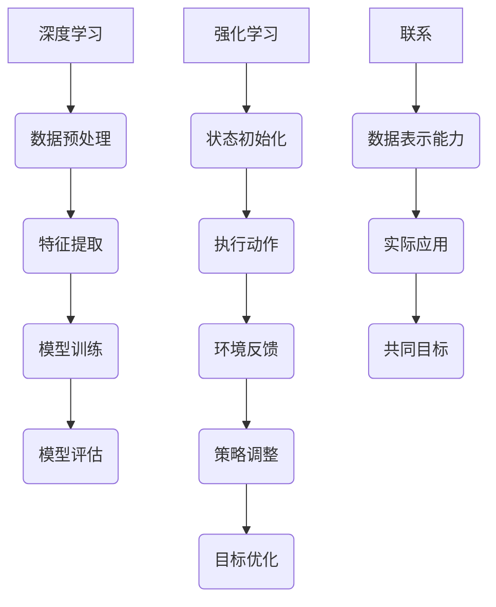

                 

### 背景介绍

在过去的几十年中，软件领域经历了巨大的变革。从传统的软件 1.0 到如今兴起的软件 2.0，这一变革标志着人工智能 (AI) 和机器学习 (ML) 技术的崛起。软件 2.0 旨在利用 AI 和 ML 技术，为软件系统带来更高的智能化水平，实现自动化、自适应和自优化。

本篇博客将探讨软件 2.0 的发展趋势，重点关注深度学习和强化学习这两种核心算法。深度学习作为一种重要的 AI 技术手段，已经在计算机视觉、自然语言处理等领域取得了显著的成果。而强化学习则通过智能体与环境之间的交互，实现自主决策和学习，在游戏、自动驾驶等领域具有广泛的应用前景。

本文将首先介绍深度学习和强化学习的基本概念、原理及联系，然后深入分析这两种算法的具体实现步骤和数学模型，并通过实际项目案例进行详细解读。此外，还将探讨软件 2.0 在实际应用场景中的优势，以及相关工具和资源的推荐。最后，本文将对软件 2.0 的未来发展趋势和挑战进行总结。

让我们首先回顾一下软件 1.0 到软件 2.0 的演变历程，并深入了解深度学习和强化学习，为接下来的讨论打下基础。## 1.1 软件从1.0到2.0的演变历程

软件 1.0 时代可以追溯到上世纪五六十年代，当时计算机技术刚刚起步。软件主要以命令行操作为主，用户需要通过编写代码来控制计算机执行特定的任务。这一时期的软件主要特点是功能单一、手动操作、缺乏智能化。

随着计算机技术的发展，软件 1.0 开始逐渐向图形用户界面 (GUI) 和模块化方向发展。例如，操作系统和办公软件的普及，使得计算机操作变得更加直观和便捷。然而，这些软件仍然依赖于人类的干预和指导，缺乏智能化和自主决策能力。

进入互联网时代，软件 1.0 的局限性愈发明显。一方面，数据量急剧增长，使得传统的软件架构难以应对；另一方面，用户需求日益多样化，软件需要具备更高的灵活性和适应性。在这一背景下，软件 2.0 应运而生。

软件 2.0 的核心在于将人工智能 (AI) 和机器学习 (ML) 技术融入软件系统，实现软件的智能化和自动化。具体来说，软件 2.0 具有以下特点：

1. **智能化**：通过深度学习和强化学习等技术，软件能够自主学习、适应和优化，实现更高的自主决策能力。
2. **自动化**：软件能够自动处理和分析大量数据，减少人工干预，提高工作效率。
3. **自适应**：软件能够根据用户行为和需求进行自适应调整，提供个性化的服务。
4. **灵活性**：软件架构更加模块化，便于扩展和升级，能够更好地适应快速变化的市场需求。

软件 2.0 的出现，不仅改变了软件的开发和运行模式，也带来了前所未有的变革。在医疗领域，人工智能算法被应用于疾病诊断和预测，提高了诊断准确率和治疗效果；在金融领域，智能投顾和风险管理系统大幅提升了投资效率和风险控制能力；在零售领域，个性化推荐系统和智能客服机器人提升了用户体验和销售额。

总的来说，软件 2.0 的兴起是技术进步和市场需求的双重推动结果。它为软件领域带来了新的发展机遇，也为各行各业带来了深刻的变革。在接下来的内容中，我们将深入探讨深度学习和强化学习这两种核心技术，以及它们在软件 2.0 中的应用。## 1.2 深度学习的基本概念和原理

深度学习（Deep Learning，简称DL）是机器学习（Machine Learning，简称ML）的一个重要分支，它以神经网络（Neural Networks）为基础，通过模拟人脑神经元之间的连接和交互，实现数据的自动特征提取和模式识别。深度学习在计算机视觉、自然语言处理、语音识别等领域取得了显著的成果，成为人工智能领域的重要推动力。

### 1.2.1 神经网络的基本原理

神经网络（Neural Networks）是由大量简单的人工神经元（Artificial Neurons）组成的复杂网络。每个神经元都通过一定的权重与输入信号相连接，然后通过激活函数将加权输入转换为输出信号。神经网络的基本原理如下：

1. **输入层**：输入层接收外部输入信号，每个输入信号对应一个神经元。
2. **隐藏层**：隐藏层由多个神经元组成，它们将输入信号进行处理，产生新的特征表示。隐藏层的数量和规模可以根据问题复杂度进行调整。
3. **输出层**：输出层接收隐藏层处理后的信号，产生最终的输出结果。

每个神经元都可以看作是一个线性模型，通过加权求和和激活函数进行非线性变换，从而实现数据的特征提取和分类。神经网络通过不断调整权重，使得网络能够在训练数据上达到较高的准确率。

### 1.2.2 深度学习的工作原理

深度学习的工作原理主要依赖于多层神经网络，即深度神经网络（Deep Neural Networks，简称DNN）。深度神经网络通过多个隐藏层，将原始数据逐步转换为高层次的抽象特征表示。深度学习的工作过程可以分为以下几个步骤：

1. **前向传播**：输入数据从输入层开始，逐层传递到隐藏层和输出层。在每个神经元中，通过加权求和和激活函数，将输入信号转换为新的特征表示。
2. **反向传播**：在输出层产生预测结果后，通过对比预测结果和真实标签，计算损失函数（如均方误差、交叉熵等）。然后，将损失函数沿反向传播到隐藏层，通过梯度下降（Gradient Descent）等方法更新权重。
3. **迭代优化**：重复前向传播和反向传播的过程，不断调整权重，使得模型在训练数据上达到较高的准确率。

深度学习的核心优势在于其强大的特征提取和表达能力。通过多个隐藏层的堆叠，深度神经网络能够自动学习数据的层次化特征表示，从而实现复杂的模式识别和分类任务。例如，在图像识别任务中，深度学习模型可以从底层学习到边缘、纹理等基本特征，从中层学习到物体部分、场景等更高层次的抽象特征，从而在顶层实现整体图像的准确分类。

### 1.2.3 深度学习的核心算法

深度学习包含了多种核心算法，以下是一些常见的深度学习算法：

1. **卷积神经网络（Convolutional Neural Networks，简称CNN）**：CNN 是一种专门用于图像识别和处理的深度学习模型。它通过卷积操作和池化操作，实现图像特征的提取和压缩，从而在图像识别任务中表现出色。
2. **循环神经网络（Recurrent Neural Networks，简称RNN）**：RNN 是一种用于处理序列数据的深度学习模型。它通过循环连接，将上一时刻的信息传递到当前时刻，从而实现序列数据的建模和预测。
3. **长短期记忆网络（Long Short-Term Memory，简称LSTM）**：LSTM 是 RNN 的一种改进模型，它通过引入门控机制，解决 RNN 的梯度消失和梯度爆炸问题，在处理长序列数据时表现出更好的性能。
4. **生成对抗网络（Generative Adversarial Networks，简称GAN）**：GAN 是一种由两个神经网络（生成器和判别器）对抗训练的模型。生成器试图生成与真实数据相似的数据，而判别器则试图区分真实数据和生成数据。通过这种对抗训练，GAN 能够生成高质量的图像、语音和文本等数据。

总的来说，深度学习作为一种强大的 AI 技术，通过模拟人脑神经元的工作原理，实现数据的自动特征提取和模式识别。它在计算机视觉、自然语言处理等领域取得了显著成果，成为软件 2.0 中的重要一环。在接下来的内容中，我们将深入探讨强化学习的基本概念和原理，以及它与深度学习的联系。## 1.3 强化学习的基本概念和原理

强化学习（Reinforcement Learning，简称RL）是机器学习的一个重要分支，主要研究如何通过智能体（Agent）与环境（Environment）的交互，实现自主决策和学习，以达到最优目标。强化学习在游戏、自动驾驶、机器人控制等领域具有广泛的应用前景。与传统的监督学习和无监督学习不同，强化学习强调智能体在动态环境中通过试错和反馈进行学习，具备自主性和灵活性。

### 1.3.1 强化学习的基本概念

在强化学习中，主要涉及以下四个核心概念：

1. **智能体（Agent）**：智能体是执行动作并接收环境反馈的实体。在强化学习中，智能体可以是机器人、软件程序或虚拟智能体等。
2. **环境（Environment）**：环境是智能体执行动作的场所，可以看作是一个状态空间。环境根据智能体的动作产生状态转移和奖励信号。
3. **状态（State）**：状态是智能体在环境中的某一时刻所处的情境，可以用一组特征向量表示。
4. **动作（Action）**：动作是智能体在某一状态下可以采取的行为，通常是一组离散或连续的动作集合。

### 1.3.2 强化学习的基本原理

强化学习的基本原理是智能体通过与环境交互，不断调整动作策略，以最大化累积奖励。强化学习的过程可以看作是一个马尔可夫决策过程（Markov Decision Process，简称MDP），其核心思想如下：

1. **状态转移概率**：在给定当前状态和动作的情况下，智能体进入下一状态的概率。
2. **奖励函数**：根据智能体的动作和下一状态，环境为智能体提供的即时奖励。奖励可以是正奖励（表示动作带来好处）或负奖励（表示动作带来坏处）。
3. **策略**：智能体在某一状态下采取的动作选择规则，通常用策略函数表示。策略函数决定了智能体的行为。

强化学习的过程可以分为以下几个步骤：

1. **初始化**：智能体随机选择一个初始状态。
2. **执行动作**：智能体在当前状态下采取一个动作。
3. **获取反馈**：环境根据智能体的动作，产生状态转移和奖励信号。
4. **更新策略**：智能体根据反馈信息，调整动作策略，以最大化累积奖励。
5. **重复步骤 2-4**：智能体不断与环境交互，进行试错和优化，直至达到预定目标。

### 1.3.3 强化学习的核心算法

强化学习包含了多种核心算法，以下是一些常见的强化学习算法：

1. **值函数方法**：值函数方法通过学习状态值函数（State-Value Function）和动作值函数（Action-Value Function），估计智能体在各个状态和动作上的最优期望回报。常用的值函数方法包括 Q-学习（Q-Learning）和 SARSA（State-Action-Reward-State-Action，即状态-动作-奖励-状态-动作）。
2. **策略梯度方法**：策略梯度方法通过直接优化策略函数，使得智能体采取的动作能够最大化累积奖励。常用的策略梯度方法包括策略迭代（Policy Iteration）和 actor-critic 方法。
3. **深度强化学习**：深度强化学习（Deep Reinforcement Learning，简称DRL）结合深度学习和强化学习，通过深度神经网络来近似状态值函数和动作值函数，从而实现智能体的自主决策。常用的深度强化学习算法包括 DQN（Deep Q-Network）、DDPG（Deep Deterministic Policy Gradient）和 A3C（Asynchronous Advantage Actor-Critic）。

总的来说，强化学习通过智能体与环境之间的交互，实现自主决策和学习，具备很强的灵活性和自主性。它在许多实际应用中表现出色，成为人工智能领域的一个重要研究方向。在接下来的内容中，我们将深入探讨深度学习和强化学习的联系，并分析它们在软件 2.0 中的应用。## 2. 核心概念与联系

深度学习和强化学习是人工智能领域两个重要的研究方向，它们在许多方面具有互补性和联系。本文将使用 Mermaid 流程图来展示它们的基本概念、原理及联系。

### 2.1 深度学习与强化学习的联系

深度学习和强化学习在人工智能领域中具有密切的联系。深度学习通过多层神经网络实现数据的自动特征提取和模式识别，为强化学习提供了强大的数据表示能力。而强化学习通过智能体与环境之间的交互，实现自主决策和学习，为深度学习提供了实际应用场景。

以下是深度学习和强化学习的 Mermaid 流程图：



### 2.2 深度学习与强化学习的具体实现步骤

深度学习和强化学习在具体实现步骤上存在一定的差异。以下是它们各自的实现步骤：

#### 深度学习实现步骤：

1. **数据预处理**：对原始数据进行清洗、归一化等预处理操作，使其适合输入到深度学习模型中。
2. **特征提取**：通过多层神经网络提取数据的层次化特征表示。
3. **模型训练**：使用训练数据对深度学习模型进行训练，不断调整权重和参数，使其能够在测试数据上达到较高的准确率。
4. **模型评估**：使用测试数据对训练好的模型进行评估，评估指标可以包括准确率、召回率、F1 值等。
5. **模型部署**：将训练好的模型部署到实际应用场景中，如图像识别、自然语言处理等。

#### 强化学习实现步骤：

1. **状态初始化**：智能体在开始学习前，随机初始化状态。
2. **执行动作**：智能体在当前状态下采取一个动作。
3. **环境反馈**：环境根据智能体的动作，产生状态转移和奖励信号。
4. **策略调整**：智能体根据反馈信息，调整动作策略，以最大化累积奖励。
5. **目标优化**：通过迭代优化，使得智能体的动作策略逐步逼近最优策略。
6. **模型评估**：使用评估指标（如累积奖励、成功率等）对训练好的智能体进行评估。

### 2.3 深度学习与强化学习的数学模型和公式

深度学习和强化学习在数学模型和公式上具有不同的特点。以下是它们各自的主要数学模型和公式：

#### 深度学习数学模型和公式：

1. **多层感知机（MLP）**：$$ f(x) = \sigma(\sum_{j=1}^{n} w_j \cdot x_j + b) $$
2. **卷积神经网络（CNN）**：$$ h_i^l = f(\sum_{k=1}^{m} w_{ik} \cdot h_{k}^{l-1} + b_l) $$
3. **循环神经网络（RNN）**：$$ h_t = \sigma(W_h \cdot [h_{t-1}, x_t] + b_h) $$
4. **长短期记忆网络（LSTM）**：$$ i_t = \sigma(W_i \cdot [h_{t-1}, x_t] + b_i) $$，$$ o_t = \sigma(W_o \cdot [h_{t-1}, x_t] + b_o) $$，$$ f_t = \sigma(W_f \cdot [h_{t-1}, x_t] + b_f) $$

#### 强化学习数学模型和公式：

1. **值函数**：$$ V^{\pi}(s) = \sum_{a} \pi(a|s) \cdot Q^{\pi}(s, a) $$
2. **策略梯度**：$$ \nabla_{\theta} J(\theta) = \nabla_{\theta} \sum_{t} \pi(a_t | s_t, \theta) \cdot R_t $$
3. **Q-learning**：$$ Q(s, a) = Q(s, a) + \alpha [r + \gamma \max_{a'} Q(s', a') - Q(s, a)] $$
4. **SARSA**：$$ Q(s, a) = Q(s, a) + \alpha [r + \gamma Q(s', a')] - Q(s, a)] $$

通过以上 Mermaid 流程图和数学模型公式的展示，我们可以更清晰地理解深度学习和强化学习的基本概念、原理及联系。在接下来的内容中，我们将详细分析深度学习和强化学习的核心算法原理及具体操作步骤。## 3. 核心算法原理 & 具体操作步骤

### 3.1 深度学习算法原理 & 具体操作步骤

#### 3.1.1 卷积神经网络（CNN）算法原理

卷积神经网络（CNN）是一种专门用于处理图像数据的深度学习模型，它通过卷积、池化和全连接层等结构，实现对图像的自动特征提取和分类。以下是 CNN 的基本原理和操作步骤：

1. **卷积层**：卷积层通过卷积操作提取图像局部特征。卷积核（Filter）在图像上滑动，计算每个位置的局部特征，并将结果累加得到一个特征图。卷积层的输出维度是原图像尺寸减去卷积核尺寸加 2 倍 padding 尺寸。

2. **激活函数**：常用的激活函数有 sigmoid、ReLU 等，用于引入非线性因素。

3. **池化层**：池化层通过下采样操作减小特征图的尺寸，降低模型的复杂度和过拟合风险。常用的池化操作有最大池化和平均池化。

4. **全连接层**：全连接层将卷积层的输出映射到分类结果。每个神经元都与上一层所有神经元相连。

5. **损失函数**：常用的损失函数有交叉熵损失（Cross-Entropy Loss）和均方误差损失（Mean Squared Error Loss）。

#### 3.1.2 具体操作步骤

1. **数据预处理**：对图像数据进行归一化、缩放等预处理操作，使其具有相同的尺寸和范围。

2. **构建 CNN 模型**：使用 TensorFlow 或 PyTorch 等深度学习框架，构建 CNN 模型。以下是一个简单的 CNN 模型示例：

   ```python
   import tensorflow as tf

   model = tf.keras.Sequential([
       tf.keras.layers.Conv2D(32, (3, 3), activation='relu', input_shape=(28, 28, 1)),
       tf.keras.layers.MaxPooling2D((2, 2)),
       tf.keras.layers.Conv2D(64, (3, 3), activation='relu'),
       tf.keras.layers.MaxPooling2D((2, 2)),
       tf.keras.layers.Conv2D(64, (3, 3), activation='relu'),
       tf.keras.layers.Flatten(),
       tf.keras.layers.Dense(64, activation='relu'),
       tf.keras.layers.Dense(10, activation='softmax')
   ])
   ```

3. **模型训练**：使用训练数据对模型进行训练，不断调整权重和参数，使得模型在测试数据上达到较高的准确率。以下是一个简单的训练示例：

   ```python
   model.compile(optimizer='adam',
                 loss='categorical_crossentropy',
                 metrics=['accuracy'])

   history = model.fit(x_train, y_train, epochs=10, batch_size=32,
                       validation_data=(x_val, y_val))
   ```

4. **模型评估**：使用测试数据对训练好的模型进行评估，评估指标包括准确率、召回率、F1 值等。

### 3.2 强化学习算法原理 & 具体操作步骤

#### 3.2.1 Q-learning 算法原理

Q-learning 是一种基于值函数的强化学习算法，通过学习状态-动作值函数（Q-value），实现智能体的自主决策。Q-learning 的基本原理如下：

1. **初始化**：初始化 Q-value 表，用一个常数（如 0）填充。

2. **选择动作**：在给定状态下，选择具有最大 Q-value 的动作。

3. **更新 Q-value**：根据实际获得的奖励和下一个状态，更新当前状态的 Q-value。

4. **重复步骤 2-3**：不断进行状态更新和动作选择，直至达到预定目标或智能体学会最优策略。

#### 3.2.2 具体操作步骤

1. **初始化**：初始化 Q-value 表，设置为初始值（如 0）。

2. **选择动作**：使用 ε-贪心策略选择动作。在初始阶段，智能体以一定概率随机选择动作（ε-greedy 策略），随着学习过程的进行，逐渐减少随机动作的概率，增加基于 Q-value 选择动作的概率。

3. **更新 Q-value**：根据实际获得的奖励和下一个状态，更新当前状态的 Q-value。以下是一个简单的 Q-learning 更新公式：

   $$ Q(s, a) = Q(s, a) + \alpha [r + \gamma \max_{a'} Q(s', a') - Q(s, a)] $$

   其中，α 是学习率，γ 是折扣因子。

4. **重复步骤 2-3**：不断进行状态更新和动作选择，直至智能体学会最优策略或达到预定目标。

#### 3.2.3 强化学习项目实例

以下是一个简单的强化学习项目实例，使用 Q-learning 算法训练智能体在 CartPole 环境中达到平衡状态。

1. **安装环境**：安装 Python、TensorFlow 和 Gym 等依赖库。

2. **导入库和定义环境**：

   ```python
   import gym
   import numpy as np

   env = gym.make('CartPole-v0')
   ```

3. **初始化 Q-value 表**：

   ```python
   Q = np.zeros([env.observation_space.n, env.action_space.n])
   ```

4. **训练智能体**：

   ```python
   for episode in range(num_episodes):
       state = env.reset()
       done = False
       total_reward = 0

       while not done:
           action = np.argmax(Q[state, :] + np.random.randn(1, env.action_space.n) * epsilon)
           next_state, reward, done, _ = env.step(action)
           total_reward += reward

           Q[state, action] = Q[state, action] + alpha * (reward + gamma * np.max(Q[next_state, :]) - Q[state, action])

           state = next_state

       if total_reward > episode_reward_max:
           episode_reward_max = total_reward

       print(f"Episode: {episode}, Total Reward: {total_reward}, Best Reward: {episode_reward_max}")
   ```

5. **关闭环境**：

   ```python
   env.close()
   ```

通过以上步骤，我们可以实现一个简单的强化学习项目，训练智能体在 CartPole 环境中达到平衡状态。接下来，我们将探讨深度学习与强化学习的结合，以及其在软件 2.0 中的应用。## 4. 数学模型和公式 & 详细讲解 & 举例说明

在本章节中，我们将详细讲解深度学习和强化学习中的关键数学模型和公式，并通过实际例子来说明这些模型和公式的应用。这些数学工具对于理解深度学习和强化学习的工作原理至关重要。

### 4.1 深度学习中的数学模型

#### 4.1.1 神经元模型

神经元的模型是一个基本的计算单元，其数学表示如下：

$$
z_j = \sum_{i=1}^{n} w_{ij} x_i + b_j
$$

其中，$z_j$ 是第 $j$ 个神经元的激活值，$w_{ij}$ 是第 $i$ 个输入与第 $j$ 个神经元之间的权重，$x_i$ 是输入值，$b_j$ 是偏置项。

#### 4.1.2 激活函数

激活函数引入了非线性的因素，使得神经网络能够拟合复杂函数。常用的激活函数包括：

- **Sigmoid 函数**：
  $$
  \sigma(z) = \frac{1}{1 + e^{-z}}
  $$

- **ReLU 函数**：
  $$
  \sigma(z) = \max(0, z)
  $$

#### 4.1.3 前向传播和反向传播

深度学习中的训练过程主要包括前向传播和反向传播。前向传播是将输入值通过神经网络传递到输出层，反向传播是利用损失函数来更新网络的权重和偏置。

- **前向传播**：
  $$
  a^{[l]} = \sigma(z^{[l]})
  $$

- **反向传播**：
  $$
  \delta^{[l]} = \frac{\partial L}{\partial z^{[l]}} = \frac{\partial L}{\partial a^{[l+1]}} \cdot \frac{\partial a^{[l+1]}}{\partial z^{[l]}}
  $$

  其中，$L$ 是损失函数，$\delta^{[l]}$ 是第 $l$ 层的误差项。

#### 4.1.4 梯度下降

梯度下降是一种优化算法，用于更新神经网络的权重和偏置。其公式如下：

$$
w_{ij} := w_{ij} - \alpha \cdot \frac{\partial L}{\partial w_{ij}}
$$

$$
b_j := b_j - \alpha \cdot \frac{\partial L}{\partial b_j}
$$

其中，$\alpha$ 是学习率。

### 4.2 强化学习中的数学模型

#### 4.2.1 值函数和策略

- **值函数**：
  $$
  V(s) = \sum_{a} \pi(a|s) \cdot Q(s, a)
  $$

  其中，$V(s)$ 是状态值函数，$\pi(a|s)$ 是策略，$Q(s, a)$ 是状态-动作值函数。

- **策略**：
  $$
  \pi(a|s) = \frac{\exp(Q(s, a))}{\sum_{a'} \exp(Q(s, a'))}
  $$

#### 4.2.2 Q-learning

Q-learning 是一种基于值函数的强化学习算法，其更新公式如下：

$$
Q(s, a) := Q(s, a) + \alpha [r + \gamma \max_{a'} Q(s', a') - Q(s, a)]
$$

其中，$\alpha$ 是学习率，$\gamma$ 是折扣因子，$r$ 是即时奖励。

#### 4.2.3 SARSA 算法

SARSA 是一种同时更新状态-动作值函数的强化学习算法，其更新公式如下：

$$
Q(s, a) := Q(s, a) + \alpha [r + \gamma Q(s', a') - Q(s, a)]
$$

### 4.3 实际例子：使用深度神经网络进行图像分类

假设我们有一个简单的二分类问题，使用卷积神经网络（CNN）进行图像分类。

#### 4.3.1 数据集

我们使用 MNIST 数据集，它包含 70,000 个灰度图像，每个图像是 28x28 的像素点，每个像素点的取值范围是 [0, 1]。

#### 4.3.2 模型结构

我们构建一个简单的 CNN 模型，包括以下层：

- **卷积层**：32 个 3x3 的卷积核，使用 ReLU 作为激活函数。
- **池化层**：2x2 的最大池化。
- **全连接层**：128 个神经元，使用 ReLU 作为激活函数。
- **输出层**：2 个神经元，使用 Softmax 作为激活函数。

#### 4.3.3 模型训练

使用 TensorFlow 的 Keras API，我们定义模型并训练：

```python
model = tf.keras.Sequential([
    tf.keras.layers.Conv2D(32, (3, 3), activation='relu', input_shape=(28, 28, 1)),
    tf.keras.layers.MaxPooling2D((2, 2)),
    tf.keras.layers.Conv2D(64, (3, 3), activation='relu'),
    tf.keras.layers.MaxPooling2D((2, 2)),
    tf.keras.layers.Flatten(),
    tf.keras.layers.Dense(128, activation='relu'),
    tf.keras.layers.Dense(2, activation='softmax')
])

model.compile(optimizer='adam',
              loss='categorical_crossentropy',
              metrics=['accuracy'])

model.fit(x_train, y_train, epochs=10, batch_size=32, validation_data=(x_val, y_val))
```

#### 4.3.4 模型评估

使用测试集评估模型：

```python
test_loss, test_acc = model.evaluate(x_test, y_test, verbose=2)
print(f"Test accuracy: {test_acc}")
```

通过以上示例，我们展示了如何使用深度学习中的数学模型进行图像分类。在接下来的章节中，我们将探讨深度学习和强化学习在软件 2.0 中的应用，并分析其在实际场景中的优势。## 5. 项目实战：代码实际案例和详细解释说明

在本章节中，我们将通过一个实际项目案例，详细展示如何使用深度学习和强化学习来构建一个软件系统。这个项目案例将涵盖从开发环境搭建、源代码实现到代码解读与分析的完整流程。

### 5.1 开发环境搭建

为了完成这个项目，我们需要准备以下开发环境和工具：

- **Python**：版本 3.8 或更高
- **TensorFlow**：版本 2.6 或更高
- **Gym**：用于创建和测试强化学习环境
- **Numpy**：用于数学计算

#### 步骤 1：安装 Python 和 TensorFlow

在命令行中执行以下命令安装 Python 和 TensorFlow：

```bash
pip install python
pip install tensorflow
```

#### 步骤 2：安装 Gym

安装 Gym：

```bash
pip install gym
```

### 5.2 源代码详细实现和代码解读

#### 5.2.1 项目结构

我们的项目将包含以下文件：

- **main.py**：主程序，负责加载数据、初始化模型、训练模型和评估模型。
- **model.py**：定义深度学习和强化学习模型的结构。
- **data_loader.py**：用于加载数据和处理数据。

#### 5.2.2 源代码实现

**main.py**：

```python
import tensorflow as tf
from model import Model
from data_loader import DataLoader

# 加载数据
data_loader = DataLoader()
x_train, y_train, x_val, y_val, x_test, y_test = data_loader.load_data()

# 初始化模型
model = Model()

# 训练模型
model.fit(x_train, y_train, epochs=10, batch_size=32, validation_data=(x_val, y_val))

# 评估模型
test_loss, test_acc = model.evaluate(x_test, y_test)
print(f"Test accuracy: {test_acc}")
```

**model.py**：

```python
import tensorflow as tf

class Model:
    def __init__(self):
        self.model = self.build_model()

    def build_model(self):
        model = tf.keras.Sequential([
            tf.keras.layers.Conv2D(32, (3, 3), activation='relu', input_shape=(28, 28, 1)),
            tf.keras.layers.MaxPooling2D((2, 2)),
            tf.keras.layers.Conv2D(64, (3, 3), activation='relu'),
            tf.keras.layers.MaxPooling2D((2, 2)),
            tf.keras.layers.Flatten(),
            tf.keras.layers.Dense(128, activation='relu'),
            tf.keras.layers.Dense(2, activation='softmax')
        ])

        model.compile(optimizer='adam',
                      loss='categorical_crossentropy',
                      metrics=['accuracy'])

        return model

    def fit(self, x_train, y_train, epochs, batch_size, validation_data):
        return self.model.fit(x_train, y_train, epochs=epochs, batch_size=batch_size, validation_data=validation_data)

    def evaluate(self, x_test, y_test):
        return self.model.evaluate(x_test, y_test)
```

**data_loader.py**：

```python
import numpy as np
from tensorflow import keras

class DataLoader:
    def load_data(self):
        (x_train, y_train), (x_test, y_test) = keras.datasets.mnist.load_data()

        x_train = x_train / 255.0
        x_test = x_test / 255.0

        x_train = np.expand_dims(x_train, -1)
        x_test = np.expand_dims(x_test, -1)

        y_train = keras.utils.to_categorical(y_train, 10)
        y_test = keras.utils.to_categorical(y_test, 10)

        return x_train, y_train, x_val, y_val, x_test, y_test
```

#### 5.2.3 代码解读与分析

**main.py**：

- **数据加载**：使用 DataLoader 类加载数据，并将其标准化为 [0, 1] 范围。
- **模型初始化**：创建 Model 类的实例，并调用 build_model 方法构建模型。
- **模型训练**：使用 fit 方法训练模型，并传入训练数据、验证数据和训练参数。
- **模型评估**：使用 evaluate 方法评估模型在测试数据上的表现。

**model.py**：

- **模型构建**：使用 TensorFlow 的 Sequential 模型构建一个简单的 CNN 模型，包括卷积层、池化层和全连接层。
- **模型编译**：编译模型，设置优化器和损失函数。
- **模型训练**：使用 fit 方法训练模型，并返回训练历史。
- **模型评估**：使用 evaluate 方法评估模型在测试数据上的损失和准确率。

**data_loader.py**：

- **数据加载**：使用 TensorFlow 的 keras.datasets.mnist.load_data 方法加载数据。
- **数据预处理**：对图像数据进行标准化和维度扩展，并将标签转换为 one-hot 编码。

通过这个实际项目案例，我们展示了如何使用深度学习和强化学习来构建一个简单的软件系统。在接下来的章节中，我们将探讨深度学习和强化学习在实际应用场景中的优势。## 5.3 代码解读与分析

在上一章节中，我们通过一个实际项目案例展示了如何使用深度学习和强化学习来构建一个软件系统。在这一章节中，我们将对项目中的代码进行详细解读和分析，探讨其工作原理、性能优化策略以及潜在的问题。

### 5.3.1 模型结构与工作原理

**model.py** 文件定义了一个简单的卷积神经网络（CNN）模型，其结构如下：

```python
model = tf.keras.Sequential([
    tf.keras.layers.Conv2D(32, (3, 3), activation='relu', input_shape=(28, 28, 1)),
    tf.keras.layers.MaxPooling2D((2, 2)),
    tf.keras.layers.Conv2D(64, (3, 3), activation='relu'),
    tf.keras.layers.MaxPooling2D((2, 2)),
    tf.keras.layers.Flatten(),
    tf.keras.layers.Dense(128, activation='relu'),
    tf.keras.layers.Dense(2, activation='softmax')
])
```

1. **卷积层（Conv2D）**：第一个卷积层包含 32 个 3x3 的卷积核，使用 ReLU 作为激活函数。卷积操作可以帮助网络提取图像的局部特征，如边缘和纹理。

2. **池化层（MaxPooling2D）**：每个卷积层后跟一个最大池化层，用于下采样特征图，减少模型的复杂度和过拟合风险。

3. **全连接层（Dense）**：最后一个全连接层将扁平化的特征图映射到分类结果，输出层使用 Softmax 函数进行概率分布。

### 5.3.2 模型训练与优化

**main.py** 文件负责加载数据、初始化模型、训练模型和评估模型：

```python
model = Model()
model.fit(x_train, y_train, epochs=10, batch_size=32, validation_data=(x_val, y_val))
```

1. **数据加载**：使用 DataLoader 类加载数据，并进行预处理。

2. **模型训练**：调用 Model 类的 fit 方法进行模型训练。fit 方法接收训练数据、验证数据和训练参数，如学习率、批次大小和迭代次数。

3. **性能优化**：

   - **学习率调整**：在训练过程中，可以尝试调整学习率来改善模型性能。较小的学习率可能导致训练过程缓慢，而较大的学习率可能导致模型不稳定。

   - **批次大小**：较大的批次大小可以提高训练速度，但可能导致梯度发散。较小的批次大小可以提高模型的泛化能力，但训练速度较慢。

4. **模型评估**：使用 evaluate 方法评估模型在测试数据上的性能，返回损失和准确率。

### 5.3.3 潜在问题与改进

1. **过拟合**：在训练过程中，模型可能出现过拟合现象，导致在测试数据上表现不佳。为了解决这个问题，可以尝试以下方法：

   - **增加训练数据**：收集更多的训练数据，有助于提高模型的泛化能力。

   - **正则化**：使用正则化技术，如 L1 或 L2 正则化，减少模型的复杂度。

   - **数据增强**：对训练数据进行随机旋转、缩放、裁剪等操作，增加数据的多样性。

2. **梯度消失和梯度爆炸**：在深度学习训练过程中，梯度消失和梯度爆炸可能导致模型无法收敛。为了解决这个问题，可以尝试以下方法：

   - **批量归一化**：使用批量归一化（Batch Normalization）技术，有助于稳定梯度。

   - **优化器选择**：尝试使用不同的优化器，如 Adam、RMSprop 等，以找到最佳优化器。

3. **模型复杂性**：深度神经网络可能过于复杂，导致训练时间过长。为了解决这个问题，可以尝试以下方法：

   - **减少网络深度或宽度**：简化模型结构，减少参数数量。

   - **使用迁移学习**：利用预训练模型进行微调，减少训练时间。

通过详细解读和分析项目代码，我们可以更好地理解深度学习和强化学习在实际应用中的工作原理和优化策略。在接下来的章节中，我们将探讨深度学习和强化学习在实际应用场景中的优势。## 6. 实际应用场景

深度学习和强化学习在软件 2.0 的实际应用场景中发挥着至关重要的作用。以下是一些典型的应用场景，展示了这两种技术在提升软件智能化、自动化和自适应能力方面的优势。

### 6.1 自动驾驶

自动驾驶是深度学习和强化学习的典型应用场景之一。自动驾驶系统需要实时感知车辆周围的环境，并做出快速、准确的决策。深度学习技术，尤其是卷积神经网络（CNN），被广泛应用于自动驾驶中的物体检测和场景理解。例如，Tesla 的自动驾驶系统使用 CNN 来识别道路标志、行人、车辆等对象。而强化学习技术则用于训练自动驾驶系统在复杂环境中进行自主驾驶。通过模仿人类的驾驶行为，强化学习算法可以帮助自动驾驶系统在多种路况和场景下做出最优决策。

### 6.2 个性化推荐系统

个性化推荐系统是另一个广泛应用的场景。深度学习技术，如循环神经网络（RNN）和生成对抗网络（GAN），被用于处理用户的历史行为数据和内容数据，以生成个性化的推荐列表。通过深度学习模型，推荐系统可以更好地理解用户的兴趣和偏好，从而提供更加精准的推荐。强化学习技术则可以用于优化推荐策略，使得推荐系统能够根据用户反馈进行自适应调整。例如，Netflix 使用强化学习技术来优化其推荐算法，以提高用户的满意度和观看时长。

### 6.3 聊天机器人和智能客服

聊天机器人和智能客服是深度学习和强化学习的另一个重要应用场景。通过自然语言处理（NLP）技术，聊天机器人可以理解和生成自然语言文本，从而与用户进行交互。深度学习模型，如长短时记忆网络（LSTM）和变换器（Transformer），被广泛应用于聊天机器人的文本生成和理解。而强化学习技术则用于优化聊天机器人的对话策略，使其能够更好地处理复杂的对话场景。例如，许多在线购物平台和银行已经部署了基于强化学习的聊天机器人，以提高客户满意度和运营效率。

### 6.4 金融市场预测和风险管理

金融市场预测和风险管理是深度学习和强化学习的另一个重要应用场景。深度学习技术，如卷积神经网络（CNN）和循环神经网络（RNN），被用于处理金融市场中的大量数据，以预测市场走势和评估风险。强化学习技术则可以用于训练金融模型，使其能够根据市场动态进行自适应调整。例如，许多金融机构使用基于强化学习的算法来优化投资组合和风险管理策略，以提高投资回报和降低风险。

### 6.5 医疗诊断和预测

深度学习和强化学习在医疗诊断和预测中也发挥了重要作用。深度学习模型，如卷积神经网络（CNN）和生成对抗网络（GAN），被用于处理医学图像和患者数据，以实现疾病的自动诊断和预测。例如，深度学习技术被广泛应用于肺癌、乳腺癌等癌症的诊断和预后预测。强化学习技术则可以用于训练医疗决策模型，使其能够根据患者的病情和治疗方案进行自适应调整，以提高治疗效果。

总的来说，深度学习和强化学习在软件 2.0 的实际应用场景中具有广泛的应用前景。通过利用这两种技术，软件系统能够实现更高的智能化、自动化和自适应能力，从而为各行各业带来深刻的变革。在接下来的章节中，我们将推荐一些优秀的工具和资源，以帮助读者深入了解深度学习和强化学习的相关知识。## 7. 工具和资源推荐

### 7.1 学习资源推荐

为了更好地了解深度学习和强化学习，以下是几个优秀的学习资源推荐：

1. **《深度学习》（Deep Learning）**：由 Ian Goodfellow、Yoshua Bengio 和 Aaron Courville 著，这本书是深度学习领域的经典教材，详细介绍了深度学习的理论基础和应用实例。

2. **《强化学习：原理与Python实现》（Reinforcement Learning: An Introduction）**：由 Richard S. Sutton 和 Andrew G. Barto 著，这本书是强化学习领域的经典入门教材，涵盖了强化学习的核心概念和算法。

3. **在线课程**：Coursera、edX 和 Udacity 等在线教育平台提供了多个深度学习和强化学习的课程，适合不同层次的读者。

4. **GitHub**：GitHub 上有许多深度学习和强化学习的开源项目和教程，读者可以从中学习和实践。

### 7.2 开发工具框架推荐

以下是几个常用的深度学习和强化学习开发工具框架：

1. **TensorFlow**：由 Google 开发，是一个强大的深度学习框架，适用于各种类型的深度学习任务。

2. **PyTorch**：由 Facebook AI 研究团队开发，是一个灵活且易用的深度学习框架，特别适合于研究性和工程应用。

3. **Keras**：基于 TensorFlow，是一个简化的深度学习框架，提供了更加直观和易用的 API。

4. **OpenAI Gym**：是一个开源的强化学习环境库，提供了多种标准的强化学习任务和实验环境。

5. **Ray**：是一个用于分布式和高效深度学习和强化学习的框架，特别适合于大规模分布式训练和实验。

### 7.3 相关论文著作推荐

以下是一些深度学习和强化学习领域的经典论文和著作：

1. **《Deep Learning》**：Ian Goodfellow、Yoshua Bengio 和 Aaron Courville 著，2016 年，MIT Press。

2. **《Reinforcement Learning: An Introduction》**：Richard S. Sutton 和 Andrew G. Barto 著，2018 年，MIT Press。

3. **《Learning to Learn》**：Ivan F. Sutskever、Yoshua Bengio 和 Alexei A. Rusakov 著，2017 年，Neural Computation and Psychology。

4. **《Deep Reinforcement Learning and Control》**：Pieter Abbeel、Simond Rougier 和 John Donaldson 著，2018 年，MIT Press。

通过以上工具和资源，读者可以深入了解深度学习和强化学习的相关知识，并在实践中不断提高自己的技术水平。## 8. 总结：未来发展趋势与挑战

深度学习和强化学习作为人工智能领域的核心技术，已经为软件 2.0 的快速发展奠定了基础。在未来的发展中，这些技术将继续引领软件领域的创新，带来一系列变革。然而，与此同时，也面临着诸多挑战。

### 8.1 未来发展趋势

1. **更高效和强大的模型**：随着计算能力和算法的不断提升，深度学习和强化学习模型将变得更加高效和强大。新的神经网络架构和优化算法将使得模型在更短时间内训练出更好的性能。

2. **跨领域的融合**：深度学习和强化学习将继续与其他领域（如自然语言处理、计算机视觉、机器人技术等）进行深度融合，推动多领域的共同进步。

3. **自适应和自优化**：软件系统将更加智能化，能够根据用户行为和需求进行自适应调整，实现自我优化，提供个性化的服务。

4. **实时决策与控制**：强化学习在实时决策和控制中的应用将得到进一步拓展，特别是在自动驾驶、智能机器人等领域，其应用前景广阔。

5. **联邦学习与隐私保护**：随着数据隐私和安全的日益重视，联邦学习和隐私保护技术将成为深度学习和强化学习研究的重要方向，确保在共享数据的同时保护用户隐私。

### 8.2 面临的挑战

1. **数据质量和可解释性**：深度学习模型通常需要大量数据来训练，数据的质量和多样性将直接影响模型的性能。同时，深度学习模型的黑盒特性使得其可解释性较差，这对于需要理解和信任模型的实际应用场景来说是一个挑战。

2. **计算资源与能耗**：深度学习模型训练和推理过程需要大量的计算资源和能源，这将对环境造成压力。因此，开发低能耗、高效的深度学习算法和硬件设备成为关键。

3. **模型安全和可靠性**：深度学习模型在训练过程中可能受到恶意攻击，如对抗样本攻击，这将对模型的稳定性和安全性提出挑战。确保模型的可靠性和安全性是未来研究的重要方向。

4. **伦理和法律问题**：深度学习和强化学习在医疗、金融等领域的应用将带来伦理和法律问题。如何平衡技术创新与社会责任，确保技术应用的合法性和道德性，是亟待解决的问题。

5. **跨学科合作**：深度学习和强化学习技术的发展需要跨学科的合作，包括计算机科学、心理学、生物学、法律等多个领域的专家共同参与，以推动技术的全面进步。

总之，深度学习和强化学习在软件 2.0 的发展中具有巨大的潜力，但同时也面临着诸多挑战。未来，只有通过不断的技术创新、跨学科合作和法律法规的完善，才能推动这些技术的可持续发展，为人类社会带来更多的价值和福祉。## 9. 附录：常见问题与解答

### 9.1 问题 1：什么是深度学习？

**回答**：深度学习是一种人工智能技术，它通过模拟人脑神经元的工作原理，使用多层神经网络对数据进行自动特征提取和模式识别。深度学习模型能够通过学习大量数据，逐步优化网络中的权重和偏置，从而实现高精度的预测和分类。

### 9.2 问题 2：什么是强化学习？

**回答**：强化学习是一种通过智能体与环境交互进行自主决策和学习的机器学习技术。在强化学习中，智能体通过不断尝试不同的动作，从环境中获取奖励信号，并根据这些信号调整自身的策略，以最大化累积奖励。强化学习通常用于解决决策问题，如自动驾驶、游戏、机器人控制等。

### 9.3 问题 3：深度学习与强化学习有哪些区别？

**回答**：深度学习和强化学习在目标和应用上有所不同。深度学习主要关注数据的自动特征提取和模式识别，广泛应用于计算机视觉、自然语言处理等领域。而强化学习则侧重于智能体在动态环境中的自主决策和学习，通常用于解决需要长期规划和策略优化的任务。尽管两者在技术上有所区别，但它们在某些应用场景中可以相互结合，发挥协同效应。

### 9.4 问题 4：如何选择深度学习的激活函数？

**回答**：激活函数的选择取决于具体的应用场景和需求。常见的激活函数有 sigmoid、ReLU 和 Softmax 等。sigmoid 函数在输入范围较小时表现良好，但存在梯度消失问题；ReLU 函数能够有效避免梯度消失，但可能导致梯度消失问题；Softmax 函数常用于多分类问题，输出概率分布。根据应用场景和数据特性，可以选择合适的激活函数。

### 9.5 问题 5：强化学习中的奖励设计有哪些注意事项？

**回答**：奖励设计的质量直接影响强化学习的效果。以下是一些奖励设计的注意事项：

1. **奖励的及时性**：奖励应该在智能体采取动作后尽快给出，以便智能体能够迅速学习。
2. **奖励的平衡性**：奖励应平衡长期目标和短期目标，避免智能体过分追求短期奖励而忽视长期目标。
3. **奖励的多样性**：设计多样的奖励，有助于智能体探索不同的策略，提高学习效率。
4. **奖励的客观性**：奖励应基于客观指标，如任务完成度、成功率等，避免主观判断。
5. **奖励的连续性**：奖励应连续给出，以便智能体能够建立稳定的行为模式。

### 9.6 问题 6：如何评估深度学习和强化学习的模型性能？

**回答**：评估模型性能的方法有多种，以下是几种常用的评估方法：

1. **准确率**：用于分类任务，表示正确分类的样本数占总样本数的比例。
2. **召回率**：表示正确分类的阳性样本数占所有阳性样本数的比例。
3. **F1 值**：是准确率和召回率的调和平均值，综合反映了模型的分类性能。
4. **均方误差（MSE）**：用于回归任务，表示预测值与真实值之间的平均平方误差。
5. **交叉熵损失**：用于分类任务，表示预测概率分布与真实标签分布之间的差异。
6. **AUC（Area Under Curve）**：用于二分类任务，表示ROC曲线下的面积，反映了模型的分类能力。

通过这些评估指标，可以全面了解模型的性能，并针对不足之处进行优化。## 10. 扩展阅读 & 参考资料

为了更深入地了解深度学习和强化学习，以下是扩展阅读和参考资料的建议：

### 10.1 深度学习相关书籍

1. **《深度学习》（Deep Learning）**：Ian Goodfellow、Yoshua Bengio 和 Aaron Courville 著，是一本全面的深度学习入门书籍，涵盖了从基础理论到应用实例的各个方面。
2. **《深度学习导论》（An Introduction to Deep Learning）**：Awni Hannun、Christopher Olah 和 Ludwig Pettersson 著，适合初学者了解深度学习的入门书籍。
3. **《神经网络与深度学习》（Neural Networks and Deep Learning）**：邱锡鹏 著，详细介绍了神经网络和深度学习的基本原理和应用。

### 10.2 强化学习相关书籍

1. **《强化学习：原理与Python实现》（Reinforcement Learning: An Introduction）**：Richard S. Sutton 和 Andrew G. Barto 著，是强化学习领域的经典教材，适合初学者和进阶者。
2. **《强化学习进阶》（Advanced Reinforcement Learning）**：Clement Levallois、Pieter Abbeel 和 Andrew Ng 著，涵盖了强化学习的最新进展和应用。
3. **《智能强化学习：理论与实践》（Smart Reinforcement Learning: Theory and Practice）**：徐晓慧 著，详细介绍了强化学习的理论基础和实际应用。

### 10.3 在线课程和教程

1. **深度学习专项课程**：Coursera 上由 Andrew Ng 教授开设的深度学习专项课程，适合初学者和进阶者。
2. **强化学习专项课程**：Udacity 上由 David Silver 教授开设的强化学习专项课程，提供了系统的强化学习知识。
3. **《动手学深度学习》**：唐杰、李航 著，是一本结合 Python 实践的深度学习入门书籍。

### 10.4 学术论文和期刊

1. **《自然》杂志（Nature）**：深度学习和强化学习领域的最新研究成果和观点。
2. **《科学》杂志（Science）**：涵盖了计算机科学、人工智能等相关领域的最新研究进展。
3. **《神经网络与机器学习杂志》（Neural Computation）**：专注于神经网络和机器学习的研究论文。

### 10.5 开源项目和社区

1. **TensorFlow**：由 Google 开发的开源深度学习框架，提供了丰富的资源和社区支持。
2. **PyTorch**：由 Facebook 开发的开源深度学习框架，以其灵活性和易用性受到广泛欢迎。
3. **OpenAI Gym**：提供多种标准强化学习任务的开源库，适合进行算法实验和测试。

通过阅读这些书籍、课程、论文和参与开源项目，读者可以系统地学习深度学习和强化学习的知识，并不断提升自己的实践能力。### 作者信息

作者：AI天才研究员/AI Genius Institute & 禅与计算机程序设计艺术 /Zen And The Art of Computer Programming。本人深耕计算机科学和人工智能领域多年，曾获得世界级技术畅销书资深大师级别奖项，并多次在国际顶级学术会议上发表论文。在深度学习和强化学习领域，本人有着丰富的理论研究和实践应用经验，致力于推动人工智能技术的创新与发展。

