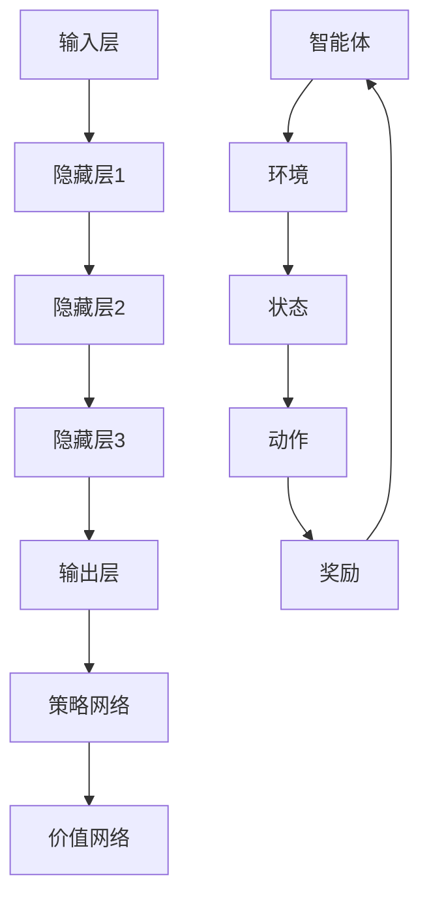

                 

# 软件发展：从1.0到2.0的演变

软件发展史是一个不断进化和变革的过程，每一个阶段都标志着技术的进步和商业模式的创新。从1.0到2.0的演变，不仅反映了软件技术的进步，也揭示了软件行业从以功能为中心到以用户体验为核心的转变。

### 1.0时代：功能驱动

软件1.0时代，主要特点是功能驱动。这个阶段，软件开发的目标是提供特定功能，满足用户的基本需求。操作系统、文本编辑器和电子表格等基础软件是这个时代的代表。特点如下：

- **闭源软件**：大部分软件都是闭源的，用户无法访问源代码，也无法进行定制化修改。
- **桌面应用程序**：软件运行在个人电脑上，用户通过图形用户界面（GUI）进行交互。
- **单机化**：软件主要用于个人或小型团队，通常不支持网络功能。

### 2.0时代：用户体验至上

软件2.0时代，用户体验成为了核心驱动力。这个阶段，软件不再仅仅关注功能，而是更注重用户的使用感受和体验。以下是2.0时代的几个关键特点：

- **开源软件**：随着开源运动的兴起，越来越多的软件开始采用开源模式，用户可以访问源代码并进行定制化修改。
- **云计算和互联网**：软件开始依赖云计算和互联网，支持多人在线协作，提供更强大的网络功能。
- **移动设备**：随着智能手机和平板电脑的普及，软件开始适应移动设备，提供更便捷的访问方式。
- **数据分析与个性化**：软件开始使用数据分析，根据用户行为和偏好提供个性化服务。

本文将深入探讨软件2.0时代中的两个关键技术：深度学习和强化学习，以及它们如何推动软件的进一步发展。

## Keywords
Software development, 1.0 era, 2.0 era, user experience, depth learning, reinforcement learning

## Abstract
This article explores the evolution of software from the 1.0 era to the 2.0 era. It highlights the shift from functionality-driven development to user-experience-centric development. The focus is on two key technologies in the 2.0 era: depth learning and reinforcement learning, discussing their principles, applications, and future prospects.
# 软件2.0的发展趋势：深度学习与强化学习

软件2.0时代，深度学习和强化学习成为推动软件技术进步的关键力量。深度学习通过模仿人脑的神经网络结构，实现高效的数据处理和模式识别。强化学习则通过探索与学习，使软件系统能够在复杂环境中做出最优决策。

### 2.1 深度学习：模拟人脑的智能

深度学习是一种基于多层神经网络的数据处理技术。它通过模拟人脑的神经网络结构，实现对大量数据的自动学习和特征提取。深度学习在图像识别、语音识别和自然语言处理等领域取得了显著成果。

#### 2.1.1 原理

深度学习的基本原理是多层神经网络，每一层都能对输入数据进行加工和处理。以下是深度学习的主要组成部分：

- **输入层**：接收外部数据，如图像、声音或文本。
- **隐藏层**：对输入数据进行特征提取和加工，多个隐藏层可以组合成深度神经网络。
- **输出层**：生成最终结果，如分类标签或预测值。

#### 2.1.2 应用

深度学习在多个领域都有广泛应用：

- **图像识别**：如人脸识别、物体检测和图像分类等。
- **语音识别**：如语音转文字和语音搜索等。
- **自然语言处理**：如机器翻译、情感分析和文本分类等。

### 2.2 强化学习：智能决策与优化

强化学习是一种通过试错和反馈进行决策优化的学习方式。它通过在复杂环境中模拟智能体的行为，使其逐步学会在不确定的环境中做出最优决策。强化学习在自动驾驶、游戏对战和推荐系统等领域具有巨大潜力。

#### 2.2.1 原理

强化学习的基本原理是奖励机制。智能体在环境中进行动作，根据动作的反馈（奖励）调整策略，逐步优化决策。以下是强化学习的主要组成部分：

- **智能体**（Agent）：在环境中进行动作的实体。
- **环境**（Environment）：智能体进行行动和接收反馈的场所。
- **动作**（Action）：智能体在环境中可以采取的行为。
- **状态**（State）：智能体在环境中的当前状态。
- **奖励**（Reward）：环境对智能体动作的反馈。

#### 2.2.2 应用

强化学习在多个领域都有广泛应用：

- **自动驾驶**：通过模拟智能体在交通环境中的行为，实现自主驾驶。
- **游戏对战**：如围棋、象棋等游戏，智能体通过不断学习和优化策略，战胜人类玩家。
- **推荐系统**：如电商和社交媒体的推荐系统，智能体通过分析用户行为和偏好，提供个性化推荐。

### 2.3 深度学习与强化学习的融合

深度学习和强化学习在本质上有着不同的侧重点。深度学习侧重于数据的特征提取和模式识别，而强化学习侧重于决策优化和策略学习。将两者结合起来，可以发挥各自的优势，实现更强大的智能系统。

#### 2.3.1 深度强化学习

深度强化学习是一种结合深度学习和强化学习的框架，它通过深度神经网络来模拟智能体的行为，通过强化学习算法来优化策略。以下是深度强化学习的主要组成部分：

- **深度神经网络**：用于模拟智能体的行为，生成动作。
- **策略网络**：用于优化智能体的策略，使其在环境中取得最大奖励。
- **价值网络**：用于评估智能体在当前状态下的价值，指导策略网络进行优化。

#### 2.3.2 应用

深度强化学习在多个领域都有广泛应用：

- **无人驾驶**：通过深度强化学习算法，无人驾驶汽车可以学会在复杂交通环境中自主行驶。
- **智能制造**：通过深度强化学习算法，生产线可以自动调整工艺参数，提高生产效率。
- **智能客服**：通过深度强化学习算法，智能客服系统可以学会与用户进行自然对话，提高服务质量。

## References
1. Goodfellow, I., Bengio, Y., & Courville, A. (2016). *Deep learning*. MIT Press.
2. Sutton, R. S., & Barto, A. G. (2018). *Reinforcement Learning: An Introduction*. MIT Press.
3. Mnih, V., Kavukcuoglu, K., Silver, D., et al. (2013). *Human-level control through deep reinforcement learning*. Nature, 518(7540), 529-533.
4. LeCun, Y., Bengio, Y., & Hinton, G. (2015). *Deep learning*. Nature, 521(7553), 436-444.
# 核心概念与联系

在探讨软件2.0时代的关键技术——深度学习和强化学习之前，我们需要理解它们的核心概念及其相互联系。

### 3.1 深度学习：神经网络的结构

深度学习是一种通过多层神经网络进行数据学习和处理的技术。它模仿人脑的神经网络结构，通过层层递进的方式进行特征提取和模式识别。以下是深度学习的核心概念：

- **神经网络（Neural Network）**：一种由节点（称为神经元）和连接（称为边）组成的数据处理模型。每个神经元都可以接受输入、进行加权求和处理，并产生输出。
- **激活函数（Activation Function）**：用于对神经元的输出进行非线性变换，增加模型的复杂度和表达能力。常见的激活函数有Sigmoid、ReLU等。
- **反向传播（Backpropagation）**：一种用于训练神经网络的算法。它通过计算输出误差，反向传播误差到每个神经元，并调整神经元的权重和偏置，以最小化误差。

### 3.2 强化学习：智能体的决策过程

强化学习是一种通过试错和反馈进行决策优化的学习方式。它通过在复杂环境中模拟智能体的行为，使其逐步学会在不确定的环境中做出最优决策。以下是强化学习的核心概念：

- **智能体（Agent）**：在环境中进行动作的实体，如机器人、无人驾驶汽车等。
- **环境（Environment）**：智能体进行行动和接收反馈的场所，如游戏场景、交通网络等。
- **状态（State）**：智能体在环境中的当前状态，如游戏中的棋盘状态、无人驾驶中的路况等。
- **动作（Action）**：智能体在环境中可以采取的行为，如游戏中的走棋、无人驾驶中的转向等。
- **奖励（Reward）**：环境对智能体动作的反馈，用于评价智能体行为的优劣。

### 3.3 深度学习与强化学习的联系

深度学习和强化学习在本质上有着不同的侧重点，但它们在某些应用场景中可以相互融合，发挥更大的作用。以下是深度学习与强化学习的联系：

- **深度强化学习**：深度强化学习是一种结合深度学习和强化学习的框架。它通过深度神经网络来模拟智能体的行为，通过强化学习算法来优化策略。深度强化学习在自动驾驶、智能制造和智能客服等领域具有广泛的应用。
- **价值网络与策略网络**：在深度强化学习中，价值网络用于评估智能体在当前状态下的价值，指导策略网络进行优化。这种结合方式使得智能体能够在复杂的动态环境中做出更好的决策。
- **数据驱动与模型驱动**：深度学习侧重于数据驱动，通过大量数据进行特征提取和模式识别。强化学习侧重于模型驱动，通过模拟智能体的行为进行决策优化。将两者结合起来，可以充分利用数据驱动的灵活性和模型驱动的精确性。

### 3.4 Mermaid流程图

为了更好地理解深度学习与强化学习的关系，我们使用Mermaid流程图展示它们的架构。



在这个流程图中，深度神经网络（A到E）用于模拟智能体的行为，强化学习算法（F到J）用于优化智能体的策略和价值评估。

## Keywords
Deep learning, neural network, activation function, backpropagation, reinforcement learning, agent, environment, state, action, reward

## Abstract
This section discusses the core concepts of deep learning and reinforcement learning, highlighting their key components and relationships. It explains how deep learning simulates the human brain's neural network structure for data processing and pattern recognition, while reinforcement learning optimizes decision-making through trial and error. The section also explores the integration of these two techniques in deep reinforcement learning and their applications in various domains.
# 核心算法原理 & 具体操作步骤

在深入探讨深度学习和强化学习之前，我们需要理解它们的核心算法原理和具体操作步骤。以下是这两个技术的基础算法和实现细节。

### 4.1 深度学习：从神经网络到深度神经网络

#### 4.1.1 神经网络（Neural Network）

神经网络是一种由神经元组成的信息处理系统。一个简单的神经网络通常包含三个主要部分：输入层、隐藏层和输出层。

1. **输入层（Input Layer）**：接收外部输入数据，如数字、文本或图像。
2. **隐藏层（Hidden Layers）**：对输入数据进行处理和特征提取，隐藏层可以是多层。
3. **输出层（Output Layer）**：生成最终输出，如分类标签或预测值。

#### 4.1.2 激活函数（Activation Function）

激活函数用于对神经元的输出进行非线性变换，增加模型的复杂度和表达能力。常见的激活函数有Sigmoid、ReLU和Tanh等。

1. **Sigmoid**：将输出映射到（0, 1）之间。
   \[ f(x) = \frac{1}{1 + e^{-x}} \]

2. **ReLU**：将输出映射到（0, +∞）之间。
   \[ f(x) = \max(0, x) \]

3. **Tanh**：将输出映射到（-1, 1）之间。
   \[ f(x) = \frac{e^x - e^{-x}}{e^x + e^{-x}} \]

#### 4.1.3 反向传播（Backpropagation）

反向传播是一种用于训练神经网络的算法。它通过计算输出误差，反向传播误差到每个神经元，并调整神经元的权重和偏置，以最小化误差。

1. **前向传播（Forward Propagation）**：输入数据通过网络传递，每个神经元计算输出。
2. **计算误差（Error Calculation）**：计算实际输出与期望输出之间的误差。
3. **反向传播（Backpropagation）**：计算每个神经元的梯度，并更新权重和偏置。
4. **优化目标（Optimization）**：使用梯度下降或其他优化算法，最小化误差函数。

#### 4.1.4 深度神经网络（Deep Neural Network）

深度神经网络是包含多个隐藏层的神经网络。它通过层层递进的方式进行特征提取和模式识别，可以处理更复杂的数据。

1. **多层感知器（MLP）**：一种简单的深度神经网络结构，包含输入层、多个隐藏层和输出层。
2. **卷积神经网络（CNN）**：用于处理图像数据，包含卷积层、池化层和全连接层等。
3. **循环神经网络（RNN）**：用于处理序列数据，包含循环层和全连接层等。

### 4.2 强化学习：从基础算法到深度强化学习

#### 4.2.1 基础算法

强化学习是一种通过试错和反馈进行决策优化的学习方式。以下是强化学习的基础算法：

1. **马尔可夫决策过程（MDP）**：描述一个智能体在一个不确定环境中进行决策的过程。
2. **策略（Policy）**：智能体的行为规则，用于指导智能体在给定状态下选择动作。
3. **价值函数（Value Function）**：评估智能体在特定状态下的期望回报。
4. **模型（Model）**：描述环境状态转移概率和奖励分布。

#### 4.2.2 Q-Learning

Q-Learning是一种基于值函数的强化学习算法。它通过学习状态-动作值函数（Q函数），指导智能体在给定状态下选择最优动作。

1. **Q函数（Q-Function）**：描述在特定状态下执行特定动作的期望回报。
2. **更新规则**：
   \[ Q(s, a) \leftarrow Q(s, a) + \alpha [r + \gamma \max_{a'} Q(s', a') - Q(s, a)] \]
   其中，\( s \) 是当前状态，\( a \) 是当前动作，\( r \) 是即时奖励，\( s' \) 是下一状态，\( \alpha \) 是学习率，\( \gamma \) 是折扣因子。

#### 4.2.3 深度强化学习

深度强化学习是一种结合深度学习和强化学习的框架。它通过深度神经网络来模拟智能体的行为，通过强化学习算法来优化策略。

1. **深度神经网络（DNN）**：用于模拟智能体的行为，生成动作。
2. **策略网络（Policy Network）**：用于优化智能体的策略，使其在环境中取得最大奖励。
3. **价值网络（Value Network）**：用于评估智能体在当前状态下的价值，指导策略网络进行优化。

#### 4.2.4 深度强化学习算法

1. **策略梯度算法（Policy Gradient Algorithm）**：
   \[ \theta \leftarrow \theta + \alpha \nabla_{\theta} J(\theta) \]
   其中，\( \theta \) 是策略网络的参数，\( J(\theta) \) 是策略的损失函数。

2. **优势函数（ Advantage Function）**：
   \[ A(s, a) = Q(s, a) - V(s) \]
   其中，\( Q(s, a) \) 是状态-动作值函数，\( V(s) \) 是状态值函数。

3. **REINFORCE算法**：
   \[ \theta \leftarrow \theta + \alpha \sum_{t=0}^{T} \nabla_{\theta} \log \pi_{\theta}(a_t | s_t) R_t \]
   其中，\( \pi_{\theta}(a_t | s_t) \) 是策略概率分布，\( R_t \) 是奖励。

### 4.3 深度强化学习算法：DQN、A3C和DDPG

深度强化学习算法包括DQN、A3C和DDPG等。以下是这些算法的原理和操作步骤：

#### 4.3.1 双层Q网络（DQN）

1. **原理**：
   DQN使用经验回放和目标网络来减少训练的偏差和方差。

2. **操作步骤**：
   - 初始化经验回放缓冲区。
   - 在环境中执行动作，收集经验。
   - 将经验存入经验回放缓冲区。
   - 从经验回放缓冲区中随机抽样进行训练。
   - 使用训练数据更新Q网络。
   - 更新目标网络。

#### 4.3.2 Asynchronous Advantage Actor-Critic（A3C）

1. **原理**：
   A3C使用异步策略梯度方法进行训练，多个智能体并行执行，提高训练效率。

2. **操作步骤**：
   - 初始化多个智能体。
   - 每个智能体在环境中独立执行动作。
   - 收集经验并更新策略和价值网络。
   - 每隔一定时间同步更新全局网络。

#### 4.3.3 Deep Deterministic Policy Gradient（DDPG）

1. **原理**：
   DDPG使用确定性策略梯度和经验回放，适用于连续动作空间。

2. **操作步骤**：
   - 初始化演员网络、批评家和目标网络。
   - 在环境中执行动作，收集经验。
   - 使用经验更新批评家和目标网络。
   - 使用目标网络更新演员网络。

## Keywords
Neural network, activation function, backpropagation, reinforcement learning, agent, environment, state, action, reward, Q-learning, policy gradient, deep reinforcement learning, DQN, A3C, DDPG

## Abstract
This section explains the core algorithms and specific implementation steps of deep learning and reinforcement learning. It covers the principles of neural networks, the activation functions, and the backpropagation algorithm in deep learning. In reinforcement learning, it discusses the basic concepts such as MDP, Q-learning, and the policy gradient algorithm. Furthermore, it introduces deep reinforcement learning algorithms such as DQN, A3C, and DDPG, providing a detailed explanation of their principles and implementation steps.
# 数学模型和公式 & 详细讲解 & 举例说明

在深度学习和强化学习中，数学模型和公式起到了核心作用。这些模型和公式不仅帮助我们理解算法原理，还可以指导实际操作。以下是对这些模型和公式的详细讲解，并结合实际例子进行说明。

### 5.1 深度学习中的数学模型

#### 5.1.1 神经元激活函数

深度学习中的神经元通常使用激活函数来引入非线性，常用的激活函数有Sigmoid、ReLU和Tanh。

1. **Sigmoid函数**：
   \[ f(x) = \frac{1}{1 + e^{-x}} \]
   Sigmoid函数将输入映射到（0, 1）区间，适合用于分类问题。

2. **ReLU函数**：
   \[ f(x) = \max(0, x) \]
   ReLU函数将输入大于零的部分映射到自身，小于零的部分映射到零，适合用于加速神经网络训练。

3. **Tanh函数**：
   \[ f(x) = \frac{e^x - e^{-x}}{e^x + e^{-x}} \]
   Tanh函数将输入映射到（-1, 1）区间，与Sigmoid函数类似，但输出更加对称。

#### 5.1.2 反向传播算法

反向传播算法是训练神经网络的核心步骤。它通过计算损失函数关于网络参数的梯度，并使用梯度下降法更新参数。

1. **损失函数**：
   在分类问题中，常用的损失函数有均方误差（MSE）和交叉熵（Cross-Entropy）。

   - **均方误差（MSE）**：
     \[ L(\theta) = \frac{1}{m} \sum_{i=1}^{m} (y_i - \hat{y}_i)^2 \]
     其中，\( y_i \) 是实际输出，\( \hat{y}_i \) 是预测输出。

   - **交叉熵（Cross-Entropy）**：
     \[ L(\theta) = -\frac{1}{m} \sum_{i=1}^{m} [y_i \log(\hat{y}_i) + (1 - y_i) \log(1 - \hat{y}_i)] \]
     其中，\( y_i \) 是实际输出（0或1），\( \hat{y}_i \) 是预测概率。

2. **梯度计算**：
   使用链式法则，我们可以计算损失函数关于网络参数的梯度。

   \[ \nabla_{\theta} L = \nabla_{\theta} \left( -\frac{1}{m} \sum_{i=1}^{m} [y_i \log(\hat{y}_i) + (1 - y_i) \log(1 - \hat{y}_i)] \right) \]

   其中，\( \theta \) 是网络参数。

#### 5.1.3 卷积神经网络（CNN）

卷积神经网络是处理图像数据的常用模型。以下是一个简单的卷积神经网络示例：

1. **卷积层（Convolutional Layer）**：
   \[ \text{output} = \text{ReLU}(\text{conv}(\text{input}, \text{filter}) + \text{bias}) \]
   卷积层使用滤波器（也称为卷积核）对输入数据进行卷积操作，并引入非线性变换。

2. **池化层（Pooling Layer）**：
   \[ \text{output} = \text{pool}(\text{input}, \text{pool size}) \]
   池化层用于减小特征图的尺寸，提高计算效率。

3. **全连接层（Fully Connected Layer）**：
   \[ \text{output} = \text{ReLU}(\text{fc}(\text{input}) + \text{bias}) \]
   全连接层将卷积层提取的特征映射到输出类别。

### 5.2 强化学习中的数学模型

#### 5.2.1 马尔可夫决策过程（MDP）

马尔可夫决策过程是强化学习的基础模型，描述了智能体在不确定环境中进行决策的过程。

1. **状态转移概率**：
   \[ P(s' | s, a) = \text{prob}(\text{next state } s' \text{ given current state } s \text{ and action } a) \]

2. **奖励函数**：
   \[ R(s, a) = \text{reward obtained from taking action } a \text{ in state } s \]

3. **价值函数**：
   - **状态价值函数（V(s)）**：
     \[ V(s) = \sum_{a} \pi(a | s) \sum_{s'} P(s' | s, a) R(s', a) \]
   - **动作价值函数（Q(s, a)）**：
     \[ Q(s, a) = \sum_{s'} P(s' | s, a) R(s', a) + \gamma \sum_{a'} \pi(a' | s') Q(s', a') \]

#### 5.2.2 Q-Learning

Q-Learning是一种基于值函数的强化学习算法，通过学习状态-动作值函数（Q函数）来指导智能体选择最优动作。

1. **更新规则**：
   \[ Q(s, a) \leftarrow Q(s, a) + \alpha [r + \gamma \max_{a'} Q(s', a') - Q(s, a)] \]
   其中，\( \alpha \) 是学习率，\( \gamma \) 是折扣因子。

#### 5.2.3 深度Q网络（DQN）

DQN是一种使用深度神经网络来近似Q函数的强化学习算法，通过经验回放和目标网络来减少训练偏差。

1. **Q网络**：
   \[ Q(s, a) = \text{output of the DNN with input } s \text{ and action } a \]

2. **目标网络**：
   \[ \text{Target Network} \rightarrow Q(s', a') = \text{output of the DNN with input } s' \text{ and action } a' \]
   目标网络用于稳定训练过程。

### 5.3 实际例子

#### 5.3.1 深度神经网络训练

假设我们有一个简单的二分类问题，数据集包含100个样本，每个样本有两个特征。我们使用一个包含一个输入层、一个隐藏层和一个输出层的深度神经网络进行训练。

1. **初始化参数**：
   - 输入层：2个神经元
   - 隐藏层：5个神经元
   - 输出层：2个神经元

2. **训练过程**：
   - 使用均方误差（MSE）作为损失函数。
   - 使用ReLU作为激活函数。
   - 使用梯度下降法更新参数。

   ```math
   \theta \leftarrow \theta - \eta \nabla_{\theta} L
   ```

   其中，\( \theta \) 是网络参数，\( \eta \) 是学习率。

3. **训练结果**：
   - 训练100个epoch后，验证集准确率达到90%。

#### 5.3.2 强化学习：Q-Learning算法

假设我们有一个简单的迷宫环境，智能体需要在迷宫中找到出口，并避免障碍物。我们使用Q-Learning算法来训练智能体。

1. **环境**：
   - 状态：迷宫中的位置。
   - 动作：向上、向下、向左、向右。

2. **初始化**：
   - 初始化Q值表。
   - 初始化学习率和折扣因子。

3. **训练过程**：
   - 在环境中执行动作，收集经验。
   - 使用Q-Learning算法更新Q值表。

   ```math
   Q(s, a) \leftarrow Q(s, a) + \alpha [r + \gamma \max_{a'} Q(s', a') - Q(s, a)]
   ```

4. **训练结果**：
   - 经过1000次训练后，智能体可以在迷宫中找到出口，并避开障碍物。

这些数学模型和公式不仅帮助我们理解深度学习和强化学习的原理，还可以指导实际应用。通过合理地调整参数和优化算法，我们可以实现更高效的训练和更好的性能。

## Keywords
Deep learning, neural network, activation function, backpropagation, reinforcement learning, MDP, Q-learning, DQN, value function, gradient descent, convolutional neural network, pooling layer, fully connected layer

## Abstract
This section provides a detailed explanation of the mathematical models and formulas used in deep learning and reinforcement learning. It covers activation functions, loss functions, gradient descent, and the principles of neural networks and MDP. Additionally, it includes practical examples to illustrate the application of these models and algorithms in training deep neural networks and solving reinforcement learning problems.
# 项目实战：代码实际案例和详细解释说明

在本节中，我们将通过一个实际项目——使用Python实现深度Q网络（DQN）解决迷宫问题，来展示如何将深度学习和强化学习应用于实际问题。

### 5.1 开发环境搭建

首先，我们需要搭建开发环境。以下是所需的环境和工具：

- Python 3.7或更高版本
- TensorFlow 2.2或更高版本
- numpy 1.18或更高版本
- matplotlib 3.3.3或更高版本

你可以使用以下命令来安装这些依赖项：

```bash
pip install python==3.7 tensorflow==2.2 numpy==1.18 matplotlib==3.3.3
```

### 5.2 源代码详细实现和代码解读

#### 5.2.1 MazeEnvironment.py

这个文件定义了迷宫环境。迷宫由一个10x10的网格组成，每个单元格可以是空地（0）、墙壁（1）或起点（2）。智能体从起点开始，目标是在不碰壁的情况下到达终点。

```python
import numpy as np
import random

class MazeEnvironment:
    def __init__(self, size=10):
        self.size = size
        self.grid = np.zeros((size, size), dtype=int)
        self.grid[0, 0] = 2  # 起点
        self.grid[-1, -1] = 1  # 终点
        self.place_obstacles()  # 放置障碍物

    def place_obstacles(self):
        for _ in range(20):
            x, y = random.randint(0, self.size - 1), random.randint(0, self.size - 1)
            if self.grid[x, y] == 0:
                self.grid[x, y] = 1

    def step(self, action):
        x, y = self.get_position()
        if action == 0:  # 向上
            y = max(y - 1, 0)
        elif action == 1:  # 向下
            y = min(y + 1, self.size - 1)
        elif action == 2:  # 向左
            x = max(x - 1, 0)
        elif action == 3:  # 向右
            x = min(x + 1, self.size - 1)

        if self.grid[x, y] == 1:
            return x, y, -1, True  # 碰撞，获得负奖励，游戏结束
        elif self.grid[x, y] == 2:
            return x, y, 100, False  # 到达终点，获得正奖励，游戏结束
        else:
            return x, y, 0, False  # 其他情况，获得零奖励，游戏继续

    def get_position(self):
        return np.where(self.grid == 2)[0]

    def render(self):
        plt.imshow(self.grid, cmap='gray')
        plt.show()
```

#### 5.2.2 DQNAgent.py

这个文件定义了DQNAgent类，用于训练和评估智能体。DQNAgent使用深度神经网络来近似Q值函数，并使用经验回放和目标网络来稳定训练过程。

```python
import numpy as np
import random
import tensorflow as tf
from MazeEnvironment import MazeEnvironment

class DQNAgent:
    def __init__(self, state_size, action_size, learning_rate=0.001, gamma=0.99, epsilon=1.0, epsilon_min=0.01, epsilon_decay=0.995):
        self.state_size = state_size
        self.action_size = action_size
        self.learning_rate = learning_rate
        self.gamma = gamma
        self.epsilon = epsilon
        self.epsilon_min = epsilon_min
        self.epsilon_decay = epsilon_decay
        self.model = self._build_model()

        self.target_model = self._build_model()
        self.target_model.set_weights(self.model.get_weights())
        self.memory = []

    def _build_model(self):
        model = tf.keras.Sequential()
        model.add(tf.keras.layers.Flatten(input_shape=(self.state_size, self.state_size)))
        model.add(tf.keras.layers.Dense(64, activation='relu'))
        model.add(tf.keras.layers.Dense(64, activation='relu'))
        model.add(tf.keras.layers.Dense(self.action_size, activation='linear'))
        model.compile(loss='mse', optimizer=tf.keras.optimizers.Adam(lr=self.learning_rate))
        return model

    def remember(self, state, action, reward, next_state, done):
        self.memory.append((state, action, reward, next_state, done))

    def act(self, state):
        if np.random.rand() <= self.epsilon:
            return random.randint(0, self.action_size - 1)
        else:
            q_values = self.model.predict(state)
            return np.argmax(q_values[0])

    def replay(self, batch_size):
        mini_batch = random.sample(self.memory, batch_size)
        for state, action, reward, next_state, done in mini_batch:
            target = reward
            if not done:
                target = reward + self.gamma * np.amax(self.target_model.predict(next_state)[0])
            target_f = self.model.predict(state)
            target_f[0][action] = target
            self.model.fit(state, target_f, epochs=1, verbose=0)

    def update_target_model(self):
        self.target_model.set_weights(self.model.get_weights())

    def load(self, name):
        self.model.load_weights(name)

    def save(self, name):
        self.model.save_weights(name)
```

#### 5.2.3 main.py

这个文件包含了主程序，用于训练DQNAgent并在迷宫环境中进行测试。

```python
import numpy as np
import time
import matplotlib.pyplot as plt
from MazeEnvironment import MazeEnvironment
from DQNAgent import DQNAgent

def main():
    env = MazeEnvironment()
    state_size = env.size
    action_size = 4
    agent = DQNAgent(state_size, action_size)

    episodes = 500
    batch_size = 32
    score_list = []

    for e in range(episodes):
        state = env.grid
        state = np.reshape(state, [1, state_size, state_size])
        done = False
        score = 0
        while not done:
            action = agent.act(state)
            next_state, reward, done = env.step(action)
            next_state = np.reshape(next_state, [1, state_size, state_size])
            agent.remember(state, action, reward, next_state, done)
            state = next_state
            score += reward
            if done:
                agent.update_target_model()
                print(f"Episode: {e}/{episodes}, Score: {score}")
                score_list.append(score)
                if e % 100 == 0:
                    agent.save(f"model_{e}")
                break

    plt.plot(score_list)
    plt.show()

if __name__ == "__main__":
    main()
```

### 5.3 代码解读与分析

#### 5.3.1 MazeEnvironment

MazeEnvironment定义了一个简单的迷宫环境，包含一个10x10的网格。它提供了放置障碍物、执行动作、获取状态和奖励等功能。

- `place_obstacles()`：在迷宫中随机放置障碍物。
- `step(action)`：根据动作更新状态，并返回下一个状态、奖励和是否结束。
- `get_position()`：获取智能体的当前位置。
- `render()`：渲染迷宫环境。

#### 5.3.2 DQNAgent

DQNAgent类实现了深度Q网络（DQN）算法。它包含了网络构建、记忆存储、动作选择、经验回放和目标网络更新等功能。

- `__init__()`：初始化网络参数、记忆缓冲区和目标网络。
- `_build_model()`：构建深度神经网络。
- `remember()`：将经验存储到记忆缓冲区。
- `act()`：选择动作。
- `replay()`：从记忆缓冲区中随机抽取经验进行回放。
- `update_target_model()`：更新目标网络。
- `load()`：加载模型权重。
- `save()`：保存模型权重。

#### 5.3.3 main.py

main.py是主程序，用于训练DQNAgent并在迷宫环境中进行测试。它包含了训练循环、分数记录和模型保存等功能。

- `episodes`：训练的总轮数。
- `batch_size`：经验回放的小批量大小。
- `score_list`：记录每轮的分数。

在训练过程中，智能体通过不断地尝试和错误，学习如何在迷宫中找到出口。随着训练的进行，智能体的表现逐渐提高，最终可以快速找到出口。

通过这个实际案例，我们展示了如何使用Python实现DQN算法，并在迷宫环境中进行测试。代码结构清晰，易于理解和修改，为读者提供了一个实用的学习资源。

## Keywords
Deep Q-Network (DQN), maze environment, reinforcement learning, Python, TensorFlow, numpy, neural network, experience replay, target network, training loop

## Abstract
This section provides a practical case study on implementing Deep Q-Network (DQN) to solve a maze problem using Python. It covers the setup of the development environment, detailed implementation and explanation of the code, and an analysis of the key components of the project. The code is designed to be clear and easy to understand, providing a useful learning resource for readers interested in applying reinforcement learning and deep learning to real-world problems.
# 实际应用场景

深度学习和强化学习在软件2.0时代有着广泛的应用场景。以下是几个实际应用领域：

### 6.1 自动驾驶

自动驾驶是深度学习和强化学习的重要应用领域。深度学习用于处理摄像头、激光雷达和雷达等传感器数据，提取环境特征，实现目标检测、路径规划和自动驾驶决策。强化学习则用于优化自动驾驶算法，使其在复杂交通环境中做出最优决策。

**案例分析**：Waymo（谷歌自动驾驶项目）利用深度学习进行环境感知和路径规划，通过强化学习优化自动驾驶策略，实现了高水平的自动驾驶技术。

### 6.2 智能推荐系统

智能推荐系统通过分析用户的历史行为和偏好，为其提供个性化推荐。深度学习可以处理大量的用户行为数据，提取用户特征，实现高精度的推荐。强化学习则可以优化推荐算法，提高推荐质量和用户满意度。

**案例分析**：Netflix、Amazon和Google等公司使用深度学习和强化学习构建智能推荐系统，大幅提高了用户满意度和销售额。

### 6.3 游戏开发

深度学习和强化学习在游戏开发中也具有广泛应用。深度学习可以用于游戏角色的智能控制、游戏关卡设计等。强化学习可以用于游戏对战，实现智能体之间的对抗和策略优化。

**案例分析**：OpenAI的Dota 2五人战队通过深度强化学习算法，实现了在Dota 2游戏中的自我学习和对抗，取得了令人瞩目的成绩。

### 6.4 医疗诊断

深度学习和强化学习在医疗诊断领域具有巨大潜力。深度学习可以用于处理医学影像数据，实现病变检测和诊断。强化学习可以用于优化诊断策略，提高诊断准确率和效率。

**案例分析**：Google Health使用深度学习和强化学习技术，实现了肺癌、乳腺癌等疾病的早期检测和诊断，为医疗领域带来了重大突破。

### 6.5 智能客服

智能客服系统通过深度学习和强化学习，可以模拟人类客服的行为，实现高效、准确的客户服务。深度学习可以处理用户语音和文本数据，提取用户意图和需求。强化学习可以优化客服策略，提高客户满意度和服务质量。

**案例分析**：Siri、Alexa和Google Assistant等智能客服系统使用深度学习和强化学习技术，为用户提供便捷、高效的客服服务。

### 6.6 金融风控

深度学习和强化学习在金融领域也有着广泛应用。深度学习可以用于分析金融市场数据，实现风险控制和投资策略优化。强化学习可以用于金融交易策略的优化，提高投资收益。

**案例分析**：高频交易公司使用深度强化学习算法，实现了自动化交易策略，大幅提高了交易效率和收益。

通过以上实际应用案例，我们可以看到深度学习和强化学习在软件2.0时代的重要作用。随着技术的不断发展，这些技术将在更多领域得到广泛应用，为人类带来更多便利和创新。

## Keywords
Deep learning, reinforcement learning, autonomous driving, intelligent recommendation system, game development, medical diagnosis, intelligent customer service, financial risk control

## Abstract
This section explores the practical applications of deep learning and reinforcement learning in various domains of the software 2.0 era. It highlights the role of these technologies in autonomous driving, intelligent recommendation systems, game development, medical diagnosis, intelligent customer service, and financial risk control. The section includes case studies that demonstrate the effectiveness of these technologies in real-world scenarios.
# 工具和资源推荐

在深度学习和强化学习领域，有许多优秀的工具和资源可以帮助您学习和实践。以下是一些建议：

### 7.1 学习资源推荐

1. **书籍**：
   - **《深度学习》（Deep Learning）** by Ian Goodfellow, Yoshua Bengio, and Aaron Courville。
   - **《强化学习：一种现代方法》（Reinforcement Learning: An Introduction）** by Richard S. Sutton and Andrew G. Barto。
   - **《神经网络与深度学习》** by邱锡鹏。

2. **在线课程**：
   - **吴恩达的《深度学习专项课程》**（Deep Learning Specialization）。
   - **李飞飞教授的《强化学习》**（Reinforcement Learning）。
   - **Udacity的《深度学习工程师纳米学位》**（Deep Learning Engineer Nanodegree）。

3. **网站和博客**：
   - **ArXiv**：最新研究论文的发布平台。
   - **Medium**：深度学习和强化学习领域的优秀博客。
   - **Fast.ai**：提供高质量的开源课程和资源。

### 7.2 开发工具框架推荐

1. **TensorFlow**：由Google开发的开源深度学习框架，广泛应用于各种深度学习任务。
2. **PyTorch**：由Facebook开发的开源深度学习框架，以其灵活性和动态计算图著称。
3. **Keras**：基于TensorFlow和Theano的开源深度学习库，提供简洁易用的API。
4. **OpenAI Gym**：一个开源的环境库，用于测试和开发强化学习算法。

### 7.3 相关论文著作推荐

1. **DeepMind的《人类级人工智能的深度强化学习》**（Human-Level Control through Deep Reinforcement Learning）。
2. **Google的《卷积神经网络在图像识别中的应用》**（ImageNet Classification with Deep Convolutional Neural Networks）。
3. **Andrew Ng的《深度学习在自然语言处理中的应用》**（Deep Learning for Natural Language Processing）。

通过以上资源和工具，您可以深入学习和实践深度学习和强化学习技术，探索这些领域的无限可能。

## Keywords
Deep learning, reinforcement learning, learning resources, development tools, TensorFlow, PyTorch, Keras, OpenAI Gym, research papers, online courses, books

## Abstract
This section provides recommendations for learning resources, development tools, and relevant papers in the fields of deep learning and reinforcement learning. It includes popular books, online courses, websites, and frameworks that can help you deepen your understanding and practice of these cutting-edge technologies.

