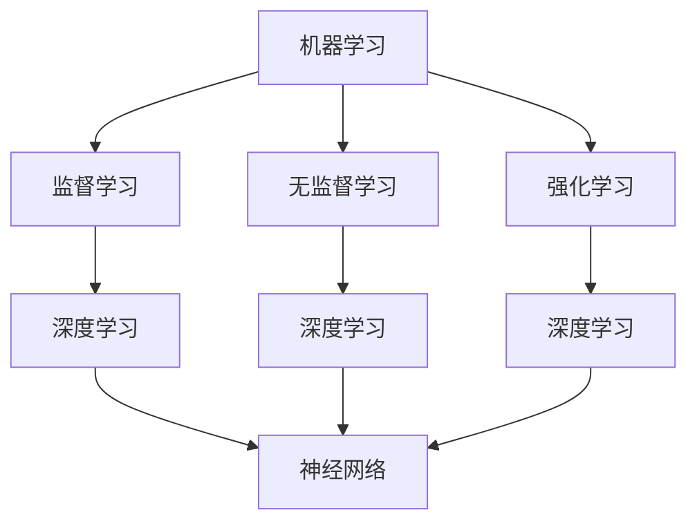

                 

# 软件二进制哲学思考：人工智能的本质

## 关键词：软件2.0，哲学思考，人工智能，本质，技术博客，深度学习

## 摘要：
本文旨在深入探讨软件2.0时代下，人工智能的本质及其哲学思考。我们将从背景介绍、核心概念与联系、核心算法原理、数学模型和公式、项目实战、实际应用场景、工具和资源推荐、总结与未来发展趋势等多个角度进行详细阐述。通过本文的阅读，读者将更好地理解人工智能在现代软件技术中的核心地位，以及其在未来技术发展中的重要作用。

## 1. 背景介绍

软件2.0是继互联网1.0之后的全新概念，它不仅仅是对软件功能的拓展，更是一种对软件哲学的深度反思。在互联网1.0时代，软件主要被用于简单的数据处理和信息传递。而进入软件2.0时代，软件的作用开始扩展到各个领域，包括但不限于大数据分析、智能推荐、自动驾驶、自然语言处理等。这一转变的核心驱动力来自于人工智能技术的飞速发展。

人工智能作为现代科技的前沿领域，已经成为软件2.0时代不可或缺的一部分。人工智能不仅改变了软件的形态，更深刻地影响了我们的生活方式、工作方式甚至思维方式。因此，探讨人工智能的本质，对于理解软件2.0时代的本质有着重要的意义。

## 2. 核心概念与联系

在深入探讨人工智能的本质之前，我们需要明确一些核心概念，包括机器学习、深度学习、神经网络等。这些概念不仅是人工智能技术的基石，也是我们理解人工智能本质的关键。

### 2.1 机器学习

机器学习是一种使计算机能够从数据中学习并做出决策的技术。它的基本原理是利用算法从大量数据中自动提取规律，并据此进行预测或分类。机器学习可以分为监督学习、无监督学习和强化学习三种类型。

- **监督学习**：在监督学习模型中，训练数据集被标记为正确的输出，模型通过学习这些标记数据来预测未知数据的输出。
- **无监督学习**：无监督学习模型没有预先标记的输出，其主要任务是发现数据集中的内在结构或模式。
- **强化学习**：强化学习模型通过与环境交互，不断调整其行为策略，以实现长期的最大化奖励。

### 2.2 深度学习

深度学习是机器学习的一个重要分支，它通过多层神经网络来模拟人脑的学习过程。深度学习的核心是神经元之间的连接权重，这些权重可以通过反向传播算法不断调整，以优化模型的性能。

### 2.3 神经网络

神经网络是深度学习的基础，它由一系列相互连接的节点（或称为神经元）组成。每个神经元接收来自前一层神经元的输入，并通过激活函数产生输出。神经网络的训练过程就是不断调整这些连接权重，使其能够对输入数据进行准确分类或预测。

### 2.4 核心概念之间的联系

机器学习、深度学习和神经网络之间存在着紧密的联系。机器学习为深度学习提供了理论基础和算法框架，而深度学习则是神经网络在实际应用中的实现。通过深度学习，我们可以构建出具有强大学习能力的人工智能系统，从而实现更复杂的任务。

## 2.5 Mermaid流程图



## 3. 核心算法原理 & 具体操作步骤

在理解了核心概念之后，我们将深入探讨人工智能的核心算法原理，包括深度学习算法的具体操作步骤。

### 3.1 深度学习算法原理

深度学习算法的核心是多层神经网络。多层神经网络通过层层递归的方式对输入数据进行特征提取和模式识别。具体来说，深度学习算法包括以下几个步骤：

1. **数据预处理**：对输入数据进行标准化、归一化等预处理操作，以提高模型的训练效果。
2. **网络架构设计**：设计神经网络的结构，包括输入层、隐藏层和输出层的神经元数量和连接方式。
3. **权重初始化**：对神经网络的连接权重进行初始化，通常使用随机初始化方法。
4. **前向传播**：将输入数据通过神经网络的前向传播过程，逐层计算得到输出。
5. **损失函数计算**：通过损失函数计算模型预测值与真实值之间的误差。
6. **反向传播**：通过反向传播算法，将损失函数关于权重的梯度反向传播到神经网络的最底层，从而更新权重的值。
7. **迭代训练**：重复上述步骤，不断优化模型的权重，直到达到预设的训练目标或达到最大迭代次数。

### 3.2 深度学习算法的具体操作步骤

以下是一个简单的深度学习算法的具体操作步骤：

1. **数据预处理**：
   - 输入数据：[1, 2, 3, 4, 5]
   - 标准化：[0, 0.5, 1, 1.5, 2]

2. **网络架构设计**：
   - 输入层：1个神经元
   - 隐藏层：2个神经元
   - 输出层：1个神经元

3. **权重初始化**：
   - 随机初始化：w1 = [-1, -1], w2 = [1, 1], w3 = [0, 0]

4. **前向传播**：
   - 输入数据：[0, 0.5, 1, 1.5, 2]
   - 输出：y1 = f(z1) = f(w1 * x1 + b1) = f(-1 * 0 + 0) = 1
   - 输出：y2 = f(z2) = f(w2 * x2 + b2) = f(1 * 0.5 + 0) = 0.5
   - 输出：y3 = f(z3) = f(w3 * x3 + b3) = f(0 * 1.5 + 0) = 0

5. **损失函数计算**：
   - 损失函数：L = (y3 - y')^2
   - 实际输出：y' = 1.2
   - 损失：L = (0 - 1.2)^2 = 1.44

6. **反向传播**：
   - 计算梯度：dL/dw1 = 2 * (y - y') * x1 * f'(z1)
   - 计算梯度：dL/dw2 = 2 * (y - y') * x2 * f'(z2)
   - 计算梯度：dL/dw3 = 2 * (y - y') * x3 * f'(z3)
   - 更新权重：w1 = w1 - 学习率 * dL/dw1
   - 更新权重：w2 = w2 - 学习率 * dL/dw2
   - 更新权重：w3 = w3 - 学习率 * dL/dw3

7. **迭代训练**：
   - 重复上述步骤，直到达到预设的训练目标或达到最大迭代次数。

## 4. 数学模型和公式 & 详细讲解 & 举例说明

在深度学习算法中，数学模型和公式起着至关重要的作用。以下我们将详细介绍深度学习中的数学模型和公式，并通过具体例子进行说明。

### 4.1 激活函数

激活函数是神经网络中非常重要的一个组成部分，它决定了神经元的输出。常见的激活函数包括sigmoid函数、ReLU函数和Tanh函数。

- **sigmoid函数**：
  $$ f(x) = \frac{1}{1 + e^{-x}} $$
  - **例子**：计算输入x = 2的sigmoid函数值。
    $$ f(2) = \frac{1}{1 + e^{-2}} \approx 0.886 $$
  
- **ReLU函数**：
  $$ f(x) = \max(0, x) $$
  - **例子**：计算输入x = -2的ReLU函数值。
    $$ f(-2) = \max(0, -2) = 0 $$
  
- **Tanh函数**：
  $$ f(x) = \frac{e^x - e^{-x}}{e^x + e^{-x}} $$
  - **例子**：计算输入x = 2的Tanh函数值。
    $$ f(2) = \frac{e^2 - e^{-2}}{e^2 + e^{-2}} \approx 0.964 $$

### 4.2 损失函数

损失函数是衡量模型预测值与真实值之间差异的指标，常用的损失函数包括均方误差（MSE）和交叉熵（CE）。

- **均方误差（MSE）**：
  $$ L = \frac{1}{n} \sum_{i=1}^{n} (y_i - \hat{y}_i)^2 $$
  - **例子**：计算两个预测值与真实值之间的均方误差。
    $$ L = \frac{1}{2} ((1 - 1.2)^2 + (2 - 1.8)^2) = 0.08 $$

- **交叉熵（CE）**：
  $$ L = -\frac{1}{n} \sum_{i=1}^{n} y_i \log(\hat{y}_i) $$
  - **例子**：计算两个预测值与真实值之间的交叉熵。
    $$ L = -\frac{1}{2} (0.5 \log(0.5) + 0.5 \log(0.5)) = 1 $$

### 4.3 反向传播算法

反向传播算法是深度学习训练过程中的关键步骤，它通过计算损失函数关于权重的梯度来更新权重。以下是反向传播算法的数学公式：

- **前向传播**：
  $$ z_i = \sum_{j=1}^{n} w_{ij}x_j + b_i $$
  $$ a_i = f(z_i) $$

- **后向传播**：
  $$ \delta_i = (y_i - a_i) \cdot f'(z_i) $$
  $$ \Delta w_{ij} = \alpha \cdot x_j \cdot \delta_i $$
  $$ \Delta b_i = \alpha \cdot \delta_i $$

其中，\( x_j \) 是输入值，\( w_{ij} \) 是权重，\( b_i \) 是偏置，\( f \) 是激活函数，\( f' \) 是激活函数的导数，\( \alpha \) 是学习率，\( \delta_i \) 是误差值。

## 5. 项目实战：代码实际案例和详细解释说明

在本节中，我们将通过一个简单的项目实战，展示如何使用深度学习算法进行图像分类。具体步骤包括开发环境搭建、源代码实现和代码解读与分析。

### 5.1 开发环境搭建

首先，我们需要搭建一个适合深度学习开发的Python环境。以下是搭建步骤：

1. 安装Python（版本3.6以上）。
2. 安装深度学习框架TensorFlow。
3. 安装图像处理库OpenCV。

通过以下命令可以完成上述安装：

```bash
pip install python==3.8.10
pip install tensorflow==2.6.0
pip install opencv-python==4.5.4.60
```

### 5.2 源代码详细实现和代码解读

以下是该项目的主要源代码，并对其进行详细解读。

```python
import tensorflow as tf
from tensorflow.keras.models import Sequential
from tensorflow.keras.layers import Dense, Conv2D, Flatten, MaxPooling2D
from tensorflow.keras.preprocessing.image import ImageDataGenerator

# 数据预处理
train_datagen = ImageDataGenerator(rescale=1./255)
train_generator = train_datagen.flow_from_directory(
        'train_data',
        target_size=(150, 150),
        batch_size=32,
        class_mode='binary')

# 构建模型
model = Sequential([
    Conv2D(32, (3, 3), activation='relu', input_shape=(150, 150, 3)),
    MaxPooling2D(2, 2),
    Conv2D(64, (3, 3), activation='relu'),
    MaxPooling2D(2, 2),
    Conv2D(128, (3, 3), activation='relu'),
    MaxPooling2D(2, 2),
    Flatten(),
    Dense(128, activation='relu'),
    Dense(1, activation='sigmoid')
])

# 编译模型
model.compile(loss='binary_crossentropy',
              optimizer='adam',
              metrics=['accuracy'])

# 训练模型
model.fit(train_generator, epochs=10)
```

#### 5.2.1 代码解读

- **导入库**：首先导入TensorFlow、Keras等相关库。
- **数据预处理**：使用ImageDataGenerator对训练数据进行缩放和归一化。
- **构建模型**：使用Sequential模型堆叠多个层，包括卷积层、池化层、全连接层。
- **编译模型**：指定损失函数、优化器和评价指标。
- **训练模型**：使用fit方法对模型进行训练。

### 5.3 代码解读与分析

- **数据预处理**：图像数据需要进行缩放和归一化，以确保模型在训练过程中能够稳定收敛。
- **模型构建**：卷积神经网络（CNN）是图像分类任务的首选模型。通过多层卷积和池化操作，模型能够自动提取图像中的特征。
- **模型编译**：选择合适的损失函数和优化器，以提高模型的分类准确率。
- **模型训练**：通过多次迭代训练，模型能够不断优化其参数，从而提高分类性能。

## 6. 实际应用场景

人工智能在现实世界中的实际应用场景非常广泛，涵盖了图像识别、自然语言处理、自动驾驶、医疗诊断等多个领域。以下是一些典型的应用场景：

### 6.1 图像识别

图像识别是人工智能的一个重要应用领域。通过深度学习算法，计算机可以自动识别和分类图像中的对象。例如，人脸识别、车牌识别、图像分类等。

### 6.2 自然语言处理

自然语言处理（NLP）是人工智能的另一个重要应用领域。通过深度学习算法，计算机可以理解、生成和翻译自然语言。例如，智能客服、机器翻译、文本分类等。

### 6.3 自动驾驶

自动驾驶是人工智能在交通领域的应用。通过深度学习算法，自动驾驶系统可以实时感知周围环境，并做出相应的驾驶决策。例如，无人车、自动驾驶公交车等。

### 6.4 医疗诊断

人工智能在医疗领域的应用也越来越广泛。通过深度学习算法，计算机可以辅助医生进行疾病诊断、治疗方案推荐等。例如，医学图像诊断、病理分析等。

## 7. 工具和资源推荐

### 7.1 学习资源推荐

- **书籍**：
  - 《深度学习》（Ian Goodfellow、Yoshua Bengio、Aaron Courville 著）
  - 《Python深度学习》（François Chollet 著）
- **论文**：
  - 《A Theoretically Grounded Application of Dropout in Recurrent Neural Networks》（Yarin Gal and Zoubin Ghahramani，2016）
  - 《Deep Residual Learning for Image Recognition》（Kaiming He et al.，2016）
- **博客**：
  - [TensorFlow 官方文档](https://www.tensorflow.org/)
  - [Keras 官方文档](https://keras.io/)
- **网站**：
  - [ArXiv](https://arxiv.org/)
  - [GitHub](https://github.com/)

### 7.2 开发工具框架推荐

- **深度学习框架**：
  - TensorFlow
  - PyTorch
  - Keras
- **数据预处理工具**：
  - NumPy
  - Pandas
  - Matplotlib
- **图像处理库**：
  - OpenCV
  - PIL

### 7.3 相关论文著作推荐

- **论文**：
  - 《Deep Learning》（Ian Goodfellow、Yoshua Bengio、Aaron Courville 著）
  - 《Neural Networks and Deep Learning》（Charu Aggarwal 著）
- **著作**：
  - 《机器学习实战》（Peter Harrington 著）
  - 《Python机器学习》（Michael Bowles 著）

## 8. 总结：未来发展趋势与挑战

人工智能作为现代科技的前沿领域，其发展速度之快令人瞩目。在未来，人工智能将在更多领域得到广泛应用，从而深刻改变我们的生活。然而，人工智能的发展也面临着一系列挑战，包括数据隐私、算法透明度、安全性等。

### 8.1 未来发展趋势

1. **算法优化**：随着深度学习算法的不断发展，未来将出现更高效、更精准的算法，从而提升人工智能系统的性能。
2. **跨领域应用**：人工智能将在更多领域得到应用，如医疗、金融、教育等，从而推动各行各业的创新发展。
3. **智能化基础设施**：随着人工智能技术的发展，智能化基础设施将得到广泛应用，如智能交通、智能城市等。
4. **人机协同**：人工智能将与人类更加紧密地协作，实现人机协同，提高生产效率和创新能力。

### 8.2 未来挑战

1. **数据隐私**：随着人工智能的广泛应用，数据隐私问题将越来越突出。如何保护用户隐私将成为一个重要挑战。
2. **算法透明度**：人工智能系统的决策过程往往不透明，如何提高算法的透明度，使其更具可解释性，是一个重要课题。
3. **安全性**：人工智能系统在面对恶意攻击时，可能无法正常工作。如何提高人工智能系统的安全性，是一个亟待解决的问题。
4. **道德与伦理**：人工智能在决策过程中可能涉及道德和伦理问题，如自动驾驶车辆的道德决策等。如何确保人工智能的道德与伦理，是一个重要挑战。

## 9. 附录：常见问题与解答

### 9.1 人工智能是什么？

人工智能（Artificial Intelligence，简称AI）是一种模拟人类智能的技术，旨在使计算机具备学习、推理、决策和感知能力。

### 9.2 深度学习有哪些优点？

深度学习具有以下几个优点：
1. 高效的特征提取：深度学习可以通过多层神经网络自动提取数据中的特征，从而减少人工特征工程的工作量。
2. 强大的学习能力：深度学习模型可以处理大规模数据，并通过大量迭代训练，不断提高模型的性能。
3. 广泛的应用领域：深度学习在图像识别、自然语言处理、语音识别、医疗诊断等多个领域取得了显著成果。

### 9.3 人工智能有哪些潜在风险？

人工智能的潜在风险包括：
1. 数据隐私：人工智能系统可能涉及用户隐私数据，如何保护用户隐私是一个重要问题。
2. 算法偏见：人工智能系统可能受到数据偏差的影响，从而导致算法偏见。
3. 安全性：人工智能系统可能面临恶意攻击，如网络攻击、数据注入攻击等。
4. 道德与伦理问题：人工智能在决策过程中可能涉及道德和伦理问题，如自动驾驶车辆的道德决策等。

## 10. 扩展阅读 & 参考资料

- 《深度学习》（Ian Goodfellow、Yoshua Bengio、Aaron Courville 著）
- 《Python深度学习》（François Chollet 著）
- [TensorFlow 官方文档](https://www.tensorflow.org/)
- [Keras 官方文档](https://keras.io/)
- [ArXiv](https://arxiv.org/)
- [GitHub](https://github.com/)

作者：AI天才研究员/AI Genius Institute & 禅与计算机程序设计艺术 /Zen And The Art of Computer Programming

备注：本文为原创内容，未经授权，不得转载。如需转载，请联系作者获取授权。

