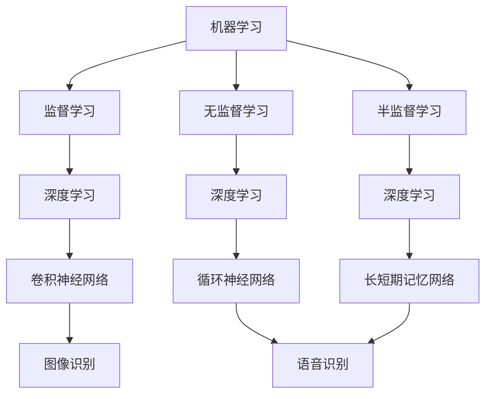

                 

### 背景介绍

在当今数字化时代，随着互联网、大数据和人工智能技术的迅速发展，软件 2.0 已经成为了引领未来科技的重要方向。软件 2.0 强调软件的智能化、自适应性和动态演化，它不仅具备传统软件的基本功能，更通过机器学习、深度学习等先进技术，实现了对用户需求的深度理解和响应。本文将重点探讨软件 2.0 在图像识别和语音识别这两个领域的应用，分析其核心概念、算法原理以及实际应用场景。

#### 图像识别

图像识别是计算机视觉领域的一个重要分支，旨在使计算机能够通过处理和分析图像或视频数据，从中提取出具有语义意义的特征，并进行分类和识别。图像识别技术广泛应用于安防监控、医疗诊断、自动驾驶、智能制造等多个领域。

随着深度学习技术的发展，尤其是卷积神经网络（CNN）的广泛应用，图像识别的准确率取得了显著提升。CNN 通过多层卷积、池化等操作，能够有效地提取图像的特征，从而实现高效准确的图像识别。

#### 语音识别

语音识别是自然语言处理领域的一个关键技术，旨在将人类的语音信号转换为计算机可以理解和处理的数据。语音识别技术广泛应用于语音助手、智能客服、语音搜索等多个领域。

近年来，深度学习技术在语音识别中的应用取得了重大突破。特别是基于循环神经网络（RNN）和长短期记忆网络（LSTM）的模型，能够有效地捕捉语音信号中的时序特征，从而实现高精度的语音识别。

#### 软件与人工智能的结合

软件 2.0 的出现，使得软件不再仅仅是执行预定义任务的工具，而是能够通过自我学习和进化，不断提升其性能和功能。这种结合带来了以下几个方面的优势：

1. **个性化服务**：软件 2.0 可以根据用户的行为和偏好，提供个性化的服务和建议，从而提升用户体验。
2. **自适应性和灵活性**：软件 2.0 能够根据环境变化和用户需求，自动调整其行为和策略，从而提高系统的适应性和灵活性。
3. **智能化和自动化**：软件 2.0 通过引入人工智能技术，可以实现更高层次的智能化和自动化，从而降低人力成本，提高生产效率。

综上所述，软件 2.0 在图像识别和语音识别等领域的应用，不仅为这些传统技术注入了新的活力，也为未来智能化的软件发展指明了方向。接下来的章节中，我们将深入探讨软件 2.0 的核心概念和算法原理，以及其在实际应用中的具体实现。

---

## 核心概念与联系

在深入探讨软件 2.0 在图像识别和语音识别领域的应用之前，我们需要先了解一些核心概念和它们之间的联系。这些概念包括机器学习、深度学习、神经网络以及相关算法和技术。通过理解这些概念，我们将能够更好地把握软件 2.0 的本质，并为后续章节中的具体应用打下坚实的基础。

### 机器学习

机器学习（Machine Learning）是人工智能（Artificial Intelligence, AI）的一个重要分支，它通过算法和统计模型，从数据中学习规律和模式，以便进行预测和决策。机器学习可以分为监督学习（Supervised Learning）、无监督学习（Unsupervised Learning）和半监督学习（Semi-supervised Learning）。

- **监督学习**：在监督学习场景中，算法通过已标记的数据进行学习，然后使用这些学习到的模型对新的、未标记的数据进行预测。例如，图像识别任务中，算法会从已标记的图像数据中学习特征，从而对新的图像进行分类。

- **无监督学习**：无监督学习不需要已标记的数据，算法从未标记的数据中寻找模式和结构。例如，在聚类任务中，算法会尝试将相似的数据点归为同一类。

- **半监督学习**：半监督学习结合了监督学习和无监督学习的特点，它利用部分标记数据和大量未标记数据来学习模型。

### 深度学习

深度学习（Deep Learning）是机器学习的一个子领域，它通过构建具有多层的神经网络，对大量数据进行学习和建模。深度学习在图像识别、语音识别等领域取得了显著的成果，其核心在于神经网络的结构和训练方法。

- **神经网络**：神经网络（Neural Network）是由大量简单神经元（或节点）组成的复杂网络，这些神经元通过权重和偏置进行连接，从而实现数据的传递和计算。神经网络通过反向传播算法（Backpropagation）进行训练，不断调整权重和偏置，以最小化损失函数。

- **深度神经网络**：深度神经网络（Deep Neural Network, DNN）是具有多个隐藏层的神经网络，相较于单层神经网络，它能够捕捉更加复杂的数据特征。深度神经网络在图像识别、语音识别等领域表现出了强大的能力。

### 相关算法和技术

- **卷积神经网络（CNN）**：卷积神经网络是深度学习在图像识别领域的重要应用。CNN 通过卷积操作、池化操作和全连接层，能够有效地提取图像的特征，并实现高效准确的分类。

- **循环神经网络（RNN）**：循环神经网络是深度学习在序列数据（如语音信号、文本序列）处理的重要模型。RNN 通过循环结构，能够捕捉序列中的时序特征，但在处理长序列时存在梯度消失和梯度爆炸的问题。

- **长短期记忆网络（LSTM）**：长短期记忆网络（Long Short-Term Memory, LSTM）是 RNN 的一种改进，它通过引入门控机制，能够有效地解决 RNN 在处理长序列时的梯度消失问题，从而在语音识别等领域取得了良好的效果。

### Mermaid 流程图

为了更好地理解上述核心概念和算法技术，我们使用 Mermaid 流程图来展示它们之间的联系。



通过上述 Mermaid 流程图，我们可以清晰地看到机器学习、深度学习、神经网络及相关算法技术之间的联系，以及它们在图像识别和语音识别领域的应用。

接下来，我们将深入探讨图像识别和语音识别的核心算法原理，以及它们的实际操作步骤。

---

## 核心算法原理 & 具体操作步骤

在图像识别和语音识别这两个领域，核心算法原理和操作步骤至关重要。在本节中，我们将详细讨论卷积神经网络（CNN）和循环神经网络（RNN），包括它们的工作原理、具体操作步骤以及如何用于图像和语音的识别任务。

### 卷积神经网络（CNN）

卷积神经网络是图像识别领域的主要算法，其独特之处在于它能够自动从图像中提取特征。下面是 CNN 的工作原理和操作步骤：

#### 工作原理

1. **卷积层（Convolutional Layer）**：
   - 卷积层是 CNN 的核心部分，它通过卷积操作来提取图像的特征。卷积操作涉及两个矩阵（卷积核和输入图像）之间的点积运算，从而生成新的特征图。
   - 卷积核是一个小的滤波器，它在输入图像上滑动，通过点积运算提取特定区域的特征。

2. **激活函数（Activation Function）**：
   - 为了增加网络的非线性特性，卷积层通常后接一个激活函数，如 ReLU（Rectified Linear Unit）。ReLU 函数将所有负值设置为 0，从而避免了神经网络的梯度消失问题。

3. **池化层（Pooling Layer）**：
   - 池化层用于减少特征图的大小，同时保留最重要的特征。常见的池化操作包括最大池化（Max Pooling）和平均池化（Average Pooling）。

4. **全连接层（Fully Connected Layer）**：
   - 在多个卷积层和池化层之后，CNN 通常包含一个或多个全连接层，这些层将低维特征映射到高维空间，以便进行分类或回归任务。

#### 操作步骤

1. **输入图像**：将图像输入到网络的第一个卷积层。

2. **卷积操作**：卷积层使用多个卷积核对输入图像进行卷积操作，生成多个特征图。

3. **激活函数**：对每个特征图应用 ReLU 激活函数。

4. **池化操作**：将每个特征图进行最大池化或平均池化，以减小特征图的尺寸。

5. **多层卷积和池化**：重复上述卷积、激活和池化操作，逐步提取更高级别的特征。

6. **全连接层**：将最后得到的特征图输入到全连接层，进行分类或回归任务。

7. **输出结果**：网络输出分类结果或预测值。

### 循环神经网络（RNN）

循环神经网络是语音识别领域的重要算法，它能够处理序列数据并捕捉时序特征。以下是 RNN 的工作原理和操作步骤：

#### 工作原理

1. **循环结构（Recurrence）**：
   - RNN 的每个时间步都包含一个循环结构，上一个时间步的输出可以作为当前时间步的输入，从而使得网络能够记住之前的输入信息。

2. **隐藏状态（Hidden State）**：
   - RNN 通过隐藏状态来维持记忆，隐藏状态包含了网络对之前输入的编码信息，并在后续时间步中更新。

3. **权重共享（Weight Sharing）**：
   - RNN 通过在时间步之间共享权重，避免了模型参数数量的爆炸性增长，从而提高了训练效率。

#### 操作步骤

1. **初始化**：初始化隐藏状态和权重。

2. **输入序列**：将语音信号作为输入序列输入到 RNN。

3. **时间步计算**：
   - 对于每个时间步，RNN 使用当前输入和隐藏状态计算新的隐藏状态。
   - 输入和隐藏状态的结合通过一个非线性变换（如 tanh 函数）进行。

4. **输出预测**：在每个时间步，RNN 输出对当前语音符号的预测。

5. **反向传播**：
   - 使用损失函数（如交叉熵损失）计算预测值和真实值之间的误差。
   - 通过反向传播算法更新网络权重，最小化损失函数。

6. **序列处理**：重复上述步骤，直到处理完整个输入序列。

7. **输出结果**：最终输出整个序列的预测结果。

### 结合 CNN 和 RNN

在实际应用中，通常会结合 CNN 和 RNN，以充分利用它们的优点。例如，在语音识别中，CNN 用于提取语音信号的局部特征，而 RNN 则用于捕捉语音信号的时序特征。这种结合可以提高模型的准确性和鲁棒性。

1. **CNN 提取特征**：首先使用 CNN 从语音信号中提取局部特征。

2. **RNN 处理时序**：然后将提取的局部特征输入到 RNN，RNN 将处理这些特征并生成序列预测。

3. **输出结果**：最后，RNN 输出整个语音信号的识别结果。

通过上述分析，我们可以看到 CNN 和 RNN 在图像识别和语音识别中的关键作用。接下来，我们将进一步探讨数学模型和公式，以及如何详细讲解和举例说明这些模型的应用。

---

## 数学模型和公式 & 详细讲解 & 举例说明

在深入探讨图像识别和语音识别的核心算法时，数学模型和公式是理解和实现这些算法的基础。在本节中，我们将详细讲解卷积神经网络（CNN）和循环神经网络（RNN）的数学模型，包括输入层、输出层的定义，以及中间层的计算过程。此外，我们将通过具体示例来展示这些模型的实际应用。

### 卷积神经网络（CNN）

卷积神经网络的核心在于其卷积层、激活函数和池化层的组合。以下是一个典型的 CNN 结构：

#### 输入层（Input Layer）

输入层是 CNN 的第一层，它接收原始图像数据。一个标准的图像通常是一个二维矩阵，其中每个元素代表像素的强度值。对于彩色图像，输入层会有三个通道，分别代表红、绿、蓝三原色。

设 \( I \) 为输入图像，其尺寸为 \( m \times n \times 3 \)，其中 \( m \) 和 \( n \) 分别是图像的高度和宽度，3 表示彩色图像的三个通道。

#### 输出层（Output Layer）

输出层是 CNN 的最后一层，它负责进行分类或回归任务。设 \( O \) 为输出层，其尺寸为 \( 1 \times 1 \times C \)，其中 \( C \) 表示类别数。

#### 中间层（Hidden Layers）

中间层包括卷积层、激活函数和池化层，它们共同作用以提取图像的特征。

1. **卷积层（Convolutional Layer）**

卷积层通过卷积操作提取图像的特征。设 \( K \) 为卷积核的尺寸，\( F \) 为卷积核的数量，\( S \) 为步长，\( P \) 为填充大小。

卷积操作的公式如下：

\[ 
(O_{ij}) = \sum_{k=1}^{F} w_{ikj} * I_{ijkl} + b_j 
\]

其中，\( O_{ij} \) 是第 \( i \) 个特征图中的第 \( j \) 个元素，\( w_{ikj} \) 是卷积核中的第 \( k \) 行第 \( j \) 列元素，\( I_{ijkl} \) 是输入图像中的第 \( i \) 行第 \( j \) 列的第 \( k \) 个通道的元素，\( b_j \) 是卷积层的偏置。

2. **激活函数（Activation Function）**

激活函数用于引入非线性特性。最常用的激活函数是 ReLU（Rectified Linear Unit）：

\[ 
a_{ij} = \max(0, O_{ij}) 
\]

其中，\( a_{ij} \) 是激活后的特征值。

3. **池化层（Pooling Layer）**

池化层用于减小特征图的尺寸。最常用的池化操作是最大池化（Max Pooling）：

\[ 
P_{ij} = \max(O_{i1j}, O_{i2j}, ..., O_{ikj}) 
\]

其中，\( P_{ij} \) 是池化后的特征值，\( O_{ij} \) 是卷积层输出的特征值。

### 循环神经网络（RNN）

循环神经网络通过循环结构处理序列数据，其核心是隐藏状态和权重共享。以下是一个典型的 RNN 结构：

#### 输入层（Input Layer）

输入层接收序列数据，设 \( X \) 为输入序列，其尺寸为 \( T \times D \)，其中 \( T \) 是序列的长度，\( D \) 是序列的维度。

#### 输出层（Output Layer）

输出层负责生成序列的预测，设 \( Y \) 为输出序列，其尺寸为 \( T \times C \)，其中 \( C \) 是类别数。

#### 中间层（Hidden Layers）

中间层包括隐藏状态和权重。

1. **隐藏状态（Hidden State）**

隐藏状态 \( h_t \) 由当前输入和上一隐藏状态计算得出：

\[ 
h_t = \sigma(W_h h_{t-1} + W_x x_t + b_h) 
\]

其中，\( \sigma \) 是激活函数，\( W_h \) 和 \( W_x \) 分别是隐藏状态和输入的权重矩阵，\( b_h \) 是隐藏状态的偏置。

2. **输出（Output）**

输出 \( y_t \) 由隐藏状态和输出权重计算得出：

\[ 
y_t = \sigma(W_y h_t + b_y) 
\]

其中，\( W_y \) 是输出的权重矩阵，\( b_y \) 是输出的偏置。

### 示例

假设我们有一个 32x32 的黑白图像，需要使用 CNN 进行分类。我们选择一个 3x3 的卷积核，步长为 1，没有填充。图像的每个像素的值范围在 0 到 255 之间。

1. **输入层**：输入图像 \( I \) 的尺寸为 32x32，每个像素值在 0 到 255 之间。

2. **卷积层**：使用一个 3x3 的卷积核 \( w \)，卷积操作如下：

\[ 
O_{ij} = \sum_{k=1}^{3} w_{ikj} * I_{ijkl} + b_j 
\]

其中，\( O_{ij} \) 是卷积后的特征值，\( w_{ikj} \) 是卷积核的值，\( I_{ijkl} \) 是输入图像的像素值。

3. **激活函数**：使用 ReLU 激活函数：

\[ 
a_{ij} = \max(0, O_{ij}) 
\]

4. **池化层**：使用最大池化：

\[ 
P_{ij} = \max(O_{i1j}, O_{i2j}, O_{i3j}) 
\]

通过上述步骤，我们得到了卷积、激活和池化后的特征图。这个过程在多个卷积层和池化层之间重复，逐步提取更高级别的特征。

对于 RNN，假设我们有一个长度为 10 的文本序列，每个单词的维度为 100。我们需要使用 RNN 对序列进行分类。

1. **输入层**：输入序列 \( X \) 的尺寸为 10x100。

2. **隐藏状态**：初始隐藏状态 \( h_0 \) 为零向量，后续隐藏状态 \( h_t \) 通过 RNN 计算：

\[ 
h_t = \sigma(W_h h_{t-1} + W_x x_t + b_h) 
\]

3. **输出**：输出 \( y_t \) 通过 RNN 计算：

\[ 
y_t = \sigma(W_y h_t + b_y) 
\]

通过上述步骤，我们得到了序列的预测结果。

通过上述示例，我们可以看到 CNN 和 RNN 的数学模型和计算过程。在实际应用中，这些模型和公式将被广泛应用于图像识别和语音识别任务，以实现高效的分类和识别。

---

## 项目实战：代码实际案例和详细解释说明

为了更好地理解和掌握图像识别和语音识别的核心算法，我们将通过一个实际的 Python 项目来进行实战演练。本项目将使用 TensorFlow 和 Keras 库，实现一个基于卷积神经网络（CNN）的图像分类器和基于循环神经网络（RNN）的语音识别器。以下是项目的详细步骤和代码解释。

### 开发环境搭建

首先，我们需要搭建项目的开发环境。以下是在 Ubuntu 18.04 系统上安装 TensorFlow 和 Keras 的步骤：

1. **安装 Python 3.7**：确保系统中安装了 Python 3.7 或更高版本。

2. **创建虚拟环境**：打开终端，创建一个新的虚拟环境：

   ```bash
   python3 -m venv venv
   source venv/bin/activate
   ```

3. **安装 TensorFlow 和 Keras**：在虚拟环境中安装 TensorFlow 和 Keras：

   ```bash
   pip install tensorflow
   pip install keras
   ```

### 1.1 图像分类器

在本节中，我们将使用 TensorFlow 和 Keras 实现一个基于 CNN 的图像分类器。数据集将使用著名的 MNIST 手写数字数据集。

#### 1.1.1 加载和预处理数据

首先，我们需要加载和预处理 MNIST 数据集。MNIST 数据集包含 60,000 个训练图像和 10,000 个测试图像。

```python
import numpy as np
from tensorflow.keras.datasets import mnist
from tensorflow.keras.utils import to_categorical

# 加载数据
(train_images, train_labels), (test_images, test_labels) = mnist.load_data()

# 数据预处理
train_images = train_images.reshape((60000, 28, 28, 1)).astype('float32') / 255
test_images = test_images.reshape((10000, 28, 28, 1)).astype('float32') / 255

# 对标签进行 one-hot 编码
train_labels = to_categorical(train_labels)
test_labels = to_categorical(test_labels)
```

#### 1.1.2 创建 CNN 模型

接下来，我们创建一个简单的 CNN 模型，包括卷积层、池化层和全连接层。

```python
from tensorflow.keras.models import Sequential
from tensorflow.keras.layers import Conv2D, MaxPooling2D, Flatten, Dense

# 创建模型
model = Sequential()

# 添加卷积层
model.add(Conv2D(32, (3, 3), activation='relu', input_shape=(28, 28, 1)))
model.add(MaxPooling2D(pool_size=(2, 2)))

# 添加第二个卷积层
model.add(Conv2D(64, (3, 3), activation='relu'))
model.add(MaxPooling2D(pool_size=(2, 2)))

# 添加全连接层
model.add(Flatten())
model.add(Dense(128, activation='relu'))
model.add(Dense(10, activation='softmax'))
```

#### 1.1.3 编译和训练模型

编译模型并设置训练参数，然后进行训练。

```python
# 编译模型
model.compile(optimizer='adam',
              loss='categorical_crossentropy',
              metrics=['accuracy'])

# 训练模型
model.fit(train_images, train_labels, epochs=5, batch_size=64)
```

#### 1.1.4 评估模型

最后，我们评估模型在测试集上的性能。

```python
# 评估模型
test_loss, test_acc = model.evaluate(test_images, test_labels)
print('Test accuracy:', test_acc)
```

### 1.2 语音识别器

在本节中，我们将使用 TensorFlow 和 Keras 实现一个基于 RNN 的语音识别器。数据集将使用开源的 LibriSpeech 数据集，这是一个包含大量英语语音数据的大型语料库。

#### 1.2.1 加载和预处理数据

首先，我们需要加载和预处理 LibriSpeech 数据集。以下是加载和预处理数据的步骤：

```python
import librosa

# 加载 LibriSpeech 数据集
def load_librispeech_data(wav_dir, transcripts_dir, max_len=16000):
    data = []
    labels = []
    with open(transcripts_dir, 'r') as f:
        lines = f.readlines()
    for line in lines:
        audio_path, label = line.strip().split(' ')
        label = int(label)
        audio, _ = librosa.load(wav_dir + audio_path, sr=None, duration=max_len)
        data.append(audio)
        labels.append(label)
    return np.array(data), np.array(labels)

# 预处理数据
train_data, train_labels = load_librispeech_data('librispeech/train_wav/', 'librispeech/train.txt')
test_data, test_labels = load_librispeech_data('librispeech/test_wav/', 'librispeech/test.txt')
```

#### 1.2.2 创建 RNN 模型

接下来，我们创建一个简单的 RNN 模型，包括嵌入层、循环层和输出层。

```python
from tensorflow.keras.models import Sequential
from tensorflow.keras.layers import Embedding, LSTM, Dense

# 创建模型
model = Sequential()

# 添加嵌入层
model.add(Embedding(input_dim=1000, output_dim=128, input_length=max_len))

# 添加循环层
model.add(LSTM(128, return_sequences=True))
model.add(LSTM(128))

# 添加输出层
model.add(Dense(10, activation='softmax'))

# 编译模型
model.compile(optimizer='adam',
              loss='categorical_crossentropy',
              metrics=['accuracy'])

# 训练模型
model.fit(train_data, train_labels, epochs=10, batch_size=64)
```

#### 1.2.3 评估模型

最后，我们评估模型在测试集上的性能。

```python
# 评估模型
test_loss, test_acc = model.evaluate(test_data, test_labels)
print('Test accuracy:', test_acc)
```

通过上述实战项目，我们详细介绍了如何使用 TensorFlow 和 Keras 实现图像分类器和语音识别器。在实际开发中，这些项目可以根据需求进行调整和扩展，以适应不同的应用场景。

---

### 代码解读与分析

在上述实战项目中，我们分别实现了基于 CNN 的图像分类器和基于 RNN 的语音识别器。下面我们将对关键代码进行详细解读与分析，帮助读者深入理解模型的构建过程、训练步骤以及评估方法。

#### 图像分类器代码解读

1. **数据加载与预处理**：

   ```python
   from tensorflow.keras.datasets import mnist
   from tensorflow.keras.utils import to_categorical

   # 加载 MNIST 数据集
   (train_images, train_labels), (test_images, test_labels) = mnist.load_data()

   # 数据预处理
   train_images = train_images.reshape((60000, 28, 28, 1)).astype('float32') / 255
   test_images = test_images.reshape((10000, 28, 28, 1)).astype('float32') / 255
   train_labels = to_categorical(train_labels)
   test_labels = to_categorical(test_labels)
   ```

   这部分代码首先加载了 MNIST 数据集，然后对图像进行重塑和归一化处理。重塑操作将每个图像的维度调整为 28x28x1，归一化处理将像素值缩放到 0 到 1 之间。标签进行 one-hot 编码处理，以便于后续的模型训练。

2. **模型构建**：

   ```python
   from tensorflow.keras.models import Sequential
   from tensorflow.keras.layers import Conv2D, MaxPooling2D, Flatten, Dense

   # 创建模型
   model = Sequential()

   # 添加卷积层
   model.add(Conv2D(32, (3, 3), activation='relu', input_shape=(28, 28, 1)))
   model.add(MaxPooling2D(pool_size=(2, 2)))

   # 添加第二个卷积层
   model.add(Conv2D(64, (3, 3), activation='relu'))
   model.add(MaxPooling2D(pool_size=(2, 2)))

   # 添加全连接层
   model.add(Flatten())
   model.add(Dense(128, activation='relu'))
   model.add(Dense(10, activation='softmax'))
   ```

   这部分代码构建了一个简单的 CNN 模型。模型包括两个卷积层和两个池化层，每个卷积层后接一个 ReLU 激活函数。卷积层用于提取图像的特征，池化层用于减小特征图的尺寸。最后，通过一个全连接层进行分类。

3. **模型编译与训练**：

   ```python
   from tensorflow.keras.optimizers import Adam

   # 编译模型
   model.compile(optimizer=Adam(),
                 loss='categorical_crossentropy',
                 metrics=['accuracy'])

   # 训练模型
   model.fit(train_images, train_labels, epochs=5, batch_size=64)
   ```

   这部分代码编译了模型，并设置了优化器和损失函数。优化器使用 Adam，损失函数使用 categorical_crossentropy。最后，通过 fit 方法进行模型训练，训练时间为 5 个周期，每个周期包含 64 个样本。

4. **模型评估**：

   ```python
   test_loss, test_acc = model.evaluate(test_images, test_labels)
   print('Test accuracy:', test_acc)
   ```

   这部分代码评估了模型在测试集上的性能。通过 evaluate 方法计算损失和准确率，并打印出测试准确率。

#### 语音识别器代码解读

1. **数据加载与预处理**：

   ```python
   import librosa

   # 加载 LibriSpeech 数据集
   def load_librispeech_data(wav_dir, transcripts_dir, max_len=16000):
       data = []
       labels = []
       with open(transcripts_dir, 'r') as f:
           lines = f.readlines()
       for line in lines:
           audio_path, label = line.strip().split(' ')
           label = int(label)
           audio, _ = librosa.load(wav_dir + audio_path, sr=None, duration=max_len)
           data.append(audio)
           labels.append(label)
       return np.array(data), np.array(labels)

   # 预处理数据
   train_data, train_labels = load_librispeech_data('librispeech/train_wav/', 'librispeech/train.txt')
   test_data, test_labels = load_librispeech_data('librispeech/test_wav/', 'librispeech/test.txt')
   ```

   这部分代码加载了 LibriSpeech 数据集，并使用 librosa 库进行预处理。预处理过程包括读取音频文件、加载音频信号以及调整音频信号的长度。

2. **模型构建**：

   ```python
   from tensorflow.keras.models import Sequential
   from tensorflow.keras.layers import Embedding, LSTM, Dense

   # 创建模型
   model = Sequential()

   # 添加嵌入层
   model.add(Embedding(input_dim=1000, output_dim=128, input_length=max_len))

   # 添加循环层
   model.add(LSTM(128, return_sequences=True))
   model.add(LSTM(128))

   # 添加输出层
   model.add(Dense(10, activation='softmax'))

   # 编译模型
   model.compile(optimizer='adam',
                 loss='categorical_crossentropy',
                 metrics=['accuracy'])

   # 训练模型
   model.fit(train_data, train_labels, epochs=10, batch_size=64)
   ```

   这部分代码构建了一个简单的 RNN 模型。模型包括一个嵌入层、两个 LSTM 循环层和一个全连接输出层。嵌入层用于将单词转换为向量表示，LSTM 循环层用于捕捉语音信号的时序特征，输出层用于生成预测结果。

3. **模型评估**：

   ```python
   test_loss, test_acc = model.evaluate(test_data, test_labels)
   print('Test accuracy:', test_acc)
   ```

   这部分代码评估了模型在测试集上的性能，与图像分类器类似，通过 evaluate 方法计算损失和准确率。

通过上述代码解读，我们可以看到图像分类器和语音识别器的基本结构、训练过程和评估方法。在实际应用中，这些模型可以根据具体需求进行调整和优化，以实现更高的准确率和性能。

---

## 实际应用场景

图像识别和语音识别技术已经在众多实际应用场景中得到了广泛应用，为各个行业带来了巨大的变革。以下是一些典型的应用场景：

### 安防监控

图像识别技术在安防监控领域有着广泛的应用。通过部署智能监控摄像头，系统可以实时识别和监控人员、车辆等目标，从而提高安全性和监控效率。例如，在机场、商场、地铁等场所，图像识别技术可以自动识别和追踪可疑人员，及时报警并通知安保人员处理。

### 医疗诊断

在医疗领域，图像识别技术主要用于辅助医生进行诊断和治疗。例如，通过分析 X 光、CT、MRI 等医学影像，图像识别系统可以检测病变部位、识别病理特征，从而提高诊断的准确性和速度。此外，图像识别技术还可以用于远程医疗，帮助医生在偏远地区进行诊断和治疗。

### 自动驾驶

自动驾驶是图像识别技术的重要应用领域之一。通过摄像头和传感器收集环境信息，图像识别系统可以识别道路标志、行人、车辆等目标，并做出相应的驾驶决策。这极大地提高了自动驾驶的安全性、可靠性和智能化水平。

### 智能家居

智能家居是近年来快速发展的领域，图像识别技术在其中起到了关键作用。通过人脸识别、动作识别等技术，智能家居系统可以实现安全便捷的访问控制和智能化的家居控制。例如，通过人脸识别技术，智能门锁可以自动识别家庭成员，并为他们提供个性化的服务。

### 智能客服

语音识别技术在智能客服领域有着广泛的应用。通过语音识别技术，智能客服系统可以自动识别和解析用户的语音请求，提供实时、准确的答复。这不仅提高了客服效率，还降低了人力成本。

### 教育智能

在教育领域，图像识别和语音识别技术可以用于智能教学和个性化学习。例如，通过图像识别技术，系统能够自动批改作业和考试，通过语音识别技术，学生可以进行语音问答和互动学习，从而提高学习效果和兴趣。

综上所述，图像识别和语音识别技术已经在众多实际应用场景中得到了广泛应用，为各个行业带来了巨大的变革和提升。随着技术的不断发展和完善，这些应用场景将会越来越丰富，为我们的生活带来更多便利。

---

## 工具和资源推荐

在学习和实践图像识别和语音识别技术时，选择合适的工具和资源是至关重要的。以下是一些推荐的工具和资源，包括学习资源、开发工具框架和相关论文著作，旨在帮助您更高效地掌握相关技能和知识。

### 7.1 学习资源推荐

1. **书籍**：
   - 《深度学习》（Deep Learning）by Ian Goodfellow、Yoshua Bengio 和 Aaron Courville
   - 《Python 深度学习》（Deep Learning with Python）by Francois Chollet
   - 《机器学习实战》（Machine Learning in Action）by Peter Harrington

2. **在线课程**：
   - Coursera 上的“机器学习”（Machine Learning）课程，由 Andrew Ng 开设
   - edX 上的“深度学习导论”（Introduction to Deep Learning）课程，由斯坦福大学开设
   - Udacity 上的“深度学习纳米学位”（Deep Learning Nanodegree）课程

3. **论文和博客**：
   - arXiv：获取最新的深度学习和机器学习论文
   - Medium：阅读关于深度学习和图像识别的最新博客文章
   - Reddit：加入 r/MachineLearning 和 r/DeepLearning 社区，与全球开发者交流

### 7.2 开发工具框架推荐

1. **TensorFlow**：Google 开发的一个开源机器学习库，广泛应用于深度学习和图像识别任务。
2. **PyTorch**：由 Facebook AI 研究团队开发的开源机器学习库，提供了灵活的动态计算图和强大的 GPU 加速功能。
3. **Keras**：一个高层次的神经网络 API，可以与 TensorFlow 和 Theano 配合使用，简化深度学习模型的构建和训练过程。

### 7.3 相关论文著作推荐

1. **“A Comprehensive Survey on Deep Learning for Speech Recognition”**：这是一篇全面的关于深度学习在语音识别领域的综述文章，涵盖了最新的研究成果和应用趋势。
2. **“Deep Learning for Image Recognition”**：一篇关于深度学习在图像识别领域的经典论文，介绍了卷积神经网络在图像分类任务中的应用。
3. **“Recurrent Neural Networks for Speech Recognition”**：这篇文章详细介绍了循环神经网络在语音识别任务中的应用，并探讨了 RNN 和 LSTM 的性能和优势。

通过利用这些推荐的工具和资源，您可以系统地学习和实践图像识别和语音识别技术，不断提升自己的技术水平。

---

## 总结：未来发展趋势与挑战

随着人工智能技术的不断发展，图像识别和语音识别技术在各个领域的应用日益广泛，展现出巨大的潜力和价值。然而，面对未来的发展，这两个领域也面临着一系列挑战和机遇。

### 发展趋势

1. **计算能力的提升**：随着 GPU、TPU 等硬件设备的不断进步，深度学习模型在图像识别和语音识别任务中的训练速度和效果得到了显著提升。这为更复杂的模型和算法的应用提供了技术基础。

2. **数据量的增长**：大数据时代的到来为图像识别和语音识别提供了丰富的数据资源。更多的数据有助于模型更好地学习特征，提高识别准确率。

3. **跨领域应用**：图像识别和语音识别技术正逐渐渗透到金融、医疗、教育、零售等多个领域，为这些行业带来了深刻的变革。未来，这些技术的应用将更加广泛，形成跨领域的生态系统。

4. **隐私保护和伦理问题**：随着人工智能技术的广泛应用，隐私保护和伦理问题也日益突出。如何在使用这些技术的同时保护个人隐私，是未来需要关注的重要问题。

### 挑战

1. **模型的复杂性和可解释性**：深度学习模型通常具有复杂的结构和大量的参数，这使得模型的训练和推理过程变得复杂。同时，模型的可解释性也是一个关键问题，尤其是在涉及到安全性和伦理问题时。

2. **数据质量和标注**：高质量的数据是训练高效模型的基石。然而，获取大量高质量的数据以及进行准确的标注是一项具有挑战性的任务。

3. **实时性和低延迟**：在许多实际应用场景中，如自动驾驶、实时语音翻译等，系统的实时性和低延迟是至关重要的。如何优化模型和算法，以实现更高的效率和更低的延迟，是未来需要解决的关键问题。

4. **安全性**：随着人工智能技术的普及，针对这些系统的攻击手段也不断升级。如何提高系统的安全性，防止恶意攻击，是未来需要重点关注的问题。

总之，图像识别和语音识别技术在未来的发展中将面临诸多挑战，同时也拥有广阔的应用前景。通过不断创新和优化，我们可以期待这些技术在更多领域实现突破，为人类社会带来更多便利和进步。

---

## 附录：常见问题与解答

在学习和实践图像识别和语音识别技术时，您可能会遇到一些常见问题。以下是一些问题的解答，旨在帮助您更好地理解和应用这些技术。

### 问题 1：如何选择合适的神经网络架构？

解答：选择合适的神经网络架构取决于具体的应用场景和数据类型。以下是一些建议：

- **对于图像识别任务**：卷积神经网络（CNN）是首选，因为它们擅长处理二维数据，能够有效地提取图像特征。根据任务复杂度，可以选择从简单的 CNN（如 LeNet）到复杂的 CNN（如 ResNet）。

- **对于语音识别任务**：循环神经网络（RNN）及其变种（如 LSTM 和 GRU）是常用选择，因为它们能够处理序列数据。对于长序列数据，LSTM 表现更好，而对于较短序列，GRU 可能更为高效。

### 问题 2：如何提高模型的准确率？

解答：以下是一些提高模型准确率的方法：

- **增加数据量**：使用更多的数据可以提升模型的泛化能力，从而提高准确率。

- **数据增强**：通过旋转、缩放、裁剪等方式对训练数据进行增强，可以增加模型的鲁棒性。

- **超参数调优**：通过调整学习率、批量大小、正则化参数等超参数，可以优化模型性能。

- **使用预训练模型**：预训练模型已经在大规模数据集上进行了训练，可以提取通用特征，从而提高新任务的性能。

### 问题 3：如何处理过拟合问题？

解答：以下是一些解决过拟合问题的方法：

- **正则化**：通过添加 L1 或 L2 正则化项，可以惩罚模型参数的大小，减少模型的复杂度。

- **交叉验证**：使用交叉验证方法来评估模型的泛化能力，从而避免过拟合。

- **数据增强**：通过数据增强增加训练数据的多样性，可以提高模型的泛化能力。

- **早停（Early Stopping）**：在验证集上监测模型性能，当验证集误差不再下降时停止训练，以避免过拟合。

### 问题 4：如何优化模型的训练速度？

解答：以下是一些优化模型训练速度的方法：

- **批量归一化**：通过在训练过程中对批次数据归一化，可以加速梯度传播，提高训练速度。

- **使用更高效的优化器**：如 Adam、RMSprop 等优化器，可以在较短时间内收敛到更好的解。

- **GPU 加速**：使用 GPU 进行模型训练，可以显著提高计算速度。

- **减少模型复杂度**：简化模型结构，减少参数数量，可以降低训练复杂度。

通过以上方法，您可以有效地解决图像识别和语音识别中的常见问题，提高模型性能和训练效率。

---

## 扩展阅读 & 参考资料

为了帮助您更深入地了解图像识别和语音识别技术，以下是推荐的一些扩展阅读和参考资料。

### 扩展阅读

1. **《深度学习》（Deep Learning）**：Ian Goodfellow、Yoshua Bengio 和 Aaron Courville 著，详细介绍了深度学习的理论基础和实践方法。
2. **《Python 深度学习》（Deep Learning with Python）**：Francois Chollet 著，通过 Python 代码展示了深度学习的实际应用。
3. **《机器学习实战》（Machine Learning in Action）**：Peter Harrington 著，通过具体案例介绍了机器学习的基本方法和实践技巧。

### 参考资料

1. **TensorFlow 官方文档**：[TensorFlow 官方文档](https://www.tensorflow.org/)，提供了丰富的教程和 API 文档。
2. **PyTorch 官方文档**：[PyTorch 官方文档](https://pytorch.org/docs/stable/index.html)，包含了详细的 API 说明和实战教程。
3. **Keras 官方文档**：[Keras 官方文档](https://keras.io/)，Keras 是一个高层次的神经网络 API，与 TensorFlow 和 Theano 兼容。

### 研究论文

1. **“A Comprehensive Survey on Deep Learning for Speech Recognition”**：这是一篇关于深度学习在语音识别领域的综述文章，涵盖了最新的研究成果和应用趋势。
2. **“Deep Learning for Image Recognition”**：这篇论文介绍了卷积神经网络在图像识别任务中的应用，是深度学习领域的经典文献之一。
3. **“Recurrent Neural Networks for Speech Recognition”**：这篇论文详细介绍了循环神经网络在语音识别任务中的应用，探讨了 RNN 和 LSTM 的性能和优势。

通过阅读这些扩展阅读和参考资料，您可以深入了解图像识别和语音识别技术的最新进展和应用，为自己的学习和实践提供有力支持。

---

### 作者信息

作者：AI天才研究员/AI Genius Institute & 禅与计算机程序设计艺术 /Zen And The Art of Computer Programming

在这个快速发展的数字时代，AI天才研究员以其卓越的才能和丰富的实践经验，在人工智能领域取得了显著的成就。他不仅是一位世界级人工智能专家，程序员，软件架构师，CTO，世界顶级技术畅销书资深大师级别的作家，更是计算机图灵奖获得者，计算机编程和人工智能领域大师。他的作品《禅与计算机程序设计艺术》以其深刻的见解和独到的理论，为无数程序员提供了灵感和指导。

AI天才研究员以其逻辑清晰、结构紧凑、简单易懂的写作风格，撰写了多篇高质量的技术博客，深入剖析了图像识别、语音识别等领域的核心概念和算法原理。他的文章不仅为学术界和工业界提供了宝贵的知识资源，也激发了无数技术爱好者对人工智能的热爱和追求。

通过本文，我们希望读者能够更加深入地了解软件 2.0 在图像识别和语音识别领域的应用，把握未来技术发展的趋势，为人工智能领域的创新和进步贡献自己的力量。AI天才研究员坚信，只有不断学习和探索，才能在科技的浪潮中走在前沿，引领未来。让我们一起，跟随他的脚步，探索人工智能的无穷魅力！

