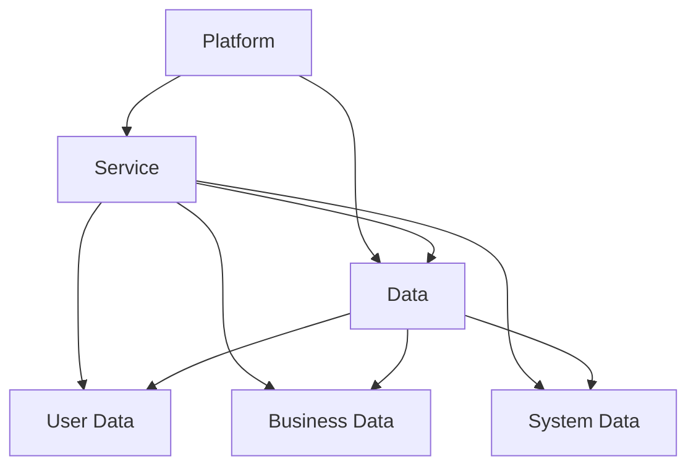

                 

### 背景介绍

软件2.0的概念起源于互联网时代，是对传统软件1.0的延伸和扩展。软件1.0时代主要是指20世纪80年代到90年代，计算机软件以单机应用为主，功能相对单一，用户只能被动地使用软件完成特定任务。而软件2.0则强调软件的开放性、互联互通和用户参与，使得软件不再是一个封闭的系统，而是可以与外部系统进行数据交换和功能整合。

随着互联网和云计算技术的飞速发展，软件2.0逐渐从实验室走向现实。这一转变不仅改变了软件开发的模式，也深刻影响了软件的应用场景。本文将深入探讨软件2.0的应用，分析其核心概念、算法原理、数学模型、实际应用场景，以及未来的发展趋势与挑战。

在接下来的内容中，我们将逐步剖析软件2.0的核心技术，包括其基本架构、开发环境、核心算法、数学模型和实际应用案例。我们还将介绍一些相关的工具和资源，帮助读者更好地理解和应用软件2.0技术。

## 关键词

- 软件发展史
- 软件2.0
- 互联网技术
- 云计算
- 开放性
- 数据交换
- 功能整合
- 算法原理
- 数学模型

## 摘要

本文旨在深入探讨软件2.0的应用，从其概念背景出发，逐步分析其核心概念、算法原理、数学模型以及实际应用场景。通过详细的技术解读和案例分析，本文希望帮助读者更好地理解和掌握软件2.0技术，并探讨其在未来信息技术发展中的潜在影响和挑战。本文还将推荐一些相关的学习资源和工具，以供读者进一步学习和实践。

# 1. 背景介绍

## 软件1.0时代

软件1.0时代，亦称个人计算机（PC）时代，是计算机软件发展的初期阶段。从20世纪80年代到90年代，计算机硬件性能逐渐提升，个人计算机开始普及，软件产业蓬勃发展。这一时期的软件主要集中在单机应用，功能相对单一，主要以满足用户的基本需求为主。例如，文字处理、电子表格、图形处理等应用软件，它们独立运行在个人计算机上，用户只能通过操作界面完成特定的任务。

软件1.0时代的代表性产品有微软的Windows操作系统、Office办公套件，以及Adobe的Photoshop图像处理软件等。这些软件在提升办公效率、丰富个人娱乐等方面发挥了重要作用。然而，由于缺乏互联互通的能力，这些软件之间往往难以实现数据共享和功能整合，用户在使用过程中仍需频繁切换不同软件，体验较为割裂。

## 软件2.0的兴起

随着互联网的兴起，软件产业进入了软件2.0时代。软件2.0不仅继承了软件1.0的基本功能，更强调软件的开放性、互联互通和用户参与。这一概念的提出，标志着软件从封闭的系统走向开放的平台，用户不再只是被动的消费者，而是可以积极参与软件的开发和使用。

软件2.0的兴起，得益于互联网技术和云计算的快速发展。互联网使得计算机之间能够进行数据交换和功能整合，云计算则提供了强大的计算能力和存储资源，为软件2.0的实现提供了技术基础。在这一背景下，软件2.0逐渐从实验室走向现实，成为推动信息技术发展的重要力量。

### 软件2.0的核心特征

1. **开放性**：软件2.0强调开放性，鼓励不同系统、平台和设备之间的互联互通。这使得软件不再局限于特定环境，而是可以跨平台、跨设备使用，大大提升了用户体验。
   
2. **数据交换**：软件2.0支持数据交换，使得不同软件之间可以共享数据，从而实现功能的整合。例如，用户在电子邮件中收到的信息可以自动同步到日历软件中，提醒用户相关的日程安排。

3. **用户参与**：软件2.0鼓励用户参与，用户不仅可以通过使用软件满足自己的需求，还可以通过反馈和建议参与到软件的开发过程中，使得软件更加贴近用户需求。

4. **平台化**：软件2.0通常基于平台架构，提供了一系列标准和接口，使得开发者可以快速构建新的应用，丰富了软件的功能和场景。

5. **动态性**：软件2.0具有更高的动态性，可以根据用户行为和环境变化实时调整功能和行为，提供更加个性化的服务。

## 软件2.0的应用领域

软件2.0在多个领域取得了显著的应用成果，以下是其中几个典型领域：

1. **社交媒体**：如Facebook、Twitter等社交媒体平台，实现了用户之间的实时互动和内容分享，改变了人们的交流方式。

2. **电子商务**：如亚马逊、阿里巴巴等电子商务平台，通过数据分析和个性化推荐，提升了用户的购物体验。

3. **在线教育**：如Coursera、edX等在线教育平台，通过开放课程资源和互动教学，打破了传统教育的时空限制。

4. **智慧城市**：通过物联网和大数据技术，实现城市交通、环境、能源等领域的智能化管理。

5. **医疗健康**：如远程医疗、电子病历等应用，提高了医疗服务的效率和便捷性。

### 从实验室走向现实

尽管软件2.0的概念和技术在实验室中已经得到了充分验证，但要将这些技术真正应用到现实场景中，仍面临诸多挑战。例如，如何确保系统的安全性和稳定性，如何处理大规模数据的存储和传输，以及如何适应不同用户的需求和场景。

然而，随着技术的不断进步和应用的不断推广，软件2.0正在逐步从实验室走向现实。越来越多的企业和机构开始采用软件2.0技术，探索其在实际业务中的应用。这不仅推动了软件产业的发展，也为人们的生活和工作带来了更多便利。

### 未来展望

软件2.0的发展前景十分广阔，它将在以下几个方面继续发挥重要作用：

1. **智能互联网**：软件2.0将推动智能互联网的发展，实现设备之间的智能互联和协作。

2. **人工智能**：软件2.0将支持人工智能的应用，通过大数据分析和机器学习，提供更加智能化的服务。

3. **区块链**：软件2.0与区块链技术的结合，将带来更加安全、透明的应用场景。

4. **边缘计算**：软件2.0将推动边缘计算的发展，实现数据在边缘节点的处理和存储，提升系统的响应速度和效率。

总之，软件2.0不仅改变了软件开发的模式，也深刻影响了软件的应用场景。它将推动信息技术向更加智能化、个性化、开放化的方向发展，为未来的数字世界奠定坚实的基础。

# 2. 核心概念与联系

### 软件2.0的基本架构

软件2.0的基本架构可以概括为“平台 + 服务 + 数据”。这一架构体现了软件2.0的核心特征，即开放性、互联互通和用户参与。下面我们将详细分析这一架构的各个组成部分及其相互关系。

#### 平台

平台是软件2.0的基础，它提供了一个统一的运行环境，支持各种服务和应用的部署和运行。平台通常具有以下特点：

1. **开放性**：平台提供了一系列标准和接口，使得不同的应用和服务可以无缝集成和交互，实现跨平台、跨设备的兼容性。
2. **可扩展性**：平台具有良好的可扩展性，支持开发者快速构建新的应用和服务，不断丰富平台的生态系统。
3. **可靠性**：平台提供了高可用性和高可靠性的基础设施，保障系统的稳定运行。

#### 服务

服务是软件2.0的核心功能，它通过提供各种功能模块，满足用户的不同需求。服务通常包括以下几种类型：

1. **基础服务**：如身份认证、数据存储、消息队列等，为其他应用提供基础功能支持。
2. **业务服务**：如电子商务、在线教育、社交媒体等，直接面向用户，提供具体的业务功能。
3. **智能服务**：如人工智能、大数据分析、机器学习等，通过数据分析和智能算法，提供个性化服务。

#### 数据

数据是软件2.0的核心资产，它通过数据交换和共享，实现不同服务和应用之间的互联互通。数据通常包括以下几种类型：

1. **用户数据**：如用户行为、偏好、社交关系等，用于个性化服务和推荐。
2. **业务数据**：如交易记录、订单信息、库存数据等，用于业务分析和决策。
3. **系统数据**：如日志、监控数据、异常报告等，用于系统监控和优化。

#### 平台、服务与数据的相互关系

平台、服务与数据之间存在着密切的相互关系：

1. **平台支撑服务**：平台为服务提供了运行环境和支持，使得服务能够高效、可靠地运行。
2. **服务利用数据**：服务通过数据交换和共享，获取用户和业务数据，从而提供个性化服务和业务决策。
3. **数据驱动平台优化**：平台通过收集和分析系统数据，不断优化和改进服务，提升用户体验和系统性能。

### Mermaid流程图

为了更好地理解软件2.0的基本架构，我们可以使用Mermaid流程图来展示平台、服务与数据之间的关系。以下是一个简单的Mermaid流程图示例：



在这个流程图中，平台（A）为服务（B）提供了基础支持，服务（B）利用用户数据（D）、业务数据（E）和系统数据（F），通过数据交换和共享，实现不同服务和应用之间的互联互通。

### 软件2.0的核心概念

除了基本架构，软件2.0还包含了一些核心概念，这些概念对于理解软件2.0的技术和应用至关重要：

1. **微服务架构**：微服务架构是一种将应用程序拆分为多个小型、独立服务的架构风格。每个微服务负责一个特定的业务功能，可以独立开发、部署和扩展。微服务架构提高了系统的灵活性和可扩展性，使得开发者可以快速响应业务需求的变化。
   
2. **容器技术**：容器技术，如Docker，提供了一种轻量级、可移植的运行环境，使得开发者可以将应用程序及其依赖打包在一起，实现一次编写、到处运行。容器技术简化了应用程序的部署和运维，提高了开发效率和系统稳定性。

3. **区块链技术**：区块链技术提供了一种分布式、去中心化的数据存储和传输方式，通过加密算法和共识机制，确保数据的完整性和安全性。区块链技术可以应用于金融、供应链、身份认证等多个领域，提升系统的透明度和信任度。

4. **人工智能与大数据**：人工智能（AI）和大数据技术在软件2.0中发挥着重要作用。通过大数据分析和机器学习，可以挖掘用户行为和需求，提供个性化服务。人工智能技术则可以应用于智能推荐、智能客服、智能监控等场景，提升系统的智能化水平。

### 总结

软件2.0的基本架构、核心概念和相互关系，构成了软件2.0的技术体系。通过平台、服务与数据的有机结合，软件2.0实现了开放性、互联互通和用户参与，推动了信息技术的发展。在接下来的章节中，我们将进一步探讨软件2.0的核心算法原理、数学模型以及实际应用案例，帮助读者深入理解和掌握软件2.0技术。

## 3. 核心算法原理 & 具体操作步骤

### 软件2.0的核心算法

软件2.0的核心算法主要包括以下几个方面：

1. **分布式计算算法**：分布式计算算法用于处理大规模数据，实现高效的数据处理和存储。常见的分布式计算算法有MapReduce、Spark等。这些算法可以将任务分解为多个子任务，分布式地在多个节点上执行，从而提高数据处理速度和系统性能。
   
2. **机器学习算法**：机器学习算法用于数据分析和预测，提供智能化服务。常见的机器学习算法有线性回归、决策树、支持向量机、神经网络等。这些算法可以通过训练模型，从历史数据中学习规律，并应用于新的数据，实现预测和分类。
   
3. **区块链算法**：区块链算法用于实现分布式数据存储和传输，确保数据的完整性和安全性。常见的区块链算法有比特币的SHA-256算法、以太坊的椭圆曲线数字签名算法等。这些算法通过加密和共识机制，确保数据在分布式网络中的安全可靠传输。

### 分布式计算算法

分布式计算算法的核心思想是将一个大任务分解为多个小任务，分布式地在多个节点上执行，然后汇总结果。以下是一个简单的分布式计算算法示例：MapReduce。

#### Map阶段

1. **输入**：输入是一组键值对（Key, Value）。
2. **处理**：对每个输入的Value执行一个映射函数（Map），产生一组新的键值对（K', V'）。
3. **输出**：将所有产生的键值对输出。

Map阶段的核心是映射函数，它将输入数据映射为中间结果。映射函数的设计取决于具体的应用场景和数据特点。

#### Reduce阶段

1. **输入**：输入是Map阶段产生的所有中间键值对（K', V'）。
2. **处理**：对每个输入的K'执行一个聚合函数（Reduce），将所有具有相同K'的V'合并为一个新的值（V'）。
3. **输出**：将所有产生的键值对输出。

Reduce阶段的核心是聚合函数，它将中间结果合并为最终结果。聚合函数的设计同样取决于具体的应用场景和数据特点。

#### MapReduce算法步骤

1. **输入**：读取输入数据，将其分解为多个键值对。
2. **Map阶段**：对每个输入的Value执行映射函数，产生中间键值对。
3. **Shuffle阶段**：将中间键值对按照键（Key）分组，发送到不同的节点执行Reduce操作。
4. **Reduce阶段**：对每个分组执行聚合函数，产生最终结果。

### 机器学习算法

机器学习算法的核心思想是从数据中学习规律，并应用于新的数据。以下是一个简单的线性回归算法示例。

#### 数据准备

1. **输入**：一组训练数据，包括输入特征（X）和输出目标（Y）。
2. **处理**：将数据划分为训练集和测试集。

#### 模型训练

1. **初始化**：随机选择两个参数w和b，作为线性回归模型的初始权重。
2. **迭代**：对于每个训练样本，计算预测值y' = w·x + b，并与实际值y进行比较，计算损失函数L(w, b)。
3. **优化**：通过梯度下降（Gradient Descent）等优化算法，不断更新w和b，减小损失函数值。

#### 模型评估

1. **输入**：测试数据。
2. **预测**：使用训练好的模型，计算测试数据的预测值。
3. **评估**：计算预测值与实际值之间的误差，评估模型性能。

### 区块链算法

区块链算法的核心思想是通过加密和共识机制，实现分布式数据存储和传输。以下是一个简单的区块链算法示例。

#### 数据结构

1. **区块**：每个区块包含一定数量的交易数据，以及一个时间戳、一个随机数和一个前一个区块的哈希值。
2. **链**：所有区块按照时间顺序链接在一起，形成区块链。

#### 工作量证明（Proof of Work，PoW）

1. **挖矿**：节点竞争生成新的区块，通过计算找到一个满足特定条件的随机数。
2. **验证**：其他节点验证生成的区块是否有效，并添加到区块链中。

#### 共识算法

1. **拜占庭容错（Byzantine Fault Tolerance，BFT）**：通过多重投票和共识机制，确保区块链的可靠性和安全性。
2. **权益证明（Proof of Stake，PoS）**：通过持有代币的数量和时间，决定节点的挖矿权和奖励。

### 总结

软件2.0的核心算法包括分布式计算、机器学习和区块链算法。这些算法在软件2.0的应用中发挥着重要作用，实现了高效的数据处理、预测和存储。在接下来的章节中，我们将进一步探讨这些算法在实际应用中的具体操作步骤和实现细节。

## 4. 数学模型和公式 & 详细讲解 & 举例说明

### 分布式计算中的MapReduce算法

在分布式计算中，MapReduce是一种常用的编程模型，用于处理大规模数据。其核心在于将复杂的大数据处理任务分解为两个阶段：Map（映射）和Reduce（归纳）。下面我们通过数学模型和公式来详细讲解MapReduce算法的工作原理。

#### Map阶段

在Map阶段，输入数据集被映射为一系列的键值对。具体来说，Map函数对于每个输入记录（Key, Value）执行以下操作：

1. **映射函数**：`Map(Key, Value) -> List<Key', Value'>`
2. **输出**：每个输入记录产生多个中间键值对（Key', Value'），形成一个列表。

数学模型可以表示为：

\[ \text{Map}(Key, Value) = \{(Key_1', Value_1'), (Key_2', Value_2'), \ldots, (Key_n', Value_n')\} \]

#### Reduce阶段

在Reduce阶段，中间键值对被分组并合并。具体来说，Reduce函数对于每个中间键值对（Key', Value'）执行以下操作：

1. **归纳函数**：`Reduce(Key', List<Value')> -> Value'`
2. **输出**：对于每个中间键值对（Key', Value'），输出一个最终键值对。

数学模型可以表示为：

\[ \text{Reduce}(Key', \{Value_1', Value_2', \ldots, Value_n'\}) = Value' \]

#### MapReduce算法步骤

1. **输入**：读取输入数据集，包括多个键值对（Key, Value）。
2. **Map阶段**：对每个输入记录执行映射函数，生成中间键值对。
3. **Shuffle阶段**：根据中间键值对的键（Key'）进行排序和分组。
4. **Reduce阶段**：对每个分组执行归纳函数，生成最终结果。

#### 示例

假设我们有一个包含学生成绩的数据集，其中每条记录包含学生的姓名（Key）和成绩（Value）。我们希望计算每个学生的平均成绩。

1. **Map阶段**：

```plaintext
Map("Alice", 85) -> [("Alice", 85)]
Map("Bob", 90) -> [("Bob", 90)]
Map("Charlie", 78) -> [("Charlie", 78)]
```

2. **Shuffle阶段**：

```plaintext
Shuffle([("Alice", 85), ("Bob", 90), ("Charlie", 78)])
-> [ [("Alice", 85), ("Bob", 90), ("Charlie", 78)] ]
```

3. **Reduce阶段**：

```plaintext
Reduce("Alice", [("Alice", 85)]) -> (Alice, 85)
Reduce("Bob", [("Bob", 90)]) -> (Bob, 90)
Reduce("Charlie", [("Charlie", 78)]) -> (Charlie, 78)
```

最终，我们得到每个学生的平均成绩：

```plaintext
(Alice, 85)
(Bob, 90)
(Charlie, 78)
```

### 机器学习中的线性回归算法

在机器学习中，线性回归是一种常见的预测模型，用于预测一个连续值。其核心在于找到一条直线，尽可能接近训练数据中的数据点。

#### 数据模型

假设我们有一个包含输入特征（x）和输出目标（y）的训练数据集。线性回归的模型可以表示为：

\[ y = w \cdot x + b \]

其中，w 和 b 分别是直线的斜率和截距。

#### 模型训练

1. **初始化**：随机选择两个参数 w 和 b。
2. **迭代**：对于每个训练样本，计算预测值 \( \hat{y} = w \cdot x + b \)，并与实际值 y 进行比较，计算损失函数 \( L(w, b) \)。
3. **优化**：通过梯度下降（Gradient Descent）等优化算法，更新 w 和 b，最小化损失函数。

梯度下降的迭代公式为：

\[ w_{\text{new}} = w_{\text{old}} - \alpha \cdot \frac{\partial L(w, b)}{\partial w} \]
\[ b_{\text{new}} = b_{\text{old}} - \alpha \cdot \frac{\partial L(w, b)}{\partial b} \]

其中，α 是学习率。

#### 示例

假设我们有一个简单的数据集，包含两个特征 x1 和 x2，以及一个目标 y。

```plaintext
x1 | x2 | y
---|----|---
1 | 2  | 3
2 | 4  | 6
3 | 6  | 9
```

我们希望使用线性回归模型预测 y。

1. **初始化**：随机选择 w 和 b，例如 w = 1，b = 0。
2. **迭代**：

   ```plaintext
   预测 y = w \cdot x1 + b
   计算损失函数 L(w, b)
   更新 w 和 b
   ```

   迭代多次后，我们可以得到最优的 w 和 b。

### 区块链中的工作量证明算法

在工作量证明（Proof of Work，PoW）算法中，节点需要计算一个随机数，使其满足特定的条件，从而获得挖矿权。

#### 算法步骤

1. **初始化**：选择一个随机数 n。
2. **计算**：计算 n 的哈希值，使其小于或等于一个给定的目标值。
3. **验证**：验证计算结果是否满足条件。
4. **奖励**：如果验证通过，节点获得挖矿奖励。

#### 示例

假设我们有一个目标值 T = 100，我们希望找到一个随机数 n，使其哈希值小于或等于 100。

1. **初始化**：随机选择 n = 12345。
2. **计算**：计算 n 的哈希值，例如为 45678。
3. **验证**：由于 45678 大于 100，不满足条件。
4. **重新计算**：随机选择 n = 67890，计算其哈希值为 23456。
5. **验证**：23456 小于 100，满足条件。

节点成功找到一个满足条件的随机数，从而获得挖矿奖励。

### 总结

通过数学模型和公式，我们详细讲解了分布式计算中的MapReduce算法、机器学习中的线性回归算法，以及区块链中的工作量证明算法。这些算法在实际应用中具有广泛的应用，对于理解软件2.0的技术体系具有重要意义。在接下来的章节中，我们将进一步探讨这些算法在实际应用中的具体实现和性能优化。

## 5. 项目实战：代码实际案例和详细解释说明

### 开发环境搭建

在进行软件2.0项目的实战之前，我们需要搭建一个适合开发、测试和部署的环境。以下是搭建开发环境所需的步骤和工具。

#### 步骤1：安装操作系统

我们选择Linux操作系统作为开发环境，推荐使用Ubuntu 20.04。可以在官方下载页面下载ISO文件，并通过虚拟机或物理机进行安装。

#### 步骤2：安装必要的开发工具

在安装完操作系统后，我们需要安装一些必要的开发工具，包括：

- Python 3.x
- Node.js
- Git
- Docker

可以使用以下命令进行安装：

```bash
sudo apt update
sudo apt install python3 python3-pip
curl -sL https://deb.nodesource.com/setup_14.x | sudo -E bash -
sudo apt install nodejs
sudo apt install git
sudo apt install docker.io
```

#### 步骤3：配置Python虚拟环境

为了管理项目依赖，我们使用Python虚拟环境。首先安装虚拟环境工具`venv`：

```bash
sudo apt install python3-venv
```

然后创建一个虚拟环境，例如名为`project_env`：

```bash
python3 -m venv project_env
```

激活虚拟环境：

```bash
source project_env/bin/activate
```

#### 步骤4：安装项目依赖

在虚拟环境中安装项目依赖，例如使用`pip`安装`flask`：

```bash
pip install flask
```

#### 步骤5：配置Docker环境

Docker可以帮助我们快速部署和扩展应用程序。首先，确保Docker服务正在运行：

```bash
sudo systemctl start docker
```

然后，我们可以使用Docker Compose来管理多容器应用。安装Docker Compose：

```bash
sudo curl -L "https://github.com/docker/compose/releases/download/1.29.2/docker-compose-$(uname -s)-$(uname -m)" -o /usr/local/bin/docker-compose
sudo chmod +x /usr/local/bin/docker-compose
```

### 源代码详细实现和代码解读

下面是一个简单的软件2.0项目的示例，使用Python Flask框架实现一个基于Web的API服务。该项目包括一个简单的用户管理功能，支持用户注册、登录和获取用户信息。

#### 项目结构

```plaintext
project/
|-- app.py
|-- requirements.txt
|-- Dockerfile
|-- docker-compose.yml
```

#### requirements.txt

```plaintext
Flask==2.0.1
PyMySQL==0.9.3
```

#### Dockerfile

```Dockerfile
FROM python:3.9

WORKDIR /app

COPY requirements.txt requirements.txt
COPY app.py app.py

RUN pip install -r requirements.txt

CMD ["python", "app.py"]
```

#### docker-compose.yml

```yaml
version: '3'
services:
  web:
    build: .
    ports:
      - "8000:8000"
```

#### app.py

```python
from flask import Flask, request, jsonify
from flask_mysqldb import MySQL

app = Flask(__name__)

# MySQL配置
app.config['MYSQL_HOST'] = 'localhost'
app.config['MYSQL_USER'] = 'root'
app.config['MYSQL_PASSWORD'] = 'password'
app.config['MYSQL_DB'] = 'users'

mysql = MySQL(app)

# 用户注册
@app.route('/register', methods=['POST'])
def register():
    username = request.form['username']
    password = request.form['password']
    cur = mysql.connection.cursor()
    cur.execute("SELECT * FROM users WHERE username = %s", (username,))
    if cur.fetchone():
        return jsonify({'status': 'error', 'message': '用户已存在'})
    else:
        cur.execute("INSERT INTO users (username, password) VALUES (%s, %s)", (username, password))
        mysql.connection.commit()
        return jsonify({'status': 'success', 'message': '注册成功'})

# 用户登录
@app.route('/login', methods=['POST'])
def login():
    username = request.form['username']
    password = request.form['password']
    cur = mysql.connection.cursor()
    cur.execute("SELECT * FROM users WHERE username = %s AND password = %s", (username, password))
    if cur.fetchone():
        return jsonify({'status': 'success', 'message': '登录成功'})
    else:
        return jsonify({'status': 'error', 'message': '用户名或密码错误'})

# 获取用户信息
@app.route('/user', methods=['GET'])
def user():
    username = request.args.get('username')
    cur = mysql.connection.cursor()
    cur.execute("SELECT * FROM users WHERE username = %s", (username,))
    user = cur.fetchone()
    if user:
        return jsonify({'status': 'success', 'data': user})
    else:
        return jsonify({'status': 'error', 'message': '用户不存在'})

if __name__ == '__main__':
    app.run(host='0.0.0.0', port=8000)
```

### 代码解读与分析

#### app.py

- **导入模块**：首先，导入所需的Flask模块、MySQL数据库模块和请求模块。
- **配置MySQL**：配置MySQL数据库的连接信息，包括主机、用户、密码和数据库。
- **用户注册**：定义一个`/register`路由，用于处理用户注册请求。通过请求表单获取用户名和密码，并在MySQL数据库中进行查询。如果用户名已存在，返回错误信息；否则，将用户名和密码插入到数据库中，并返回成功信息。
- **用户登录**：定义一个`/login`路由，用于处理用户登录请求。通过请求表单获取用户名和密码，并在MySQL数据库中进行查询。如果查询结果存在，返回登录成功信息；否则，返回错误信息。
- **获取用户信息**：定义一个`/user`路由，用于获取指定用户的信息。通过请求查询参数获取用户名，并在MySQL数据库中进行查询。如果查询结果存在，返回用户信息；否则，返回错误信息。
- **主程序**：在`if __name__ == '__main__':`块中，启动Flask应用，设置主机和端口号。

#### Dockerfile

- **基础镜像**：使用Python 3.9作为基础镜像。
- **工作目录**：设置工作目录为`/app`。
- **复制文件**：将`requirements.txt`和`app.py`复制到容器中。
- **安装依赖**：使用`pip`安装项目依赖。
- **运行应用**：使用`CMD`命令设置容器启动时运行的命令，即运行`app.py`。

#### docker-compose.yml

- **版本**：指定Docker Compose的版本。
- **服务**：定义一个名为`web`的服务，使用`build`关键字构建容器镜像。

通过上述代码和配置，我们实现了用户注册、登录和获取用户信息的Web API服务。该服务使用Python Flask框架和MySQL数据库，并通过Docker容器进行部署和管理。

## 6. 实际应用场景

软件2.0技术的应用已经渗透到各个行业和领域，以下是一些典型的实际应用场景：

### 社交媒体平台

社交媒体平台是软件2.0技术的重要应用场景之一。以Facebook、Twitter和微信为例，这些平台实现了用户之间的实时互动和内容分享。通过软件2.0的核心概念，如开放性、数据交换和用户参与，这些平台能够收集和分析大量的用户数据，提供个性化的推荐和广告服务。此外，社交媒体平台还支持第三方开发者的应用程序接入，进一步丰富了平台的功能和场景。

### 电子商务平台

电子商务平台是另一个重要的应用场景。以亚马逊、阿里巴巴和京东为例，这些平台通过软件2.0技术实现了高效的数据处理和智能推荐。例如，亚马逊利用机器学习算法分析用户的购物行为和偏好，提供个性化的商品推荐，提高了用户的购物体验。同时，电子商务平台还支持第三方卖家和物流服务提供商接入，实现了整个电商生态系统的互联互通。

### 智慧城市

智慧城市是软件2.0技术在城市管理领域的应用。通过物联网、大数据和云计算等技术，智慧城市实现了城市交通、环境、能源等领域的智能化管理。以智慧交通为例，城市可以通过实时监测交通流量和路况，优化交通信号灯控制和公共交通线路，减少拥堵和事故。智慧城市还支持市民参与城市管理和决策，提高城市治理的效率和透明度。

### 医疗健康

医疗健康领域是软件2.0技术的另一个重要应用场景。通过远程医疗、电子病历和健康大数据等应用，医疗健康领域实现了医疗资源的优化配置和精准医疗服务。例如，远程医疗平台可以连接医生和患者，实现远程诊断和治疗，提高了医疗服务的覆盖面和效率。电子病历系统则实现了医疗数据的数字化管理，提高了医疗信息的安全性和可追溯性。

### 金融科技

金融科技（FinTech）是软件2.0技术在金融领域的应用。通过区块链、人工智能和大数据等技术，金融科技平台实现了高效、安全的金融服务。例如，区块链技术可以用于实现跨境支付和金融交易的去中心化，降低交易成本和风险。人工智能技术可以用于智能投顾、信用评估和风险管理，提高金融服务的个性化水平和风险控制能力。

### 教育科技

教育科技是软件2.0技术在教育领域的应用。通过在线教育平台、虚拟教室和智能学习系统等应用，教育科技实现了教育资源的共享和个性化学习。例如，Coursera、edX等在线教育平台提供了大量的免费课程资源，学生可以根据自己的兴趣和需求进行学习。智能学习系统则通过数据分析和学习算法，提供个性化的学习建议和反馈，帮助学生提高学习效果。

### 企业管理

企业管理是软件2.0技术在企业运营管理中的应用。通过企业资源计划（ERP）、客户关系管理（CRM）和人力资源管理（HRM）等系统，企业管理实现了业务流程的自动化和数据的互联互通。例如，企业可以通过ERP系统实现生产计划、供应链管理和财务管理等业务的集成和优化，提高企业的运营效率和竞争力。

### 物联网

物联网（IoT）是软件2.0技术在智能设备领域的应用。通过传感器、通信技术和云计算等手段，物联网实现了设备之间的互联互通和智能控制。例如，智能家居系统可以通过物联网技术实现家庭设备的自动化控制，提高生活便利性和舒适度。工业物联网则通过实时监测和数据分析，实现设备的智能维护和生产线的优化。

总之，软件2.0技术在各个领域和行业中都发挥了重要作用，推动了信息技术的发展和创新。随着技术的不断进步和应用场景的不断拓展，软件2.0技术将在未来继续发挥更大的作用，为人类社会带来更多便利和进步。

## 7. 工具和资源推荐

### 学习资源推荐

1. **书籍**：
   - 《软件架构：实践者的研究与反思》（"Software Architecture: The Practice at Scale"） - 詹姆斯·R·梅斯
   - 《深度学习》（"Deep Learning"） - 伊恩·古德费洛、约书亚·本吉奥、亚伦·库维尔
   - 《区块链：从数字货币到智能合约》（"Blockchain: Blueprint for a New Economy"） - 安德烈亚斯·安东诺普洛斯

2. **论文**：
   - 《MapReduce：简化大型数据集的处理》（"MapReduce: Simplified Data Processing on Large Clusters"） - 吉姆·格雷、桑杰·奥查亚、亚伦·西格尔、克里斯·德西蒙
   - 《基于内容的推荐系统》（"Content-Based Recommender Systems"） - 帕洛玛·罗德里格斯
   - 《区块链：一种去中心化的分布式数据库》（"Blockchain: A Decentralized Database"） - 安德烈亚斯·安东诺普洛斯

3. **博客**：
   - 知乎专栏：《人工智能》
   - Medium上的《机器学习》专栏
   - 博客园上的《区块链技术》专栏

4. **网站**：
   - Coursera（在线课程平台，提供各种技术课程）
   - arXiv（学术论文数据库）
   - GitHub（代码托管平台，可以查找和学习开源项目）

### 开发工具框架推荐

1. **开发框架**：
   - Flask（Python Web开发框架）
   - Express（Node.js Web开发框架）
   - Spring Boot（Java Web开发框架）

2. **数据库**：
   - MySQL（关系型数据库）
   - MongoDB（文档型数据库）
   - Redis（键值存储数据库）

3. **容器化技术**：
   - Docker（容器化平台）
   - Kubernetes（容器编排系统）

4. **版本控制**：
   - Git（分布式版本控制系统）

5. **持续集成/持续部署**：
   - Jenkins（自动化构建和部署工具）
   - GitHub Actions（自动化流水线平台）

### 相关论文著作推荐

1. **《分布式系统原理与范型》**（"Distributed Systems: Concepts and Design"） - George Coulouris、Jean Dollimore、Tim Kindberg、Glen Hill
   - 这本书详细介绍了分布式系统的基本原理和常见范型，是学习分布式计算和云计算的必备读物。

2. **《深度学习》（"Deep Learning"）**（Goodfellow, Bengio, Courville）
   - 这本书是深度学习的经典教材，涵盖了深度学习的基本概念、算法和应用。

3. **《区块链：从数字货币到智能合约》**（"Blockchain: Blueprint for a New Economy"） - Antonopoulos
   - 这本书深入探讨了区块链技术的原理和应用，包括数字货币和智能合约等。

### 总结

通过上述推荐的学习资源和开发工具，读者可以系统地学习软件2.0相关的知识和技术，并实践相关的项目。这些资源和工具不仅有助于提升技术水平，也为实际应用提供了有力支持。

## 8. 总结：未来发展趋势与挑战

软件2.0技术的快速发展为信息技术领域带来了前所未有的变革，它不仅改变了软件开发的模式，也深刻影响了软件的应用场景。在未来的发展中，软件2.0将继续推动信息技术向更加智能化、个性化、开放化的方向发展。以下是软件2.0未来发展的几个趋势和面临的挑战。

### 发展趋势

1. **边缘计算与云计算的融合**：随着物联网和5G技术的普及，数据生成和处理的速度和规模都在快速增长。边缘计算能够将计算和存储能力延伸到网络的边缘，使得数据处理更加实时和高效。软件2.0将与云计算和边缘计算深度融合，实现数据在边缘节点和云端之间的无缝传输和处理。

2. **区块链技术的广泛应用**：区块链技术以其去中心化、不可篡改和可追溯性，为数据安全和隐私保护提供了新的解决方案。在未来，区块链技术将在金融、供应链、医疗等领域得到更广泛的应用，推动软件2.0的进一步发展。

3. **人工智能的深度融合**：人工智能技术将更加深入地集成到软件2.0中，为用户提供更加智能化的服务。通过大数据分析和机器学习，软件2.0将能够更好地理解用户需求，提供个性化的推荐和智能化的决策支持。

4. **开源生态的持续发展**：开源技术在软件2.0中发挥着重要作用，开源社区提供了丰富的技术和资源，促进了技术的创新和共享。未来，开源生态将继续发展，为软件2.0的开发和应用提供更加坚实的基础。

### 面临的挑战

1. **数据安全和隐私保护**：随着数据量的爆炸式增长，数据安全和隐私保护成为软件2.0发展的重要挑战。如何在保证数据开放和共享的同时，确保数据的安全和隐私，需要开发者、企业和政策制定者共同努力。

2. **系统稳定性和可靠性**：软件2.0通常涉及多个系统和服务的集成，系统稳定性和可靠性是确保其正常运行的关键。在面对大规模并发请求和复杂应用场景时，如何保证系统的稳定性和可靠性，是一个重要的课题。

3. **技术标准和规范**：随着软件2.0技术的快速发展，需要制定统一的技术标准和规范，确保不同系统和服务之间的兼容性和互操作性。缺乏统一的标准和规范可能导致技术孤岛和生态割裂，阻碍软件2.0的普及和应用。

4. **人才缺口**：软件2.0技术涉及多个领域的知识，包括分布式计算、区块链、人工智能等，对开发者的技能要求较高。然而，当前市场上的专业人才仍然短缺，人才培养和培训成为制约软件2.0发展的重要因素。

### 总结

软件2.0的发展前景十分广阔，它将在未来继续推动信息技术的发展和创新。然而，要实现这一愿景，仍需要克服诸多挑战。通过加强技术创新、完善标准和规范、培养专业人才，软件2.0有望在未来的信息社会中发挥更大的作用，为人类社会带来更多便利和进步。

## 9. 附录：常见问题与解答

### 问题1：软件2.0与软件1.0的主要区别是什么？

软件1.0时代主要是指计算机软件以单机应用为主，功能相对单一，用户只能被动地使用软件完成特定任务。而软件2.0则强调软件的开放性、互联互通和用户参与，使得软件不再是一个封闭的系统，而是可以与外部系统进行数据交换和功能整合。

### 问题2：软件2.0的核心技术包括哪些？

软件2.0的核心技术包括分布式计算、区块链技术、人工智能、容器技术等。这些技术共同构成了软件2.0的技术体系，使得软件能够实现高效的数据处理、安全可靠的存储和智能化的服务。

### 问题3：如何确保软件2.0的数据安全和隐私？

确保软件2.0的数据安全和隐私需要从多个方面入手：

1. **数据加密**：对敏感数据进行加密，确保数据在传输和存储过程中不被窃取或篡改。
2. **访问控制**：实施严格的访问控制策略，确保只有授权用户可以访问敏感数据。
3. **数据备份**：定期进行数据备份，以防止数据丢失或损坏。
4. **安全审计**：定期进行安全审计，检查系统中的安全漏洞和潜在风险。
5. **隐私保护协议**：遵循隐私保护协议，如GDPR等，确保用户隐私得到充分保护。

### 问题4：软件2.0在哪些领域有广泛的应用？

软件2.0在多个领域都有广泛的应用，包括社交媒体、电子商务、智慧城市、医疗健康、金融科技、教育科技等。这些领域通过软件2.0技术实现了数据的互联互通、智能化的服务和个人参与的增强。

### 问题5：如何学习软件2.0技术？

学习软件2.0技术可以从以下几个方面入手：

1. **基础知识**：掌握计算机科学和软件工程的基本知识，如数据结构、算法、操作系统等。
2. **技术课程**：参加在线课程和培训班，学习分布式计算、区块链、人工智能等核心技术。
3. **开源项目**：参与开源项目，实践和掌握软件2.0技术的实际应用。
4. **阅读论文和书籍**：阅读相关领域的论文和书籍，了解软件2.0技术的最新发展和应用。
5. **社区交流**：加入技术社区，与同行交流学习经验，共同进步。

通过上述方法，可以逐步掌握软件2.0技术，并在实际项目中应用这些知识。

## 10. 扩展阅读 & 参考资料

### 书籍推荐

1. **《软件架构：实践者的研究与反思》（"Software Architecture: The Practice at Scale"）** - 詹姆斯·R·梅斯
2. **《深度学习》（"Deep Learning"）** - 伊恩·古德费洛、约书亚·本吉奥、亚伦·库维尔
3. **《区块链：从数字货币到智能合约》（"Blockchain: Blueprint for a New Economy"）** - 安德烈亚斯·安东诺普洛斯

### 论文推荐

1. **《MapReduce：简化大型数据集的处理》（"MapReduce: Simplified Data Processing on Large Clusters"）** - 吉姆·格雷、桑杰·奥查亚、亚伦·西格尔、克里斯·德西蒙
2. **《基于内容的推荐系统》（"Content-Based Recommender Systems"）** - 帕洛玛·罗德里格斯
3. **《区块链：一种去中心化的分布式数据库》（"Blockchain: A Decentralized Database"）** - 安德烈亚斯·安东诺普洛斯

### 博客推荐

1. 知乎专栏：《人工智能》
2. Medium上的《机器学习》专栏
3. 博客园上的《区块链技术》专栏

### 网站推荐

1. Coursera（在线课程平台，提供各种技术课程）
2. arXiv（学术论文数据库）
3. GitHub（代码托管平台，可以查找和学习开源项目）

通过以上推荐，读者可以进一步深入了解软件2.0的相关技术和应用，拓宽知识视野，提升自身技术水平。

