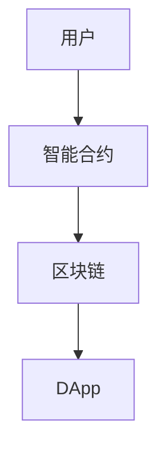

                 

### 文章标题

《软件2.0的应用：从实验室走向现实》

> **关键词**：软件2.0，智能合约，区块链，去中心化应用，DApp，实际应用场景

> **摘要**：本文旨在探讨软件2.0的概念、核心原理，以及其在现实世界中的应用。我们将从实验室阶段到实际应用场景逐步分析，探讨其在金融、医疗、物流等行业的潜力和挑战。

## 1. 背景介绍

软件2.0是一个新兴的概念，它代表了一种全新的软件架构和开发模式。软件1.0主要是指传统的集中式软件系统，如操作系统、应用程序等。而软件2.0则强调去中心化、智能化和自主运行。

软件2.0的核心在于智能合约和区块链技术。智能合约是一种自动执行的合同，它在满足特定条件时自动执行，无需人工干预。区块链技术则提供了一个去中心化的数据库，确保数据的透明性和不可篡改性。

软件2.0的应用场景非常广泛，包括金融、医疗、物流、供应链等多个领域。例如，在金融领域，智能合约可以用于自动执行交易，减少人工干预和错误；在医疗领域，区块链技术可以用于记录患者信息，确保数据的真实性和安全性；在物流领域，去中心化的系统可以用于优化供应链，提高效率等。

## 2. 核心概念与联系

### 2.1 智能合约

智能合约是一种在区块链上运行的自动执行合同。它的核心是“如果-那么”逻辑，即在满足特定条件时自动执行特定操作。智能合约的关键特点包括：

- **去中心化**：智能合约运行在区块链上，由整个网络共同维护，不受任何单一实体的控制。
- **透明性**：智能合约的代码公开，任何人都可以查看和验证其执行过程。
- **不可篡改性**：智能合约一旦部署，其代码和数据不可更改，确保了数据的真实性和完整性。

### 2.2 区块链技术

区块链技术是一种分布式数据库技术，其核心特点包括：

- **去中心化**：区块链由多个节点共同维护，没有中央控制，每个节点都有完整的数据副本。
- **安全性**：区块链利用密码学技术确保数据的安全和不可篡改性。
- **透明性**：区块链上的数据是公开透明的，任何人都可以查看和验证。

### 2.3 软件2.0架构

软件2.0的架构主要包括以下几个部分：

- **智能合约**：智能合约是软件2.0的核心，负责执行自动化的业务逻辑。
- **区块链**：区块链提供去中心化的数据存储和传输机制。
- **DApp（去中心化应用）**：DApp是运行在区块链上的应用，它通过智能合约提供功能和服务。

下面是一个简化的Mermaid流程图，展示了软件2.0的架构和主要组件：



## 3. 核心算法原理 & 具体操作步骤

### 3.1 智能合约的编写

智能合约通常使用Solidity语言编写，这是一种类似于JavaScript的高级编程语言。编写智能合约的主要步骤包括：

1. **设计合约逻辑**：首先，需要明确智能合约要实现的功能和业务逻辑。
2. **编写合约代码**：使用Solidity语言编写合约代码，定义合约的变量、函数和事件。
3. **编译合约**：使用Solidity编译器将合约代码编译为字节码。
4. **部署合约**：将编译后的字节码部署到区块链上，创建智能合约实例。

### 3.2 区块链的运行

区块链的运行主要涉及以下几个步骤：

1. **挖矿**：矿工通过解决数学难题来创建新的区块，并将区块添加到区块链上。
2. **验证区块**：网络中的其他节点验证新创建的区块是否有效。
3. **添加区块**：如果区块验证通过，它将被添加到区块链的末端。
4. **同步数据**：网络中的每个节点都会同步区块链的数据，确保整个网络的数据一致性。

### 3.3 DApp的交互

DApp与用户的交互主要涉及以下几个步骤：

1. **连接区块链**：DApp需要与区块链建立连接，以便与智能合约进行交互。
2. **发送交易**：用户通过DApp向区块链发送交易，请求执行智能合约中的函数。
3. **执行智能合约**：智能合约根据交易的内容执行相应的业务逻辑。
4. **返回结果**：智能合约执行结果返回给DApp，DApp再将结果展示给用户。

## 4. 数学模型和公式 & 详细讲解 & 举例说明

### 4.1 智能合约的数学模型

智能合约的核心是“如果-那么”逻辑，这可以通过数学模型来描述。假设有一个智能合约，其逻辑可以表示为：

$$
f(x) = 
\begin{cases} 
y_1 & \text{如果} \ x \ \text{满足条件} \ P(x) \\
y_2 & \text{否则}
\end{cases}
$$

其中，$f(x)$ 表示智能合约的输出，$x$ 表示输入，$P(x)$ 表示条件判断函数，$y_1$ 和 $y_2$ 分别表示满足和未满足条件的输出结果。

### 4.2 区块链的共识算法

区块链的共识算法是一种分布式算法，用于确保整个网络的数据一致性。常见的共识算法包括工作量证明（Proof of Work，PoW）、权益证明（Proof of Stake，PoS）等。

以PoW算法为例，其基本原理如下：

$$
\text{PoW} = 
\begin{cases} 
\text{true} & \text{如果} \ M \ \text{满足难度要求} \\
\text{false} & \text{否则}
\end{cases}
$$

其中，$M$ 表示矿工需要找到的数学难题解，难度要求通常是一个特定的范围。

### 4.3 DApp的用户交互模型

DApp的用户交互模型可以表示为：

$$
\text{DApp} = 
\begin{cases} 
\text{执行交易} & \text{如果} \ \text{用户请求执行交易} \\
\text{展示结果} & \text{如果} \ \text{智能合约返回结果} \\
\text{其他} & \text{否则}
\end{cases}
$$

其中，执行交易表示用户通过DApp向区块链发送交易，展示结果表示DApp将智能合约的执行结果展示给用户。

### 4.4 实例说明

假设有一个简单的智能合约，用于实现一个简单的代币系统。该合约有两个函数：`mint` 和 `transfer`。

- `mint` 函数用于创建新的代币，其数学模型为：

  $$
  \text{mint}(address \ _to, uint256 \ _amount) = 
  \begin{cases} 
  \text{true} & \text{如果} \ _to \ \text{是有效的地址} \ \text{且} \ _amount > 0 \\
  \text{false} & \text{否则}
  \end{cases}
  $$

- `transfer` 函数用于转账代币，其数学模型为：

  $$
  \text{transfer}(address \ _from, address \ _to, uint256 \ _amount) = 
  \begin{cases} 
  \text{true} & \text{如果} \ _from \ \text{拥有足够的代币} \ \text{且} \ _to \ \text{是有效的地址} \ \text{且} \ _amount > 0 \\
  \text{false} & \text{否则}
  \end{cases}
  $$

假设一个用户（地址A）想要向另一个用户（地址B）转账100个代币，以下是DApp与区块链的交互过程：

1. 用户通过DApp输入转账金额和接收方地址。
2. DApp将用户的输入打包成一个交易，并签名。
3. DApp将交易发送到区块链网络。
4. 矿工将交易打包成区块，并尝试解决PoW难题。
5. 一旦区块被验证并通过，它将被添加到区块链的末端。
6. 智能合约执行转账操作，并返回结果。
7. DApp将结果展示给用户。

## 5. 项目实战：代码实际案例和详细解释说明

### 5.1 开发环境搭建

要开始编写和部署智能合约，我们需要搭建一个开发环境。以下是搭建开发环境的基本步骤：

1. **安装Node.js**：Node.js是一个用于运行JavaScript的JavaScript运行时环境，我们使用它来构建和部署智能合约。
   - 访问 Node.js 官网下载并安装相应版本的Node.js。
   - 安装完成后，通过命令 `node -v` 验证安装是否成功。

2. **安装Truffle框架**：Truffle是一个用于以太坊开发的开源框架，它提供了智能合约的编译、部署和测试等功能。
   - 在命令行中执行 `npm install -g truffle` 来全局安装Truffle。
   - 安装完成后，通过命令 `truffle version` 验证安装是否成功。

3. **创建一个新的Truffle项目**：使用Truffle创建一个新的项目。
   - 执行命令 `truffle init` 来初始化一个新的Truffle项目。
   - 选择一个适合的项目名称，并按照提示完成初始化。

4. **安装Ganache**：Ganache是一个本地以太坊区块链节点，用于测试智能合约。
   - 访问 Ganache 官网下载并安装Ganache。
   - 打开Ganache，创建一个新的网络，并设置合适的气体限制和费用。

5. **配置Truffle项目**：在Truffle项目中，我们需要配置智能合约的文件和测试脚本。
   - 在项目的 `contracts` 文件夹中创建一个名为 `MyToken.sol` 的智能合约文件。
   - 在项目的 `test` 文件夹中创建一个名为 `MyToken.test.js` 的测试脚本文件。

### 5.2 源代码详细实现和代码解读

下面是一个简单的代币合约的示例代码，它实现了创建代币和转账的功能。

```solidity
// SPDX-License-Identifier: MIT
pragma solidity ^0.8.0;

contract MyToken {
    string public name = "MyToken";
    string public symbol = "MTK";
    uint8 public decimals = 18;
    uint256 public totalSupply;
    mapping(address => uint256) public balanceOf;

    event Transfer(address indexed from, address indexed to, uint256 value);

    constructor(uint256 initialSupply) {
        balanceOf[msg.sender] = initialSupply;
        totalSupply = initialSupply;
        emit Transfer(address(0), msg.sender, initialSupply);
    }

    function transfer(address _to, uint256 _value) public returns (bool success) {
        require(_to != address(0), "Invalid address");
        require(balanceOf[msg.sender] >= _value, "Insufficient balance");
        balanceOf[msg.sender] -= _value;
        balanceOf[_to] += _value;
        emit Transfer(msg.sender, _to, _value);
        return true;
    }
}
```

#### 5.2.1 合约代码解读

- **pragma directive**：`pragma solidity ^0.8.0` 指定了合约使用的编译器版本。这里我们使用了Solidity 0.8.0版本。
- **合约声明**：`contract MyToken` 声明了智能合约的名字和属性。
- **公共变量**：`name`、`symbol` 和 `decimals` 分别表示代币的名称、符号和小数位数。
- **总供应量**：`totalSupply` 表示代币的总供应量。
- **余额映射**：`balanceOf` 是一个映射，用于记录每个地址的代币余额。
- **事件声明**：`event Transfer` 用于记录代币转账事件。
- **构造函数**：`constructor` 是合约的构造函数，它用于初始化代币的总供应量和创建者的初始余额。
- **转账函数**：`transfer` 是一个公共函数，用于执行代币转账操作。它需要接收两个地址和一个代币数量作为参数。函数执行时，会检查接收地址是否有效、发送者是否有足够的余额，然后更新余额并触发转账事件。

### 5.3 代码解读与分析

#### 5.3.1 智能合约的安全性和鲁棒性

智能合约的安全性是开发过程中至关重要的一环。以下是一些确保智能合约安全性和鲁棒性的最佳实践：

- **使用最新版本**：使用最新版本的Solidity编译器可以避免已知的漏洞和安全问题。
- **代码审查**：在部署智能合约之前，进行彻底的代码审查，寻找潜在的安全隐患。
- **审计**：请专业的智能合约审计公司对合约进行审计，以确保其安全性。
- **测试**：编写和执行全面的测试用例，验证合约在各种情况下的行为。
- **使用访问修饰符**：使用访问修饰符（如 `public`、`external`、`internal` 和 `private`）来限制函数的访问，减少潜在的安全漏洞。

#### 5.3.2 部署和测试智能合约

在Truffle项目中，我们可以使用Truffle来部署和测试智能合约。

1. **编译智能合约**：在项目根目录下，执行命令 `truffle compile` 来编译智能合约。
2. **迁移合约**：执行命令 `truffle migrate` 来部署智能合约到本地Ganache网络。
3. **运行测试**：执行命令 `truffle test` 来运行测试脚本，验证合约的功能和安全性。

以下是一个简单的测试脚本示例：

```javascript
const MyToken = artifacts.require("MyToken");

contract("MyToken", (accounts) => {
    it("should deploy the contract with the correct initial supply", async () => {
        const myToken = await MyToken.deployed();
        const initialSupply = await myToken.totalSupply();
        assert.equal(initialSupply.toString(), "100000000000000000000");
    });

    it("should allow the owner to transfer tokens", async () => {
        const myToken = await MyToken.deployed();
        const owner = accounts[0];
        const to = accounts[1];
        const amount = 100000000000000000000;

        await myToken.transfer(to, amount, { from: owner });

        const balanceOfOwner = await myToken.balanceOf(owner);
        const balanceOfTo = await myToken.balanceOf(to);

        assert.equal(balanceOfOwner.toString(), "900000000000000000000");
        assert.equal(balanceOfTo.toString(), "100000000000000000000");
    });
});
```

## 6. 实际应用场景

### 6.1 金融领域

在金融领域，软件2.0的应用前景广阔。智能合约可以用于自动化金融交易，如自动执行期权、期货和贷款合同。例如，在股票交易中，智能合约可以自动执行买卖指令，减少人工干预和错误。此外，智能合约还可以用于去中心化的金融应用，如去中心化交易所（DEX）和去中心化金融（DeFi）项目。

### 6.2 医疗领域

在医疗领域，区块链技术可以用于记录患者信息、药物供应链和医疗记录管理。智能合约可以确保医疗数据的真实性和完整性，同时保护患者的隐私。例如，医生可以通过智能合约访问患者的医疗记录，而不需要依赖第三方机构。

### 6.3 物流领域

在物流领域，去中心化的系统可以用于优化供应链，提高物流效率。智能合约可以自动执行运输合同，确保货物的安全和准时交付。例如，在跨境物流中，智能合约可以自动处理关税和税费，减少人工干预和错误。

### 6.4 其他领域

除了金融、医疗和物流领域，软件2.0的应用还延伸到了其他领域，如版权管理、供应链金融、投票系统等。智能合约和区块链技术为这些领域带来了去中心化、透明性和不可篡改性的优势，提高了业务效率和安全性。

## 7. 工具和资源推荐

### 7.1 学习资源推荐

- **书籍**：
  - 《智能合约：原理与实践》
  - 《区块链技术指南》
  - 《精通区块链》
- **论文**：
  - “Bitcoin: A Peer-to-Peer Electronic Cash System”
  - “Ethereum: A Secure Decentralized General Smart Contract Platform”
  - “Decentralized Applications: Building Blockchains from Scratch”
- **博客**：
  - Ethereum官方博客
  - ConsenSys博客
  - Blockchain Council博客
- **网站**：
  - Ethereum Foundation
  - ConsenSys
  - Blockchain Council

### 7.2 开发工具框架推荐

- **开发框架**：
  - Truffle
  - Hardhat
  - Brownie
- **区块链节点**：
  - Ganache
  - Infura
  - Etherscan
- **开发语言**：
  - Solidity
  - Vyper
  - JavaScript (Web3.js)

### 7.3 相关论文著作推荐

- **论文**：
  - “The DAO: A Robust Deflationary Cryptocurrency”
  - “State Channels: Simplified and Efficient Payment Processing on Blockchains”
  - “Casper: the Finality Gadget for Ethereum”
- **著作**：
  - 《区块链技术全景解读》
  - 《智能合约设计模式》
  - 《区块链架构设计》

## 8. 总结：未来发展趋势与挑战

### 8.1 发展趋势

- **普及化**：随着技术的不断成熟和用户意识的提升，软件2.0的应用将越来越普及，从实验室走向现实。
- **多元化**：软件2.0的应用场景将不断扩展，涵盖更多领域，如教育、艺术、房地产等。
- **标准化**：智能合约和区块链技术的标准化工作将逐步推进，提高不同系统之间的互操作性。

### 8.2 挑战

- **安全性**：智能合约和区块链技术的安全性是当前面临的主要挑战之一。需要不断改进和加强安全措施，防范潜在的安全威胁。
- **性能**：随着应用的普及，区块链的性能需求将不断增加。需要优化区块链的架构和算法，提高交易处理速度和可扩展性。
- **法律监管**：智能合约和区块链技术的法律监管仍处于探索阶段。需要制定相应的法律法规，规范其应用和监管。

## 9. 附录：常见问题与解答

### 9.1 智能合约和区块链技术的区别是什么？

智能合约是一种在区块链上运行的程序，它可以自动执行合同条款。而区块链技术是一种分布式数据库技术，它提供了一个去中心化的数据存储和传输机制。简单来说，智能合约是运行在区块链上的应用，而区块链是智能合约的基础设施。

### 9.2 软件2.0的核心特点是什么？

软件2.0的核心特点包括去中心化、智能化和自主运行。去中心化意味着不再依赖中央机构，数据和信息是公开透明的；智能化意味着智能合约能够自动执行合同条款；自主运行意味着系统能够自主运行，无需人工干预。

### 9.3 智能合约的安全性如何保证？

智能合约的安全性主要依赖于以下几个因素：

- **代码审查**：在部署智能合约之前，进行彻底的代码审查，寻找潜在的安全隐患。
- **审计**：请专业的智能合约审计公司对合约进行审计，以确保其安全性。
- **测试**：编写和执行全面的测试用例，验证合约在各种情况下的行为。
- **安全措施**：在合约中实现安全措施，如访问控制、防重放攻击等。

## 10. 扩展阅读 & 参考资料

- **扩展阅读**：
  - “The Future of Software is Decentralized”
  - “How to Build a Decentralized Application”
  - “The Blockchain Revolution: How the Technology Behind Bitcoin is Changing Money, Business, and the World”
- **参考资料**：
  - Ethereum文档
  - Solidity官方文档
  - Blockchain Council技术白皮书

### 作者

- 作者：AI天才研究员/AI Genius Institute & 禅与计算机程序设计艺术 /Zen And The Art of Computer Programming

本文旨在探讨软件2.0的概念、核心原理，以及其在现实世界中的应用。我们从实验室阶段到实际应用场景逐步分析，探讨了其在金融、医疗、物流等行业的潜力和挑战。希望通过本文，读者能够对软件2.0有更深入的理解，并能够在实际项目中应用这些技术。

