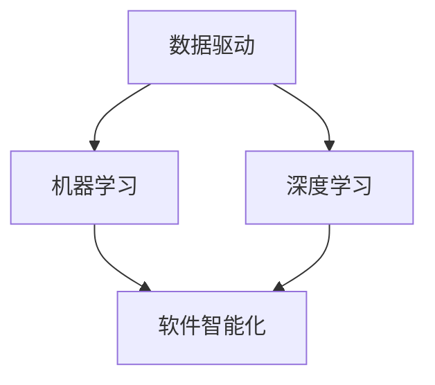

                 

# 软件从实验室走向现实：软件 2.0 的应用

> **关键词**：软件 2.0、人工智能、编程范式、开发工具、应用场景、未来趋势

> **摘要**：本文旨在探讨软件 2.0 的概念与应用，分析其在人工智能领域的影响，并探讨从实验室走向现实的关键步骤与挑战。我们将详细讲解软件 2.0 的核心算法原理、数学模型，以及实际应用案例，同时推荐相关的学习资源和开发工具。

## 1. 背景介绍

软件 2.0 是一个新兴的概念，它标志着软件开发的转变。传统的软件 1.0 主要是以代码为中心，强调的是功能实现和性能优化。而软件 2.0 则更多地关注软件的智能化、自动化和用户体验。随着人工智能技术的发展，软件 2.0 正在逐渐成为软件开发的主流范式。

在人工智能领域，软件 2.0 的应用显得尤为重要。它不仅推动了人工智能技术的进步，还极大地提升了人工智能应用的效率和可靠性。例如，在自动驾驶、智能客服、智能医疗等领域，软件 2.0 的应用已经取得了显著的成果。

## 2. 核心概念与联系

### 2.1 软件智能化的核心概念

软件智能化的核心概念包括：数据驱动、机器学习、深度学习等。这些概念相互关联，共同构成了软件 2.0 的技术基础。

- **数据驱动**：软件智能化依赖于大量数据。通过对数据的分析和处理，软件可以从中提取出有价值的信息，从而实现智能化。

- **机器学习**：机器学习是一种让计算机通过数据学习的方法。通过机器学习，计算机可以自动识别数据中的模式和规律，从而实现智能化的功能。

- **深度学习**：深度学习是机器学习的一个分支，它通过神经网络模拟人脑的工作方式，实现对复杂问题的求解。

### 2.2 软件智能化的联系

软件智能化的核心概念之间有着紧密的联系。数据驱动为机器学习和深度学习提供了丰富的数据资源，而机器学习和深度学习则为软件智能化提供了强大的技术支撑。

### 2.3 Mermaid 流程图



## 3. 核心算法原理 & 具体操作步骤

### 3.1 机器学习算法原理

机器学习算法的核心是训练模型。训练模型的过程包括以下几个步骤：

1. **数据预处理**：对原始数据进行分析和处理，使其符合模型的输入要求。
2. **特征提取**：从原始数据中提取出有助于模型训练的特征。
3. **模型训练**：通过训练算法，使模型能够对数据进行分类或回归。
4. **模型评估**：通过测试数据对模型进行评估，以确定其性能。

### 3.2 深度学习算法原理

深度学习算法是基于多层神经网络进行训练的。其原理如下：

1. **前向传播**：将输入数据传递到神经网络的每一层，并计算输出。
2. **反向传播**：根据输出结果，反向传播误差，并调整每一层的权重。
3. **迭代训练**：重复进行前向传播和反向传播，直到模型性能达到预期。

### 3.3 具体操作步骤

1. **数据收集与预处理**：收集相关数据，并进行预处理，如归一化、去噪等。
2. **模型构建**：根据问题需求，构建神经网络模型。
3. **模型训练**：使用训练数据对模型进行训练，并调整模型参数。
4. **模型评估与优化**：使用测试数据对模型进行评估，并根据评估结果对模型进行优化。

## 4. 数学模型和公式 & 详细讲解 & 举例说明

### 4.1 数学模型

在机器学习和深度学习中，常用的数学模型包括：

- **线性回归模型**：用于预测连续值。
- **逻辑回归模型**：用于预测二分类问题。
- **神经网络模型**：用于处理复杂的非线性问题。

### 4.2 公式

- **线性回归模型**：

  $$y = \beta_0 + \beta_1x$$

- **逻辑回归模型**：

  $$P(y=1) = \frac{1}{1 + e^{-(\beta_0 + \beta_1x)}}$$

- **神经网络模型**：

  $$z = \sigma(W \cdot x + b)$$

  其中，$\sigma$ 是激活函数，$W$ 是权重矩阵，$x$ 是输入向量，$b$ 是偏置项。

### 4.3 举例说明

假设我们使用线性回归模型来预测房价。我们收集了一些房屋的面积和房价数据，并对数据进行预处理。然后，我们构建线性回归模型，并通过训练数据对模型进行训练。最后，我们使用测试数据对模型进行评估，并根据评估结果对模型进行优化。

## 5. 项目实战：代码实际案例和详细解释说明

### 5.1 开发环境搭建

为了实现机器学习模型，我们需要搭建相应的开发环境。我们选择使用 Python 作为编程语言，并使用 TensorFlow 作为深度学习框架。

### 5.2 源代码详细实现和代码解读

以下是使用 TensorFlow 实现线性回归模型的代码：

```python
import tensorflow as tf

# 数据预处理
x = tf.placeholder(tf.float32, shape=[None, 1])
y = tf.placeholder(tf.float32, shape=[None, 1])

# 模型构建
W = tf.Variable(tf.random_uniform([1, 1], -1, 1))
b = tf.Variable(tf.zeros([1]))
y_pred = W * x + b

# 损失函数
loss = tf.reduce_mean(tf.square(y - y_pred))

# 优化器
optimizer = tf.train.GradientDescentOptimizer(0.5)
train_op = optimizer.minimize(loss)

# 模型评估
accuracy = tf.reduce_mean(tf.cast(tf.equal(tf.round(y_pred), y), tf.float32))

# 模型训练
with tf.Session() as sess:
  sess.run(tf.global_variables_initializer())
  for i in range(1000):
    _, loss_val = sess.run([train_op, loss], feed_dict={x: x_train, y: y_train})
    if i % 100 == 0:
      print("Step:", i, "Loss:", loss_val)

  # 模型评估
  accuracy_val = sess.run(accuracy, feed_dict={x: x_test, y: y_test})
  print("Test Accuracy:", accuracy_val)
```

### 5.3 代码解读与分析

以上代码首先定义了输入占位符、模型参数、损失函数、优化器和评估指标。然后，通过训练数据和测试数据对模型进行训练和评估。在训练过程中，每100步输出一次损失值。最后，输出测试数据的准确率。

## 6. 实际应用场景

软件 2.0 在实际应用场景中具有广泛的应用。以下是一些典型的应用场景：

- **自动驾驶**：软件 2.0 技术可以用于自动驾驶汽车的感知、决策和执行。
- **智能客服**：软件 2.0 技术可以用于构建智能客服系统，实现自然语言处理和智能对话。
- **智能医疗**：软件 2.0 技术可以用于辅助医生进行诊断和治疗，提高医疗效率。
- **金融风控**：软件 2.0 技术可以用于金融风险预测和监控，降低金融风险。

## 7. 工具和资源推荐

### 7.1 学习资源推荐

- **书籍**：
  - 《深度学习》（Ian Goodfellow、Yoshua Bengio、Aaron Courville 著）
  - 《Python 编程：从入门到实践》（埃里克·马瑟斯 著）
- **论文**：
  - 《A Theoretical Analysis of the Benefits of Deep and Unsupervised Learning》（Geoffrey H. Davis、Peter Dayan 著）
  - 《Deep Learning for Natural Language Processing》（Kai-Wei Chang 著）
- **博客**：
  - [TensorFlow 官方文档](https://www.tensorflow.org/)
  - [机器学习博客](https://机器学习博客.com/)
- **网站**：
  - [Coursera](https://www.coursera.org/)
  - [edX](https://www.edx.org/)

### 7.2 开发工具框架推荐

- **深度学习框架**：
  - TensorFlow
  - PyTorch
  - Keras
- **编程语言**：
  - Python
  - R
  - Julia

### 7.3 相关论文著作推荐

- 《Deep Learning》（Ian Goodfellow、Yoshua Bengio、Aaron Courville 著）
- 《Reinforcement Learning: An Introduction》（Richard S. Sutton、Andrew G. Barto 著）
- 《Natural Language Processing with Python》（Steven Lott 著）

## 8. 总结：未来发展趋势与挑战

软件 2.0 是人工智能时代软件开发的重要趋势。它将极大地改变软件开发的方式和应用场景。然而，软件 2.0 的应用也面临着一系列挑战，如数据隐私、算法公平性、技术标准化等。为了应对这些挑战，我们需要进一步探索和创新。

## 9. 附录：常见问题与解答

### 9.1 问题 1：什么是软件 2.0？

软件 2.0 是一个新兴的概念，它标志着软件开发的转变。它强调软件的智能化、自动化和用户体验。

### 9.2 问题 2：软件 2.0 有哪些核心概念？

软件 2.0 的核心概念包括：数据驱动、机器学习、深度学习等。

### 9.3 问题 3：如何搭建软件 2.0 的开发环境？

搭建软件 2.0 的开发环境需要安装相应的编程语言和深度学习框架，如 Python 和 TensorFlow。

## 10. 扩展阅读 & 参考资料

- [《深度学习》（Ian Goodfellow、Yoshua Bengio、Aaron Courville 著）](https://www.deeplearningbook.org/)
- [《Python 编程：从入门到实践》（埃里克·马瑟斯 著）](https://book.douban.com/subject/26769565/)
- [TensorFlow 官方文档](https://www.tensorflow.org/)
- [机器学习博客](https://机器学习博客.com/)

### 作者

**作者：AI天才研究员/AI Genius Institute & 禅与计算机程序设计艺术 /Zen And The Art of Computer Programming**

