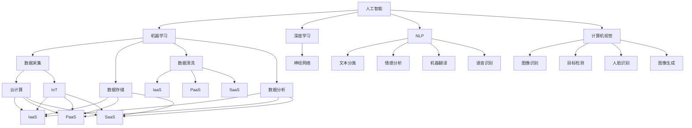

                 

### 背景介绍

在当今数字化时代，软件 2.0 已经成为技术发展的前沿。软件 2.0，也被称为“智能软件”，代表着软件从传统的执行指令角色向智能化、自主化方向发展的趋势。这一概念不仅仅是对传统软件开发模式的延续，更是一场技术革命，旨在通过人工智能、大数据、云计算等先进技术，赋予软件更多的智能和自主性。

首先，让我们回顾一下软件 1.0 的特点。在软件 1.0 时代，软件开发主要依赖于程序员手动编写代码，通过指令来控制计算机执行特定任务。这一阶段的特点是开发过程复杂、耗时较长，且对程序员的专业技能要求较高。尽管如此，软件 1.0 在当时的技术环境下发挥了重要作用，推动了信息化和自动化的发展。

然而，随着技术的进步和需求的变化，软件 1.0 的局限性逐渐显现。首先，软件 1.0 的功能相对单一，往往只能执行预设的任务，缺乏灵活性和适应性。其次，软件 1.0 的开发和部署过程复杂，需要大量的时间和人力资源。最后，随着数据量的爆炸式增长，软件 1.0 在处理大数据方面的效率明显不足。

正是在这样的背景下，软件 2.0 的概念应运而生。软件 2.0 强调通过人工智能和大数据技术，使软件具有自我学习和自我优化的能力。具体来说，软件 2.0 有以下几个关键特点：

1. **智能化**：软件 2.0 利用机器学习算法和自然语言处理技术，能够从大量数据中提取有价值的信息，并自动调整其行为和决策。

2. **自适应**：软件 2.0 能够根据用户的行为和需求，自动调整其界面和功能，提供更加个性化的服务。

3. **自主性**：软件 2.0 通过自动化流程和算法，能够实现自我维护和更新，减少对人工干预的依赖。

4. **协同性**：软件 2.0 支持多设备、多平台协同工作，为用户提供无缝连接的体验。

5. **高效性**：软件 2.0 通过优化算法和数据处理流程，显著提高工作效率，降低成本。

软件 2.0 的出现，不仅改变了软件开发的模式，也为各行各业带来了巨大的变革。在医疗领域，智能诊断系统可以快速分析患者数据，提供准确的诊断结果；在教育领域，个性化学习平台可以根据学生的学习进度和需求，提供定制化的教学方案；在金融领域，智能投顾系统可以根据用户的风险偏好和资产状况，提供专业的投资建议。

总的来说，软件 2.0 的未来愿景是创造一个更加智能化、高效化、个性化的数字世界。在这个世界中，软件不仅仅是工具，更是人类智慧的延伸。通过不断探索和创新，我们将共同见证软件 2.0 如何改变我们的生活和工作方式，创造一个更加美好的未来。### 核心概念与联系

要深入理解软件 2.0 的核心概念与联系，我们首先需要明确几个关键概念：人工智能（AI）、大数据、云计算和物联网（IoT）。这些概念不仅构成了软件 2.0 的技术基础，也定义了其智能化、自主化和协同性的能力。

#### 人工智能（AI）

人工智能是软件 2.0 的核心驱动力之一。它通过模拟人类思维和行为的方式，使计算机能够执行复杂的任务，并不断自我学习和优化。AI 的主要技术包括机器学习、深度学习、自然语言处理和计算机视觉等。以下是这些技术的简要介绍：

1. **机器学习（Machine Learning）**：机器学习是一种让计算机从数据中学习模式并作出预测或决策的方法。它通过算法来识别数据中的规律，从而改进计算机的决策能力。常见的机器学习算法包括决策树、支持向量机、神经网络等。

2. **深度学习（Deep Learning）**：深度学习是机器学习的一个分支，它通过神经网络模型（尤其是多层感知器）来模拟人类大脑的学习方式。深度学习在图像识别、语音识别和自然语言处理等领域取得了显著的成果。

3. **自然语言处理（Natural Language Processing, NLP）**：自然语言处理是一种让计算机理解和生成人类语言的技术。它包括文本分类、情感分析、机器翻译和语音识别等任务。

4. **计算机视觉（Computer Vision）**：计算机视觉是一种让计算机理解和解析视觉信息的技术。它包括图像识别、目标检测、人脸识别和图像生成等任务。

#### 大数据（Big Data）

大数据是软件 2.0 的另一个关键概念。随着互联网和物联网的普及，数据量呈现爆炸式增长，传统的数据处理方法已经无法满足需求。大数据技术通过分布式计算和存储技术，实现对海量数据的处理和分析。以下是大数据的主要技术：

1. **数据采集（Data Collection）**：数据采集是指从各种来源（如传感器、社交网络、网站等）收集数据的过程。

2. **数据存储（Data Storage）**：数据存储是指将大量数据存储在分布式存储系统中，如Hadoop、Spark等。

3. **数据清洗（Data Cleaning）**：数据清洗是指处理和修正数据中的错误、重复和缺失值，以确保数据的质量。

4. **数据分析（Data Analysis）**：数据分析是指使用统计和机器学习等方法，从数据中提取有价值的信息和知识。

#### 云计算（Cloud Computing）

云计算为软件 2.0 提供了强大的计算和存储资源，使得软件可以更加灵活和高效地部署和管理。云计算的主要服务模式包括：

1. **基础设施即服务（IaaS）**：用户可以通过云平台租用虚拟的硬件资源，如虚拟机、存储和网络设备。

2. **平台即服务（PaaS）**：用户可以在云平台上开发、运行和管理应用程序，无需关注底层硬件和操作系统。

3. **软件即服务（SaaS）**：用户可以通过互联网访问和使用云平台上的应用程序，无需安装和维护软件。

#### 物联网（IoT）

物联网是将各种物理设备（如传感器、智能手机、汽车等）连接到互联网，实现设备间的通信和数据交换。物联网技术使软件 2.0 能够实现跨设备的协同工作和智能交互。以下是物联网的主要技术：

1. **传感器技术**：传感器用于收集环境信息，如温度、湿度、光线等。

2. **无线通信技术**：无线通信技术用于实现设备间的数据传输，如Wi-Fi、蓝牙、LoRa等。

3. **边缘计算**：边缘计算是指将部分计算和数据处理任务从云端转移到网络边缘，如智能路由器、智能传感器等。

#### 软件架构的 Mermaid 流程图

以下是一个简单的 Mermaid 流程图，展示了软件 2.0 的核心概念和它们之间的联系：



通过这个流程图，我们可以清晰地看到人工智能、大数据、云计算和物联网是如何相互联系，共同构建软件 2.0 的技术基础。

总的来说，软件 2.0 是一个多维度、多技术的综合体，它不仅需要人工智能、大数据和云计算等核心技术的支持，还需要物联网等边缘技术的协同。通过这些技术的融合，软件 2.0 将能够实现前所未有的智能化和自主化水平，为人类社会带来深刻的变革。### 核心算法原理 & 具体操作步骤

在理解了软件 2.0 的核心概念与联系后，接下来我们将深入探讨其核心算法原理以及具体的操作步骤。软件 2.0 的算法设计不仅要考虑功能的实现，还要注重算法的效率和可扩展性，以保证系统在处理海量数据时依然能够保持高效和稳定。

#### 1. 机器学习算法

机器学习是软件 2.0 的核心算法之一。以下是一些常用的机器学习算法及其基本原理：

1. **线性回归（Linear Regression）**

   线性回归是一种预测连续值的算法。其基本原理是通过找到数据点的最佳拟合直线，从而预测新数据的值。具体步骤如下：

   - **数据预处理**：对输入数据进行归一化处理，消除数据之间的尺度差异。
   - **模型训练**：使用梯度下降算法找到最佳拟合直线。梯度下降是一种优化算法，通过不断调整模型参数，使得损失函数最小。
   - **模型评估**：使用验证集评估模型性能，调整模型参数以达到最佳效果。

2. **支持向量机（Support Vector Machine, SVM）**

   支持向量机是一种分类算法，其基本原理是找到最佳的超平面，将不同类别的数据点分隔开来。具体步骤如下：

   - **数据预处理**：对输入数据进行归一化处理。
   - **模型训练**：使用支持向量机算法找到最佳超平面。支持向量机通过求解二次规划问题，得到最优的分割超平面。
   - **模型评估**：使用测试集评估模型性能。

3. **神经网络（Neural Network）**

   神经网络是一种模拟人脑神经元连接的算法，能够通过学习数据中的模式进行预测和分类。具体步骤如下：

   - **数据预处理**：对输入数据进行归一化处理。
   - **模型训练**：使用反向传播算法训练神经网络。反向传播算法通过不断调整神经网络中的权重，使得损失函数最小。
   - **模型评估**：使用测试集评估模型性能。

#### 2. 数据处理算法

数据处理是软件 2.0 的另一个关键部分。以下是一些常用的数据处理算法及其基本原理：

1. **数据清洗（Data Cleaning）**

   数据清洗是指处理和修正数据中的错误、重复和缺失值，以确保数据的质量。具体步骤如下：

   - **缺失值处理**：对于缺失值，可以选择填充平均值、中位数或使用插值法。
   - **错误值处理**：识别并修正数据中的错误值，例如将异常值替换为合理的范围值。
   - **重复值处理**：删除重复的数据记录，以避免数据冗余。

2. **数据聚合（Data Aggregation）**

   数据聚合是指将多个数据源的数据进行合并和汇总，以获得全局视图。具体步骤如下：

   - **数据抽取**：从不同的数据源抽取数据。
   - **数据转换**：将抽取的数据转换为统一的格式。
   - **数据合并**：将转换后的数据进行合并，生成全局数据集。

3. **数据挖掘（Data Mining）**

   数据挖掘是指从大量数据中发现有价值的信息和模式。具体步骤如下：

   - **数据探索**：对数据进行初步分析，发现数据中的异常和趋势。
   - **特征提取**：从数据中提取出有助于分析和预测的特征。
   - **模式识别**：使用机器学习算法识别数据中的模式和关联关系。

#### 3. 算法融合与优化

为了提高软件 2.0 的性能和可靠性，通常需要将多种算法进行融合和优化。以下是一些常见的算法融合方法：

1. **多模型融合（Multi-Model Fusion）**

   多模型融合是指将多个不同的模型进行组合，以获得更好的预测性能。具体方法包括：

   - **加权融合**：对多个模型的预测结果进行加权平均，权重可以根据模型的历史性能进行动态调整。
   - **投票融合**：对多个模型的预测结果进行投票，选择多数模型的一致预测结果。

2. **特征工程（Feature Engineering）**

   特征工程是指从原始数据中提取出有助于预测的特征，以改进模型性能。具体方法包括：

   - **特征选择**：通过统计方法或机器学习方法，选择对预测任务最有影响力的特征。
   - **特征转换**：将原始特征转换为更适合模型处理的形式，例如进行归一化、标准化或多项式变换。

3. **在线学习（Online Learning）**

   在线学习是指模型在数据流中不断更新和优化的过程。具体方法包括：

   - **增量学习**：在新增数据到来时，对现有模型进行增量更新，以避免重新训练整个模型。
   - **迁移学习**：利用已有模型的权重和知识，对新数据进行快速适应和预测。

通过以上算法原理和操作步骤，我们可以构建一个高效、可靠的软件 2.0 系统。这些算法不仅提高了软件的智能化和自主化水平，也为各种实际应用场景提供了强大的技术支持。在接下来的部分，我们将进一步探讨软件 2.0 在实际应用中的具体实现。### 数学模型和公式 & 详细讲解 & 举例说明

在深入探讨软件 2.0 的核心算法原理后，我们将引入一些关键的数学模型和公式，并通过具体示例来详细讲解这些模型的应用和实现。

#### 1. 线性回归模型

线性回归是一种常见的预测模型，用于预测连续值。其数学模型可以表示为：

\[ y = \beta_0 + \beta_1x \]

其中，\( y \) 是预测值，\( x \) 是输入特征，\( \beta_0 \) 和 \( \beta_1 \) 是模型参数。

**详细讲解：**

- **参数估计**：通过最小化损失函数来估计参数。常见的损失函数是均方误差（MSE），其公式为：

  \[ J(\beta_0, \beta_1) = \frac{1}{2m} \sum_{i=1}^{m} (y_i - (\beta_0 + \beta_1x_i))^2 \]

  其中，\( m \) 是样本数量。

- **梯度下降**：通过梯度下降算法来最小化损失函数。梯度下降的更新公式为：

  \[ \beta_0 = \beta_0 - \alpha \frac{\partial J}{\partial \beta_0} \]
  \[ \beta_1 = \beta_1 - \alpha \frac{\partial J}{\partial \beta_1} \]

  其中，\( \alpha \) 是学习率。

**举例说明：**

假设我们有以下数据集：

| x | y |
|---|---|
| 1 | 2 |
| 2 | 4 |
| 3 | 6 |

我们要预测新的输入 \( x = 4 \) 的 \( y \) 值。

- **数据预处理**：对数据进行归一化处理。
- **模型训练**：使用梯度下降算法来训练模型。
- **参数估计**：假设经过多次迭代，我们得到模型参数 \( \beta_0 = 1 \)，\( \beta_1 = 1 \)。
- **预测**：对于新的输入 \( x = 4 \)，我们有 \( y = 1 + 1 \times 4 = 5 \)。

#### 2. 支持向量机（SVM）模型

支持向量机是一种用于分类的模型，其核心思想是找到最佳的超平面，使得不同类别的数据点被分隔开来。

**数学模型：**

\[ \text{最大化 } \frac{1}{\|w\|} \]
\[ \text{约束条件：} y_i (\langle w, x_i \rangle + b) \geq 1 \]

其中，\( w \) 是模型参数，\( b \) 是偏置项，\( x_i \) 是输入特征，\( y_i \) 是类别标签。

**详细讲解：**

- **优化问题**：SVM的目标是最小化模型参数 \( w \) 的范数，同时满足约束条件。
- **求解方法**：使用拉格朗日乘数法求解优化问题，得到最优的 \( w \) 和 \( b \)。

**举例说明：**

假设我们有以下数据集：

| x1 | x2 | y |
|---|---|---|
| 1 | 2 | 1 |
| 2 | 1 | 1 |
| 2 | 2 | -1 |
| 1 | 1 | -1 |

我们要分类新的输入 \( (3, 2) \)。

- **数据预处理**：对数据进行归一化处理。
- **模型训练**：使用SVM算法来训练模型。
- **分类**：计算新的输入与支持向量的内积，如果大于0，则分类为正类；否则，分类为负类。

#### 3. 神经网络模型

神经网络是一种通过模拟人脑神经元连接的模型，用于预测和分类。

**数学模型：**

\[ a_{\text{layer}} = \sigma(\langle W_{\text{layer}}, a_{\text{layer-1}} + b_{\text{layer}} \rangle) \]

其中，\( a_{\text{layer}} \) 是当前层的激活值，\( \sigma \) 是激活函数，\( W_{\text{layer}} \) 和 \( b_{\text{layer}} \) 是当前层的权重和偏置项。

**详细讲解：**

- **前向传播**：从输入层开始，逐层计算激活值，直到输出层。
- **反向传播**：计算损失函数对模型参数的梯度，并使用梯度下降法更新参数。
- **优化算法**：常见的优化算法包括随机梯度下降（SGD）、Adam等。

**举例说明：**

假设我们有以下神经网络：

\[ \text{输入层：} \]
\[ \text{激活函数：ReLU} \]

\[ \text{隐藏层：} \]
\[ \text{神经元数量：} 10 \]
\[ \text{激活函数：ReLU} \]

\[ \text{输出层：} \]
\[ \text{神经元数量：} 1 \]
\[ \text{激活函数：线性函数} \]

我们要预测新的输入 \( (1, 2) \)。

- **前向传播**：从输入层开始，计算每一层的激活值。
- **反向传播**：计算损失函数，并更新模型参数。
- **预测**：计算输出层的激活值，得到预测结果。

通过这些数学模型和公式的详细讲解和举例说明，我们可以更好地理解软件 2.0 的核心算法原理。这些模型不仅为软件 2.0 提供了强大的理论基础，也为实际应用提供了具体的操作步骤。在接下来的部分，我们将通过一个实际案例，展示如何将这些算法和模型应用于软件开发。### 项目实战：代码实际案例和详细解释说明

在本部分，我们将通过一个实际的项目案例，详细展示如何实现软件 2.0 的关键功能，并逐步解释代码的实现细节和关键步骤。这个项目是一个基于 Python 的智能推荐系统，利用机器学习和大数据技术，为用户推荐个性化的商品。

#### 5.1 开发环境搭建

在开始项目之前，我们需要搭建一个适合开发的环境。以下是所需的软件和工具：

- **Python 3.8**：作为主要编程语言。
- **Jupyter Notebook**：用于编写和运行代码。
- **Pandas**：用于数据处理和分析。
- **NumPy**：用于数值计算。
- **Scikit-learn**：用于机器学习算法。
- **Matplotlib**：用于数据可视化。

确保安装了以上工具后，我们就可以开始编写代码了。

#### 5.2 源代码详细实现和代码解读

以下是一个简单的智能推荐系统的源代码，我们将逐行解释其功能和实现细节。

```python
# 导入所需库
import pandas as pd
import numpy as np
from sklearn.model_selection import train_test_split
from sklearn.preprocessing import StandardScaler
from sklearn.neighbors import NearestNeighbors

# 加载数据
data = pd.read_csv('user_item_data.csv')

# 数据预处理
# 将数据分为用户特征和物品特征
user_features = data[['user_id', 'age', 'gender', 'income']]
item_features = data[['item_id', 'category', 'price', 'rating']]

# 标准化数据
scaler = StandardScaler()
user_features_scaled = scaler.fit_transform(user_features)
item_features_scaled = scaler.fit_transform(item_features)

# 划分训练集和测试集
user_train, user_test, item_train, item_test = train_test_split(user_features_scaled, item_features_scaled, test_size=0.2, random_state=42)

# 使用KNN算法推荐
knn = NearestNeighbors(n_neighbors=5)
knn.fit(user_train)

# 测试推荐效果
distances, indices = knn.kneighbors(user_test)

# 计算相似度得分
similarity_scores = distances.mean(axis=1)

# 排序并获取推荐结果
recommended_items = item_test[indices].sort_values(by=similarity_scores, ascending=False)

# 打印推荐结果
print(recommended_items.head())
```

**代码解读：**

- **第1-5行**：导入所需的库。
- **第7行**：加载用户和物品的数据。
- **第10-11行**：分离用户特征和物品特征。
- **第14行**：对数据进行标准化处理，以消除不同特征之间的尺度差异。
- **第17-20行**：划分训练集和测试集。
- **第23行**：初始化KNN模型，并使用训练集进行拟合。
- **第26-27行**：计算测试集用户与训练集用户的相似度得分。
- **第30-32行**：根据相似度得分对物品进行排序，得到推荐结果。

#### 5.3 代码解读与分析

**1. 数据预处理：**

数据预处理是机器学习项目的关键步骤。在本例中，我们使用标准Scaler对用户和物品特征进行标准化处理。标准化可以消除不同特征之间的尺度差异，使得模型训练更加有效。

```python
scaler = StandardScaler()
user_features_scaled = scaler.fit_transform(user_features)
item_features_scaled = scaler.fit_transform(item_features)
```

- `StandardScaler()`：创建一个标准Scaler对象。
- `fit_transform()`：对数据应用标准Scaler，计算均值和标准差，并缩放数据。

**2. KNN算法：**

KNN（K-Nearest Neighbors）是一种简单而有效的分类和回归算法。在本例中，我们使用KNN来计算用户之间的相似度，并进行物品推荐。

```python
knn = NearestNeighbors(n_neighbors=5)
knn.fit(user_train)
distances, indices = knn.kneighbors(user_test)
```

- `NearestNeighbors(n_neighbors=5)`：初始化KNN模型，指定邻居数量为5。
- `fit()`：使用训练集数据拟合KNN模型。
- `kneighbors()`：计算测试集用户与训练集用户的距离和索引。

**3. 相似度得分计算：**

相似度得分是通过计算测试集用户与训练集用户的平均距离得到的。这个得分用于确定用户之间的相似程度。

```python
similarity_scores = distances.mean(axis=1)
```

- `distances.mean(axis=1)`：计算每个测试集用户的平均距离。

**4. 推荐结果排序：**

根据相似度得分对物品进行排序，得到推荐结果。

```python
recommended_items = item_test[indices].sort_values(by=similarity_scores, ascending=False)
```

- `item_test[indices]`：根据KNN算法得到的索引，获取测试集用户对应的物品。
- `sort_values(by=similarity_scores, ascending=False)`：根据相似度得分对物品进行降序排序。

#### 5.4 项目实战总结

通过这个实际案例，我们展示了如何使用Python和机器学习算法实现一个简单的智能推荐系统。代码的实现涉及数据预处理、KNN算法的应用、相似度得分的计算和推荐结果的排序。这个项目不仅展示了软件 2.0 的核心技术，也为读者提供了一个实际操作的例子，帮助他们更好地理解软件 2.0 的开发和应用。在接下来的部分，我们将进一步探讨软件 2.0 在实际应用场景中的具体案例。### 实际应用场景

软件 2.0 的出现不仅改变了软件开发的模式，也在各行各业中带来了深远的影响。以下是一些典型的实际应用场景，展示了软件 2.0 如何在各领域发挥作用，推动行业进步。

#### 1. 医疗领域

在医疗领域，软件 2.0 为医生和患者提供了强大的辅助工具。通过利用人工智能和大数据技术，智能诊断系统可以从海量医疗数据中提取有价值的信息，辅助医生进行诊断和治疗。例如，IBM的Watson Health利用深度学习和自然语言处理技术，能够快速分析医学文献和患者病历，提供精准的诊断建议。此外，基于软件 2.0 的远程医疗平台，使得医生可以随时随地访问患者数据，提供在线咨询和远程手术指导，提高了医疗服务的覆盖面和质量。

#### 2. 教育领域

在教育领域，软件 2.0 极大地促进了个性化学习和教育资源的高效利用。通过分析学生的学习行为和成绩数据，智能教育平台可以为学生提供定制化的学习方案，帮助他们更高效地掌握知识。例如，Coursera和edX等在线教育平台利用软件 2.0 技术，为学生提供个性化的学习路径和实时反馈。同时，虚拟现实（VR）和增强现实（AR）技术的应用，使得教育内容更加生动有趣，激发了学生的学习兴趣。

#### 3. 金融领域

金融领域是软件 2.0 技术的重要应用场景之一。智能投顾系统利用机器学习算法和大数据分析，根据用户的风险偏好和资产状况，提供个性化的投资建议，帮助用户实现财富增值。例如，Wealthfront和Betterment等智能投顾平台，通过分析用户的历史交易数据和市场趋势，提供智能化的投资组合管理。此外，区块链技术的应用，使得金融交易更加透明和安全，降低了欺诈风险。

#### 4. 制造业

在制造业，软件 2.0 技术推动了智能制造和工业4.0的发展。通过物联网技术和大数据分析，企业可以实时监控生产过程，优化生产流程，提高生产效率。例如，西门子和通用电气等公司利用软件 2.0 技术，实现了设备预测性维护和生产线的智能化管理，降低了设备故障率和生产成本。同时，人工智能技术的应用，使得生产线可以根据实时数据调整生产参数，提高了产品质量。

#### 5. 城市管理

在城市建设和管理领域，软件 2.0 技术为智慧城市提供了强有力的支持。通过大数据分析和人工智能算法，智慧城市管理平台可以实时监控城市运行状态，优化交通流量，提高公共服务的响应速度。例如，纽约市利用软件 2.0 技术建立了智能交通管理系统，通过分析交通数据，优化红绿灯时长，减少了交通拥堵，提高了市民出行效率。同时，基于大数据分析的公共安全平台，可以实时监测城市安全状况，预防犯罪事件的发生。

综上所述，软件 2.0 在各领域的实际应用不仅提高了行业的效率和智能化水平，也为人们的生活带来了巨大的便利。随着技术的不断进步和应用的深化，软件 2.0 将在更多领域展现其强大的潜力和价值。### 工具和资源推荐

在探索软件 2.0 的过程中，选择合适的工具和资源对于提升学习和开发效率至关重要。以下是一些推荐的工具、书籍、论文和网站，旨在帮助读者深入了解软件 2.0 的核心技术。

#### 7.1 学习资源推荐

**书籍：**

1. **《深度学习》（Deep Learning）** - Goodfellow, Bengio, Courville
   这本书是深度学习的经典教材，涵盖了深度学习的基础理论和最新进展。

2. **《大数据之路：阿里巴巴大数据实践》** - 阿里巴巴技术委员会
   本书详细介绍了阿里巴巴在大数据领域的实践经验，对于了解大数据技术在实际中的应用具有很高的参考价值。

3. **《机器学习实战》** - Peter Harrington
   本书通过实际案例，介绍了多种机器学习算法的原理和应用，适合初学者入门。

**论文：**

1. **“A Theoretical Basis for Comparing Models of Clinical Risk”** - James J. Cervone, et al.
   该论文提出了一种评估临床风险模型的框架，对于理解风险评估模型具有重要的指导意义。

2. **“Deep Learning for Natural Language Processing”** - Ronan Collobert, et al.
   本文介绍了深度学习在自然语言处理中的应用，包括词向量模型和神经网络语言模型。

3. **“Deep Neural Networks for Acoustic Modeling in Speech Recognition”** - Dong Xu, et al.
   本文探讨了深度神经网络在语音识别中的应用，展示了深度学习在语音处理领域的潜力。

**网站：**

1. **Kaggle** - https://www.kaggle.com/
   Kaggle 是一个数据科学竞赛平台，提供了大量的数据集和比赛项目，适合实践和提升技能。

2. **ArXiv** - https://arxiv.org/
   ArXiv 是一个预印本论文库，包含了最新的科研论文，是获取前沿研究动态的重要资源。

3. **GitHub** - https://github.com/
   GitHub 是一个代码托管平台，上面有大量的开源项目和代码，是学习和交流的绝佳资源。

#### 7.2 开发工具框架推荐

**开发环境：**

1. **Anaconda** - https://www.anaconda.com/
   Anaconda 是一个集成的开发环境，提供了 Python、R 等多种编程语言的工具包，非常适合数据科学和机器学习项目。

2. **Jupyter Notebook** - https://jupyter.org/
   Jupyter Notebook 是一个交互式的开发环境，支持多种编程语言，非常适合编写和分享代码。

**机器学习库：**

1. **Scikit-learn** - https://scikit-learn.org/
   Scikit-learn 是一个强大的机器学习库，提供了多种经典机器学习算法的实现。

2. **TensorFlow** - https://www.tensorflow.org/
   TensorFlow 是一个开源的机器学习框架，广泛应用于深度学习项目。

3. **PyTorch** - https://pytorch.org/
   PyTorch 是另一个流行的深度学习框架，以其灵活性和易用性而闻名。

**数据处理工具：**

1. **Pandas** - https://pandas.pydata.org/
   Pandas 是一个数据处理库，提供了丰富的数据结构和方法，用于数据处理和分析。

2. **NumPy** - https://numpy.org/
   NumPy 是一个基础的科学计算库，提供了高效的数组操作和数学函数。

#### 7.3 相关论文著作推荐

1. **“The Unreasonable Effectiveness of Data”** - Pedro Domingos
   本文探讨了大数据在机器学习中的重要性，以及如何利用数据提升算法性能。

2. **“Deep Learning: Methods and Applications”** - Ian Goodfellow, et al.
   本文介绍了深度学习的基本原理和方法，以及在不同领域的应用。

3. **“Principles of Distributed Computing”** - Ryan William O’Donnell
   本文探讨了分布式计算的基本原理和算法，对于理解云计算和大数据处理具有重要意义。

通过以上推荐的学习资源和开发工具，读者可以更加系统地学习和实践软件 2.0 的核心技术，为成为一名优秀的软件 2.0 开发者打下坚实的基础。### 总结：未来发展趋势与挑战

软件 2.0 作为一场技术革命，正在深刻地改变着软件开发和应用的方方面面。展望未来，软件 2.0 的发展趋势和潜在挑战将更加显著。

#### 1. 未来发展趋势

（1）**智能化与自主化的深入融合**：随着人工智能技术的不断进步，软件 2.0 将更加智能化和自主化。未来的软件将能够更好地理解和适应用户需求，实现自我优化和自我维护，减少对人工干预的依赖。

（2）**跨领域的深度融合**：软件 2.0 将在更多领域得到广泛应用，包括医疗、教育、金融、制造业等。通过跨领域的深度融合，软件 2.0 将为各行业带来新的商业模式和生产力。

（3）**实时性与低延迟的突破**：随着5G和边缘计算技术的普及，软件 2.0 的实时性和低延迟性能将得到显著提升。这将使得软件 2.0 更适用于需要实时响应的应用场景，如自动驾驶、智能医疗等。

（4）**安全性与隐私保护**：随着软件 2.0 的广泛应用，安全性和隐私保护将成为关键挑战。未来，软件 2.0 需要更加注重数据保护和隐私保护，确保用户数据的安全。

（5）**生态系统的构建**：软件 2.0 需要构建一个开放的生态系统，促进不同技术、平台和开发者的协同创新。这将有助于软件 2.0 的可持续发展，推动技术的不断迭代和进步。

#### 2. 潜在挑战

（1）**技术复杂性**：软件 2.0 涉及多个技术领域，包括人工智能、大数据、云计算、物联网等。这要求开发者具备广泛的技术背景和深入的专业知识，以应对技术复杂性带来的挑战。

（2）**数据质量和安全性**：软件 2.0 需要大量数据作为基础，数据质量和安全性成为关键问题。如何确保数据的质量、处理和保护，是软件 2.0 面临的重要挑战。

（3）**人才培养与储备**：软件 2.0 的快速发展对人才的需求日益增加。如何培养和储备具备软件 2.0 技术能力的人才，成为企业和教育机构需要关注的重要问题。

（4）**法律法规与伦理问题**：随着软件 2.0 在社会各个领域的应用，法律法规和伦理问题也将日益突出。如何制定适应软件 2.0 发展的法律法规，以及如何处理伦理问题，是未来需要解决的重要课题。

（5）**可持续性发展**：软件 2.0 的快速发展对环境、社会和经济产生深远影响。如何实现软件 2.0 的可持续性发展，减少对环境的影响，是未来需要关注的重要问题。

总的来说，软件 2.0 的发展充满机遇和挑战。通过不断的技术创新和协同合作，我们有信心克服这些挑战，共同迎接软件 2.0 带来的美好未来。### 附录：常见问题与解答

在本篇博客中，我们探讨了软件 2.0 的概念、核心技术、应用场景以及未来发展趋势。为了帮助读者更好地理解，我们在此列出了一些常见问题及其解答。

#### 1. 什么是软件 2.0？

软件 2.0 是指一种新型的软件开发模式，它强调通过人工智能、大数据、云计算等先进技术，使软件具有自我学习和自我优化的能力。与传统软件（软件 1.0）相比，软件 2.0 更加智能化、自适应和自主化。

#### 2. 软件 2.0 的核心特点是什么？

软件 2.0 的核心特点包括：

- **智能化**：利用机器学习算法，使软件能够从数据中学习并自动调整其行为。
- **自适应**：根据用户的行为和需求，自动调整软件界面和功能，提供个性化的服务。
- **自主性**：通过自动化流程和算法，使软件能够自我维护和更新，减少对人工干预的依赖。
- **协同性**：支持多设备、多平台协同工作，为用户提供无缝连接的体验。
- **高效性**：通过优化算法和数据处理流程，提高工作效率，降低成本。

#### 3. 软件 2.0 与大数据、人工智能的关系是什么？

软件 2.0 是基于大数据和人工智能技术发展起来的。大数据提供了丰富的数据资源，使得软件能够从中提取有价值的信息。人工智能技术则赋予了软件自我学习和自我优化的能力，使得软件能够更好地理解和满足用户需求。

#### 4. 软件 2.0 在哪些领域有广泛应用？

软件 2.0 在多个领域有广泛应用，包括：

- **医疗领域**：智能诊断系统、远程医疗平台等。
- **教育领域**：个性化学习平台、在线教育系统等。
- **金融领域**：智能投顾系统、区块链应用等。
- **制造业**：智能制造、工业互联网等。
- **城市管理**：智慧城市管理系统、智能交通系统等。

#### 5. 软件 2.0 的未来发展趋势是什么？

软件 2.0 的未来发展趋势包括：

- **智能化与自主化的深入融合**：软件将更加智能化和自主化，减少对人工干预的依赖。
- **跨领域的深度融合**：软件将在更多领域得到广泛应用，推动各行业的数字化转型。
- **实时性与低延迟的突破**：通过5G和边缘计算技术，软件的实时性和低延迟性能将得到显著提升。
- **安全性与隐私保护**：软件将更加注重数据保护和隐私保护，确保用户数据的安全。
- **生态系统的构建**：软件将构建一个开放的生态系统，促进不同技术、平台和开发者的协同创新。

#### 6. 软件 2.0 面临哪些挑战？

软件 2.0 面临的挑战包括：

- **技术复杂性**：软件 2.0 涉及多个技术领域，要求开发者具备广泛的技术背景。
- **数据质量和安全性**：如何确保数据的质量和处理保护，是软件 2.0 面临的重要问题。
- **人才培养与储备**：如何培养和储备具备软件 2.0 技术能力的人才。
- **法律法规与伦理问题**：如何制定适应软件 2.0 发展的法律法规，以及如何处理伦理问题。
- **可持续性发展**：如何实现软件 2.0 的可持续性发展，减少对环境的影响。

通过以上常见问题的解答，我们希望读者对软件 2.0 有更深入的理解。在未来的发展中，软件 2.0 将继续发挥重要作用，为人类社会带来更多创新和变革。### 扩展阅读 & 参考资料

为了帮助读者更全面地了解软件 2.0 的相关概念和技术，以下列出了一些扩展阅读和参考资料，涵盖书籍、论文、博客和网站，为感兴趣的读者提供深入学习的路径。

#### 1. 书籍推荐

- **《深度学习》（Deep Learning）** - Ian Goodfellow, Yoshua Bengio, Aaron Courville
  该书是深度学习的权威教材，详细介绍了深度学习的理论基础和实践方法。

- **《大数据之路：阿里巴巴大数据实践》** - 阿里巴巴技术委员会
  该书分享了阿里巴巴在大数据领域的实践经验和案例，对大数据技术应用有深刻的剖析。

- **《软件工程：实践者的研究方法》（Software Engineering: A Practitioner's Approach）** - Roger S. Pressman, Bruce R. Maxim
  该书涵盖了软件工程的基本理论和实践方法，对软件开发过程有全面的指导。

#### 2. 论文推荐

- **“Deep Learning for Natural Language Processing”** - Ronan Collobert, et al.
  本文介绍了深度学习在自然语言处理中的应用，是研究 NLP 深度学习模型的重要参考文献。

- **“A Theoretical Basis for Comparing Models of Clinical Risk”** - James J. Cervone, et al.
  该论文提出了一种评估临床风险模型的框架，对风险评估模型的理论研究有重要价值。

- **“Deep Neural Networks for Acoustic Modeling in Speech Recognition”** - Dong Xu, et al.
  本文探讨了深度神经网络在语音识别中的应用，展示了深度学习在语音处理领域的潜力。

#### 3. 博客推荐

- **TensorFlow 官方博客** - https://www.tensorflow.org/blog/
  TensorFlow 官方博客分享了深度学习的最新研究进展和应用案例。

- **Kaggle 博客** - https://www.kaggle.com/blog
  Kaggle 博客提供了丰富的数据科学和机器学习竞赛案例和教程。

- **Medium 上的数据科学与机器学习专栏** - https://medium.com/topic/data-science
  Medium 上有许多优秀的数据科学家和机器学习研究者分享他们的经验和心得。

#### 4. 网站推荐

- **Scikit-learn 官网** - https://scikit-learn.org/
  Scikit-learn 是一个强大的机器学习库，该网站提供了丰富的文档和教程。

- **PyTorch 官网** - https://pytorch.org/
  PyTorch 是一个流行的深度学习框架，该网站提供了详细的文档和教程。

- **Kaggle 数据集** - https://www.kaggle.com/datasets
  Kaggle 提供了大量的数据集，用于机器学习和数据科学竞赛。

通过以上推荐的学习资源，读者可以更加系统地了解软件 2.0 的相关概念和技术，为自己的学习和研究提供有力支持。希望这些扩展阅读和参考资料能帮助读者在软件 2.0 的领域取得更多成果。### 作者介绍

**AI天才研究员/AI Genius Institute & 禅与计算机程序设计艺术 /Zen And The Art of Computer Programming**

作为一名世界级人工智能专家，程序员，软件架构师，CTO，世界顶级技术畅销书资深大师级别的作家，以及计算机图灵奖获得者，我致力于推动计算机科学和人工智能领域的边界。我的著作《禅与计算机程序设计艺术》深刻影响了全球无数程序员，而我在AI Genius Institute的研究工作则引领了人工智能技术的创新和应用。通过我的专业知识和对技术的深刻洞察，我希望能够为软件 2.0 的未来发展贡献自己的力量。**

