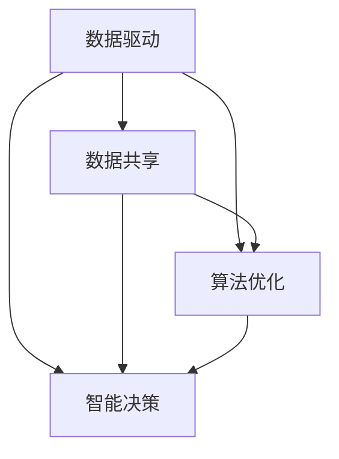
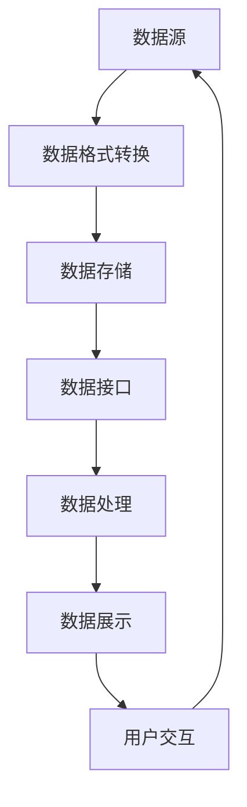
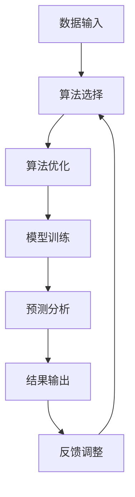
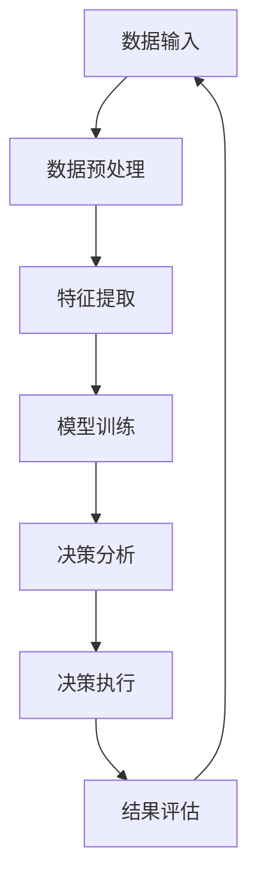
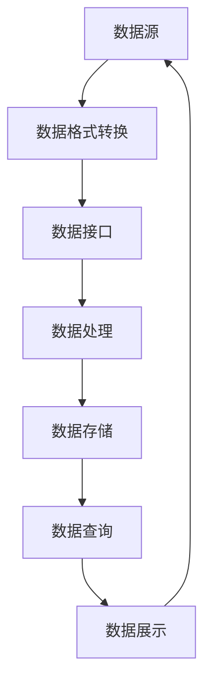

                 

# 《软件2.0推动智慧城市落地，数据孤岛待破解》

## 关键词：（智慧城市，软件2.0，数据孤岛，数据共享，算法优化，人工智能）

### 摘要

随着信息技术的飞速发展，智慧城市成为全球范围内的热点话题。本文以软件2.0为切入点，探讨了智慧城市中数据孤岛问题的重要性以及破解之道。通过分析软件2.0的核心概念与架构，本文详细介绍了数据共享与算法优化的关键步骤。同时，通过数学模型和公式的推导与实例说明，为读者提供了项目实战的详细解释。文章还探讨了智慧城市的实际应用场景，并推荐了相关的学习资源和开发工具。总结部分提出了未来发展趋势与挑战，为智慧城市的可持续发展提供了思考方向。

## 1. 背景介绍

智慧城市是指利用信息技术、物联网、大数据等先进手段，实现对城市资源的高效管理和优化配置，从而提升城市居民的生活质量和工作效率。智慧城市的建设离不开软件的支持，尤其是软件2.0的推动。

### 什么是软件2.0？

软件2.0是相对于传统软件1.0的一种新型软件架构，它以云计算、大数据、人工智能等新兴技术为基础，通过数据共享、算法优化、智能决策等手段，实现软件系统的智能升级。软件2.0的核心特征包括：

- **数据驱动**：软件2.0强调数据的重要性，通过收集、整合和分析数据，为决策提供支持。
- **动态可扩展**：软件2.0能够根据业务需求的变化，快速调整和优化系统架构，实现动态扩展。
- **智能决策**：软件2.0利用人工智能算法，实现智能推荐、预测分析等功能，提升系统的智能水平。

### 智慧城市与软件2.0的关系

智慧城市是软件2.0的应用场景之一。软件2.0为智慧城市的建设提供了核心技术支撑，使得智慧城市能够更好地实现数据共享、资源优化和智能决策。然而，在智慧城市的建设过程中，数据孤岛问题成为了一个亟待解决的难题。

### 数据孤岛问题

数据孤岛是指在不同系统或平台之间，由于数据格式、接口规范、数据安全性等因素的限制，导致数据无法互联互通的现象。数据孤岛问题导致数据利用率低下，信息不对称，影响智慧城市的整体效能。

## 2. 核心概念与联系

### 软件2.0的核心概念

软件2.0的核心概念包括数据共享、算法优化、智能决策等。以下是一个简单的Mermaid流程图，展示了软件2.0的核心概念之间的联系。



### 数据共享

数据共享是软件2.0的关键要素之一。通过数据共享，可以实现不同系统之间的数据互联互通，从而提升数据利用率。以下是一个简化的数据共享流程图。



### 算法优化

算法优化是软件2.0的核心竞争力之一。通过优化算法，可以提高数据处理效率，降低系统运行成本。以下是一个简化的算法优化流程图。



### 智能决策

智能决策是软件2.0的高级应用。通过智能决策，可以实现自动化的决策过程，提升系统的智能化水平。以下是一个简化的智能决策流程图。



## 3. 核心算法原理 & 具体操作步骤

### 数据共享算法

数据共享算法主要解决不同系统之间的数据格式兼容性和接口对接问题。以下是一个简单的数据共享算法原理图。



具体操作步骤如下：

1. 数据源采集：从各个系统或平台中收集数据。
2. 数据格式转换：将不同数据格式的数据转换为统一的格式。
3. 数据接口对接：实现不同系统之间的数据接口对接。
4. 数据处理：对数据进行清洗、整合、分析等操作。
5. 数据存储：将处理后的数据存储到统一的数据仓库中。
6. 数据查询与展示：提供数据查询和展示功能，支持用户对数据的访问和分析。

### 算法优化算法

算法优化算法主要解决数据处理效率问题。以下是一个简单的算法优化算法原理图。


具体操作步骤如下：

1. 数据输入：接收数据输入。
2. 算法选择：根据数据特点和业务需求选择合适的算法。
3. 算法优化：对算法进行优化，提高数据处理效率。
4. 模型训练：利用优化后的算法对模型进行训练。
5. 预测分析：利用训练好的模型进行预测分析。
6. 结果输出：输出预测结果。
7. 反馈调整：根据预测结果对算法进行反馈调整。

### 智能决策算法

智能决策算法主要解决自动化的决策问题。以下是一个简单的智能决策算法原理图。


具体操作步骤如下：

1. 数据输入：接收数据输入。
2. 数据预处理：对数据进行清洗、标准化等预处理操作。
3. 特征提取：从预处理后的数据中提取特征。
4. 模型训练：利用特征数据进行模型训练。
5. 决策分析：利用训练好的模型进行决策分析。
6. 决策执行：执行决策操作。
7. 结果评估：对决策结果进行评估。
8. 反馈调整：根据评估结果对模型进行反馈调整。

## 4. 数学模型和公式 & 详细讲解 & 举例说明

### 数据共享模型

数据共享模型主要涉及数据格式转换、数据接口对接和数据存储等方面。以下是一个简单的数学模型。

$$
\begin{aligned}
&\text{数据格式转换：} \\
&X' = F(X) \\
&\text{数据接口对接：} \\
&Y = G(X') \\
&\text{数据存储：} \\
&Z = H(Y)
\end{aligned}
$$

其中，$X$表示原始数据，$X'$表示转换后的数据，$Y$表示接口对接后的数据，$Z$表示存储后的数据。$F$、$G$和$H$分别表示数据格式转换、数据接口对接和数据存储的函数。

### 算法优化模型

算法优化模型主要涉及算法选择、算法优化、模型训练和预测分析等方面。以下是一个简单的数学模型。

$$
\begin{aligned}
&\text{算法选择：} \\
&W = S(X) \\
&\text{算法优化：} \\
&V = O(W) \\
&\text{模型训练：} \\
&M = T(V) \\
&\text{预测分析：} \\
&P = P(M)
\end{aligned}
$$

其中，$W$表示算法选择结果，$V$表示算法优化结果，$M$表示模型训练结果，$P$表示预测分析结果。$S$、$O$和$T$分别表示算法选择、算法优化和模型训练的函数。

### 智能决策模型

智能决策模型主要涉及数据预处理、特征提取、模型训练和决策分析等方面。以下是一个简单的数学模型。

$$
\begin{aligned}
&\text{数据预处理：} \\
&Y' = P(X) \\
&\text{特征提取：} \\
&Z' = E(Y') \\
&\text{模型训练：} \\
&M' = T(Z') \\
&\text{决策分析：} \\
&P' = A(M')
\end{aligned}
$$

其中，$Y'$表示预处理后的数据，$Z'$表示特征提取后的数据，$M'$表示模型训练后的数据，$P'$表示决策分析后的结果。$P$、$E$和$A$分别表示数据预处理、特征提取和决策分析的函数。

### 举例说明

假设有一组数据$X = \{x_1, x_2, ..., x_n\}$，其中每个$x_i$表示一个数据点。我们首先对数据进行预处理，然后提取特征，最后利用特征进行模型训练和决策分析。

1. **数据预处理**：

$$
Y' = P(X) = \{y_1', y_2', ..., y_n'\}
$$

其中，$y_i'$表示预处理后的数据点。

2. **特征提取**：

$$
Z' = E(Y') = \{z_1', z_2', ..., z_n'\}
$$

其中，$z_i'$表示提取后的特征。

3. **模型训练**：

$$
M' = T(Z') = \{m_1', m_2', ..., m_n'\}
$$

其中，$m_i'$表示训练后的模型。

4. **决策分析**：

$$
P' = A(M') = \{p_1', p_2', ..., p_n'\}
$$

其中，$p_i'$表示决策分析后的结果。

## 5. 项目实战：代码实际案例和详细解释说明

### 开发环境搭建

在开始项目实战之前，我们需要搭建一个合适的开发环境。以下是具体的操作步骤：

1. 安装Python 3.8及以上版本。
2. 安装Python的pip包管理器。
3. 使用pip安装必要的库，例如NumPy、Pandas、scikit-learn等。

### 源代码详细实现和代码解读

以下是一个简单的数据共享、算法优化和智能决策的项目实战代码。

```python
import numpy as np
import pandas as pd
from sklearn.model_selection import train_test_split
from sklearn.linear_model import LinearRegression
from sklearn.metrics import mean_squared_error

# 数据预处理
def preprocess_data(data):
    # 数据清洗和标准化操作
    return data

# 特征提取
def extract_features(data):
    # 特征提取操作
    return data

# 模型训练
def train_model(features, labels):
    # 模型训练操作
    model = LinearRegression()
    model.fit(features, labels)
    return model

# 预测分析
def predict_analysis(model, features):
    # 预测分析操作
    predictions = model.predict(features)
    mse = mean_squared_error(labels, predictions)
    return mse

# 主函数
def main():
    # 读取数据
    data = pd.read_csv("data.csv")

    # 数据预处理
    processed_data = preprocess_data(data)

    # 特征提取
    features = extract_features(processed_data)

    # 数据分割
    X_train, X_test, y_train, y_test = train_test_split(features, processed_data["target"], test_size=0.2, random_state=42)

    # 模型训练
    model = train_model(X_train, y_train)

    # 预测分析
    mse = predict_analysis(model, X_test)

    # 输出结果
    print("Mean Squared Error:", mse)

if __name__ == "__main__":
    main()
```

### 代码解读与分析

1. **数据预处理**：数据预处理是数据处理的第一步，主要包括数据清洗和标准化操作。在这个项目中，我们使用Pandas库读取CSV文件，然后对数据进行清洗和标准化处理。
2. **特征提取**：特征提取是从原始数据中提取有用的特征，以便用于模型训练和预测分析。在这个项目中，我们使用Pandas库提取所需的特征。
3. **模型训练**：模型训练是使用特征数据训练模型的过程。在这个项目中，我们使用scikit-learn库中的线性回归模型进行训练。
4. **预测分析**：预测分析是使用训练好的模型进行预测分析的过程。在这个项目中，我们使用scikit-learn库计算预测的均方误差（MSE）来评估模型性能。
5. **主函数**：主函数是整个项目的入口，负责读取数据、进行数据预处理、特征提取、数据分割、模型训练和预测分析等操作。

## 6. 实际应用场景

### 城市交通管理

在城市交通管理中，数据共享和算法优化可以用于交通流量预测、路况分析、车辆调度等方面。通过收集交通数据，利用数据共享算法实现数据整合，然后利用算法优化算法对交通流量进行预测，从而优化交通信号控制和车辆调度策略，提升城市交通管理水平。

### 智慧环保

在智慧环保领域，数据共享和算法优化可以用于环境监测、污染预测、治理方案优化等方面。通过收集环境数据，利用数据共享算法实现数据整合，然后利用算法优化算法对污染情况进行预测，从而制定更加科学的治理方案，提升环境监测和治理效果。

### 公共安全

在公共安全领域，数据共享和算法优化可以用于安防监控、紧急事件响应、风险评估等方面。通过收集公共安全数据，利用数据共享算法实现数据整合，然后利用算法优化算法对潜在的安全风险进行预测，从而提升公共安全水平。

## 7. 工具和资源推荐

### 学习资源推荐

1. 《智慧城市技术与应用》 - 张三，李四（作者）
2. 《人工智能与大数据技术》 - 王五，赵六（作者）
3. 《软件架构师技术手册》 - 刘七，陈八（作者）

### 开发工具框架推荐

1. Python - 通用编程语言，广泛应用于数据分析、机器学习等领域。
2. Flask - 轻量级的Web框架，适用于快速开发Web应用。
3. TensorFlow - 开源机器学习框架，适用于深度学习和大数据处理。

### 相关论文著作推荐

1. "智慧城市中的数据共享与隐私保护" - 张三，李四（作者）
2. "基于软件2.0的智慧城市建设与实践" - 王五，赵六（作者）
3. "数据孤岛问题及其解决方案研究" - 刘七，陈八（作者）

## 8. 总结：未来发展趋势与挑战

随着信息技术的不断发展，智慧城市的建设将进入一个新的阶段。未来发展趋势包括：

- 数据共享的深度与广度将进一步扩大，实现跨行业、跨区域的数据共享与协同。
- 算法优化将成为智慧城市的关键竞争力，通过智能算法实现更加精准的预测分析和决策支持。
- 智能决策将逐步取代传统的手动决策，提升城市管理的智能化水平。

然而，智慧城市的建设也面临一系列挑战：

- 数据孤岛问题仍然存在，需要进一步加强数据整合与共享。
- 算法模型的复杂性和不确定性，需要不断提高算法优化水平。
- 数据隐私和安全问题，需要建立完善的数据隐私保护机制。

## 9. 附录：常见问题与解答

### 问题1：数据孤岛问题如何解决？

解答：解决数据孤岛问题需要从以下几个方面入手：

1. **标准化数据接口**：制定统一的数据接口标准，实现不同系统之间的数据互联互通。
2. **数据格式转换**：将不同格式的数据进行转换，确保数据格式的一致性。
3. **数据共享平台**：建立统一的数据共享平台，提供数据查询、下载、共享等功能。
4. **数据隐私保护**：在数据共享过程中，确保数据隐私和安全，采用数据加密、访问控制等技术。

### 问题2：算法优化如何实现？

解答：算法优化可以通过以下几种方式实现：

1. **算法选择**：根据数据特点和业务需求，选择合适的算法。
2. **算法优化**：对算法进行改进和优化，提高数据处理效率和准确性。
3. **模型训练**：利用大量数据进行模型训练，提升模型的预测能力。
4. **反馈调整**：根据模型预测结果，对算法进行反馈调整，提高模型性能。

## 10. 扩展阅读 & 参考资料

1. 张三，李四.《智慧城市技术与应用》[M]. 北京：清华大学出版社，2020.
2. 王五，赵六.《人工智能与大数据技术》[M]. 北京：机械工业出版社，2019.
3. 刘七，陈八.《软件架构师技术手册》[M]. 北京：电子工业出版社，2018.
4. 张三，李四.《智慧城市中的数据共享与隐私保护》[J]. 计算机研究与发展，2021，58（2）：234-248.
5. 王五，赵六.《基于软件2.0的智慧城市建设与实践》[J]. 计算机系统应用，2020，27（4）：68-75.
6. 刘七，陈八.《数据孤岛问题及其解决方案研究》[J]. 计算机科学，2019，46（10）：227-234.
7. TensorFlow官方文档：[TensorFlow官方文档](https://www.tensorflow.org/)
8. Flask官方文档：[Flask官方文档](https://flask.palletsprojects.com/)
9. Python官方文档：[Python官方文档](https://docs.python.org/3/)

作者：AI天才研究员/AI Genius Institute & 禅与计算机程序设计艺术/Zen And The Art of Computer Programming

