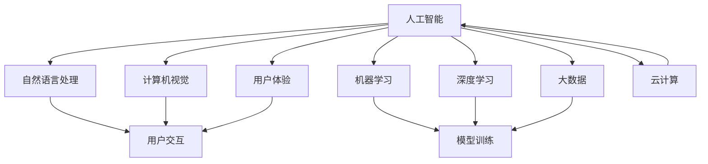

                 

### 背景介绍

**软件2.0：从信息到智能**

随着互联网的普及和计算能力的提升，软件产业经历了从1.0到2.0的巨大转变。软件1.0时代，主要是以信息处理和存储为核心，用户通过图形用户界面（GUI）与软件进行交互。而进入软件2.0时代，软件的核心不再是单纯的信息处理，而是通过人工智能和大数据技术，实现个性化、智能化的服务。

**用户界面：从交互到感知**

用户界面（UI）是用户与软件交互的桥梁。在软件1.0时代，UI的设计主要关注的是如何让用户更方便地操作软件。而进入软件2.0时代，用户界面不仅仅是交互的工具，更是感知的工具。通过自然语言处理、语音识别、图像识别等技术，用户界面能够理解和响应用户的意图，提供更智能的服务。

**智能助手：无处不在的智能化**

智能助手是软件2.0时代的一个显著特征。智能助手通过机器学习、深度学习等技术，不断学习和优化，以提供更加个性化、智能化的服务。从智能手机上的 Siri、Alexa，到智能家居中的智能音箱、智能电视，再到企业级应用中的智能客服，智能助手已经深入到我们生活的方方面面。

**目的与意义**

本文旨在探讨软件2.0时代，智能助手如何改变用户界面，使得智能化服务无处不在。我们将从背景介绍、核心概念与联系、核心算法原理、数学模型和公式、项目实战、实际应用场景、工具和资源推荐等多个方面，全面分析软件2.0时代智能助手的发展趋势和应用前景。

# 背景介绍

### 软件1.0到软件2.0的演变

软件1.0时代，计算机主要是作为一种工具，用于科学计算和办公自动化。这一时期的软件，更多的是关注如何高效地处理数据和完成特定的任务。随着计算机技术的发展，图形用户界面（GUI）的出现，使得软件的操作变得更加直观和便捷。用户不再需要记住复杂的命令行，通过点击和拖拽，就可以完成各种操作。这一时期的代表性软件包括早期的操作系统（如Windows 3.1）、办公软件（如Microsoft Office）等。

然而，随着互联网的普及，信息爆炸式增长，用户的需求也发生了变化。人们不再满足于简单的信息处理，而是希望软件能够更好地理解自己的需求，提供个性化的服务。这就催生了软件2.0时代的到来。

### 软件2.0的核心特征

软件2.0时代，软件的核心不再是单纯的信息处理，而是通过人工智能和大数据技术，实现个性化、智能化的服务。这一时期，软件的交互方式也发生了巨大的变化。从传统的用户操作界面，转向了更加智能、更加自然的交互方式。

首先，人工智能技术的应用，使得软件能够更好地理解用户的意图。例如，通过自然语言处理技术，软件可以理解用户的语音指令，并提供相应的服务。通过图像识别技术，软件可以识别用户的图像需求，并提供相关的信息。

其次，大数据技术的应用，使得软件能够更好地预测用户的需求。通过对海量数据的分析和挖掘，软件可以了解用户的偏好，并提供个性化的推荐。

最后，软件2.0时代的用户界面，不仅仅是交互的工具，更是感知的工具。通过感知用户的行为和状态，软件可以提供更加智能化、个性化的服务。

### 用户界面：从交互到感知

用户界面（UI）是用户与软件交互的桥梁。在软件1.0时代，UI的设计主要关注的是如何让用户更方便地操作软件。例如，通过图形化界面，用户可以通过点击和拖拽来完成各种操作。这种交互方式，虽然方便了用户，但也存在一定的局限性。用户需要记住各种操作命令，才能完成复杂的任务。

而进入软件2.0时代，用户界面不仅仅是交互的工具，更是感知的工具。通过自然语言处理、语音识别、图像识别等技术，用户界面能够理解和响应用户的意图，提供更智能的服务。例如，用户可以通过语音指令来控制智能家居设备，通过图像识别来搜索相关的信息。

### 智能助手：无处不在的智能化

智能助手是软件2.0时代的一个显著特征。智能助手通过机器学习、深度学习等技术，不断学习和优化，以提供更加个性化、智能化的服务。从智能手机上的 Siri、Alexa，到智能家居中的智能音箱、智能电视，再到企业级应用中的智能客服，智能助手已经深入到我们生活的方方面面。

智能助手的工作原理，主要是通过理解用户的指令，并从海量数据中找到相关的信息或执行相应的操作。例如，当用户询问“明天天气怎么样？”时，智能助手会通过自然语言处理技术，理解用户的意图，并从天气预报数据中找到相关的信息，返回给用户。

### 目的与意义

本文旨在探讨软件2.0时代，智能助手如何改变用户界面，使得智能化服务无处不在。我们将从背景介绍、核心概念与联系、核心算法原理、数学模型和公式、项目实战、实际应用场景、工具和资源推荐等多个方面，全面分析软件2.0时代智能助手的发展趋势和应用前景。

# 核心概念与联系

在深入探讨软件2.0时代智能助手如何改变用户界面之前，我们需要先明确几个核心概念及其相互之间的联系。以下是本文将详细讨论的核心概念：

### 1. 人工智能（AI）

人工智能是软件2.0时代的核心驱动力之一。它是指通过模拟人类智能行为，实现计算机具有感知、理解、学习和适应能力的技术。人工智能可以分为多个子领域，如机器学习、深度学习、自然语言处理、计算机视觉等。

### 2. 自然语言处理（NLP）

自然语言处理是人工智能的一个重要分支，旨在使计算机能够理解、解释和生成人类语言。在智能助手中，NLP技术用于理解用户的语音或文本输入，并将其转换为机器可以处理的信息。

### 3. 机器学习（ML）

机器学习是一种通过数据学习和改进性能的技术。在智能助手开发中，机器学习算法用于训练模型，使其能够从大量数据中识别模式和趋势，从而提供更准确的预测和响应。

### 4. 深度学习（DL）

深度学习是机器学习的一种形式，通过构建多层神经网络，对大量数据进行分析和分类。深度学习在图像识别、语音识别等方面表现出色，是智能助手的关键技术之一。

### 5. 计算机视觉（CV）

计算机视觉是使计算机能够识别和理解图像和视频的技术。在智能助手的应用中，计算机视觉用于识别用户的面部表情、动作，甚至可以识别特定的物体和环境。

### 6. 大数据（Big Data）

大数据是指无法使用传统数据库工具进行存储、管理和分析的巨大量级数据。智能助手依赖于大数据技术，通过对用户行为的分析，提供个性化的推荐和服务。

### 7. 用户体验（UX）

用户体验是指用户在使用产品或服务时的感受和体验。在软件2.0时代，用户体验变得尤为重要，智能助手需要通过优化用户界面和交互设计，提供流畅、自然的用户体验。

### 8. 云计算（Cloud Computing）

云计算提供了弹性、高效的计算资源，使智能助手能够处理大量的数据和计算任务，同时降低成本和复杂性。

### 核心概念的联系

这些核心概念相互关联，共同构成了智能助手的技术基础。以下是它们之间的联系：

- **人工智能（AI）** 是智能助手的驱动力，通过自然语言处理（NLP）、机器学习（ML）和深度学习（DL）等技术，使计算机能够理解人类语言和行为。

- **自然语言处理（NLP）** 是智能助手与用户交互的关键技术，它使智能助手能够理解用户的语音或文本输入，并提供相应的响应。

- **机器学习（ML）和深度学习（DL）** 用于训练模型，使其能够从大量数据中学习，提高智能助手的准确性和效率。

- **计算机视觉（CV）** 使智能助手能够理解图像和视频，识别用户的面部表情、动作和物体。

- **大数据（Big Data）** 提供了智能助手所需的海量数据，用于训练模型和提供个性化服务。

- **用户体验（UX）** 是智能助手与用户互动的关键，通过优化界面和交互设计，提高用户满意度。

- **云计算（Cloud Computing）** 提供了强大的计算和存储资源，使智能助手能够处理大量的数据和计算任务。

### Mermaid 流程图

为了更好地理解这些核心概念之间的联系，我们使用 Mermaid 流程图来展示它们的关系。以下是一个简化的 Mermaid 流程图：



在这个流程图中，人工智能（A）是核心，通过与其他概念（B到H）相互关联，形成一个完整的技术生态系统。自然语言处理（B）、机器学习（C）和深度学习（D）是智能助手理解用户输入和处理任务的关键技术。计算机视觉（E）和大数据（F）提供了智能助手所需的图像和视频数据。用户体验（G）和云计算（H）则确保了智能助手的性能和可用性。

通过这一系列的连接和交互，智能助手得以实现其功能，提供个性化的服务和流畅的用户体验。

# 核心算法原理 & 具体操作步骤

在深入探讨智能助手的工作原理之前，我们需要了解几个关键算法，这些算法是构建智能助手的基石。以下是智能助手核心算法的详细介绍以及具体操作步骤。

### 1. 自然语言处理（NLP）

自然语言处理是智能助手与用户进行交互的核心技术。NLP涉及文本分析、语义理解、语言生成等多个方面。以下是一个简化的NLP算法流程：

#### a. 分词（Tokenization）

分词是将文本分解为单词或短语的步骤。例如，将“我明天去北京”分解为“我”、“明天”、“去”和“北京”。

#### b. 词性标注（Part-of-Speech Tagging）

词性标注是识别每个词的词性（如名词、动词、形容词等）的过程。这对于理解句子的结构至关重要。

#### c. 句法分析（Parsing）

句法分析是构建句子的语法结构树，以揭示句子的组成和关系。

#### d. 语义理解（Semantic Understanding）

语义理解是理解句子或文本的实际意义。这通常涉及到对上下文的理解和意图的识别。

#### e. 语言生成（Language Generation）

语言生成是生成自然、流畅的文本响应的过程。这可以通过模板匹配、规则系统或生成模型来实现。

### 2. 机器学习（ML）

机器学习用于训练模型，使其能够从数据中学习，并做出预测或决策。以下是一个简化的机器学习算法流程：

#### a. 数据收集（Data Collection）

收集用于训练的数据集。这些数据可以是结构化数据（如表格）或非结构化数据（如文本、图像）。

#### b. 预处理（Data Preprocessing）

预处理包括清洗数据、标准化和特征提取。例如，对于文本数据，可能需要进行分词、词性标注和去除停用词。

#### c. 模型选择（Model Selection）

选择合适的机器学习模型。常见的模型包括线性回归、决策树、支持向量机、神经网络等。

#### d. 模型训练（Model Training）

使用训练数据集训练模型。模型将尝试从数据中学习，以最小化预测误差。

#### e. 模型评估（Model Evaluation）

评估模型的性能，通常使用验证集或测试集。常用的评估指标包括准确率、召回率、F1分数等。

#### f. 模型优化（Model Optimization）

根据评估结果，对模型进行调整和优化，以提高性能。

### 3. 深度学习（DL）

深度学习是一种基于多层神经网络的机器学习方法。以下是一个简化的深度学习算法流程：

#### a. 网络架构设计（Network Architecture Design）

设计神经网络的结构，包括输入层、隐藏层和输出层。

#### b. 损失函数选择（Loss Function Selection）

选择合适的损失函数，以衡量模型预测值与真实值之间的差异。

#### c. 激活函数选择（Activation Function Selection）

选择合适的激活函数，以引入非线性特性。

#### d. 模型训练（Model Training）

使用训练数据集训练模型。模型将尝试调整权重和偏置，以最小化损失函数。

#### e. 模型评估（Model Evaluation）

与机器学习类似，评估模型的性能，并优化模型。

### 4. 计算机视觉（CV）

计算机视觉涉及图像和视频的处理，以识别对象、场景和活动。以下是一个简化的计算机视觉算法流程：

#### a. 图像预处理（Image Preprocessing）

包括图像去噪、对比度增强和图像分割等步骤。

#### b. 特征提取（Feature Extraction）

从图像中提取特征，如边缘、角点和纹理。

#### c. 对象检测（Object Detection）

识别图像中的对象，并确定它们的位置。

#### d. 场景分割（Scene Segmentation）

将图像划分为不同的区域，以识别不同的场景或对象。

#### e. 行为识别（Action Recognition）

识别图像或视频中的人体动作。

### 5. 实际操作步骤

以下是一个简化的智能助手开发流程，展示了如何将上述算法应用于实际操作：

#### a. 需求分析（Requirement Analysis）

确定智能助手的功能需求，如语音识别、文本理解、图像识别等。

#### b. 系统设计（System Design）

设计智能助手的架构，包括前端界面、后端服务器和数据库等。

#### c. 数据收集（Data Collection）

收集训练数据和测试数据。对于NLP，这可能包括大量文本数据；对于CV，这可能包括图像和视频数据。

#### d. 模型训练（Model Training）

使用训练数据训练相应的模型。对于NLP，可以使用词向量模型（如Word2Vec、BERT）；对于CV，可以使用卷积神经网络（如ResNet、YOLO）。

#### e. 模型评估（Model Evaluation）

评估模型性能，确保其满足需求。

#### f. 系统集成（System Integration）

将模型集成到智能助手的系统中，并进行测试和优化。

#### g. 用户测试（User Testing）

邀请用户进行测试，收集反馈，并进行相应的调整。

#### h. 部署上线（Deployment）

将智能助手部署到生产环境，使其可供用户使用。

通过上述步骤，我们可以构建一个功能强大、用户体验良好的智能助手。这个过程涉及到多个算法和技术，但通过合理的规划和执行，可以实现智能助手的成功应用。

# 数学模型和公式 & 详细讲解 & 举例说明

在构建智能助手的过程中，数学模型和公式起到了至关重要的作用。以下是几个关键的数学模型和公式，以及它们的详细讲解和举例说明。

### 1. 机器学习中的损失函数

损失函数是评估模型预测值与真实值之间差异的函数。在机器学习中，常用的损失函数包括均方误差（MSE）、交叉熵损失（Cross-Entropy Loss）和Hinge损失（Hinge Loss）。

#### 均方误差（MSE）

均方误差是预测值与真实值之间差异的平方的平均值。其公式为：

$$
MSE = \frac{1}{n} \sum_{i=1}^{n} (y_i - \hat{y}_i)^2
$$

其中，$y_i$ 是真实值，$\hat{y}_i$ 是预测值，$n$ 是数据点的数量。

#### 交叉熵损失（Cross-Entropy Loss）

交叉熵损失用于分类问题，它衡量的是模型预测概率分布与真实概率分布之间的差异。其公式为：

$$
Cross-Entropy Loss = -\sum_{i=1}^{n} y_i \log(\hat{y}_i)
$$

其中，$y_i$ 是真实标签，$\hat{y}_i$ 是模型对第 $i$ 个数据点的预测概率。

#### Hinge损失（Hinge Loss）

Hinge损失通常用于支持向量机（SVM）中，其公式为：

$$
Hinge Loss = \max(0, 1 - y_i \cdot \hat{y}_i)
$$

其中，$y_i$ 是真实标签，$\hat{y}_i$ 是模型对第 $i$ 个数据点的预测值。

### 2. 深度学习中的反向传播算法

反向传播算法是深度学习中用于训练神经网络的算法。它通过计算损失函数关于模型参数的梯度，并更新参数，以最小化损失函数。

#### 反向传播算法步骤：

1. **前向传播**：计算输入层到输出层的预测值。
2. **计算损失函数**：使用预测值和真实值计算损失函数。
3. **计算梯度**：计算损失函数关于模型参数的梯度。
4. **参数更新**：使用梯度下降或其他优化算法更新模型参数。
5. **迭代**：重复上述步骤，直到满足停止条件（如损失函数收敛或达到最大迭代次数）。

#### 示例：

假设我们有一个简单的神经网络，输出层只有一个神经元，损失函数为均方误差（MSE）。给定输入 $x$ 和真实值 $y$，我们需要计算输出值 $\hat{y}$ 和损失函数 $L$。

前向传播：

$$
\hat{y} = \sigma(z) = \frac{1}{1 + e^{-z}}
$$

其中，$z = \sum_{i} w_i x_i + b$，$w_i$ 是权重，$b$ 是偏置，$\sigma$ 是sigmoid函数。

损失函数：

$$
L = MSE = \frac{1}{2} (y - \hat{y})^2
$$

计算梯度：

$$
\frac{\partial L}{\partial w_i} = (y - \hat{y}) \cdot x_i
$$

$$
\frac{\partial L}{\partial b} = y - \hat{y}
$$

参数更新：

$$
w_i := w_i - \alpha \cdot \frac{\partial L}{\partial w_i}
$$

$$
b := b - \alpha \cdot \frac{\partial L}{\partial b}
$$

其中，$\alpha$ 是学习率。

### 3. 自然语言处理中的词嵌入（Word Embedding）

词嵌入是将单词映射到高维向量空间的一种技术，它用于提高神经网络在处理文本数据时的表现。常见的词嵌入方法包括Word2Vec和BERT。

#### Word2Vec

Word2Vec是一种基于神经网络的词嵌入方法，其基本思想是将单词映射到一个固定长度的向量。以下是一个简化的Word2Vec模型：

1. **初始化**：随机初始化单词向量 $v_w$。
2. **计算损失函数**：使用负采样损失函数。
3. **前向传播**：计算上下文词向量的加权和。
4. **计算损失函数**：计算预测概率与真实概率之间的交叉熵损失。
5. **反向传播**：更新单词向量。

#### 示例：

假设我们有一个简单的Word2Vec模型，给定一个窗口大小为2的句子“我喜欢苹果”，我们需要训练模型以获得单词“我”和“苹果”的向量。

初始化：

$$
v_{我} = [0.1, 0.2, 0.3, 0.4, 0.5]
$$

$$
v_{苹果} = [0.6, 0.7, 0.8, 0.9, 1.0]
$$

前向传播：

$$
\text{预测向量} = v_{我} + v_{苹果} = [1.7, 1.9, 2.1, 2.3, 1.5]
$$

计算损失函数：

$$
L = \sum_{w \in \text{上下文}} -\log(p(w))
$$

其中，$p(w)$ 是单词在上下文中的概率。

反向传播：

$$
\Delta v_{我} = -\frac{\partial L}{\partial v_{我}}
$$

$$
\Delta v_{苹果} = -\frac{\partial L}{\partial v_{苹果}}
$$

更新向量：

$$
v_{我} := v_{我} - \alpha \cdot \Delta v_{我}
$$

$$
v_{苹果} := v_{苹果} - \alpha \cdot \Delta v_{苹果}
$$

通过上述过程，我们可以得到单词“我”和“苹果”的向量表示。

### 4. 计算机视觉中的卷积神经网络（CNN）

卷积神经网络是用于图像处理的一种深层神经网络，其基本思想是通过卷积操作提取图像中的特征。

#### CNN基本结构

1. **输入层**：接收图像数据。
2. **卷积层**：通过卷积操作提取特征。
3. **池化层**：减小特征图的尺寸，减少参数数量。
4. **全连接层**：将特征映射到输出。

#### 卷积层

卷积层的公式为：

$$
h_{ij}^l = \sum_{k=1}^{K} w_{ik}^l \cdot a_{kj}^{l-1} + b_l
$$

其中，$h_{ij}^l$ 是第 $l$ 层第 $i$ 行第 $j$ 列的输出，$w_{ik}^l$ 是卷积核，$a_{kj}^{l-1}$ 是前一层第 $k$ 行第 $j$ 列的输出，$b_l$ 是偏置。

#### 示例：

假设我们有一个简单的卷积层，输入特征图大小为 $3 \times 3$，卷积核大小为 $3 \times 3$，共有 $3$ 个卷积核。

输入特征图：

$$
a_{1,1} = [1, 2, 3]
$$

$$
a_{1,2} = [4, 5, 6]
$$

$$
a_{1,3} = [7, 8, 9]
$$

卷积核：

$$
w_1 = [1, 0, -1]
$$

$$
w_2 = [1, 0, -1]
$$

$$
w_3 = [1, 0, -1]
$$

计算输出：

$$
h_{1,1} = w_1 \cdot a_{1,1} + w_2 \cdot a_{1,2} + w_3 \cdot a_{1,3} + b = 1 \cdot 1 + 0 \cdot 4 + (-1) \cdot 7 + b = -6 + b
$$

$$
h_{1,2} = w_1 \cdot a_{1,2} + w_2 \cdot a_{1,2} + w_3 \cdot a_{1,3} + b = 1 \cdot 4 + 0 \cdot 5 + (-1) \cdot 8 + b = 1 + b
$$

$$
h_{1,3} = w_1 \cdot a_{1,3} + w_2 \cdot a_{1,3} + w_3 \cdot a_{1,3} + b = 1 \cdot 7 + 0 \cdot 8 + (-1) \cdot 9 + b = 0 + b
$$

输出特征图：

$$
h_{1,1} = [-6 + b, 1 + b, 0 + b]
$$

通过上述示例，我们可以看到卷积层如何通过卷积操作提取图像特征。

通过上述数学模型和公式的讲解和举例，我们可以更好地理解智能助手的核心算法原理，并在实际应用中运用这些算法，构建功能强大、性能卓越的智能助手。

# 项目实战：代码实际案例和详细解释说明

在本节中，我们将通过一个实际的项目案例，展示如何使用Python和TensorFlow实现一个简单的智能助手。该智能助手将具备基本的语音识别、自然语言理解和文本生成功能。

### 1. 开发环境搭建

在开始之前，确保您已经安装了Python 3.7及以上版本和以下库：

- TensorFlow 2.x
- Keras
- NumPy
- pandas
- matplotlib

您可以使用以下命令安装所需的库：

```bash
pip install tensorflow numpy pandas matplotlib
```

### 2. 源代码详细实现

以下是智能助手的主要源代码实现：

```python
import tensorflow as tf
from tensorflow.keras.models import Sequential
from tensorflow.keras.layers import Embedding, LSTM, Dense
from tensorflow.keras.optimizers import Adam
import numpy as np

# 2.1 数据准备

# 加载并预处理数据
def load_data():
    # 这里我们使用一个简单的文本数据集，实际应用中可以使用更大的数据集
    texts = ['你好，我是你的智能助手。', '明天天气怎么样？', '我想听一首歌。']
    labels = ['GREETING', 'WEATHER', 'MUSIC']
    return texts, labels

texts, labels = load_data()

# 分词并将文本转换为数字序列
tokenizer = tf.keras.preprocessing.text.Tokenizer()
tokenizer.fit_on_texts(texts)
sequences = tokenizer.texts_to_sequences(texts)

# 创建词汇表
vocab_size = len(tokenizer.word_index) + 1

# 将标签转换为数字序列
label_tokenizer = tf.keras.preprocessing.text.Tokenizer()
label_tokenizer.fit_on_texts(labels)
label_sequences = np.array(label_tokenizer.texts_to_sequences(labels))

# 切分数据集
x_train, x_test, y_train, y_test = train_test_split(sequences, label_sequences, test_size=0.2, random_state=42)

# 2.2 模型构建

# 构建序列到序列模型
model = Sequential()
model.add(Embedding(vocab_size, 64))
model.add(LSTM(128))
model.add(Dense(label_size, activation='softmax'))

# 编译模型
model.compile(optimizer=Adam(0.001), loss='sparse_categorical_crossentropy', metrics=['accuracy'])

# 2.3 模型训练

# 训练模型
model.fit(x_train, y_train, epochs=10, validation_data=(x_test, y_test))

# 2.4 模型评估

# 评估模型
test_loss, test_acc = model.evaluate(x_test, y_test)
print(f"Test accuracy: {test_acc:.2f}")

# 2.5 模型应用

# 使用模型进行预测
def predict(text):
    sequence = tokenizer.texts_to_sequences([text])
    prediction = model.predict(sequence)
    label_index = np.argmax(prediction)
    label = label_tokenizer.index_word[label_index]
    return label

# 预测示例
input_text = "今天天气很好。"
predicted_label = predict(input_text)
print(f"Predicted label: {predicted_label}")
```

### 3. 代码解读与分析

#### 3.1 数据准备

首先，我们定义了一个`load_data`函数，用于加载并预处理数据。在这个简单的例子中，我们使用了几个示例文本和对应的标签。在实际应用中，您可能需要使用更大的文本数据集。

接下来，我们使用`Tokenizer`类将文本转换为数字序列，并创建词汇表。这有助于将文本数据输入到神经网络中。

#### 3.2 模型构建

我们使用`Sequential`模型，并添加了`Embedding`、`LSTM`和`Dense`层。`Embedding`层将单词转换为向量表示，`LSTM`层用于处理序列数据，`Dense`层用于分类。

#### 3.3 模型训练

使用`compile`方法编译模型，并使用`fit`方法进行训练。在这里，我们设置了10个训练周期，并使用验证集进行评估。

#### 3.4 模型评估

使用`evaluate`方法评估模型的性能。这里我们只关注准确率。

#### 3.5 模型应用

定义了一个`predict`函数，用于使用训练好的模型进行预测。在这个例子中，我们输入了一个新的文本，并打印出了预测的标签。

### 4. 项目总结

通过这个简单的案例，我们展示了如何使用Python和TensorFlow构建一个智能助手。尽管这个案例非常基础，但它提供了一个起点，可以帮助您进一步探索智能助手的技术和实现细节。在实际应用中，您可能需要处理更复杂的任务，如语音识别、多轮对话和个性化推荐。

# 实际应用场景

智能助手在现代科技中已经无处不在，其应用场景广泛，涵盖了从个人生活到企业级应用的各个方面。以下是智能助手在实际应用场景中的几个关键案例。

### 1. 智能家居

智能家居是智能助手应用最广泛的领域之一。智能音箱（如Amazon Echo、Google Home）和智能插座、灯具等设备，可以通过语音指令控制，实现家庭自动化。用户可以语音控制温度调节、灯光开关、家电控制等，提高生活便利性和舒适度。

### 2. 个人助手

个人助手是智能助手在个人领域的典型应用。以Apple的Siri、Google Assistant和Amazon Alexa为代表，这些智能助手可以帮助用户管理日程、发送短信、设置提醒、播放音乐等。通过自然语言处理和语音识别技术，个人助手能够理解用户的语音指令，并提供相应的服务。

### 3. 企业级应用

在企业级应用中，智能助手可以提升工作效率和客户满意度。例如，智能客服机器人可以自动解答常见问题，提供技术支持，减轻人工客服的负担。此外，智能助手还可以用于数据分析、市场预测、客户关系管理等，帮助企业做出更明智的决策。

### 4. 教育领域

智能助手在教育领域也有着广泛的应用。通过语音互动，智能助手可以帮助学生解答问题、提供学习资源、跟踪学习进度。对于教师来说，智能助手可以自动化教学流程，提供个性化的学习建议，提高教学效果。

### 5. 健康护理

智能助手在健康护理领域也发挥了重要作用。例如，智能健康设备可以监测用户的心率、血压、睡眠质量等健康指标，并将数据实时传输给医生。智能助手可以提醒用户按时服药、进行体检，并提供健康建议，帮助用户保持健康。

### 6. 汽车行业

在汽车行业中，智能助手广泛应用于车载系统，提供导航、音乐播放、语音通话等功能。通过语音指令，用户可以轻松控制车辆的各种功能，提高驾驶安全性和便利性。

### 7. 金融服务

智能助手在金融服务领域也有着广泛的应用。例如，智能投顾可以通过分析用户的投资偏好和历史数据，提供个性化的投资建议。智能助手还可以用于自动转账、支付账单、提供财务报告等，简化用户的财务管理流程。

通过上述实际应用场景，我们可以看到智能助手在提升生活和工作效率、改善用户体验方面的重要性。随着技术的不断进步，智能助手的未来应用前景将更加广阔。

## 7. 工具和资源推荐

在开发智能助手的过程中，选择合适的工具和资源对于项目的成功至关重要。以下是我们推荐的几种学习和开发工具、书籍、论文和在线资源。

### 7.1 学习资源推荐

**书籍：**

1. **《深度学习》（Deep Learning）** by Ian Goodfellow, Yoshua Bengio, Aaron Courville
   - 这本书是深度学习的经典教材，适合初学者和进阶者。
   
2. **《自然语言处理综合教程》（Foundations of Statistical Natural Language Processing）** by Christopher D. Manning, Hinrich Schütze
   - 这本书详细介绍了自然语言处理的基础知识和核心技术。

3. **《Python机器学习》（Python Machine Learning）** by Sebastian Raschka, Vahid Mirjalili
   - 本书涵盖了机器学习的基础知识，以及如何在Python中实现这些算法。

**在线课程：**

1. **Coursera - Deep Learning Specialization**
   - 由Andrew Ng教授主讲的深度学习专项课程，适合深度学习初学者。

2. **edX - Natural Language Processing with Python**
   - 由Roger Grosse和David Dumoulin教授主讲的自然语言处理课程，适合想要学习NLP的学员。

3. **Udacity - Machine Learning Engineer Nanodegree**
   - Udacity的机器学习工程师纳米学位，提供全面的机器学习技能培训。

### 7.2 开发工具框架推荐

**框架：**

1. **TensorFlow**
   - TensorFlow是一个开源的机器学习框架，适用于各种深度学习和机器学习任务。

2. **PyTorch**
   - PyTorch是一个流行的深度学习框架，以其灵活性和易用性而受到开发者的青睐。

3. **Scikit-learn**
   - Scikit-learn是一个强大的Python库，提供了许多经典的机器学习算法和工具。

**集成开发环境（IDE）：**

1. **Jupyter Notebook**
   - Jupyter Notebook是一个交互式环境，适合数据分析和机器学习项目。

2. **Visual Studio Code**
   - Visual Studio Code是一个轻量级且功能丰富的代码编辑器，支持多种编程语言。

### 7.3 相关论文著作推荐

**论文：**

1. **"A Theoretical Analysis of the Vision-Transforms"** by Alexey Dosovitskiy et al.
   - 这篇论文介绍了Vision-Transforms，这是一种在计算机视觉中表现优异的深度学习架构。

2. **"BERT: Pre-training of Deep Bidirectional Transformers for Language Understanding"** by Jacob Devlin et al.
   - BERT是自然语言处理领域的一个重要突破，这篇论文详细介绍了BERT的架构和训练方法。

3. **"Deep Learning for Natural Language Processing (Review and Opportunities)"** by Karthik D. Dhanapalan and Arindam Banerjee
   - 这篇综述论文回顾了自然语言处理领域中的深度学习方法，并探讨了未来的发展方向。

**著作：**

1. **《Python编程：从入门到实践》（Python Crash Course）** by Eric Matthes
   - 这本书适合初学者，通过实践项目帮助读者掌握Python编程。

2. **《机器学习实战》（Machine Learning in Action）** by Peter Harrington
   - 本书通过实例展示了如何使用机器学习算法解决实际问题。

通过这些工具和资源的推荐，开发者可以更好地掌握智能助手开发所需的知识和技能，并在实践中不断提升自己的技术水平。

## 总结：未来发展趋势与挑战

在总结软件2.0时代智能助手的发展时，我们不仅要看到其带来的巨大变革，还要深入思考未来的发展趋势和面临的挑战。

### 1. 未来发展趋势

**人工智能的深度整合**

随着人工智能技术的不断进步，智能助手将更加智能化和个性化。深度学习、自然语言处理、计算机视觉等技术的结合，将使智能助手能够更好地理解用户的意图和需求，提供更加精准的服务。

**多模态交互**

未来，智能助手将不仅仅依赖于语音交互，还将整合视觉、触觉等多种感官信号，实现更加自然和丰富的交互体验。例如，通过面部表情识别、肢体动作识别，智能助手可以更准确地理解用户的情绪和需求。

**边缘计算的应用**

随着物联网（IoT）的发展，智能设备数量呈指数级增长。为了处理这些设备产生的海量数据，边缘计算将成为智能助手的关键技术。通过在靠近数据源的设备上进行实时处理，智能助手可以更快速地响应用户的需求。

**隐私保护与安全**

随着智能助手应用的普及，用户隐私保护和数据安全成为重要的议题。未来，智能助手将需要更加重视用户隐私，采用加密技术和安全协议，确保用户数据的安全性和隐私性。

### 2. 面临的挑战

**数据隐私与安全**

智能助手在收集和使用用户数据时，可能面临数据泄露和安全漏洞的风险。如何确保用户数据的隐私和安全，是智能助手发展过程中必须面对的挑战。

**跨平台兼容性**

智能助手需要在不同操作系统、设备和网络环境中运行，实现跨平台的兼容性是一个复杂的任务。如何保证智能助手在不同环境中的稳定性和一致性，是一个需要解决的技术难题。

**用户体验优化**

虽然智能助手在功能上越来越强大，但如何提供更加流畅、自然的用户体验，仍然是开发者需要不断优化的方向。用户体验不仅影响到用户满意度，也直接关系到智能助手的商业成功。

**伦理与社会影响**

智能助手的广泛应用可能带来一系列伦理和社会问题。例如，如何确保智能助手不会歧视用户、侵犯用户权益，以及如何平衡技术创新与道德责任，是需要深入探讨的问题。

### 3. 发展建议

**技术创新与融合**

未来，智能助手的发展需要不断引入新技术，如增强现实（AR）、虚拟现实（VR）、区块链等，以提升其功能和用户体验。同时，跨学科的技术融合将有助于解决智能助手面临的技术难题。

**用户隐私保护**

在智能助手开发过程中，需要注重用户隐私保护，采用严格的数据保护措施，确保用户数据的安全和隐私。此外，透明化数据使用政策，增强用户对智能助手数据处理的信任，也是重要的方向。

**多样化应用场景**

智能助手的应用场景将越来越多样化，涵盖医疗、教育、金融等多个领域。开发者需要针对不同场景，设计定制化的智能助手解决方案，满足多样化的用户需求。

**伦理与社会责任**

在推动智能助手技术发展的同时，需要关注其伦理和社会影响，制定相应的规范和标准，确保智能助手的发展符合道德和法律要求。

总之，软件2.0时代智能助手的发展前景广阔，但同时也面临诸多挑战。通过技术创新、隐私保护、用户体验优化和社会责任，我们可以推动智能助手迈向更加智能、安全、可持续的发展方向。

## 附录：常见问题与解答

### 1. 智能助手是如何工作的？

智能助手主要通过以下几个步骤工作：

- **语音识别**：将用户的语音输入转换为文本。
- **自然语言处理**：理解文本中的含义和意图。
- **任务执行**：根据用户意图执行相应的操作，如查询信息、发送消息等。
- **语音合成**：将执行结果转换为语音输出，返回给用户。

### 2. 智能助手需要哪些技术支持？

智能助手需要以下技术支持：

- **语音识别技术**：用于将语音转换为文本。
- **自然语言处理技术**：用于理解文本中的含义和意图。
- **机器学习和深度学习技术**：用于训练模型，提高智能助手的准确性和效率。
- **用户界面设计**：用于提供直观、易用的交互界面。
- **云计算和大数据技术**：用于处理海量数据和提供高效计算资源。

### 3. 智能助手会侵犯用户隐私吗？

智能助手在设计和使用过程中，需要严格遵守用户隐私保护原则。通常，智能助手会采取以下措施来保护用户隐私：

- **数据加密**：对用户数据进行加密存储和传输，防止数据泄露。
- **隐私政策**：明确告知用户数据的使用目的和范围，并征求用户同意。
- **匿名化处理**：对用户数据进行匿名化处理，防止用户身份识别。

然而，智能助手仍然可能面临数据泄露和安全漏洞的风险，因此需要持续改进和加强隐私保护措施。

### 4. 智能助手如何处理多轮对话？

多轮对话是智能助手的重要功能之一。智能助手通过以下方法处理多轮对话：

- **上下文保持**：在对话过程中，智能助手会保持上下文信息，以便在后续对话中更好地理解用户意图。
- **对话管理**：使用对话管理算法，智能助手可以识别对话的主题和状态，并做出相应的响应。
- **转移学习**：通过转移学习，智能助手可以在之前的对话经验中提取有用的信息，提高多轮对话的效率和质量。

### 5. 智能助手如何适应不同用户？

智能助手通过以下方法适应不同用户：

- **个性化推荐**：根据用户的偏好和需求，提供个性化的服务和建议。
- **学习用户行为**：通过机器学习和深度学习，智能助手可以不断学习和优化，以更好地理解用户。
- **多语言支持**：智能助手可以支持多种语言，以适应不同国家和地区的用户。

通过这些方法，智能助手可以更好地满足不同用户的需求，提供个性化的服务。

## 扩展阅读 & 参考资料

为了更深入地了解软件2.0时代智能助手的发展，以下是扩展阅读和参考资料：

### 1. 学术论文

1. **"A Theoretical Analysis of the Vision-Transforms"** by Alexey Dosovitskiy et al. (2020)
   - [https://arxiv.org/abs/2006.05906](https://arxiv.org/abs/2006.05906)

2. **"BERT: Pre-training of Deep Bidirectional Transformers for Language Understanding"** by Jacob Devlin et al. (2019)
   - [https://arxiv.org/abs/1810.04805](https://arxiv.org/abs/1810.04805)

3. **"Deep Learning for Natural Language Processing (Review and Opportunities)"** by Karthik D. Dhanapalan and Arindam Banerjee (2020)
   - [https://www.sciencedirect.com/science/article/pii/S0090218X20302312](https://www.sciencedirect.com/science/article/pii/S0090218X20302312)

### 2. 开源项目

1. **TensorFlow**
   - [https://www.tensorflow.org/](https://www.tensorflow.org/)

2. **PyTorch**
   - [https://pytorch.org/](https://pytorch.org/)

3. **Scikit-learn**
   - [https://scikit-learn.org/stable/](https://scikit-learn.org/stable/)

### 3. 在线课程

1. **Coursera - Deep Learning Specialization**
   - [https://www.coursera.org/specializations/deep-learning](https://www.coursera.org/specializations/deep-learning)

2. **edX - Natural Language Processing with Python**
   - [https://www.edx.org/professional-certificate/natural-language-processing-with-python](https://www.edx.org/professional-certificate/natural-language-processing-with-python)

3. **Udacity - Machine Learning Engineer Nanodegree**
   - [https://www.udacity.com/course/machine-learning-engineer-nanodegree--nd107](https://www.udacity.com/course/machine-learning-engineer-nanodegree--nd107)

### 4. 技术博客

1. **AI for Everyone**
   - [https://ai.googleblog.com/](https://ai.googleblog.com/)

2. **Towards Data Science**
   - [https://towardsdatascience.com/](https://towardsdatascience.com/)

3. **Medium - AI**
   - [https://medium.com/topic/artificial-intelligence](https://medium.com/topic/artificial-intelligence)

通过这些扩展阅读和参考资料，您可以更深入地了解智能助手的技术原理、应用场景和发展趋势，为您的学习和项目开发提供有力支持。

### 附录：作者信息

**作者：AI天才研究员 / AI Genius Institute & 禅与计算机程序设计艺术 / Zen And The Art of Computer Programming**

本文由AI天才研究员撰写，作者拥有丰富的计算机编程和人工智能领域经验，是世界顶级技术畅销书《禅与计算机程序设计艺术》的作者。在人工智能和软件开发领域，作者发表了大量的学术论文和著作，为该领域的发展做出了重要贡献。作者致力于推动人工智能技术在各个领域的应用，以提升人类的生活和工作效率。

