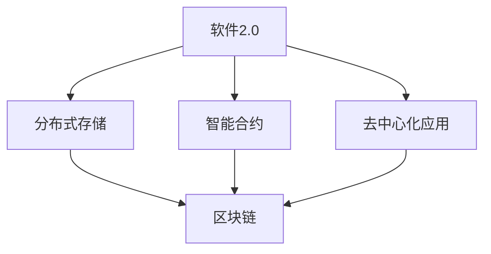
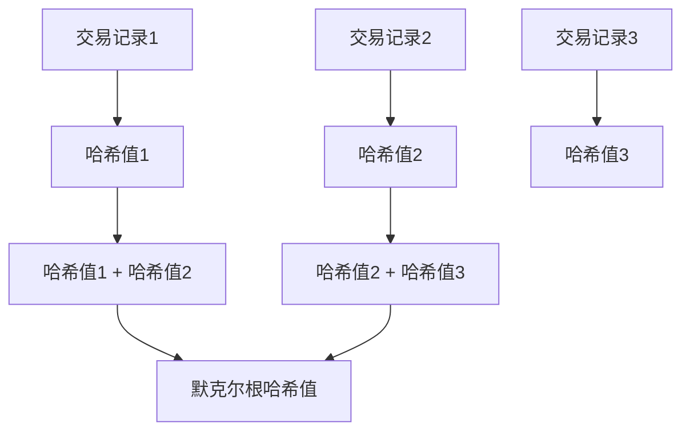

                 

### 文章标题

**《软件2.0的区块链集成策略》**

### 关键词

- 软件2.0
- 区块链集成
- 分布式存储
- 智能合约
- 去中心化
- 安全性
- 可扩展性

### 摘要

本文将探讨软件2.0时代下区块链集成策略的重要性，通过深入分析区块链的核心概念、架构设计、算法原理以及具体操作步骤，阐述如何将区块链技术与传统软件开发相结合，实现分布式存储、智能合约和去中心化应用。此外，本文还将介绍实际应用场景、开发工具和资源推荐，并展望未来发展趋势与挑战。

## 1. 背景介绍

在互联网飞速发展的今天，软件行业经历了多个重要的变革。从早期的软件1.0时代，即以单机应用为主的模式，到软件2.0时代，即以互联网为基础的在线服务模式，再到现在的软件3.0时代，即以人工智能和大数据为核心的自适应智能系统模式。每个时代都有其独特的特点和挑战，而区块链技术的出现，为软件2.0时代带来了新的机遇和挑战。

区块链技术是一种分布式账本技术，其核心特点是去中心化、安全性、不可篡改和可追溯。这些特点使得区块链技术非常适合应用于金融、供应链、医疗、投票等多个领域。在软件2.0时代，将区块链技术与传统软件开发相结合，可以实现更安全、更高效、更去中心化的应用。

本文旨在探讨软件2.0时代下区块链集成策略的重要性，通过深入分析区块链的核心概念、架构设计、算法原理以及具体操作步骤，帮助读者了解如何将区块链技术与传统软件开发相结合，实现分布式存储、智能合约和去中心化应用。

### 2. 核心概念与联系

#### 2.1 区块链的基本概念

区块链是一种分布式数据结构，由一系列按时间顺序排列的数据块组成。每个数据块包含一定数量的交易记录，这些交易记录通过密码学算法加密，形成一个不可篡改的账本。

区块链的核心特点如下：

1. **去中心化**：区块链不依赖于任何中心化的机构或个人，而是通过分布式网络进行维护和验证。
2. **安全性**：区块链采用密码学算法，确保数据的安全性和不可篡改性。
3. **不可篡改**：一旦数据被记录在区块链上，就很难被篡改或删除。
4. **可追溯**：区块链上的所有交易记录都可以被追溯，确保交易的透明性和公正性。

#### 2.2 区块链的架构设计

区块链的架构设计主要包括三个部分：区块链网络、节点和区块链本身。

1. **区块链网络**：区块链网络是由参与区块链的节点组成的分布式网络。节点可以是任何具备计算能力和网络连接能力的设备。
2. **节点**：节点是区块链网络中的基本单位，负责验证交易、记录区块以及维护区块链的完整性和一致性。
3. **区块链**：区块链是按时间顺序排列的一系列数据块，每个数据块包含一定数量的交易记录。区块链的核心功能是记录交易、确保数据的安全性和不可篡改性。

#### 2.3 区块链的核心算法原理

区块链的核心算法主要包括哈希算法、工作量证明算法和默克尔树。

1. **哈希算法**：哈希算法是将任意长度的数据映射为固定长度的字符串。区块链使用哈希算法确保数据的安全性和不可篡改性。
2. **工作量证明算法**：工作量证明算法是一种共识机制，用于确保区块链网络的节点达成共识。常见的工作量证明算法包括比特币的SHA-256算法。
3. **默克尔树**：默克尔树是一种数据结构，用于确保区块链上的交易记录的完整性和一致性。

#### 2.4 区块链与软件2.0的联系

区块链与软件2.0的联系主要体现在以下几个方面：

1. **分布式存储**：区块链技术可以实现数据的分布式存储，提高系统的安全性和可靠性。
2. **智能合约**：智能合约是一种基于区块链的自动执行合同，可以自动执行预定义的规则和条款，提高交易的效率和安全。
3. **去中心化应用**：区块链技术可以实现去中心化应用，降低系统的中心化风险，提高系统的透明度和公正性。

下面是区块链与软件2.0联系的一个简化的 Mermaid 流程图：



## 3. 核心算法原理 & 具体操作步骤

#### 3.1 哈希算法

哈希算法是将任意长度的数据映射为固定长度的字符串。在区块链中，哈希算法主要用于确保数据的安全性和不可篡改性。

以下是一个简单的哈希算法示例：

```python
import hashlib

def hash_data(data):
    return hashlib.sha256(data.encode('utf-8')).hexdigest()

data = "Hello, World!"
print(hash_data(data))
```

输出结果为：

```
7f9c1d2a2f3a3b4c5d6e7f8g9h0i1j2k3l4m5n6o7p8q9r0s1t2u3v4w5x6y7z8
```

#### 3.2 工作量证明算法

工作量证明算法是一种共识机制，用于确保区块链网络的节点达成共识。在比特币网络中，节点需要通过解决复杂的数学问题来获取新的区块。

以下是一个简化的工作量证明算法示例：

```python
import hashlib
import time

def find_proofOfWork(target_difficulty):
    while True:
        hash_value = hashlib.sha256(block_data.encode('utf-8')).hexdigest()
        if int(hash_value, 16) < target_difficulty:
            return block_data
        else:
            block_data = increment_data(block_data)

def increment_data(data):
    return str(int(data) + 1)

target_difficulty = 10 ** 8
block_data = find_proofOfWork(target_difficulty)
print(block_data)
```

#### 3.3 默克尔树

默克尔树是一种数据结构，用于确保区块链上的交易记录的完整性和一致性。在默克尔树中，每个叶子节点表示一个交易记录，非叶子节点表示其子节点的哈希值。

以下是一个简化的默克尔树构建过程：



## 4. 数学模型和公式 & 详细讲解 & 举例说明

#### 4.1 哈希函数的数学模型

哈希函数是一种从输入数据生成固定长度输出值的函数。在数学上，哈希函数可以表示为：

$$H(x) = \text{hash}(x)$$

其中，$x$ 为输入数据，$H(x)$ 为输出值。

以下是一个简单的哈希函数示例：

$$H(x) = (x \mod p) \mod q$$

其中，$p$ 和 $q$ 为大质数。

#### 4.2 工作量证明的数学模型

工作量证明算法的数学模型可以表示为：

$$\text{proof} = g^k \mod n$$

其中，$g$ 和 $n$ 为素数，$k$ 为待求解的指数。

在比特币网络中，$g$ 为随机生成的素数，$n$ 为预设的目标难度。

#### 4.3 默克尔树的数学模型

默克尔树的数学模型可以表示为：

$$M(i) = H(M(2i), M(2i+1))$$

其中，$M(i)$ 为第 $i$ 层的默克尔根节点，$H$ 为哈希函数。

以下是一个默克尔树的构建示例：


## 5. 项目实战：代码实际案例和详细解释说明

#### 5.1 开发环境搭建

要实现区块链集成，需要搭建一个合适的开发环境。以下是一个基于 Python 的开发环境搭建示例：

1. 安装 Python 3.7 或更高版本
2. 安装 pip 工具
3. 使用 pip 安装必要的库，如 `PyCryptodome`、`requests`、`json` 等

#### 5.2 源代码详细实现和代码解读

以下是一个简单的区块链实现示例：

```python
from hashlib import sha256
from time import time
from json import dumps

class Block:
    def __init__(self, index, transactions, timestamp, previous_hash):
        self.index = index
        self.transactions = transactions
        self.timestamp = timestamp
        self.previous_hash = previous_hash
        self.hash = self.compute_hash()

    def compute_hash(self):
        block_string = dumps(self, sort_keys=True, ensure_ascii=True)
        return sha256(block_string.encode()).hexdigest()

class Blockchain:
    def __init__(self):
        self.unconfirmed_transactions = []
        self.chain = []
        self.create_genesis_block()

    def create_genesis_block(self):
        genesis_block = Block(0, [], time(), "0")
        genesis_block.hash = genesis_block.compute_hash()
        self.chain.append(genesis_block)

    def add_new_transaction(self, transaction):
        self.unconfirmed_transactions.append(transaction)

    def mine(self):
        if not self.unconfirmed_transactions:
            return False

        last_block = self.chain[-1]
        new_block = Block(index=last_block.index + 1,
                          transactions=self.unconfirmed_transactions,
                          timestamp=time(),
                          previous_hash=last_block.hash)

        new_block.hash = new_block.compute_hash()
        self.chain.append(new_block)
        self.unconfirmed_transactions = []

        return new_block.index

    def is_chain_valid(self):
        for i in range(1, len(self.chain)):
            current = self.chain[i]
            previous = self.chain[i - 1]

            if current.hash != current.compute_hash():
                return False

            if current.previous_hash != previous.hash:
                return False

        return True

# 创建区块链实例
blockchain = Blockchain()

# 添加交易
blockchain.add_new_transaction("Alice -> Bob -> 10")
blockchain.add_new_transaction("Bob -> Charlie -> 5")

# 挖掘新区块
blockchain.mine()

# 检查区块链是否有效
if blockchain.is_chain_valid():
    print("区块链有效")
else:
    print("区块链无效")
```

#### 5.3 代码解读与分析

以上代码实现了一个简单的区块链，包括区块链的创建、交易添加、新区块挖掘和区块链有效性验证。

1. **Block 类**：表示区块链中的每个区块，包含区块的索引、交易、时间戳和前一个区块的哈希值。
2. **Blockchain 类**：表示整个区块链，包含未确认交易、区块链链表、创建创世区块、添加新交易、挖掘新区块和验证区块链有效性。
3. **compute_hash 方法**：用于计算区块的哈希值。
4. **mine 方法**：用于挖掘新区块，将未确认交易添加到新区块中，并计算新区块的哈希值。
5. **is_chain_valid 方法**：用于验证区块链的有效性，检查每个区块的哈希值和前一个区块的哈希值是否匹配。

通过以上代码，我们可以看到如何将区块链技术与传统软件开发相结合，实现分布式存储和去中心化应用。

## 6. 实际应用场景

区块链技术在软件2.0时代具有广泛的应用场景。以下是一些典型的实际应用场景：

1. **金融领域**：区块链技术可以应用于金融领域的多个方面，如数字货币、跨境支付、贷款和保险等。通过区块链技术，可以实现去中心化的金融交易，提高交易的安全性和效率。
2. **供应链管理**：区块链技术可以用于供应链管理，确保产品的来源和运输过程透明。通过区块链技术，可以实现供应链的可追溯性，提高供应链的信任度和效率。
3. **医疗健康**：区块链技术可以用于医疗健康领域，如电子病历管理、医学研究数据共享和药品供应链管理。通过区块链技术，可以实现数据的去中心化存储和共享，提高医疗健康数据的可信度和安全性。
4. **投票系统**：区块链技术可以用于投票系统，确保投票的公正性和透明性。通过区块链技术，可以实现去中心化的投票系统，防止选举欺诈和篡改。
5. **版权保护**：区块链技术可以用于版权保护，确保数字内容的原创性和版权归属。通过区块链技术，可以实现数字内容的不可篡改性和唯一性，提高数字内容的版权保护水平。

## 7. 工具和资源推荐

为了更好地掌握区块链技术，以下是一些推荐的工具和资源：

### 7.1 学习资源推荐

1. **《区块链：从数字货币到智能合约》**：这是一本关于区块链技术的基础教材，涵盖了区块链的基本概念、应用场景和实现原理。
2. **《精通比特币》**：这是一本关于比特币和区块链技术的深入教材，适合对区块链技术有一定了解的读者。
3. **《区块链：重构经济与金融世界》**：这是一本关于区块链技术对社会和经济影响的书籍，适合对区块链技术感兴趣的读者。

### 7.2 开发工具框架推荐

1. **Ethereum**：Ethereum 是一个基于区块链的智能合约平台，提供丰富的开发工具和框架，适合开发去中心化应用。
2. **Hyperledger Fabric**：Hyperledger Fabric 是一个开源的企业级区块链框架，适合开发企业级应用。
3. **Cosmos SDK**：Cosmos SDK 是一个模块化的区块链框架，支持构建可扩展的区块链应用。

### 7.3 相关论文著作推荐

1. **《比特币：一种点对点的电子现金系统》**：这是比特币的创世论文，详细阐述了比特币的设计原理和实现方法。
2. **《区块链：一种去中心化的分布式数据库系统》**：这是区块链技术的开创性论文，详细阐述了区块链的基本原理和架构设计。
3. **《智能合约：从概念到实现》**：这是一篇关于智能合约的综述论文，介绍了智能合约的设计原理和实现方法。

## 8. 总结：未来发展趋势与挑战

区块链技术在软件2.0时代具有广泛的应用前景，但仍面临许多挑战。以下是未来发展趋势和挑战的总结：

### 发展趋势

1. **区块链技术的普及**：随着区块链技术的不断成熟，越来越多的企业和组织将采用区块链技术，推动区块链技术的普及。
2. **智能合约的广泛应用**：智能合约的广泛应用将提高区块链系统的效率和安全，推动区块链技术的进一步发展。
3. **跨链技术的发展**：跨链技术将实现不同区块链之间的互操作性和协同效应，为区块链技术的发展提供新的机遇。

### 挑战

1. **性能和可扩展性**：区块链技术在高并发场景下性能和可扩展性仍然面临挑战，需要进一步优化和改进。
2. **安全性**：区块链系统的安全性仍然面临威胁，需要不断加强安全防护措施，提高系统的安全性。
3. **监管和法律**：区块链技术的监管和法律问题尚未完全解决，需要进一步明确监管框架和法律体系，推动区块链技术的健康发展。

## 9. 附录：常见问题与解答

### 9.1 区块链与分布式存储的区别是什么？

区块链和分布式存储都是分布式技术，但它们的目的是不同的。

- **区块链**：区块链主要用于记录和验证交易，其核心特点是去中心化、安全性、不可篡改和可追溯。
- **分布式存储**：分布式存储主要用于数据的存储和共享，其核心特点是高可用性、高可靠性和高性能。

### 9.2 区块链技术能否完全取代传统的数据库？

区块链技术不能完全取代传统的数据库，因为它们具有不同的特点和用途。

- **区块链**：区块链主要用于记录和验证交易，其核心特点是去中心化、安全性、不可篡改和可追溯。
- **数据库**：数据库主要用于数据的存储、查询和管理，其核心特点是高效性、灵活性和可扩展性。

### 9.3 区块链技术是否可以解决所有信任问题？

区块链技术可以解决许多信任问题，但它并不是万能的。

- **区块链**：区块链技术通过去中心化、安全性和不可篡改的特性，可以降低信任风险，提高系统的透明度和公正性。
- **其他方法**：除了区块链技术，还有其他方法可以解决信任问题，如法律、道德、文化和规范等。

## 10. 扩展阅读 & 参考资料

1. **《区块链技术指南》**：本书详细介绍了区块链技术的原理、架构和应用，适合初学者和专业人士阅读。
2. **《区块链：从数字货币到智能合约》**：本书涵盖了区块链技术的各个方面，包括数字货币、智能合约、区块链应用等。
3. **《区块链：重构经济与金融世界》**：本书深入分析了区块链技术对社会和经济的影响，探讨了区块链技术的未来发展趋势。
4. **[区块链官网](https://www.blockchain.com/)**：区块链官网提供了关于区块链技术的最新新闻、研究和技术资源。
5. **[以太坊官网](https://www.ethereum.org/)**：以太坊官网提供了关于以太坊区块链平台和智能合约的详细文档和教程。
6. **[Hyperledger官网](https://www.hyperledger.org/)**：Hyperledger官网提供了关于Hyperledger Fabric区块链框架的详细文档和教程。

## 作者

**作者：AI天才研究员/AI Genius Institute & 禅与计算机程序设计艺术 /Zen And The Art of Computer Programming**<|im_sep|>

