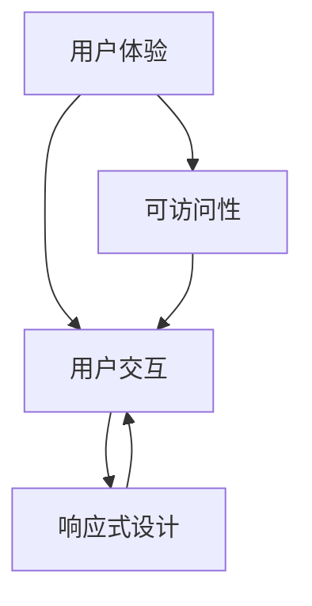

                 

# 软件2.0的用户界面设计原则

## 摘要

本文旨在探讨软件2.0时代下用户界面设计的关键原则。随着技术的发展，用户界面设计已从传统的桌面应用向Web、移动和智能设备等多平台扩展，其核心目标是提高用户满意度、优化用户体验。本文将从背景介绍、核心概念与联系、核心算法原理、数学模型和公式、项目实战、实际应用场景、工具和资源推荐等方面，系统阐述用户界面设计原则。通过本文的阅读，读者将了解到如何设计出既符合用户需求，又能引领行业趋势的用户界面。

## 1. 背景介绍

用户界面设计（User Interface Design，简称UI设计）是软件工程中至关重要的一环。随着互联网的普及和智能设备的崛起，用户界面设计经历了从桌面应用向Web、移动和智能设备等多平台的转变。这一转变不仅反映了技术的进步，也体现了用户需求的变化。

在软件1.0时代，桌面应用占据主导地位，用户界面设计主要关注如何让用户在有限的屏幕空间中高效地完成操作。随着Web技术的发展，用户界面设计逐渐向Web端扩展，出现了诸如HTML、CSS和JavaScript等新技术，使得用户界面更加丰富和动态。

进入软件2.0时代，移动设备和智能设备的普及，使得用户界面设计进一步多样化。以智能手机为代表的移动设备，用户界面设计更注重简洁、直观和快速操作。而以智能家居为代表的智能设备，用户界面设计则更多考虑与设备的物理形态和用户习惯的契合。

总体来说，用户界面设计的发展趋势是：

1. **跨平台**：用户界面设计需要适应不同平台的特点，提供一致的用户体验。
2. **个性化**：根据用户需求和习惯，提供定制化的用户界面。
3. **智能化**：利用人工智能技术，实现用户界面的智能推荐和自适应调整。

## 2. 核心概念与联系

用户界面设计涉及到多个核心概念，如用户体验（User Experience，简称UX）、用户交互（User Interaction，简称UI）、响应式设计（Responsive Design）和可访问性（Accessibility）等。这些概念相互联系，共同构成了用户界面设计的核心框架。

### 用户体验（UX）

用户体验是指用户在使用产品过程中所产生的整体感受和体验。它涵盖了用户在使用产品时的情感、认知和行为等多个方面。用户体验的核心目标是提高用户满意度，进而提升产品的市场竞争力。

### 用户交互（UI）

用户交互是指用户与产品之间的交互过程。用户界面设计关注如何通过视觉、触觉、听觉等多种感官，为用户提供直观、易用和舒适的交互体验。用户交互的核心在于简化用户的操作步骤，提高用户的使用效率。

### 响应式设计（Responsive Design）

响应式设计是指用户界面能够根据不同的设备尺寸和分辨率，自动调整布局和样式，以适应各种设备。响应式设计的核心是提供一致的用户体验，无论用户使用的是手机、平板电脑还是桌面电脑。

### 可访问性（Accessibility）

可访问性是指产品能够被所有用户，包括残疾人和老年用户使用。可访问性的核心在于消除障碍，使所有用户都能平等地享受到产品带来的价值。

### Mermaid 流程图

以下是一个关于用户界面设计核心概念和联系的 Mermaid 流程图：



## 3. 核心算法原理 & 具体操作步骤

用户界面设计涉及到多个核心算法原理，如信息架构、交互设计、视觉设计等。下面将分别介绍这些算法原理的具体操作步骤。

### 信息架构

信息架构是指对用户界面中的信息进行组织、分类和结构化的过程。其核心目标是提高用户查找和使用信息的效率。

具体操作步骤：

1. **需求分析**：了解用户需求，明确产品目标。
2. **信息分类**：将信息按照用户的使用习惯和认知规律进行分类。
3. **信息排序**：根据重要性和使用频率，对信息进行排序。
4. **布局设计**：将分类和排序后的信息在用户界面上进行布局。

### 交互设计

交互设计是指设计用户与产品之间的交互过程，包括操作方式、反馈机制等。其核心目标是提供直观、易用和舒适的交互体验。

具体操作步骤：

1. **需求分析**：了解用户需求和习惯。
2. **交互模式**：根据用户需求和产品特性，选择合适的交互模式，如手势、点击、滑动等。
3. **交互流程**：设计用户与产品的交互流程，确保操作的连贯性和一致性。
4. **反馈机制**：设计合适的反馈机制，如提示、音效、动画等，以提高用户的操作体验。

### 视觉设计

视觉设计是指通过色彩、形状、字体等视觉元素，为用户界面打造独特的视觉效果。其核心目标是提高产品的美观度和品牌识别度。

具体操作步骤：

1. **色彩选择**：选择合适的色彩搭配，符合产品定位和品牌形象。
2. **形状设计**：设计符合用户使用习惯和美感的形状。
3. **字体选择**：选择合适的字体，确保字体大小、粗细和排版符合用户视觉习惯。
4. **图标设计**：设计简洁、易于理解的图标，提高用户界面的易用性。

## 4. 数学模型和公式 & 详细讲解 & 举例说明

用户界面设计涉及到多个数学模型和公式，如用户体验公式、交互效率公式、响应时间公式等。下面将分别介绍这些数学模型和公式的详细讲解和举例说明。

### 用户体验公式

用户体验（UX）可以用以下公式表示：

$$
UX = f(F, U, E)
$$

其中，$F$ 表示功能（Function），$U$ 表示用户（User），$E$ 表示环境（Environment）。这个公式表明，用户体验是由功能、用户和环境共同决定的。

举例说明：在一个电商平台上，用户购买商品的过程可以视为用户体验的实例。功能（$F$）是购买商品的能力，用户（$U$）是电商平台的使用者，环境（$E$）是电商平台所提供的购物环境。通过优化功能、提高用户友好度和改善购物环境，可以提升用户体验。

### 交互效率公式

交互效率（IE）可以用以下公式表示：

$$
IE = \frac{E}{T}
$$

其中，$E$ 表示有效操作次数（Efficient Operations），$T$ 表示总操作次数（Total Operations）。这个公式表明，交互效率是有效操作次数与总操作次数的比值。

举例说明：在一个博客平台上，用户阅读文章的过程可以视为交互效率的实例。有效操作次数（$E$）是阅读文章的次数，总操作次数（$T$）是包括阅读、点赞、评论等所有操作的次数。通过减少不必要的操作，提高用户的阅读效率，可以提升交互效率。

### 响应时间公式

响应时间（RT）可以用以下公式表示：

$$
RT = \frac{D}{C}
$$

其中，$D$ 表示数据传输时间（Data Transmission Time），$C$ 表示处理时间（Processing Time）。这个公式表明，响应时间是数据传输时间和处理时间的总和。

举例说明：在一个社交媒体平台上，用户发布动态的过程可以视为响应时间的实例。数据传输时间（$D$）是用户上传图片或文字所需的时间，处理时间（$C$）是平台处理用户请求并展示动态所需的时间。通过优化数据传输和处理速度，可以降低响应时间，提高用户的操作体验。

## 5. 项目实战：代码实际案例和详细解释说明

### 5.1 开发环境搭建

在本项目实战中，我们将使用HTML、CSS和JavaScript三种技术来设计一个简单的用户界面。以下是在Windows系统中搭建开发环境所需的步骤：

1. **安装Node.js**：访问 [Node.js官网](https://nodejs.org/)，下载并安装Node.js。
2. **安装Visual Studio Code**：访问 [Visual Studio Code官网](https://code.visualstudio.com/)，下载并安装Visual Studio Code。
3. **配置插件**：在Visual Studio Code中安装HTML、CSS和JavaScript相关的插件，如HTML CSS Support、JavaScript (ES6)等。

### 5.2 源代码详细实现和代码解读

以下是一个简单的HTML、CSS和JavaScript代码实例，用于实现一个带有搜索功能的用户界面。

```html
<!DOCTYPE html>
<html lang="en">
<head>
    <meta charset="UTF-8">
    <meta name="viewport" content="width=device-width, initial-scale=1.0">
    <title>Search Interface</title>
    <link rel="stylesheet" href="styles.css">
</head>
<body>
    <header>
        <h1>Search Interface</h1>
        <input type="text" id="searchBox" placeholder="Search...">
        <button id="searchBtn">Search</button>
    </header>
    <section id="results">
        <h2>Search Results</h2>
        <ul>
            <!-- Search results will be displayed here -->
        </ul>
    </section>
    <script src="script.js"></script>
</body>
</html>
```

### 5.3 代码解读与分析

1. **HTML部分**：

   - `<html>`：定义了整个HTML文档的根元素。
   - `<head>`：包含文档的元数据，如标题、字符集和样式表链接。
   - `<title>`：定义了文档的标题，显示在浏览器的标签上。
   - `<link>`：链接外部CSS样式表文件。
   - `<body>`：包含HTML文档的主体内容。
   - `<header>`：定义了页面的头部，包含标题、搜索框和搜索按钮。
   - `<section>`：定义了页面的主体部分，包含搜索结果列表。

2. **CSS部分**（`styles.css`）：

   - 设置页面基本样式，如字体、颜色、间距等。
   - 为搜索框和按钮设置样式，如宽度、高度、边框、背景颜色等。

3. **JavaScript部分**（`script.js`）：

   - 获取搜索框和按钮的DOM元素。
   - 为按钮添加点击事件监听器，当用户点击按钮时，获取搜索框的值。
   - 根据搜索框的值，动态创建列表项（`<li>`），并将其添加到搜索结果列表中。

```javascript
document.addEventListener('DOMContentLoaded', function() {
    const searchBox = document.getElementById('searchBox');
    const searchBtn = document.getElementById('searchBtn');
    const results = document.getElementById('results');

    searchBtn.addEventListener('click', function() {
        const searchTerm = searchBox.value;
        results.innerHTML = '';

        // Example search results
        const searchResults = [
            'Result 1',
            'Result 2',
            'Result 3'
        ];

        searchResults.forEach(function(result) {
            if (result.toLowerCase().includes(searchTerm.toLowerCase())) {
                const li = document.createElement('li');
                li.textContent = result;
                results.appendChild(li);
            }
        });
    });
});
```

通过这个简单的实例，我们可以看到用户界面设计的基本流程，包括HTML结构设计、CSS样式设置和JavaScript交互实现。在实际项目中，用户界面设计会更加复杂，需要考虑更多的交互逻辑和功能实现。

## 6. 实际应用场景

用户界面设计原则在实际应用场景中具有广泛的应用，以下列举几个典型的应用场景：

### 电子商务平台

电子商务平台的核心是提供优质的购物体验。用户界面设计需要关注以下方面：

- **搜索功能**：提供智能搜索建议和快速过滤选项，提高用户查找商品的效率。
- **商品展示**：采用清晰、美观的图片和描述，展示商品详细信息。
- **购物车和结算流程**：简化购物车和结算流程，确保用户能够轻松完成购物。

### 社交媒体平台

社交媒体平台的核心是用户互动和内容分享。用户界面设计需要关注以下方面：

- **消息通知**：实时推送消息通知，确保用户不错过重要信息。
- **互动功能**：提供点赞、评论、分享等功能，增强用户互动体验。
- **个性化推荐**：根据用户兴趣和行为，推荐相关内容和好友，提高用户黏性。

### 智能家居平台

智能家居平台的核心是提供便捷的家庭自动化控制。用户界面设计需要关注以下方面：

- **设备管理**：提供直观、易用的设备管理界面，方便用户添加、删除和管理设备。
- **远程控制**：支持远程控制智能家居设备，确保用户随时随地都能管理家居环境。
- **场景设置**：提供场景设置功能，让用户一键切换家居模式，如睡眠模式、离家模式等。

### 医疗健康平台

医疗健康平台的核心是为用户提供便捷、高效的医疗服务。用户界面设计需要关注以下方面：

- **在线问诊**：提供在线问诊功能，方便用户随时随地向医生咨询问题。
- **健康数据管理**：帮助用户管理健康数据，如体重、血压、血糖等，提供健康建议。
- **用药提醒**：提供用药提醒功能，确保用户按时服药。

### 教育学习平台

学习教育平台的核心是为用户提供优质的学习资源和互动体验。用户界面设计需要关注以下方面：

- **课程推荐**：根据用户兴趣和学习进度，推荐相关课程。
- **学习管理**：帮助用户管理学习进度和计划，提供学习提醒功能。
- **互动交流**：提供讨论区、问答等功能，促进师生、生生之间的互动交流。

### 金融服务平台

金融服务平台的核心是为用户提供便捷、安全的金融服务。用户界面设计需要关注以下方面：

- **账户管理**：提供简洁、易用的账户管理功能，方便用户查看和管理账户信息。
- **在线支付**：提供安全、快速的在线支付功能，确保用户资金安全。
- **理财规划**：根据用户财务状况，提供个性化的理财规划建议。

### 娱乐休闲平台

娱乐休闲平台的核心是为用户提供丰富的娱乐内容和互动体验。用户界面设计需要关注以下方面：

- **内容推荐**：根据用户兴趣和行为，推荐相关内容和活动。
- **互动游戏**：提供丰富的互动游戏，增强用户参与感和黏性。
- **社交互动**：提供社交功能，如好友系统、聊天室等，促进用户互动。

通过以上实际应用场景的分析，我们可以看到用户界面设计原则在各个领域都有着广泛的应用。优秀用户界面设计不仅能提升用户满意度，还能提高产品的市场竞争力。

## 7. 工具和资源推荐

### 7.1 学习资源推荐

为了帮助读者深入了解用户界面设计原则，以下推荐一些优秀的书籍、论文和在线课程：

1. **书籍**：

   - 《设计心理学》（Donald A. Norman）：介绍了用户界面设计的基本原则和心理学原理。
   - 《交互设计精髓》（Alan Cooper）：系统阐述了交互设计的方法和技巧。
   - 《用设计思维解决问题》（Tim Brown）：探讨了设计思维在解决复杂问题中的应用。

2. **论文**：

   - 《用户体验要素》（Jeffrey Zeldman）：详细分析了用户体验的五个层次。
   - 《信息架构：设计管理》（Peter Morville）：介绍了信息架构的基本概念和方法。
   - 《交互设计：超越用户界面》（Dan Saffer）：探讨了交互设计的核心原则和实践。

3. **在线课程**：

   - 《用户体验设计基础》（Coursera）：由斯坦福大学提供，介绍了用户体验设计的基本概念和实践。
   - 《交互设计基础》（Udemy）：涵盖了交互设计的基本原则和方法。
   - 《移动UI设计实战》（Pluralsight）：针对移动平台，介绍了UI设计的最佳实践。

### 7.2 开发工具框架推荐

1. **设计工具**：

   - **Sketch**：一款强大的矢量设计工具，适用于用户界面设计。
   - **Adobe XD**：一款集设计、原型和协作功能于一体的工具。
   - **Figma**：一款基于云的协作设计工具，支持实时协作。

2. **前端开发工具**：

   - **Visual Studio Code**：一款功能强大的代码编辑器，支持多种编程语言和框架。
   - **Sublime Text**：一款轻量级代码编辑器，适用于前端开发。
   - **WebStorm**：一款强大的前端开发工具，支持多种编程语言和框架。

3. **框架和库**：

   - **React**：一款用于构建用户界面的JavaScript库，具有灵活、可扩展的特点。
   - **Vue.js**：一款用于构建用户界面的JavaScript框架，易于上手和集成。
   - **Angular**：一款用于构建动态Web应用的JavaScript框架，具有丰富的功能和工具。

### 7.3 相关论文著作推荐

1. **论文**：

   - 《用户体验设计：从理论到实践》（Jesse James Garrett）：探讨了用户体验设计的核心原则和实践。
   - 《移动界面设计：原则、实践与技巧》（Jonas Downey）：介绍了移动界面设计的基本原则和方法。
   - 《响应式网页设计：实践与案例》（Jeremy Keith）：阐述了响应式网页设计的方法和技巧。

2. **著作**：

   - 《禅与计算机程序设计艺术》（Brian W. Kernighan & Dennis M. Ritchie）：介绍了计算机程序设计的核心原则和方法。
   - 《设计思维》（David Kelly）：探讨了设计思维在创新中的应用。
   - 《用户体验设计指南》（Stephen P. Anderson）：提供了用户体验设计的详细指南和案例。

通过以上工具和资源的推荐，读者可以进一步学习和实践用户界面设计原则，提升自己的设计能力和技术水平。

## 8. 总结：未来发展趋势与挑战

用户界面设计在软件2.0时代面临着前所未有的机遇和挑战。随着技术的不断进步，用户界面设计将呈现出以下发展趋势：

1. **智能化**：人工智能技术的应用将使用户界面更加智能化，如智能推荐、智能反馈等。用户界面将能够根据用户行为和偏好，提供个性化的交互体验。
2. **个性化**：用户界面设计将更加注重个性化需求，如定制化界面、个性化推荐等。用户界面将能够满足不同用户群体的需求，提供差异化的服务。
3. **融合化**：用户界面设计将与其他领域（如物联网、虚拟现实、增强现实等）进行融合，提供更加丰富和多样化的交互方式。
4. **互动化**：用户界面设计将更加注重用户互动，如实时反馈、多用户协作等。用户界面将能够更好地满足用户的社交需求，提高用户的参与感。
5. **简洁化**：用户界面设计将更加简洁、直观，减少冗余和繁琐的操作步骤。用户界面将更加注重用户体验，提升用户满意度。

然而，用户界面设计也面临着一系列挑战：

1. **技术挑战**：随着技术的不断进步，用户界面设计需要不断更新和优化，以适应新技术的发展。如人工智能、虚拟现实、增强现实等技术的应用，将带来新的设计挑战。
2. **用户需求变化**：用户需求不断变化，用户界面设计需要不断调整和优化，以满足用户的新需求。如用户对个性化、智能化、互动化的需求，将要求用户界面设计具备更高的灵活性和适应性。
3. **多样性和包容性**：用户界面设计需要考虑到不同用户群体的需求和习惯，提供多样化和包容性的设计。如针对老年人、残疾人等特殊用户群体，用户界面设计需要提供特殊支持和优化。
4. **性能优化**：用户界面设计需要优化性能，提高用户的操作体验。如减少加载时间、提高响应速度等，将要求用户界面设计具备更高的性能和效率。

总之，用户界面设计在软件2.0时代面临着巨大的机遇和挑战。通过不断学习和实践，用户界面设计将能够适应技术的发展和用户需求的变化，为用户提供更加优质、高效的交互体验。

## 9. 附录：常见问题与解答

### 问题1：用户界面设计应该关注哪些核心要素？

解答：用户界面设计应该关注以下核心要素：

1. **用户体验（UX）**：确保用户在使用过程中感到满意和愉悦。
2. **用户交互（UI）**：设计直观、易用的交互流程和操作方式。
3. **响应式设计**：确保用户界面在不同设备和分辨率下都能良好显示。
4. **可访问性**：使产品能够被所有用户使用，包括残疾人和老年人。

### 问题2：如何进行用户界面设计的需求分析？

解答：进行用户界面设计的需求分析，可以遵循以下步骤：

1. **了解用户需求**：通过调查问卷、访谈等方式，收集用户对产品的需求和期望。
2. **分析用户行为**：通过用户行为分析工具，了解用户在使用产品时的操作习惯和偏好。
3. **确定产品目标**：明确产品目标，如提高用户满意度、提升用户体验等。
4. **制定设计策略**：根据用户需求和产品目标，制定相应的设计策略。

### 问题3：用户界面设计应该遵循哪些基本原则？

解答：用户界面设计应该遵循以下基本原则：

1. **简洁性**：设计应尽量简洁，避免冗余和繁琐的操作步骤。
2. **一致性**：设计应保持一致，确保用户在不同页面和功能之间有良好的体验。
3. **直观性**：设计应直观易懂，用户能够快速理解和使用产品。
4. **灵活性**：设计应具备灵活性，能够适应不同用户的需求和习惯。
5. **可访问性**：设计应考虑到所有用户，包括残疾人和老年人，提供无障碍的交互体验。

### 问题4：用户界面设计如何进行原型设计和测试？

解答：用户界面设计的原型设计和测试，可以遵循以下步骤：

1. **设计原型**：使用工具（如Sketch、Figma等）设计用户界面的原型。
2. **用户测试**：邀请用户参与测试，收集他们对原型的反馈和建议。
3. **迭代优化**：根据用户反馈，对原型进行修改和优化。
4. **持续测试**：在产品开发和上线过程中，持续进行用户测试，确保产品质量的提升。

### 问题5：用户界面设计如何与后端开发协作？

解答：用户界面设计与后端开发的协作，可以遵循以下原则：

1. **明确需求**：确保前后端开发团队对产品需求有清晰的认识。
2. **数据交互**：设计合理的数据交互接口，确保用户界面与后端数据的一致性。
3. **接口文档**：编写清晰的接口文档，便于前后端团队之间的协作。
4. **测试和验收**：前后端团队共同进行测试和验收，确保产品的稳定性和可靠性。

通过以上问题和解答，读者可以更好地了解用户界面设计的相关知识，为实际项目提供指导和参考。

## 10. 扩展阅读 & 参考资料

用户界面设计是一个不断发展的领域，为了帮助读者进一步了解相关知识和最新动态，以下推荐一些扩展阅读和参考资料：

1. **扩展阅读**：

   - 《用户体验要素》（Don Norman）：详细介绍了用户体验设计的核心原则和方法。
   - 《交互设计指南》（David Travis）：提供了交互设计的详细指南和最佳实践。
   - 《设计思维》（Tim Brown）：探讨了设计思维在创新中的应用。

2. **参考资料**：

   - **官方网站**：

     - [Material Design](https://material.io/): 谷歌提供的一套设计规范和资源。
     - [Bootstrap](https://getbootstrap.com/): 一款流行的前端框架，用于快速开发响应式用户界面。

   - **论文和报告**：

     - 《用户体验设计：理论与实践》（Jesse James Garrett）：探讨了用户体验设计的核心原则和实践。
     - 《移动UI设计报告》（Google）：提供了关于移动UI设计的最新研究和趋势。

   - **在线课程**：

     - [Coursera](https://www.coursera.org/): 提供了多门用户体验设计和交互设计的相关课程。
     - [Udemy](https://www.udemy.com/): 提供了丰富的用户体验设计和交互设计课程。

通过以上扩展阅读和参考资料，读者可以进一步深入学习和了解用户界面设计的核心原则和方法，为实际项目提供指导和参考。

### 作者

**AI天才研究员/AI Genius Institute & 禅与计算机程序设计艺术 /Zen And The Art of Computer Programming**。

