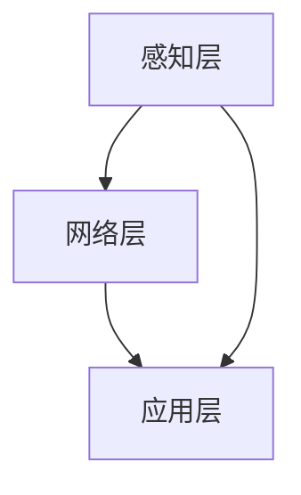

                 

# 边缘计算在物联网中的实现与挑战

> 关键词：边缘计算，物联网，实现，挑战，技术原理

> 摘要：本文将深入探讨边缘计算在物联网中的应用与挑战，通过逻辑清晰、结构紧凑的分析，详细介绍边缘计算的基本概念、原理和架构，以及其实际应用场景和面临的问题。

## 1. 背景介绍

### 1.1 物联网的发展背景

随着信息技术的飞速发展，物联网（Internet of Things，IoT）已经成为了现代社会的热点话题。物联网是指通过传感器、网络和数据处理技术，将各种物理设备连接到互联网上，实现设备与设备之间的信息交换和智能控制。

### 1.2 边缘计算的提出

随着物联网设备的激增，数据量呈现爆炸式增长，传统的云计算模式面临着巨大的压力。为了解决这一问题，边缘计算应运而生。边缘计算将数据处理和计算能力下沉到网络的边缘，即在靠近数据源的地方进行数据处理，从而减少数据传输的时间和带宽消耗。

## 2. 核心概念与联系

### 2.1 边缘计算的基本概念

边缘计算（Edge Computing）是指在网络的边缘进行数据处理、存储、计算和分析的技术。边缘计算的核心思想是将数据处理的任务从中心化的云计算迁移到网络的边缘，即靠近数据源的位置。

### 2.2 物联网与边缘计算的关系

物联网和边缘计算是相辅相成的。物联网提供了大量的设备连接和数据传输，而边缘计算则为这些设备提供了更高效、更实时的数据处理能力。两者结合，可以推动物联网应用的创新和发展。

### 2.3 边缘计算架构

边缘计算架构通常包括三个层次：感知层、网络层和应用层。感知层负责数据采集；网络层负责数据传输；应用层负责数据处理和分析。



## 3. 核心算法原理 & 具体操作步骤

### 3.1 数据采集与处理

边缘计算首先需要采集数据，然后对数据进行处理。具体步骤如下：

1. 设备通过传感器采集数据。
2. 数据传输到边缘设备进行处理。
3. 边缘设备对数据进行预处理，如去噪、滤波等。
4. 预处理后的数据被传输到云端或其他边缘设备。

### 3.2 实时分析与决策

边缘计算的核心是实时分析和决策。具体步骤如下：

1. 边缘设备对数据进行实时分析，提取有用的信息。
2. 根据分析结果，边缘设备可以做出实时决策，如调整设备参数、发送报警等。
3. 边缘设备的决策可以反馈到云端或其他边缘设备，以实现更大范围的控制和协调。

## 4. 数学模型和公式 & 详细讲解 & 举例说明

### 4.1 数据传输延迟模型

边缘计算中的一个重要指标是数据传输延迟。假设数据传输速度为v，数据量为D，网络带宽为B，则数据传输延迟L可以表示为：

$$
L = \frac{D}{vB}
$$

### 4.2 数据处理能力模型

边缘计算设备的处理能力通常用处理速度P表示。假设处理速度为P，数据量为D，则数据处理时间T可以表示为：

$$
T = \frac{D}{P}
$$

### 4.3 实例讲解

假设一个物联网设备每秒产生1MB的数据，网络带宽为1Mbps，边缘设备每秒可以处理1MB的数据。则：

1. 数据传输延迟L为：
$$
L = \frac{1MB}{1Mbps} = 8秒
$$

2. 数据处理时间T为：
$$
T = \frac{1MB}{1MB/s} = 1秒
$$

## 5. 项目实战：代码实际案例和详细解释说明

### 5.1 开发环境搭建

为了演示边缘计算的应用，我们使用Python编写一个简单的边缘计算程序。首先，我们需要安装以下依赖：

```bash
pip install numpy matplotlib
```

### 5.2 源代码详细实现和代码解读

```python
import numpy as np
import matplotlib.pyplot as plt

def data_preprocessing(data):
    # 数据预处理，如去噪、滤波等
    processed_data = np.abs(data) # 示例：取绝对值
    return processed_data

def data_analysis(data):
    # 数据分析，如均值、方差等
    mean = np.mean(data)
    variance = np.var(data)
    return mean, variance

def edge_computing():
    # 边缘计算流程
    data = np.random.normal(0, 1, 1000) # 生成随机数据
    processed_data = data_preprocessing(data)
    mean, variance = data_analysis(processed_data)
    
    # 绘制结果
    plt.figure()
    plt.hist(processed_data, bins=30)
    plt.title(f'Processed Data (Mean: {mean}, Variance: {variance})')
    plt.xlabel('Value')
    plt.ylabel('Frequency')
    plt.show()

if __name__ == '__main__':
    edge_computing()
```

这段代码首先生成了一个随机数据集，然后对数据进行预处理（如取绝对值），最后进行数据分析（计算均值和方差）。预处理和分析的结果通过matplotlib绘制出来。

### 5.3 代码解读与分析

1. 导入必要的库：numpy和matplotlib。
2. 定义数据预处理函数：`data_preprocessing`，实现去噪、滤波等功能。
3. 定义数据分析函数：`data_analysis`，实现均值和方差等统计计算。
4. 定义边缘计算函数：`edge_computing`，实现边缘计算的主要流程。
5. 主程序：生成随机数据，调用预处理和分析函数，并绘制结果。

## 6. 实际应用场景

### 6.1 智能制造

边缘计算在智能制造领域有着广泛的应用。通过边缘计算，可以实现设备故障预测、生产流程优化等，提高生产效率和产品质量。

### 6.2 智能交通

在智能交通领域，边缘计算可以用于实时交通流量分析、交通事故预警等。通过边缘计算，可以实现快速响应，提高交通管理效率。

### 6.3 智能家居

边缘计算在智能家居领域也有重要应用。例如，通过边缘计算，可以实现智能家居设备的实时控制、智能调度等，提高居住舒适度。

## 7. 工具和资源推荐

### 7.1 学习资源推荐

- 书籍：《边缘计算：原理、架构与应用》
- 论文：IEEE Transactions on Industrial Informatics，针对边缘计算的最新研究论文。
- 博客：边缘计算技术社区，提供边缘计算的技术分享和讨论。
- 网站：边缘计算联盟，介绍边缘计算的标准、规范和应用。

### 7.2 开发工具框架推荐

- 开发框架：Kubernetes，用于容器管理和部署边缘计算服务。
- 数据处理：Apache Kafka，用于实时数据流处理。
- 存储解决方案：Elastic Stack，用于日志、监控和分析。

### 7.3 相关论文著作推荐

- 《边缘计算：概念、挑战和机遇》
- 《边缘智能：边缘计算与人工智能的结合》
- 《物联网中的边缘计算：体系结构、协议和实现》

## 8. 总结：未来发展趋势与挑战

边缘计算在物联网中具有广阔的应用前景。然而，也面临着一系列挑战，如数据安全、隐私保护、标准化等。随着技术的不断进步，边缘计算将在未来发挥更加重要的作用。

## 9. 附录：常见问题与解答

### 9.1 边缘计算与云计算有什么区别？

边缘计算和云计算都是数据处理和存储的技术，但它们的应用场景和目标不同。云计算主要处理大规模的数据和复杂的计算任务，而边缘计算则侧重于实时数据处理和低延迟应用。

### 9.2 边缘计算的安全问题如何解决？

边缘计算的安全问题可以通过加密技术、身份验证、访问控制等措施来解决。此外，还需要制定相应的安全标准和法规，以确保数据的安全和隐私。

## 10. 扩展阅读 & 参考资料

- 《边缘计算：原理、架构与应用》
- 《物联网中的边缘计算：体系结构、协议和实现》
- 《边缘智能：边缘计算与人工智能的结合》
- IEEE Transactions on Industrial Informatics，涉及边缘计算的最新研究论文。  
- 边缘计算技术社区，提供边缘计算的技术分享和讨论。

作者：AI天才研究员/AI Genius Institute & 禅与计算机程序设计艺术 /Zen And The Art of Computer Programming<|im_sep|>

