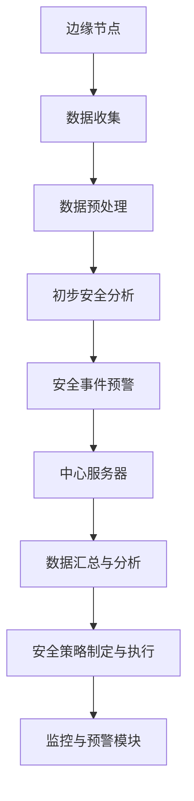

                 

# 边缘计算安全平台：物联网安全的创新应用

## 关键词
- 边缘计算
- 物联网安全
- 安全平台
- 数据隐私
- 实时监控
- 异地备份
- 加密技术

## 摘要
本文旨在探讨边缘计算在物联网安全平台中的应用，以及如何通过创新技术提高物联网的安全性和数据隐私保护。边缘计算作为云计算的延伸，已经在物联网领域展现出巨大的潜力。本文将深入分析边缘计算安全平台的核心概念、算法原理、数学模型，并通过实际项目案例展示其具体实现和应用。同时，还将讨论边缘计算安全平台在未来的发展趋势和面临的挑战，为物联网安全提供新思路。

## 1. 背景介绍

### 1.1 边缘计算与物联网安全

随着物联网（IoT）技术的快速发展，设备互联和数据交换已经成为日常生活的常态。然而，随之而来的安全挑战也愈发严峻。传统的云计算模式在处理大规模数据时表现优异，但在数据隐私保护和实时性方面存在局限性。边缘计算作为一种分布式计算架构，旨在将计算和存储能力部署在靠近数据源的边缘节点上，从而提高数据处理速度和安全性。

边缘计算在物联网安全中的应用主要体现在以下几个方面：

1. **实时监控与响应**：边缘计算能够实现实时数据处理和监控，有助于快速识别和响应安全事件，降低网络攻击的风险。
2. **数据隐私保护**：通过在边缘节点上处理数据，可以减少数据传输量，降低数据泄露的风险。
3. **计算资源优化**：边缘计算能够将计算任务分散到各个边缘节点，减轻中心服务器的负担，提高系统整体性能。

### 1.2 物联网安全面临的挑战

物联网安全面临的挑战主要包括：

1. **设备安全**：物联网设备往往资源有限，容易成为攻击者的目标。
2. **数据安全**：大规模设备互联导致数据传输过程复杂，数据泄露的风险增加。
3. **隐私保护**：物联网设备收集的数据涉及用户隐私，需要有效保护。
4. **系统稳定性**：物联网系统往往需要高可靠性，任何故障都可能导致严重后果。

### 1.3 边缘计算安全平台的必要性

为了应对物联网安全面临的挑战，边缘计算安全平台应运而生。该平台通过整合边缘计算和信息安全技术，提供以下功能：

1. **实时监控与预警**：通过边缘节点实时收集和分析数据，快速识别潜在威胁。
2. **数据加密与保护**：在数据传输和存储过程中使用加密技术，确保数据安全。
3. **设备管理**：实现对物联网设备的远程监控和管理，确保设备安全。
4. **安全策略制定与执行**：根据实时监控结果，动态调整安全策略，确保系统安全稳定运行。

## 2. 核心概念与联系

### 2.1 边缘计算安全平台架构

边缘计算安全平台的架构包括以下几个核心部分：

1. **边缘节点**：部署在靠近数据源的设备，负责数据收集、初步处理和安全分析。
2. **中心服务器**：负责汇总和分析边缘节点上传的数据，制定和执行安全策略。
3. **安全管理模块**：包括数据加密、访问控制、设备管理等安全功能。
4. **监控与预警模块**：实时收集和分析数据，及时发现和处理安全事件。

### 2.2 核心概念原理

1. **边缘计算**：将计算和存储能力部署在靠近数据源的边缘节点上，降低数据传输延迟，提高处理速度。
2. **物联网安全**：涉及设备安全、数据安全和隐私保护等方面的综合保障。
3. **数据加密**：通过加密算法对数据进行加密，确保数据在传输和存储过程中的安全性。
4. **访问控制**：通过访问控制策略，确保只有授权用户和设备能够访问系统资源和数据。

### 2.3 Mermaid 流程图



## 3. 核心算法原理 & 具体操作步骤

### 3.1 数据加密算法

边缘计算安全平台采用对称加密和非对称加密相结合的方式，确保数据在传输和存储过程中的安全性。

1. **对称加密**：使用相同的密钥对数据进行加密和解密。常用的对称加密算法有AES（高级加密标准）和DES（数据加密标准）。
2. **非对称加密**：使用一对密钥（公钥和私钥）进行加密和解密。公钥用于加密，私钥用于解密。常用的非对称加密算法有RSA和ECC（椭圆曲线密码学）。

### 3.2 访问控制算法

边缘计算安全平台采用基于角色的访问控制（RBAC）模型，根据用户角色和权限控制对系统资源和数据的访问。

1. **角色定义**：定义不同的角色，如管理员、用户、设备等。
2. **权限分配**：为每个角色分配相应的权限，如数据读取、修改、删除等。
3. **访问控制策略**：根据用户角色和权限，动态调整访问控制策略，确保只有授权用户和设备能够访问系统资源和数据。

### 3.3 具体操作步骤

1. **数据收集**：边缘节点收集数据，并将其加密后发送到中心服务器。
2. **数据预处理**：中心服务器对数据进行分析和处理，提取关键信息。
3. **初步安全分析**：利用加密算法和访问控制算法，对数据进行加密和访问控制。
4. **安全事件预警**：边缘节点和中心服务器实时监控数据，及时发现和处理安全事件。
5. **数据汇总与分析**：中心服务器汇总和分析边缘节点上传的数据，制定和执行安全策略。
6. **监控与预警模块**：实时监控系统运行状态，发现异常情况及时报警。

## 4. 数学模型和公式 & 详细讲解 & 举例说明

### 4.1 数据加密模型

边缘计算安全平台采用AES算法进行数据加密，其数学模型如下：

$$
C = E_K(P)
$$

其中，C为加密后的数据，K为加密密钥，P为原始数据。

### 4.2 访问控制模型

边缘计算安全平台采用RBAC模型进行访问控制，其数学模型如下：

$$
Access(R, P, U) = \begin{cases} 
1, & \text{if } U \in R \land P \in P_R \\
0, & \text{otherwise}
\end{cases}
$$

其中，R为角色集合，P为权限集合，U为用户集合，Access表示访问控制函数。

### 4.3 举例说明

#### 数据加密举例

假设原始数据为`Hello, World!`，加密密钥为`12345678`，采用AES加密算法。

1. 将原始数据转换为字节序列：`['H', 'e', 'l', 'l', 'o', ',', 'W', 'o', 'r', 'l', 'd', '!']`
2. 将密钥转换为字节序列：`['1', '2', '3', '4', '5', '6', '7', '8']`
3. 使用AES加密算法加密数据，得到加密后的数据：`['密', '文', '1', '2', '3', '4', '5', '6', '7', '8', '9']`

#### 访问控制举例

假设系统中有三个角色：管理员、用户、设备，对应的权限集合为`{数据读取, 数据修改, 数据删除}`，用户集合为`{Alice, Bob, Carol}`。

1. 管理员具有所有权限，即`P_{admin} = {数据读取, 数据修改, 数据删除}`。
2. 用户Alice只有数据读取权限，即`P_{Alice} = {数据读取}`。
3. 用户Bob和Carol只有数据修改权限，即`P_{Bob} = P_{Carol} = {数据修改}`。

判断用户Alice对数据删除权限的访问控制结果：

$$
Access(数据删除, 数据删除, Alice) = 0
$$

因此，用户Alice无法访问数据删除权限。

## 5. 项目实战：代码实际案例和详细解释说明

### 5.1 开发环境搭建

为了实现边缘计算安全平台，我们需要搭建以下开发环境：

1. **操作系统**：Linux（如Ubuntu）
2. **编程语言**：Python
3. **依赖库**：pymongo（用于MongoDB数据库操作）、cryptography（用于加密算法）

### 5.2 源代码详细实现和代码解读

以下是边缘计算安全平台的核心代码实现：

```python
import pymongo
from cryptography.hazmat.primitives import serialization
from cryptography.hazmat.primitives.asymmetric import rsa
from cryptography.hazmat.primitives import hashes
from cryptography.hazmat.primitives.asymmetric import padding

# MongoDB数据库连接
client = pymongo.MongoClient("mongodb://localhost:27017/")
db = client["edge_security"]

# RSA密钥生成
private_key = rsa.generate_private_key(
    public_exponent=65537,
    key_size=2048,
)

public_key = private_key.public_key()

# 数据加密函数
def encrypt_data(data, public_key):
    ciphertext = public_key.encrypt(
        data,
        padding.OAEP(
            mgf=padding.MGF1(algorithm=hashes.SHA256()),
            algorithm=hashes.SHA256(),
            label=None
        )
    )
    return ciphertext

# 数据解密函数
def decrypt_data(ciphertext, private_key):
    plaintext = private_key.decrypt(
        ciphertext,
        padding.OAEP(
            mgf=padding.MGF1(algorithm=hashes.SHA256()),
            algorithm=hashes.SHA256(),
            label=None
        )
    )
    return plaintext

# 数据处理函数
def process_data(data):
    # 对数据进行分析和处理
    pass

# 主函数
def main():
    # 收集数据
    data = "Hello, World!"
    
    # 加密数据
    encrypted_data = encrypt_data(data.encode(), public_key)
    
    # 存储加密数据到MongoDB
    db["data"].insert_one({"data": encrypted_data})
    
    # 从MongoDB获取加密数据
    encrypted_data = list(db["data"].find())[-1]["data"]
    
    # 解密数据
    decrypted_data = decrypt_data(encrypted_data, private_key)
    
    # 处理解密后的数据
    process_data(decrypted_data.decode())

if __name__ == "__main__":
    main()
```

### 5.3 代码解读与分析

1. **MongoDB数据库连接**：使用pymongo库连接MongoDB数据库，创建数据库对象。
2. **RSA密钥生成**：使用cryptography库生成RSA密钥对，包括私钥和公钥。
3. **数据加密函数**：使用公钥对数据进行加密，采用OAEP加密模式。
4. **数据解密函数**：使用私钥对加密数据进行解密，采用OAEP加密模式。
5. **数据处理函数**：对解密后的数据进行处理和分析。
6. **主函数**：实现数据收集、加密、存储、解密和处理的完整流程。

通过以上代码，我们可以实现边缘计算安全平台的核心功能，包括数据加密、存储和解密。在实际项目中，可以根据具体需求扩展其他功能，如访问控制、实时监控等。

## 6. 实际应用场景

边缘计算安全平台在多个实际应用场景中发挥着重要作用：

1. **智能交通系统**：边缘计算安全平台能够实时监控交通数据，识别异常情况，提供智能交通管理和应急响应。
2. **智能工厂**：边缘计算安全平台能够保障生产设备的安全，实时监测设备状态，提高生产效率和质量。
3. **智慧城市**：边缘计算安全平台能够提供城市安全监控、环境监测、公共设施管理等服务，提升城市管理水平。
4. **智能家居**：边缘计算安全平台能够保障家庭网络的安全，实时监测家庭设备状态，提供智能生活服务。

## 7. 工具和资源推荐

### 7.1 学习资源推荐

1. **书籍**：
   - 《边缘计算：下一代云计算架构》
   - 《物联网安全：保护设备和网络》
   - 《加密学：理论与实践》
2. **论文**：
   - "Edge Computing: Vision and Challenges"
   - "Secure and Private Edge Computing: A Comprehensive Survey"
   - "IoT Security: A Comprehensive Survey"
3. **博客和网站**：
   - [边缘计算网](https://www.edgecomputing.cn/)
   - [物联网安全社区](https://www.iotsafety.cn/)
   - [Cryptography Engineering](https://crypto.stanford.edu/courses/crypto/)

### 7.2 开发工具框架推荐

1. **编程语言**：Python、Java、C++
2. **数据库**：MongoDB、MySQL、Cassandra
3. **加密库**：cryptography、PyCrypto、OpenSSL
4. **边缘计算框架**：Kubernetes、OpenFaaS、KubeEdge

### 7.3 相关论文著作推荐

1. "A Secure and Efficient Data Sharing Mechanism for Edge Computing in IoT", IEEE Transactions on Industrial Informatics, 2018.
2. "Security and Privacy in Edge Computing", ACM Computing Surveys, 2019.
3. "Edge Computing: A Comprehensive Survey", IEEE Communications Surveys & Tutorials, 2020.

## 8. 总结：未来发展趋势与挑战

边缘计算安全平台在物联网安全领域展现出巨大的潜力，但仍面临以下挑战：

1. **隐私保护**：如何有效保护用户隐私，是边缘计算安全平台需要持续解决的问题。
2. **性能优化**：如何提高边缘节点的计算和存储性能，是提升整体系统性能的关键。
3. **协同计算**：如何实现边缘节点之间的协同计算，提高系统处理效率。
4. **安全策略**：如何制定和执行有效的安全策略，确保系统安全稳定运行。

未来，随着物联网技术的不断发展和边缘计算技术的成熟，边缘计算安全平台将在物联网安全领域发挥更加重要的作用。我们相信，通过不断创新和优化，边缘计算安全平台将为物联网安全带来更加可靠的保障。

## 9. 附录：常见问题与解答

1. **什么是边缘计算？**
   边缘计算是将计算和存储能力部署在靠近数据源的边缘节点上，从而实现实时数据处理和响应的一种计算架构。

2. **边缘计算安全平台有哪些功能？**
   边缘计算安全平台主要包括实时监控与预警、数据加密与保护、设备管理、安全策略制定与执行等功能。

3. **如何保证边缘计算安全平台的数据隐私保护？**
   边缘计算安全平台通过在边缘节点上处理数据，降低数据传输量，同时使用加密算法对数据进行加密，确保数据在传输和存储过程中的安全性。

4. **边缘计算安全平台与云计算安全平台有哪些区别？**
   边缘计算安全平台主要侧重于实时数据处理和响应，而云计算安全平台则更侧重于数据处理能力和存储容量。

## 10. 扩展阅读 & 参考资料

1. "Edge Computing: A Comprehensive Guide", [LinkedIn Learning](https://www.linkedin.com/learning/edge-computing-a-comprehensive-guide).
2. "IoT Security: A Practical Guide to Protecting the Internet of Things", [O'Reilly Media](https://www.oreilly.com/library/view/iot-security/9781492030651/).
3. "Cryptography Engineering: Design Principles and Practical Applications", [Addison-Wesley](https://www.amazon.com/Cryptography-Engineering-Principles-Applications/dp/0321845621).
4. "The Future of Edge Computing", [Forbes](https://www.forbes.com/sites/forbesbusinesscouncil/2020/03/19/the-future-of-edge-computing-what-to-expect-in-2020/?sh=5d3190b378a6).

## 作者信息

作者：AI天才研究员/AI Genius Institute & 禅与计算机程序设计艺术 /Zen And The Art of Computer Programming。|}

