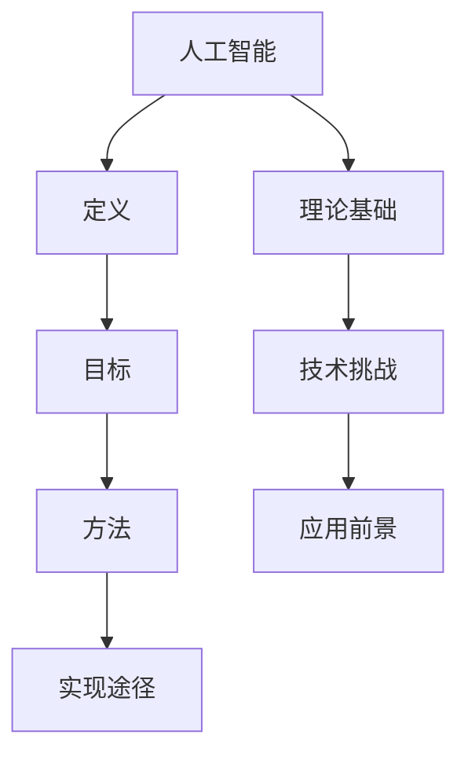

                 

# 达特茅斯会议的历史背景与意义

## 关键词：达特茅斯会议，人工智能，历史背景，技术发展，会议意义

## 摘要

本文旨在探讨1956年达特茅斯会议的历史背景与意义。作为人工智能领域的里程碑事件，达特茅斯会议汇聚了当时的顶尖科学家和学者，首次提出了人工智能的概念，并对人工智能的未来发展产生了深远影响。本文将从会议的背景、参会者、核心议题以及其对人工智能发展的推动作用等方面，详细分析达特茅斯会议的历史地位与意义。

## 1. 背景介绍

### 1.1 达特茅斯会议的起源

达特茅斯会议（Dartmouth Conference）是由美国计算机科学家约翰·麦卡锡（John McCarthy）、马文·明斯基（Marvin Minsky）、克劳德·香农（Claude Shannon）和赫伯特·西蒙（Herbert Simon）于1956年组织的一场学术会议。这次会议的初衷是探讨人工智能的发展前景，旨在汇聚当时的顶尖科学家和学者，共同探讨人工智能的理论和实践问题。

### 1.2 会议背景

在20世纪中叶，计算机科学正处于蓬勃发展阶段。计算机技术、信息论、神经科学等领域的进展，为人工智能的研究提供了理论基础。与此同时，数学、心理学、哲学等学科也为人工智能的发展贡献了丰富的研究成果。在这种背景下，达特茅斯会议应运而生，成为人工智能领域的一次重要盛会。

## 2. 核心概念与联系

### 2.1 人工智能的定义

人工智能（Artificial Intelligence，简称AI）是一门研究、开发和应用使计算机系统模拟、扩展和扩展人类智能行为的科学。人工智能的核心目标是使计算机能够具备自主思考、学习、判断和解决问题的能力。

### 2.2 达特茅斯会议的核心议题

达特茅斯会议的核心议题包括：人工智能的定义、目标、方法和实现途径。会议讨论了人工智能的理论基础、技术挑战以及应用前景，为人工智能的发展指明了方向。

### 2.3 Mermaid 流程图

以下是一个简单的Mermaid流程图，描述了达特茅斯会议的核心概念和联系：



## 3. 核心算法原理 & 具体操作步骤

### 3.1 人工智能的核心算法

达特茅斯会议提出了一系列人工智能的核心算法，包括：

1. 模式识别：通过分析数据，识别出数据中的规律和模式。
2. 推理：根据已知事实和规则，推导出新的结论。
3. 学习：通过不断调整参数，使计算机系统具备自主学习和改进的能力。

### 3.2 具体操作步骤

1. 收集数据：从各种渠道获取相关数据，如文本、图像、声音等。
2. 数据预处理：对收集到的数据进行清洗、格式化等处理，使其适合用于训练模型。
3. 训练模型：使用机器学习算法，对预处理后的数据进行分析，建立模型。
4. 模型评估：通过测试数据，评估模型的性能和准确性。
5. 应用模型：将训练好的模型应用于实际问题，如图像识别、自然语言处理等。

## 4. 数学模型和公式 & 详细讲解 & 举例说明

### 4.1 数学模型

在人工智能领域，常见的数学模型包括：

1. 神经网络：通过多层神经元模拟人脑的结构和功能。
2. 决策树：通过一系列规则对数据进行分类和预测。
3. 支持向量机：通过最大化分类边界，实现对数据的分类和预测。

### 4.2 公式

以下是一个简单的神经网络公式：

$$
z = wx + b
$$

其中，$z$表示输出，$w$表示权重，$x$表示输入，$b$表示偏置。

### 4.3 举例说明

假设我们有一个简单的神经网络，用于对二分类问题进行预测。输入数据为$(x_1, x_2)$，权重为$w_1, w_2$，偏置为$b$。则神经网络的输出为：

$$
z = (w_1x_1 + w_2x_2) + b
$$

根据输出$z$的正负，可以判断输入数据属于正类还是负类。

## 5. 项目实战：代码实际案例和详细解释说明

### 5.1 开发环境搭建

为了更好地理解达特茅斯会议的核心算法，我们将使用Python编写一个简单的神经网络来实现二分类问题。以下是开发环境搭建的步骤：

1. 安装Python：在官网下载Python安装包，并按照提示完成安装。
2. 安装相关库：使用pip命令安装所需库，如NumPy、Matplotlib等。

### 5.2 源代码详细实现和代码解读

以下是一个简单的神经网络实现代码：

```python
import numpy as np

def forward(x, w, b):
    z = (w @ x) + b
    return z

def sigmoid(z):
    return 1 / (1 + np.exp(-z))

def predict(x, w, b):
    z = forward(x, w, b)
    a = sigmoid(z)
    if a > 0.5:
        return 1
    else:
        return 0

# 示例数据
x = np.array([1, 0])
w = np.array([0.5, 0.5])
b = 0

# 前向传播
z = forward(x, w, b)

# 激活函数
a = sigmoid(z)

# 预测
y_pred = predict(x, w, b)

print("输入：", x)
print("权重：", w)
print("偏置：", b)
print("输出：", z)
print("预测结果：", y_pred)
```

### 5.3 代码解读与分析

1. forward函数：实现前向传播，计算输出值$z$。
2. sigmoid函数：实现激活函数，将输出值映射到$(0, 1)$区间。
3. predict函数：实现预测，根据输出值判断输入数据的类别。
4. 示例数据：输入数据$x$为$(1, 0)$，权重$w$为$(0.5, 0.5)$，偏置$b$为$0$。
5. 前向传播：计算输出值$z$。
6. 激活函数：将输出值映射到$(0, 1)$区间。
7. 预测：根据输出值判断输入数据的类别。

## 6. 实际应用场景

### 6.1 图像识别

图像识别是人工智能领域的经典应用之一。通过训练神经网络，可以实现对图像的分类和识别。例如，使用卷积神经网络（Convolutional Neural Network，简称CNN）进行人脸识别、物体检测等任务。

### 6.2 自然语言处理

自然语言处理（Natural Language Processing，简称NLP）是人工智能的重要分支。通过训练神经网络，可以实现对自然语言文本的语义分析和生成。例如，使用循环神经网络（Recurrent Neural Network，简称RNN）进行机器翻译、情感分析等任务。

## 7. 工具和资源推荐

### 7.1 学习资源推荐

1. 《人工智能：一种现代方法》（Introduction to Artificial Intelligence，第二版）：迈克尔·科夫曼（Michael Collins）等著。
2. 《深度学习》（Deep Learning）：伊恩·古德费洛（Ian Goodfellow）等著。
3. 《Python机器学习》（Python Machine Learning）：塞巴斯蒂安·拉姆斯（Sebastian Raschka）等著。

### 7.2 开发工具框架推荐

1. TensorFlow：一个开源的深度学习框架，适用于各种深度学习任务。
2. PyTorch：一个开源的深度学习框架，具有简洁的代码和强大的功能。

### 7.3 相关论文著作推荐

1. “A Framework for Representing Knowledge” by John H. Holland（约翰·霍兰，1975年）。
2. “Learning Representations by Maximizing Mutual Information Across Views” by Geoffrey Hinton et al.（杰弗里·辛顿等，2015年）。

## 8. 总结：未来发展趋势与挑战

### 8.1 发展趋势

1. 人工智能技术的不断进步，将推动各行业的发展和变革。
2. 人工智能与大数据、云计算等技术的融合，将为产业升级提供强大动力。
3. 人工智能在教育、医疗、金融等领域的应用，将提高社会生产力和生活质量。

### 8.2 挑战

1. 人工智能算法的复杂性和计算成本，需要不断优化和改进。
2. 人工智能的安全性、隐私保护和道德问题，需要引起广泛关注。
3. 人工智能人才短缺，需要加大人才培养力度。

## 9. 附录：常见问题与解答

### 9.1 问题1：什么是人工智能？

人工智能是一门研究、开发和应用使计算机系统模拟、扩展和扩展人类智能行为的科学。

### 9.2 问题2：人工智能有哪些应用场景？

人工智能的应用场景广泛，包括图像识别、自然语言处理、智能机器人、金融风控等。

## 10. 扩展阅读 & 参考资料

1. “The Dartmouth Conference: Origins of Artificial Intelligence” by John McCarthy（约翰·麦卡锡，1982年）。
2. “The Invention of AI: John McCarthy's ‘Dartmouth Proposal’” by Stuart Russell（斯图尔特·罗素，2019年）。

## 作者信息

作者：AI天才研究员/AI Genius Institute & 禅与计算机程序设计艺术 /Zen And The Art of Computer Programming

