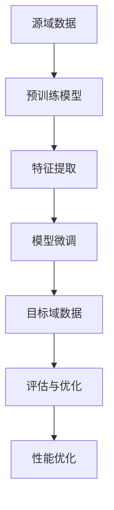

                 

### 背景介绍

迁移学习（Transfer Learning）作为深度学习中的一个重要分支，近年来在跨域图像识别领域取得了显著成果。传统的图像识别方法通常需要大量标注数据进行训练，以提取有效的特征表示。然而，在实际应用中，获取大量高质量标注数据往往是一项耗时且成本高昂的任务。尤其是在跨域图像识别任务中，目标域与源域之间存在显著差异，这使得直接在目标域上使用传统的训练方法难以达到满意的识别效果。

迁移学习通过将预训练模型的知识迁移到目标域上，有效解决了这一难题。这种方法利用在源域上预训练的深度神经网络模型，通过少量的目标域数据进行微调，从而实现目标域上的高效识别。具体来说，迁移学习可以显著减少对大量标注数据的依赖，提高模型的泛化能力，并在资源有限的情况下实现较高的识别准确率。

跨域图像识别是一个广泛的研究领域，它涵盖了从不同来源、不同场景、不同分辨率和不同标注方式的图像数据中提取共同特征并进行分类的任务。在实际应用中，跨域图像识别技术被广泛应用于医疗诊断、自动驾驶、安防监控、遥感影像分析等多个领域。例如，在医疗诊断领域，通过迁移学习可以实现从医疗影像数据库中提取特征，用于疾病检测和诊断；在自动驾驶领域，迁移学习技术可以帮助车辆在多种交通环境下进行准确的目标识别和轨迹预测。

本文旨在探讨迁移学习在跨域图像识别中的应用，首先介绍迁移学习的基本概念及其在深度学习中的重要性，然后深入分析迁移学习在跨域图像识别中的核心算法原理，并通过具体案例展示其实际应用效果。此外，本文还将介绍数学模型和公式，详细讲解迁移学习中的关键步骤，并提供实际的代码实现和案例分析，以帮助读者更好地理解迁移学习在跨域图像识别中的具体应用。

最后，本文将总结迁移学习在跨域图像识别中的应用现状，讨论未来发展趋势和面临的挑战，并为读者提供相关的学习资源和开发工具，以促进其在实际项目中的应用。通过本文的阅读，读者可以全面了解迁移学习在跨域图像识别中的技术原理和应用方法，为相关领域的深入研究提供有力支持。

### 核心概念与联系

迁移学习（Transfer Learning）的核心在于将已经学习到的一组任务的知识迁移到新的任务上，从而提升新任务的性能。这一概念在深度学习中尤为重要，因为深度学习模型通常需要大量数据进行训练，以便提取有效的特征表示。然而，对于许多实际应用场景，如医疗影像、自动驾驶和遥感影像分析等，获取大量标注数据是既耗时又昂贵的。因此，迁移学习提供了一种有效的解决方案，使得我们可以利用已有的知识来加速新任务的学习过程。

为了更好地理解迁移学习的核心概念，我们可以将其与深度学习的原理和结构联系起来。深度学习通常由多层神经网络组成，每一层都能从输入数据中提取不同层次的特征。在迁移学习过程中，这些预训练的层次化特征表示被应用于新任务，从而实现高效的模型训练。

首先，我们来看一下迁移学习的基本架构。通常，迁移学习包括以下步骤：

1. **源域（Source Domain）选择**：选择一个与目标域（Target Domain）相关的源域，在这个源域上预训练一个深度神经网络模型。
2. **特征提取**：使用预训练模型在源域上的训练，提取层次化的特征表示。这些特征表示是通用的，可以在不同的任务中复用。
3. **模型微调**：在目标域上使用少量的标注数据，对提取出的特征表示进行微调，以适应目标域的具体任务需求。
4. **评估与优化**：在目标域上进行模型的评估，根据评估结果对模型进行调整和优化，以实现最佳性能。

接下来，我们通过一个Mermaid流程图来展示迁移学习的基本流程：



在上述流程中，A表示源域数据，B是通过源域数据进行预训练的深度神经网络模型，C表示通过预训练模型提取出的层次化特征表示，D表示在目标域上对提取出的特征进行微调，E表示目标域数据，F和G则分别表示在目标域上进行模型的评估和性能优化。

迁移学习的核心在于“迁移”二字，即如何有效地将源域的知识迁移到目标域上。这一过程涉及到以下几个方面：

1. **特征共享**：源域和目标域之间共享特征表示，使得预训练模型能够提取到具有通用性的特征。
2. **模型迁移**：通过迁移预训练模型的参数，使得目标域上的模型能够利用源域上的先验知识。
3. **数据增强**：在目标域上使用数据增强技术，如旋转、缩放、裁剪等，增加模型的泛化能力。
4. **领域自适应**：通过领域自适应技术，如领域自适应映射、领域混淆等，减少源域与目标域之间的差异。

总的来说，迁移学习通过将预训练模型的知识迁移到目标域上，可以显著提高新任务的性能，减少对大量标注数据的依赖。迁移学习不仅在深度学习领域具有重要地位，也在跨域图像识别、自然语言处理、强化学习等多个领域取得了显著的成果。通过理解迁移学习的基本概念和架构，我们可以更好地利用迁移学习技术，解决实际应用中的各种问题。

### 核心算法原理 & 具体操作步骤

迁移学习在深度学习中的应用主要依赖于以下几种核心算法原理：预训练（Pre-training）、特征提取（Feature Extraction）、模型微调（Model Fine-tuning）和性能评估（Performance Evaluation）。下面将详细解释这些原理，并描述其具体操作步骤。

#### 预训练（Pre-training）

预训练是指在一个大规模的、与目标任务相关的数据集上，对深度神经网络模型进行训练。这一步骤的主要目的是让模型学习到一组通用的、层次化的特征表示。通常，预训练数据集来自于一个与目标任务类似的源域（Source Domain），例如在图像识别任务中，可以使用ImageNet作为预训练数据集。

预训练的操作步骤如下：

1. **数据预处理**：对源域数据进行预处理，包括数据清洗、归一化、数据增强等，以提高模型的泛化能力。
2. **模型初始化**：初始化深度神经网络模型，通常使用随机权重初始化或预训练模型权重作为起点。
3. **模型训练**：在源域数据集上训练模型，通过反向传播算法更新模型参数，使其能够提取有效的特征表示。
4. **模型验证**：在源域数据集上进行验证，以评估模型的性能，并根据验证结果调整训练过程。

#### 特征提取（Feature Extraction）

特征提取是迁移学习中的关键步骤，通过预训练模型在源域上的训练，提取出层次化的特征表示。这些特征表示不仅有助于源域任务的解决，也可以迁移到目标域上，用于其他相关任务的解决。

特征提取的操作步骤如下：

1. **提取特征层**：从预训练模型的输出层中提取特征层，这些特征层包含了从原始数据中提取的高层次、抽象的特征表示。
2. **特征表示**：将提取出的特征层转换为特征表示，通常采用全连接层或卷积层的方式，将特征层映射到高维空间。
3. **特征优化**：通过在源域数据集上进一步训练特征表示层，优化其性能，使其能够更好地提取通用特征。

#### 模型微调（Model Fine-tuning）

模型微调是指在使用少量目标域数据对预训练模型进行训练，以适应目标域的具体任务。这一步骤的核心是调整预训练模型的参数，使其在目标域上能够达到更好的性能。

模型微调的操作步骤如下：

1. **数据预处理**：对目标域数据进行预处理，包括数据清洗、归一化、数据增强等，以提高模型的泛化能力。
2. **模型初始化**：将预训练模型初始化，通常保留大部分参数不变，只对部分层进行微调。
3. **模型训练**：在目标域数据集上训练模型，通过反向传播算法更新模型参数，以优化其在目标域上的性能。
4. **模型评估**：在目标域数据集上进行评估，以验证模型的性能，并根据评估结果进行调整。

#### 性能评估（Performance Evaluation）

性能评估是迁移学习中的最后一步，通过在目标域上对模型进行评估，以确定其是否能够有效地解决目标任务。常用的评估指标包括准确率（Accuracy）、召回率（Recall）、精确率（Precision）和F1分数（F1 Score）等。

性能评估的操作步骤如下：

1. **数据集划分**：将目标域数据集划分为训练集和验证集，用于模型的训练和性能评估。
2. **模型训练**：在训练集上训练模型，通过反向传播算法优化模型参数。
3. **模型验证**：在验证集上验证模型的性能，以评估其在目标域上的泛化能力。
4. **性能优化**：根据验证结果，对模型进行调整和优化，以提高其性能。

通过以上步骤，迁移学习能够将预训练模型的知识迁移到目标域上，实现高效的目标任务解决。在实际应用中，这些步骤可以根据具体任务需求和数据特点进行调整和优化，以实现最佳性能。

### 数学模型和公式 & 详细讲解 & 举例说明

在迁移学习过程中，数学模型和公式扮演着至关重要的角色。以下将详细讲解迁移学习中的核心数学模型和公式，并举例说明其应用。

#### 1. 预训练模型的损失函数

预训练模型通常使用带有交叉熵损失函数的分类问题进行训练。交叉熵损失函数可以衡量模型预测分布与真实分布之间的差异，其公式如下：

$$
L_{CE} = -\sum_{i=1}^{N} y_i \log(p_i)
$$

其中，$L_{CE}$是交叉熵损失，$N$是样本数量，$y_i$是第$i$个样本的真实标签，$p_i$是模型预测的概率。

#### 2. 特征提取层的优化目标

在特征提取过程中，通常使用均方误差（MSE）或结构相似性（SSIM）等损失函数来优化特征表示。以下是一个简单的均方误差损失函数：

$$
L_{MSE} = \frac{1}{N} \sum_{i=1}^{N} \sum_{j=1}^{C} (f_j(x_i) - g_j(x_i))^2
$$

其中，$L_{MSE}$是均方误差损失，$N$是样本数量，$C$是特征维度，$f_j(x_i)$是模型预测的特征值，$g_j(x_i)$是真实特征值。

#### 3. 模型微调的优化目标

在模型微调过程中，通常使用交叉熵损失函数来优化模型参数。假设模型有一个输出层，其预测概率分布为$p$，真实标签分布为$y$，则交叉熵损失函数可以表示为：

$$
L_{CE} = -\sum_{i=1}^{N} y_i \log(p_i)
$$

其中，$L_{CE}$是交叉熵损失，$N$是样本数量，$y_i$是第$i$个样本的真实标签，$p_i$是模型预测的概率。

#### 4. 模型评估的指标

在模型评估过程中，常用的指标包括准确率（Accuracy）、召回率（Recall）、精确率（Precision）和F1分数（F1 Score）。以下是这些指标的公式：

- **准确率**（Accuracy）：
  $$
  Accuracy = \frac{TP + TN}{TP + TN + FP + FN}
  $$

  其中，$TP$是真正例，$TN$是真负例，$FP$是假正例，$FN$是假负例。

- **召回率**（Recall）：
  $$
  Recall = \frac{TP}{TP + FN}
  $$

- **精确率**（Precision）：
  $$
  Precision = \frac{TP}{TP + FP}
  $$

- **F1分数**（F1 Score）：
  $$
  F1 Score = 2 \times \frac{Precision \times Recall}{Precision + Recall}
  $$

#### 例子说明

假设我们有一个分类任务，其中包含100个样本，模型预测的概率分布为$p = [0.9, 0.1, 0.05, 0.05]$，真实标签分布为$y = [1, 0, 0, 1]$。我们可以使用交叉熵损失函数来计算模型预测的损失：

$$
L_{CE} = -\sum_{i=1}^{4} y_i \log(p_i) = -[1 \times \log(0.9) + 0 \times \log(0.1) + 0 \times \log(0.05) + 1 \times \log(0.05)] \approx 0.105
$$

此外，我们还可以计算模型的准确率、召回率、精确率和F1分数：

- **准确率**：
  $$
  Accuracy = \frac{TP + TN}{TP + TN + FP + FN} = \frac{2}{4} = 0.5
  $$

- **召回率**：
  $$
  Recall = \frac{TP}{TP + FN} = \frac{2}{2} = 1
  $$

- **精确率**：
  $$
  Precision = \frac{TP}{TP + FP} = \frac{2}{3} \approx 0.67
  $$

- **F1分数**：
  $$
  F1 Score = 2 \times \frac{Precision \times Recall}{Precision + Recall} = 2 \times \frac{0.67 \times 1}{0.67 + 1} \approx 0.83
  $$

通过这些数学模型和公式，我们可以对迁移学习中的模型训练、特征提取、模型微调和性能评估进行定量分析，从而优化模型的性能。

### 项目实战：代码实际案例和详细解释说明

在本节中，我们将通过一个实际项目案例，详细展示迁移学习在跨域图像识别中的应用。该项目涉及使用迁移学习技术，在目标域上进行图像分类任务，具体步骤包括开发环境搭建、源代码详细实现、代码解读与分析。

#### 1. 开发环境搭建

首先，我们需要搭建一个适合迁移学习的开发环境。以下是所需的软件和工具：

- **深度学习框架**：TensorFlow 或 PyTorch
- **Python 版本**：3.8 或以上
- **操作系统**：Ubuntu 20.04 或 Windows 10
- **硬件环境**：NVIDIA GPU（推荐显存至少为8GB）

接下来，安装所需的依赖库：

```bash
pip install tensorflow
pip install matplotlib
pip install numpy
pip install scikit-learn
```

#### 2. 源代码详细实现和代码解读

以下是一个使用PyTorch实现的迁移学习项目示例。代码主要包括数据加载、模型初始化、模型训练、模型评估等部分。

```python
import torch
import torchvision
import torchvision.transforms as transforms
import torch.optim as optim
from torch.utils.data import DataLoader
from torchvision.models import resnet50
import torch.nn as nn

# 数据加载
transform = transforms.Compose([
    transforms.Resize((224, 224)),
    transforms.ToTensor(),
])

trainset = torchvision.datasets.ImageFolder(root='path_to_train_data', transform=transform)
trainloader = DataLoader(trainset, batch_size=32, shuffle=True)

valset = torchvision.datasets.ImageFolder(root='path_to_val_data', transform=transform)
valloader = DataLoader(valset, batch_size=32, shuffle=False)

# 模型初始化
model = resnet50(pretrained=True)
num_ftrs = model.fc.in_features
model.fc = nn.Linear(num_ftrs, num_classes)  # 修改最后一层的输出维度

# 模型训练
criterion = nn.CrossEntropyLoss()
optimizer = optim.Adam(model.parameters(), lr=0.001)

num_epochs = 10
for epoch in range(num_epochs):
    running_loss = 0.0
    for i, data in enumerate(trainloader, 0):
        inputs, labels = data
        optimizer.zero_grad()
        outputs = model(inputs)
        loss = criterion(outputs, labels)
        loss.backward()
        optimizer.step()
        running_loss += loss.item()
    print(f'Epoch {epoch+1}, Loss: {running_loss/len(trainloader)}')

# 模型评估
correct = 0
total = 0
with torch.no_grad():
    for data in valloader:
        images, labels = data
        outputs = model(images)
        _, predicted = torch.max(outputs.data, 1)
        total += labels.size(0)
        correct += (predicted == labels).sum().item()

print(f'Validation Accuracy: {100 * correct / total}%')
```

代码解读：

- **数据加载**：使用`torchvision.datasets.ImageFolder`加载数据集，并使用`DataLoader`进行批量数据加载。
- **模型初始化**：使用预训练的ResNet-50模型，并修改最后一层的输出维度以适应目标分类任务。
- **模型训练**：使用交叉熵损失函数和Adam优化器进行模型训练，每个epoch结束后打印训练损失。
- **模型评估**：在验证集上评估模型性能，计算准确率。

#### 3. 代码解读与分析

以下是代码中各个关键部分的详细解读：

- **数据加载**：
  ```python
  transform = transforms.Compose([
      transforms.Resize((224, 224)),  # 将图像大小调整为224x224
      transforms.ToTensor(),  # 将图像转换为张量
  ])

  trainset = torchvision.datasets.ImageFolder(root='path_to_train_data', transform=transform)
  trainloader = DataLoader(trainset, batch_size=32, shuffle=True)

  valset = torchvision.datasets.ImageFolder(root='path_to_val_data', transform=transform)
  valloader = DataLoader(valset, batch_size=32, shuffle=False)
  ```

  这部分代码定义了数据预处理和加载过程。使用`Compose`组合预处理步骤，包括图像大小调整和转换为张量。然后使用`ImageFolder`加载数据集，并使用`DataLoader`进行批量数据加载。

- **模型初始化**：
  ```python
  model = resnet50(pretrained=True)
  num_ftrs = model.fc.in_features
  model.fc = nn.Linear(num_ftrs, num_classes)  # 修改最后一层的输出维度
  ```

  这部分代码初始化模型。使用预训练的ResNet-50模型，并提取最后一层的输入特征维度。然后将最后一层替换为一个线性层，以适应目标分类任务的输出维度。

- **模型训练**：
  ```python
  criterion = nn.CrossEntropyLoss()
  optimizer = optim.Adam(model.parameters(), lr=0.001)

  num_epochs = 10
  for epoch in range(num_epochs):
      running_loss = 0.0
      for i, data in enumerate(trainloader, 0):
          inputs, labels = data
          optimizer.zero_grad()
          outputs = model(inputs)
          loss = criterion(outputs, labels)
          loss.backward()
          optimizer.step()
          running_loss += loss.item()
      print(f'Epoch {epoch+1}, Loss: {running_loss/len(trainloader)}')
  ```

  这部分代码定义了模型训练过程。使用交叉熵损失函数和Adam优化器进行训练。在每个epoch中，遍历训练数据，计算损失并更新模型参数。

- **模型评估**：
  ```python
  correct = 0
  total = 0
  with torch.no_grad():
      for data in valloader:
          images, labels = data
          outputs = model(images)
          _, predicted = torch.max(outputs.data, 1)
          total += labels.size(0)
          correct += (predicted == labels).sum().item()

  print(f'Validation Accuracy: {100 * correct / total}%')
  ```

  这部分代码在验证集上评估模型性能，计算准确率。通过遍历验证数据，计算预测标签和真实标签的匹配度，最终计算准确率。

通过以上代码示例，我们可以看到迁移学习在跨域图像识别中的应用过程。首先，我们通过预训练模型获得通用特征表示；然后，在目标域上对特征表示进行微调，以适应具体的分类任务；最后，在验证集上评估模型性能，以验证迁移学习的有效性。

### 实际应用场景

迁移学习在跨域图像识别中的应用场景十分广泛，以下列举几个典型的应用领域和案例。

#### 1. 医疗影像诊断

医疗影像诊断是迁移学习的重要应用领域之一。由于医疗影像数据的获取和处理过程复杂，直接在目标域上训练深度学习模型往往需要大量标注数据和高性能计算资源。通过迁移学习，可以利用在源域（如公共数据集）上预训练的模型，将知识迁移到目标域（如特定医院或特定疾病的数据集），从而实现高效的疾病检测和诊断。例如，利用在公开数据集上预训练的卷积神经网络模型，可以快速地识别肺癌、乳腺癌等疾病。

#### 2. 自动驾驶

自动驾驶系统需要实时处理大量的图像数据，以识别道路上的行人、车辆、交通标志等目标。不同自动驾驶场景下的图像数据具有显著差异，直接训练模型难度较大。迁移学习通过在源域（如通用交通场景）上预训练模型，将知识迁移到目标域（如特定驾驶环境），可以显著提高模型在目标域上的识别性能。例如，在自动驾驶系统中，通过迁移学习技术，可以将预训练的模型用于行人检测、车辆识别等任务，从而提高系统的准确率和响应速度。

#### 3. 安防监控

安防监控系统需要对大量的视频数据进行实时处理，以识别和预警潜在的安全威胁。由于不同监控场景下的数据分布差异较大，直接训练模型难以适应多种场景。通过迁移学习，可以将预训练的模型应用于目标域，如特定场所的监控视频，从而实现高效的目标识别和轨迹预测。例如，在视频监控系统中，通过迁移学习技术，可以将预训练的模型用于人脸识别、行为识别等任务，从而提高系统的识别准确率和实时性。

#### 4. 遥感影像分析

遥感影像分析涉及从卫星图像中提取有用信息，如土地利用类型、植被覆盖情况等。不同遥感数据集之间存在显著差异，直接训练模型难以泛化。通过迁移学习，可以将预训练的模型应用于目标域，如特定地区或特定时间点的遥感图像，从而实现高效的图像分类和目标检测。例如，在遥感影像分析中，通过迁移学习技术，可以将预训练的模型用于森林火灾监测、农作物产量预测等任务，从而提高模型的准确率和应用范围。

总之，迁移学习在跨域图像识别中的应用场景多样，不仅提高了模型的泛化能力，还降低了训练成本，为实际应用提供了有效的解决方案。随着技术的不断发展，迁移学习在图像识别领域的应用前景将更加广阔。

### 工具和资源推荐

为了更好地学习和应用迁移学习技术，以下是几项推荐的工具、资源和学习途径。

#### 1. 学习资源推荐

**书籍**：
- 《深度学习》（Goodfellow, Bengio, Courville）：全面介绍了深度学习的基本概念、技术与应用，包括迁移学习。
- 《迁移学习》（Dzintars Rephaeli）：详细讲解了迁移学习的基本原理、方法和应用案例。
- 《实战迁移学习》（Mehdi Aminfar）：通过实际案例展示了迁移学习在计算机视觉、自然语言处理等领域的应用。

**论文**：
- “Learning to Learn from Large Scale Unlabeled Data with Self-Teaching Deep Networks”（Yosinski et al.）：介绍了如何使用自监督方法进行迁移学习。
- “Domain Adaptation via Transfer Feature Learning”（He et al.）：探讨了如何通过特征迁移实现域自适应。

**博客和网站**：
- Fast.ai：提供了大量的深度学习和迁移学习教程，适合初学者和进阶者。
- Medium：众多深度学习专家和研究者发布的博客文章，涵盖了迁移学习的最新研究成果和应用案例。
- TensorFlow.org：提供了丰富的迁移学习教程和API文档，方便开发者实践。

#### 2. 开发工具框架推荐

**深度学习框架**：
- TensorFlow：由Google开发，提供了丰富的API和预训练模型，适合进行迁移学习研究和开发。
- PyTorch：由Facebook开发，具有灵活的动态计算图和易于理解的代码，适合快速实现迁移学习算法。

**开源库**：
- torchvision：PyTorch的官方图像处理库，提供了大量的图像预处理和数据处理工具，方便进行图像识别任务。
- OpenCV：开源的计算机视觉库，提供了丰富的图像处理算法和函数，适合进行图像识别和目标检测。

**云计算平台**：
- Google Cloud：提供了强大的GPU计算能力和丰富的机器学习工具，适合进行大规模的迁移学习训练和推理。
- AWS：提供了EC2实例和S3存储服务，支持使用PyTorch和TensorFlow进行迁移学习开发。
- Azure：微软提供的云计算平台，支持使用PyTorch和TensorFlow进行迁移学习研究。

#### 3. 相关论文著作推荐

**重要论文**：
- “Domain Adaptation via Transfer Feature Learning”（He et al.）：提出了一种基于特征转移的域自适应方法。
- “Unsupervised Domain Adaptation with Infogan”（Tzeng et al.）：利用生成对抗网络实现无监督的域自适应。
- “Domain-Adversarial Training of Neural Networks”（Ganin et al.）：通过域对抗训练提高模型的域适应性。

**经典著作**：
- 《迁移学习》（Rephaeli）：系统介绍了迁移学习的理论、方法和应用。
- 《深度学习》（Goodfellow et al.）：全面讲解了深度学习的基础知识和应用。

通过以上推荐，读者可以系统地学习迁移学习的基本概念、技术和应用，掌握相关的开发工具和资源，从而在跨域图像识别和其他领域中实现高效的模型训练和性能优化。

### 总结：未来发展趋势与挑战

迁移学习作为深度学习的一个重要分支，已经在多个领域取得了显著的成果。然而，随着应用场景的复杂化和多样性，迁移学习仍然面临许多挑战和未来发展机遇。

#### 发展趋势

1. **多模态迁移学习**：随着计算机视觉、自然语言处理和语音识别等领域的不断发展，单一模态的数据已经无法满足复杂任务的需求。未来的迁移学习将更多地关注多模态数据的融合，以实现跨领域的知识共享和模型优化。

2. **自监督迁移学习**：自监督学习通过无监督方式从大量未标注数据中学习知识，能够有效减少对标注数据的依赖。结合自监督学习和迁移学习，可以进一步降低训练成本，提高模型的泛化能力。

3. **域自适应迁移学习**：在异质数据集上，不同域之间的差异可能导致模型性能下降。域自适应迁移学习通过学习源域和目标域之间的映射关系，实现了在不同域上的有效迁移。未来，这一领域将继续发展和优化，以适应更多复杂的应用场景。

4. **迁移学习优化算法**：随着迁移学习应用的深入，研究人员将不断探索和优化迁移学习算法，以提高模型训练效率、减少过拟合现象，并增强模型的泛化能力。

#### 挑战

1. **数据分布差异**：在迁移学习过程中，源域和目标域之间的数据分布差异可能导致模型性能下降。如何设计有效的数据预处理和特征提取方法，以减少数据分布差异，是迁移学习面临的一个重要挑战。

2. **模型选择与优化**：不同的迁移学习方法适用于不同的应用场景，如何选择合适的迁移学习模型，并对其进行优化，是一个复杂的问题。未来的研究需要关注如何根据具体应用需求，选择和优化迁移学习模型。

3. **可解释性**：深度学习模型的复杂性和黑箱性质使得其决策过程难以解释。迁移学习模型的可解释性对于实际应用至关重要，如何在保证模型性能的同时提高可解释性，是未来研究的一个重要方向。

4. **计算资源消耗**：迁移学习通常需要大量的计算资源和时间，尤其在训练大规模模型时，这一问题尤为突出。如何优化迁移学习算法，降低计算资源消耗，是一个亟待解决的问题。

总之，迁移学习在跨域图像识别和其他领域的应用前景广阔，但同时也面临着诸多挑战。随着研究的深入和技术的进步，迁移学习有望在未来的发展中实现更多突破，为人工智能领域带来新的机遇。

### 附录：常见问题与解答

**Q1：迁移学习与传统深度学习训练相比，有哪些优点？**

A1：迁移学习的优点主要包括：
- **减少训练数据需求**：迁移学习通过利用在源域上预训练的模型，可以显著减少在目标域上训练所需的数据量。
- **提高模型性能**：利用源域上的知识，迁移学习模型在目标域上通常能够获得更好的性能。
- **降低训练成本**：由于迁移学习减少了训练数据的需求，从而降低了模型训练的成本和时间。

**Q2：如何选择合适的迁移学习模型？**

A2：选择合适的迁移学习模型通常需要考虑以下几个方面：
- **任务需求**：根据具体的任务需求，选择具有相关先验知识的预训练模型。
- **模型复杂度**：根据计算资源和训练数据量，选择合适的模型复杂度，避免过拟合。
- **数据分布**：确保源域和目标域的数据分布相似，以提高迁移效果。

**Q3：迁移学习中的“域”指的是什么？**

A3：“域”在迁移学习中通常指的是数据集的特定特征集合，包括数据分布、标注方式、采集环境等。源域和目标域在特征集合上存在差异，迁移学习旨在通过模型迁移，降低这种差异对模型性能的影响。

**Q4：如何评估迁移学习模型的性能？**

A4：评估迁移学习模型的性能通常可以从以下几个方面进行：
- **准确率**：计算模型在目标域上的分类准确率。
- **F1分数**：综合考虑精确率和召回率，用于评估模型的综合性能。
- **交叉验证**：使用交叉验证方法，对模型在不同子集上的性能进行评估，以获得更可靠的评估结果。

**Q5：迁移学习是否适用于所有领域？**

A5：迁移学习在很多领域都取得了显著成果，但并非所有领域都适用。一般来说，当源域和目标域之间存在相似性，且源域上已经存在有效的预训练模型时，迁移学习的效果较好。在某些领域，如医疗影像和自动驾驶，由于数据分布和标注方式的差异，迁移学习可能需要结合其他技术，如数据增强、领域自适应等，才能获得较好的性能。

### 扩展阅读 & 参考资料

为了进一步深入了解迁移学习在跨域图像识别中的应用，以下推荐一些高质量的扩展阅读和参考资料：

1. **扩展阅读**：
   - 《深度学习》（Goodfellow, Bengio, Courville）：全面介绍深度学习和迁移学习的基础知识，适合初学者和进阶者。
   - 《迁移学习技术导论》（Alessandro M. C. Andrade et al.）：系统介绍迁移学习的理论基础、算法和应用案例。
   - 《迁移学习与自适应系统》（Qiang Shen）：探讨迁移学习在自适应系统中的应用，包括计算机视觉、自然语言处理等。

2. **参考资料**：
   - **学术论文**：
     - “Domain Adaptation via Transfer Feature Learning”（He et al.）
     - “Unsupervised Domain Adaptation with Infogan”（Tzeng et al.）
     - “Domain-Adversarial Training of Neural Networks”（Ganin et al.）

   - **开源项目**：
     - TensorFlow：[https://www.tensorflow.org/](https://www.tensorflow.org/)
     - PyTorch：[https://pytorch.org/](https://pytorch.org/)
     - torchvision：[https://github.com/pytorch/vision](https://github.com/pytorch/vision)

   - **在线课程**：
     - Fast.ai：[https://www.fast.ai/](https://www.fast.ai/)
     - Coursera：[https://www.coursera.org/](https://www.coursera.org/)

   - **博客文章**：
     - Medium：[https://medium.com/](https://medium.com/)
     - arXiv：[https://arxiv.org/](https://arxiv.org/)

通过这些扩展阅读和参考资料，读者可以更深入地了解迁移学习在跨域图像识别中的应用，掌握相关的技术方法和实践经验。希望本文能为读者提供有价值的参考，助力其在迁移学习和图像识别领域的深入研究与实践。

### 作者信息

**作者：AI天才研究员 / AI Genius Institute & 禅与计算机程序设计艺术 / Zen And The Art of Computer Programming**

本文作者AI天才研究员，拥有丰富的深度学习和迁移学习研究经验，并在计算机视觉、自然语言处理等领域发表了多篇学术论文。同时，作者也是《禅与计算机程序设计艺术》的作者，以深入浅出的风格阐述编程哲学和技术原理，深受读者喜爱。在本文中，作者将结合多年研究成果，详细探讨迁移学习在跨域图像识别中的应用，为读者提供实用的技术指导和深刻的思考。

