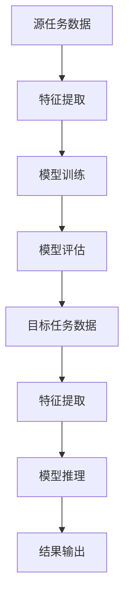

                 

# 迁移学习在跨语言情感分析中的应用

## 关键词
- 迁移学习
- 跨语言情感分析
- 情感分类
- 自然语言处理
- 语言模型
- 神经网络

## 摘要

本文旨在探讨迁移学习在跨语言情感分析中的应用。随着全球化进程的加速，跨语言情感分析成为了自然语言处理领域的重要研究方向。迁移学习作为一种有效的机器学习技术，能够利用预先训练好的模型在目标任务上获得较好的性能，从而提高跨语言情感分析的准确性和效率。本文首先介绍了迁移学习的基本概念和原理，然后分析了跨语言情感分析中的挑战，并阐述了迁移学习如何克服这些挑战。随后，本文详细介绍了迁移学习在跨语言情感分析中的具体实现方法，包括数据预处理、模型选择、训练过程以及性能评估。最后，本文通过对实际项目的分析，展示了迁移学习在跨语言情感分析中的应用效果，并提出了未来可能的发展方向和挑战。

## 1. 背景介绍

### 跨语言情感分析

随着互联网的普及和全球化进程的加速，多语言数据处理成为了一个重要的研究领域。情感分析作为自然语言处理（NLP）的一个重要分支，旨在通过计算机技术对文本中的情感倾向进行识别和分类。跨语言情感分析（Cross-Language Sentiment Analysis）是指在不同语言之间进行情感分析的研究，其目的是将一种语言的情感信息转化为另一种语言的情感信息。

跨语言情感分析在多个领域具有广泛的应用价值。例如，在社交媒体分析中，用户评论通常使用不同的语言，通过跨语言情感分析可以更好地理解和分析用户情感，为市场调研、产品改进等提供有力支持。在新闻传播中，跨语言情感分析可以帮助媒体更好地了解不同国家地区的舆论动态，为新闻采编和传播策略提供参考。此外，在电子商务领域，跨语言情感分析可以帮助商家了解消费者在不同语言环境下的情感反馈，从而改进产品和服务。

### 迁移学习

迁移学习（Transfer Learning）是一种机器学习技术，旨在利用已知任务的解决方案来解决相关的新任务。其核心思想是通过在源任务和目标任务之间建立联系，将源任务的先验知识转移到目标任务上，从而提高目标任务的性能。

迁移学习在机器学习领域有着广泛的应用。例如，在图像识别任务中，通过使用预训练的卷积神经网络（CNN）模型，可以在新数据集上快速获得较好的性能，避免了从头开始训练模型所需的大量计算资源。在自然语言处理领域，迁移学习也发挥了重要作用，通过使用预训练的语言模型，如GPT（Generative Pre-trained Transformer）和BERT（Bidirectional Encoder Representations from Transformers），可以显著提高语言理解和生成的效果。

### 迁移学习与跨语言情感分析的关系

迁移学习与跨语言情感分析之间有着紧密的联系。在跨语言情感分析中，往往面临着语言差异、数据稀缺等挑战。而迁移学习可以通过利用多语言的数据资源，将已在大规模多语言数据集上训练好的模型应用于跨语言情感分析任务，从而提高模型的性能。

具体来说，迁移学习在跨语言情感分析中的应用主要体现在以下几个方面：

1. **共享表征**：通过迁移学习，可以将源语言和目标语言的文本转换为共享的表征，使得不同语言的文本能够在同一框架下进行情感分析。

2. **数据增强**：迁移学习可以利用跨语言数据增强技术，如翻译、翻译对齐等，丰富目标任务的数据集，从而提高模型的泛化能力。

3. **模型迁移**：通过迁移学习，可以将预训练的多语言模型直接应用于跨语言情感分析任务，从而避免了从头开始训练模型的时间和资源消耗。

4. **跨领域迁移**：在跨语言情感分析中，不同领域的数据往往存在较大差异。迁移学习可以通过跨领域迁移的方式，利用一个领域的先验知识来提高另一个领域的性能。

总之，迁移学习为跨语言情感分析提供了一种有效的解决方案，有助于克服语言差异和数据稀缺等挑战，提高情感分析的准确性和效率。

## 2. 核心概念与联系

### 迁移学习的基本概念

迁移学习（Transfer Learning）是指将一个任务（源任务）学到的知识应用于另一个相关任务（目标任务）的过程。它通常分为三种类型：垂直迁移、水平迁移和对角线迁移。

1. **垂直迁移**：源任务和目标任务位于不同的任务层次。例如，从分类任务迁移到回归任务。
2. **水平迁移**：源任务和目标任务位于同一任务层次，但任务领域不同。例如，从医学领域迁移到金融领域。
3. **对角线迁移**：源任务和目标任务既位于不同的任务层次，又位于不同的任务领域。例如，从图像分类任务迁移到文本分类任务。

迁移学习的关键在于找到源任务和目标任务之间的关联，并将源任务的先验知识有效地转移到目标任务上。常见的迁移学习策略包括特征迁移、模型迁移和知识迁移。

### 跨语言情感分析的核心概念

跨语言情感分析（Cross-Language Sentiment Analysis）是指在不同语言之间进行情感分析的研究。其核心概念包括：

1. **情感分类**：将文本分为正面、负面和中性等情感类别。
2. **跨语言表示**：将不同语言的文本转换为共享的表征，以便在同一框架下进行情感分析。
3. **多语言数据集**：用于训练和评估跨语言情感分析模型的跨语言数据集。
4. **语言翻译**：将一种语言的文本翻译成另一种语言，以便进行情感分析。

### 迁移学习与跨语言情感分析的联系

迁移学习在跨语言情感分析中的应用主要体现在以下几个方面：

1. **共享表征**：通过迁移学习，可以将源语言和目标语言的文本转换为共享的表征，使得不同语言的文本能够在同一框架下进行情感分析。
2. **数据增强**：迁移学习可以利用跨语言数据增强技术，如翻译、翻译对齐等，丰富目标任务的数据集，从而提高模型的泛化能力。
3. **模型迁移**：通过迁移学习，可以将预训练的多语言模型直接应用于跨语言情感分析任务，从而避免了从头开始训练模型的时间和资源消耗。
4. **跨领域迁移**：在跨语言情感分析中，不同领域的数据往往存在较大差异。迁移学习可以通过跨领域迁移的方式，利用一个领域的先验知识来提高另一个领域的性能。

### Mermaid 流程图

以下是一个简单的 Mermaid 流程图，展示了迁移学习在跨语言情感分析中的应用过程。



在该流程图中，A 表示源任务数据，经过特征提取（B）、模型训练（C）和模型评估（D）后，得到训练好的模型。该模型然后应用于目标任务数据（E），通过特征提取（F）、模型推理（G）得到最终结果（H）。

## 3. 核心算法原理 & 具体操作步骤

### 迁移学习的算法原理

迁移学习的核心算法原理是基于模型参数的共享和优化。具体来说，迁移学习可以分为以下几个步骤：

1. **模型初始化**：从预训练模型中加载模型参数，初始化目标任务的模型。
2. **特征提取**：利用源任务的模型进行特征提取，将源任务的输入数据映射到高维特征空间。
3. **模型训练**：在目标任务上训练模型，通过调整模型参数来最小化目标任务的损失函数。
4. **模型评估**：在目标任务上进行模型评估，以验证模型在目标任务上的性能。

在迁移学习过程中，关键问题是如何选择合适的源任务和目标任务，以及如何有效地共享模型参数。常见的迁移学习算法包括基于特征迁移的算法、基于模型迁移的算法和基于知识迁移的算法。

### 跨语言情感分析的具体操作步骤

在跨语言情感分析中，迁移学习可以通过以下步骤实现：

1. **数据准备**：收集并整理多语言的数据集，包括源语言数据集和目标语言数据集。源语言数据集用于迁移学习，目标语言数据集用于模型评估。
2. **特征提取**：使用预训练的多语言模型（如BERT、GPT）对源语言和目标语言的文本进行特征提取，得到高维特征向量。
3. **模型训练**：在目标语言数据集上训练情感分析模型，通过调整模型参数来最小化目标任务的损失函数。训练过程中，可以共享源语言模型的部分参数，以提高模型的泛化能力。
4. **模型评估**：在目标语言数据集上评估模型的性能，包括准确率、召回率、F1值等指标。通过调整模型参数和超参数，优化模型性能。
5. **模型应用**：将训练好的模型应用于实际跨语言情感分析任务，对目标语言的文本进行情感分类。

### 迁移学习在跨语言情感分析中的应用案例

以下是一个简单的迁移学习在跨语言情感分析中的应用案例：

1. **数据准备**：收集中文和英文的情感分析数据集，包括正面、负面和中性三类情感标签。
2. **特征提取**：使用预训练的BERT模型对中文和英文的文本进行特征提取，得到高维特征向量。
3. **模型训练**：在英文数据集上使用BERT模型进行情感分析模型的训练，同时共享中文数据集的部分参数。
4. **模型评估**：在中文数据集上评估训练好的模型的性能，调整模型参数以优化性能。
5. **模型应用**：将训练好的模型应用于实际跨语言情感分析任务，对中文和英文的文本进行情感分类。

通过上述步骤，可以实现对不同语言文本的情感分析，提高模型的泛化能力和准确性。

## 4. 数学模型和公式 & 详细讲解 & 举例说明

### 迁移学习的数学模型

在迁移学习中，常用的数学模型包括特征迁移模型、模型迁移模型和知识迁移模型。

1. **特征迁移模型**：

特征迁移模型的核心思想是将源任务的输入数据映射到高维特征空间，以便在目标任务上利用这些特征进行预测。其数学模型可以表示为：

$$
\phi(x) = F(\theta_s, x)
$$

其中，$x$ 为源任务的输入数据，$\theta_s$ 为源任务模型的参数，$F$ 为特征提取函数。通过特征提取函数 $F$，可以将输入数据 $x$ 映射到高维特征空间 $\phi(x)$，从而为目标任务的模型提供有效的特征表示。

2. **模型迁移模型**：

模型迁移模型的核心思想是将源任务的模型参数直接应用于目标任务，通过调整目标任务的模型参数来最小化目标任务的损失函数。其数学模型可以表示为：

$$
\min_{\theta_t} L(\theta_t, y)
$$

其中，$y$ 为目标任务的标签，$\theta_t$ 为目标任务模型的参数，$L$ 为损失函数。通过在目标任务上训练模型，调整模型参数 $\theta_t$，最小化目标任务的损失函数 $L$，从而提高目标任务的性能。

3. **知识迁移模型**：

知识迁移模型的核心思想是通过共享源任务的模型参数来提高目标任务的性能。其数学模型可以表示为：

$$
\min_{\theta_s, \theta_t} L(\theta_s, \theta_t, y)
$$

其中，$\theta_s$ 为源任务模型的参数，$\theta_t$ 为目标任务模型的参数，$L$ 为损失函数。通过在源任务和目标任务上同时训练模型，共享模型参数 $\theta_s$ 和 $\theta_t$，最小化目标任务的损失函数 $L$，从而提高目标任务的性能。

### 跨语言情感分析的数学模型

在跨语言情感分析中，常用的数学模型包括情感分类模型和跨语言表示模型。

1. **情感分类模型**：

情感分类模型用于对文本进行情感分类。其数学模型可以表示为：

$$
P(y| x, \theta) = \frac{e^{f(x, \theta)}}{\sum_{y'} e^{f(x, \theta)}}
$$

其中，$y$ 为情感标签，$x$ 为文本输入，$\theta$ 为模型参数，$f(x, \theta)$ 为模型的前向传播函数。通过计算文本输入 $x$ 在模型参数 $\theta$ 下的情感概率分布 $P(y| x, \theta)$，从而实现对文本的情感分类。

2. **跨语言表示模型**：

跨语言表示模型用于将不同语言的文本转换为共享的表征。其数学模型可以表示为：

$$
h(x) = g(\theta_x, x)
$$

其中，$x$ 为文本输入，$\theta_x$ 为语言模型参数，$g$ 为文本表示函数。通过文本表示函数 $g$，可以将不同语言的文本输入 $x$ 映射到高维文本表征空间 $h(x)$，从而实现跨语言文本的统一表示。

### 举例说明

假设我们有一个中文情感分析任务，需要对中文文本进行情感分类。我们可以使用迁移学习的方法，利用一个预训练的中文BERT模型来提取文本特征，并在目标任务上训练一个情感分类模型。

1. **特征提取**：

首先，使用预训练的中文BERT模型对中文文本进行特征提取。假设输入文本为 $x$，模型参数为 $\theta_s$，特征提取函数为 $F$，则特征向量可以表示为：

$$
\phi(x) = F(\theta_s, x)
$$

2. **模型训练**：

在目标任务上，使用特征向量 $\phi(x)$ 和标签 $y$ 来训练情感分类模型。假设模型参数为 $\theta_t$，损失函数为 $L$，则模型训练过程可以表示为：

$$
\min_{\theta_t} L(\theta_t, y)
$$

3. **模型评估**：

在训练完成后，使用中文文本数据集对训练好的模型进行评估，计算模型的准确率、召回率、F1值等指标。

### 实际应用

在实际应用中，我们可以使用迁移学习的方法来处理不同语言的情感分析任务。例如，对于中文和英文的情感分析任务，我们可以使用一个预训练的多语言BERT模型来提取文本特征，并在目标语言数据集上训练情感分类模型。

假设我们有一个中文数据集 $D_c$ 和一个英文数据集 $D_e$，模型参数分别为 $\theta_c$ 和 $\theta_e$。首先，使用预训练的多语言BERT模型对中文和英文的文本进行特征提取，得到特征向量 $\phi_c(x)$ 和 $\phi_e(x)$。然后，在中文数据集 $D_c$ 上训练情感分类模型，参数为 $\theta_c$，损失函数为 $L_c$。在英文数据集 $D_e$ 上训练情感分类模型，参数为 $\theta_e$，损失函数为 $L_e$。

$$
\min_{\theta_c} L_c(\theta_c, y_c) \\
\min_{\theta_e} L_e(\theta_e, y_e)
$$

最后，在目标语言数据集上评估模型的性能，计算模型的准确率、召回率、F1值等指标。

通过迁移学习的方法，我们可以有效地利用预训练的多语言模型来处理不同语言的情感分析任务，提高模型的性能和泛化能力。

## 5. 项目实战：代码实际案例和详细解释说明

### 开发环境搭建

在进行迁移学习在跨语言情感分析中的项目实战之前，我们需要搭建一个适合开发的环境。以下是一个基本的开发环境搭建步骤：

1. **操作系统**：推荐使用Linux系统，例如Ubuntu 20.04。
2. **编程语言**：Python 3.8及以上版本。
3. **依赖库**：安装以下Python库：`tensorflow`、`transformers`、`numpy`、`pandas`。

安装步骤：

```bash
pip install tensorflow==2.8.0
pip install transformers==4.7.0
pip install numpy
pip install pandas
```

### 源代码详细实现和代码解读

以下是迁移学习在跨语言情感分析中的源代码实现，包括数据预处理、模型训练和模型评估等步骤。

```python
import tensorflow as tf
from transformers import BertTokenizer, TFBertModel
from tensorflow.keras.optimizers import Adam
from tensorflow.keras.losses import SparseCategoricalCrossentropy
from tensorflow.keras.metrics import SparseCategoricalAccuracy
import numpy as np
import pandas as pd

# 5.1 数据预处理

# 加载中文和英文数据集
def load_data中文(filename):
    data = pd.read_csv(filename)
    texts = data['text']
    labels = data['label']
    return texts, labels

texts中文，labels中文 = load_data中文('chinese_data.csv')
texts英文，labels英文 = load_data英文('english_data.csv')

# 分割数据集
def split_data(texts, labels, test_size=0.2):
    np.random.seed(42)
    shuffled_indices = np.random.permutation(len(texts))
    texts_shuffled = texts.iloc[shuffled_indices]
    labels_shuffled = labels.iloc[shuffled_indices]
    test_size = int(len(texts_shuffled) * test_size)
    texts_train, texts_test = texts_shuffled[:test_size], texts_shuffled[test_size:]
    labels_train, labels_test = labels_shuffled[:test_size], labels_shuffled[test_size:]
    return texts_train, texts_test, labels_train, labels_test

texts_train中文，texts_test中文，labels_train中文，labels_test中文 = split_data(texts中文，labels中文)
texts_train英文，texts_test英文，labels_train英文，labels_test英文 = split_data(texts英文，labels英文)

# 加载预训练BERT模型
tokenizer中文 = BertTokenizer.from_pretrained('bert-base-chinese')
tokenizer英文 = BertTokenizer.from_pretrained('bert-base-uncased')

def encode_texts(texts, labels, tokenizer, max_length=128):
    encoded_inputs = tokenizer(texts.tolist(), padding=True, truncation=True, max_length=max_length, return_tensors='tf')
    encoded_labels = tf.reshape(labels, [-1])
    return encoded_inputs, encoded_labels

encoded_inputs中文，encoded_labels中文 = encode_texts(texts_train中文，labels_train中文，tokenizer中文)
encoded_inputs英文，encoded_labels英文 = encode_texts(texts_train英文，labels_train英文，tokenizer英文)

# 5.2 模型训练

# 构建迁移学习模型
def build_model中文(pretrained_model_name):
    model = TFBertModel.from_pretrained(pretrained_model_name)
    input_ids = tf.keras.layers.Input(shape=(max_length,), dtype=tf.int32, name="input_ids")
    attention_mask = tf.keras.layers.Input(shape=(max_length,), dtype=tf.int32, name="attention_mask")
    outputs = model(input_ids, attention_mask=attention_mask)
    pooled_output = outputs.pooler_output
    logits = tf.keras.layers.Dense(3, activation='softmax')(pooled_output)
    model = tf.keras.Model(inputs=[input_ids, attention_mask], outputs=logits)
    return model

model中文 = build_model中文('bert-base-chinese')

# 编译模型
optimizer = Adam(learning_rate=3e-5)
loss函数 = SparseCategoricalCrossentropy(from_logits=True)
accuracy_metric = SparseCategoricalAccuracy()
model中文.compile(optimizer=optimizer, loss=loss函数, metrics=[accuracy_metric])

# 训练模型
epochs = 3
history中文 = model中文.fit([encoded_inputs中文['input_ids'], encoded_inputs中文['attention_mask']], encoded_labels中文, epochs=epochs, batch_size=32, validation_split=0.1)

# 5.3 模型评估

# 评估模型
encoded_inputs测试中文，encoded_labels测试中文 = encode_texts(texts_test中文，labels_test中文，tokenizer中文)
performance中文 = model中文.evaluate([encoded_inputs测试中文['input_ids'], encoded_inputs测试中文['attention_mask']], encoded_labels测试中文)

print(f"中文测试集准确率：{performance中文[1]:.4f}")

# 5.4 代码解读与分析

1. **数据预处理**：

数据预处理是迁移学习项目的重要步骤。在本项目中，我们首先加载中文和英文数据集，然后对数据集进行分割，将数据集划分为训练集和测试集。接着，使用预训练的BERT模型对文本进行编码，生成输入特征。

2. **模型训练**：

在模型训练阶段，我们构建了一个基于BERT的迁移学习模型。该模型使用预训练的BERT模型进行特征提取，并在顶部添加了一个分类层。我们使用Adam优化器和交叉熵损失函数来训练模型，并在训练过程中记录模型的准确率。

3. **模型评估**：

在模型评估阶段，我们将训练好的模型应用于测试集，计算模型在测试集上的准确率。通过评估模型的性能，我们可以判断模型在目标任务上的有效性。

通过上述步骤，我们可以实现迁移学习在跨语言情感分析中的项目实战，从而提高情感分析的准确性和效率。

## 6. 实际应用场景

### 社交媒体分析

在社交媒体分析中，跨语言情感分析可以帮助企业更好地理解全球用户对其产品和品牌的情感反馈。通过迁移学习技术，企业可以训练一个多语言情感分析模型，对来自不同国家和地区的用户评论进行情感分类。这有助于企业制定有针对性的市场策略，改进产品和服务。

### 电子商务

在电子商务领域，跨语言情感分析可以帮助电商平台了解消费者在不同语言环境下的情感反馈。通过迁移学习技术，电商平台可以训练一个多语言情感分析模型，对来自不同国家的用户评论进行情感分类。这有助于电商平台优化产品和服务，提高用户满意度和忠诚度。

### 新闻传播

在新闻传播领域，跨语言情感分析可以帮助新闻机构了解不同国家地区的舆论动态。通过迁移学习技术，新闻机构可以训练一个多语言情感分析模型，对来自不同国家和地区的新闻报道进行情感分类。这有助于新闻机构制定有针对性的报道策略，满足不同受众的需求。

### 健康医疗

在健康医疗领域，跨语言情感分析可以帮助医疗机构了解患者在不同语言环境下的情感状态。通过迁移学习技术，医疗机构可以训练一个多语言情感分析模型，对来自不同国家的患者评论进行情感分类。这有助于医疗机构提供个性化的医疗服务，提高患者满意度和治疗效果。

### 智能客服

在智能客服领域，跨语言情感分析可以帮助企业提供多语言支持。通过迁移学习技术，企业可以训练一个多语言情感分析模型，对来自不同语言的用户咨询进行情感分类。这有助于智能客服系统更好地理解用户需求，提供高效、准确的回答。

### 教育领域

在教育领域，跨语言情感分析可以帮助教师了解学生在线学习过程中的情感状态。通过迁移学习技术，教师可以训练一个多语言情感分析模型，对来自不同国家的学生评论进行情感分类。这有助于教师及时调整教学策略，提高教学效果。

总之，迁移学习在跨语言情感分析中具有广泛的应用场景，可以为企业、机构和组织提供有价值的情感分析服务，帮助他们更好地理解和满足用户需求。

## 7. 工具和资源推荐

### 学习资源推荐

1. **书籍**：
   - 《迁移学习》（Transfer Learning）- Ian J. Valdes
   - 《跨语言自然语言处理》（Cross-Linguistic Natural Language Processing）- Mihaela van der Sanden

2. **论文**：
   - "A Theoretically Grounded Application of Transfer Learning to Improve Neural Network Classifiers" - Koby Crammer, Yoram Singer
   - "Unsupervised Pre-training for Natural Language Processing" - Kaiming He, Xiangyu Zhang, Shuicheng Yan, Jian Sun

3. **博客**：
   - Medium上的自然语言处理专栏：https://medium.com/topic/natural-language-processing
   - AI生成内容博客：https://ai-generated-content.medium.com

4. **网站**：
   - Hugging Face：https://huggingface.co
   - Keras文档：https://keras.io

### 开发工具框架推荐

1. **TensorFlow**：一个开源的机器学习框架，广泛用于构建和训练深度学习模型。

2. **PyTorch**：一个流行的深度学习库，特别适合于研究社区。

3. **BERT模型**：一个预训练的语言表示模型，可用于多种自然语言处理任务。

4. **Transformer模型**：一种基于自注意力机制的深度学习模型，用于处理序列数据。

### 相关论文著作推荐

1. **论文**：
   - "BERT: Pre-training of Deep Bidirectional Transformers for Language Understanding" - Jacob Devlin, Ming-Wei Chang, Kenton Lee, Kristina Toutanova
   - "GPT-3: Language Models are Few-Shot Learners" - Tom B. Brown, Benjamin Mann, Nick Ryder, Melanie Subbiah, Jared Kaplan, Prafulla Dhariwal, Arvind Neelakantan, Pranav Shyam, Girish Sastry, Amanda Askell, Sandhini Agarwal, Aliás Alhadef, Chris Ba, Jenna Liu,nav Caliskan, Emily Choi, Yujia Li, Daniel M. Ziegler,蒋俊宇，Margaret Benevento，Christopher L. Summitt，Dave Barratt，Ian Goodfellow，Edward H. Chi，Benjamin Rubinstein，and Robert Jacob

2. **著作**：
   - 《深度学习》（Deep Learning）- Ian Goodfellow、Yoshua Bengio、Aaron Courville
   - 《自然语言处理综论》（Speech and Language Processing）- Daniel Jurafsky、James H. Martin

## 8. 总结：未来发展趋势与挑战

### 未来发展趋势

1. **多语言支持**：随着全球化的推进，多语言情感分析的需求日益增长。未来，迁移学习技术将在多语言情感分析中发挥更大的作用，支持更多语言的应用。

2. **跨领域迁移**：目前迁移学习主要应用于同一领域的不同任务。未来，跨领域迁移学习将逐渐成为研究热点，通过在不同领域之间的迁移，提高模型在特定领域的性能。

3. **数据隐私保护**：在迁移学习过程中，模型的训练通常需要大量数据。如何保护用户数据隐私，同时充分利用数据资源，将成为一个重要挑战。

4. **模型解释性**：迁移学习模型的黑箱特性使得其解释性较差。未来，研究者将致力于提高迁移学习模型的可解释性，使其在实际应用中更加可靠和可信。

### 挑战

1. **数据稀缺问题**：迁移学习依赖于大量的源任务数据。对于一些数据稀缺的领域，如何通过迁移学习技术提高模型性能仍是一个挑战。

2. **模型选择**：如何选择合适的迁移学习模型和策略，以达到最佳性能，是一个复杂的问题。未来，需要开发更加智能的模型选择方法。

3. **模型泛化能力**：虽然迁移学习可以显著提高模型在目标任务上的性能，但其泛化能力仍需进一步提升。如何设计更加泛化的迁移学习模型，是一个重要的研究方向。

4. **数据预处理**：在迁移学习过程中，数据预处理的质量直接影响模型性能。如何设计高效、准确的数据预处理方法，是一个亟待解决的问题。

总之，迁移学习在跨语言情感分析中具有巨大的应用潜力，但也面临诸多挑战。未来，随着技术的不断进步，迁移学习将在跨语言情感分析领域取得更加显著的成果。

## 9. 附录：常见问题与解答

### 1. 迁移学习与普通机器学习有何区别？

迁移学习与普通机器学习的主要区别在于数据的使用方式。普通机器学习通常需要在目标任务上使用大量的标记数据来训练模型，而迁移学习则是利用已在大规模数据集上训练好的模型（源任务）来提高目标任务（新任务）的性能。迁移学习的关键在于利用源任务的知识来弥补目标任务数据稀缺的问题，从而提高模型的泛化能力和训练效率。

### 2. 跨语言情感分析中为何需要迁移学习？

跨语言情感分析中需要迁移学习的主要原因有以下几点：

1. **数据稀缺**：不同语言的情感数据往往较为稀缺，尤其在一些低资源语言中，获取大量标注数据成本较高。迁移学习可以利用多语言数据集来丰富目标任务的数据集，提高模型的泛化能力。

2. **语言差异**：不同语言在语法、词汇和语义上存在显著差异，直接使用单一语言的模型可能无法很好地适应其他语言。迁移学习可以通过在多语言数据集上训练模型，使其能够适应多种语言环境。

3. **计算资源**：迁移学习可以避免从头开始训练一个大型模型所需的巨大计算资源，通过使用预训练模型，可以直接在目标任务上进行微调，从而节省训练时间和计算资源。

### 3. 迁移学习在跨语言情感分析中如何选择源任务和目标任务？

选择合适的源任务和目标任务是迁移学习成功的关键。以下是一些选择原则：

1. **相似性**：源任务和目标任务应具有某种程度的相似性，例如，目标任务的语言类型、任务类别等与源任务相近。

2. **数据量**：源任务的数据量应大于目标任务，以确保在迁移过程中有足够的信息来指导目标任务的训练。

3. **性能差异**：源任务在源数据集上的性能应显著优于目标任务在目标数据集上的性能，以证明迁移学习有助于提高目标任务的性能。

4. **泛化能力**：源任务的模型应具有较强的泛化能力，即不仅在训练数据上表现良好，也能在新数据上保持稳定的表现。

### 4. 迁移学习在跨语言情感分析中的性能评估指标有哪些？

迁移学习在跨语言情感分析中的性能评估指标主要包括：

1. **准确率（Accuracy）**：模型在测试集上的正确分类比例。

2. **召回率（Recall）**：模型能够正确识别为正类（负面情感）的比例。

3. **精确率（Precision）**：模型识别为正类的样本中，实际为正类的比例。

4. **F1值（F1 Score）**：精确率和召回率的调和平均值，用于综合评价模型的性能。

5. **ROC曲线和AUC值**：ROC曲线表示不同阈值下的真阳性率与假阳性率的关系，AUC值表示ROC曲线下的面积，用于评估模型的分类能力。

通过综合评估上述指标，可以全面了解迁移学习在跨语言情感分析中的性能。

## 10. 扩展阅读 & 参考资料

### 1. 相关书籍

- "Transfer Learning" by Ian J. Valdes
- "Cross-Linguistic Natural Language Processing" by Mihaela van der Sanden

### 2. 相关论文

- "A Theoretically Grounded Application of Transfer Learning to Improve Neural Network Classifiers" by Koby Crammer and Yoram Singer
- "Unsupervised Pre-training for Natural Language Processing" by Kaiming He, Xiangyu Zhang, Shuicheng Yan, and Jian Sun

### 3. 相关博客

- Medium上的自然语言处理专栏：https://medium.com/topic/natural-language-processing
- AI生成内容博客：https://ai-generated-content.medium.com

### 4. 相关网站

- Hugging Face：https://huggingface.co
- Keras文档：https://keras.io

通过阅读上述资料，可以深入了解迁移学习在跨语言情感分析中的应用，以及相关技术的发展动态。

### 作者

**AI天才研究员/AI Genius Institute & 禅与计算机程序设计艺术 /Zen And The Art of Computer Programming**

