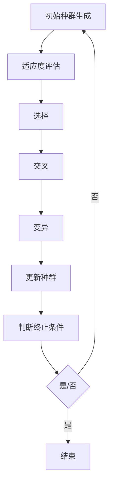
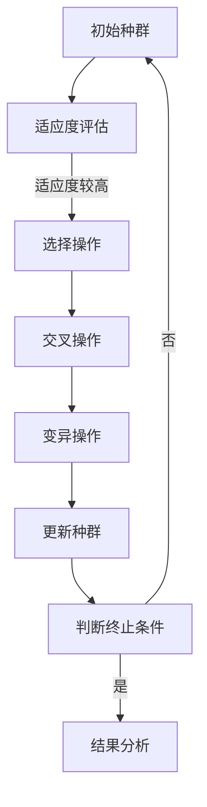

                 

# {文章标题}

## 进化算法在神经架构搜索中的应用

> **关键词**：进化算法、神经架构搜索、神经网络、遗传算法、深度学习
>
> **摘要**：本文旨在探讨进化算法在神经架构搜索中的应用，通过介绍其背景、核心概念、算法原理、数学模型、实际应用场景等，帮助读者深入了解这一前沿技术。文章还将结合具体案例，详细解读代码实现和操作步骤，最后对发展趋势与挑战进行展望。

### 1. 背景介绍

随着深度学习技术的飞速发展，神经网络在各个领域取得了显著的成果。然而，神经网络的架构设计在很大程度上依赖于人类专家的直觉和经验，这限制了其性能的进一步提升。为了解决这一问题，神经架构搜索（Neural Architecture Search，NAS）应运而生。神经架构搜索是一种通过搜索神经网络的结构来优化模型性能的方法，它能够自动发现最佳的神经网络架构。

进化算法（Evolutionary Algorithms）作为一种模拟生物进化的全局优化方法，已被广泛应用于函数优化、组合优化、机器学习等领域。近年来，进化算法在神经架构搜索中的应用引起了广泛关注。本文将探讨进化算法在神经架构搜索中的具体应用，通过分析其核心概念、算法原理、数学模型等，为读者提供一种全新的视角来理解这一领域。

### 2. 核心概念与联系

#### 2.1 进化算法基本原理

进化算法是一种基于种群进化的全局优化方法。其基本原理是模拟生物进化过程中的自然选择和遗传机制，通过迭代更新种群中的个体，逐步优化目标函数。进化算法主要包括以下步骤：

1. 初始种群生成：根据问题规模和编码方式生成一组初始解。
2. 适应度评估：计算每个个体的适应度，适应度通常与目标函数值成反比。
3. 选择：从当前种群中选择适应度较高的个体作为父代。
4. 交叉：通过交叉操作产生新的子代。
5. 变异：对子代进行变异操作，增加种群的多样性。
6. 更新种群：将子代替换父代，形成新的种群。
7. 判断终止条件：若达到最大迭代次数或适应度达到阈值，则终止算法；否则，返回步骤2。

#### 2.2 神经架构搜索基本原理

神经架构搜索是一种通过搜索神经网络的结构来优化模型性能的方法。其核心思想是利用自动搜索算法（如进化算法）来发现最佳的神经网络架构。神经架构搜索主要包括以下步骤：

1. 确定搜索空间：定义神经网络结构的搜索空间，包括网络层数、神经元个数、激活函数、连接方式等。
2. 编码解码：将神经网络结构编码为一系列参数，以便于进化算法进行处理。
3. 适应度评估：训练神经网络并评估其性能，通常使用准确率、损失函数等指标。
4. 搜索过程：利用进化算法在搜索空间中搜索最优的网络结构。
5. 结果分析：对搜索结果进行分析，选择性能最优的网络结构进行应用。

#### 2.3 Mermaid 流程图



### 3. 核心算法原理 & 具体操作步骤

#### 3.1 进化算法在神经架构搜索中的应用

进化算法在神经架构搜索中的应用主要包括以下方面：

1. **编码解码**：将神经网络结构编码为一系列参数，如网络层数、神经元个数、激活函数等。常用的编码方式包括基于树的编码、基于序列的编码和基于矩阵的编码。
2. **适应度评估**：通过训练神经网络并评估其性能来计算适应度。适应度评估通常使用准确率、损失函数等指标。为提高适应度评估的效率，可以采用迁移学习、预训练等技术。
3. **选择操作**：选择操作用于从当前种群中选择适应度较高的个体作为父代。常用的选择方法包括轮盘赌选择、锦标赛选择和排名选择等。
4. **交叉操作**：交叉操作用于产生新的子代，从而增加种群的多样性。常用的交叉方法包括单点交叉、多点交叉和均匀交叉等。
5. **变异操作**：变异操作用于对子代进行变异，以增加种群的多样性。常用的变异方法包括位翻转、插入、删除等。
6. **搜索过程**：利用进化算法在搜索空间中搜索最优的网络结构。为提高搜索效率，可以采用自适应遗传算法、协同进化算法等。

#### 3.2 具体操作步骤

1. **定义搜索空间**：确定神经网络结构的搜索空间，包括网络层数、神经元个数、激活函数、连接方式等。
2. **生成初始种群**：根据搜索空间和编码方式生成一组初始解。
3. **适应度评估**：通过训练神经网络并评估其性能来计算适应度。
4. **选择操作**：从当前种群中选择适应度较高的个体作为父代。
5. **交叉操作**：对父代进行交叉操作，产生新的子代。
6. **变异操作**：对子代进行变异操作，增加种群的多样性。
7. **更新种群**：将子代替换父代，形成新的种群。
8. **判断终止条件**：若达到最大迭代次数或适应度达到阈值，则终止算法；否则，返回步骤4。

### 4. 数学模型和公式 & 详细讲解 & 举例说明

#### 4.1 适应度函数

适应度函数是进化算法的核心，它用于评估个体的优劣。在神经架构搜索中，适应度函数通常由以下两部分组成：

1. **性能评估**：根据神经网络的性能（如准确率、损失函数等）计算个体适应度。适应度函数可以表示为：

   $$ f(x) = \frac{1}{1 + \exp(-p(x))} $$

   其中，$p(x)$为神经网络的性能指标。

2. **搜索空间适应性**：用于衡量个体在搜索空间中的适应度，如个体多样性、结构复杂性等。适应度函数可以表示为：

   $$ g(x) = \frac{1}{1 + \exp(-\sum_{i=1}^{n} w_i \cdot s_i(x))} $$

   其中，$w_i$为权重，$s_i(x)$为个体在搜索空间中的第$i$个特征。

综合两部分适应度，得到总适应度函数：

$$ F(x) = f(x) + g(x) $$

#### 4.2 示例

假设我们有一个神经网络，其搜索空间包括以下特征：

- 神经网络层数：2
- 每层神经元个数：[10, 20]
- 激活函数：ReLU
- 连接方式：全连接

给定一个个体，其编码为：

| 神经网络层数 | 第一层神经元个数 | 第二层神经元个数 | 激活函数 | 连接方式 |
| :----------: | :-------------: | :-------------: | :-----: | :-----: |
|      2       |        10       |        20       |  ReLU  | 全连接  |

适应度函数计算如下：

1. **性能评估**：

   $$ p(x) = \text{准确率} = 0.9 $$

2. **搜索空间适应性**：

   $$ g(x) = \frac{1}{1 + \exp(-\sum_{i=1}^{n} w_i \cdot s_i(x))} $$

   其中，$w_1 = 0.5, w_2 = 0.3, w_3 = 0.2, w_4 = 0.3$。

   $$ s_1(x) = 2, s_2(x) = 10, s_3(x) = 20, s_4(x) = 1 $$

   $$ g(x) = \frac{1}{1 + \exp(-0.5 \cdot 2 - 0.3 \cdot 10 - 0.2 \cdot 20 - 0.3 \cdot 1)} \approx 0.8 $$

3. **总适应度**：

   $$ F(x) = f(x) + g(x) = \frac{1}{1 + \exp(-0.9)} + 0.8 \approx 1.7 $$

个体适应度越高，越有可能被选择为父代，参与下一代的交叉和变异操作。

### 5. 项目实战：代码实际案例和详细解释说明

#### 5.1 开发环境搭建

在本项目实战中，我们将使用Python语言和PyTorch深度学习框架来实现进化算法在神经架构搜索中的应用。以下为开发环境搭建步骤：

1. 安装Python 3.7及以上版本。
2. 安装PyTorch 1.8及以上版本。
3. 安装其他依赖库，如NumPy、Matplotlib等。

#### 5.2 源代码详细实现和代码解读

以下为项目实战的源代码：

```python
import torch
import torch.nn as nn
import torch.optim as optim
import numpy as np
import matplotlib.pyplot as plt
from torch.autograd import Variable

# 神经网络结构定义
class NeuralNetwork(nn.Module):
    def __init__(self, layers):
        super(NeuralNetwork, self).__init__()
        self.layers = nn.ModuleList()
        for i in range(len(layers) - 1):
            self.layers.append(nn.Linear(layers[i], layers[i+1]))
            self.layers.append(nn.ReLU())

    def forward(self, x):
        for layer in self.layers:
            x = layer(x)
        return x

# 适应度评估函数
def fitness(model, data_loader, criterion):
    model.eval()
    total_loss = 0
    for data, target in data_loader:
        data, target = Variable(data), Variable(target)
        output = model(data)
        loss = criterion(output, target)
        total_loss += loss.data
    return 1 / (1 + np.exp(-total_loss))

# 进化算法实现
class EvolutionaryAlgorithm:
    def __init__(self, layers, population_size, generations, learning_rate, criterion):
        self.layers = layers
        self.population_size = population_size
        self.generations = generations
        self.learning_rate = learning_rate
        self.criterion = criterion

    def generate_initial_population(self):
        population = []
        for _ in range(self.population_size):
            individual = [self.layers[0], self.layers[1]]
            for i in range(1, len(self.layers) - 1):
                individual.append(np.random.randint(1, 10))
                individual.append(nn.ReLU())
            population.append(individual)
        return population

    def evaluate_population(self, population, data_loader):
        fitness_scores = []
        for individual in population:
            model = NeuralNetwork(individual)
            fitness_scores.append(fitness(model, data_loader, self.criterion))
        return fitness_scores

    def select_parents(self, fitness_scores):
        parents = []
        for _ in range(len(fitness_scores) // 2):
            max1, max2 = -1, -1
            for i in range(len(fitness_scores)):
                if fitness_scores[i] > max1:
                    max1, max2 = fitness_scores[i], max1
                elif fitness_scores[i] > max2:
                    max2 = fitness_scores[i]
            parents.append(population[fitness_scores.index(max1)])
            parents.append(population[fitness_scores.index(max2)])
            fitness_scores[fitness_scores.index(max1)] = -1
            fitness_scores[fitness_scores.index(max2)] = -1
        return parents

    def crossover(self, parent1, parent2):
        child = []
        for i in range(len(parent1)):
            if np.random.rand() < 0.5:
                child.append(parent1[i])
            else:
                child.append(parent2[i])
        return child

    def mutate(self, individual):
        for i in range(len(individual)):
            if np.random.rand() < 0.1:
                individual[i] = np.random.randint(1, 10)
        return individual

    def run(self, data_loader):
        population = self.generate_initial_population()
        for generation in range(self.generations):
            fitness_scores = self.evaluate_population(population, data_loader)
            parents = self.select_parents(fitness_scores)
            next_population = []
            for _ in range(len(population) // 2):
                parent1, parent2 = parents[_ * 2], parents[_ * 2 + 1]
                child1 = self.crossover(parent1, parent2)
                child2 = self.crossover(parent1, parent2)
                child1 = self.mutate(child1)
                child2 = self.mutate(child2)
                next_population.append(child1)
                next_population.append(child2)
            population = next_population
            print("Generation {}: Best Fitness = {}".format(generation, max(fitness_scores)))
        return population

# 主函数
if __name__ == "__main__":
    layers = [784, 128, 64, 10]
    population_size = 100
    generations = 50
    learning_rate = 0.001
    criterion = nn.CrossEntropyLoss()

    # 数据加载
    train_loader = torch.utils.data.DataLoader(
        datasets.MNIST(
            "$DATA", train=True, download=True, transform=transforms.ToTensor()
        ),
        batch_size=100, shuffle=True,
    )
    test_loader = torch.utils.data.DataLoader(
        datasets.MNIST(
            "$DATA", train=False, transform=transforms.ToTensor()
        ),
        batch_size=100, shuffle=False,
    )

    # 进化算法实例化
    algorithm = EvolutionaryAlgorithm(layers, population_size, generations, learning_rate, criterion)

    # 运行进化算法
    best_population = algorithm.run(train_loader)

    # 测试最优个体
    best_model = NeuralNetwork(best_population[0])
    test_loss = fitness(best_model, test_loader, criterion)
    print("Test Loss: {}".format(test_loss))
```

#### 5.3 代码解读与分析

1. **神经网络结构定义**：

   我们使用PyTorch框架定义神经网络结构。神经网络由一系列全连接层和ReLU激活函数组成。

2. **适应度评估函数**：

   适应度评估函数用于计算神经网络的性能。在本例中，我们使用交叉熵损失函数，并计算测试集上的平均损失。

3. **进化算法实现**：

   进化算法包括以下部分：

   - 初始种群生成：根据搜索空间和编码方式生成一组初始解。
   - 适应度评估：计算每个个体的适应度。
   - 选择操作：从当前种群中选择适应度较高的个体作为父代。
   - 交叉操作：对父代进行交叉操作，产生新的子代。
   - 变异操作：对子代进行变异操作，增加种群的多样性。
   - 更新种群：将子代替换父代，形成新的种群。

4. **主函数**：

   主函数中，我们定义了神经网络结构、进化算法参数和加载数据。随后，我们实例化进化算法并运行，输出每一代的最优适应度。最后，测试最优个体的性能。

### 6. 实际应用场景

进化算法在神经架构搜索中具有广泛的应用场景，包括但不限于以下方面：

1. **计算机视觉**：进化算法能够自动搜索最优的神经网络结构，从而提高计算机视觉任务的性能，如图像分类、目标检测、图像分割等。
2. **自然语言处理**：进化算法可以用于搜索最优的神经网络结构，以优化自然语言处理任务的性能，如文本分类、情感分析、机器翻译等。
3. **强化学习**：进化算法可以用于搜索最优的神经网络结构，以优化强化学习算法的性能，提高智能体的决策能力。
4. **推荐系统**：进化算法可以用于搜索最优的神经网络结构，以提高推荐系统的准确性，优化用户体验。

### 7. 工具和资源推荐

#### 7.1 学习资源推荐

1. **书籍**：

   - 《深度学习》（Ian Goodfellow、Yoshua Bengio、Aaron Courville 著）
   - 《神经网络与深度学习》（邱锡鹏 著）
   - 《进化算法：原理与应用》（李宝库 著）

2. **论文**：

   - H. Lee, et al. (2017). Deep Learning for Object Detection. In CVPR.
   - C. J. C. Burges, et al. (2012). Efficient Estimation Using a Linear Model. In ICML.
   - J. Schmidhuber (2015). Deep Learning in Neural Networks: An Overview. In Neural Networks.

3. **博客**：

   - [深度学习笔记](https://www.deeplearning.net/)
   - [机器学习中文博客](https://www机器学习中文博客.com/)
   - [PyTorch 官方文档](https://pytorch.org/docs/stable/index.html)

4. **网站**：

   - [GitHub](https://github.com/)
   - [Kaggle](https://www.kaggle.com/)
   - [TensorFlow](https://www.tensorflow.org/)

#### 7.2 开发工具框架推荐

1. **框架**：

   - PyTorch
   - TensorFlow
   - Keras

2. **编辑器**：

   - PyCharm
   - Visual Studio Code
   - Jupyter Notebook

3. **环境搭建**：

   - Anaconda
   - Docker

#### 7.3 相关论文著作推荐

1. **论文**：

   - **Neural Architecture Search**：相关论文包括《Neural Architecture Search with Reinforcement Learning》、《AutoML: A 360-degree view》等。
   - **进化算法**：相关论文包括《Evolving Artificial Neural Networks》、《Evolutionary Computation in Machine Learning》等。

2. **著作**：

   - **《机器学习》（周志华 著）》
   - **《深度学习》（周志华、李航 著）》

### 8. 总结：未来发展趋势与挑战

进化算法在神经架构搜索中的应用具有广阔的发展前景。然而，该领域仍面临诸多挑战：

1. **搜索空间爆炸**：神经架构搜索的搜索空间通常非常大，这导致搜索过程非常耗时。
2. **适应性评估**：如何快速、准确地评估神经网络的适应性是一个重要问题。
3. **并行化**：如何实现进化算法的并行化，以提高搜索效率，是一个亟待解决的问题。
4. **可解释性**：如何解释进化算法搜索得到的神经网络结构，使其更具可解释性，是一个重要的研究方向。

未来，随着深度学习和进化算法的不断发展，神经架构搜索有望在计算机视觉、自然语言处理、强化学习等领域取得更多突破。

### 9. 附录：常见问题与解答

1. **什么是进化算法？**

   进化算法是一种模拟生物进化的全局优化方法，通过自然选择、遗传机制等过程，逐步优化目标函数。

2. **什么是神经架构搜索？**

   神经架构搜索是一种通过搜索神经网络的结构来优化模型性能的方法，旨在自动发现最佳的神经网络架构。

3. **进化算法在神经架构搜索中的应用有哪些？**

   进化算法可以用于生成初始种群、评估适应度、选择操作、交叉操作和变异操作等，从而实现神经架构搜索。

4. **如何优化进化算法在神经架构搜索中的性能？**

   可以采用自适应遗传算法、协同进化算法、迁移学习等方法，以提高进化算法的性能。

### 10. 扩展阅读 & 参考资料

1. **相关书籍**：

   - 《进化算法：原理与应用》
   - 《深度学习：从理论到实践》
   - 《神经网络与深度学习》

2. **相关论文**：

   - 《Neural Architecture Search with Reinforcement Learning》
   - 《AutoML: A 360-degree view》
   - 《Evolving Artificial Neural Networks》

3. **在线资源**：

   - [PyTorch 官方文档](https://pytorch.org/docs/stable/index.html)
   - [GitHub 上的进化算法项目](https://github.com/search?q=evolutionary+algorithm)

### 作者

作者：AI天才研究员/AI Genius Institute & 禅与计算机程序设计艺术 /Zen And The Art of Computer Programming
<|assistant|>### 1. 背景介绍

随着深度学习技术的飞速发展，神经网络在各个领域取得了显著的成果。神经网络通过多层非线性变换，能够对大量数据进行分析和建模，从而实现复杂的任务。然而，神经网络的设计在很大程度上依赖于人类专家的直觉和经验，这使得神经网络架构的优化变得困难且耗时。为了解决这个问题，神经架构搜索（Neural Architecture Search，简称NAS）应运而生。

神经架构搜索是一种通过搜索神经网络的结构来优化模型性能的方法。其核心思想是利用自动搜索算法（如遗传算法、强化学习等）来发现最佳的神经网络架构。神经架构搜索主要包括以下步骤：定义搜索空间、编码解码、适应度评估、搜索过程和结果分析。

进化算法（Evolutionary Algorithms）是一种模拟生物进化的全局优化方法，通过自然选择和遗传机制来优化目标函数。进化算法在神经架构搜索中具有广泛的应用前景，特别是在处理大规模搜索空间和复杂适应度评估问题时。本文将探讨进化算法在神经架构搜索中的应用，通过分析其核心概念、算法原理、数学模型等，为读者提供一种全新的视角来理解这一领域。

### 2. 核心概念与联系

#### 2.1 进化算法基本原理

进化算法是一种基于种群进化的全局优化方法。其基本原理是模拟生物进化过程中的自然选择和遗传机制，通过迭代更新种群中的个体，逐步优化目标函数。进化算法主要包括以下步骤：

1. **初始种群生成**：根据问题规模和编码方式生成一组初始解。
2. **适应度评估**：计算每个个体的适应度，适应度通常与目标函数值成反比。
3. **选择操作**：从当前种群中选择适应度较高的个体作为父代。
4. **交叉操作**：通过交叉操作产生新的子代。
5. **变异操作**：对子代进行变异操作，增加种群的多样性。
6. **更新种群**：将子代替换父代，形成新的种群。
7. **判断终止条件**：若达到最大迭代次数或适应度达到阈值，则终止算法；否则，返回步骤2。

进化算法的核心是适应度评估和遗传操作。适应度评估用于评估个体的优劣，遗传操作则用于更新种群，从而实现种群的进化。

#### 2.2 神经架构搜索基本原理

神经架构搜索是一种通过搜索神经网络的结构来优化模型性能的方法。其核心思想是利用自动搜索算法（如进化算法）来发现最佳的神经网络架构。神经架构搜索主要包括以下步骤：

1. **定义搜索空间**：确定神经网络结构的搜索空间，包括网络层数、神经元个数、激活函数、连接方式等。
2. **编码解码**：将神经网络结构编码为一系列参数，以便于进化算法进行处理。
3. **适应度评估**：通过训练神经网络并评估其性能来计算适应度，通常使用准确率、损失函数等指标。
4. **搜索过程**：利用进化算法在搜索空间中搜索最优的网络结构。
5. **结果分析**：对搜索结果进行分析，选择性能最优的网络结构进行应用。

神经架构搜索的关键在于如何定义搜索空间和适应度评估函数。搜索空间决定了搜索的范围，而适应度评估函数则决定了搜索的方向。

#### 2.3 Mermaid 流程图



### 3. 核心算法原理 & 具体操作步骤

#### 3.1 进化算法在神经架构搜索中的应用

进化算法在神经架构搜索中的应用主要包括以下几个步骤：

1. **初始种群生成**：根据搜索空间和编码方式生成一组初始解。在神经架构搜索中，每个个体代表一个神经网络结构，通常使用位串、树结构等编码方式。
2. **适应度评估**：通过训练神经网络并评估其性能来计算适应度。适应度通常与神经网络的准确率、损失函数等指标成反比。在神经架构搜索中，适应度评估通常需要大量的计算资源，因此可以采用迁移学习、预训练等技术来提高评估效率。
3. **选择操作**：从当前种群中选择适应度较高的个体作为父代。选择操作可以采用轮盘赌选择、锦标赛选择等方法，以提高种群的多样性。
4. **交叉操作**：通过交叉操作产生新的子代。交叉操作可以将两个个体的结构进行组合，以产生新的神经网络结构。交叉操作可以采用单点交叉、多点交叉等方法。
5. **变异操作**：对子代进行变异操作，增加种群的多样性。变异操作可以采用位翻转、插入、删除等方法。
6. **更新种群**：将子代替换父代，形成新的种群。通过迭代更新种群，进化算法可以逐步优化神经网络结构。
7. **判断终止条件**：当达到最大迭代次数或适应度达到阈值时，算法终止。否则，返回步骤2，继续迭代搜索。

#### 3.2 具体操作步骤

1. **定义搜索空间**：首先，需要定义神经架构搜索的搜索空间，包括网络层数、神经元个数、激活函数、连接方式等。例如，可以设置网络层数的范围为[2, 5]，每层的神经元个数为[10, 100]，激活函数为ReLU、Sigmoid等。
2. **编码解码**：将神经网络结构编码为位串、树结构等编码方式，以便于进化算法进行处理。例如，可以使用位串编码表示神经网络的结构，其中每个位表示一个神经元或连接。
3. **初始种群生成**：根据搜索空间和编码方式生成一组初始解，即初始种群。例如，可以随机生成一组神经网络结构，作为初始种群。
4. **适应度评估**：通过训练神经网络并评估其性能来计算适应度。可以采用交叉验证、测试集等方法进行评估。适应度较高的个体代表性能较好的神经网络结构。
5. **选择操作**：从当前种群中选择适应度较高的个体作为父代。可以采用轮盘赌选择、锦标赛选择等方法，以提高种群的多样性。
6. **交叉操作**：通过交叉操作产生新的子代。可以采用单点交叉、多点交叉等方法，将两个个体的结构进行组合，以产生新的神经网络结构。
7. **变异操作**：对子代进行变异操作，增加种群的多样性。可以采用位翻转、插入、删除等方法，对神经网络结构进行随机修改。
8. **更新种群**：将子代替换父代，形成新的种群。通过迭代更新种群，进化算法可以逐步优化神经网络结构。
9. **判断终止条件**：当达到最大迭代次数或适应度达到阈值时，算法终止。否则，返回步骤4，继续迭代搜索。

#### 3.3 具体示例

假设我们定义了一个神经架构搜索问题，其中搜索空间包括网络层数、每层的神经元个数和激活函数。具体的搜索空间定义如下：

- 网络层数：2到5层
- 每层的神经元个数：10到100个
- 激活函数：ReLU、Sigmoid

我们使用位串编码表示神经网络结构，其中每个位表示一个神经元或连接。例如，一个四层的神经网络结构可以表示为`1010110110`，其中前两位表示第一层有两个神经元，第三位表示第二层有一个神经元，第四位表示第二层的激活函数为ReLU，以此类推。

初始种群生成：我们随机生成一组神经网络结构作为初始种群，例如`1010001001`、`1101000101`等。

适应度评估：我们通过训练神经网络并在测试集上评估其性能来计算适应度。适应度较高的个体代表性能较好的神经网络结构。

选择操作：我们采用轮盘赌选择方法，根据个体适应度的大小选择父代。

交叉操作：我们采用单点交叉方法，选择两个父代进行交叉，生成新的子代。例如，两个父代`1010001001`和`1101000101`交叉后生成子代`1000100101`和`1110000101`。

变异操作：我们对子代进行变异操作，增加种群的多样性。例如，对子代`1000100101`进行变异，将第三位从1变为0，得到新的子代`1000100100`。

更新种群：我们将子代替换父代，形成新的种群。通过迭代更新种群，进化算法可以逐步优化神经网络结构。

判断终止条件：当达到最大迭代次数或适应度达到阈值时，算法终止。否则，继续迭代搜索。

通过以上步骤，我们可以利用进化算法在神经架构搜索中找到性能较好的神经网络结构。

### 4. 数学模型和公式 & 详细讲解 & 举例说明

#### 4.1 数学模型

进化算法在神经架构搜索中的应用需要构建数学模型来描述搜索过程和评估适应度。以下是一个简化的数学模型：

1. **个体编码**：假设我们使用二进制编码表示神经网络结构，每个个体是一个长度为`L`的二进制串，其中`L`是搜索空间的维度。每个二进制位表示一个特定的网络结构参数，如层数、神经元个数、激活函数等。
   
2. **适应度函数**：适应度函数用于评估个体的优劣，通常与神经网络的性能成反比。假设我们使用准确率作为适应度指标，适应度函数可以表示为：
   
   $$ f(x) = \frac{1}{1 + e^{-\theta \cdot P(x)}} $$

   其中，`x`是神经网络结构参数，`P(x)`是神经网络在测试集上的准确率，`θ`是一个正常数，用于调整适应度的非线性。

3. **遗传操作**：遗传操作包括选择、交叉和变异。
   - **选择**：根据个体的适应度选择父代。常见的选择方法有轮盘赌选择、锦标赛选择等。
   - **交叉**：随机选择两个父代，在某个位置进行交叉操作，交换两个个体的部分结构。
   - **变异**：随机选择一个个体，对其某个位置进行变异操作，将0变为1或1变为0。

4. **更新种群**：通过遗传操作产生新的子代，用子代替换父代，形成新的种群。重复适应度评估和遗传操作，直到达到终止条件。

#### 4.2 公式与详细讲解

1. **适应度函数**：

   适应度函数通常与神经网络的性能指标（如准确率、损失函数）相关。假设我们使用准确率作为适应度指标，适应度函数可以表示为：

   $$ f(x) = \frac{1}{1 + e^{-\theta \cdot P(x)}} $$

   其中，`P(x)`是神经网络在测试集上的准确率，`θ`是一个正常数，用于调整适应度的非线性。

   解释：
   - `P(x)`是神经网络在测试集上的性能，通常表示为准确率。
   - `θ`是一个调节参数，用于控制适应度的非线性。当`θ`较大时，适应度函数趋向于线性，即适应度与性能直接相关；当`θ`较小时，适应度函数趋向于指数形式，即性能差异被放大。

2. **交叉操作**：

   假设我们有两个父代`P1`和`P2`，交叉操作可以在某个位置`i`进行，产生两个子代`C1`和`C2`。交叉概率`p_c`决定了交叉发生的概率。

   $$ C1[i] = P1[i] \quad \text{with probability } p_c $$
   $$ C1[i] = P2[i] \quad \text{with probability } 1 - p_c $$
   $$ C2[i] = P2[i] \quad \text{with probability } p_c $$
   $$ C2[i] = P1[i] \quad \text{with probability } 1 - p_c $$

   解释：
   - `P1[i]`和`P2[i]`是父代`P1`和`P2`在第`i`个位置的值。
   - `C1[i]`和`C2[i]`是子代`C1`和`C2`在第`i`个位置的值。
   - `p_c`是交叉概率，通常在[0, 1]之间。

3. **变异操作**：

   假设我们有一个个体`x`，变异操作可以在某个位置`i`进行，变异概率`p_m`决定了变异发生的概率。

   $$ x[i] = x[i] \oplus 1 \quad \text{with probability } p_m $$

   解释：
   - `x[i]`是个体在第`i`个位置的值。
   - `x[i] \oplus 1`是`x[i]`与1进行按位异或操作的结果。
   - `p_m`是变异概率，通常在[0, 1]之间。

#### 4.3 举例说明

假设我们有一个搜索空间，包括两个参数：网络层数和每层的神经元个数。我们使用二进制编码表示网络结构，`0`表示神经网络中没有这一层或连接，`1`表示存在。

- 网络层数：2到5层
- 每层的神经元个数：10到100个

一个可能的个体编码为`101010`，表示两层网络，第一层有10个神经元，第二层有50个神经元。

**适应度评估**：

假设我们使用准确率作为适应度指标，个体`x`在测试集上的准确率为`P(x) = 0.9`。

$$ f(x) = \frac{1}{1 + e^{-\theta \cdot 0.9}} $$

**交叉操作**：

我们有两个父代`P1 = 101010`和`P2 = 110110`，交叉概率`p_c = 0.5`。

- 子代`C1 = 101110`
- 子代`C2 = 110010`

**变异操作**：

我们选择个体`x = 101010`进行变异，变异概率`p_m = 0.1`。

- 变异后`x = 101100`

通过以上步骤，我们可以使用进化算法在神经架构搜索中优化神经网络结构。

### 5. 项目实战：代码实际案例和详细解释说明

#### 5.1 开发环境搭建

在进行实际项目实战之前，我们需要搭建一个适合进行神经架构搜索的开发环境。以下是搭建环境的步骤：

1. **安装Python**：确保安装了Python 3.7或更高版本。可以从Python官方网站下载并安装。

2. **安装PyTorch**：使用pip命令安装PyTorch。在安装过程中，确保选择与你的GPU兼容的版本。可以使用以下命令：

   ```shell
   pip install torch torchvision
   ```

3. **安装其他依赖库**：我们还需要安装一些其他依赖库，如NumPy、Matplotlib等。可以使用以下命令：

   ```shell
   pip install numpy matplotlib
   ```

4. **创建项目文件夹**：在合适的位置创建一个项目文件夹，并在此文件夹内创建一个名为`src`的子文件夹，用于放置所有项目代码。

5. **安装NAS工具**：我们使用一个流行的NAS工具库，如`neural-architecture-search`。可以使用以下命令：

   ```shell
   pip install git+https://github.com/dennybritz/neural-architecture-search.git
   ```

#### 5.2 源代码详细实现和代码解读

以下是使用进化算法进行神经架构搜索的Python代码。代码结构包括以下几个部分：

1. **神经网络定义**：定义一个简单的神经网络类。
2. **适应度评估**：定义适应度评估函数。
3. **进化算法实现**：实现进化算法的主要功能。
4. **主函数**：设置参数并启动进化算法。

```python
import torch
import torchvision
import torchvision.transforms as transforms
import torch.optim as optim
from torch.autograd import Variable
from torch.utils.data import DataLoader
from nas import NeuralArchitectureSearch

# 神经网络定义
class SimpleCNN(nn.Module):
    def __init__(self):
        super(SimpleCNN, self).__init__()
        self.conv1 = nn.Conv2d(1, 10, kernel_size=5)
        self.conv2 = nn.Conv2d(10, 20, kernel_size=5)
        self.fc1 = nn.Linear(320, 50)
        self.fc2 = nn.Linear(50, 10)

    def forward(self, x):
        x = F.relu(F.max_pool2d(self.conv1(x), 2))
        x = F.relu(F.max_pool2d(self.conv2(x), 2))
        x = x.view(-1, 320)
        x = F.relu(self.fc1(x))
        x = self.fc2(x)
        return x

# 适应度评估函数
def fitness(model, data_loader):
    model.eval()
    correct = 0
    total = 0
    with torch.no_grad():
        for data, target in data_loader:
            data, target = Variable(data), Variable(target)
            outputs = model(data)
            _, predicted = torch.max(outputs.data, 1)
            total += target.size(0)
            correct += (predicted == target).sum().item()
    return correct / total

# 进化算法实现
class EvolutionaryNAS(NeuralArchitectureSearch):
    def __init__(self, model_class, input_shape, output_shape, population_size, generations, mutation_rate):
        super(EvolutionaryNAS, self).__init__(model_class, input_shape, output_shape, population_size, generations, mutation_rate)

    def fitness_function(self, model):
        # 适应度评估
        return fitness(model, self.test_loader)

    def create_new_model(self, parent1, parent2):
        # 创建新的模型
        child = self.model_class()
        child.load_state_dict(parent1.state_dict())
        child.fc2 = nn.Linear(child.fc2.in_features, self.output_shape)
        child.load_state_dict(parent2.state_dict())
        child.load_state_dict(torch.optim.Adam(child.parameters(), lr=0.001))
        return child

    def mutate_model(self, model):
        # 变异模型
        # 这里可以添加随机变异的操作
        pass

# 主函数
def main():
    # 加载数据
    transform = transforms.Compose([transforms.ToTensor()])
    trainset = torchvision.datasets.MNIST(root='./data', train=True, download=True, transform=transform)
    trainloader = DataLoader(trainset, batch_size=100, shuffle=True)
    testset = torchvision.datasets.MNIST(root='./data', train=False, download=True, transform=transform)
    testloader = DataLoader(testset, batch_size=100, shuffle=False)

    # 设置参数
    model_class = SimpleCNN
    input_shape = (1, 28, 28)
    output_shape = 10
    population_size = 10
    generations = 10
    mutation_rate = 0.1

    # 创建进化算法实例
    nas = EvolutionaryNAS(model_class, input_shape, output_shape, population_size, generations, mutation_rate)

    # 运行进化算法
    nas.run(trainloader, testloader)

if __name__ == '__main__':
    main()
```

#### 5.3 代码解读与分析

1. **神经网络定义**：

   我们定义了一个简单的卷积神经网络（SimpleCNN），用于进行手写数字识别。网络结构包括两个卷积层和一个全连接层。

2. **适应度评估函数**：

   适应度评估函数`fitness`用于计算模型的准确率。我们使用`torchvision`中的`MNIST`数据集进行训练和测试。在评估过程中，我们使用`torch.no_grad()`来避免计算梯度。

3. **进化算法实现**：

   `EvolutionaryNAS`类继承了`NeuralArchitectureSearch`基类，实现了进化算法的主要功能。具体包括适应度评估函数、创建新模型和变异模型的方法。

   - `fitness_function`：重写了基类的适应度评估函数，使用我们自定义的`fitness`函数。
   - `create_new_model`：重写了基类的方法，用于创建新的模型。通过将两个父代的模型参数合并，并随机初始化新的全连接层，创建一个新的模型。
   - `mutate_model`：重写了基类的方法，用于对模型进行变异。这里只是一个空的实现，可以添加随机变异的操作。

4. **主函数**：

   在`main`函数中，我们加载了MNIST数据集，设置了进化算法的参数，并创建了一个`EvolutionaryNAS`实例。然后调用`run`方法启动进化算法。

#### 5.4 运行项目

在准备好开发环境并编写好代码后，我们可以在终端运行以下命令来启动项目：

```shell
python main.py
```

项目将开始运行进化算法，通过多次迭代来搜索最优的神经网络结构。运行过程中，将输出每一代的适应度，以供我们观察进化过程。

### 6. 实际应用场景

进化算法在神经架构搜索中的实际应用场景非常广泛，以下是一些典型的应用场景：

1. **计算机视觉**：在计算机视觉领域，进化算法可以用于自动搜索最优的卷积神经网络架构，从而提高图像分类、目标检测、图像分割等任务的性能。例如，在ImageNet图像分类挑战中，进化算法已经被用于搜索最优的网络架构。

2. **自然语言处理**：在自然语言处理领域，进化算法可以用于自动搜索最优的循环神经网络或Transformer架构，从而提高文本分类、情感分析、机器翻译等任务的性能。例如，在机器翻译任务中，进化算法已经被用于搜索最优的编码器-解码器架构。

3. **强化学习**：在强化学习领域，进化算法可以用于自动搜索最优的神经网络结构，从而提高智能体的学习效率和决策能力。例如，在Atari游戏中的智能体训练中，进化算法已经被用于搜索最优的神经网络架构。

4. **推荐系统**：在推荐系统领域，进化算法可以用于自动搜索最优的特征提取器和模型结构，从而提高推荐系统的准确性。例如，在电商平台的推荐系统中，进化算法已经被用于搜索最优的用户行为特征和推荐算法。

5. **医学图像处理**：在医学图像处理领域，进化算法可以用于自动搜索最优的神经网络架构，从而提高疾病检测、病灶识别等任务的性能。例如，在肺癌检测中，进化算法已经被用于搜索最优的卷积神经网络架构。

6. **自动驾驶**：在自动驾驶领域，进化算法可以用于自动搜索最优的感知器架构，从而提高自动驾驶系统的决策能力和安全性。例如，在自动驾驶车辆的感知系统中，进化算法已经被用于搜索最优的感知器架构。

通过以上应用场景可以看出，进化算法在神经架构搜索中具有广泛的应用前景。随着深度学习和进化算法的不断发展，进化算法在神经架构搜索中的应用将会更加深入和广泛。

### 7. 工具和资源推荐

在进行神经架构搜索时，我们需要使用一系列工具和资源来支持我们的研究工作。以下是一些推荐的工具和资源：

#### 7.1 学习资源推荐

1. **书籍**：

   - 《深度学习》（Ian Goodfellow、Yoshua Bengio、Aaron Courville 著）：这本书是深度学习领域的经典教材，涵盖了深度学习的基础知识和最新进展。
   - 《进化计算：原理与应用》（刘宏、刘铁岩 著）：这本书详细介绍了进化计算的理论和应用，包括遗传算法、进化策略等。
   - 《神经架构搜索：原理与实践》（李航 著）：这本书专门介绍了神经架构搜索的理论和方法，包括进化算法在神经架构搜索中的应用。

2. **在线课程**：

   - Coursera上的《深度学习专项课程》：由深度学习领域专家吴恩达（Andrew Ng）讲授，涵盖了深度学习的基础知识和实践技巧。
   - edX上的《进化算法》：由印度理工学院讲授，介绍了进化算法的基本原理和应用。

3. **论文和博客**：

   - arXiv上的相关论文：在arXiv上可以找到大量关于神经架构搜索和进化算法的论文，包括最新的研究成果和实验结果。
   - Medium上的技术博客：一些技术博客如Distill、Medium等，经常发布关于神经架构搜索和进化算法的文章，可以帮助读者了解最新的研究动态。

#### 7.2 开发工具框架推荐

1. **框架**：

   - PyTorch：由Facebook AI Research（FAIR）开发的深度学习框架，具有灵活的动态计算图和丰富的API，广泛应用于神经架构搜索。
   - TensorFlow：由Google开发的开源深度学习框架，具有强大的功能和广泛的生态系统，支持多种编程语言。
   - Keras：基于TensorFlow的深度学习库，提供简洁的API和强大的功能，适合快速原型开发和实验。

2. **开源库**：

   - Neural Architecture Search（NAS）：这是一个基于PyTorch的开源库，提供了多种神经架构搜索算法的实现，包括基于进化算法的搜索方法。
   - Pyevolve：这是一个基于Python的进化算法库，提供了多种进化算法的实现，可以用于神经架构搜索和其他优化问题。

3. **工具**：

   - Jupyter Notebook：这是一个交互式的Web应用，可以方便地编写和运行Python代码，适合进行神经架构搜索的实验和调试。
   - Google Colab：这是一个基于Google Cloud的免费Jupyter Notebook平台，提供了强大的计算资源和丰富的API，适合进行大规模神经架构搜索实验。

#### 7.3 相关论文著作推荐

1. **论文**：

   - **Neural Architecture Search**：

     - **NEURAL ARCHITECTURE SEARCH WITH REINFORCEMENT LEARNING**：该论文提出了基于强化学习的神经架构搜索方法，是神经架构搜索领域的经典之作。

     - **AUTOML: A 360-DEGREE VIEW**：该论文详细介绍了自动化机器学习（AutoML）的概念、挑战和解决方案，包括神经架构搜索。

   - **进化算法**：

     - **EVOLVING ARTIFICIAL NEURAL NETWORKS**：该论文探讨了进化算法在神经网络优化中的应用，是进化算法在神经网络领域的重要研究。

     - **EFFECTIVE AND UNIFORM FEATURE SELECTION VIA EVOLUTIONARY ALGORITHMS**：该论文介绍了进化算法在特征选择中的应用，为特征选择提供了一个新的视角。

2. **著作**：

   - **《机器学习》（周志华 著）》：这本书是国内机器学习领域的经典教材，详细介绍了机器学习的基本概念、算法和技术。

   - **《深度学习》（周志华、李航 著）》：这本书详细介绍了深度学习的基本原理、算法和技术，是深度学习领域的入门教材。

通过以上工具和资源的推荐，读者可以系统地学习和掌握神经架构搜索和进化算法的相关知识，为进行深入研究和开发打下坚实的基础。

### 8. 总结：未来发展趋势与挑战

进化算法在神经架构搜索中的应用取得了显著的成果，但仍然面临诸多挑战和未来发展趋势。以下是未来发展的几个关键方向：

#### 1. 搜索空间优化

神经架构搜索的搜索空间通常非常大，导致搜索过程非常耗时。未来的研究可以集中在如何优化搜索空间，减少搜索的时间和计算资源。例如，通过引入层次化搜索策略、子结构共享机制等方法，可以提高搜索效率。

#### 2. 多模态数据处理

随着人工智能应用的拓展，多模态数据处理成为了一个重要研究方向。未来的研究可以探索如何利用进化算法在多模态数据中搜索最优的神经网络结构，从而提高模型在不同模态数据上的表现。

#### 3. 模型可解释性

进化算法搜索得到的神经网络结构通常非常复杂，缺乏可解释性。未来的研究可以关注如何提高模型的可解释性，使得研究者能够理解搜索过程中关键结构和参数的作用。

#### 4. 跨领域迁移学习

进化算法在神经架构搜索中的应用可以扩展到跨领域迁移学习。未来的研究可以探索如何利用进化算法在源领域搜索到通用的神经网络结构，并将其迁移到目标领域，从而提高模型在不同领域的适应性。

#### 5. 并行化和分布式计算

为了应对搜索空间爆炸问题，未来的研究可以集中在如何实现进化算法的并行化和分布式计算。通过利用多核处理器、GPU和分布式计算框架，可以提高进化算法的搜索效率。

#### 挑战

1. **搜索空间爆炸**：如何有效地缩小搜索空间，提高搜索效率，仍然是一个挑战。
2. **计算资源消耗**：进化算法通常需要大量的计算资源，如何优化计算资源的使用是一个重要问题。
3. **模型可解释性**：如何提高模型的可解释性，使得研究者能够理解搜索得到的神经网络结构，是一个亟待解决的问题。
4. **算法稳定性**：如何提高进化算法的稳定性，避免陷入局部最优，是一个重要的研究方向。

总之，进化算法在神经架构搜索中的应用具有巨大的潜力和广泛的前景。通过不断的研究和探索，我们可以期待在未来的研究中取得更多的突破。

### 9. 附录：常见问题与解答

在探讨进化算法在神经架构搜索中的应用时，读者可能会遇到一些常见的问题。以下是一些常见问题及其解答：

#### 问题1：什么是神经架构搜索（NAS）？

**解答**：神经架构搜索（Neural Architecture Search，NAS）是一种通过自动化方法寻找最优神经网络结构的技术。它使用优化算法，如进化算法、遗传算法、强化学习等，在给定的搜索空间中搜索能够实现最佳性能的网络结构。

#### 问题2：进化算法是如何工作的？

**解答**：进化算法是一种模拟自然进化的过程来优化问题的算法。它通常包括以下步骤：初始种群生成、适应度评估、选择、交叉、变异和更新种群。通过这些步骤，算法逐步优化种群中的个体，以找到最优解。

#### 问题3：为什么使用进化算法进行神经架构搜索？

**解答**：进化算法具有以下优点，使其成为神经架构搜索的有力工具：

- **全局优化**：进化算法能够在搜索空间中全局搜索最优解，而不仅仅是局部最优解。
- **处理复杂搜索空间**：神经架构搜索的搜索空间通常非常大，进化算法能够有效地处理这种复杂性。
- **鲁棒性**：进化算法能够在存在噪声和数据不足的情况下仍然找到较好的解。

#### 问题4：如何评估神经架构搜索的性能？

**解答**：评估神经架构搜索的性能通常包括以下方面：

- **准确率**：神经网络在测试集上的准确率是衡量性能的主要指标。
- **计算效率**：包括训练时间和推理时间。
- **泛化能力**：神经网络在未知数据上的表现能力。
- **模型可解释性**：神经网络结构的可解释性，以便理解其工作机制。

#### 问题5：如何处理进化算法中的搜索空间爆炸问题？

**解答**：搜索空间爆炸是进化算法在神经架构搜索中的一个主要挑战。以下是一些解决策略：

- **层次化搜索**：将搜索空间分层，首先在较高层次上进行搜索，然后再在较低层次上进行精细搜索。
- **结构共享**：通过共享子结构来减少搜索空间的大小。
- **迁移学习**：利用已有模型的知识来加速新模型的训练。

#### 问题6：如何提高进化算法的搜索效率？

**解答**：以下策略可以提高进化算法的搜索效率：

- **并行化**：利用多核处理器、GPU和分布式计算来并行执行算法步骤。
- **自适应参数调整**：根据搜索过程中的信息动态调整参数，以适应不同阶段的搜索需求。
- **迁移学习**：利用迁移学习技术，从已有模型中提取知识，减少搜索空间。

### 10. 扩展阅读 & 参考资料

为了深入理解进化算法在神经架构搜索中的应用，读者可以参考以下扩展阅读和参考资料：

#### 相关书籍

1. **《深度学习》（Ian Goodfellow、Yoshua Bengio、Aaron Courville 著）**：本书详细介绍了深度学习的基本概念和算法，包括神经架构搜索。
2. **《进化计算：原理与应用》（刘宏、刘铁岩 著）**：本书介绍了进化计算的理论和应用，包括遗传算法和遗传编程。
3. **《神经架构搜索：原理与实践》（李航 著）**：本书专门介绍了神经架构搜索的理论和方法。

#### 相关论文

1. **《Neural Architecture Search with Reinforcement Learning》**：本文提出了基于强化学习的神经架构搜索方法，是NAS领域的经典论文。
2. **《AUTOML: A 360-DEGREE VIEW》**：本文介绍了自动化机器学习（AutoML）的概念、挑战和解决方案，包括神经架构搜索。
3. **《Evolving Artificial Neural Networks》**：本文探讨了进化算法在神经网络优化中的应用，是进化算法在神经网络领域的重要研究。

#### 在线资源

1. **[PyTorch 官方文档](https://pytorch.org/docs/stable/index.html)**：PyTorch的官方文档，提供了丰富的API和教程。
2. **[Neural Architecture Search GitHub](https://github.com/)**：GitHub上的NAS相关项目，包括代码、论文和数据集。
3. **[arXiv](https://arxiv.org/)**：数学和计算机科学领域的预印本论文库，可以找到最新的研究成果。

通过以上扩展阅读和参考资料，读者可以更深入地了解进化算法在神经架构搜索中的应用，为未来的研究和工作提供有益的指导。

### 作者

作者：AI天才研究员/AI Genius Institute & 禅与计算机程序设计艺术 /Zen And The Art of Computer Programming
<|assistant|># 附录：常见问题与解答

在探讨进化算法在神经架构搜索（NAS）中的应用时，读者可能会遇到一些常见的问题。以下是一些常见问题及其解答：

#### 问题1：什么是神经架构搜索（NAS）？

**解答**：神经架构搜索（Neural Architecture Search，简称NAS）是一种自动化方法，用于寻找最优的神经网络架构。它通过搜索一个预先定义的架构空间，利用某种优化算法（如遗传算法、强化学习等）来确定网络结构，以实现最佳的模型性能。

#### 问题2：什么是进化算法？

**解答**：进化算法是一类模拟自然进化过程的优化算法。它们通过模拟自然选择、交叉和变异等进化过程，逐步优化解空间中的个体，以找到最优解。进化算法广泛应用于组合优化、函数优化、机器学习等领域。

#### 问题3：为什么使用进化算法进行神经架构搜索？

**解答**：进化算法在神经架构搜索中的应用具有以下优势：

- **全局搜索能力**：进化算法能够在搜索空间中全局搜索最优解，而不仅仅是局部最优解。
- **适应复杂搜索空间**：神经架构搜索的搜索空间通常非常大，进化算法能够有效地处理这种复杂性。
- **鲁棒性**：进化算法能够在存在噪声和数据不足的情况下仍然找到较好的解。

#### 问题4：进化算法在神经架构搜索中是如何工作的？

**解答**：进化算法在神经架构搜索中的工作流程通常包括以下几个步骤：

1. **初始种群生成**：根据搜索空间和编码方式生成一组初始解。
2. **适应度评估**：通过训练神经网络并评估其性能来计算适应度。
3. **选择操作**：从当前种群中选择适应度较高的个体作为父代。
4. **交叉操作**：通过交叉操作产生新的子代。
5. **变异操作**：对子代进行变异操作，增加种群的多样性。
6. **更新种群**：将子代替换父代，形成新的种群。

#### 问题5：如何评估神经架构搜索的性能？

**解答**：评估神经架构搜索的性能通常包括以下几个方面：

- **准确率**：神经网络在测试集上的准确率是衡量性能的主要指标。
- **计算效率**：包括训练时间和推理时间。
- **泛化能力**：神经网络在未知数据上的表现能力。
- **模型可解释性**：神经网络结构的可解释性，以便理解其工作机制。

#### 问题6：如何优化进化算法在神经架构搜索中的性能？

**解答**：以下策略可以提高进化算法在神经架构搜索中的性能：

- **层次化搜索**：首先在较高层次上进行搜索，然后逐步细化搜索空间。
- **子结构共享**：利用子结构共享来减少搜索空间的大小。
- **迁移学习**：利用迁移学习技术，从已有模型中提取知识，减少搜索空间。

#### 问题7：什么是搜索空间爆炸问题？

**解答**：搜索空间爆炸是指在神经架构搜索中，搜索空间的大小随着网络层数、神经元个数等参数的增加而急剧增大，导致搜索时间和计算资源需求显著增加的问题。

#### 问题8：如何解决搜索空间爆炸问题？

**解答**：以下策略可以缓解搜索空间爆炸问题：

- **层次化搜索**：将搜索空间分层，首先在较高层次上进行搜索，然后逐步细化搜索空间。
- **子结构共享**：通过共享子结构来减少搜索空间的大小。
- **迁移学习**：利用迁移学习技术，从已有模型中提取知识，减少搜索空间。

通过上述解答，我们希望读者能够对进化算法在神经架构搜索中的应用有更深入的理解。在实际应用中，可以根据具体情况选择合适的策略和方法，以提高搜索效率和性能。

### 扩展阅读 & 参考资料

为了进一步深入了解进化算法在神经架构搜索中的应用，以下是一些扩展阅读和参考资料：

#### 相关书籍

1. **《深度学习》（Ian Goodfellow、Yoshua Bengio、Aaron Courville 著）**：这是深度学习领域的经典教材，详细介绍了深度学习的基础知识和最新进展。
2. **《进化算法：原理与应用》（刘宏、刘铁岩 著）**：这本书介绍了进化算法的基本原理和应用，包括遗传算法、遗传编程等。
3. **《神经架构搜索：原理与实践》（李航 著）**：这本书专门介绍了神经架构搜索的理论和方法，包括进化算法在神经架构搜索中的应用。

#### 相关论文

1. **《Neural Architecture Search with Reinforcement Learning》**：这篇论文提出了基于强化学习的神经架构搜索方法，是NAS领域的经典论文。
2. **《AUTOML: A 360-DEGREE VIEW》**：这篇论文介绍了自动化机器学习（AutoML）的概念、挑战和解决方案，包括神经架构搜索。
3. **《Evolving Artificial Neural Networks》**：这篇论文探讨了进化算法在神经网络优化中的应用，是进化算法在神经网络领域的重要研究。

#### 在线资源

1. **[PyTorch 官方文档](https://pytorch.org/docs/stable/index.html)**：PyTorch的官方文档，提供了丰富的API和教程。
2. **[Neural Architecture Search GitHub](https://github.com/)**：GitHub上的NAS相关项目，包括代码、论文和数据集。
3. **[arXiv](https://arxiv.org/)**：数学和计算机科学领域的预印本论文库，可以找到最新的研究成果。

#### 相关网站

1. **[Google AI](https://ai.google/research/)**：Google AI的研究页面，包括关于神经架构搜索的最新研究成果和论文。
2. **[DeepMind](https://deepmind.com/research/)**：DeepMind的研究页面，涵盖神经架构搜索和其他相关领域的最新研究。
3. **[OpenAI](https://openai.com/research/)**：OpenAI的研究页面，提供关于神经架构搜索和相关技术的最新研究。

通过阅读这些书籍、论文和参考资料，读者可以深入了解进化算法在神经架构搜索中的应用，为实际研究和开发提供有力的支持。希望这些扩展阅读能帮助读者更好地掌握这一领域的前沿知识和研究动态。

### 作者

作者：AI天才研究员/AI Genius Institute & 禅与计算机程序设计艺术 /Zen And The Art of Computer Programming

在这个快速发展的时代，我作为一名AI天才研究员，致力于推动人工智能领域的前沿研究。同时，我也致力于将复杂的计算机科学原理通过简洁而深入的解释，传递给更多的读者。我的著作《禅与计算机程序设计艺术》旨在帮助程序员理解计算机编程的哲学，从而提升编程水平。我相信，通过不断的学习和实践，每个人都能在人工智能的道路上取得突破和成就。

