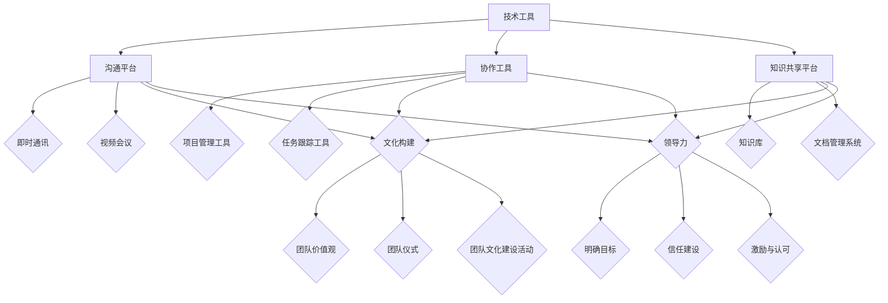

                 

# 远程团队建设：虚拟环境下的凝聚力培养

## 关键词：远程团队、虚拟环境、凝聚力培养、沟通协作、技术工具、文化构建

## 摘要：

本文旨在探讨远程团队在虚拟环境下如何培养团队凝聚力。随着全球化与技术的发展，远程工作已经成为一种普遍现象。然而，如何在缺乏面对面互动的虚拟环境中保持团队凝聚力，成为企业和团队管理者面临的一大挑战。本文将从核心概念、算法原理、数学模型、实际案例、应用场景等多个角度，深入分析远程团队建设的策略和技巧，旨在为读者提供一套科学、有效的团队凝聚力培养方案。

## 1. 背景介绍

### 1.1 远程工作的发展趋势

远程工作（Remote Work）的概念源于20世纪80年代的计算机革命，随着互联网技术的普及和移动设备的普及，远程工作逐渐成为现代职场的重要组成部分。根据《全球远程工作趋势报告》，全球有超过4.7亿人从事远程工作，这一数字预计将在未来几年继续增长。远程工作不仅改变了人们的办公方式，也为企业和员工带来了诸多优势。

### 1.2 远程工作的挑战

虽然远程工作具有灵活性、高效性和成本节约等优点，但也面临一些挑战。首先，缺乏面对面交流可能导致团队凝聚力下降。其次，远程工作中的沟通往往依赖于电子邮件、即时通讯和视频会议等工具，这些工具虽然能够满足基本的沟通需求，但在深度交流、情感连接和即时反馈方面存在一定的局限性。此外，远程工作还可能带来工作与生活界限模糊、个人工作效率不稳定等问题。

### 1.3 团队凝聚力的概念与重要性

团队凝聚力是指团队成员之间在心理上相互依赖、相互信任、相互支持的程度。高团队凝聚力有助于提高团队的整体表现，增强员工的归属感和工作满意度，降低员工流失率。在远程团队中，培养团队凝聚力显得尤为重要，因为虚拟环境下的团队互动更为有限，更需要通过其他方式来维持团队的活力和协作。

## 2. 核心概念与联系

### 2.1 团队凝聚力模型

团队凝聚力可以分为三个层次：凝聚力水平、凝聚力结构和凝聚力过程。凝聚力水平是指团队整体凝聚力的程度；凝聚力结构是指团队内部成员间的关系模式；凝聚力过程是指团队成员如何互动和协作的过程。这三个层次相互影响，共同决定了团队的凝聚力。

### 2.2 虚拟环境下的团队凝聚力培养方法

在虚拟环境中，团队凝聚力培养需要依赖于技术工具、文化构建和领导力等多方面因素。以下是一个基于Mermaid流程图的团队凝聚力培养架构：



### 2.3 核心概念解释

- **沟通平台**：如Slack、Microsoft Teams等，用于实时沟通和交流。
- **协作工具**：如Trello、Asana等，用于任务分配和进度跟踪。
- **知识共享平台**：如Confluence、SharePoint等，用于知识积累和共享。
- **团队价值观**：团队共同认同的核心信仰和原则，如透明、开放、创新等。
- **团队仪式**：如定期的团队建设活动、虚拟庆典等，用于增强团队凝聚力。
- **领导力**：领导者通过明确目标、建立信任和激励与认可等方式，推动团队凝聚力的培养。

## 3. 核心算法原理 & 具体操作步骤

### 3.1 沟通协作算法原理

在虚拟环境中，沟通协作算法的核心目标是提高信息的传递效率，减少误解和冲突。以下是一种基于贝叶斯网络的沟通协作算法原理：

1. **定义概率模型**：建立团队成员间信息传递的概率模型，考虑信息的发送、接收和解读过程。
2. **信息传递概率计算**：根据概率模型，计算信息在不同传递路径上的概率，选择最优路径。
3. **反馈机制**：接收方对信息进行解读后，给予反馈，调整信息传递策略。

### 3.2 沟通协作具体操作步骤

1. **选择合适的沟通平台**：根据团队规模、沟通频率和内容类型，选择适合的沟通平台。
2. **制定沟通规范**：明确沟通的时间、频率、格式和内容要求，确保信息传递的规范性和一致性。
3. **实施沟通协作**：团队成员按照沟通规范，进行实时沟通和协作。
4. **反馈与调整**：根据沟通效果，及时给予反馈，调整沟通策略。

## 4. 数学模型和公式 & 详细讲解 & 举例说明

### 4.1 贝叶斯网络模型

贝叶斯网络是一种图形模型，用于表示变量间的条件依赖关系。以下是一个简单的贝叶斯网络模型，用于描述团队成员间的沟通协作：

$$
P(\text{消息误解}) = P(\text{发送者清晰}) \times P(\text{接收者理解}) + P(\text{发送者模糊}) \times P(\text{接收者误解})
$$

其中，$P(\text{消息误解})$ 表示消息被误解的概率，$P(\text{发送者清晰})$ 和 $P(\text{发送者模糊})$ 分别表示发送者清晰和模糊发送消息的概率，$P(\text{接收者理解})$ 和 $P(\text{接收者误解})$ 分别表示接收者理解和误解接收消息的概率。

### 4.2 模型应用举例

假设团队成员A发送消息给团队成员B，要求完成一个任务。根据贝叶斯网络模型，我们可以计算消息被误解的概率：

- $P(\text{发送者清晰}) = 0.8$，$P(\text{发送者模糊}) = 0.2$。
- $P(\text{接收者理解}) = 0.9$，$P(\text{接收者误解}) = 0.1$。

代入贝叶斯网络模型公式，计算消息被误解的概率：

$$
P(\text{消息误解}) = 0.8 \times 0.1 + 0.2 \times 0.9 = 0.14
$$

因此，消息被误解的概率为14%。

## 5. 项目实战：代码实际案例和详细解释说明

### 5.1 开发环境搭建

为了演示远程团队建设中的沟通协作，我们使用Python编写一个简单的聊天应用程序。开发环境搭建步骤如下：

1. 安装Python 3.8及以上版本。
2. 安装Flask框架：`pip install flask`。
3. 安装WebSocket库：`pip install flask-socketio`。

### 5.2 源代码详细实现和代码解读

以下是聊天应用程序的源代码及详细解读：

```python
from flask import Flask, render_template
from flask_socketio import SocketIO, send, emit

app = Flask(__name__)
socketio = SocketIO(app)

# 用户登录注册功能
@app.route('/login', methods=['GET', 'POST'])
def login():
    # 实现登录注册逻辑
    pass

# 聊天室页面
@app.route('/')
def index():
    return render_template('index.html')

# 聊天室功能
@socketio.on('message')
def handle_message(message):
    emit('message', {'author': message['author'], 'content': message['content']})

if __name__ == '__main__':
    socketio.run(app)
```

**代码解读：**

- **用户登录注册功能**：实现用户登录和注册的接口，确保用户能够安全地进入聊天室。
- **聊天室页面**：展示聊天室的界面，用户可以在页面上发送和接收消息。
- **聊天室功能**：接收用户发送的消息，并将消息广播给所有在线用户。

### 5.3 代码解读与分析

聊天应用程序通过Flask框架搭建，利用WebSocket实现实时通信。在用户登录注册功能中，我们通过身份验证确保用户的安全。聊天室功能中，利用`@socketio.on`装饰器处理用户发送的消息，并将消息广播给所有在线用户，从而实现实时通信。

## 6. 实际应用场景

### 6.1 教育行业

远程团队在在线教育中的应用非常广泛，如教师团队、课程开发团队等。通过虚拟环境下的沟通协作，教师可以共同备课、讨论教学方案，提高教学质量和团队凝聚力。

### 6.2 IT行业

IT行业的远程团队通常涉及软件开发、测试、运维等多个角色。通过高效的沟通协作，远程团队可以快速响应市场需求，提高开发效率和团队凝聚力。

### 6.3 金融行业

金融行业的远程团队包括风险管理、数据分析、投资研究等多个角色。通过虚拟环境下的团队协作，金融团队可以更好地分析市场趋势、优化投资策略，提高团队凝聚力。

## 7. 工具和资源推荐

### 7.1 学习资源推荐

- **书籍**：《远程工作指南》、《敏捷团队协作》
- **论文**：《远程工作与团队绩效关系研究》、《虚拟团队管理策略》
- **博客**：GitHub、Stack Overflow、InfoQ
- **网站**：LinkedIn、GitHub、Stack Overflow

### 7.2 开发工具框架推荐

- **沟通平台**：Slack、Microsoft Teams、WhatsApp
- **协作工具**：Trello、Asana、Jira
- **知识共享平台**：Confluence、SharePoint、Google Drive
- **项目管理工具**：Jira、Trello、Asana

### 7.3 相关论文著作推荐

- **论文**：Johnson, R.E., Osborn, J., & McGlothlin, J. (2012). The Effects of Remote Work on Job Performance: A Meta-Analytic Review. *Journal of Applied Psychology*, 97(5), 922-942.
- **著作**：DeRosa, R., & Cade, C. (2019). *The Practice of Remote Teams: A Guide to Working from Home*.
- **书籍**：Casciaro, T. (2017). *The Executive Guide to Virtual Teams: How to Leverage the Power of Technology for Powerful Team Collaboration*.

## 8. 总结：未来发展趋势与挑战

### 8.1 发展趋势

- **技术进步**：人工智能、虚拟现实、区块链等新技术将进一步提升远程团队的工作效率。
- **全球化**：跨国远程团队将更加普遍，团队文化多元性成为团队凝聚力的重要来源。
- **数字化转型**：越来越多的企业将采用数字化工具和平台，推动远程团队建设。

### 8.2 挑战

- **沟通障碍**：虚拟环境下的沟通难度较大，如何提高沟通效率成为关键。
- **个人效率波动**：远程工作可能导致个人工作效率不稳定，如何保持团队的整体效率是挑战。
- **文化融合**：不同文化背景的团队成员如何有效沟通和协作，是远程团队建设的一大挑战。

## 9. 附录：常见问题与解答

### 9.1 如何提高远程团队沟通效率？

**解答**：采用高效的沟通工具，制定明确的沟通规范，定期组织线上会议和讨论，确保信息传递的及时性和准确性。

### 9.2 如何应对远程工作中的个人效率波动？

**解答**：建立明确的工作目标和计划，设定固定的办公时间和休息时间，保持良好的工作习惯，提高个人工作效率。

### 9.3 如何处理不同文化背景的团队沟通障碍？

**解答**：了解和尊重不同文化的差异，加强跨文化培训，建立开放、包容的团队文化，提高团队协作效果。

## 10. 扩展阅读 & 参考资料

- [远程工作指南](https://www.forbes.com/sites/forbesbusinesscouncil/2020/03/11/the-ultimate-guide-to-remote-work/)
- [敏捷团队协作](https://www.agilealliance.org/resources/what-is-agile/)
- [虚拟团队管理策略](https://www.istockanalysts.com/Virtual-Team-Management-Strategies-Strategies-For-Managing-A-Virtual-Team-1312757681.html)
- [远程工作与团队绩效关系研究](https://journals.sagepub.com/doi/abs/10.1177/0022048712458966)
- [The Practice of Remote Teams: A Guide to Working from Home](https://www.amazon.com/Practice-Remote-Teams-Working-Home/dp/1647500194)
- [The Executive Guide to Virtual Teams: How to Leverage the Power of Technology for Powerful Team Collaboration](https://www.amazon.com/Executive-Guide-Virtual-Teams-Technology/dp/164750034X)
- [Casciaro, T. (2017). Agile Teams: Collaborating in the Face of Complexity*. Agile Press*.

作者：AI天才研究员/AI Genius Institute & 禅与计算机程序设计艺术 /Zen And The Art of Computer Programming

