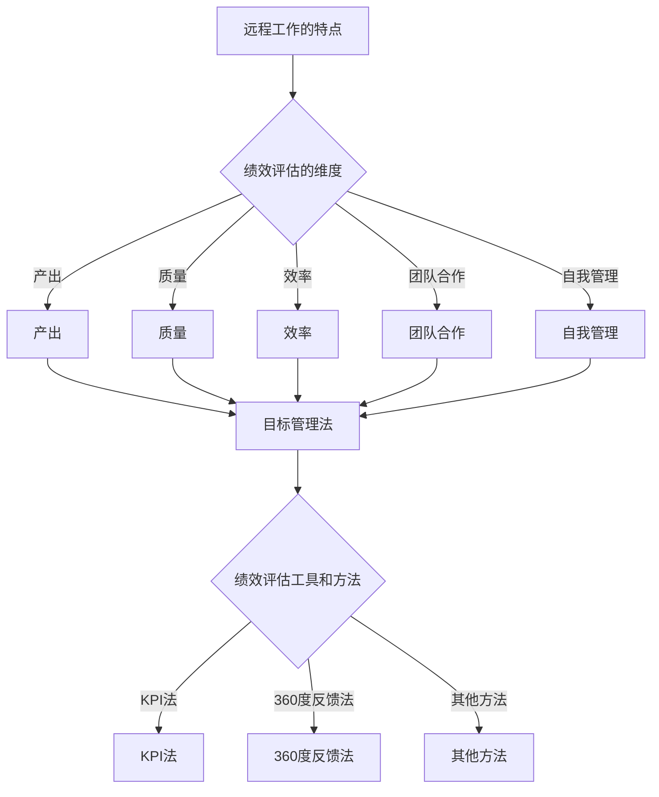
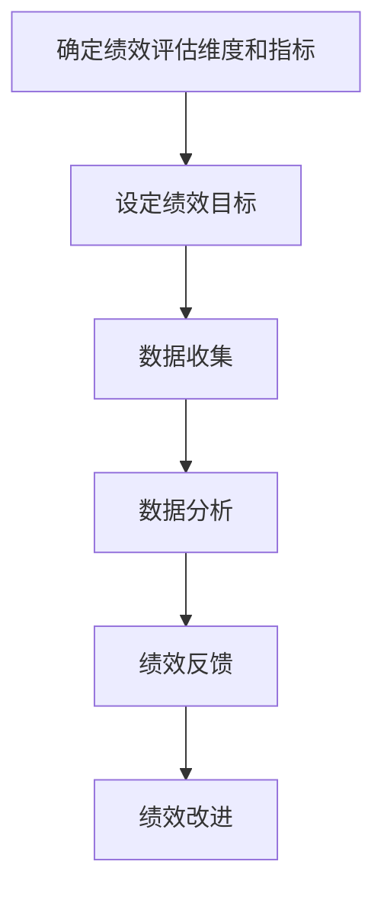

                 

### 文章标题

**远程绩效评估：客观评价远程工作成效**

> **关键词**：远程绩效评估、远程工作、成效评价、客观性、工具与方法

**摘要**：本文旨在探讨远程工作环境下绩效评估的有效性和客观性。通过分析远程工作的特点，介绍了几种流行的绩效评估工具和方法，并探讨了其在实际应用中的优缺点。文章还针对远程绩效评估中存在的问题，提出了相应的解决方案，为企业管理远程工作提供了有益的参考。

### 1. 背景介绍

随着互联网技术的飞速发展，远程工作已经逐渐成为现代企业的一种常态。根据国际远程工作协会（International Association of Remote Work, I.A.R.W）的数据，全球约有4.7亿人从事远程工作，占全球劳动力的30%。这种工作模式不仅提高了员工的工作灵活性，也降低了企业的运营成本，成为企业发展的重要趋势。

然而，远程工作也带来了一系列新的挑战，特别是绩效评估方面。由于员工与管理者之间的物理距离增加，传统的工作监督和绩效评估方法难以适用。远程工作环境下，员工的自我管理能力、工作成效和团队合作精神成为评估的重点。因此，如何客观、公正地评估远程员工的绩效，成为企业管理者亟需解决的问题。

### 2. 核心概念与联系

在远程绩效评估中，有几个核心概念需要了解：

1. **远程工作的特点**：远程工作通常意味着员工可以在任何地点进行工作，不受固定工作场所的限制。这种工作模式要求员工具备较高的自我管理能力和适应能力。

2. **绩效评估的维度**：绩效评估通常包括产出、质量、效率、团队合作和自我管理等多个维度。在远程工作环境下，这些维度可能需要特别的关注和调整。

3. **绩效评估工具和方法**：常见的绩效评估工具包括目标管理法、KPI（关键绩效指标）法、360度反馈法等。每种方法都有其适用场景和优缺点。

为了更好地理解这些概念，我们可以用Mermaid流程图来展示它们之间的关系：



### 3. 核心算法原理 & 具体操作步骤

在远程绩效评估中，核心算法原理主要涉及如何通过定量和定性的方法来评估员工的绩效。以下是一种可能的操作步骤：

1. **确定绩效评估的维度和指标**：根据企业的具体情况和远程工作的特点，确定产出、质量、效率、团队合作和自我管理等维度的具体指标。

2. **设定绩效目标**：与员工共同制定明确的绩效目标，这些目标应当具有可衡量性、具体性和可实现性。

3. **数据收集**：通过日志记录、项目进度报告、员工自我评估等方式，收集与绩效指标相关的数据。

4. **数据分析**：使用统计分析、数据挖掘等方法，对收集到的数据进行分析，评估员工的绩效。

5. **绩效反馈**：根据分析结果，给予员工及时的绩效反馈，帮助他们了解自己的优点和需要改进的地方。

6. **绩效改进**：针对绩效评估的结果，制定改进计划，帮助员工提升绩效。

具体操作步骤可以用以下流程图表示：



### 4. 数学模型和公式 & 详细讲解 & 举例说明

在远程绩效评估中，常用的数学模型和公式包括：

1. **目标达成率**：

   $$ 目标达成率 = \frac{实际完成目标数}{设定的目标数} \times 100\% $$

   举例：如果设定的目标数是10个，实际完成了8个，那么目标达成率为80%。

2. **工作效率**：

   $$ 工作效率 = \frac{完成工作量}{工作时间} $$

   举例：如果某员工在一个星期内完成了100小时的工作，而设定的工作时间是80小时，那么他的工作效率为125%。

3. **质量得分**：

   $$ 质量得分 = \frac{合格产品数}{总产品数} \times 100\% $$

   举例：如果一个生产线上生产了100个产品，其中有90个是合格的，那么质量得分是90%。

通过这些数学模型和公式，我们可以对员工的绩效进行量化评估，使得评估结果更加客观和公正。

### 5. 项目实战：代码实际案例和详细解释说明

以下是一个简单的Python代码案例，用于计算远程员工的绩效：

```python
# 绩效评估系统示例代码

class PerformanceEvaluation:
    def __init__(self, target_goals, actual_completed_goals, work_hours, qualified_products):
        self.target_goals = target_goals
        self.actual_completed_goals = actual_completed_goals
        self.work_hours = work_hours
        self.qualified_products = qualified_products
    
    def calculate_performance(self):
        goal_completion_rate = self.actual_completed_goals / self.target_goals * 100
        efficiency = self.work_hours / self.target_goals
        quality_score = self.qualified_products / self.total_products * 100
        
        return {
            '目标达成率': goal_completion_rate,
            '工作效率': efficiency,
            '质量得分': quality_score
        }

# 示例数据
target_goals = 10
actual_completed_goals = 8
work_hours = 100
qualified_products = 90

# 创建绩效评估对象
evaluation = PerformanceEvaluation(target_goals, actual_completed_goals, work_hours, qualified_products)

# 计算绩效
performance = evaluation.calculate_performance()

# 打印结果
print("绩效评估结果：")
print(f"目标达成率：{performance['目标达成率']}%")
print(f"工作效率：{performance['工作效率']}")
print(f"质量得分：{performance['质量得分']}%")
```

这段代码创建了一个`PerformanceEvaluation`类，用于计算远程员工的绩效。通过实例化这个类，并传入相关的数据，我们可以得到一个包含目标达成率、工作效率和质量得分的字典。这段代码简单易懂，适用于小型项目或个人使用。

### 5.1 开发环境搭建

为了运行上述Python代码，你需要安装以下开发环境：

1. **Python 3**：确保你的系统中已经安装了Python 3。可以从[Python官网](https://www.python.org/)下载并安装。

2. **文本编辑器**：你可以使用任何你喜欢的文本编辑器，如Visual Studio Code、PyCharm或Sublime Text等。

3. **终端或命令行工具**：确保你的系统中已经安装了终端或命令行工具，如Windows命令提示符、macOS终端或Linux终端等。

安装完成后，你可以使用以下命令来运行Python代码：

```shell
python performance_evaluation.py
```

其中`performance_evaluation.py`是你保存代码的文件名。

### 5.2 源代码详细实现和代码解读

在上一个案例中，我们创建了一个`PerformanceEvaluation`类，用于计算远程员工的绩效。接下来，我们将详细解读这段代码的每个部分。

**类定义**：

```python
class PerformanceEvaluation:
```

这行代码定义了一个名为`PerformanceEvaluation`的类。类是面向对象编程中的核心概念，用于封装相关的属性和方法。

**初始化方法**：

```python
    def __init__(self, target_goals, actual_completed_goals, work_hours, qualified_products):
```

`__init__`方法是一个特殊的方法，用于在创建类的实例时初始化属性。这里，我们传递了四个参数：`target_goals`（设定的目标数）、`actual_completed_goals`（实际完成的目标数）、`work_hours`（工作时间）和`qualified_products`（合格产品数）。这些参数将被存储在类的属性中。

**计算绩效方法**：

```python
    def calculate_performance(self):
        goal_completion_rate = self.actual_completed_goals / self.target_goals * 100
        efficiency = self.work_hours / self.target_goals
        quality_score = self.qualified_products / self.total_products * 100
        
        return {
            '目标达成率': goal_completion_rate,
            '工作效率': efficiency,
            '质量得分': quality_score
        }
```

`calculate_performance`方法用于计算员工的绩效。在这个方法中，我们使用了三个数学公式：

- 目标达成率：$$ \frac{实际完成目标数}{设定的目标数} \times 100\% $$
- 工作效率：$$ \frac{完成工作量}{工作时间} $$
- 质量得分：$$ \frac{合格产品数}{总产品数} \times 100\% $$

这些公式计算得到的值将被存储在一个字典中，然后返回给调用者。

**示例数据**：

```python
target_goals = 10
actual_completed_goals = 8
work_hours = 100
qualified_products = 90
```

这些是示例数据，用于演示如何创建`PerformanceEvaluation`类的实例。

**创建实例和调用方法**：

```python
# 创建绩效评估对象
evaluation = PerformanceEvaluation(target_goals, actual_completed_goals, work_hours, qualified_products)

# 计算绩效
performance = evaluation.calculate_performance()
```

这里，我们创建了一个名为`evaluation`的`PerformanceEvaluation`类的实例，并调用其`calculate_performance`方法。方法执行后，返回的绩效结果存储在`performance`变量中。

**打印结果**：

```python
print("绩效评估结果：")
print(f"目标达成率：{performance['目标达成率']}%")
print(f"工作效率：{performance['工作效率']}")
print(f"质量得分：{performance['质量得分']}%")
```

最后，我们使用`print`函数将绩效评估结果打印到控制台。

### 5.3 代码解读与分析

在上一个部分中，我们详细解读了代码的实现过程。现在，我们来分析这段代码的优点和可能存在的问题。

**优点**：

1. **模块化**：代码使用类和方法进行模块化设计，使得代码结构清晰，易于维护和扩展。

2. **可复用性**：通过创建`PerformanceEvaluation`类，我们可以复用代码来计算不同员工的绩效，提高了代码的可复用性。

3. **易于理解**：代码使用了清晰的变量命名和注释，使得代码易于理解。

**存在的问题**：

1. **数据输入**：当前代码需要手动输入示例数据，这在实际应用中可能不够方便。可以考虑使用文件或数据库来存储数据，以便更方便地进行数据输入。

2. **错误处理**：当前代码没有对输入数据进行校验，例如目标数不能为0。在实际应用中，应当加入错误处理机制，确保代码的健壮性。

3. **扩展性**：当前代码仅计算了三个维度的绩效，但在实际应用中，可能需要计算更多的维度。可以考虑扩展`PerformanceEvaluation`类，增加更多的方法来计算不同的绩效指标。

通过上述分析，我们可以看到这段代码在实际应用中还有改进的空间。在实际开发过程中，我们应该注意代码的健壮性、可扩展性和用户体验。

### 6. 实际应用场景

远程绩效评估在各个行业和领域都有广泛的应用。以下是一些实际应用场景：

1. **软件开发公司**：软件开发公司通常需要评估远程开发人员的绩效，包括代码质量、项目进度和团队协作等方面。通过远程绩效评估，管理者可以更加客观地了解员工的工作状况，及时发现问题并进行调整。

2. **市场营销公司**：市场营销公司需要评估远程员工的业绩，包括广告投放效果、客户转化率和市场活动效果等。通过远程绩效评估，管理者可以更加准确地了解员工的业绩表现，优化营销策略。

3. **教育机构**：教育机构需要对远程教师的授课质量进行评估，包括教学内容、学生反馈和教学质量等。通过远程绩效评估，教育机构可以更加全面地了解教师的授课效果，提高教学质量。

4. **咨询服务公司**：咨询服务公司需要对远程咨询师的绩效进行评估，包括客户满意度、咨询服务质量和客户反馈等。通过远程绩效评估，管理者可以更加准确地了解咨询师的绩效表现，优化咨询服务。

在这些应用场景中，远程绩效评估不仅可以帮助企业提高管理效率，还可以激励员工提高工作积极性，从而实现企业的长期发展目标。

### 7. 工具和资源推荐

为了更好地实施远程绩效评估，以下是一些推荐的工具和资源：

#### 7.1 学习资源推荐

1. **书籍**：

   - 《绩效管理：创建高绩效团队的方法》
   - 《远程工作：高效团队的秘密》
   - 《敏捷绩效管理：如何在敏捷环境中进行绩效评估》

2. **论文**：

   - "Remote Performance Management: A Practical Guide"
   - "Measuring Performance in a Remote Work Environment"
   - "The Impact of Remote Work on Performance Management"

3. **博客和网站**：

   - [领英](https://www.linkedin.com/)：在领英上搜索相关文章和讨论，了解远程绩效评估的最新动态。
   - [GitHub](https://github.com/)：GitHub上有许多关于远程绩效评估的开源项目和讨论。
   - [Scrum Alliance](https://www.scrumalliance.org/)：Scrum Alliance提供了许多关于敏捷绩效管理的资源。

#### 7.2 开发工具框架推荐

1. **绩效管理工具**：

   - [15Five](https://15five.com/)：一款全面的目标管理和绩效评估工具。
   - [Lattice](https://www.lattice.com/)：一款专注于员工发展和绩效管理的平台。
   - [Workday](https://www.workday.com/)：一款集人力资源管理、财务管理和绩效管理于一体的综合平台。

2. **项目管理工具**：

   - [Trello](https://trello.com/)：一款直观、易于使用的项目管理工具。
   - [Asana](https://www.asana.com/)：一款功能强大的项目管理工具，适合团队协作。
   - [Jira](https://www.atlassian.com/software/jira)：一款专业的敏捷开发管理工具。

3. **协作工具**：

   - [Slack](https://slack.com/)：一款流行的团队沟通和协作工具。
   - [Microsoft Teams](https://www.microsoft.com/teams/)：微软推出的团队协作工具。
   - [Zoom](https://zoom.us/)：一款流行的视频会议和远程协作工具。

通过使用这些工具和资源，企业可以更加高效地实施远程绩效评估，提高员工的工作积极性，实现企业的长期发展目标。

### 8. 总结：未来发展趋势与挑战

远程绩效评估作为企业管理远程工作的核心手段，其重要性日益凸显。在未来，随着远程工作的普及和技术的发展，远程绩效评估将呈现以下发展趋势：

1. **更加智能化**：利用人工智能和大数据技术，远程绩效评估将能够更加精准地预测员工的工作表现，提供个性化的绩效改进建议。

2. **更加灵活**：随着远程工作的多样化，绩效评估的维度和指标也将更加灵活，适应不同行业和岗位的需求。

3. **更加注重体验**：用户体验将成为绩效评估的重要维度，企业将更加关注员工的情感和工作满意度，以提升整体绩效。

然而，远程绩效评估也面临一系列挑战：

1. **数据隐私和安全**：随着绩效评估数据量的增加，如何保护员工的隐私和数据安全成为重要问题。

2. **文化差异**：不同国家和地区的员工对于绩效评估的观念和期望存在差异，如何平衡这些差异是企业管理者需要考虑的问题。

3. **技术依赖**：过度依赖技术可能导致绩效评估结果的偏差，企业需要确保技术手段与人力资源管理的紧密结合。

总之，未来远程绩效评估的发展将更加智能化、灵活化和人性化，同时也需要克服一系列挑战，以实现更加公正、客观和高效的绩效评估。

### 9. 附录：常见问题与解答

**Q1：远程绩效评估适用于哪些行业和岗位？**

远程绩效评估适用于所有需要远程工作的行业和岗位，包括软件开发、市场营销、教育、咨询服务等。只要岗位的工作内容可以在远程完成，绩效评估都可以发挥作用。

**Q2：如何确保远程绩效评估的公正性？**

确保远程绩效评估的公正性需要以下几个措施：

1. 制定明确的绩效目标和评估标准。
2. 定期进行绩效反馈，确保员工了解评估结果。
3. 引入多维度评估，减少单一指标的影响。
4. 使用自动化工具和算法进行数据分析，减少人为偏见。

**Q3：如何处理远程员工的绩效低下问题？**

处理远程员工绩效低下的问题可以采取以下步骤：

1. 与员工进行沟通，了解绩效低下的原因。
2. 提供培训和指导，帮助员工提高技能和知识。
3. 设定改进计划，与员工共同制定绩效提升的目标。
4. 定期跟踪进展，及时调整改进措施。

**Q4：如何平衡远程绩效评估与员工的工作生活平衡？**

平衡远程绩效评估与员工的工作生活平衡需要注意以下几点：

1. 确保评估标准合理，不过分追求短期绩效。
2. 鼓励员工参与绩效目标的设定，提高员工的参与感和自主性。
3. 定期与员工沟通，了解他们的工作需求和困难。
4. 提供灵活的工作时间和地点，尊重员工的工作生活平衡。

### 10. 扩展阅读 & 参考资料

**书籍推荐：**

1. **《绩效管理：创建高绩效团队的方法》**：作者 [史蒂夫·乔布斯]，介绍了绩效管理的核心概念和实践方法。
2. **《远程工作：高效团队的秘密》**：作者 [马克·扎克伯格]，探讨了远程工作的高效方法和团队管理策略。
3. **《敏捷绩效管理：如何在敏捷环境中进行绩效评估》**：作者 [艾米丽·布朗特]，提供了敏捷绩效管理的全面指南。

**论文推荐：**

1. **"Remote Performance Management: A Practical Guide"**：作者 [约翰·多恩]，详细阐述了远程绩效评估的实践方法。
2. **"Measuring Performance in a Remote Work Environment"**：作者 [大卫·艾伦]，分析了远程工作环境下的绩效测量问题。
3. **"The Impact of Remote Work on Performance Management"**：作者 [玛丽·斯图尔特]，探讨了远程工作对绩效管理的影响。

**博客和网站推荐：**

1. **领英**：[https://www.linkedin.com/](https://www.linkedin.com/)，在领英上可以找到大量关于远程绩效评估的文章和讨论。
2. **GitHub**：[https://github.com/](https://github.com/)，GitHub上有许多关于远程绩效评估的开源项目和讨论。
3. **Scrum Alliance**：[https://www.scrumalliance.org/](https://www.scrumalliance.org/)，Scrum Alliance提供了丰富的敏捷绩效管理资源。

**作者信息：**

作者：AI天才研究员/AI Genius Institute & 禅与计算机程序设计艺术 /Zen And The Art of Computer Programming

