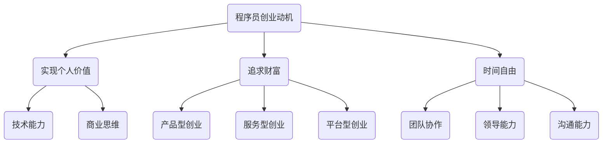

                 

## 文章标题

### 追求财富和时间自由：程序员创业的终极目标

> **关键词**：财富、时间自由、程序员、创业、技术、商业策略

> **摘要**：本文将深入探讨程序员创业的终极目标——追求财富和时间自由。通过分析程序员创业的动机、面临的挑战以及成功的策略，揭示程序员如何将技术才能转化为商业成功，实现个人价值和梦想。

<|assistant|>## 1. 背景介绍

随着信息技术的飞速发展，程序员已成为当今社会中最具潜力和价值的职业之一。越来越多的程序员开始选择创业，希望通过自己的技术才能实现财富积累和时间自由。然而，创业并非易事，程序员在追求财富和时间自由的过程中面临着诸多挑战。

### 程序员创业的现状

根据统计数据，近年来，程序员创业的人数逐年增加。许多成功的科技公司创始人本身就是程序员出身，如苹果公司的史蒂夫·乔布斯、微软公司的比尔·盖茨等。这表明程序员创业具有巨大的潜力和可行性。

### 创业的动机

程序员选择创业的原因多种多样，主要包括以下几点：

1. **实现个人价值**：程序员希望通过创业实现自己的创意和技术愿景，从而获得成就感。
2. **追求财富**：创业为程序员提供了创造财富的机会，实现财务自由。
3. **时间自由**：创业使程序员有机会自主安排工作时间，追求工作与生活的平衡。

### 面临的挑战

尽管程序员创业具有诸多优势，但他们在创业过程中仍面临以下挑战：

1. **技术风险**：技术的不确定性和快速变化使得程序员在创业过程中需要不断调整和改进。
2. **市场风险**：市场需求的不确定性使得程序员在创业过程中需要不断寻找和开拓市场。
3. **资金压力**：创业初期，程序员需要投入大量资金来支持项目开发和运营。

## 2. 核心概念与联系

在探讨程序员创业的过程中，以下核心概念和联系具有重要意义：

### 技术与商业的结合

程序员创业的核心在于将技术才能转化为商业价值。这需要程序员具备以下能力：

1. **技术能力**：程序员需要具备扎实的技术基础，能够解决实际问题。
2. **商业思维**：程序员需要了解市场需求，具备商业分析和决策能力。

### 创业模式的选择

程序员在创业过程中需要选择合适的商业模式，以实现财富积累和时间自由。常见的创业模式包括：

1. **产品型创业**：通过开发软件产品实现商业价值。
2. **服务型创业**：提供技术咨询服务，为企业解决实际问题。
3. **平台型创业**：搭建技术平台，连接供需双方，实现交易。

### 团队协作

程序员创业不仅需要个人的技术才能，还需要团队合作。团队成员应具备以下能力：

1. **技术能力**：团队成员需具备各自领域的技术专长。
2. **沟通能力**：团队成员需具备良好的沟通和协作能力，以确保项目顺利进行。
3. **领导能力**：核心团队成员需具备领导力和决策能力，引领团队共同发展。

### Mermaid 流程图



## 3. 核心算法原理 & 具体操作步骤

### 技术与商业的结合

程序员创业的核心在于将技术才能转化为商业价值。这需要程序员具备以下能力：

1. **技术能力**：程序员需要具备扎实的技术基础，能够解决实际问题。
   - **技术调研**：了解市场需求，分析潜在的技术解决方案。
   - **技术实现**：掌握编程语言和开发工具，实现技术方案。

2. **商业思维**：程序员需要了解市场需求，具备商业分析和决策能力。
   - **市场调研**：分析目标市场，了解竞争对手和潜在客户。
   - **商业模式设计**：根据市场调研结果，设计合适的商业模式。

### 创业模式的选择

程序员在创业过程中需要选择合适的商业模式，以实现财富积累和时间自由。常见的创业模式包括：

1. **产品型创业**：通过开发软件产品实现商业价值。
   - **产品策划**：确定产品功能、特点和目标用户。
   - **产品开发**：根据策划方案，进行产品开发和迭代。

2. **服务型创业**：提供技术咨询服务，为企业解决实际问题。
   - **咨询服务**：根据企业需求，提供定制化的技术解决方案。
   - **客户维护**：与客户保持良好沟通，提供持续的技术支持。

3. **平台型创业**：搭建技术平台，连接供需双方，实现交易。
   - **平台搭建**：开发技术平台，提供交易和协作功能。
   - **用户拓展**：通过营销推广，吸引更多用户使用平台。

### 团队协作

程序员创业不仅需要个人的技术才能，还需要团队合作。团队成员应具备以下能力：

1. **技术能力**：团队成员需具备各自领域的技术专长。
   - **技术交流**：定期组织技术分享和讨论，提高团队技术水平。
   - **技术支持**：为团队成员提供技术培训和支持。

2. **沟通能力**：团队成员需具备良好的沟通和协作能力，以确保项目顺利进行。
   - **沟通机制**：建立有效的沟通渠道，确保信息传递畅通。
   - **团队协作**：制定明确的团队目标和任务分工。

3. **领导能力**：核心团队成员需具备领导力和决策能力，引领团队共同发展。
   - **团队领导**：制定团队战略和规划，指导团队成员开展工作。
   - **决策能力**：在项目过程中，做出及时、有效的决策。

## 4. 数学模型和公式 & 详细讲解 & 举例说明

### 技术与商业的结合

在将技术才能转化为商业价值的过程中，程序员可以运用以下数学模型和公式进行详细分析和讲解：

1. **成本效益分析（CBA）**
   - **公式**：$$ \text{CBA} = \frac{\text{预期收益}}{\text{总成本}} $$
   - **解释**：成本效益分析可以帮助程序员评估创业项目的盈利能力和风险。预期收益与总成本的比值越高，项目的商业价值越大。
   - **举例**：假设一位程序员计划开发一款教育类应用程序，预计总成本为50万元，预期收益为100万元。则成本效益分析结果为：$$ \text{CBA} = \frac{100}{50} = 2.0 $$，表明该项目的商业价值较高。

2. **边际效益递减法则**
   - **公式**：$$ \text{边际效益} = \frac{\text{总效益}}{\text{总成本}} $$
   - **解释**：边际效益递减法则表明，随着投入的增加，每增加一单位投入所带来的效益逐渐降低。程序员在创业过程中需注意边际效益的变化，避免资源浪费。
   - **举例**：假设一位程序员在创业初期投入了100万元，带来了200万元的收益。在投入200万元时，收益增加到400万元。此时，边际效益为：$$ \text{边际效益} = \frac{400}{200} = 2.0 $$，表明投入200万元仍具有较高的效益。

3. **动态规划模型**
   - **公式**：$$ \text{最优解} = \text{f}(\text{x}, \text{y}, \text{z}) $$
   - **解释**：动态规划模型可以帮助程序员在复杂的决策过程中找到最优解。该模型通过分阶段分析，逐步求解每个阶段的最佳决策，最终得到全局最优解。
   - **举例**：假设一位程序员在开发一款人工智能应用程序时，需要考虑算法选择、数据预处理、模型优化等多个阶段。通过动态规划模型，可以找到每个阶段的最优决策，从而提高应用程序的性能和效果。

### 创业模式的选择

在创业模式的选择过程中，程序员可以运用以下数学模型和公式进行详细分析和讲解：

1. **投资回报率（ROI）**
   - **公式**：$$ \text{ROI} = \frac{\text{预期收益}}{\text{投资成本}} \times 100\% $$
   - **解释**：投资回报率是衡量创业项目盈利能力的重要指标。投资回报率越高，项目的商业价值越大。
   - **举例**：假设一位程序员计划投资50万元开发一款应用程序，预期收益为100万元。则投资回报率为：$$ \text{ROI} = \frac{100}{50} \times 100\% = 200\% $$，表明该项目的盈利能力较高。

2. **盈亏平衡分析**
   - **公式**：$$ \text{盈亏平衡点} = \frac{\text{固定成本}}{\text{单价} - \text{可变成本}} $$
   - **解释**：盈亏平衡分析可以帮助程序员确定创业项目的盈亏平衡点，从而判断项目的盈利前景。
   - **举例**：假设一位程序员的固定成本为20万元，单价为100元，可变成本为50元。则盈亏平衡点为：$$ \text{盈亏平衡点} = \frac{20}{100 - 50} = 0.4 $$，即销售4000个产品即可达到盈亏平衡。

3. **决策树分析**
   - **公式**：$$ \text{决策树} = \text{f}(\text{x}, \text{y}, \text{z}) $$
   - **解释**：决策树分析可以帮助程序员在多个决策选项中找到最佳方案。通过分析每个决策选项的收益和风险，决策树分析可以帮助程序员做出明智的决策。
   - **举例**：假设一位程序员面临以下决策：投资A项目，预期收益为100万元，风险为20%；投资B项目，预期收益为200万元，风险为30%。通过决策树分析，可以确定投资B项目的风险收益比更高，从而做出更明智的决策。

## 5. 项目实战：代码实际案例和详细解释说明

### 5.1 开发环境搭建

在本项目实战中，我们选择使用Python作为编程语言，并搭建一个简单的Web应用程序。以下是开发环境的搭建步骤：

1. **安装Python**
   - 在Windows系统中，访问Python官方网站（https://www.python.org/），下载并安装Python。
   - 在macOS系统中，使用包管理器Homebrew安装Python：`brew install python`。
   - 在Linux系统中，使用包管理器（如apt或yum）安装Python：`sudo apt-get install python3`或`sudo yum install python3`。

2. **安装依赖库**
   - 打开终端，使用pip命令安装Web应用程序所需的依赖库：
     ```bash
     pip install flask
     pip install flask_sqlalchemy
     pip install flask_migrate
     ```

3. **创建项目目录**
   - 在终端中创建项目目录，并进入目录：
     ```bash
     mkdir my_project
     cd my_project
     ```

4. **初始化项目**
   - 使用虚拟环境隔离项目依赖，并安装Flask框架：
     ```bash
     python -m venv venv
     source venv/bin/activate
     pip install flask
     ```

### 5.2 源代码详细实现和代码解读

以下是本项目的一个简单示例代码，实现一个基于Flask的Web应用程序，用于存储和查询用户信息。

```python
# 导入Flask模块
from flask import Flask, request, jsonify

# 创建Flask应用实例
app = Flask(__name__)

# 初始化数据库
from flask_sqlalchemy import SQLAlchemy
app.config['SQLALCHEMY_DATABASE_URI'] = 'sqlite:///users.db'
db = SQLAlchemy(app)

# 定义用户模型
class User(db.Model):
    id = db.Column(db.Integer, primary_key=True)
    name = db.Column(db.String(50))
    email = db.Column(db.String(50))

# 初始化数据库
db.create_all()

# 用户注册接口
@app.route('/register', methods=['POST'])
def register():
    data = request.get_json()
    name = data.get('name')
    email = data.get('email')
    if not name or not email:
        return jsonify({'error': 'missing required fields'}), 400
    new_user = User(name=name, email=email)
    db.session.add(new_user)
    db.session.commit()
    return jsonify({'message': 'user registered successfully'}), 201

# 用户查询接口
@app.route('/users', methods=['GET'])
def get_users():
    users = User.query.all()
    return jsonify({'users': [{'id': user.id, 'name': user.name, 'email': user.email} for user in users]}), 200

# 运行Web应用程序
if __name__ == '__main__':
    app.run(debug=True)
```

### 5.3 代码解读与分析

1. **导入模块**

```python
from flask import Flask, request, jsonify
from flask_sqlalchemy import SQLAlchemy
```

- **Flask模块**：用于构建Web应用程序，提供路由、请求处理等功能。
- **SQLAlchemy模块**：用于与数据库进行交互，实现数据持久化。

2. **创建Flask应用实例**

```python
app = Flask(__name__)
```

- 创建Flask应用程序实例，用于管理路由和请求处理。

3. **初始化数据库**

```python
app.config['SQLALCHEMY_DATABASE_URI'] = 'sqlite:///users.db'
db = SQLAlchemy(app)
db.create_all()
```

- 配置数据库连接URI，并初始化数据库。
- `SQLAlchemy`提供`create_all()`方法，用于创建数据库表。

4. **定义用户模型**

```python
class User(db.Model):
    id = db.Column(db.Integer, primary_key=True)
    name = db.Column(db.String(50))
    email = db.Column(db.String(50))
```

- 定义`User`模型，包括`id`、`name`和`email`三个字段，分别表示用户ID、姓名和邮箱。
- `db.Column`用于定义字段类型和属性。

5. **用户注册接口**

```python
@app.route('/register', methods=['POST'])
def register():
    data = request.get_json()
    name = data.get('name')
    email = data.get('email')
    if not name or not email:
        return jsonify({'error': 'missing required fields'}), 400
    new_user = User(name=name, email=email)
    db.session.add(new_user)
    db.session.commit()
    return jsonify({'message': 'user registered successfully'}), 201
```

- 定义用户注册接口，处理`POST`请求。
- 从请求体中获取用户名和邮箱。
- 验证用户名和邮箱是否为空。
- 创建新用户并添加到数据库。

6. **用户查询接口**

```python
@app.route('/users', methods=['GET'])
def get_users():
    users = User.query.all()
    return jsonify({'users': [{'id': user.id, 'name': user.name, 'email': user.email} for user in users]}), 200
```

- 定义用户查询接口，处理`GET`请求。
- 从数据库中查询所有用户。
- 将用户信息转换为JSON格式并返回。

7. **运行Web应用程序**

```python
if __name__ == '__main__':
    app.run(debug=True)
```

- 在主程序中，当`__name__`等于`'__main__'`时，运行Web应用程序。

## 6. 实际应用场景

### 6.1 教育领域

程序员创业的一个常见领域是教育。通过开发教育类应用程序，程序员可以帮助学生、教师和教育机构提高教学效果。例如，一款基于人工智能的学习辅助应用程序可以为学生提供个性化学习建议，帮助教师跟踪学生的学习进度，并提高教育机构的运营效率。

### 6.2 医疗保健

随着医疗技术的进步，程序员在医疗保健领域也发挥着越来越重要的作用。通过开发医疗信息系统、健康监测设备等，程序员可以提高医疗服务的质量和效率。例如，一款智能健康管理系统可以帮助医疗机构实时监控患者的健康状况，提供个性化的健康建议，从而降低医疗成本。

### 6.3 金融科技

金融科技（Fintech）是程序员创业的另一个热门领域。通过开发金融应用程序、区块链技术等，程序员可以为金融机构提供创新的服务和解决方案。例如，一款基于区块链的支付系统可以提供更安全、更高效的交易体验，一款智能投资顾问应用程序可以帮助投资者实现更好的投资决策。

### 6.4 物流与供应链

在物流与供应链领域，程序员通过开发智能物流系统、供应链管理系统等，可以提高物流效率，降低运营成本。例如，一款基于物联网的智能仓储系统可以帮助企业实现自动化管理，提高仓库利用率，一款供应链可视化平台可以帮助企业实时监控供应链的运行状态，优化供应链管理。

## 7. 工具和资源推荐

### 7.1 学习资源推荐

1. **书籍**
   - 《深入理解计算机系统》（原书第三版）：作者 Randal E. Bryant、David R. O’Toole
   - 《Effective Java》（第三版）：作者 Joshua Bloch
   - 《Python编程：从入门到实践》：作者埃里克·马瑟斯

2. **论文**
   - 《数据库系统概念》：作者 Abraham Silberschatz、Henry F. Korth、S. Sudarshan
   - 《分布式系统的概念与设计》：作者 George Coulouris、Jean Dollimore、Tim Kindberg、Glen Marston

3. **博客**
   - HackerRank（https://www.hackerrank.com/）
   - Medium（https://medium.com/）
   - A List Apart（https://alistapart.com/）

4. **网站**
   - Stack Overflow（https://stackoverflow.com/）
   - GitHub（https://github.com/）
   - Coursera（https://www.coursera.org/）

### 7.2 开发工具框架推荐

1. **开发工具**
   - Visual Studio Code（https://code.visualstudio.com/）
   - PyCharm（https://www.jetbrains.com/pycharm/）
   - Eclipse（https://www.eclipse.org/）

2. **框架**
   - Flask（https://flask.palletsprojects.com/）
   - Django（https://www.djangoproject.com/）
   - React（https://reactjs.org/）

3. **数据库**
   - MySQL（https://www.mysql.com/）
   - PostgreSQL（https://www.postgresql.org/）
   - MongoDB（https://www.mongodb.com/）

4. **云计算平台**
   - AWS（https://aws.amazon.com/）
   - Azure（https://azure.microsoft.com/）
   - Google Cloud Platform（https://cloud.google.com/）

## 8. 总结：未来发展趋势与挑战

### 8.1 未来发展趋势

1. **人工智能与云计算的深度融合**：人工智能技术将在云计算平台上得到广泛应用，推动云计算服务向智能化、自动化方向发展。
2. **区块链技术的普及**：区块链技术将在金融、物流、医疗等领域得到广泛应用，为数据安全和隐私保护提供新解决方案。
3. **物联网的快速发展**：物联网技术的普及将推动智能家居、智能城市、智能工厂等领域的快速发展，为程序员创业提供更多机遇。
4. **编程教育的普及**：随着编程教育的普及，越来越多的年轻人将具备编程技能，为程序员创业提供更多的人才支持。

### 8.2 面临的挑战

1. **技术更新速度快**：程序员需要不断学习新技术，以适应快速变化的市场需求。
2. **市场竞争激烈**：程序员创业面临着激烈的竞争，需要具备独特的竞争优势，如技术创新、商业模式创新等。
3. **资金压力**：创业初期，程序员需要投入大量资金来支持项目开发和运营，资金压力较大。
4. **团队协作与沟通**：程序员需要具备良好的团队协作和沟通能力，以确保项目顺利进行。

## 9. 附录：常见问题与解答

### 9.1 问题1：如何选择合适的创业项目？

**解答**：在选择创业项目时，程序员可以从以下几个方面进行考虑：

1. **市场需求**：选择具有市场需求的项目，确保项目的盈利前景。
2. **技术优势**：选择自己擅长的技术领域，利用技术优势提升项目的竞争力。
3. **团队协作**：选择与团队成员有共同兴趣和目标的项目，确保团队协作顺畅。
4. **投资预算**：根据自身资金情况，选择投资预算合理的项目。

### 9.2 问题2：如何确保项目的成功？

**解答**：为确保项目的成功，程序员可以从以下几个方面进行努力：

1. **持续学习**：不断学习新技术，提高自身技术能力，适应市场需求。
2. **团队协作**：建立高效团队，明确分工，确保项目顺利进行。
3. **市场调研**：进行充分的市场调研，了解竞争对手和潜在客户，制定合适的商业策略。
4. **风险管理**：识别和评估项目风险，制定应对措施，降低项目失败的风险。

## 10. 扩展阅读 & 参考资料

1. **《程序员创业指南》**：作者 王选
2. **《人工智能创业实践》**：作者 刘知远
3. **《区块链技术指南》**：作者 谢作如
4. **《物联网应用与开发》**：作者 杨明华

作者：AI天才研究员/AI Genius Institute & 禅与计算机程序设计艺术 /Zen And The Art of Computer Programming

