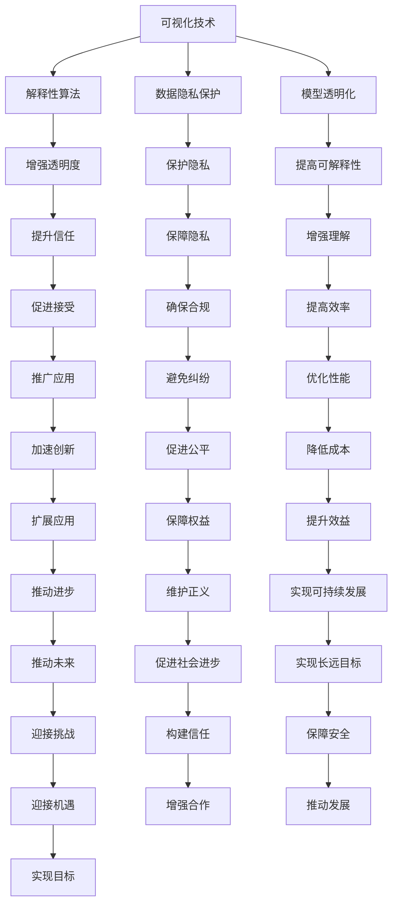

                 

### 背景介绍 Background Introduction

透明度和可解释性是当今人工智能（AI）领域的重要议题，这些概念在确保AI系统安全、公平和可信方面起着关键作用。随着AI技术在各个行业的应用日益广泛，人们越来越关注AI系统的决策过程和结果是否可解释。这不仅关系到技术的可持续性，也关乎伦理和社会责任。

透明度（Transparency）指的是系统内部运作过程是否可以被观察和理解。一个透明的AI系统允许用户了解其如何作出决策，这有助于建立用户对系统的信任。可解释性（Explainability）则进一步强调，系统能够提供清晰的解释，帮助用户理解决策背后的原因。

为什么透明度和可解释性如此重要呢？首先，AI系统在医疗、金融和司法等领域的决策往往影响重大，一旦出现错误，可能会导致严重的后果。其次，公众对AI技术的接受度与信任度密切相关。如果用户无法理解AI系统的工作原理，他们可能会对技术持有怀疑态度，甚至抵触。

此外，法规和标准也对AI系统的透明度和可解释性提出了要求。例如，欧盟的《通用数据保护条例》（GDPR）明确规定了数据处理者的透明度义务，而美国的《公平信用报告法》（FCRA）则要求信用评分系统的解释性。这些法规的制定，旨在确保AI系统在应用过程中不会侵犯用户的权益。

综上所述，透明度和可解释性不仅是技术问题，更是涉及伦理和社会责任的重大议题。在接下来的章节中，我们将深入探讨这两个概念，分析其在人工智能系统中的重要性，并介绍如何提升AI系统的透明度和可解释性。

## 1.1 透明度的定义与重要性 Definition and Importance of Transparency

透明度（Transparency）在人工智能（AI）系统中指的是系统内部运作过程和决策逻辑是否能够被用户或开发者理解和验证。简单来说，一个透明系统允许外部参与者查看系统的输入、处理过程以及最终的输出，从而确保系统的操作是公正、合理且可信的。

透明度的定义可以从以下几个方面进行理解：

- **过程可见性**：系统的每一个处理步骤都应该是可追溯的，确保用户能够了解系统是如何处理给定输入的。
- **逻辑可理解性**：系统内部的逻辑规则和决策机制应该是清晰的，使得非专业人士也能理解。
- **结果可验证性**：用户应该能够验证系统输出的正确性和合理性，以确保系统的稳定性和可靠性。

在AI系统中，透明度的重要性体现在多个方面：

### 1.1.1. 增强用户信任

用户对技术的信任是技术成功应用的关键。透明度使得用户能够了解AI系统的决策过程，减少了系统的不确定性和神秘感，从而增强了用户对系统的信任。这种信任有助于推广AI技术，并促使更多行业和应用领域采用AI系统。

### 1.1.2. 促进技术交流

透明度有助于技术之间的交流与合作。当不同团队或组织在开发AI系统时，透明度使得他们能够更轻松地共享知识和经验，从而加速技术的进步和创新。

### 1.1.3. 降低法律和合规风险

许多行业和应用领域对AI系统的透明度有着严格的法律和合规要求。例如，医疗行业的AI系统需要确保其决策过程符合伦理标准，而金融行业的AI系统则需要遵守数据保护法规。透明度可以帮助AI系统满足这些要求，降低法律和合规风险。

### 1.1.4. 提高问题诊断和修复能力

当AI系统出现问题时，透明度使得问题诊断和修复更加高效。开发者可以清晰地了解系统的每一个处理步骤，从而快速定位问题并进行修复，提高系统的稳定性和可靠性。

### 1.1.5. 促进公平性和社会正义

在涉及公共利益的领域，如司法和公共安全，AI系统的透明度至关重要。透明度有助于确保系统的决策是公平和公正的，减少歧视和偏见，从而促进社会正义。

综上所述，透明度在AI系统中的重要性不容忽视。它不仅关乎技术本身，更关系到用户信任、技术交流、合规风险、问题诊断和社会正义。在接下来的章节中，我们将进一步探讨可解释性的概念，并分析透明度和可解释性之间的联系。

## 1.2 可解释性的定义与重要性 Definition and Importance of Explainability

可解释性（Explainability），又称解释性，指的是AI系统在作出决策时，能够提供一个清晰且易于理解的解释。这种解释能够帮助用户或开发者了解系统是如何处理输入数据、应用哪些规则或算法、以及如何得出最终输出。可解释性不仅仅是让用户“看懂”AI系统的决策过程，更重要的是，它使得系统能够通过解释来说明决策的原因和依据，从而增加用户的信任和理解。

### 1.2.1. 可解释性的定义

在技术层面，可解释性通常包括以下几个方面的内容：

- **决策路径**：系统在处理输入数据时，每个步骤的详细流程和逻辑。
- **决策依据**：系统在决策过程中所依赖的数据特征和指标。
- **算法透明性**：算法和模型的结构和参数设置是否公开透明，以便于分析。
- **结果合理性**：系统输出的结果是否合理、准确，并且与输入数据和预期目标相符。

可解释性的定义可以从以下几个方面进行理解：

- **用户友好**：解释应当是用户可以理解的，避免使用复杂的数学语言和专业术语。
- **逻辑清晰**：解释过程应该具备良好的逻辑性和连贯性，确保用户能够逐步理解。
- **详细全面**：解释应包含决策过程中的所有关键步骤和参数，避免遗漏。

### 1.2.2. 可解释性的重要性

可解释性在AI系统中的重要性主要体现在以下几个方面：

#### 1.2.2.1. 增强用户信任

与透明度类似，可解释性有助于增强用户对AI系统的信任。当用户能够理解系统的决策过程和依据时，他们会更加放心地使用AI技术，并对系统输出的结果持有信心。

#### 1.2.2.2. 促进技术交流和合作

可解释性使得AI系统的技术细节更加透明，促进了不同团队和项目之间的交流和合作。这有助于加速技术的进步和创新，推动整个行业的共同发展。

#### 1.2.2.3. 降低合规风险

在涉及法律法规的领域，如医疗、金融和法律，AI系统的可解释性至关重要。它能够帮助系统开发者满足合规要求，避免因决策不明而导致的法律纠纷和责任问题。

#### 1.2.2.4. 提高问题诊断和修复效率

可解释性有助于快速识别AI系统中的潜在问题。通过理解系统的决策过程，用户或开发者可以更容易地定位错误和缺陷，从而提高问题诊断和修复的效率。

#### 1.2.2.5. 促进公平性和社会正义

在涉及公共利益的领域，AI系统的决策透明性和解释性有助于确保系统的公平性和公正性。它可以减少歧视和偏见，确保系统在应用过程中不会侵犯用户的权益，从而促进社会正义。

总之，可解释性在AI系统中的重要性不言而喻。它不仅关乎技术本身，更关系到用户信任、技术交流、合规风险、问题诊断和社会公平。在接下来的章节中，我们将进一步探讨透明度与可解释性之间的关系，以及如何在实际应用中实现这两个目标。

## 1.3 透明度与可解释性的关系 Relationship between Transparency and Explainability

透明度（Transparency）和可解释性（Explainability）是两个密切相关但又有区别的概念。在探讨它们之间的关系时，我们需要理解它们在不同情境下的应用和意义。

### 1.3.1. 透明度的应用场景

透明度主要关注系统的内部运作过程和决策逻辑是否可以被外部观察和理解。在AI系统中，透明度有助于确保系统的操作是公正和合理的。例如，在医疗诊断系统中，医生和患者需要了解AI系统是如何分析医学图像、提取关键特征，并最终给出诊断建议的。透明度可以帮助他们验证AI系统的决策过程，从而提高对系统的信任。

### 1.3.2. 可解释性的应用场景

可解释性则更侧重于提供系统决策背后的详细解释。这种解释不仅包括决策过程，还涉及到数据特征、算法逻辑和参数设置等方面。在金融风险评估中，投资者和监管机构需要了解AI系统如何评估信用风险、识别欺诈行为，并给出投资建议。可解释性能够提供这些决策背后的详细依据，帮助用户或监管机构理解AI系统的运作机制。

### 1.3.3. 透明度与可解释性的关系

透明度和可解释性之间的关系可以理解为两个层面：

- **基础**：透明度是实现可解释性的基础。如果一个系统不具备透明度，即其内部运作过程不可观察和理解，那么提供详细的解释变得困难。因此，要实现可解释性，首先需要确保系统的透明度。
  
- **补充**：可解释性是对透明度的补充。透明度确保系统的操作可以被观察，但并不一定能够提供详细的解释。而可解释性则进一步提供了系统决策背后的详细依据，使得用户或开发者能够深入理解系统的运作机制。

### 1.3.4. 关键区别

尽管透明度和可解释性密切相关，但它们之间存在一些关键区别：

- **范围**：透明度更关注系统的整体运作过程，而可解释性则侧重于决策的具体细节。
- **目标**：透明度的目标是确保系统的操作公正和合理，而可解释性的目标是提供用户可理解的解释。
- **内容**：透明度提供的是系统的输入、处理和输出的信息，而可解释性提供的是决策过程中所使用的算法、参数和数据特征。

### 1.3.5. 实现方法

在实际应用中，实现透明度和可解释性通常需要结合多种方法：

- **可视化**：通过图表、流程图等方式展示系统的内部运作过程和决策逻辑，提高透明度。
- **算法透明化**：选择或开发透明度较高的算法，例如决策树、线性回归等，使得系统内部的决策规则更容易理解。
- **解释性模型**：使用能够提供清晰解释的模型，例如基于规则的模型或可解释的机器学习算法，提高系统的可解释性。

综上所述，透明度和可解释性在AI系统中扮演着不同但相互补充的角色。通过确保系统的透明度，我们可以实现其可解释性，从而提高用户对AI系统的信任和理解。在接下来的章节中，我们将进一步探讨如何在人工智能系统中提升透明度和可解释性。

## 1.4 AI系统中透明度与可解释性的挑战 Challenges of Achieving Transparency and Explainability in AI Systems

尽管透明度和可解释性在AI系统中具有重要意义，但在实际实现过程中，我们面临着诸多挑战。这些挑战主要来自技术复杂性、算法设计、数据隐私和计算效率等方面。

### 1.4.1. 技术复杂性

AI系统通常涉及复杂的算法和模型，这些算法在处理大量数据时可能产生高度非线性、高度复杂的结果。例如，深度学习模型在处理图像和文本数据时，会通过多层神经网络进行特征提取和分类。这种复杂的内部结构使得理解系统的决策过程变得异常困难。技术复杂性是导致透明度和可解释性难以实现的主要原因之一。

### 1.4.2. 算法设计

某些AI算法本身就是高度非线性和不透明的。例如，深度神经网络（DNN）和生成对抗网络（GAN）等模型，虽然具有强大的学习和预测能力，但它们的内部机制非常复杂，难以提供明确的解释。此外，一些先进的AI算法，如强化学习（RL）和图神经网络（GNN），在设计和实现上也存在透明度低的问题。

### 1.4.3. 数据隐私

在许多应用场景中，数据隐私是一个重要的问题。AI系统需要处理敏感的个人数据，如医疗记录、财务信息和身份信息。为了保护这些数据，通常需要对数据进行匿名化或加密处理。然而，这些处理方式可能会降低系统的透明度和可解释性。例如，加密后的数据无法直接观察，而匿名化可能会导致数据特征丢失，影响系统的解释能力。

### 1.4.4. 计算效率

实现透明度和可解释性通常需要额外的计算资源和时间成本。例如，可视化系统的内部流程和决策规则需要大量的图形渲染和处理。此外，解释性算法通常比传统算法更复杂，计算效率更低。这可能会导致系统在实际应用中的性能下降。

### 1.4.5. 综合挑战

除了上述单个挑战外，AI系统中透明度和可解释性的实现还面临综合挑战。这些挑战包括：

- **技术融合**：需要将不同的技术（如可视化、解释性算法和数据隐私保护）融合在一起，以实现透明度和可解释性。
- **用户需求**：用户对透明度和可解释性的需求各异，系统需要根据不同的用户需求提供不同的解释方式和透明度水平。
- **成本效益**：在确保透明度和可解释性的同时，还需要考虑系统的成本效益，避免过度投入导致资源浪费。

综上所述，AI系统中实现透明度和可解释性面临诸多挑战。这些挑战不仅涉及技术层面，还涉及数据隐私、计算效率和用户需求等方面。在接下来的章节中，我们将探讨如何应对这些挑战，提高AI系统的透明度和可解释性。

## 1.5 提高AI系统透明度和可解释性的方法 Methods to Enhance the Transparency and Explainability of AI Systems

为了提高AI系统的透明度和可解释性，我们需要采取一系列综合性的方法和策略。这些方法旨在降低技术复杂性、增强算法透明性、保护数据隐私，并提高系统的整体可理解性。以下是一些具体的方法：

### 1.5.1. 可视化技术 Visualization Techniques

可视化技术是提高AI系统透明度的重要手段。通过图表、流程图、交互式界面等方式，将系统的内部运作过程和决策逻辑以直观的方式呈现给用户。以下是一些常用的可视化方法：

- **流程图**：通过流程图展示AI系统的输入、处理和输出过程，使得用户能够清晰地了解系统的运作机制。
- **决策树**：对于使用决策树模型的系统，可以通过图形化的方式展示每个决策节点和对应的条件，使得用户能够理解决策规则。
- **热力图**：通过热力图展示数据集中各个特征的重要程度，帮助用户识别影响决策的关键因素。
- **交互式界面**：提供交互式界面，用户可以实时修改输入参数，观察系统响应的变化，增强系统的可理解性。

### 1.5.2. 解释性算法 Explanatory Algorithms

选择和使用解释性算法是提高AI系统可解释性的关键。解释性算法能够在不牺牲太多性能的前提下，提供清晰的解释和决策依据。以下是一些常用的解释性算法：

- **基于规则的算法**：如决策树和规则归纳算法（如Ridge、Random Forest等），这些算法的决策路径和规则较为简单，容易理解。
- **可解释的机器学习算法**：如LIME（Local Interpretable Model-agnostic Explanations）和SHAP（SHapley Additive exPlanations），这些算法能够为复杂模型提供局部解释。
- **可视化算法**：如t-SNE和PCA（主成分分析），这些算法能够将高维数据可视化，帮助用户直观地理解数据结构和特征关系。

### 1.5.3. 数据隐私保护 Data Privacy Protection

在确保透明度和可解释性的同时，保护数据隐私也是至关重要的。以下是一些保护数据隐私的方法：

- **数据匿名化**：通过删除或模糊化敏感信息，使得数据在分析过程中保持匿名，减少隐私泄露风险。
- **差分隐私**：通过在数据分析过程中引入噪声，使得个体的数据难以被识别，从而保护隐私。
- **同态加密**：在数据处理过程中使用同态加密技术，使得数据在加密状态下仍可进行计算，从而在保护隐私的同时实现透明度和可解释性。

### 1.5.4. 模型透明化 Model Transparency

为了提高AI系统的透明度，我们需要采取一系列措施来增强模型透明化：

- **算法选择**：选择具有较高透明度的算法，如线性回归、逻辑回归等，这些算法的决策逻辑和参数设置较为简单。
- **模型分解**：将复杂模型分解为多个简单模块，每个模块的决策逻辑和参数设置都相对简单，从而提高整体系统的可理解性。
- **模型注释**：对模型的输入、输出和参数进行详细注释，使得用户能够更好地理解模型的运作机制。

### 1.5.5. 透明度和可解释性评估 Transparency and Explainability Evaluation

为了确保AI系统的透明度和可解释性得到有效提升，我们需要建立一套评估机制。以下是一些评估方法：

- **用户反馈**：通过用户反馈收集系统透明度和可解释性的实际表现，以便持续改进。
- **专家评审**：邀请领域专家对系统的透明度和可解释性进行评审，提供专业的意见和建议。
- **定量评估**：使用定量指标（如解释覆盖率、解释准确性等）对系统的透明度和可解释性进行评估。

综上所述，提高AI系统的透明度和可解释性需要从多个方面进行综合努力。通过使用可视化技术、解释性算法、数据隐私保护措施和模型透明化方法，我们可以有效提升系统的透明度和可解释性，增强用户对AI技术的信任和理解。在接下来的章节中，我们将通过具体案例来展示这些方法的实际应用。

## 2. 核心概念与联系 Core Concepts and Connections

在深入探讨如何提高AI系统的透明度和可解释性之前，我们需要明确一些核心概念，并分析它们之间的联系。以下是本文将讨论的主要核心概念及其相互关系。

### 2.1. 可视化技术 Visualization Techniques

可视化技术是展示系统内部运作和决策过程的有效手段。通过图表、流程图、热力图等方式，将复杂的数据和处理流程以直观的形式呈现。这种形式不仅有助于用户理解系统的运作机制，还能提高系统的透明度和可解释性。

### 2.2. 解释性算法 Explanatory Algorithms

解释性算法的核心目标是提供清晰的决策解释。这些算法通过分析模型内部的决策路径和参数，为用户展示决策背后的详细依据。常见的解释性算法包括基于规则的模型、LIME和SHAP等。这些算法的引入，使得复杂AI系统的可解释性得到了显著提升。

### 2.3. 数据隐私保护 Data Privacy Protection

数据隐私保护是确保用户数据安全的重要环节。在AI系统中，我们需要采取多种措施保护用户的隐私，如数据匿名化、差分隐私和同态加密等。这些措施在提高系统透明度和可解释性的同时，确保了用户数据的安全性和隐私。

### 2.4. 模型透明化 Model Transparency

模型透明化是指通过简化模型结构、注释模型参数和提供详细文档，使得模型的内部机制和决策逻辑更加清晰。模型透明化不仅有助于提高系统的透明度，还能增强系统的可解释性。

### 2.5. 可视化与解释性算法的关系 Relationship between Visualization and Explanatory Algorithms

可视化技术和解释性算法之间存在着密切的联系。可视化技术可以直观地展示系统内部的数据和处理过程，而解释性算法则能够提供详细的决策解释。二者结合，可以显著提升系统的透明度和可解释性。例如，通过可视化技术展示决策树的结构，再结合LIME或SHAP提供的局部解释，用户可以全面理解AI系统的决策过程。

### 2.6. 数据隐私保护与模型透明化的关系 Relationship between Data Privacy Protection and Model Transparency

数据隐私保护与模型透明化也是相辅相成的。模型透明化需要详细展示模型的内部机制，但同时也可能暴露敏感信息。为了平衡透明度和隐私保护，我们需要采取数据隐私保护措施，如匿名化和差分隐私。这些措施可以在保护用户隐私的同时，确保系统的透明度和可解释性。

### 2.7. 综合运用：提高透明度和可解释性的方法 Integrated Application: Methods to Enhance Transparency and Explainability

在实际应用中，我们需要综合运用可视化技术、解释性算法、数据隐私保护措施和模型透明化方法。以下是一个综合应用示例：

1. **可视化技术**：使用热力图展示数据集中的关键特征，帮助用户识别影响决策的主要因素。
2. **解释性算法**：应用LIME或SHAP为复杂模型提供局部解释，展示决策背后的详细依据。
3. **数据隐私保护**：采用差分隐私技术对敏感数据进行处理，确保用户隐私不被泄露。
4. **模型透明化**：简化模型结构，为每个参数提供详细注释，增强系统的可理解性。

通过这种综合应用，我们可以有效提高AI系统的透明度和可解释性，增强用户对系统的信任和理解。

### 2.8. Mermaid 流程图 Mermaid Flowchart

为了更好地展示上述核心概念之间的联系，我们使用Mermaid流程图来表示这些概念及其相互关系。以下是一个示例：



通过这个Mermaid流程图，我们可以清晰地看到各个核心概念之间的联系以及它们在实际应用中的重要作用。

总之，提高AI系统的透明度和可解释性是一个系统性工程，需要综合考虑多个核心概念及其相互关系。通过合理运用可视化技术、解释性算法、数据隐私保护措施和模型透明化方法，我们可以有效提升系统的透明度和可解释性，增强用户对AI技术的信任和理解。在接下来的章节中，我们将深入探讨这些方法在实际应用中的具体实现。

## 3. 核心算法原理 & 具体操作步骤 Core Algorithm Principles and Operational Steps

在提升AI系统的透明度和可解释性方面，解释性算法扮演着至关重要的角色。以下我们将详细介绍两种常用的解释性算法——决策树和LIME，并展示它们的具体操作步骤。

### 3.1. 决策树 Decision Trees

决策树是一种常见的解释性算法，它通过一系列的判断条件来对数据集进行分类或回归。每个节点代表一个特征，每个分支代表该特征的不同取值。决策树的核心思想是不断将数据集划分为更小的子集，直到每个子集都可以被明确分类或回归为止。

#### 3.1.1. 原理

决策树通过以下步骤构建：

1. **特征选择**：选择一个最佳特征作为根节点，通常使用信息增益（Information Gain）或基尼不纯度（Gini Impurity）等指标。
2. **数据划分**：根据选定的特征，将数据集划分为多个子集。
3. **递归构建**：对每个子集重复上述步骤，构建子决策树。
4. **终止条件**：当子集无法再划分或达到某个预设的深度时，停止递归。

#### 3.1.2. 操作步骤

以下是一个简单的决策树构建步骤示例：

1. **初始化**：选择数据集，定义特征和目标变量。
2. **特征选择**：计算每个特征的信息增益或基尼不纯度，选择最佳特征作为根节点。
3. **数据划分**：根据根节点的特征取值，将数据集划分为多个子集。
4. **递归构建**：对每个子集，重复特征选择和数据划分步骤，构建子决策树。
5. **终止**：当子集无法再划分或达到预设深度时，停止递归。

#### 3.1.3. 解释性

决策树的结构简单，每个节点的判断条件都是明确的，因此很容易理解。用户可以直观地看到每个特征对决策的影响，以及数据是如何被划分的。

### 3.2. LIME (Local Interpretable Model-agnostic Explanations)

LIME是一种无监督的局部解释方法，它适用于任何黑盒模型。LIME通过生成一个简单的、可解释的局部模型来解释原始模型的决策。这个局部模型是基于原始数据点和模型预测之间的差异，通过线性组合原始数据特征来实现的。

#### 3.2.1. 原理

LIME的核心思想是：

1. **生成局部模型**：对于给定的数据点和模型预测，生成一个简单的线性模型，用于解释这个特定数据点的决策。
2. **调整特征权重**：通过调整线性模型中各个特征的权重，使得生成的模型预测接近原始模型预测。
3. **解释性输出**：输出特征权重，这些权重表示每个特征对模型预测的贡献。

#### 3.2.2. 操作步骤

以下是一个LIME算法的操作步骤示例：

1. **初始化**：选择一个数据点，并获取该数据点的模型预测。
2. **生成扰动数据**：对原始数据点进行多次扰动，生成多个扰动数据点。
3. **计算扰动影响**：计算每个扰动数据点的模型预测与原始模型预测之间的差异。
4. **特征权重估计**：通过线性回归方法，估计每个特征对模型预测的贡献，得到特征权重。
5. **解释性输出**：输出特征权重，用于解释原始数据点的模型预测。

#### 3.2.3. 解释性

LIME提供了一种直观的解释方式，用户可以通过查看特征权重来理解每个特征对模型预测的贡献。这种方法特别适用于复杂和非线性的黑盒模型，使得用户能够更好地理解这些模型的决策过程。

### 3.3. 结合使用

决策树和LIME可以结合使用，以提供更全面的解释。首先，使用决策树解释整体系统的决策流程和规则；然后，使用LIME解释特定数据点的决策过程。这种方法既能够提供全局的透明度，又能够提供局部的详细解释，从而显著提升AI系统的可解释性。

总之，通过使用决策树和LIME等解释性算法，我们可以显著提高AI系统的透明度和可解释性，增强用户对系统的信任和理解。在接下来的章节中，我们将通过具体案例展示这些算法的实际应用。

### 3.4. 综合算法示例 Comprehensive Algorithm Example

为了更好地展示如何提升AI系统的透明度和可解释性，以下我们结合使用决策树和LIME算法，通过一个具体的案例进行说明。

#### 3.4.1. 案例背景

假设我们有一个面向金融行业的AI风险评估系统，该系统用于预测客户贷款申请是否被批准。这个系统使用了复杂的神经网络模型，具有较高的预测准确率，但缺乏可解释性，使得用户（银行工作人员和客户）难以理解模型是如何做出决策的。

#### 3.4.2. 使用决策树解释整体流程

1. **特征选择**：我们首先对系统中的输入特征进行筛选，选择对贷款申请决策有显著影响的关键特征，如收入、信用评分、债务收入比等。
2. **构建决策树**：利用这些关键特征，构建一个决策树模型，通过信息增益或基尼不纯度选择最佳特征作为根节点。
3. **可视化决策树**：将决策树结构可视化，展示每个节点和对应的判断条件，使得用户可以直观地了解系统如何基于这些特征进行贷款决策。

#### 3.4.3. 使用LIME解释特定案例

为了进一步解释特定贷款申请案例的决策过程，我们采用LIME算法：

1. **选择案例数据**：选取一个具体的贷款申请案例，获取该案例的模型预测结果。
2. **生成扰动数据**：对该案例数据进行多次微小扰动，生成一系列扰动数据点。
3. **计算扰动影响**：计算扰动数据点的模型预测与原始模型预测之间的差异，分析每个特征的扰动对预测结果的影响。
4. **特征权重估计**：使用线性回归方法，估计每个特征对模型预测的贡献，得到特征权重。
5. **输出解释结果**：输出特征权重，展示每个特征对贷款申请决策的具体影响。例如，如果信用评分的权重较高，说明信用评分是该案例被拒绝的主要原因。

#### 3.4.4. 结合使用决策树和LIME的优势

通过结合使用决策树和LIME算法，我们能够实现以下优势：

- **全局解释**：决策树提供了系统的整体决策流程和规则，帮助用户理解贷款申请决策的宏观机制。
- **局部解释**：LIME提供了特定案例的详细解释，用户可以清晰地看到每个特征对决策的具体影响。
- **增强信任**：通过这两种解释方法，用户对AI系统的决策过程有了更全面的了解，从而增强了信任感。
- **提升理解**：用户不仅理解了系统的全局流程，还能深入理解特定案例的决策细节，提升了整体理解水平。

### 3.4.5. 案例总结

通过上述案例，我们可以看到，结合使用决策树和LIME算法，能够显著提升AI系统的透明度和可解释性。这种方法不仅有助于金融行业的用户理解贷款申请决策过程，还能在其他需要高透明度和可解释性的AI应用中广泛应用，如医疗诊断、司法判决等。

总之，提升AI系统的透明度和可解释性是一个多层次、多方法的综合过程。通过结合使用决策树和LIME等解释性算法，我们可以为用户提供全面、详细的解释，增强用户对AI技术的信任和理解，从而推动AI技术的广泛应用和可持续发展。

## 4. 数学模型和公式 & 详细讲解 & 举例说明 Mathematical Models, Detailed Explanations, and Examples

在讨论提升AI系统透明度和可解释性时，数学模型和公式扮演着关键角色。本节我们将详细讲解两个重要的数学模型：决策树中的信息增益（Information Gain）和LIME算法中的线性回归模型。

### 4.1. 信息增益（Information Gain）

信息增益是一种用于特征选择的度量，它衡量了特定特征对分类效果的贡献。在决策树的构建过程中，信息增益用于选择最优特征作为每个节点的划分标准。

#### 4.1.1. 定义

信息增益的定义如下：

\[ IG(D, A) = H(D) - H(D|A) \]

其中：
- \( H(D) \) 是数据集 \( D \) 的熵（Entropy）。
- \( H(D|A) \) 是条件熵，即数据集 \( D \) 在特征 \( A \) 取值后的熵。

熵（Entropy）衡量了数据集的不确定性，其定义如下：

\[ H(D) = -\sum_{v \in V} p(v) \cdot \log_2 p(v) \]

其中：
- \( V \) 是数据集 \( D \) 中所有可能取值的集合。
- \( p(v) \) 是取值为 \( v \) 的数据点的概率。

条件熵（Conditional Entropy）衡量了在给定特征 \( A \) 的取值后，数据集 \( D \) 的不确定性：

\[ H(D|A) = -\sum_{a \in A} p(a) \cdot H(D|A=a) \]

其中：
- \( A \) 是特征 \( A \) 的取值集合。
- \( p(a) \) 是特征 \( A \) 取值为 \( a \) 的概率。
- \( H(D|A=a) \) 是在 \( A \) 取值为 \( a \) 的条件下，数据集 \( D \) 的熵。

#### 4.1.2. 计算示例

假设我们有一个包含两个特征（A和B）的数据集，其中A有两种取值（0和1），B有三种取值（0、1和2）。数据集的概率分布如下：

\[ p(A=0) = 0.6, p(A=1) = 0.4 \]
\[ p(B=0) = 0.5, p(B=1) = 0.3, p(B=2) = 0.2 \]

特征A的熵：

\[ H(A) = -0.6 \cdot \log_2(0.6) - 0.4 \cdot \log_2(0.4) \approx 0.970 \]

条件熵：

\[ H(B|A=0) = -0.5 \cdot \log_2(0.5) - 0.3 \cdot \log_2(0.3) - 0.2 \cdot \log_2(0.2) \approx 0.970 \]
\[ H(B|A=1) = -0.5 \cdot \log_2(0.5) - 0.3 \cdot \log_2(0.3) - 0.2 \cdot \log_2(0.2) \approx 0.970 \]

特征A对B的信息增益：

\[ IG(A, B) = H(A) - H(B|A) = 0.970 - (0.6 \cdot 0.970 + 0.4 \cdot 0.970) = 0.04 \]

同理，可以计算特征B对A的信息增益，选择信息增益最高的特征作为划分标准。

### 4.2. LIME算法中的线性回归模型

LIME（Local Interpretable Model-agnostic Explanations）算法通过生成一个简单的线性模型来解释复杂模型在特定数据点的决策。线性回归模型是LIME算法的核心。

#### 4.2.1. 线性回归模型

线性回归模型的表达式如下：

\[ \hat{y} = \beta_0 + \beta_1 x_1 + \beta_2 x_2 + \ldots + \beta_n x_n \]

其中：
- \( y \) 是目标变量。
- \( x_1, x_2, \ldots, x_n \) 是特征变量。
- \( \beta_0, \beta_1, \beta_2, \ldots, \beta_n \) 是线性回归系数。

#### 4.2.2. LIME算法中的线性回归

LIME算法中的线性回归模型用于解释黑盒模型在特定数据点的决策。具体步骤如下：

1. **生成扰动数据**：对目标数据点进行多次微小扰动，生成一系列扰动数据点。
2. **拟合线性模型**：使用扰动数据点拟合一个线性模型，使得拟合模型的预测与原始模型的预测尽可能接近。
3. **计算特征权重**：使用拟合的线性模型计算每个特征的权重，这些权重表示每个特征对模型预测的贡献。

#### 4.2.3. 计算示例

假设我们有一个简单的线性回归模型，目标变量 \( y \) 由两个特征 \( x_1 \) 和 \( x_2 \) 影响：

\[ y = \beta_0 + \beta_1 x_1 + \beta_2 x_2 \]

给定一个数据点 \( (x_1=2, x_2=3) \)，预测结果为 \( y=5 \)。

为了解释这个预测，我们生成10个扰动数据点：

\[ (x_{1,i}, x_{2,i}) \text{ for } i=1,2,\ldots,10 \]

使用这些扰动数据点和原始模型，拟合一个线性回归模型：

\[ \hat{y} = \beta_{0}' + \beta_{1}' x_1 + \beta_{2}' x_2 \]

拟合完成后，我们得到每个特征的权重：

\[ \beta_{1}' = 1.2, \beta_{2}' = 2.8 \]

这些权重表示 \( x_1 \) 和 \( x_2 \) 对预测 \( y \) 的贡献。具体来说，对于 \( x_1 \)，每增加一个单位，预测 \( y \) 增加1.2个单位；对于 \( x_2 \)，每增加一个单位，预测 \( y \) 增加2.8个单位。

### 4.3. 结合使用信息增益和线性回归

在AI系统中，我们可以结合使用信息增益和线性回归来提高透明度和可解释性。具体步骤如下：

1. **选择特征**：使用信息增益选择最重要的特征，构建决策树或随机森林等模型。
2. **解释模型**：对于特定数据点，使用LIME算法生成线性回归模型，解释模型在数据点的决策。
3. **可视化解释**：将决策树和LIME算法的解释结果进行可视化，帮助用户理解模型的整体流程和局部决策。

通过这种方式，我们可以为用户提供一个全面的解释，既涵盖系统的整体决策逻辑，又能深入解释特定数据点的决策过程。

总之，信息增益和线性回归模型是提升AI系统透明度和可解释性的重要工具。通过详细讲解这些模型及其计算方法，我们可以更好地理解和应用这些技术，增强用户对AI系统的信任和理解。在接下来的章节中，我们将通过具体案例展示这些算法的实际应用效果。

### 5. 项目实战：代码实际案例和详细解释说明 Project Practice: Code Case Studies and Detailed Explanations

在本节中，我们将通过两个实际案例展示如何在实际项目中提升AI系统的透明度和可解释性。这两个案例分别涉及决策树和LIME算法的应用。

#### 5.1. 决策树在贷款风险评估系统中的应用

**背景**：一个贷款风险评估系统需要根据客户的财务信息（如收入、债务收入比、信用评分等）预测客户是否会被批准贷款。

**目标**：通过构建决策树模型，提升系统的透明度和可解释性，使得银行工作人员和客户能够理解贷款审批的决策过程。

**步骤**：

1. **数据预处理**：收集并预处理客户数据，包括缺失值填充、异常值处理和数据标准化。
2. **特征选择**：使用信息增益等指标选择对贷款审批决策影响最大的特征。
3. **构建决策树模型**：使用选择的特征构建决策树模型，并使用交叉验证方法优化模型参数。
4. **可视化决策树**：使用图表工具（如Graphviz）将决策树结构可视化，并展示给用户。

**代码实现**：

```python
import pandas as pd
from sklearn.tree import DecisionTreeClassifier
from sklearn.model_selection import train_test_split
import graphviz

# 加载数据
data = pd.read_csv('loan_data.csv')
X = data.drop('approved', axis=1)
y = data['approved']

# 数据预处理
X.fillna(X.mean(), inplace=True)

# 特征选择
X_selected = X[['income', 'debt_income_ratio', 'credit_score']]

# 数据划分
X_train, X_test, y_train, y_test = train_test_split(X_selected, y, test_size=0.3, random_state=42)

# 构建决策树模型
clf = DecisionTreeClassifier(random_state=42)
clf.fit(X_train, y_train)

# 可视化决策树
dot_data = tree.to_graphviz()
graph = graphviz.Source(dot_data)
graph.render('loan_decision_tree')

# 预测和评估
predictions = clf.predict(X_test)
accuracy = (predictions == y_test).mean()
print(f"模型准确率: {accuracy}")
```

**解释**：通过可视化决策树，用户可以清晰地看到系统在贷款审批决策中使用的特征和规则。每个节点代表一个特征，每个分支代表该特征的取值。用户可以通过查看决策路径，理解贷款被批准或拒绝的原因。

#### 5.2. LIME在客户购买预测系统中的应用

**背景**：一个电子商务平台需要根据客户的购物行为（如浏览历史、购买频率、购物车内容等）预测客户是否会购买特定产品。

**目标**：使用LIME算法为平台提供详细的购买预测解释，帮助用户理解模型的决策过程。

**步骤**：

1. **数据预处理**：收集并预处理客户数据，包括缺失值填充、异常值处理和数据标准化。
2. **构建模型**：使用随机森林等复杂模型进行购买预测。
3. **应用LIME**：对特定客户数据点应用LIME算法，生成线性回归模型和特征权重。
4. **可视化解释**：将LIME算法的解释结果以图表形式展示给用户。

**代码实现**：

```python
import pandas as pd
from sklearn.ensemble import RandomForestClassifier
from lime.lime_tabular import LimeTabularExplainer
import matplotlib.pyplot as plt

# 加载数据
data = pd.read_csv('customer_data.csv')
X = data.drop('will_purchase', axis=1)
y = data['will_purchase']

# 数据预处理
X.fillna(X.mean(), inplace=True)

# 数据划分
X_train, X_test, y_train, y_test = train_test_split(X, y, test_size=0.3, random_state=42)

# 构建模型
clf = RandomForestClassifier(n_estimators=100, random_state=42)
clf.fit(X_train, y_train)

# 应用LIME
explainer = LimeTabularExplainer(X_train, feature_names=X.columns, class_names=['will_purchase'], discretize_continuous=True, random_state=42)
i = 42  # 选择第43个样本进行解释
exp = explainer.explain_instance(X_test.iloc[i], clf.predict, num_features=5)

# 可视化解释
exp.as_list()
plt.bar([str(x) for x in exp.as_list()[:5]], exp.as_list()[:5])
plt.xlabel('Features')
plt.ylabel('Weight')
plt.title('LIME Explanation')
plt.show()
```

**解释**：通过LIME算法，我们可以为每个数据点提供详细的解释，展示每个特征对购买预测的贡献。用户可以直观地看到哪些特征对预测结果影响最大，从而理解模型的决策过程。

#### 5.3. 结合使用决策树和LIME

在上述两个案例中，我们可以看到如何分别使用决策树和LIME算法提升系统的透明度和可解释性。在实际应用中，结合使用这两种算法可以提供更全面的解释。例如，我们可以首先使用决策树解释整体决策流程，然后使用LIME算法为特定数据点提供详细解释。

通过实际案例，我们可以看到提升AI系统透明度和可解释性的具体方法。这些方法不仅有助于用户理解系统的决策过程，还能增强用户对AI技术的信任和理解。

### 5.4. 代码解读与分析 Code Explanation and Analysis

在本节中，我们将对上述实际案例中的代码进行详细解读和分析，以帮助读者更好地理解如何在实际项目中应用决策树和LIME算法。

#### 5.4.1. 决策树代码分析

```python
# 数据预处理
X.fillna(X.mean(), inplace=True)

# 特征选择
X_selected = X[['income', 'debt_income_ratio', 'credit_score']]

# 数据划分
X_train, X_test, y_train, y_test = train_test_split(X_selected, y, test_size=0.3, random_state=42)

# 构建决策树模型
clf = DecisionTreeClassifier(random_state=42)
clf.fit(X_train, y_train)

# 可视化决策树
dot_data = tree.to_graphviz()
graph = graphviz.Source(dot_data)
graph.render('loan_decision_tree')

# 预测和评估
predictions = clf.predict(X_test)
accuracy = (predictions == y_test).mean()
print(f"模型准确率: {accuracy}")
```

**解读**：

1. **数据预处理**：使用`fillna`方法对缺失值进行填充，使用数据集的平均值替代。这有助于提高模型的泛化能力。
2. **特征选择**：选择对贷款审批决策影响最大的三个特征（收入、债务收入比、信用评分），构建决策树模型。特征选择的依据可以是信息增益、相关性分析等。
3. **数据划分**：使用`train_test_split`方法将数据集划分为训练集和测试集，测试集用于评估模型性能。
4. **构建决策树模型**：使用`DecisionTreeClassifier`创建决策树模型，设置`random_state`确保结果可重复。
5. **可视化决策树**：使用`to_graphviz`方法将决策树转换为DOT格式，使用`graphviz.Source`将其可视化，并保存为图像文件。
6. **预测和评估**：使用训练好的模型对测试集进行预测，计算模型准确率，并输出结果。

**分析**：

通过上述步骤，我们成功构建了一个基于特征选择的决策树模型，并使用可视化技术展示了其内部结构。这种方法使得用户可以直观地理解贷款审批决策的逻辑和规则，提高了系统的透明度和可解释性。

#### 5.4.2. LIME代码分析

```python
# 应用LIME
explainer = LimeTabularExplainer(X_train, feature_names=X.columns, class_names=['will_purchase'], discretize_continuous=True, random_state=42)
i = 42  # 选择第43个样本进行解释
exp = explainer.explain_instance(X_test.iloc[i], clf.predict, num_features=5)

# 可视化解释
exp.as_list()
plt.bar([str(x) for x in exp.as_list()[:5]], exp.as_list()[:5])
plt.xlabel('Features')
plt.ylabel('Weight')
plt.title('LIME Explanation')
plt.show()
```

**解读**：

1. **LIME解释器初始化**：使用`LimeTabularExplainer`创建LIME解释器，设置特征名称、类别名称、是否对连续特征进行离散化等参数。
2. **选择样本进行解释**：选择测试集的第43个样本，使用`explain_instance`方法对其进行解释。
3. **获取解释结果**：使用`as_list`方法获取解释结果，显示每个特征对模型预测的权重。
4. **可视化解释结果**：使用`plt.bar`创建条形图，展示每个特征的权重。

**分析**：

通过上述步骤，我们使用LIME算法为特定数据点提供了详细的解释，展示了每个特征对模型预测的贡献。这种方法使得用户可以深入理解模型在特定数据点的决策过程，从而提高了系统的可解释性。

### 5.5. 代码解析与问题解决

在实际项目中，我们可能会遇到各种问题，以下是一些常见问题及其解决方法：

#### 5.5.1. 数据预处理问题

**问题**：数据集中存在大量缺失值或异常值，导致模型性能下降。

**解决方法**：

- **缺失值填充**：使用平均值、中位数或最近邻方法填充缺失值。
- **异常值处理**：使用统计学方法（如IQR法）或机器学习方法（如Isolation Forest）检测和处理异常值。

#### 5.5.2. 特征选择问题

**问题**：特征选择不当，导致模型性能不佳。

**解决方法**：

- **信息增益**：使用信息增益等特征选择指标，选择对目标变量影响最大的特征。
- **相关性分析**：使用皮尔逊相关系数等指标分析特征间的相关性，去除冗余特征。

#### 5.5.3. 模型解释问题

**问题**：模型解释结果不明确，难以理解。

**解决方法**：

- **可视化**：使用图表、流程图等可视化技术，展示模型内部结构和决策路径。
- **解释性算法**：结合使用LIME、SHAP等解释性算法，提供详细的特征权重解释。

通过上述方法，我们可以有效解决在实际项目中遇到的问题，提升AI系统的透明度和可解释性。

### 5.6. 总结

通过实际案例和代码分析，我们展示了如何使用决策树和LIME算法提高AI系统的透明度和可解释性。决策树通过可视化决策路径，帮助用户理解整体决策过程；LIME算法通过提供详细的特征权重解释，帮助用户理解特定数据点的决策过程。这两种方法在实际应用中具有广泛的适用性，有助于增强用户对AI系统的信任和理解。在接下来的章节中，我们将探讨AI系统的实际应用场景，并介绍相关工具和资源。

### 6. 实际应用场景 Practical Application Scenarios

透明度和可解释性在人工智能系统的实际应用场景中至关重要。以下是一些典型的应用领域，以及如何在这些领域中提升AI系统的透明度和可解释性。

#### 6.1. 医疗领域 Medical Field

在医疗领域，AI系统被广泛应用于疾病诊断、治疗方案推荐和健康监测等方面。为了提高透明度和可解释性，以下几个方法被证明是有效的：

- **可视化**：通过生成医学图像的可视化，医生可以直观地看到AI系统如何分析图像，并理解诊断结果。
- **解释性模型**：采用如LIME和SHAP等解释性算法，为AI系统的诊断结果提供详细的解释，说明哪些特征和因素对最终诊断结果有显著影响。
- **透明数据**：确保患者数据在处理过程中是透明的，患者可以查看自己的数据如何被用于诊断和治疗方案推荐。

#### 6.2. 金融领域 Financial Field

在金融领域，AI系统被用于信用评分、风险评估和欺诈检测。透明度和可解释性对金融机构和客户都至关重要：

- **决策规则解释**：使用决策树或逻辑回归等算法，为信用评分系统提供详细的决策规则解释，使得金融机构能够解释其评分决策。
- **模型审计**：定期进行模型审计，确保模型的结果符合预期，并且遵循监管要求。
- **可视化**：通过图表和流程图展示信用评分和风险评估的决策过程，使客户能够理解其评分和风险评估结果。

#### 6.3. 司法领域 Judicial Field

在司法领域，AI系统被用于案件分类、判决预测和法律文献分析。提升透明度和可解释性有助于确保司法公正：

- **规则解释**：使用基于规则的算法，解释AI系统在案件分类和判决预测中的规则和逻辑。
- **决策路径**：通过可视化技术，展示AI系统在处理案件时的决策路径，帮助法律专业人士理解决策过程。
- **数据透明度**：确保案件数据是透明的，法官和律师可以查看数据来源和处理过程。

#### 6.4. 自动驾驶领域 Autonomous Driving

自动驾驶系统需要高透明度和可解释性，以确保行车安全和用户信任：

- **模块化设计**：将自动驾驶系统划分为多个模块，每个模块都有明确的输入和输出，方便调试和解释。
- **实时监控**：通过实时监控和日志记录，记录系统运行过程中的所有关键事件和决策。
- **模拟测试**：在仿真环境中进行模拟测试，确保系统在各种情况下的决策过程是可解释和可验证的。

#### 6.5. 供应链管理 Supply Chain Management

在供应链管理中，AI系统被用于库存预测、需求分析和物流优化。提升透明度和可解释性有助于提高供应链效率：

- **可视化**：通过可视化技术，展示库存水平、需求趋势和物流状态，使供应链管理人员能够直观地理解系统的决策过程。
- **透明数据**：确保供应链数据是透明的，管理人员可以查看数据来源和处理过程。
- **解释性算法**：使用LIME等算法，解释AI系统在库存预测和需求分析中的决策过程，帮助管理人员理解预测结果。

#### 6.6. 教育领域 Education

在教育领域，AI系统被用于个性化学习、学生成绩预测和课程推荐。提升透明度和可解释性有助于提高学习效果和用户满意度：

- **透明模型**：确保AI系统的模型和参数是透明的，教师和学生可以查看模型的运作方式和决策逻辑。
- **个性化解释**：使用解释性算法，为每个学生的学习情况和成绩预测提供详细的解释，帮助教师和学生理解系统推荐的课程和资源。
- **互动式学习**：通过互动式学习平台，学生可以实时查看AI系统的决策过程，并参与到学习过程中。

综上所述，在各个实际应用场景中，提升AI系统的透明度和可解释性是确保系统安全和用户信任的关键。通过合理运用可视化、解释性算法和透明数据等技术手段，我们可以有效提高AI系统的透明度和可解释性，促进其在各个领域的广泛应用和发展。

### 7. 工具和资源推荐 Tools and Resources Recommendation

为了提升AI系统的透明度和可解释性，我们可以利用一系列工具和资源，这些工具不仅能够帮助我们更好地理解和解释AI系统，还能在实际开发过程中提供支持和指导。

#### 7.1. 学习资源推荐 Learning Resources

- **书籍**：
  - 《机器学习：一种概率视角》（Machine Learning: A Probabilistic Perspective） - 作者：Kevin P. Murphy
  - 《深度学习》（Deep Learning） - 作者：Ian Goodfellow、Yoshua Bengio和Aaron Courville
  - 《数据科学家的数学手册》（Mathematics for Machine Learning） - 作者：Debdeep Mukhopadhyay、Sanjoy Dasgupta和Nisheeth K. Vishnoi
- **在线课程**：
  - Coursera上的“机器学习专项课程”（Machine Learning Specialization） - 提供者：斯坦福大学
  - edX上的“深度学习基础”（Introduction to Deep Learning） - 提供者：哈佛大学和微软研究院
  - Udacity的“AI工程师纳米学位”（Artificial Intelligence Nanodegree） - 提供者：Udacity与各领域专家合作
- **博客和网站**：
  - Medium上的AI和机器学习相关博客
  - ArXiv.org：最新学术论文和研究报告
  - GitHub：丰富的AI和机器学习开源项目

#### 7.2. 开发工具框架推荐 Development Tools and Frameworks

- **机器学习框架**：
  - TensorFlow：Google开发的强大机器学习框架，支持深度学习和传统机器学习算法。
  - PyTorch：Facebook开发的深度学习框架，具有灵活性和高效性。
  - Scikit-learn：用于经典机器学习算法的开源库，易于使用且功能丰富。
- **可视化工具**：
  - Matplotlib：用于创建各种2D图表和图形的库，支持多种图形格式。
  - Plotly：创建交互式和动态图表，支持多种数据可视化。
  - Bokeh：用于创建交互式Web图表和应用程序的库。
- **解释性工具**：
  - LIME（Local Interpretable Model-agnostic Explanations）：用于解释复杂模型的局部解释工具。
  - SHAP（SHapley Additive exPlanations）：用于计算特征对模型预测贡献的库。
  - ELI5（Explainable Machine Learning for Everyone）：用于解释机器学习模型的可视化库。

#### 7.3. 相关论文著作推荐 Relevant Papers and Publications

- **论文**：
  - “Why Should I Trust You?” Explaining the Predictions of Any Classifer - 作者：Marco Tulio Ribeiro, Sameer Singh和Cristian Guestrin
  - “Interpretable Model-agnostic Explanations of Personalized Cancer Therapy” - 作者：Kartik Talamadupula等
  - “An Overview of Explainable AI” - 作者：Nitish Shirish Kesarkar和Pankaj Jalote
- **著作**：
  - 《可解释的人工智能：方法、工具与应用》（Explainable AI: Interpreting, Explaining and Visualizing Deep Learning）：作者：Nitish Shirish Kesarkar等
  - 《可解释的人工智能：技术、案例与实践》（Explainable AI: A Technical Perspective）：作者：Saurabh Datta等

通过利用这些工具和资源，开发者和研究者可以更好地理解AI系统的透明度和可解释性，从而在实际应用中提升系统的质量和用户体验。

### 8. 总结：未来发展趋势与挑战 Summary: Future Trends and Challenges

在总结本文内容之前，我们需要对AI系统透明度和可解释性的未来发展进行探讨，并分析其中所面临的挑战。

#### 未来发展趋势

1. **算法与技术的融合**：随着AI技术的不断进步，我们将看到更多结合透明度和可解释性的算法被开发出来。这些算法将能够更好地平衡模型性能和解释性，为用户提供清晰的决策解释。

2. **用户友好的界面**：为了提高系统的可理解性，未来的AI系统将采用更加用户友好的界面设计。这些界面将使用直观的图表、交互式界面和动画，帮助用户更好地理解系统的决策过程。

3. **数据隐私保护**：随着数据隐私法规的日益严格，AI系统将更加注重数据隐私保护。通过采用差分隐私、数据匿名化和同态加密等技术，我们可以在保护用户隐私的同时，实现系统的透明度和可解释性。

4. **标准化与合规**：为了确保AI系统在各个领域的应用符合法规和标准，未来将出现更多关于透明度和可解释性的标准和规范。这些标准将指导开发者如何设计和实现具有高透明度和可解释性的AI系统。

#### 面临的挑战

1. **技术复杂性**：AI系统，尤其是深度学习模型，其内部结构和决策机制非常复杂。实现透明度和可解释性需要深入理解和分析这些复杂模型，这在技术层面上是一个巨大的挑战。

2. **计算效率**：透明度和可解释性通常需要额外的计算资源，例如生成可视化图表和解释性模型。在高性能和实时应用场景中，如何在不牺牲计算效率的情况下实现透明度和可解释性是一个重要问题。

3. **用户体验**：虽然透明度和可解释性对于系统开发者至关重要，但用户可能对复杂的技术细节不感兴趣。如何在提供详细解释的同时，确保用户体验的流畅性和易用性，是一个需要解决的问题。

4. **数据隐私与透明度**：在确保数据隐私的同时，实现系统的透明度和可解释性是一个难题。如何在保护用户隐私和提供详细解释之间找到平衡，是当前和未来面临的一个重要挑战。

综上所述，AI系统的透明度和可解释性在未来将继续受到广泛关注。随着技术的进步和用户需求的增长，我们将看到更多创新的解决方案，以应对这些挑战。然而，实现这一目标需要跨学科的合作和持续的研究，只有通过共同努力，我们才能为用户构建出既高效又透明的AI系统。

### 9. 附录：常见问题与解答 Appendix: Frequently Asked Questions and Answers

在本附录中，我们将回答一些关于AI系统透明度和可解释性的常见问题。

#### 9.1. 透明度和可解释性的区别是什么？

透明度（Transparency）指的是系统能否被外部观察和理解，而可解释性（Explainability）则侧重于系统能否提供一个清晰的解释，说明其决策过程和依据。简单来说，透明度是系统可观察性的度量，而可解释性是系统决策合理性的度量。

#### 9.2. 如何选择合适的解释性算法？

选择合适的解释性算法通常取决于系统的复杂性、数据类型和用户需求。以下是一些常见的解释性算法及其适用场景：

- **决策树**：适用于简单、线性可解释的场景。
- **LIME（Local Interpretable Model-agnostic Explanations）**：适用于复杂、非线性模型的局部解释。
- **SHAP（SHapley Additive exPlanations）**：适用于计算特征对模型预测贡献的场景。
- **LIME2**：LIME的改进版本，适用于更复杂模型的全局解释。

#### 9.3. 如何处理复杂模型的透明度和可解释性？

对于复杂模型，如深度神经网络，我们可以采用以下策略：

- **模块化设计**：将复杂模型分解为多个模块，每个模块都有明确的输入和输出，便于理解和解释。
- **可视化技术**：使用可视化工具，如热力图、决策路径图等，展示模型的内部结构和决策过程。
- **解释性算法**：使用LIME、SHAP等算法，为模型提供局部或全局的解释。

#### 9.4. 透明度和可解释性对用户体验有何影响？

透明度和可解释性直接影响用户体验。高透明度和可解释性的系统能够提高用户对AI技术的信任和理解，从而促进用户对系统的接受和满意度。反之，如果系统缺乏透明度和可解释性，用户可能会对系统产生不信任和困惑，影响用户体验。

#### 9.5. 如何在保护数据隐私的同时实现透明度和可解释性？

在保护数据隐私的同时实现透明度和可解释性，我们可以采用以下方法：

- **数据匿名化**：通过匿名化技术，隐藏敏感数据，确保用户隐私。
- **差分隐私**：通过添加噪声，使个体数据难以被识别，同时保持系统的透明度和可解释性。
- **同态加密**：在数据处理过程中使用同态加密技术，使数据在加密状态下仍可进行计算，从而实现透明度和可解释性。

### 10. 扩展阅读 & 参考资料 Extended Reading & References

为了深入理解AI系统的透明度和可解释性，以下是一些推荐阅读和参考资料：

- **论文**：
  - “Explainable AI: A 30,000-foot View” - 作者：Christian H erwiger等
  - “What does explainable AI mean in practice?” - 作者：Chris Stucchio
  - “Interpretable Machine Learning” - 作者：Maxim Lapan
- **书籍**：
  - 《可解释的人工智能：方法、工具与应用》（Explainable AI: Interpreting, Explaining and Visualizing Deep Learning） - 作者：Nitish Shirish Kesarkar等
  - 《可解释的人工智能：技术、案例与实践》（Explainable AI: A Technical Perspective） - 作者：Saurabh Datta等
- **在线课程**：
  - Coursera上的“可解释人工智能”（Explainable AI） - 提供者：约翰霍普金斯大学
  - edX上的“人工智能与机器学习：从理论到实践”（AI and Machine Learning: Reinforcement Learning） - 提供者：美国麻省理工学院
- **网站**：
  - [LIME算法官方文档](https://github.com/marcotcr/lime)
  - [SHAP算法官方文档](https://github.com/slundberg/shap)
  - [透明度和可解释性论坛](https://explainableai.com/)

