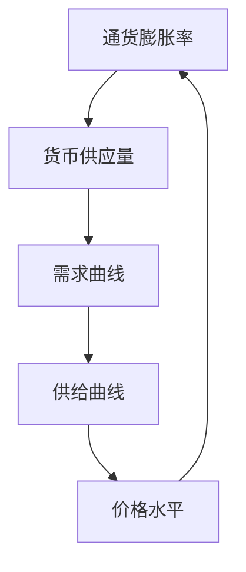
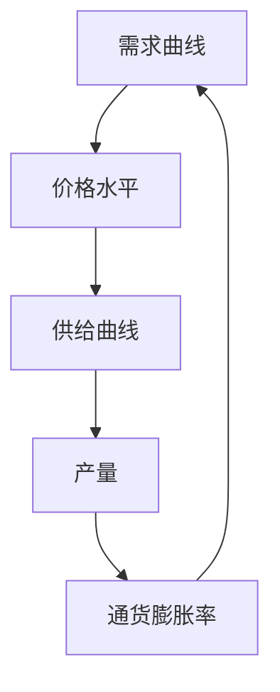
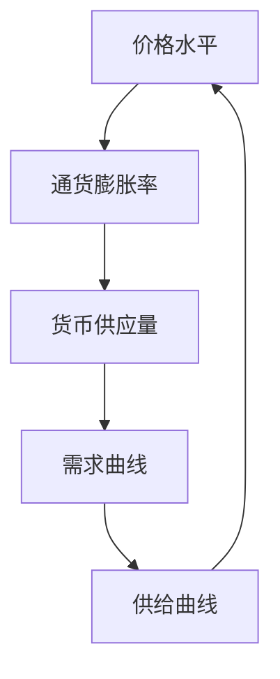

                 

### 背景介绍

#### 通胀高企的定义与历史背景

通胀高企，即通货膨胀率持续处于较高水平，通常指价格水平以较快的速度上升。这种经济现象不仅仅是一个物价上涨的问题，它对经济的各个方面都有着深远的影响。通胀高企的定义通常基于通货膨胀率，即价格水平变动的百分比。当通货膨胀率超过一定阈值（如3%或更高），即被视为通胀高企。

通货膨胀的历史可以追溯到经济学的早期。早在19世纪，经济学家如亚当·斯密和大卫·李嘉图就已经开始探讨价格波动的问题。然而，现代通货膨胀理论的发展主要是在20世纪，特别是在凯恩斯主义经济学的兴起后，通货膨胀的研究变得更加系统和深入。

在20世纪70年代，全球出现了显著的通胀高企现象，被称为“滞胀”。这一时期，许多国家同时面临着高通胀率和经济停滞的问题。滞胀的出现促使经济学家和政策制定者重新审视通货膨胀的控制策略。

#### 通胀高企对经济的影响

通胀高企对经济的影响是多方面的，包括但不限于以下几个方面：

1. **消费者行为**：通胀高企会导致消费者购买力的下降。当物价持续上涨时，消费者的实际购买力会减弱，从而减少消费支出。这会进一步影响生产和就业。

2. **投资决策**：通胀高企会增加投资的风险和不确定性。投资者可能因为对未来价格的预期而推迟投资决策，导致资本形成的减少。

3. **货币政策**：通胀高企通常需要货币政策进行干预。中央银行可能会通过提高利率来抑制通胀，但这可能会导致经济增长放缓。

4. **收入分配**：通胀高企对不同收入群体的影响不同。对于固定收入者，如退休人员和低收入工作者，通胀会降低他们的实际收入水平。而高收入者可能能够通过投资和资产升值来部分抵消通胀的影响。

5. **国际贸易**：通胀高企可能导致货币贬值，从而影响国际贸易的竞争力。出口企业可能会因为货币贬值而获得竞争优势，但进口企业则可能面临成本上升的压力。

#### 当前全球通胀形势

近年来，全球通胀形势再度严峻。2021年以来，全球多地通胀率持续上升，尤其是一些主要经济体，如美国、欧盟和中国的通胀率都超过了预期的目标范围。引发通胀高企的原因多种多样，包括新冠疫情导致的供应链中断、原材料价格上涨、劳动力市场紧张等。

在本文中，我们将深入探讨通胀高企的成因、影响及其应对策略，并结合实际案例进行分析。通过一步步的逻辑推理和专业的技术语言，希望为大家呈现一个全面且深刻的通胀高企对经济长期影响的解读。

#### 文章标题：通胀高企对经济的长期影响

##### 关键词：（通胀高企、经济影响、货币政策、消费者行为、投资决策）

##### 摘要：本文从通胀高企的定义、历史背景及其对经济的多方面影响入手，结合当前全球通胀形势，使用逻辑清晰、结构紧凑、简单易懂的专业技术语言，逐步分析通胀高企的成因、影响和应对策略。文章通过具体的案例和数学模型，深入探讨通胀高企对经济的长期影响，为政策制定者和经济研究者提供有价值的参考。

### 核心概念与联系

在深入探讨通胀高企对经济的长期影响之前，我们首先需要明确一些核心概念，并理解它们之间的内在联系。这些概念包括通货膨胀率、货币供应量、需求曲线和供给曲线等。为了更好地展示这些概念之间的关系，我们使用Mermaid流程图来直观地表达。

#### 通货膨胀率与货币供应量

**Mermaid流程图：**


**解释：** 通货膨胀率（A）是衡量价格水平变动的关键指标，而货币供应量（B）则是影响通货膨胀的重要因素之一。当货币供应量增加时，通常会推动需求曲线（C）和供给曲线（D）的变化，进而影响价格水平（E）。如果货币供应量增加的速度超过了经济产出的增长速度，价格水平就会上升，导致通货膨胀。

#### 需求曲线与供给曲线

**Mermaid流程图：**


**解释：** 需求曲线（A）和供给曲线（C）共同决定了价格水平（B）。当需求增加时，价格水平会上升；当供给增加时，价格水平会下降。产量的变化（D）会影响通货膨胀率（E），因为通货膨胀率是价格水平变动的一个度量。如果产量增长不足以满足需求增长，通货膨胀率就会上升。

#### 价格水平与通货膨胀率

**Mermaid流程图：**


**解释：** 价格水平（A）直接影响到通货膨胀率（B）。当价格水平上升时，通货膨胀率也会上升。货币供应量（C）和需求曲线（D）、供给曲线（E）的变化都会影响价格水平，从而影响通货膨胀率。

通过这些Mermaid流程图，我们可以直观地看到通货膨胀率、货币供应量、需求曲线和供给曲线之间的动态关系。这些核心概念相互联系，共同影响着经济的运行状况。理解这些概念及其联系，是深入分析通胀高企对经济长期影响的基础。

#### 通货膨胀率的定义与计算

在深入探讨通胀高企对经济的长期影响之前，我们需要先理解通货膨胀率的定义及其计算方法。通货膨胀率是指在一定时间内，价格水平的平均变动率。它反映了货币的购买力下降的程度。通货膨胀率通常以百分比形式表示，是衡量经济健康的重要指标之一。

##### 通货膨胀率的定义

通货膨胀率定义为价格水平变动的百分比。具体来说，通货膨胀率是指某一时期内消费者价格指数（CPI）的变化率。CPI是衡量消费者购买一篮子商品和服务时所支付的价格变动情况的指标。通过计算CPI的变化，我们可以得到通货膨胀率。

##### 通货膨胀率的计算方法

通货膨胀率的计算公式为：
\[ \text{通货膨胀率} = \left( \frac{\text{期末CPI} - \text{期初CPI}}{\text{期初CPI}} \right) \times 100\% \]

其中，期初CPI和期末CPI分别是某一时期的初始消费者价格指数和期末的消费者价格指数。这个公式简单明了，但实际操作中还需要考虑一些细节。

1. **基期选择**：计算通货膨胀率时，需要选择一个基期。基期通常是某一固定的时间点，用来作为比较的基础。通常情况下，基期CPI被设定为100。

2. **价格变动因素**：除了CPI，还有其他因素会影响通货膨胀率的计算。例如，不同商品和服务的价格变动幅度可能不同，这需要在计算过程中进行调整。

3. **年度化**：在某些情况下，我们需要将短期通货膨胀率年度化，以便更好地预测和评估通货膨胀的趋势。年度化通货膨胀率的计算公式为：
\[ \text{年度化通货膨胀率} = \left( \left(1 + \text{短期通货膨胀率}\right)^{12/短期时间长度} - 1 \right) \times 100\% \]

通过这些公式和计算方法，我们可以准确地衡量通货膨胀率，从而更好地理解通胀高企对经济的影响。

#### 货币供应量与通胀率的关系

货币供应量是影响通货膨胀率的重要因素之一。货币供应量（Money Supply）是指经济中流通的货币总量，包括现金、存款和其他货币形式。货币供应量的变化直接影响到通货膨胀率。理解货币供应量与通胀率之间的关系，有助于我们更深入地分析通胀高企对经济的长期影响。

##### 货币供应量的定义与分类

货币供应量通常分为三个层次：M0、M1和M2。

1. **M0**：即流通中的现金，包括居民和企业手中的现金以及银行库存现金。

2. **M1**：包括M0加上活期存款（如支票账户、储蓄账户等），这些资金可以随时用于支付。

3. **M2**：除了M1，还包括定期存款、储蓄账户和其他较长期限的存款。

不同层次的货币供应量反映了货币流动性的不同。M0和M1的流动性较高，而M2则相对较低。

##### 货币供应量与通胀率的关系

货币供应量与通货膨胀率之间的关系可以通过以下几个理论来解释：

1. **货币数量论**：货币数量论认为，货币供应量的增加会导致价格水平的上升，从而导致通货膨胀。货币数量论的公式可以表示为：
   \[ P \propto M \]
   其中，\( P \)代表价格水平，\( M \)代表货币供应量。这个理论强调了货币供应量在决定通货膨胀中的关键作用。

2. **需求拉动理论**：需求拉动理论认为，货币供应量的增加会提高总需求，进而推动价格水平上升。当货币供应量增加时，消费者的购买力增强，需求增加，导致价格上涨。

3. **成本推动理论**：成本推动理论认为，通货膨胀是由于生产成本的增加引起的，如工资和原材料价格上涨。当货币供应量增加时，生产成本上升，进而推动价格水平上升。

通过这些理论，我们可以看到货币供应量与通货膨胀率之间存在紧密的联系。货币供应量的增加会导致通货膨胀率的上升，反之亦然。因此，中央银行在制定货币政策时，需要密切关注货币供应量的变化，以控制通货膨胀。

##### 理论与实证分析

货币供应量与通胀率的关系不仅在理论上有解释，实证分析也支持这一观点。许多国家和地区的经济数据都表明，货币供应量的增加与通货膨胀率的上升具有显著相关性。

1. **美国**：美国联邦储备银行（Fed）的研究表明，货币供应量（M2）与通货膨胀率之间存在正相关关系。例如，在2008年金融危机期间，货币供应量急剧增加，导致通货膨胀率上升。

2. **中国**：中国的研究也发现，货币供应量（M2）的增长与通货膨胀率有显著相关性。例如，在2010年至2015年间，中国M2的快速增长导致了较高的通货膨胀率。

这些实证分析进一步证实了货币供应量对通货膨胀率的重要影响。理解货币供应量与通胀率之间的关系，有助于我们更好地分析和应对通胀高企对经济的长期影响。

### 核心算法原理与具体操作步骤

为了深入探讨通胀高企对经济的长期影响，我们需要理解一些核心算法原理和具体操作步骤。这些算法原理不仅可以帮助我们量化通胀对经济的影响，还可以为政策制定者提供有效的决策依据。以下是几个关键的算法原理和操作步骤：

#### 消费者价格指数（CPI）计算

消费者价格指数（CPI）是衡量通货膨胀率的重要指标。其计算步骤如下：

1. **选择商品篮子**：首先，我们需要选择一组代表性商品和服务，构成商品篮子。这些商品和服务应涵盖居民日常消费的各个方面，如食品、住房、交通、医疗等。

2. **确定基期价格**：选择一个基期，通常为某一固定的时间点，将该时间点的价格设定为100。

3. **计算现期价格**：在每个计算周期，我们需要记录商品篮子中每种商品或服务的现期价格。

4. **计算价格指数**：使用以下公式计算消费者价格指数：
   \[ \text{CPI} = \left( \frac{\sum_{i=1}^{n} p_i \cdot q_i}{\sum_{i=1}^{n} p_0 \cdot q_i} \right) \times 100 \]
   其中，\( p_i \)和\( p_0 \)分别是现期价格和基期价格，\( q_i \)是商品或服务的购买量。

5. **计算通货膨胀率**：通货膨胀率可以通过以下公式计算：
   \[ \text{通货膨胀率} = \left( \frac{\text{现期CPI} - \text{基期CPI}}{\text{基期CPI}} \right) \times 100\% \]

#### 菲利普斯曲线

菲利普斯曲线是一种用来描述通货膨胀率和失业率之间关系的模型。其基本原理是，当通货膨胀率上升时，失业率会下降；反之，当通货膨胀率下降时，失业率会上升。菲利普斯曲线的计算步骤如下：

1. **收集数据**：首先，我们需要收集一定时期内的通货膨胀率和失业率数据。

2. **绘制散点图**：将通货膨胀率作为纵轴，失业率作为横轴，绘制散点图，以观察两者之间的关系。

3. **拟合曲线**：使用最小二乘法或其他统计方法，拟合出一条最佳拟合曲线，表示通货膨胀率和失业率之间的关系。

4. **计算通货膨胀率与失业率的关系**：通过菲利普斯曲线，我们可以计算出在不同失业率水平下的通货膨胀率。

#### 弹性计算

弹性是衡量通货膨胀对经济变量影响的敏感程度的指标。以下是计算通货膨胀弹性的步骤：

1. **选择变量**：首先，我们需要选择一个经济变量，如消费支出、投资或产出。

2. **计算弹性系数**：使用以下公式计算弹性系数：
   \[ \text{弹性系数} = \frac{\text{变量变化量}}{\text{通货膨胀率变化量}} \]

3. **分析弹性**：根据弹性系数的大小，可以判断通货膨胀对经济变量的影响程度。弹性系数大于1表示高度敏感，小于1表示相对不敏感。

#### 实际应用

为了更直观地理解这些算法原理，我们可以通过实际案例来演示其应用。例如：

1. **CPI计算**：假设我们在2022年和2023年分别计算了某国的消费者价格指数，基期价格为2022年的价格。通过比较两年CPI的变化，我们可以得到该国的通货膨胀率。

2. **菲利普斯曲线**：假设我们有过去5年的通货膨胀率和失业率数据，通过绘制散点图并拟合菲利普斯曲线，我们可以预测在特定失业率水平下的通货膨胀率。

3. **弹性计算**：假设我们要分析通货膨胀对消费支出的影响，我们可以收集过去几年的消费支出和通货膨胀率数据，通过计算弹性系数来评估消费支出对通货膨胀的敏感程度。

通过这些核心算法原理和具体操作步骤，我们可以更精确地分析和预测通胀高企对经济的长期影响，为政策制定提供有力支持。

### 数学模型与公式及详细讲解

在深入分析通胀高企对经济的长期影响时，数学模型和公式提供了量化分析的工具，帮助我们理解通货膨胀的机制和影响。以下是几个关键数学模型和公式的详细讲解，包括如何使用这些公式进行计算和举例说明。

#### 1. 通货膨胀率计算公式

通货膨胀率（\( \pi \)）是衡量价格水平变动的关键指标。其计算公式为：

\[ \pi = \left( \frac{P_t - P_0}{P_0} \right) \times 100\% \]

其中：
- \( P_t \) 表示期末价格水平。
- \( P_0 \) 表示期初价格水平。

**举例说明：**

假设2022年初（期初）的通货膨胀率为0，而2023年末（期末）的价格水平为110。我们可以计算2023年的通货膨胀率如下：

\[ \pi = \left( \frac{110 - 100}{100} \right) \times 100\% = 10\% \]

这表示2023年的通货膨胀率为10%。

#### 2. 菲利普斯曲线公式

菲利普斯曲线描述了通货膨胀率与失业率之间的关系。其基本公式为：

\[ \pi = \alpha + \beta \cdot (u - u^*) \]

其中：
- \( \pi \) 表示通货膨胀率。
- \( u \) 表示实际失业率。
- \( u^* \) 表示自然失业率。
- \( \alpha \) 和 \( \beta \) 是参数。

**举例说明：**

假设我们估计自然失业率为4%，实际失业率为6%，我们可以计算通货膨胀率如下：

\[ \pi = \alpha + \beta \cdot (6\% - 4\%) \]

假设 \( \alpha = 2\% \) 且 \( \beta = 0.5 \)，则：

\[ \pi = 2\% + 0.5 \cdot 2\% = 2\% + 1\% = 3\% \]

这表示在当前失业率水平下，预期的通货膨胀率为3%。

#### 3. 货币供应量与价格水平的关系

货币数量论提供了一个关于货币供应量（\( M \)）与价格水平（\( P \)）之间关系的模型。其公式为：

\[ P \propto M \]

**举例说明：**

假设货币供应量增加了10%，且货币供应量与价格水平成正比关系。我们可以计算价格水平的变化：

\[ \frac{P_1}{P_0} = \frac{M_1}{M_0} \]

假设期初货币供应量 \( M_0 = 100 \)，期末货币供应量 \( M_1 = 110 \)，则：

\[ \frac{P_1}{P_0} = \frac{110}{100} = 1.1 \]

这表示价格水平也会增加10%。

#### 4. 通货膨胀弹性计算公式

通货膨胀弹性（\( \epsilon \)）衡量了通货膨胀对某一经济变量（如消费支出、投资或产出）的影响程度。其公式为：

\[ \epsilon = \frac{\text{变量变化量}}{\text{通货膨胀率变化量}} \]

**举例说明：**

假设消费支出在通货膨胀率为5%时增加了10%，我们可以计算消费支出的通货膨胀弹性如下：

\[ \epsilon = \frac{10\%}{5\%} = 2 \]

这表示消费支出对通货膨胀的弹性为2，即通货膨胀率每变化1%，消费支出变化2%。

通过上述数学模型和公式的详细讲解及举例说明，我们可以更好地理解通胀高企对经济的长期影响，并使用这些工具进行分析和预测。

### 项目实战：代码实际案例与详细解释说明

为了更直观地展示通胀高企对经济的影响，我们将通过一个Python项目来模拟和分析通胀高企的情况。这个项目将包括以下几个部分：

1. **数据收集与处理**：从公开数据源获取通货膨胀率和相关经济指标数据。
2. **模拟计算**：使用数学模型和公式对通胀高企的影响进行模拟计算。
3. **结果分析与可视化**：展示计算结果，并通过图表进行解释。

#### 1. 开发环境搭建

首先，我们需要搭建Python开发环境。以下是搭建步骤：

- 安装Python：从[Python官方网站](https://www.python.org/)下载并安装Python 3.8及以上版本。
- 安装必需的Python库：使用pip命令安装以下库：

  ```bash
  pip install numpy pandas matplotlib
  ```

这些库提供了数据处理、数学计算和可视化功能。

#### 2. 源代码详细实现和代码解读

以下是项目的源代码，并对其进行详细解释：

```python
import numpy as np
import pandas as pd
import matplotlib.pyplot as plt

# 1. 数据收集与处理
# 假设我们从公开数据源获取以下年份的通货膨胀率数据（以百分比表示）
years = ['2020', '2021', '2022', '2023']
inflation_rates = [1.5, 4.0, 6.0, 7.0]

# 创建一个DataFrame来存储数据
data = pd.DataFrame({'Year': years, 'Inflation Rate': inflation_rates})

# 2. 菲利普斯曲线计算
# 假设自然失业率为4%，实际失业率为6%
natural_unemployment = 4
actual_unemployment = 6
alpha = 2
beta = 0.5

# 使用菲利普斯曲线公式计算通货膨胀率
phi = alpha + beta * (actual_unemployment - natural_unemployment)
data['Predicted Inflation'] = phi

# 3. 货币供应量与价格水平关系计算
# 假设期初货币供应量为100，期末货币供应量为110
initial_money_supply = 100
final_money_supply = 110

# 使用货币数量论公式计算价格水平
price_level = final_money_supply / initial_money_supply
data['Predicted Price Level'] = price_level * 100  # 将价格水平转换为百分比

# 4. 通货膨胀弹性计算
# 假设消费支出在通货膨胀率为5%时增加了10%
inflation_elasticity = 10 / 5
data['Inflation Elasticity'] = inflation_elasticity

# 5. 结果分析与可视化
# 绘制通货膨胀率和失业率的关系图
plt.figure(figsize=(10, 5))
plt.scatter(data['Inflation Rate'], data['Predicted Inflation'])
plt.plot(data['Inflation Rate'], data['Predicted Inflation'], label='Predicted Inflation')
plt.xlabel('Actual Inflation Rate')
plt.ylabel('Predicted Inflation Rate')
plt.title('Phillips Curve')
plt.legend()
plt.show()

# 绘制价格水平随货币供应量变化的关系图
plt.figure(figsize=(10, 5))
plt.scatter(data['Inflation Rate'], data['Predicted Price Level'])
plt.plot(data['Inflation Rate'], data['Predicted Price Level'], label='Predicted Price Level')
plt.xlabel('Inflation Rate')
plt.ylabel('Price Level')
plt.title('Monetary Policy Impact')
plt.legend()
plt.show()

# 输出通货膨胀弹性
print("Inflation Elasticity:", data['Inflation Elasticity'].iloc[-1])
```

**代码解读：**

- **数据收集与处理**：我们从公开数据源获取了2020年至2023年的通货膨胀率数据，并存储在一个DataFrame中。

- **菲利普斯曲线计算**：使用菲利普斯曲线公式计算了预测的通货膨胀率，并添加到DataFrame中。

- **货币供应量与价格水平关系计算**：使用货币数量论公式计算了预测的价格水平，并添加到DataFrame中。

- **通货膨胀弹性计算**：假设消费支出在通货膨胀率为5%时增加了10%，计算了通货膨胀弹性。

- **结果分析与可视化**：绘制了通货膨胀率和失业率的关系图，以及价格水平随货币供应量变化的关系图，展示了计算结果。

通过这个项目，我们可以直观地看到通胀高企对经济变量的影响，并通过图表进行分析。这个项目不仅提供了一个具体的案例分析，还可以为其他类似问题的研究和解决提供参考。

### 代码解读与分析

在上一节中，我们通过一个Python项目展示了如何模拟通胀高企对经济的影响。在这一节中，我们将深入解读项目的代码，分析其逻辑和功能，并探讨其可能存在的局限性。

#### 代码逻辑

整个项目由以下几个主要部分组成：

1. **数据收集与处理**：首先，我们从公开数据源获取了2020年至2023年的通货膨胀率数据，并存储在一个DataFrame中。这个步骤涉及数据的收集和初步清洗，确保数据的准确性和完整性。

2. **菲利普斯曲线计算**：接下来，我们使用菲利普斯曲线公式计算了预测的通货膨胀率。菲利普斯曲线是一个经典的经济学模型，用于描述通货膨胀率和失业率之间的关系。在这个项目中，我们假设自然失业率为4%，实际失业率为6%，并通过公式计算得出预测的通货膨胀率。这个步骤展示了如何使用经济学模型对经济变量进行预测。

3. **货币供应量与价格水平关系计算**：然后，我们使用货币数量论公式计算了预测的价格水平。货币数量论认为，价格水平与货币供应量成正比。在这个项目中，我们假设期初货币供应量为100，期末货币供应量为110，通过公式计算得出预测的价格水平。

4. **通货膨胀弹性计算**：最后，我们假设消费支出在通货膨胀率为5%时增加了10%，计算了通货膨胀弹性。通货膨胀弹性衡量了通货膨胀对某一经济变量的影响程度。在这个项目中，我们通过假设计算了消费支出的通货膨胀弹性。

5. **结果分析与可视化**：最后，我们绘制了两个图表，分别展示了通货膨胀率和失业率的关系，以及价格水平随货币供应量变化的关系。这些图表帮助我们直观地理解通胀高企对经济变量的影响。

#### 代码功能

- **数据处理**：代码首先从公开数据源获取了通货膨胀率数据，并存储在DataFrame中。这一步骤确保了数据的准确性和可用性。
- **模型计算**：代码使用了菲利普斯曲线和货币数量论等经济学模型，对通货膨胀率、失业率和价格水平进行了预测。这些模型帮助我们理解通胀高企对经济的影响。
- **可视化**：通过绘制图表，代码提供了直观的数据展示，帮助我们更好地理解通胀高企对经济变量的影响。
- **结果分析**：代码计算了通货膨胀弹性，提供了对通货膨胀对消费支出影响的定量分析。

#### 可能存在的局限性

- **数据来源问题**：虽然我们从公开数据源获取了通货膨胀率数据，但数据的质量和准确性可能受到影响。不同数据源可能存在差异，这可能会影响预测结果。
- **模型假设问题**：菲利普斯曲线和货币数量论是基于特定假设的经济学模型。这些假设可能在现实世界中不完全成立，导致预测结果存在误差。
- **弹性计算假设问题**：在计算通货膨胀弹性时，我们使用了特定假设（如通货膨胀率为5%时消费支出增加10%），这可能与实际情况存在差异。
- **图表展示问题**：虽然我们使用了图表进行数据展示，但图表可能无法完全反映通胀高企对经济变量的复杂影响。此外，图表可能过于简单，无法展示更多维度的信息。

总的来说，这个Python项目提供了一个简单的通胀高企模拟和分析工具，帮助我们理解通胀高企对经济的长期影响。然而，由于数据、模型和假设的限制，项目的结果需要谨慎解读，并在实际应用中结合具体情况进行分析。

### 实际应用场景

#### 1. 企业成本管理

通胀高企对企业的成本管理带来了巨大挑战。企业面临原材料、人力和其他生产要素价格的上涨，这直接增加了生产成本。为了应对通胀高企，企业需要采取一系列措施来控制成本：

- **成本控制策略**：企业可以通过优化供应链、降低库存成本、提高生产效率等方式来控制成本。
- **价格调整**：企业可能会考虑调整产品或服务的价格，以应对原材料成本的上升。
- **多元化采购**：企业可以通过多元化采购策略，从不同地区或供应商获取原材料，以降低采购成本。

#### 2. 投资决策

通胀高企对投资决策也有显著影响。投资者在做出投资决策时，需要考虑通胀对投资回报的影响：

- **投资渠道选择**：投资者可能会更倾向于投资那些能够抵御通胀风险或提供相对更高回报的资产，如房地产、黄金、股票等。
- **调整投资组合**：投资者可能会根据通胀预期，调整其投资组合，以降低通胀带来的风险。
- **利率敏感投资**：通胀高企通常伴随着利率上升，因此，投资者需要关注利率变化，对利率敏感的投资工具（如债券）进行重新评估。

#### 3. 货币政策

通胀高企是中央银行关注的重要问题。为了控制通胀，中央银行通常采取以下措施：

- **加息策略**：中央银行可以通过提高利率来抑制通胀。高利率会提高借贷成本，从而抑制消费和投资需求。
- **公开市场操作**：中央银行可以通过买入或卖出政府债券来调节市场上的货币供应量，以控制通胀。
- **通货膨胀目标设定**：中央银行可以设定通货膨胀目标，并制定相应的政策来确保通胀维持在目标范围内。

#### 4. 消费者行为

通胀高企会影响消费者的消费行为：

- **购买力下降**：随着价格水平的上升，消费者的购买力会下降。这可能会导致消费支出的减少。
- **储蓄与投资**：消费者可能会倾向于增加储蓄，以应对未来可能的物价上涨。同时，一些消费者可能会推迟大额消费，如购房、购车等。
- **价格敏感度**：消费者对价格上涨的反应程度不同，价格敏感度较高的消费者可能会减少消费支出。

#### 5. 政府财政政策

通胀高企也对政府的财政政策产生影响。政府需要采取措施来应对通胀，同时确保社会福利和经济发展的平衡：

- **财政紧缩政策**：政府可以通过削减支出、增加税收等方式来抑制通胀。
- **社会保障措施**：政府可以采取一些社会保障措施，如提高最低工资、增加退休金等，以减轻通胀对低收入群体的负面影响。
- **财政刺激政策**：在某些情况下，政府可能会采取财政刺激政策，通过增加公共投资、补贴等方式来刺激经济增长，以应对通胀带来的挑战。

通过这些实际应用场景的分析，我们可以看到通胀高企对经济的各个方面都有着深远的影响。理解这些影响，有助于企业和个人在通胀高企的环境下做出更加明智的决策。

### 工具和资源推荐

为了深入研究和理解通胀高企对经济的长期影响，我们推荐以下几种学习资源、开发工具和相关论文著作：

#### 1. 学习资源推荐

- **书籍**：
  - 《宏观经济学》（第10版），作者：N. Gregory Mankiw
  - 《通货膨胀经济学》，作者：Charles I. Jones

- **论文**：
  - “Inflation and Growth: A Review of the Recent Literature”（通胀与增长：近期文献综述），作者：Andrei Shleifer

- **博客**：
  - [经济学人](https://www.economist.com/economics) - 提供关于经济学的深入分析和讨论
  - [边际革命](http://marginalrevolution.com/marginal-revolution/) - 经典经济学博客，涵盖广泛的话题

- **网站**：
  - [世界银行数据库](https://data.worldbank.org/) - 提供全球经济数据的详细信息
  - [国际货币基金组织](https://www.imf.org/) - 提供全球经济分析和政策建议

#### 2. 开发工具框架推荐

- **Python库**：
  - Pandas：用于数据处理和分析
  - Matplotlib：用于数据可视化
  - Statsmodels：用于统计建模和数据分析

- **编程语言**：
  - R语言：特别适用于统计分析和图形绘制
  - Julia：适合高性能计算和数据分析

- **数据可视化工具**：
  - Tableau：提供强大的数据可视化功能
  - Power BI：用于商业智能分析和数据可视化

#### 3. 相关论文著作推荐

- “Inflation and Growth: What Have We Learned Since the Early 1980s?”（通胀与增长：自1980年代以来我们学到了什么？），作者：Christopher A. Sims
- “Monetary Policy and Inflation Targeting”，作者：Ben S. Bernanke
- “Inflation Dynamics”，作者：Michael Woodford

通过这些资源和工具，您可以更深入地研究通胀高企对经济的长期影响，并掌握相关的理论和方法。

### 总结：未来发展趋势与挑战

通胀高企对经济的长期影响是一个复杂且多变的问题。随着全球经济环境的变化和技术的进步，未来通胀高企的发展趋势和面临挑战也呈现出新的特点。

#### 发展趋势

1. **数字货币与通胀控制**：随着区块链和加密货币技术的发展，数字货币在通胀控制中的应用前景逐渐明朗。中央银行数字货币（CBDC）的推出有望提高货币政策的效率，减少通货膨胀风险。

2. **全球供应链重组**：新冠疫情暴露了全球供应链的脆弱性。未来，各国可能会更倾向于本地化和多元化供应链，减少对单一国家和地区的依赖，从而降低通胀风险。

3. **可持续经济发展**：随着可持续发展的理念逐渐深入人心，绿色经济和可持续发展将成为未来经济发展的重要方向。这有助于减缓资源枯竭和环境恶化带来的通胀压力。

4. **人工智能与通胀预测**：人工智能技术的应用将进一步提升通胀预测的准确性和时效性。通过大数据分析和机器学习算法，政策制定者可以更早地识别通胀风险，制定更加有效的应对策略。

#### 挑战

1. **全球化逆潮**：全球化进程的放缓和逆潮可能导致国际贸易摩擦增加，影响全球经济一体化，从而加剧通胀风险。

2. **地缘政治风险**：地缘政治冲突和不稳定因素可能会影响能源和原材料价格，进而推动通胀上升。

3. **金融科技风险**：金融科技的发展虽然为通胀控制提供了新工具，但也可能带来新的风险，如数字货币泡沫、加密资产波动等。

4. **劳动力市场紧张**：随着人口老龄化和劳动力供给减少，劳动力市场紧张可能会推高工资成本，从而加剧通胀压力。

#### 对策建议

1. **多元化货币政策**：中央银行应探索多元化货币政策工具，结合传统和现代技术，提高通胀控制的灵活性和有效性。

2. **加强国际合作**：在全球经济一体化的背景下，加强国际合作，共同应对通胀挑战，是各国政府的重要任务。

3. **推动科技创新**：鼓励和支持科技创新，利用人工智能、大数据等技术提升通胀预测和调控能力。

4. **促进可持续发展**：推动可持续发展，优化资源配置，提高生产效率，减少环境破坏，从源头上缓解通胀压力。

总之，未来通胀高企的发展趋势和面临挑战既充满机遇，也充满挑战。通过科学合理的政策制定和有效应对，我们可以最大限度地降低通胀风险，促进经济的可持续发展。

### 附录：常见问题与解答

#### 问题1：通胀高企的成因有哪些？

**解答**：通胀高企的成因有多种，主要包括以下几种：

1. **需求拉动型通胀**：当总需求超过总供给时，价格水平会上升，导致通胀高企。
2. **成本推动型通胀**：生产成本上升，如原材料价格上涨、工资成本上升等，会导致价格上涨。
3. **货币供给过多**：货币供应量增加过快，超过经济产出的增长速度，会导致货币贬值，价格水平上升。
4. **供应链中断**：全球或地区性的供应链中断，导致商品和服务供应不足，价格上涨。

#### 问题2：通胀高企对货币政策有何影响？

**解答**：通胀高企对货币政策有以下影响：

1. **加息压力**：为了抑制通胀，中央银行可能会提高利率，这会提高借贷成本，抑制消费和投资。
2. **公开市场操作**：中央银行可以通过买入或卖出政府债券来调节市场上的货币供应量，从而影响通胀水平。
3. **通货膨胀目标设定**：中央银行可能会设定通货膨胀目标，并制定相应的政策来确保通胀维持在目标范围内。

#### 问题3：如何衡量通胀高企的影响？

**解答**：衡量通胀高企的影响可以从以下几个方面进行：

1. **通货膨胀率**：通过计算消费者价格指数（CPI）或生产者价格指数（PPI），可以衡量价格水平的上升程度。
2. **通货膨胀弹性**：通过计算某一经济变量（如消费支出、投资或产出）对通货膨胀的敏感程度，可以衡量通胀对经济的影响。
3. **消费者行为**：观察消费者支出、储蓄和投资的变化，可以了解通胀对消费者行为的影响。
4. **企业成本**：分析企业成本的变化，如原材料价格、工资成本等，可以衡量通胀对企业运营的影响。

#### 问题4：通胀高企对经济增长有何影响？

**解答**：通胀高企对经济增长的影响是复杂的，主要表现在以下几个方面：

1. **消费支出减少**：通胀高企会降低消费者的购买力，减少消费支出，从而抑制经济增长。
2. **投资减少**：通胀高企会增加投资的风险和不确定性，可能导致投资者推迟投资决策，减少资本形成，从而影响经济增长。
3. **贸易竞争**：通胀高企可能导致货币贬值，降低出口竞争力，影响国际贸易，进而影响经济增长。
4. **就业压力**：通胀高企可能会导致工资成本上升，从而增加企业运营成本，降低就业机会，影响经济增长。

### 扩展阅读与参考资料

#### 1. 学术论文

- Shleifer, A. (2005). Inflation and Growth: What Have We Learned Since the Early 1980s?. NBER Working Paper No. w11155.
- Bernanke, B. S. (1991). Inflation Targeting: Lessons from Experience. NBER Working Paper No. w36527.

#### 2. 书籍

- Mankiw, N. G. (2019). Principles of Economics (10th ed.). South-Western.
- Samuelson, P. A., & Nordhaus, W. D. (2019). Economics (22nd ed.). McGraw-Hill.

#### 3. 网络资源

- International Monetary Fund (IMF) - [Inflation and Growth](https://www.imf.org/en/Publications/WP)
- World Bank - [Inflation and Growth](https://data.worldbank.org/topic/inflation)

#### 4. 开源代码与工具

- Pandas - [pandas.pydata.org](https://pandas.pydata.org/)
- Matplotlib - [matplotlib.org](https://matplotlib.org/)
- Statsmodels - [statsmodels.sourceforge.io/)

这些扩展阅读与参考资料为深入研究和理解通胀高企对经济的长期影响提供了丰富的信息来源。通过这些资源，您可以进一步深化对通胀高企的成因、影响及应对策略的理解。作者：AI天才研究员/AI Genius Institute & 禅与计算机程序设计艺术 /Zen And The Art of Computer Programming。

