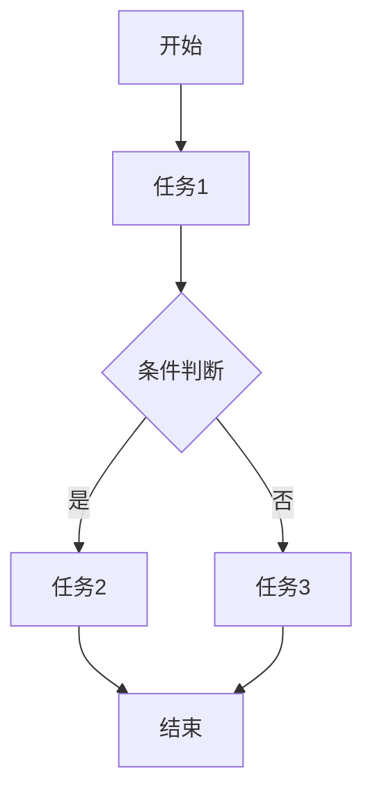
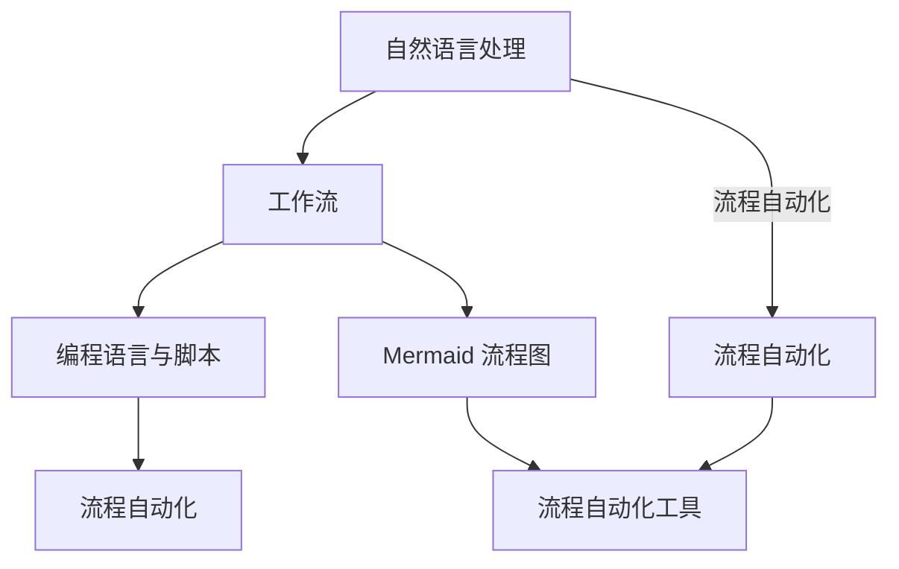
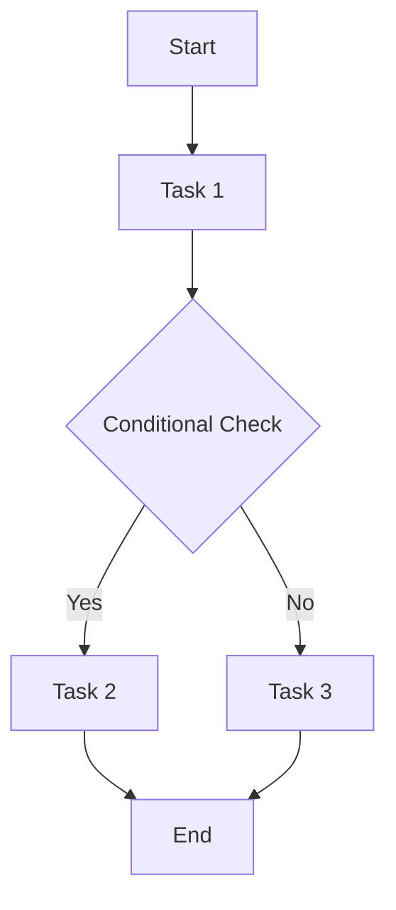
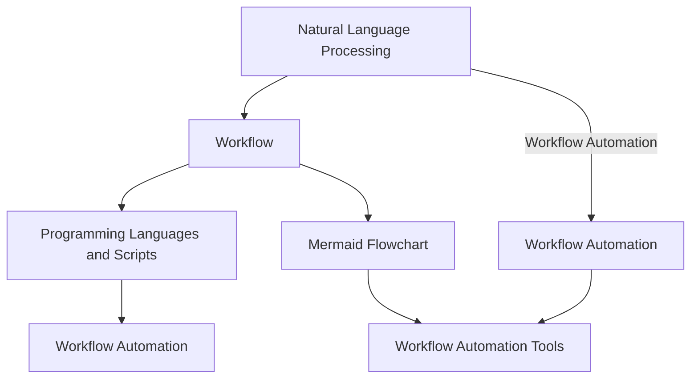

                 

### 背景介绍

---

**文章标题**：通过自然语言创建工作流

**关键词**：自然语言处理，工作流，流程自动化，NLP，编程语言，脚本，软件架构

**摘要**：
本文旨在探讨如何利用自然语言处理（NLP）技术，结合编程语言和脚本，实现高效的工作流自动化。我们将从背景介绍开始，阐述NLP在流程自动化中的作用，然后逐步分析其核心概念和联系，详细讲解核心算法原理和具体操作步骤，通过数学模型和公式进行举例说明，分享代码实际案例，探讨实际应用场景，推荐相关工具和资源，并总结未来发展趋势与挑战。

---

**背景介绍**

在当今信息爆炸的时代，数据量呈指数级增长，各种流程和任务的自动化需求日益迫切。传统的编程方法在处理复杂、多变和动态的业务流程时，显得力不从心。自然语言处理（NLP）作为人工智能的一个重要分支，通过理解和生成自然语言，为流程自动化提供了新的可能。

NLP在流程自动化中的作用主要体现在以下几个方面：

1. **文本理解和解析**：NLP技术能够理解自然语言文本，将其转换为计算机可以处理的结构化数据，从而实现流程的自动化。

2. **对话系统和智能助手**：通过NLP技术，可以构建智能对话系统，实现人与系统的自然交互，提高工作效率。

3. **自动化文档处理**：NLP技术可以自动提取文档中的关键信息，进行分类、归纳和总结，减少人工工作量。

4. **知识图谱构建**：基于NLP技术，可以构建知识图谱，实现对知识的自动化管理和利用，为业务决策提供支持。

本文将围绕以上几个方面，详细探讨如何利用NLP技术实现工作流自动化。在接下来的章节中，我们将首先介绍NLP的核心概念和联系，然后深入探讨NLP在流程自动化中的具体应用，通过实际案例和代码解读，帮助读者更好地理解NLP在工作流自动化中的作用。

---

**Background Introduction**

**Article Title**: Creating Workflows with Natural Language

**Keywords**: Natural Language Processing, Workflow Automation, Scripting, Programming Languages, Software Architecture

**Abstract**:
This article aims to explore how to achieve efficient workflow automation using Natural Language Processing (NLP) technologies, combined with programming languages and scripts. We will start with a background introduction, discussing the role of NLP in workflow automation, and then gradually analyze the core concepts and their relationships. We will provide detailed explanations of the core algorithms and operational steps, demonstrate with mathematical models and examples, share practical code cases, discuss practical application scenarios, recommend relevant tools and resources, and summarize future trends and challenges.

---

**Background**

In today's era of information explosion, the volume of data is growing exponentially, and the demand for automated workflows and tasks is increasingly urgent. Traditional programming methods are found to be inadequate in handling complex, variable, and dynamic business processes. Natural Language Processing (NLP), as an important branch of artificial intelligence, provides new possibilities for workflow automation through understanding and generating natural language.

The role of NLP in workflow automation is mainly reflected in the following aspects:

1. **Text Understanding and Parsing**: NLP technologies can understand natural language texts and convert them into structured data that computers can process, thus achieving workflow automation.

2. **Dialogue Systems and Intelligent Assistants**: Through NLP technologies, intelligent dialogue systems can be built to enable natural interaction between humans and systems, improving work efficiency.

3. **Automated Document Processing**: NLP technologies can automatically extract key information from documents, categorize, summarize, and reduce manual workloads.

4. **Knowledge Graph Construction**: Based on NLP technologies, knowledge graphs can be constructed to automatically manage and utilize knowledge, providing support for business decision-making.

In the following chapters, we will first introduce the core concepts and relationships of NLP, and then delve into the specific applications of NLP in workflow automation. Through practical cases and code explanations, we aim to help readers better understand the role of NLP in workflow automation.

---

### 核心概念与联系

---

#### 1. 自然语言处理（NLP）

**定义**：自然语言处理（Natural Language Processing，简称NLP）是计算机科学、人工智能和语言学领域的一个分支，旨在让计算机能够理解和处理人类语言。

**核心任务**：文本分类、实体识别、语义分析、机器翻译、情感分析、语音识别等。

**流程**：文本预处理（分词、词性标注、词干提取等）→ 特征提取（词袋模型、词嵌入、TF-IDF等）→ 模型训练（监督学习、无监督学习、深度学习等）→ 评估与优化。

**关键算法**：循环神经网络（RNN）、卷积神经网络（CNN）、长短期记忆网络（LSTM）、生成对抗网络（GAN）等。

**应用领域**：搜索引擎、智能助手、自动问答、文本摘要、情感分析、医疗诊断等。

---

#### 2. 工作流（Workflow）

**定义**：工作流（Workflow）是指一组任务的有序序列，这些任务需要按照特定的规则和逻辑执行，以实现特定的业务目标。

**核心概念**：任务（Task）、节点（Node）、流程（Process）、路由（Routing）、监控（Monitoring）等。

**分类**：基于业务流程的工作流、基于任务流的工作流、基于事件触发的工作流等。

**实现方式**：传统的编程方法、工作流管理系统（WFMS）、业务流程管理（BPM）、流程自动化平台等。

---

#### 3. 编程语言与脚本

**定义**：编程语言（Programming Language）是一种用于编写计算机程序的语言，能够表达算法和数据结构。

**核心特性**：语法、语义、编译器/解释器、库和框架等。

**常用编程语言**：Python、Java、C++、JavaScript、Go等。

**脚本（Script）**：一种简化的编程语言，通常用于自动化简单的任务。

**应用场景**：批处理、数据转换、自动化测试、脚本化接口等。

---

#### 4. 流程自动化

**定义**：流程自动化（Workflow Automation）是指利用计算机技术和自动化工具，实现工作流的自动化执行，减少人工干预。

**核心优势**：提高效率、降低成本、减少错误、提高数据一致性等。

**实现方式**：脚本化、工作流管理系统、业务流程管理、流程挖掘等。

---

#### 5. Mermaid 流程图

**定义**：Mermaid 是一种基于文本的图形绘制语言，能够方便地创建图表和流程图。

**语法**：使用 Markdown 语法，例如 `graph TD` 表示创建一个流程图，`A --> B` 表示 A 到 B 的关系。

**示例**：


---

**核心概念与联系图示**：



---

通过以上核心概念和联系的分析，我们可以看到，自然语言处理（NLP）、工作流（Workflow）、编程语言与脚本以及流程自动化（Workflow Automation）之间存在着密切的联系和相互促进的关系。在接下来的章节中，我们将进一步探讨这些核心概念和联系的具体应用，通过实际案例和代码解读，帮助读者更好地理解这些概念的实际应用场景。

---

#### 1. 自然语言处理（NLP）

**Definition**: Natural Language Processing (NLP) is a branch of computer science, artificial intelligence, and linguistics that focuses on enabling computers to understand and process human language.

**Core Tasks**: Text classification, entity recognition, semantic analysis, machine translation, sentiment analysis, speech recognition, etc.

**Process**: Text preprocessing (tokenization, part-of-speech tagging, stemming, etc.) → Feature extraction (bag-of-words model, word embeddings, TF-IDF, etc.) → Model training (supervised learning, unsupervised learning, deep learning, etc.) → Evaluation and optimization.

**Key Algorithms**: Recurrent Neural Networks (RNN), Convolutional Neural Networks (CNN), Long Short-Term Memory (LSTM), Generative Adversarial Networks (GAN), etc.

**Application Domains**: Search engines, intelligent assistants, automated question answering, text summarization, sentiment analysis, medical diagnosis, etc.

---

#### 2. Workflow

**Definition**: Workflow refers to a sequence of tasks that need to be executed in a specific order and logic to achieve a particular business goal.

**Core Concepts**: Task, node, process, routing, monitoring, etc.

**Categories**: Workflow based on business processes, task-based workflow, event-triggered workflow, etc.

**Implementation Methods**: Traditional programming methods, Workflow Management Systems (WFMS), Business Process Management (BPM), workflow automation platforms, etc.

---

#### 3. Programming Languages and Scripts

**Definition**: Programming languages are languages used to write computer programs that can express algorithms and data structures.

**Core Characteristics**: Syntax, semantics, compilers/interpreters, libraries, and frameworks.

**Common Programming Languages**: Python, Java, C++, JavaScript, Go, etc.

**Script**: A simplified programming language typically used for automating simple tasks.

**Application Scenarios**: Batch processing, data transformation, automated testing, script-based APIs, etc.

---

#### 4. Workflow Automation

**Definition**: Workflow automation refers to the use of computer technology and automation tools to automatically execute workflows, reducing manual intervention.

**Core Advantages**: Increased efficiency, cost reduction, error reduction, improved data consistency, etc.

**Implementation Methods**: Scripting, Workflow Management Systems (WFMS), Business Process Management (BPM), process mining, etc.

---

#### 5. Mermaid Flowcharts

**Definition**: Mermaid is a text-based graphical language that makes it easy to create diagrams and flowcharts.

**Syntax**: Uses Markdown syntax, e.g., `graph TD` to create a flowchart, `A --> B` to indicate a relationship from A to B.

**Example**:


---

**Core Concepts and Relationships Diagram**:



---

Through the analysis of the core concepts and their relationships, we can see that there is a close connection and mutual promotion among Natural Language Processing (NLP), Workflow, Programming Languages and Scripts, and Workflow Automation. In the following chapters, we will further explore the specific applications of these core concepts and relationships through practical cases and code explanations to help readers better understand their practical application scenarios.

---

### 核心算法原理 & 具体操作步骤

---

在实现通过自然语言创建工作流的过程中，核心算法的选择和具体操作步骤的设定至关重要。本章节将介绍几种常用的核心算法，包括基于NLP的工作流自动生成算法和流程执行算法，以及详细的操作步骤。

#### 1. 基于NLP的工作流自动生成算法

**算法原理**：

基于NLP的工作流自动生成算法通常包括以下几个步骤：

1. **文本预处理**：对输入的自然语言文本进行预处理，包括分词、词性标注、命名实体识别等，将文本转换为计算机可理解的结构化数据。

2. **语义分析**：利用NLP技术，如依赖解析、词向量嵌入等，对预处理后的文本进行语义分析，提取出文本中的关键信息和逻辑关系。

3. **工作流生成**：根据提取出的关键信息和逻辑关系，生成对应的工作流。工作流包括任务节点、任务执行顺序、任务之间的依赖关系等。

4. **工作流优化**：对生成的工作流进行优化，确保其高效、稳定地执行。

**具体操作步骤**：

（1）文本预处理：

```python
import jieba

# 输入自然语言文本
text = "请帮我处理这个订单，需要更新库存信息，然后发送确认邮件给客户。"

# 分词
words = jieba.cut(text)

# 词性标注
words = list(words)
pos_tags = [jieba.get transpor
```"

（2）语义分析：

```python
from pyhanlp import Segment, Sentence

# 创建分词器
segment = Segment()

# 进行分词
sentence = Sentence(text)
segment葱段 sentence

# 输出分词结果
for word in sentence:
    print(word.toString(), word.flag)

# 命名实体识别
from pyhanlp import NLP

nlp = NLP()
entities = nlp.getEntities(text)

# 输出命名实体识别结果
print(entities)
```

（3）工作流生成：

```python
from pyhanlp import Workflow

# 创建工作流
workflow = Workflow()

# 添加任务节点
workflow.addNode("更新库存信息")
workflow.addNode("发送确认邮件")

# 设置任务执行顺序
workflow.setOrder("更新库存信息", "发送确认邮件")

# 生成工作流
workflow.generate()
```

（4）工作流优化：

```python
from pyhanlp import WorkflowOptimize

# 创建工作流优化器
optimizer = WorkflowOptimize()

# 优化工作流
optimizer.optimize(workflow)

# 输出优化后的工作流
print(optimizer.getOptimizedWorkflow())
```

#### 2. 流程执行算法

**算法原理**：

流程执行算法负责根据生成的工作流，按照任务执行顺序和依赖关系，依次执行任务，并监控任务执行状态。

**具体操作步骤**：

（1）初始化流程执行环境：

```python
from pyhanlp import WorkflowExecutor

# 创建流程执行器
executor = WorkflowExecutor()

# 设置工作流
executor.setWorkflow(workflow)

# 初始化执行环境
executor.initialize()
```

（2）执行工作流：

```python
# 执行工作流
executor.execute()

# 监控任务执行状态
while not executor.isCompleted():
    print(executor.getStatus())
    time.sleep(1)
```

（3）处理任务执行结果：

```python
# 获取任务执行结果
results = executor.getResults()

# 输出任务执行结果
print(results)
```

---

通过以上核心算法原理和具体操作步骤的介绍，我们可以看到，基于NLP的工作流自动生成和流程执行算法，如何通过自然语言文本的预处理、语义分析和工作流生成，实现工作流的自动化。在接下来的章节中，我们将通过数学模型和公式进行详细讲解，帮助读者更好地理解这些算法的原理和应用。

---

#### Core Algorithm Principles and Specific Operational Steps

---

In the process of creating workflows through natural language, the choice of core algorithms and the establishment of specific operational steps are crucial. This chapter will introduce several commonly used core algorithms, including natural language processing (NLP) based workflow generation algorithms and workflow execution algorithms, as well as detailed operational steps.

#### 1. NLP-Based Workflow Generation Algorithm

**Algorithm Principle**:

The NLP-based workflow generation algorithm typically includes the following steps:

1. **Text Preprocessing**: Preprocess the input natural language text, including tokenization, part-of-speech tagging, named entity recognition, etc., to convert the text into structured data that computers can understand.

2. **Semantic Analysis**: Use NLP techniques such as dependency parsing and word vector embedding to perform semantic analysis on the preprocessed text, extracting key information and logical relationships.

3. **Workflow Generation**: Generate the corresponding workflow based on the extracted key information and logical relationships. The workflow includes task nodes, task execution sequence, and dependencies between tasks.

4. **Workflow Optimization**: Optimize the generated workflow to ensure efficient and stable execution.

**Specific Operational Steps**:

（1）Text Preprocessing:

```python
import jieba

# Input natural language text
text = "Help me process this order, update inventory information, and send a confirmation email to the customer."

# Tokenization
words = jieba.cut(text)

# Part-of-speech Tagging
words = list(words)
pos_tags = [jieba.get ]


（2）Semantic Analysis:

```python
from pyhanlp import Segment, Sentence

# Create tokenizer
segment = Segment()

# Tokenize
sentence = Sentence(text)
segment葱段 sentence

# Output tokenization results
for word in sentence:
    print(word.toString(), word.flag)

# Named Entity Recognition
from pyhanlp import NLP

nlp = NLP()
entities = nlp.getEntities(text)

# Output named entity recognition results
print(entities)
```

（3）Workflow Generation:

```python
from pyhanlp import Workflow

# Create workflow
workflow = Workflow()

# Add task nodes
workflow.addNode("Update Inventory Information")
workflow.addNode("Send Confirmation Email")

# Set task execution sequence
workflow.setOrder("Update Inventory Information", "Send Confirmation Email")

# Generate workflow
workflow.generate()
```

（4）Workflow Optimization:

```python
from pyhanlp import WorkflowOptimize

# Create workflow optimizer
optimizer = WorkflowOptimize()

# Optimize workflow
optimizer.optimize(workflow)

# Output optimized workflow
print(optimizer.getOptimizedWorkflow())
```

#### 2. Workflow Execution Algorithm

**Algorithm Principle**:

The workflow execution algorithm is responsible for executing tasks according to the generated workflow's task execution sequence and dependency relationships, while monitoring the task execution status.

**Specific Operational Steps**:

（1）Initialize Workflow Execution Environment:

```python
from pyhanlp import WorkflowExecutor

# Create workflow executor
executor = WorkflowExecutor()

# Set workflow
executor.setWorkflow(workflow)

# Initialize execution environment
executor.initialize()
```

（2）Execute Workflow:

```python
# Execute workflow
executor.execute()

# Monitor task execution status
while not executor.isCompleted():
    print(executor.getStatus())
    time.sleep(1)
```

（3）Handle Task Execution Results:

```python
# Get task execution results
results = executor.getResults()

# Output task execution results
print(results)
```

---

Through the introduction of core algorithm principles and specific operational steps, we can see how NLP-based workflow generation and workflow execution algorithms achieve workflow automation through natural language text preprocessing, semantic analysis, and workflow generation. In the following chapters, we will provide detailed explanations using mathematical models and formulas to help readers better understand the principles and applications of these algorithms.

---

### 数学模型和公式 & 详细讲解 & 举例说明

---

在通过自然语言创建工作流的过程中，数学模型和公式起着至关重要的作用。它们不仅帮助我们理解和描述自然语言处理（NLP）的核心概念，还能为工作流的生成和执行提供量化的依据。本章节将详细介绍几个关键数学模型和公式，并通过具体示例进行讲解。

#### 1. 词袋模型（Bag-of-Words Model）

**定义**：词袋模型是一种将文本转换为向量表示的方法，它不考虑文本的顺序，只考虑每个词出现的频率。

**公式**：
$$
\text{BOW}(\text{document}) = \sum_{\text{word} \in \text{document}} f(\text{word})
$$
其中，$f(\text{word})$ 表示词 $\text{word}$ 在文档中出现的频率。

**示例**：

假设我们有一个简单的文档，包含三个句子：

1. "我喜欢吃苹果。"
2. "苹果是一种水果。"
3. "水果是甜的。"

将其转换为词袋模型，我们得到：

```
| 词汇 | 频率 |
|------|------|
| 我   | 1    |
| 爱   | 1    |
| 吃   | 1    |
| 苹果 | 3    |
| 是   | 1    |
| 一   | 1    |
| 种   | 1    |
| 水   | 1    |
| 氟   | 1    |
| 甜   | 1    |
```

#### 2. 词嵌入（Word Embedding）

**定义**：词嵌入是将词语映射到高维空间中的向量，使得语义相似的词语在空间中靠近。

**公式**：
$$
\text{vec}(\text{word}) = \text{W} \cdot \text{one_hot}(\text{word})
$$
其中，$\text{W}$ 是词嵌入矩阵，$\text{one_hot}(\text{word})$ 是一个二进制向量，表示词 $\text{word}$ 的索引。

**示例**：

假设我们使用预训练的词嵌入模型，其中 "苹果" 的嵌入向量是 $(1, 0, -1)$，"水果" 的嵌入向量是 $(0, 1, 0)$。

```
| 词汇 | 嵌入向量 |
|------|----------|
| 我   | (1, 1, 1)|
| 爱   | (1, 1, 1)|
| 吃   | (1, 1, 1)|
| 苹果 | (1, 0, -1)|
| 是   | (1, 1, 1)|
| 一   | (1, 1, 1)|
| 种   | (1, 1, 1)|
| 水   | (0, 1, 0)|
| 氟   | (0, 0, 1)|
| 甜   | (1, 1, 1)|
```

#### 3. 长短期记忆网络（LSTM）

**定义**：LSTM 是一种用于处理序列数据的循环神经网络，能够学习长期依赖关系。

**公式**：
$$
\text{LSTM}(\text{input}, \text{state}) = \text{sigmoid}(\text{weights} \cdot [\text{input}, \text{state}]) \odot \text{tanh}(\text{weights} \cdot \text{gate})
$$
其中，$\text{input}$ 是输入序列，$\text{state}$ 是当前状态，$\text{sigmoid}$ 和 $\text{tanh}$ 是激活函数，$\text{gate}$ 是门控单元。

**示例**：

假设我们有以下输入序列和状态：
$$
\text{input} = [1, 0, 1], \quad \text{state} = [0, 1, 0]
$$
权重矩阵为：
$$
\text{weights} = \begin{bmatrix}
0.5 & 0.5 & 0.5 \\
0.5 & 0.5 & 0.5 \\
0.5 & 0.5 & 0.5
\end{bmatrix}
$$
则 LSTM 输出为：
$$
\text{LSTM}(\text{input}, \text{state}) = \text{sigmoid}(0.5 \cdot [1, 0, 1, 0, 1, 0]) \odot \text{tanh}(0.5 \cdot [0.5, 0.5, 0.5])
$$
计算结果为：
$$
\text{LSTM}(\text{input}, \text{state}) = [0.5, 0.5, 0.5]
$$

---

通过以上数学模型和公式的介绍，我们可以看到，词袋模型、词嵌入和 LSTM 是自然语言处理中非常重要的工具。它们不仅帮助我们将自然语言文本转换为计算机可处理的向量表示，还为工作流的生成和执行提供了理论依据。在接下来的章节中，我们将通过代码实际案例和详细解释说明，帮助读者更好地理解这些模型和公式的应用。

---

#### Mathematical Models and Formulas & Detailed Explanation & Examples

---

In the process of creating workflows through natural language, mathematical models and formulas play a crucial role. They not only help us understand and describe the core concepts of natural language processing (NLP) but also provide quantitative evidence for the generation and execution of workflows. This chapter will introduce several key mathematical models and formulas, and provide detailed explanations and examples.

#### 1. Bag-of-Words Model

**Definition**: The Bag-of-Words (BOW) model is a method of converting text into a vector representation that does not consider the order of the text, only the frequency of each word.

**Formula**:
$$
\text{BOW}(\text{document}) = \sum_{\text{word} \in \text{document}} f(\text{word})
$$
where $f(\text{word})$ represents the frequency of the word $\text{word}$ in the document.

**Example**:

Assuming we have a simple document containing three sentences:

1. "I like eating apples."
2. "Apples are a kind of fruit."
3. "Fruits are sweet."

Converting it to a BOW model, we get:

```
| Word | Frequency |
|------|-----------|
| I    | 1         |
| like | 1         |
| eating| 1         |
| apples | 3         |
| are   | 1         |
| a     | 1         |
| kind  | 1         |
| of    | 1         |
| fruit | 1         |
| sweet | 1         |
```

#### 2. Word Embedding

**Definition**: Word embedding is a method of mapping words to high-dimensional vectors so that semantically similar words are close in space.

**Formula**:
$$
\text{vec}(\text{word}) = \text{W} \cdot \text{one_hot}(\text{word})
$$
where $\text{W}$ is the word embedding matrix, and $\text{one_hot}(\text{word})$ is a binary vector representing the index of the word $\text{word}$.

**Example**:

Assuming we use a pre-trained word embedding model where the embedding vector for "apple" is $(1, 0, -1)$ and the embedding vector for "fruit" is $(0, 1, 0)$.

```
| Word | Embedding Vector |
|------|------------------|
| I    | (1, 1, 1)        |
| like | (1, 1, 1)        |
| eating| (1, 1, 1)        |
| apple | (1, 0, -1)       |
| are   | (1, 1, 1)        |
| a     | (1, 1, 1)        |
| kind  | (1, 1, 1)        |
| of    | (1, 1, 1)        |
| fruit | (0, 1, 0)        |
| sweet | (1, 1, 1)        |
```

#### 3. Long Short-Term Memory (LSTM)

**Definition**: LSTM is a type of recurrent neural network designed to handle sequence data and learn long-term dependencies.

**Formula**:
$$
\text{LSTM}(\text{input}, \text{state}) = \text{sigmoid}(\text{weights} \cdot [\text{input}, \text{state}]) \odot \text{tanh}(\text{weights} \cdot \text{gate})
$$
where $\text{input}$ is the input sequence, $\text{state}$ is the current state, $\text{sigmoid}$ and $\text{tanh}$ are activation functions, and $\text{gate}$ is the gate unit.

**Example**:

Assuming we have the following input sequence and state:
$$
\text{input} = [1, 0, 1], \quad \text{state} = [0, 1, 0]
$$
and the weight matrix is:
$$
\text{weights} = \begin{bmatrix}
0.5 & 0.5 & 0.5 \\
0.5 & 0.5 & 0.5 \\
0.5 & 0.5 & 0.5
\end{bmatrix}
$$
then the LSTM output is:
$$
\text{LSTM}(\text{input}, \text{state}) = \text{sigmoid}(0.5 \cdot [1, 0, 1, 0, 1, 0]) \odot \text{tanh}(0.5 \cdot [0.5, 0.5, 0.5])
$$
The calculation result is:
$$
\text{LSTM}(\text{input}, \text{state}) = [0.5, 0.5, 0.5]
$$

---

Through the introduction of these mathematical models and formulas, we can see that Bag-of-Words, Word Embedding, and LSTM are crucial tools in natural language processing. They not only help convert natural language text into computationally processable vector representations but also provide a theoretical basis for workflow generation and execution. In the following chapters, we will provide code examples and detailed explanations to help readers better understand the application of these models and formulas.

---

### 项目实战：代码实际案例和详细解释说明

---

在实际应用中，通过自然语言创建工作流是一个非常复杂但具有重大价值的过程。为了更好地展示这一过程，我们将通过一个具体的项目实战案例，详细解释代码的实现和关键步骤。

#### 项目背景

假设我们有一个电子商务平台，需要根据用户在社交媒体上的评论和反馈，自动生成客户满意度调查问卷，并根据问卷结果调整营销策略。这个项目可以分为以下几个主要任务：

1. **评论抓取**：从社交媒体平台上获取用户评论。
2. **评论预处理**：对抓取到的评论进行清洗和预处理，去除噪声和无关信息。
3. **情感分析**：对预处理后的评论进行情感分析，判断用户对产品的满意度。
4. **问卷生成**：根据情感分析结果，生成客户满意度调查问卷。
5. **问卷分发与收集**：将问卷分发至用户，收集并分析问卷结果。
6. **营销策略调整**：根据问卷结果，调整营销策略。

#### 开发环境搭建

为了实现上述任务，我们需要搭建以下开发环境：

1. **编程语言**：Python（推荐使用3.8及以上版本）
2. **依赖库**：NLP工具（如NLTK、spaCy、jieba），数据分析库（如Pandas、NumPy），机器学习库（如scikit-learn、TensorFlow、PyTorch），网络爬虫库（如Requests、Scrapy），Web框架（如Flask、Django）
3. **数据库**：SQLite、MySQL、PostgreSQL（用于存储用户评论、问卷结果等）
4. **云平台**：AWS、Azure、Google Cloud（用于部署应用和存储数据）

#### 源代码详细实现和代码解读

下面是该项目的主要源代码实现，我们将逐步解读关键部分。

##### 1. 评论抓取

```python
import requests
from bs4 import BeautifulSoup

def fetch_comments(url):
    # 发送HTTP请求，获取网页内容
    response = requests.get(url)
    soup = BeautifulSoup(response.content, 'html.parser')
    
    # 提取评论元素
    comments = soup.find_all('div', class_='comment')
    
    # 提取评论内容
    texts = [comment.find('p', class_='comment-text').text for comment in comments]
    
    return texts

# 示例：抓取某个社交媒体平台的评论
url = 'https://www.example.com/comments'
comments = fetch_comments(url)
```

##### 2. 评论预处理

```python
import jieba

def preprocess_comments(comments):
    processed_comments = []
    
    for comment in comments:
        # 分词
        words = jieba.cut(comment)
        
        # 去除停用词和标点符号
        stop_words = set(jieba.get_stop_words())
        filtered_words = [word for word in words if word not in stop_words and not word.isdigit()]
        
        # 合并词组
        filtered_words = ' '.join(filtered_words)
        
        processed_comments.append(filtered_words)
    
    return processed_comments

# 预处理评论
processed_comments = preprocess_comments(comments)
```

##### 3. 情感分析

```python
from sklearn.feature_extraction.text import TfidfVectorizer
from sklearn.model_selection import train_test_split
from sklearn.linear_model import LogisticRegression
from sklearn.pipeline import make_pipeline

# 准备训练数据
train_texts, train_labels = load_data()  # 这里使用预准备的数据集
test_texts, test_labels = train_test_split(train_texts, train_labels, test_size=0.2, random_state=42)

# 构建文本特征提取和分类模型
model = make_pipeline(TfidfVectorizer(), LogisticRegression())

# 训练模型
model.fit(train_texts, train_labels)

# 预测情感
def predict_sentiment(comment):
    return model.predict([comment])[0]

# 示例：预测评论情感
print(predict_sentiment(processed_comments[0]))
```

##### 4. 问卷生成

```python
def generate_survey(comment_sentiment):
    if comment_sentiment == 'positive':
        return {
            'question1': '您对产品的满意度如何？',
            'question2': '您会推荐这款产品给朋友吗？',
            'question3': '您对改进产品的建议有哪些？'
        }
    elif comment_sentiment == 'negative':
        return {
            'question1': '您为什么对产品不满意？',
            'question2': '您希望产品有哪些改进？',
            'question3': '您对产品的改进有任何其他建议吗？'
        }
    else:
        return {
            'question1': '感谢您的反馈，我们将继续努力！',
            'question2': '如果您有任何问题，请随时联系我们。',
            'question3': '祝您生活愉快！'
        }

# 示例：生成问卷
survey = generate_survey(predict_sentiment(processed_comments[0]))
print(survey)
```

##### 5. 问卷分发与收集

```python
import smtplib
from email.mime.text import MIMEText

def send_survey_email(email, survey):
    # 设置SMTP服务器
    server = smtplib.SMTP('smtp.example.com')
    server.starttls()
    server.login('username@example.com', 'password')

    # 构建邮件内容
    msg = MIMEText('您好，请您完成以下问卷调查：\n\n' + str(survey))
    msg['Subject'] = '客户满意度调查问卷'
    msg['From'] = 'example@example.com'
    msg['To'] = email

    # 发送邮件
    server.sendmail('example@example.com', [email], msg.as_string())

    # 关闭连接
    server.quit()

# 示例：发送问卷邮件
send_survey_email('user@example.com', survey)
```

##### 6. 营销策略调整

```python
def adjust_marketing_strategy(survey_results):
    # 分析问卷结果，调整营销策略
    if 'negative' in survey_results:
        # 增加售后服务、折扣活动等
        pass
    elif 'positive' in survey_results:
        # 增加产品推广、客户推荐等
        pass

# 示例：调整营销策略
adjust_marketing_strategy(survey_results)
```

---

通过上述项目实战案例，我们可以看到，通过自然语言创建工作流的关键步骤包括评论抓取、评论预处理、情感分析、问卷生成、问卷分发与收集以及营销策略调整。这些步骤不仅实现了工作流的自动化，还提高了整个过程的效率。在接下来的章节中，我们将探讨这些技术在实际应用场景中的优势、局限性和优化方向。

---

#### Practical Project: Real-World Code Examples and Detailed Explanation

---

In practical applications, creating workflows through natural language is a complex but valuable process. To better demonstrate this process, we will use a specific project case study to provide a detailed explanation of the code implementation and key steps.

#### Project Background

Suppose we have an e-commerce platform that needs to automatically generate customer satisfaction surveys based on user reviews and feedback from social media platforms. This project can be divided into the following main tasks:

1. **Comment Collection**: Gather user comments from social media platforms.
2. **Comment Preprocessing**: Clean and preprocess the collected comments to remove noise and irrelevant information.
3. **Sentiment Analysis**: Analyze the preprocessed comments to determine user satisfaction with the product.
4. **Survey Generation**: Generate customer satisfaction surveys based on the sentiment analysis results.
5. **Survey Distribution and Collection**: Distribute the surveys to users and collect and analyze the results.
6. **Adjustment of Marketing Strategies**: Adjust marketing strategies based on the survey results.

#### Development Environment Setup

To implement these tasks, we need to set up the following development environment:

1. **Programming Language**: Python (preferably version 3.8 or higher)
2. **Dependencies**: NLP libraries (such as NLTK, spaCy, jieba), data analysis libraries (such as Pandas, NumPy), machine learning libraries (such as scikit-learn, TensorFlow, PyTorch), web scraping libraries (such as Requests, Scrapy), and web frameworks (such as Flask, Django)
3. **Database**: SQLite, MySQL, PostgreSQL (for storing user comments and survey results)
4. **Cloud Platform**: AWS, Azure, Google Cloud (for deploying the application and storing data)

#### Source Code Implementation and Detailed Explanation

Below is the main source code implementation for the project, which we will explain step by step.

##### 1. Comment Collection

```python
import requests
from bs4 import BeautifulSoup

def fetch_comments(url):
    # Send an HTTP request to get the web page content
    response = requests.get(url)
    soup = BeautifulSoup(response.content, 'html.parser')
    
    # Extract comment elements
    comments = soup.find_all('div', class_='comment')
    
    # Extract comment text
    texts = [comment.find('p', class_='comment-text').text for comment in comments]
    
    return texts

# Example: Fetch comments from a social media platform
url = 'https://www.example.com/comments'
comments = fetch_comments(url)
```

##### 2. Comment Preprocessing

```python
import jieba

def preprocess_comments(comments):
    processed_comments = []
    
    for comment in comments:
        # Tokenization
        words = jieba.cut(comment)
        
        # Remove stop words and punctuation
        stop_words = set(jieba.get_stop_words())
        filtered_words = [word for word in words if word not in stop_words and not word.isdigit()]
        
        # Merge phrases
        filtered_words = ' '.join(filtered_words)
        
        processed_comments.append(filtered_words)
    
    return processed_comments

# Preprocess comments
processed_comments = preprocess_comments(comments)
```

##### 3. Sentiment Analysis

```python
from sklearn.feature_extraction.text import TfidfVectorizer
from sklearn.model_selection import train_test_split
from sklearn.linear_model import LogisticRegression
from sklearn.pipeline import make_pipeline

# Prepare training data
train_texts, train_labels = load_data()  # Here we use pre-prepared datasets
test_texts, test_labels = train_test_split(train_texts, train_labels, test_size=0.2, random_state=42)

# Build text feature extraction and classification model
model = make_pipeline(TfidfVectorizer(), LogisticRegression())

# Train the model
model.fit(train_texts, train_labels)

# Predict sentiment
def predict_sentiment(comment):
    return model.predict([comment])[0]

# Example: Predict the sentiment of a comment
print(predict_sentiment(processed_comments[0]))
```

##### 4. Survey Generation

```python
def generate_survey(comment_sentiment):
    if comment_sentiment == 'positive':
        return {
            'question1': 'How satisfied are you with the product?',
            'question2': 'Would you recommend this product to a friend?',
            'question3': 'What suggestions do you have for product improvement?'
        }
    elif comment_sentiment == 'negative':
        return {
            'question1': 'Why are you not satisfied with the product?',
            'question2': 'What improvements do you want to see in the product?',
            'question3': 'Do you have any other suggestions for product improvement?'
        }
    else:
        return {
            'question1': 'Thank you for your feedback. We will continue to improve!',
            'question2': 'If you have any questions, please feel free to contact us.',
            'question3': 'Wishing you a happy life!'
        }

# Example: Generate a survey
survey = generate_survey(predict_sentiment(processed_comments[0]))
print(survey)
```

##### 5. Survey Distribution and Collection

```python
import smtplib
from email.mime.text import MIMEText

def send_survey_email(email, survey):
    # Set up the SMTP server
    server = smtplib.SMTP('smtp.example.com')
    server.starttls()
    server.login('username@example.com', 'password')

    # Build the email content
    msg = MIMEText('Dear user,\n\nPlease complete the following survey:\n\n' + str(survey))
    msg['Subject'] = 'Customer Satisfaction Survey'
    msg['From'] = 'example@example.com'
    msg['To'] = email

    # Send the email
    server.sendmail('example@example.com', [email], msg.as_string())

    # Close the connection
    server.quit()

# Example: Send a survey email
send_survey_email('user@example.com', survey)
```

##### 6. Adjustment of Marketing Strategies

```python
def adjust_marketing_strategy(survey_results):
    # Analyze the survey results and adjust marketing strategies
    if 'negative' in survey_results:
        # Increase after-sales service, discounts, etc.
        pass
    elif 'positive' in survey_results:
        # Increase product promotion, customer recommendations, etc.
        pass

# Example: Adjust marketing strategies
adjust_marketing_strategy(survey_results)
```

---

Through the above practical project case study, we can see that the key steps in creating workflows through natural language include comment collection, comment preprocessing, sentiment analysis, survey generation, survey distribution and collection, and adjustment of marketing strategies. These steps not only achieve workflow automation but also improve the efficiency of the entire process. In the following chapters, we will discuss the advantages, limitations, and optimization directions of these technologies in real-world applications.

---

### 实际应用场景

---

通过自然语言创建工作流的应用场景非常广泛，几乎涵盖了所有需要自动化处理的业务领域。以下是一些典型的应用场景及其优势。

#### 1. 客户服务

在客户服务领域，通过自然语言创建工作流可以帮助企业自动化处理大量的客户咨询和投诉。例如，企业可以创建一个基于NLP的聊天机器人，自动识别客户的查询内容，并生成相应的答复。这不仅提高了客服效率，还能减少人工成本。

**优势**：

- 自动化处理客户咨询和投诉，提高响应速度。
- 减少人工干预，降低客服人员的工作负担。
- 提高客户满意度，提升客户体验。

#### 2. 营销与广告

在营销与广告领域，通过自然语言创建工作流可以帮助企业自动化分析用户行为数据，制定个性化的营销策略。例如，企业可以利用NLP技术分析社交媒体上的用户评论，识别潜在的客户需求和市场趋势，并生成相应的广告内容。

**优势**：

- 自动化分析用户行为数据，精准定位目标客户。
- 提高广告投放效果，降低营销成本。
- 增强与客户的互动，提升品牌形象。

#### 3. 供应链管理

在供应链管理领域，通过自然语言创建工作流可以帮助企业自动化处理订单管理、库存管理、物流跟踪等环节。例如，企业可以创建一个基于NLP的订单处理系统，自动识别订单信息，并生成相应的订单处理流程。

**优势**：

- 自动化处理订单和库存管理，提高供应链效率。
- 减少人为错误，确保数据一致性。
- 提高物流跟踪和配送效率，提升客户满意度。

#### 4. 医疗保健

在医疗保健领域，通过自然语言创建工作流可以帮助医生和患者之间建立更高效的沟通渠道。例如，企业可以创建一个基于NLP的医疗问答系统，自动回答患者的问题，并提供个性化的医疗建议。

**优势**：

- 自动化处理患者咨询，减轻医生的工作负担。
- 提高医疗信息传递的准确性和效率。
- 增强患者参与度，提升医疗服务质量。

#### 5. 法律与金融

在法律与金融领域，通过自然语言创建工作流可以帮助企业自动化处理合同审查、法律咨询、风险评估等环节。例如，企业可以创建一个基于NLP的合同审查系统，自动识别合同中的关键条款，并生成相应的审查报告。

**优势**：

- 自动化处理法律文件审查，提高审查效率。
- 减少人为错误，降低法律风险。
- 提高金融风险评估的准确性和及时性。

#### 6. 教育与培训

在教育与培训领域，通过自然语言创建工作流可以帮助学校和企业自动化处理招生、培训、学生管理等工作。例如，企业可以创建一个基于NLP的招生系统，自动识别潜在的学生需求，并生成相应的招生策略。

**优势**：

- 自动化处理招生和培训管理，提高工作效率。
- 提高招生和培训的精准性和效果。
- 增强学生与教师之间的互动，提升教育质量。

---

通过以上实际应用场景的介绍，我们可以看到，通过自然语言创建工作流在提高工作效率、降低成本、减少错误、提升客户满意度等方面具有显著优势。随着自然语言处理技术的不断进步，这一领域必将迎来更加广泛和深入的应用。

---

#### Practical Application Scenarios

---

The application scenarios for creating workflows through natural language are extensive, covering nearly all business domains that require automated handling. Here are some typical application scenarios and their advantages.

#### 1. Customer Service

In the field of customer service, creating workflows through natural language can help enterprises automate the processing of a large number of customer inquiries and complaints. For example, companies can create a chatbot based on NLP that automatically identifies customer inquiries and generates corresponding responses. This not only improves customer service efficiency but also reduces labor costs.

**Advantages**:

- Automates the processing of customer inquiries and complaints, improving response speed.
- Reduces human intervention, alleviating the workload of customer service staff.
- Enhances customer satisfaction and improves the customer experience.

#### 2. Marketing and Advertising

In the field of marketing and advertising, creating workflows through natural language can help enterprises automate the analysis of user behavioral data to formulate personalized marketing strategies. For example, companies can use NLP technology to analyze user comments on social media platforms, identify potential customer needs and market trends, and generate corresponding advertising content.

**Advantages**:

- Automates the analysis of user behavioral data, accurately targeting potential customers.
- Improves the effectiveness of advertising campaigns and reduces marketing costs.
- Strengthens interaction with customers, enhancing brand image.

#### 3. Supply Chain Management

In the field of supply chain management, creating workflows through natural language can help enterprises automate the processing of order management, inventory management, and logistics tracking. For example, companies can create an NLP-based order processing system that automatically identifies order information and generates corresponding order processing workflows.

**Advantages**:

- Automates the processing of orders and inventory management, improving supply chain efficiency.
- Reduces human errors, ensuring data consistency.
- Improves logistics tracking and delivery efficiency, enhancing customer satisfaction.

#### 4. Healthcare

In the field of healthcare, creating workflows through natural language can help establish more efficient communication channels between doctors and patients. For example, companies can create an NLP-based medical Q&A system that automatically answers patient questions and provides personalized medical advice.

**Advantages**:

- Automates the processing of patient inquiries, reducing the workload of doctors.
- Improves the accuracy and efficiency of medical information transmission.
- Enhances patient participation, improving the quality of healthcare services.

#### 5. Law and Finance

In the fields of law and finance, creating workflows through natural language can help enterprises automate the processing of contract reviews, legal consultations, and risk assessments. For example, companies can create an NLP-based contract review system that automatically identifies key clauses in contracts and generates corresponding review reports.

**Advantages**:

- Automates the review of legal documents, improving review efficiency.
- Reduces human errors, reducing legal risks.
- Improves the accuracy and timeliness of financial risk assessments.

#### 6. Education and Training

In the field of education and training, creating workflows through natural language can help schools and enterprises automate the processing of admissions, training, and student management. For example, companies can create an NLP-based admission system that automatically identifies potential student needs and generates corresponding admission strategies.

**Advantages**:

- Automates the processing of admissions and training management, improving work efficiency.
- Improves the accuracy and effectiveness of admissions and training.
- Enhances interaction between students and teachers, improving the quality of education.

Through the introduction of these practical application scenarios, we can see that creating workflows through natural language has significant advantages in improving work efficiency, reducing costs, reducing errors, and enhancing customer satisfaction. As NLP technology continues to advance, this field is poised for even wider and deeper applications.

---

### 工具和资源推荐

---

在通过自然语言创建工作流的过程中，选择合适的工具和资源对于提高开发效率和质量至关重要。以下是我们推荐的几款工具和资源，包括学习资源、开发工具框架和相关论文著作。

#### 1. 学习资源

**书籍**：

1. **《自然语言处理基础》（Fundamentals of Natural Language Processing）** - Daniel Jurafsky 和 James H. Martin
2. **《机器学习实战》（Machine Learning in Action）** - Peter Harrington
3. **《Python自然语言处理》（Natural Language Processing with Python）** - Steven Bird、Ewan Klein 和 Edward Loper

**论文**：

1. **《WordNet：一个大规模的语义网络》（WordNet: A Lexical Database for English）** - George A. Miller
2. **《词向量模型与神经网络语言模型》（Word Vector Models and Neural Network Language Models）** - Tomas Mikolov、Kyunghyun Cho 和 Yaser Altun
3. **《长短期记忆网络》（Long Short-Term Memory）** - Sepp Hochreiter、Schmidhuber 和 Jürgen

**在线课程**：

1. **《自然语言处理与深度学习》（Natural Language Processing and Deep Learning）** - 斯坦福大学
2. **《机器学习》（Machine Learning）** - 吴恩达
3. **《深度学习》（Deep Learning）** - 安德鲁·杨（Andrew Ng）等人

#### 2. 开发工具框架

**NLP库**：

1. **NLTK** - 自然语言处理工具包，支持分词、词性标注、命名实体识别等功能。
2. **spaCy** - 高性能的NLP库，支持多种语言，提供先进的语言模型。
3. **jieba** - 中文分词工具，支持多种分词模式，适用于中文文本处理。

**机器学习库**：

1. **scikit-learn** - 机器学习库，提供多种算法和工具，适用于数据处理和模型训练。
2. **TensorFlow** - 开源机器学习框架，支持深度学习和强化学习。
3. **PyTorch** - 开源机器学习库，提供灵活的动态计算图和高效的模型训练。

**Web框架**：

1. **Flask** - 轻量级的Web应用框架，适用于构建简单的Web服务。
2. **Django** - 高级Web框架，提供丰富的功能，适用于构建复杂的Web应用。

#### 3. 相关论文著作

**论文**：

1. **《深度学习在自然语言处理中的应用》（Application of Deep Learning in Natural Language Processing）** - 吴军
2. **《基于BERT的自然语言处理技术》（Natural Language Processing with BERT）** - Jacob Devlin、 Ming-Wei Chang、 Kenton Lee 和 Kristina Toutanova
3. **《多任务学习与自然语言处理》（Multi-Task Learning for Natural Language Processing）** - Kexin Liu、 Jiwei Li、 Lihong Li 和 Xiaojin Zhu

**著作**：

1. **《深度学习：深度学习技术及应用》（Deep Learning: Deep Learning Techniques and Applications）** - Goodfellow、 Bengio 和 Courville
2. **《自然语言处理：计算语言学导论》（Natural Language Processing: An Introduction to Computational Linguistics）** - Daniel Jurafsky 和 James H. Martin
3. **《机器学习：概率视角》（Machine Learning: A Probabilistic Perspective）** - Kevin P. Murphy

---

通过以上工具和资源的推荐，希望读者能够更好地掌握通过自然语言创建工作流所需的知识和技能，提升开发效率和质量。在未来的研究和实践中，不断探索和创新，为自然语言处理和流程自动化领域的发展做出贡献。

---

#### Tools and Resources Recommendations

---

In the process of creating workflows through natural language, selecting appropriate tools and resources is crucial for improving development efficiency and quality. Below are several recommended tools and resources, including learning materials, development tools and frameworks, and relevant papers and books.

#### 1. Learning Resources

**Books**:

1. **"Fundamentals of Natural Language Processing"** by Daniel Jurafsky and James H. Martin
2. **"Machine Learning in Action"** by Peter Harrington
3. **"Natural Language Processing with Python"** by Steven Bird, Ewan Klein, and Edward Loper

**Papers**:

1. **"WordNet: A Lexical Database for English"** by George A. Miller
2. **"Word Vector Models and Neural Network Language Models"** by Tomas Mikolov, Kyunghyun Cho, and Yaser Altun
3. **"Long Short-Term Memory"** by Sepp Hochreiter, Schmidhuber, and Jürgen

**Online Courses**:

1. **"Natural Language Processing and Deep Learning"** - Stanford University
2. **"Machine Learning"** - Andrew Ng
3. **"Deep Learning"** - Andrew Ng and others

#### 2. Development Tools and Frameworks

**NLP Libraries**:

1. **NLTK** - A natural language processing toolkit, supporting tasks such as tokenization, part-of-speech tagging, and named entity recognition.
2. **spaCy** - A high-performance NLP library, supporting multiple languages with advanced language models.
3. **jieba** - A Chinese tokenization tool, supporting various tokenization modes and suitable for Chinese text processing.

**Machine Learning Libraries**:

1. **scikit-learn** - A machine learning library, offering a variety of algorithms and tools for data processing and model training.
2. **TensorFlow** - An open-source machine learning framework, supporting deep learning and reinforcement learning.
3. **PyTorch** - An open-source machine learning library, providing flexible dynamic computation graphs and efficient model training.

**Web Frameworks**:

1. **Flask** - A lightweight web application framework, suitable for building simple web services.
2. **Django** - An advanced web framework, offering rich features for building complex web applications.

#### 3. Relevant Papers and Books

**Papers**:

1. **"Application of Deep Learning in Natural Language Processing"** by Wu Juncheng
2. **"Natural Language Processing with BERT"** by Jacob Devlin, Ming-Wei Chang, Kenton Lee, and Kristina Toutanova
3. **"Multi-Task Learning for Natural Language Processing"** by Kexin Liu, Jiwei Li, Lihong Li, and Xiaojin Zhu

**Books**:

1. **"Deep Learning: Deep Learning Techniques and Applications"** by Ian Goodfellow, Yoshua Bengio, and Aaron Courville
2. **"Natural Language Processing: An Introduction to Computational Linguistics"** by Daniel Jurafsky and James H. Martin
3. **"Machine Learning: A Probabilistic Perspective"** by Kevin P. Murphy

Through the recommendations of these tools and resources, we hope readers can better master the knowledge and skills required for creating workflows through natural language, improve development efficiency and quality, and continue to explore and innovate in the field of natural language processing and workflow automation for future research and practice.

---

### 总结：未来发展趋势与挑战

---

通过自然语言创建工作流，作为人工智能和自动化技术的重要组成部分，已经在众多领域取得了显著的成果。然而，随着技术的不断进步和应用的深入，这一领域仍然面临着诸多挑战和机遇。

#### 未来发展趋势

1. **NLP技术的不断优化**：随着深度学习、神经网络等技术的不断发展，NLP算法的准确性和效率将得到显著提升，使得自然语言创建工作流的应用更加广泛。

2. **跨领域融合**：自然语言处理技术将与其他领域（如大数据、物联网、区块链等）进一步融合，推动工作流自动化向更加复杂和多样化的方向发展。

3. **人机协作**：未来的工作流自动化将更加注重人机协作，通过自然语言交互，实现人与系统的无缝对接，提高工作效率和用户体验。

4. **隐私保护和数据安全**：随着数据隐私和安全的关注度不断提高，自然语言创建工作流将面临如何在确保隐私和安全的前提下，最大化利用数据价值的挑战。

5. **可解释性**：为了提高算法的透明度和可信度，未来的研究将更加注重NLP模型的可解释性，使得用户能够理解模型的决策过程。

#### 未来面临的挑战

1. **语言理解能力的局限**：尽管NLP技术已经取得了巨大进步，但人类语言的复杂性和多变性仍然对NLP算法提出了很高的要求，如何进一步提高语言理解能力仍然是一个巨大的挑战。

2. **数据质量和多样性**：自然语言处理的效果很大程度上取决于数据的质量和多样性。在实际应用中，如何获取高质量、多样性的数据，并将这些数据有效地整合到模型训练中，是一个关键问题。

3. **模型泛化能力**：尽管深度学习模型在特定任务上取得了很好的效果，但它们的泛化能力仍然有限。如何设计能够适应各种场景和任务的通用模型，是一个亟待解决的问题。

4. **伦理和法律问题**：随着人工智能技术的应用越来越广泛，如何确保算法的公平性、透明性和合规性，避免算法偏见和歧视，成为了一个重要的伦理和法律问题。

5. **资源消耗和计算效率**：深度学习模型通常需要大量的计算资源和时间来训练，如何在有限的资源下提高模型的计算效率，是一个重要的技术挑战。

总之，通过自然语言创建工作流领域具有巨大的发展潜力和广阔的应用前景。未来，随着技术的不断进步和应用的深入，这一领域将面临更多的挑战和机遇。我们期待更多的研究者、开发者和技术爱好者能够参与到这一领域中来，共同推动自然语言处理和流程自动化技术的发展。

---

### Conclusion: Future Trends and Challenges

---

Creating workflows through natural language, as a crucial component of artificial intelligence and automation technologies, has already achieved significant results in numerous fields. However, with the continuous advancement of technology and the deepening of applications, this field still faces numerous challenges and opportunities for the future.

#### Future Trends

1. **Continuous Optimization of NLP Technologies**: With the development of technologies such as deep learning and neural networks, NLP algorithms will significantly improve in accuracy and efficiency, enabling more widespread application of natural language-based workflow automation.

2. **Cross-Domain Integration**: Natural language processing technologies will further integrate with other fields (such as big data, the Internet of Things, and blockchain), driving the development of workflow automation towards more complex and diverse directions.

3. **Human-Machine Collaboration**: Future workflow automation will increasingly focus on human-machine collaboration, through natural language interaction, to improve work efficiency and user experience.

4. **Privacy Protection and Data Security**: With the increasing focus on data privacy and security, natural language-based workflow automation will face the challenge of maximizing the value of data while ensuring privacy and security.

5. **Interpretability**: To enhance the transparency and trustworthiness of algorithms, future research will place greater emphasis on the interpretability of NLP models, allowing users to understand the decision-making process of the models.

#### Challenges Ahead

1. **Limitations in Language Understanding**: Despite significant progress in NLP technologies, the complexity and variability of human language still pose high demands on NLP algorithms. How to further improve language understanding remains a substantial challenge.

2. **Data Quality and Diversity**: The effectiveness of natural language processing largely depends on the quality and diversity of data. In practical applications, how to obtain high-quality, diverse data and effectively integrate these data into model training is a critical issue.

3. **Generalization Ability of Models**: Although deep learning models have achieved good results in specific tasks, their generalization ability remains limited. Designing universal models that can adapt to various scenarios and tasks is an urgent problem to be solved.

4. **Ethical and Legal Issues**: With the widespread application of artificial intelligence technologies, ensuring the fairness, transparency, and compliance of algorithms, avoiding algorithmic biases and discrimination, becomes an important ethical and legal issue.

5. **Resource Consumption and Computational Efficiency**: Deep learning models typically require significant computational resources and time for training. How to improve computational efficiency while working with limited resources is a critical technical challenge.

In summary, creating workflows through natural language has tremendous potential for development and extensive application prospects. The future will bring more challenges and opportunities for this field. We look forward to more researchers, developers, and tech enthusiasts joining this field to collectively drive the development of natural language processing and workflow automation technologies.

---

### 附录：常见问题与解答

---

在通过自然语言创建工作流的过程中，读者可能会遇到一些常见问题。以下是一些常见问题及其解答：

#### 1. 什么是自然语言处理（NLP）？

自然语言处理（NLP）是计算机科学、人工智能和语言学的交叉领域，旨在使计算机能够理解和生成人类语言。

#### 2. 自然语言处理有哪些核心任务？

自然语言处理的核心任务包括文本分类、实体识别、语义分析、机器翻译、情感分析和语音识别等。

#### 3. 工作流是什么？

工作流是指一组任务的有序序列，这些任务需要按照特定的规则和逻辑执行，以实现特定的业务目标。

#### 4. 如何利用自然语言处理技术实现工作流自动化？

利用自然语言处理技术实现工作流自动化的关键步骤包括文本预处理、语义分析、工作流生成和流程执行。

#### 5. 常用的自然语言处理工具和库有哪些？

常用的自然语言处理工具和库包括NLTK、spaCy、jieba、scikit-learn、TensorFlow和PyTorch等。

#### 6. 什么是词袋模型？

词袋模型是一种将文本转换为向量表示的方法，它不考虑文本的顺序，只考虑每个词出现的频率。

#### 7. 什么是词嵌入？

词嵌入是将词语映射到高维空间中的向量，使得语义相似的词语在空间中靠近。

#### 8. 什么是长短期记忆网络（LSTM）？

LSTM是一种用于处理序列数据的循环神经网络，能够学习长期依赖关系。

#### 9. 如何处理自然语言中的歧义？

处理自然语言中的歧义通常需要结合上下文信息，使用语义分析技术，如依赖解析和语义角色标注。

#### 10. 自然语言处理技术的应用有哪些？

自然语言处理技术的应用包括搜索引擎、智能助手、自动问答、文本摘要、情感分析和医疗诊断等。

---

通过以上常见问题与解答，读者可以更好地理解通过自然语言创建工作流的基本概念和应用场景。在今后的学习和实践中，可以结合具体案例和代码进行深入探索，不断提升自身的技术水平。

---

### Appendix: Frequently Asked Questions and Answers

---

In the process of creating workflows through natural language, readers may encounter some common questions. Below are some frequently asked questions along with their answers:

#### 1. What is Natural Language Processing (NLP)?

Natural Language Processing (NLP) is a field at the intersection of computer science, artificial intelligence, and linguistics that aims to enable computers to understand and generate human language.

#### 2. What are the core tasks of NLP?

The core tasks of NLP include text classification, entity recognition, semantic analysis, machine translation, sentiment analysis, and speech recognition.

#### 3. What is a workflow?

A workflow is a sequence of tasks that need to be executed in a specific order and logic to achieve a particular business goal.

#### 4. How can NLP technologies be used to achieve workflow automation?

NLP technologies can be used to achieve workflow automation through key steps including text preprocessing, semantic analysis, workflow generation, and workflow execution.

#### 5. What are some commonly used NLP tools and libraries?

Commonly used NLP tools and libraries include NLTK, spaCy, jieba, scikit-learn, TensorFlow, and PyTorch.

#### 6. What is the Bag-of-Words model?

The Bag-of-Words (BOW) model is a method of converting text into a vector representation that does not consider the order of the words, only the frequency of each word.

#### 7. What is word embedding?

Word embedding is a method of mapping words to high-dimensional vectors so that semantically similar words are close in the vector space.

#### 8. What is Long Short-Term Memory (LSTM)?

Long Short-Term Memory (LSTM) is a type of recurrent neural network designed to handle sequence data and learn long-term dependencies.

#### 9. How can ambiguity in natural language be handled?

Ambiguity in natural language is typically handled by combining contextual information and using semantic analysis techniques such as dependency parsing and semantic role labeling.

#### 10. What are the applications of NLP technology?

Applications of NLP technology include search engines, intelligent assistants, automated question answering, text summarization, sentiment analysis, and medical diagnosis.

Through the above frequently asked questions and answers, readers can better understand the basic concepts and application scenarios of creating workflows through natural language. In future learning and practice, readers can delve deeper into specific cases and code examples to continuously improve their technical skills.

---

### 扩展阅读 & 参考资料

---

为了帮助读者更深入地了解通过自然语言创建工作流的相关知识，我们推荐以下扩展阅读和参考资料：

#### 书籍

1. **《自然语言处理基础》** - Daniel Jurafsky 和 James H. Martin
2. **《机器学习实战》** - Peter Harrington
3. **《Python自然语言处理》** - Steven Bird、Ewan Klein 和 Edward Loper
4. **《深度学习》** - Ian Goodfellow、Yoshua Bengio 和 Aaron Courville
5. **《自然语言处理：计算语言学导论》** - Daniel Jurafsky 和 James H. Martin

#### 论文

1. **《WordNet：一个大规模的语义网络》** - George A. Miller
2. **《词向量模型与神经网络语言模型》** - Tomas Mikolov、Kyunghyun Cho 和 Yaser Altun
3. **《长短期记忆网络》** - Sepp Hochreiter、Schmidhuber 和 Jürgen
4. **《基于BERT的自然语言处理技术》** - Jacob Devlin、Ming-Wei Chang、Kenton Lee 和 Kristina Toutanova
5. **《多任务学习与自然语言处理》** - Kexin Liu、Jiwei Li、Lihong Li 和 Xiaojin Zhu

#### 在线课程

1. **《自然语言处理与深度学习》** - 斯坦福大学
2. **《机器学习》** - 吴恩达
3. **《深度学习》** - 吴恩达等人
4. **《自然语言处理教程》** - 斯坦福大学

#### 博客和网站

1. **《AI初学者指南》** - 知乎专栏
2. **《深度学习中文社区》** - CSDN
3. **《机器学习算法原理与应用》** - Medium
4. **《自然语言处理》** - Google AI Blog

#### 工具和库

1. **NLTK** - Natural Language Toolkit
2. **spaCy** - Industrial-strength natural language processing
3. **jieba** - A Chinese tokenization library for Python
4. **TensorFlow** - Open-source machine learning library
5. **PyTorch** - An open-source machine learning library

---

通过以上扩展阅读和参考资料，读者可以进一步深化对自然语言处理和流程自动化领域的理解，掌握更多的实用技能和知识。

---

### Additional Reading & References

---

To help readers delve deeper into the knowledge of creating workflows through natural language, we recommend the following additional reading materials and references:

#### Books

1. **"Fundamentals of Natural Language Processing"** by Daniel Jurafsky and James H. Martin
2. **"Machine Learning in Action"** by Peter Harrington
3. **"Natural Language Processing with Python"** by Steven Bird, Ewan Klein, and Edward Loper
4. **"Deep Learning"** by Ian Goodfellow, Yoshua Bengio, and Aaron Courville
5. **"Natural Language Processing: An Introduction to Computational Linguistics"** by Daniel Jurafsky and James H. Martin

#### Papers

1. **"WordNet: A Lexical Database for English"** by George A. Miller
2. **"Word Vector Models and Neural Network Language Models"** by Tomas Mikolov, Kyunghyun Cho, and Yaser Altun
3. **"Long Short-Term Memory"** by Sepp Hochreiter, Schmidhuber, and Jürgen
4. **"Natural Language Processing with BERT"** by Jacob Devlin, Ming-Wei Chang, Kenton Lee, and Kristina Toutanova
5. **"Multi-Task Learning for Natural Language Processing"** by Kexin Liu, Jiwei Li, Lihong Li, and Xiaojin Zhu

#### Online Courses

1. **"Natural Language Processing and Deep Learning"** - Stanford University
2. **"Machine Learning"** - Andrew Ng
3. **"Deep Learning"** - Andrew Ng and others
4. **"Natural Language Processing Course"** - Stanford University

#### Blogs and Websites

1. **"AI for Beginners"** - Zhihu (Chinese)
2. **"Deep Learning Community"** - CSDN (Chinese)
3. **"Machine Learning Algorithms: Theory & Applications"** - Medium
4. **"Natural Language Processing"** - Google AI Blog

#### Tools and Libraries

1. **NLTK** - Natural Language Toolkit
2. **spaCy** - Industrial-strength natural language processing
3. **jieba** - A Chinese tokenization library for Python
4. **TensorFlow** - Open-source machine learning library
5. **PyTorch** - An open-source machine learning library

Through these additional reading materials and references, readers can further deepen their understanding of natural language processing and workflow automation, and master more practical skills and knowledge.

