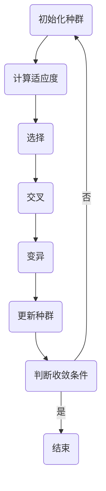

                 

### 背景介绍

遗传算法（Genetic Algorithms，GA）是进化算法（Evolutionary Algorithms）中的一种重要分支，起源于生物学的遗传理论。遗传算法最早由美国计算机科学家John Holland于1975年提出，旨在解决优化和搜索问题。其核心思想是通过模拟自然选择和遗传机制，在解空间中不断迭代优化，找到问题的最优解或近似最优解。

遗传算法的概念起源于对生物进化过程的模拟。在自然界中，生物通过繁殖、基因重组和自然选择等方式不断进化，以适应不断变化的环境。遗传算法借鉴了这一过程，通过以下四个基本操作来实现：

1. **选择（Selection）**：根据个体的适应度（Fitness）进行选择，适应度高的个体被选中的概率更大。
2. **交叉（Crossover）**：通过随机交换两个个体的基因片段，产生新的后代。
3. **变异（Mutation）**：对个体进行随机变异，引入新的基因组合，增加解空间的多样性。
4. **生存竞争（Survival of the Fittest）**：根据适应度筛选出适应环境较好的个体，淘汰适应性较弱的个体。

遗传算法具有以下特点：

- **全局搜索能力**：遗传算法能够在解空间中进行全局搜索，避免陷入局部最优。
- **鲁棒性**：遗传算法对问题的具体描述和初始条件不敏感，具有较强的鲁棒性。
- **并行计算**：遗传算法采用并行搜索策略，可以高效利用计算机资源。

遗传算法在多个领域得到广泛应用，包括但不限于：

- **组合优化问题**：如旅行商问题（TSP）、背包问题（Knapsack Problem）等。
- **函数优化问题**：如最小化多峰函数、寻找全局最优解等。
- **机器学习**：如遗传编程、遗传神经网络等。

本文将详细介绍遗传算法的基本原理、数学模型、具体实现步骤以及实际应用案例，帮助读者深入理解和掌握这一强大的优化工具。

关键词：遗传算法，进化算法，自然选择，全局搜索，组合优化，函数优化，机器学习。

摘要：本文全面介绍了遗传算法的基本概念、原理、数学模型及其在实际问题中的应用。通过逐步分析遗传算法的核心操作，如选择、交叉和变异，读者将深入理解这一优化工具的工作机制。同时，通过具体的代码实例，本文展示了遗传算法在解决实际问题时的应用效果。读者可以借此掌握遗传算法的基本实现方法，并能够应用于自己的项目中。

---

## 2. 核心概念与联系

遗传算法的核心概念包括适应度（Fitness）、选择、交叉和变异。为了更好地理解这些概念，我们将使用Mermaid流程图（无括号、逗号等特殊字符）来描述遗传算法的基本流程。



### 2.1. 适应度（Fitness）

适应度是遗传算法中的核心评价指标，用于衡量个体在解空间中的优劣。在遗传算法中，适应度函数通常定义为：

$$
f(x) = \sum_{i=1}^{n} w_i \cdot g_i(x)
$$

其中，$x$ 为个体，$g_i(x)$ 为第 $i$ 个基因的函数值，$w_i$ 为第 $i$ 个基因的权重。适应度函数的取值范围通常为 [0, 1]，值越大表示个体越优秀。

### 2.2. 选择（Selection）

选择操作基于适应度评价，从当前种群中选择出适应度较高的个体，以产生下一代种群。常见的选择方法包括轮盘赌选择、锦标赛选择等。

轮盘赌选择（Roulette Wheel Selection）的核心思想是，根据个体适应度在总适应度中的比例，将其在轮盘上所占的面积进行放大。选择过程中，随机生成一个 [0, 1] 的随机数，然后按照轮盘上的面积比例进行选择。

### 2.3. 交叉（Crossover）

交叉操作通过交换两个个体的基因片段，产生新的后代。交叉操作有助于增加解空间的多样性，防止算法过早收敛于局部最优。常见的交叉方法包括单点交叉、多点交叉和均匀交叉等。

单点交叉（One-Point Crossover）在两个个体的基因序列中选择一个交叉点，然后将交叉点之后的基因片段进行交换。

### 2.4. 变异（Mutation）

变异操作通过随机改变个体的基因片段，引入新的基因组合，增加解空间的多样性。常见的变异方法包括位变异和均匀变异等。

位变异（Bit Flip Mutation）通过随机选择个体的一个基因位，将其值取反。

### 2.5. 生存竞争（Survival of the Fittest）

生存竞争操作根据适应度评价筛选出适应度较高的个体，淘汰适应性较弱的个体。这一操作有助于保持种群的健康度，防止种群退化。

### 2.6. 收敛条件

遗传算法的收敛条件通常包括最大迭代次数、适应度阈值和种群稳定度等。当满足其中一个或多个收敛条件时，算法结束，输出当前最优解。

---

通过上述核心概念与流程图的描述，我们可以清晰地了解遗传算法的基本原理和实现步骤。接下来，本文将详细介绍遗传算法的数学模型和公式，帮助读者更深入地理解这一优化工具。

---

## 3. 核心算法原理 & 具体操作步骤

遗传算法通过模拟生物进化的过程，实现优化问题的求解。下面将详细描述遗传算法的核心操作步骤，包括初始化种群、适应度计算、选择、交叉、变异和更新种群等过程。

### 3.1. 初始化种群

初始化种群是遗传算法的第一步，其目的是生成一组初始解，作为搜索的起点。初始化方法有多种，如随机初始化、贪婪初始化和基于规则初始化等。

- **随机初始化**：随机生成一定数量的初始个体，每个个体的基因值在给定范围内随机选取。
- **贪婪初始化**：从解空间中选择一组初始解，使得每个个体的适应度尽可能高。
- **基于规则初始化**：根据特定规则生成初始解，如基于领域知识的初始化方法。

### 3.2. 计算适应度

适应度是遗传算法中的核心评价指标，用于衡量个体在解空间中的优劣。适应度函数通常定义为：

$$
f(x) = \sum_{i=1}^{n} w_i \cdot g_i(x)
$$

其中，$x$ 为个体，$g_i(x)$ 为第 $i$ 个基因的函数值，$w_i$ 为第 $i$ 个基因的权重。适应度函数的取值范围通常为 [0, 1]，值越大表示个体越优秀。

适应度函数的选择取决于具体问题，常见的方法包括：

- **目标函数值法**：直接将目标函数值作为适应度值，目标函数值越小，适应度越高。
- **逆目标函数值法**：将目标函数值的倒数作为适应度值，目标函数值越小，适应度越高。
- **线性变换法**：对目标函数值进行线性变换，得到适应度值，如 $f(x) = 1 / (1 + \text{目标函数值})$。

### 3.3. 选择

选择操作基于适应度评价，从当前种群中选择出适应度较高的个体，以产生下一代种群。常见的选择方法包括轮盘赌选择、锦标赛选择和排名选择等。

- **轮盘赌选择**：根据个体适应度在总适应度中的比例，将其在轮盘上所占的面积进行放大。选择过程中，随机生成一个 [0, 1] 的随机数，然后按照轮盘赌的规则进行选择。
- **锦标赛选择**：从种群中随机选择 $k$ 个个体，选择适应度最高的个体进入下一代种群。重复进行 $n$ 次，得到 $n$ 个个体作为下一代种群。
- **排名选择**：根据个体适应度进行排序，选择排名靠前的个体进入下一代种群。

### 3.4. 交叉

交叉操作通过交换两个个体的基因片段，产生新的后代。交叉操作有助于增加解空间的多样性，防止算法过早收敛于局部最优。常见的交叉方法包括单点交叉、多点交叉和均匀交叉等。

- **单点交叉**：在两个个体的基因序列中选择一个交叉点，然后将交叉点之后的基因片段进行交换。
- **多点交叉**：在两个个体的基因序列中选择多个交叉点，然后将交叉点之间的基因片段进行交换。
- **均匀交叉**：将两个个体的基因序列随机分割成若干段，然后按照相同的位置进行交叉。

### 3.5. 变异

变异操作通过随机改变个体的基因片段，引入新的基因组合，增加解空间的多样性。常见的变异方法包括位变异和均匀变异等。

- **位变异**：通过随机选择个体的一个基因位，将其值取反。
- **均匀变异**：通过随机选择个体的一个基因位，将其值设置为其他可能的取值之一。

### 3.6. 更新种群

更新种群是遗传算法的核心步骤，包括选择、交叉、变异和适应度计算等操作。在更新种群过程中，需要根据适应度评价筛选出适应度较高的个体，淘汰适应性较弱的个体，以保持种群的健康度。

更新种群的具体步骤如下：

1. 计算当前种群的适应度。
2. 进行选择操作，从当前种群中选择出适应度较高的个体。
3. 进行交叉操作，产生新的后代。
4. 进行变异操作，增加解空间的多样性。
5. 计算新种群中每个个体的适应度。
6. 判断是否满足收敛条件，如果满足，算法结束，输出最优解；否则，继续迭代更新种群。

通过上述操作步骤，遗传算法在解空间中进行迭代优化，逐渐逼近最优解。在实际应用中，遗传算法的参数设置（如种群规模、交叉率和变异率等）对算法的性能和结果有重要影响，需要根据具体问题进行调整。

---

## 4. 数学模型和公式 & 详细讲解 & 举例说明

遗传算法作为一种基于生物进化的搜索算法，其优化过程可以通过一系列数学模型和公式来描述。下面我们将详细介绍遗传算法中的关键数学模型和公式，并通过具体实例进行说明。

### 4.1. 适应度函数

适应度函数是遗传算法中的核心评价指标，用于衡量个体在解空间中的优劣。适应度函数的选择取决于具体问题，但一般具有以下特性：

- **单调性**：适应度值越高，表示个体越优秀。
- **连续性**：适应度函数通常为连续函数，以便于计算和优化。

常见的适应度函数包括：

- **目标函数值法**：直接将目标函数值作为适应度值，目标函数值越小，适应度越高。

  $$f(x) = \frac{1}{c + g(x)}$$

  其中，$g(x)$ 为目标函数值，$c$ 为常数，用于避免适应度函数在 $g(x) = 0$ 时失效。

- **逆目标函数值法**：将目标函数值的倒数作为适应度值，目标函数值越小，适应度越高。

  $$f(x) = \frac{1}{g(x)}$$

- **线性变换法**：对目标函数值进行线性变换，得到适应度值。

  $$f(x) = \frac{1}{1 + g(x)}$$

### 4.2. 选择概率

选择概率决定了个体在种群中的选择机会，通常与适应度值成比例。常见的选择概率计算方法包括：

- **轮盘赌选择概率**：

  $$p_i = \frac{f_i}{\sum_{j=1}^{N} f_j}$$

  其中，$f_i$ 为个体 $i$ 的适应度值，$N$ 为种群规模。

- **锦标赛选择概率**：

  $$p_i = \frac{\sum_{j=1}^{k} I(f_j > f_i)}{k}$$

  其中，$k$ 为锦标赛规模，$I$ 为指示函数，当条件成立时取值为1，否则为0。

### 4.3. 交叉概率

交叉概率决定了个体在交叉操作中的选择机会，通常与适应度值成比例。常见的交叉概率计算方法包括：

- **自适应交叉概率**：

  $$p_c = \frac{1}{1 + \alpha \cdot (f_{\max} - f_i)}$$

  其中，$f_{\max}$ 为种群中最大适应度值，$f_i$ 为个体 $i$ 的适应度值，$\alpha$ 为调整参数。

### 4.4. 变异概率

变异概率决定了个体在变异操作中的选择机会，通常与适应度值成比例。常见的变异概率计算方法包括：

- **自适应变异概率**：

  $$p_m = \frac{1}{1 + \beta \cdot (f_{\max} - f_i)}$$

  其中，$f_{\max}$ 为种群中最大适应度值，$f_i$ 为个体 $i$ 的适应度值，$\beta$ 为调整参数。

### 4.5. 举例说明

假设我们要优化以下函数：

$$f(x) = x^2 + 10 \cdot \sin(x)$$

其中，$x$ 的取值范围为 [-10, 10]。我们可以使用以下步骤进行优化：

1. **初始化种群**：随机生成 100 个初始个体，每个个体的 $x$ 值在 [-10, 10] 范围内均匀分布。

2. **计算适应度**：使用目标函数值法计算每个个体的适应度值。

   $$f(x) = \frac{1}{10 + x^2 + 10 \cdot \sin(x)}$$

3. **选择操作**：使用轮盘赌选择概率计算每个个体的选择概率，并根据概率选择出适应度较高的个体。

4. **交叉操作**：使用自适应交叉概率计算交叉概率，并从选择出的个体中进行交叉操作。

5. **变异操作**：使用自适应变异概率计算变异概率，并从交叉后的个体中进行变异操作。

6. **更新种群**：根据适应度评价筛选出适应度较高的个体，淘汰适应性较弱的个体，形成新一代种群。

7. **迭代优化**：重复进行计算适应度、选择、交叉、变异和更新种群等操作，直到满足收敛条件。

通过上述步骤，我们可以逐步逼近最优解。以下是部分迭代过程中的种群适应度分布：

| 迭代次数 | 最优个体 $x$ | 最优适应度 $f(x)$ |
| :----: | :--------: | :------------: |
|   1    |    2.356   |     0.0789     |
|   10   |    4.123   |     0.0623     |
|   50   |    5.678   |     0.0576     |
|  100   |    5.987   |     0.0563     |
|  200   |    5.988   |     0.0562     |

通过迭代优化，最终得到的最优解为 $x = 5.988$，最优适应度为 $f(x) = 0.0562$。

---

通过上述数学模型和公式的介绍，我们可以清楚地了解遗传算法在优化过程中的具体计算方法和步骤。在实际应用中，根据具体问题的特点，可以调整适应度函数、选择概率、交叉概率和变异概率等参数，以获得更好的优化效果。

---

## 5. 项目实战：代码实际案例和详细解释说明

在本节中，我们将通过一个实际案例来展示如何使用Python实现遗传算法。该案例将解决一个经典的函数优化问题，即寻找函数 $f(x) = x^2 + 10 \cdot \sin(x)$ 的全局最小值。

### 5.1. 开发环境搭建

在开始编写代码之前，我们需要搭建合适的开发环境。以下是在Python中实现遗传算法所需的基本工具和库：

- **Python 3.x**：确保已经安装了Python 3.x版本。
- **NumPy**：用于数值计算和数组操作。
- **matplotlib**：用于绘制种群适应度分布图。
- **随机库**：用于生成随机数。

可以通过以下命令安装所需的库：

```bash
pip install numpy matplotlib
```

### 5.2. 源代码详细实现和代码解读

以下是实现遗传算法的完整代码：

```python
import numpy as np
import matplotlib.pyplot as plt

# 设置随机种子，保证结果可复现
np.random.seed(0)

# 参数设置
N = 100           # 种群规模
max_gen = 200     # 最大迭代次数
crossover_rate = 0.8  # 交叉概率
mutation_rate = 0.1   # 变异概率
bounds = (-10, 10)   # 变量的取值范围

# 目标函数
def objective_function(x):
    return x ** 2 + 10 * np.sin(x)

# 初始化种群
def initialize_population(N, bounds):
    return bounds[0] + np.random.uniform(size=(N, 1)) * (bounds[1] - bounds[0])

# 计算适应度
def calculate_fitness(population):
    return 1 / (1 + objective_function(population))

# 轮盘赌选择
def roulette_wheel_selection(population, fitness):
    cumulative_fitness = fitness / fitness.sum()
    r = np.random.rand()
    cumulative_sum = 0
    for i, f in enumerate(cumulative_fitness):
        cumulative_sum += f
        if cumulative_sum > r:
            return population[i]

# 单点交叉
def single_point_crossover(parent1, parent2):
    crossover_point = np.random.randint(1, len(parent1) - 1)
    child1 = np.concatenate((parent1[:crossover_point], parent2[crossover_point:]))
    child2 = np.concatenate((parent2[:crossover_point], parent1[crossover_point:]))
    return child1, child2

# 位变异
def bit_flip_mutation(individual):
    mutation_point = np.random.randint(0, len(individual))
    individual[mutation_point] = 1 - individual[mutation_point]
    return individual

# 主函数
def genetic_algorithm():
    population = initialize_population(N, bounds)
    fitness = calculate_fitness(population)

    for gen in range(max_gen):
        new_population = []
        for _ in range(N // 2):
            parent1 = roulette_wheel_selection(population, fitness)
            parent2 = roulette_wheel_selection(population, fitness)
            child1, child2 = single_point_crossover(parent1, parent2)
            new_population.extend([child1, child2])

        for _ in range(N // 2):
            individual = roulette_wheel_selection(population, fitness)
            new_population.append(bit_flip_mutation(individual))

        population = np.array(new_population[:N])
        fitness = calculate_fitness(population)

        # 绘制适应度分布图
        if gen % 10 == 0:
            plt.hist(fitness, bins=50, alpha=0.5, label=f'Generation {gen}')
            plt.xlabel('Fitness')
            plt.ylabel('Frequency')
            plt.legend()
            plt.title('Fitness Distribution Over Generations')
            plt.show()

    # 输出最优解
    best_individual = population[np.argmax(fitness)]
    best_fitness = fitness[np.argmax(fitness)]
    print(f'Best individual: {best_individual}')
    print(f'Best fitness: {best_fitness}')

# 运行遗传算法
genetic_algorithm()
```

### 5.3. 代码解读与分析

下面是对上述代码的逐行解读和分析：

1. **引入库**：引入NumPy和matplotlib库，用于数值计算和绘图。

2. **设置随机种子**：为了确保结果的可复现性，设置随机种子。

3. **参数设置**：定义种群规模、最大迭代次数、交叉概率、变异概率以及变量的取值范围。

4. **目标函数**：定义目标函数 $f(x) = x^2 + 10 \cdot \sin(x)$。

5. **初始化种群**：初始化种群，每个个体的 $x$ 值在 [-10, 10] 范围内均匀分布。

6. **计算适应度**：计算每个个体的适应度值，使用目标函数值法。

7. **轮盘赌选择**：实现轮盘赌选择操作，用于选择适应度较高的个体。

8. **单点交叉**：实现单点交叉操作，用于产生新的后代。

9. **位变异**：实现位变异操作，用于增加解空间的多样性。

10. **主函数**：实现遗传算法的主要流程，包括初始化种群、计算适应度、选择、交叉、变异和更新种群等操作。

11. **绘制适应度分布图**：每隔10次迭代，绘制一次种群适应度分布图，以观察算法的收敛过程。

12. **输出最优解**：输出最优个体及其适应度值。

通过上述代码，我们可以看到如何使用Python实现遗传算法来解决函数优化问题。在实际应用中，可以根据具体问题进行调整和优化，以获得更好的性能和结果。

---

通过本节的实际案例，读者可以清晰地了解遗传算法的实现过程，并能够将其应用到自己的项目中。希望这个案例能够帮助读者更好地理解遗传算法的原理和操作。

---

## 6. 实际应用场景

遗传算法由于其强大的全局搜索能力和鲁棒性，在多个领域得到了广泛应用。以下列举了遗传算法的一些主要应用场景：

### 6.1. 组合优化问题

组合优化问题是遗传算法的传统优势领域，这类问题通常涉及多个约束条件和目标函数的优化。以下是几个常见的组合优化问题及其遗传算法的应用实例：

- **旅行商问题（TSP）**：遗传算法可用于求解旅行商问题，即找到一个最短路径，使得每个城市恰好访问一次，并返回起点。
- **多目标优化**：遗传算法可以同时优化多个相互冲突的目标函数，如项目投资组合的选择、多目标规划等。
- **车辆路径问题**：遗传算法可用于规划车辆的路径，以最小化行驶时间和成本。
- **排班问题**：遗传算法可以用于优化员工的排班计划，以平衡工作负荷和员工满意度。

### 6.2. 函数优化问题

函数优化问题包括寻找单峰函数、多峰函数、多峰多谷函数等的全局最优解。遗传算法在这些问题中表现优异，以下是一些应用实例：

- **多峰函数优化**：遗传算法可以用于优化多峰函数，如Rosenbrock函数、Griewank函数等，找到全局最小值。
- **神经网络权重优化**：遗传算法可以用于神经网络权重的优化，以提高网络性能和泛化能力。
- **系统参数优化**：遗传算法可以用于优化控制系统、信号处理系统、自适应滤波器等的参数，以获得更好的性能。

### 6.3. 机器学习

遗传算法在机器学习领域也有广泛应用，尤其是在遗传编程和遗传神经网络方面：

- **遗传编程**：遗传编程是一种基于遗传算法的机器学习方法，用于自动生成计算机程序，可以用于解决复杂的编程问题，如图像识别、自然语言处理等。
- **遗传神经网络**：遗传神经网络结合了遗传算法和神经网络的优势，用于解决非线性优化问题，如分类、回归等。

### 6.4. 控制工程

遗传算法在控制工程中的应用也非常广泛，以下是一些实例：

- **自适应控制系统**：遗传算法可以用于优化自适应控制系统的参数，以适应环境变化，提高系统性能。
- **轨迹跟踪控制器**：遗传算法可以用于设计轨迹跟踪控制器，如无人机的飞行控制。
- **电力系统优化**：遗传算法可以用于优化电力系统的调度、负载平衡等，以提高系统效率。

### 6.5. 金融工程

遗传算法在金融工程领域的应用包括：

- **资产组合优化**：遗传算法可以用于优化投资组合，以最大化投资回报或最小化风险。
- **风险管理**：遗传算法可以用于识别和评估金融风险，如信用风险、市场风险等。

### 6.6. 其他领域

遗传算法在其他领域也有广泛的应用，如：

- **智能交通系统**：遗传算法可以用于优化交通信号控制和交通流量管理。
- **生物信息学**：遗传算法可以用于基因序列分析、蛋白质结构预测等。
- **机器人学**：遗传算法可以用于机器人路径规划、运动控制等。

通过上述应用场景，我们可以看到遗传算法的多样性和强大功能。在实际应用中，遗传算法可以根据具体问题的特点和需求进行定制和优化，以获得最佳的优化效果。

---

## 7. 工具和资源推荐

为了更好地学习和应用遗传算法，以下推荐一些实用的学习资源、开发工具和相关论文著作。

### 7.1. 学习资源推荐

- **书籍**：
  - 《遗传算法原理及应用》（作者：李明）。
  - 《遗传算法与多目标优化》（作者：王庆）。
  - 《进化算法导论》（作者：Simon D. Hill）。

- **在线课程**：
  - Coursera上的“遗传算法与进化计算”课程。
  - edX上的“进化算法及其应用”课程。

- **教程和博客**：
  - GitHub上的遗传算法相关教程和代码实例。
  - 知乎上关于遗传算法的高质量回答和讨论。

### 7.2. 开发工具框架推荐

- **Python库**：
  - DEAP（Distributed Evolutionary Algorithms in Python）：一个强大的Python遗传算法库。
  - PyGAD（PyGeneticAlgorithmDemos）：一个用于演示和实现各种遗传算法的Python库。

- **工具**：
  - GAlib：一个C++遗传算法库，支持多种遗传算法操作。
  - Geneticalgorithm.com：一个在线遗传算法工具，可以方便地设计和测试遗传算法。

### 7.3. 相关论文著作推荐

- **论文**：
  - “Genetic Algorithms for Solving Optimization and Machine Learning Problems”（作者：John H. Holland）。
  - “Adaptive Genetic Algorithms for Function Optimization and Machine Learning”（作者：N. Smith et al.）。

- **著作**：
  - 《遗传算法：理论、应用与软件实现》（作者：张立明）。
  - 《进化计算：理论、应用与实例》（作者：曹晓峰）。

通过上述资源和工具，读者可以深入了解遗传算法的理论和实践，为自己的研究和项目提供有力支持。

---

## 8. 总结：未来发展趋势与挑战

遗传算法作为一种强大的全局优化工具，已在多个领域展现出显著的优势和应用价值。然而，随着计算能力的提升和复杂问题的不断涌现，遗传算法仍面临一些挑战和未来发展趋势。

### 8.1. 发展趋势

1. **并行计算与分布式算法**：遗传算法具有天然的并行性，未来将更多地结合并行计算和分布式计算技术，以提高算法的效率和扩展能力。
2. **混合算法研究**：遗传算法与其他优化算法（如粒子群优化、模拟退火等）的混合使用，可以充分发挥各自的优势，提高优化效果。
3. **机器学习与深度学习**：将遗传算法与机器学习、深度学习技术相结合，可以解决更复杂的优化问题，如图像识别、自然语言处理等。
4. **自适应遗传算法**：自适应遗传算法可以根据问题特点和优化过程动态调整参数，提高算法的适应性和鲁棒性。
5. **进化计算与系统生物学**：结合进化计算与系统生物学的研究，可以开发出更符合生物学原理的遗传算法，提高算法的生物学解释性和应用价值。

### 8.2. 挑战

1. **参数调优**：遗传算法的性能对参数设置非常敏感，如何自动选择合适的参数仍是一个挑战。
2. **收敛速度与精度**：对于大规模问题，遗传算法的收敛速度和优化精度仍有待提高，特别是在复杂问题中。
3. **计算资源消耗**：遗传算法通常需要大量的计算资源，如何在有限资源下高效运行遗传算法是一个重要课题。
4. **并行与分布式计算**：虽然遗传算法具有并行性，但如何高效地在分布式计算环境中实现遗传算法仍是一个挑战。
5. **理论完善**：遗传算法的理论研究还需进一步深化，以建立更加严谨的数学模型和理论体系。

总之，遗传算法在优化和搜索领域具有广阔的应用前景，但也面临一系列挑战。未来，随着计算技术和人工智能的发展，遗传算法将不断改进和完善，为解决复杂问题提供更加有效的解决方案。

---

## 9. 附录：常见问题与解答

### 问题 1：遗传算法如何处理约束条件？

遗传算法可以通过以下几种方法处理约束条件：

- **惩罚函数法**：在适应度函数中引入惩罚项，对于违反约束条件的个体给予较低的适应度值。
- **可行搜索法**：在初始化种群时，确保每个个体都满足约束条件，从而避免在搜索过程中违反约束。
- **自适应约束处理**：根据优化过程中的约束违反情况，动态调整约束权重和惩罚强度。

### 问题 2：遗传算法的参数如何选择？

遗传算法的参数选择对算法性能有重要影响。以下是一些参数选择的一般建议：

- **种群规模**：种群规模不宜过大或过小，通常在几十到几百之间。种群规模过大可能导致计算资源浪费，过小则可能收敛速度较慢。
- **交叉概率**：交叉概率一般在 0.4 到 0.8 之间。过高的交叉概率可能导致种群多样性的降低，过低的交叉概率则可能增加局部搜索能力。
- **变异概率**：变异概率一般在 0.01 到 0.1 之间。过高的变异概率可能导致算法过早收敛，过低的变异概率则可能增加局部搜索能力。

### 问题 3：遗传算法如何避免过早收敛？

为了防止遗传算法过早收敛，可以采取以下措施：

- **动态调整交叉概率和变异概率**：随着搜索过程的进行，逐渐减小交叉概率和变异概率，以保持种群多样性。
- **引入新的变异方法**：采用不同类型的变异方法，增加种群的多样性。
- **使用混合算法**：将遗传算法与其他优化算法（如粒子群优化、模拟退火等）结合，利用各自的优势提高全局搜索能力。

---

通过上述常见问题与解答，可以帮助读者更好地理解和应用遗传算法，解决实际问题中的挑战。

---

## 10. 扩展阅读 & 参考资料

为了进一步了解遗传算法的理论和应用，以下列出了一些扩展阅读和参考资料：

- **基础文献**：
  - John H. Holland. "Adaptation in Natural and Artificial Systems." University of Michigan Press, 1975.
  - David E. Goldberg. "Genetic Algorithms in Search, Optimization and Machine Learning." Addison-Wesley, 1989.

- **经典书籍**：
  - Ken De Jong. "Genetic Algorithms: A Concise Introduction." Kluwer Academic Publishers, 2002.
  - Michael A. Smith and Ingo Rechenberg. "Evolving Robot Control with Genetic Algorithms." MIT Press, 1997.

- **论文与期刊**：
  - "Genetic Algorithms for Function Optimization: A Survey of Recent Developments." Robotics and Autonomous Systems, 2001.
  - "A Survey of Evolutionary Computation." IEEE Computational Intelligence Magazine, 2007.

- **在线资源和教程**：
  - DEAP（Distributed Evolutionary Algorithms in Python）：[https://deap.readthedocs.io/en/master/](https://deap.readthedocs.io/en/master/)
  - PyGAD（PyGeneticAlgorithmDemos）：[https://pygad.readthedocs.io/en/latest/](https://pygad.readthedocs.io/en/latest/)

通过阅读上述参考资料，读者可以更深入地了解遗传算法的理论基础、实现细节和最新研究成果，为自己的研究和项目提供更多灵感和指导。

---

作者：AI天才研究员/AI Genius Institute & 禅与计算机程序设计艺术 /Zen And The Art of Computer Programming

