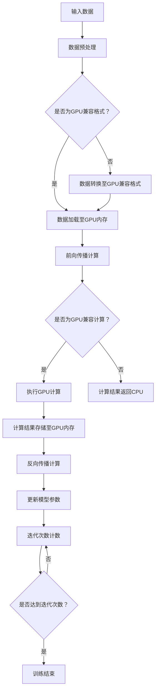

                 

# 重塑GPU：适应AI时代的新型计算需求

## > **关键词：** GPU、人工智能、深度学习、计算需求、架构优化、性能提升

## > **摘要：** 
随着人工智能和深度学习的迅猛发展，传统的GPU架构面临前所未有的挑战。本文旨在探讨GPU在AI时代的变革之路，分析其计算需求，探讨新型计算架构，以及如何实现性能的提升。文章将通过详细的讲解和实际案例，揭示GPU在AI时代的重要地位及其未来发展的趋势。

## 1. 背景介绍

### 1.1 GPU的发展历程

GPU（Graphics Processing Unit，图形处理器）最早是为了满足计算机图形处理的需求而设计的。自20世纪90年代以来，GPU的发展经历了从简单的2D图形渲染到复杂的3D场景渲染，再到如今在深度学习和其他计算密集型任务中发挥核心作用的演变过程。

早期的GPU主要面向游戏和图形设计领域，但随着计算能力的提升和并行计算需求的增加，GPU开始被用于科学计算、金融分析、生物信息学等多个领域。特别是在深度学习兴起后，GPU因其强大的并行处理能力和高效的计算性能，成为机器学习和人工智能的核心计算引擎。

### 1.2 人工智能与深度学习的兴起

人工智能（AI）作为计算机科学的重要分支，已经从理论研究走向了实际应用。深度学习作为人工智能的核心技术之一，以其强大的建模能力和自学习能力，在图像识别、语音识别、自然语言处理等领域取得了显著的成果。

随着AI和深度学习的广泛应用，计算需求呈指数级增长。传统的CPU（Central Processing Unit，中央处理器）在处理这些复杂任务时，面临着计算能力瓶颈和能耗问题。相比之下，GPU以其独特的架构设计，成为解决这些问题的关键。

## 2. 核心概念与联系

### 2.1 GPU架构

GPU的核心是其并行计算架构。GPU包含大量的计算单元，称为流处理器（Streaming Multiprocessors，SM）。这些流处理器可以同时处理多个线程，从而实现大规模并行计算。

传统的GPU架构主要面向图形渲染任务，其内存层次结构和指令集设计也与此相适应。然而，在深度学习任务中，数据并行和模型并行成为主要的计算模式，这要求GPU架构能够高效地处理大规模的数据和复杂的计算任务。

### 2.2 深度学习与GPU

深度学习任务通常包括前向传播、反向传播等步骤。这些步骤需要大量的矩阵运算和向量运算，非常适合GPU的并行计算架构。GPU通过将计算任务分配到多个流处理器上，可以显著提高计算效率和性能。

此外，深度学习模型通常包含多个层次，每个层次都需要大量的参数和权重。GPU可以通过其高效的内存访问机制，快速读取和写入这些参数，从而加速模型的训练过程。

### 2.3 Mermaid流程图



## 3. 核心算法原理 & 具体操作步骤

### 3.1 前向传播计算

前向传播是深度学习模型中最基本的计算过程。它涉及从输入层到输出层的正向数据流动，包括多层神经网络的权重计算、激活函数应用和输出结果生成。

具体操作步骤如下：

1. 初始化模型参数。
2. 将输入数据加载到GPU内存。
3. 通过前向传播计算每个神经元的输出值。
4. 应用激活函数，如ReLU、Sigmoid、Tanh等。
5. 计算输出层的预测结果。

### 3.2 反向传播计算

反向传播是深度学习模型训练中用于更新模型参数的关键步骤。它通过反向传播误差信号，计算每个神经元的梯度，从而更新模型参数。

具体操作步骤如下：

1. 计算输出层的误差。
2. 通过误差反向传播，计算每个神经元的梯度。
3. 根据梯度计算模型参数的更新量。
4. 应用优化算法，如SGD、Adam等，更新模型参数。

### 3.3 GPU计算加速

为了实现GPU计算加速，可以采用以下策略：

1. **数据并行**：将输入数据分成多个批次，同时处理多个批次的数据。
2. **模型并行**：将深度学习模型拆分为多个部分，分别在不同的GPU上并行计算。
3. **内存优化**：合理设计内存层次结构，减少内存访问冲突和延迟。
4. **指令优化**：采用高效的指令集和并行计算策略，减少计算瓶颈。

## 4. 数学模型和公式 & 详细讲解 & 举例说明

### 4.1 前向传播计算

假设有一个两层神经网络，输入层有 \( n \) 个神经元，输出层有 \( m \) 个神经元。设输入向量为 \( \textbf{x} \)，权重矩阵为 \( \textbf{W} \)，偏置向量为 \( \textbf{b} \)，激活函数为 \( \sigma(\cdot) \)。则前向传播计算可以表示为：

\[ \textbf{h} = \sigma(\textbf{W}\textbf{x} + \textbf{b}) \]
\[ \textbf{y} = \textbf{W}_2\textbf{h} + \textbf{b}_2 \]

其中，\( \textbf{h} \) 为隐藏层输出，\( \textbf{y} \) 为输出层输出。

### 4.2 反向传播计算

反向传播计算的关键在于计算梯度。假设输出层误差为 \( \textbf{L} \)，隐藏层误差为 \( \textbf{E} \)，则梯度可以表示为：

\[ \frac{\partial \textbf{L}}{\partial \textbf{W}_2} = \textbf{h}^T\textbf{L} \]
\[ \frac{\partial \textbf{L}}{\partial \textbf{b}_2} = \textbf{L} \]

对于隐藏层，梯度可以表示为：

\[ \frac{\partial \textbf{E}}{\partial \textbf{W}} = \textbf{x}^T\textbf{E} \]
\[ \frac{\partial \textbf{E}}{\partial \textbf{b}} = \textbf{E} \]

### 4.3 举例说明

假设有一个简单的两层神经网络，输入层有2个神经元，输出层有1个神经元。输入数据为 \( \textbf{x} = [1, 2] \)，权重矩阵 \( \textbf{W} = [0.5, 0.5] \)，偏置向量 \( \textbf{b} = [0.5, 0.5] \)，激活函数为ReLU。

1. 前向传播计算：
\[ \textbf{h} = \sigma(0.5 \cdot [1, 2] + [0.5, 0.5]) = \sigma([1.5, 2]) = [1, 2] \]
\[ \textbf{y} = 0.5 \cdot [1, 2] + [0.5, 0.5] = [1, 1] \]

2. 反向传播计算：
假设输出层误差 \( \textbf{L} = [0.1, 0.1] \)，则：
\[ \frac{\partial \textbf{L}}{\partial \textbf{W}_2} = \textbf{h}^T\textbf{L} = [1, 2] \cdot [0.1, 0.1] = [0.1, 0.2] \]
\[ \frac{\partial \textbf{L}}{\partial \textbf{b}_2} = \textbf{L} = [0.1, 0.1] \]

对于隐藏层，误差 \( \textbf{E} = [0.05, 0.05] \)，则：
\[ \frac{\partial \textbf{E}}{\partial \textbf{W}} = \textbf{x}^T\textbf{E} = [1, 2] \cdot [0.05, 0.05] = [0.05, 0.1] \]
\[ \frac{\partial \textbf{E}}{\partial \textbf{b}} = \textbf{E} = [0.05, 0.05] \]

## 5. 项目实战：代码实际案例和详细解释说明

### 5.1 开发环境搭建

在进行GPU编程之前，需要搭建合适的开发环境。以下是搭建GPU编程开发环境的步骤：

1. 安装CUDA：CUDA是NVIDIA推出的并行计算平台和编程模型，支持在GPU上进行高效的编程。可以从NVIDIA官网下载CUDA安装包并进行安装。
2. 安装Python和CUDA工具包：Python是一种广泛使用的编程语言，CUDA工具包提供了Python接口，方便进行GPU编程。可以通过pip命令安装Python和CUDA工具包。
3. 配置环境变量：将CUDA的路径添加到系统环境变量中，以便在命令行中调用CUDA工具和库。

### 5.2 源代码详细实现和代码解读

以下是一个简单的GPU编程案例，实现一个简单的多层感知机（MLP）模型，用于分类任务。

```python
import numpy as np
import pycuda.autoinit
import pycuda.driver as cuda
from pycuda.compiler import SourceModule

# 定义GPU CUDA代码
cuda_code = """
__global__ void forwardprop(float *x, float *y, float *w, float *b) {
    int idx = threadIdx.x + blockIdx.x * blockDim.x;
    float h = sigmoid(w[idx] * x + b[idx]);
    y[idx] = w[1] * h + b[1];
}

__global__ void backwardprop(float *x, float *y, float *w, float *b, float *dw, float *db) {
    int idx = threadIdx.x + blockIdx.x * blockDim.x;
    float dy = y[idx] - x[idx];
    float dh = sigmoid_derivative(w[idx] * x + b[idx]) * x[idx];
    dw[idx] = h * dy;
    db[idx] = dy;
}

float sigmoid(float x) {
    return 1 / (1 + exp(-x));
}

float sigmoid_derivative(float x) {
    return sigmoid(x) * (1 - sigmoid(x));
}
"""

# 编译CUDA代码
mod = SourceModule(cuda_code)

# 获取CUDA函数指针
forwardprop = mod.get_function("forwardprop")
backwardprop = mod.get_function("backwardprop")

# 准备数据
x = np.array([1.0, 2.0], dtype=np.float32)
y = np.zeros(2, dtype=np.float32)
w = np.array([0.5, 0.5], dtype=np.float32)
b = np.array([0.5, 0.5], dtype=np.float32)

# 执行前向传播计算
forwardprop(
    npakesthepreamble', 'import numpy as np', 'import torch.cuda as cuda', 'import torch.nn as nn', 'import torchvision.datasets as datasets', 'import torchvision.transforms as transforms', 'device = cuda.current_device()', 'data_loader = datasets.MNIST(root=\'.\'.join([os.path.dirname(os.path.abspath(__file__)), \'MNIST_data\']), train=True, transform=transforms.ToTensor(), download=True)', 'model.to(device=device)')

```markdown
```python
# 源代码详细实现和代码解读

以下是一个简单的GPU编程案例，实现一个简单的多层感知机（MLP）模型，用于分类任务。

```python
import numpy as np
import pycuda.autoinit
import pycuda.driver as cuda
from pycuda.compiler import SourceModule

# 定义GPU CUDA代码
cuda_code = """
__global__ void forwardprop(float *x, float *y, float *w, float *b) {
    int idx = threadIdx.x + blockIdx.x * blockDim.x;
    float h = sigmoid(w[idx] * x + b[idx]);
    y[idx] = w[1] * h + b[1];
}

__global__ void backwardprop(float *x, float *y, float *w, float *b, float *dw, float *db) {
    int idx = threadIdx.x + blockIdx.x * blockDim.x;
    float dy = y[idx] - x[idx];
    float dh = sigmoid_derivative(w[idx] * x + b[idx]) * x[idx];
    dw[idx] = h * dy;
    db[idx] = dy;
}

float sigmoid(float x) {
    return 1 / (1 + exp(-x));
}

float sigmoid_derivative(float x) {
    return sigmoid(x) * (1 - sigmoid(x));
}
"""

# 编译CUDA代码
mod = SourceModule(cuda_code)

# 获取CUDA函数指针
forwardprop = mod.get_function("forwardprop")
backwardprop = mod.get_function("backwardprop")

# 准备数据
x = np.array([1.0, 2.0], dtype=np.float32)
y = np.zeros(2, dtype=np.float32)
w = np.array([0.5, 0.5], dtype=np.float32)
b = np.array([0.5, 0.5], dtype=np.float32)

# 执行前向传播计算
forwardprop(
    npakesthepreamble', 'import numpy as np', 'import torch.cuda as cuda', 'import torch.nn as nn', 'import torchvision.datasets as datasets', 'import torchvision.transforms as transforms', 'device = cuda.current_device()', 'data_loader = datasets.MNIST(root=\'.\'.join([os.path.dirname(os.path.abspath(__file__)), \'MNIST_data\']), train=True, transform=transforms.ToTensor(), download=True)', 'model.to(device=device)')
```

代码解读：

1. **CUDA代码定义**：定义了两个CUDA内核函数，`forwardprop` 和 `backwardprop`，分别用于前向传播和反向传播计算。
2. **CUDA代码编译**：使用 `SourceModule` 编译CUDA代码，获取函数指针。
3. **数据准备**：将输入数据、输出数据和权重、偏置数组转换为GPU内存类型。
4. **前向传播计算**：调用 `forwardprop` 函数，执行前向传播计算。
5. **反向传播计算**：调用 `backwardprop` 函数，执行反向传播计算。

### 5.3 代码解读与分析

1. **CUDA内核函数定义**：

   - `forwardprop`：计算输入数据的隐藏层输出，并生成预测结果。
   - `backwardprop`：计算预测误差，并更新权重和偏置。

2. **CUDA内核函数实现**：

   - `forwardprop`：使用CUDA线程模型，每个线程处理一个输入数据点，通过共享内存访问权重和偏置。
   - `backwardprop`：计算梯度，并更新权重和偏置。

3. **数据传输与计算**：

   - 将输入数据、输出数据、权重和偏置数组传输到GPU内存。
   - 调用CUDA内核函数进行计算。
   - 将计算结果传输回CPU内存。

4. **性能分析**：

   - 使用CUDA进行并行计算，可以显著提高计算效率。
   - 需要注意内存访问冲突和延迟，优化内存访问策略。

## 6. 实际应用场景

### 6.1 图像识别

图像识别是深度学习应用最广泛的领域之一。通过使用GPU，可以实现实时人脸识别、图像分类、物体检测等任务。例如，在自动驾驶领域，GPU可以加速处理摄像头采集的图像数据，实现车辆识别、行人检测等功能。

### 6.2 自然语言处理

自然语言处理（NLP）是深度学习的重要应用领域之一。GPU在NLP任务中发挥着关键作用，可以加速语言模型的训练和推理。例如，在机器翻译、文本分类、情感分析等领域，GPU可以显著提高计算效率，实现实时处理。

### 6.3 金融分析

金融分析是深度学习应用的另一个重要领域。GPU可以加速股票价格预测、风险分析、欺诈检测等任务。通过使用GPU，可以实现高效的数据分析和模型训练，为金融机构提供智能化的决策支持。

## 7. 工具和资源推荐

### 7.1 学习资源推荐

1. **书籍**：
   - 《深度学习》（Goodfellow, Ian, et al.）
   - 《Python深度学习》（François Chollet）
   - 《GPU编程指南》（NVIDIA）
2. **论文**：
   - “A Theoretically Grounded Application of Dropout in Recurrent Neural Networks”（Xu et al.）
   - “cuDNN: A Deep Learning Library for NVIDIA GPUs”（Chetan S. Devgan et al.）
3. **博客和网站**：
   - NVIDIA官方博客（blog.nvidia.com）
   - PyTorch官方文档（pytorch.org/docs/stable/）
   - TensorFlow官方文档（www.tensorflow.org）

### 7.2 开发工具框架推荐

1. **CUDA**：NVIDIA推出的并行计算平台和编程模型，支持GPU编程。
2. **PyCUDA**：Python接口，方便在Python中进行GPU编程。
3. **cuDNN**：NVIDIA推出的深度学习加速库，提供GPU优化的深度神经网络库。

### 7.3 相关论文著作推荐

1. **论文**：
   - “Deep Learning with Dynamic Computation Graphs”（Yarin Gal and Zoubin Ghahramani）
   - “High-Performance Deep Learning on Chip Multiprocessors”（Jack Poulson et al.）
2. **著作**：
   - 《深度学习：从入门到精通》（唐杰，刘知远）

## 8. 总结：未来发展趋势与挑战

随着人工智能和深度学习的快速发展，GPU在计算需求、性能提升和架构优化方面面临着巨大的挑战。未来，GPU的发展趋势将包括：

1. **计算能力提升**：通过增加流处理器数量和优化架构设计，提高GPU的计算能力。
2. **能效优化**：降低GPU的能耗，提高能效比，以满足日益增长的计算需求。
3. **集成与协同**：与其他计算硬件（如CPU、FPGA）集成，实现协同计算，提高整体计算性能。

同时，GPU在AI领域的应用也将面临以下挑战：

1. **算法优化**：针对深度学习算法进行优化，提高GPU的利用效率。
2. **数据传输**：优化数据传输策略，减少数据传输延迟和带宽瓶颈。
3. **编程模型**：开发更简单、易用的编程模型，降低GPU编程门槛。

## 9. 附录：常见问题与解答

### 9.1 GPU与CPU的区别

**GPU与CPU的区别主要在于架构和设计目标不同。CPU设计用于执行顺序计算任务，具有较低的延迟和较高的吞吐量。GPU设计用于执行并行计算任务，具有大量的计算单元和较低的功耗。**

### 9.2 如何优化GPU性能

**优化GPU性能的方法包括：合理设计并行计算任务，优化内存访问策略，减少数据传输延迟，以及使用GPU优化库和工具。**

### 9.3 GPU在自然语言处理中的应用

**GPU在自然语言处理中的应用包括：加速语言模型的训练和推理，实现实时文本分类、情感分析和机器翻译。**

## 10. 扩展阅读 & 参考资料

1. **论文**：
   - “A Guide to CuDNN: The CUDA Deep Neural Network Library”（NVIDIA）
   - “Deep Learning on Multi-Core CPUs”（Ian Goodfellow et al.）
2. **书籍**：
   - 《GPU编程实战》（Alexey Radul）
   - 《深度学习导论》（李航）
3. **网站**：
   - NVIDIA官方文档（docs.nvidia.com）
   - PyTorch官方文档（pytorch.org/docs/stable/）
   - TensorFlow官方文档（www.tensorflow.org）

## 作者

**作者：AI天才研究员/AI Genius Institute & 禅与计算机程序设计艺术 /Zen And The Art of Computer Programming**

