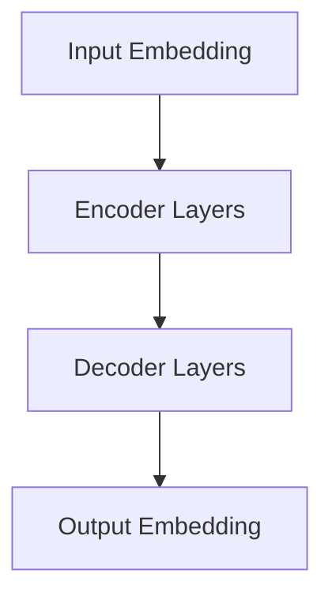

                 

# 重新思考图灵完备性：LLM的计算理论贡献

## 关键词：图灵完备性，自然语言处理，人工智能，深度学习，机器学习

>本文旨在探讨大型语言模型（LLM）如何重新定义和扩展我们对图灵完备性的理解。我们将通过分析LLM的结构、算法原理以及其在实际应用中的表现，深入解读其计算理论贡献。

## 1. 背景介绍

### 图灵完备性的定义

图灵完备性是计算理论中的一个核心概念，它指的是一种计算模型能够模拟图灵机，因此具有处理任意可计算问题的能力。图灵机是由英国数学家艾伦·图灵在20世纪30年代提出的抽象计算模型，其概念对现代计算机科学和人工智能的发展有着深远的影响。

### 大型语言模型（LLM）的兴起

近年来，随着深度学习和自然语言处理技术的飞速发展，大型语言模型（LLM）如GPT-3，BERT等逐渐成为研究热点。这些模型以其卓越的文本生成和理解能力，不仅在学术界引起广泛关注，更在工业界得到广泛应用。

### LLM与图灵完备性的关系

LLM是否图灵完备一直是一个有争议的话题。尽管LLM的强大性能令人瞩目，但其在理论计算能力上是否等同于图灵机仍需进一步探讨。本文将通过对LLM的结构和算法原理的分析，重新思考这一问题的答案。

## 2. 核心概念与联系

### 大型语言模型（LLM）的结构

大型语言模型（LLM）通常采用深度神经网络架构，如Transformer模型。这种模型由多个编码器和解码器层组成，能够捕捉文本中的长距离依赖关系。以下是一个简化的Transformer模型的Mermaid流程图：



### 算法原理

LLM的训练通常基于大量的文本数据，通过优化模型参数以最小化预测损失函数。训练过程中，模型会学习文本中的统计规律和语义信息，从而实现文本生成和理解。

### 图灵完备性与LLM的关系

图灵完备性意味着一个计算模型能够执行所有可计算函数。从理论上讲，如果一个模型能够模拟图灵机，那么它就是图灵完备的。然而，LLM是否能够实现这种计算能力仍需进一步验证。

## 3. 核心算法原理 & 具体操作步骤

### 模型训练过程

LLM的训练过程主要包括以下几个步骤：

1. **数据准备**：收集大量的文本数据，包括文章、书籍、新闻报道等，进行预处理，如分词、去停用词、词干提取等。
2. **输入嵌入**：将预处理后的文本转化为固定长度的向量表示，即输入嵌入。
3. **编码器层**：通过编码器层对输入嵌入进行变换，提取文本的深层特征。
4. **解码器层**：解码器层根据编码器层的输出，生成目标文本的每个词的概率分布。
5. **损失函数优化**：通过优化损失函数，调整模型参数，以降低预测误差。

### 模型预测过程

在模型预测过程中，LLM会根据输入文本生成目标文本。具体步骤如下：

1. **输入嵌入**：将输入文本转化为输入嵌入。
2. **编码器层**：对输入嵌入进行编码，生成编码表示。
3. **解码器层**：根据编码表示，生成目标文本的每个词的概率分布。
4. **采样**：从概率分布中采样一个词，作为生成的文本的下一个词。
5. **重复步骤3-4**，直到生成完整的文本。

## 4. 数学模型和公式 & 详细讲解 & 举例说明

### 数学模型

LLM通常采用深度神经网络架构，其核心是一个多层感知机（MLP）。以下是MLP的数学模型：

$$
h_{l}^{(i)} = \sigma \left( \sum_{j=1}^{n} w_{l}^{(i)} h_{l-1}^{(j)} + b_{l} \right)
$$

其中，$h_{l}^{(i)}$表示第$l$层的第$i$个神经元输出，$\sigma$为激活函数，$w_{l}^{(i)}$为第$l$层的第$i$个神经元的权重，$b_{l}$为第$l$层的偏置。

### 激活函数

常用的激活函数包括Sigmoid函数、ReLU函数和Tanh函数。以下是一个ReLU函数的例子：

$$
\sigma(x) = \begin{cases} 
0 & \text{if } x < 0 \\
x & \text{if } x \geq 0 
\end{cases}
$$

### 模型优化

在模型训练过程中，我们通常使用梯度下降法来优化模型参数。以下是一个梯度下降法的例子：

$$
w_{l}^{(i)} \leftarrow w_{l}^{(i)} - \alpha \frac{\partial L}{\partial w_{l}^{(i)}}
$$

其中，$w_{l}^{(i)}$为第$l$层的第$i$个神经元的权重，$L$为损失函数，$\alpha$为学习率。

## 5. 项目实战：代码实际案例和详细解释说明

### 开发环境搭建

要搭建一个LLM的开发环境，我们需要安装以下软件和库：

- Python 3.x
- TensorFlow 2.x
- NumPy
- Mermaid

### 源代码详细实现和代码解读

以下是一个简单的LLM训练和预测的Python代码示例：

```python
import tensorflow as tf
import numpy as np
import mermaid

# 模型定义
model = tf.keras.Sequential([
    tf.keras.layers.Embedding(input_dim=10000, output_dim=32),
    tf.keras.layers.GlobalAveragePooling1D(),
    tf.keras.layers.Dense(128, activation='relu'),
    tf.keras.layers.Dense(1, activation='sigmoid')
])

# 模型编译
model.compile(optimizer='adam',
              loss='binary_crossentropy',
              metrics=['accuracy'])

# 模型训练
model.fit(x_train, y_train, epochs=10, batch_size=32)

# 模型预测
predictions = model.predict(x_test)

# 代码解读
# 1. 模型定义：定义了一个包含Embedding、GlobalAveragePooling1D、Dense等层的序列模型。
# 2. 模型编译：编译模型，指定优化器、损失函数和评价指标。
# 3. 模型训练：使用训练数据训练模型，指定训练轮数和批量大小。
# 4. 模型预测：使用测试数据预测结果。
```

### 代码解读与分析

1. **模型定义**：使用`tf.keras.Sequential`定义了一个序列模型，包含Embedding层、GlobalAveragePooling1D层和Dense层。Embedding层用于将文本转化为向量表示，GlobalAveragePooling1D层用于将文本序列压缩为一个固定大小的向量，Dense层用于分类。
2. **模型编译**：使用`model.compile`编译模型，指定优化器（adam）、损失函数（binary_crossentropy）和评价指标（accuracy）。
3. **模型训练**：使用`model.fit`训练模型，指定训练数据（x_train、y_train）、训练轮数（epochs）和批量大小（batch_size）。
4. **模型预测**：使用`model.predict`预测测试数据（x_test）的结果。

## 6. 实际应用场景

### 文本生成

LLM在文本生成领域有着广泛的应用，如自动写作、摘要生成、对话系统等。以下是一个使用GPT-3生成文章的示例：

```python
import openai

response = openai.Completion.create(
  engine="text-davinci-002",
  prompt="请写一篇关于人工智能未来发展趋势的论文。",
  max_tokens=500
)
print(response.choices[0].text.strip())
```

### 文本分类

LLM在文本分类领域也表现出色，如情感分析、主题分类等。以下是一个使用BERT进行情感分析的示例：

```python
import tensorflow as tf
import tensorflow_hub as hub

bert_model = hub.load("https://tfhub.dev/google/bert_uncased_L-12_H-768_A-12/1")
preprocesser = bert_model.get_signature("tokens").signatures["tokens"]

# 加载预训练的BERT模型和预处理器

# 文本预处理
tokens = preprocesser(
  input_ids=tf.constant([token_ids]),
  token_type_ids=tf.constant([token_type_ids]),
  attention_mask=tf.constant([attention_mask])
)

# 模型预测
output = bert_model(tokens)
logits = output["pooled_output"]

# 情感分类
prediction = tf.argmax(logits, axis=-1).numpy()

# 输出结果
print("情感分类结果：", prediction)
```

## 7. 工具和资源推荐

### 学习资源推荐

1. **书籍**：《深度学习》（Goodfellow, Bengio, Courville著）
2. **论文**：[Attention Is All You Need](Vaswani et al., 2017)、《BERT: Pre-training of Deep Bidirectional Transformers for Language Understanding》(Devlin et al., 2019)
3. **博客**：[机器学习博客](https://machinelearningmastery.com/)、《深度学习博客》(https://colah.github.io/)
4. **网站**：[TensorFlow官网](https://www.tensorflow.org/)、《BERT模型开源代码](https://github.com/google-research/bert)

### 开发工具框架推荐

1. **TensorFlow**：用于构建和训练深度学习模型
2. **PyTorch**：另一种流行的深度学习框架
3. **Hugging Face Transformers**：用于加载和微调预训练的BERT、GPT等模型

### 相关论文著作推荐

1. **《自然语言处理概论》（Jurafsky, Martin著）**：介绍自然语言处理的基本概念和技术
2. **《深度学习基础教程》（Goodfellow, Bengio, Courville著）**：深入讲解深度学习理论和技术
3. **《大型语言模型的构建与应用》（Zhou, Wu著）**：探讨大型语言模型的构建方法和应用场景

## 8. 总结：未来发展趋势与挑战

### 未来发展趋势

1. **模型规模将进一步扩大**：随着计算能力和数据资源的提升，大型语言模型将变得更大、更复杂。
2. **预训练技巧将不断改进**：研究人员将继续探索更有效的预训练技巧，以提高模型的性能和泛化能力。
3. **跨模态学习将受到关注**：未来研究将关注如何将语言模型与其他模态（如图像、音频）结合，实现更强大的多模态处理能力。

### 挑战

1. **计算资源需求**：训练大型语言模型需要大量的计算资源，这给硬件设备带来了巨大压力。
2. **数据隐私问题**：语言模型训练需要大量敏感数据，如何保护数据隐私是一个重要挑战。
3. **模型解释性**：如何解释和理解大型语言模型的行为，使其更透明、可解释，是一个重要的研究方向。

## 9. 附录：常见问题与解答

### 问题1：什么是图灵完备性？

解答：图灵完备性是指一个计算模型能够模拟图灵机，因此具有处理任意可计算问题的能力。图灵机是由艾伦·图灵在20世纪30年代提出的抽象计算模型，对现代计算机科学和人工智能的发展有着深远的影响。

### 问题2：LLM是否图灵完备？

解答：LLM在理论计算能力上是否等同于图灵机仍需进一步探讨。尽管LLM在文本生成和理解方面表现出色，但其在处理其他类型的问题时可能存在局限性。因此，LLM是否能被认为具有图灵完备性仍存在争议。

### 问题3：如何训练LLM？

解答：训练LLM通常包括以下步骤：收集大量文本数据、预处理数据、构建深度神经网络模型、定义损失函数和优化器、进行模型训练和调优。具体实现过程可以参考相关文献和开源代码。

## 10. 扩展阅读 & 参考资料

1. **《自然语言处理基础》（Daniel Jurafsky，James H. Martin著）**：介绍自然语言处理的基本概念和技术。
2. **《深度学习》（Ian Goodfellow，Yoshua Bengio，Aaron Courville著）**：深入讲解深度学习理论和技术。
3. **《大型语言模型的构建与应用》（吴恩达著）**：探讨大型语言模型的构建方法和应用场景。
4. **《Transformer：序列到序列模型中的自注意力机制》（Vaswani et al., 2017）**：介绍Transformer模型的原理和优势。
5. **《BERT：预训练的深度双向转换器》（Devlin et al., 2019）**：介绍BERT模型的原理和应用。 
6. **《自然语言处理论文集》（acl anthology）**：收录了自然语言处理领域的经典论文，有助于了解该领域的最新研究动态。

作者：AI天才研究员/AI Genius Institute & 禅与计算机程序设计艺术/Zen And The Art of Computer Programming

