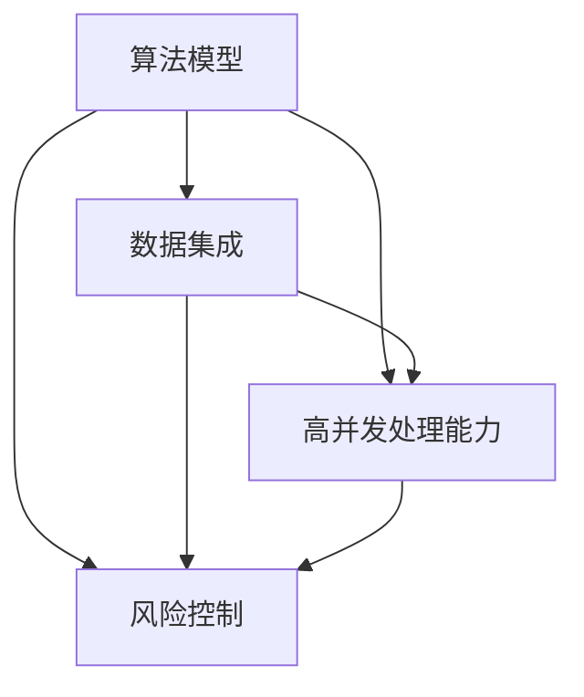
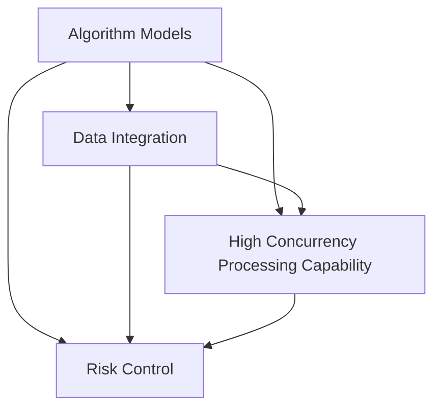

                 

### 背景介绍

量化交易，作为一种基于数学和统计分析的金融交易方法，近年来在全球金融市场中逐渐崭露头角。它通过算法和模型，对大量的历史数据进行深度分析，从而预测市场走势，并在合适的时间进行交易操作。量化交易的优势在于其能够摆脱人类情绪的影响，实现高度自动化和高效化的交易过程。

随着金融科技（Fintech）的不断发展，量化交易已经不再局限于大型金融机构和投资公司。越来越多的创业公司开始涉足这一领域，希望能够通过构建自己的量化交易策略平台，抓住市场的机会。这些平台通常具备以下几个特点：

1. **算法多样性**：平台能够支持多种算法模型，包括均值回归、趋势跟踪、市场情绪分析等，以满足不同交易策略的需求。
2. **数据集成**：平台能够集成来自多个数据源的数据，如交易所数据、财经新闻、社交媒体数据等，以提供更全面的交易信号。
3. **高并发处理能力**：量化交易通常需要处理大量实时的交易数据，因此平台必须具备高并发处理能力，以保证交易执行的效率和准确性。
4. **风险控制**：平台通常内置风险控制机制，如资金管理、交易限额、止损等，以降低交易风险。

金融科技创业领域的量化交易策略平台，不仅为创业者提供了实现财务自由的机会，同时也推动了金融科技的进步。随着技术的不断发展，我们可以预见，量化交易策略平台将在金融市场中扮演越来越重要的角色。

In recent years, quantitative trading, a financial trading method based on mathematics and statistical analysis, has emerged as a significant player in the global financial market. By utilizing algorithms and models to analyze large sets of historical data, quantitative trading predicts market trends and executes trading operations at appropriate times. The advantages of quantitative trading lie in its ability to eliminate human emotions and achieve highly automated and efficient trading processes.

As financial technology (Fintech) continues to evolve, quantitative trading is no longer confined to large financial institutions and investment companies. Increasing numbers of startups are venturing into this field, hoping to capture market opportunities through the construction of their own quantitative trading strategy platforms. These platforms typically possess several distinctive features:

1. **Algorithm diversity**: Platforms support a variety of algorithm models, including mean reversion, trend following, and market sentiment analysis, to cater to different trading strategies.
2. **Data integration**: Platforms are capable of integrating data from multiple sources, such as exchange data, financial news, and social media data, to provide comprehensive trading signals.
3. **High concurrency processing capability**: Quantitative trading often requires the processing of massive amounts of real-time trading data. Therefore, platforms must have high concurrency processing capabilities to ensure the efficiency and accuracy of trading execution.
4. **Risk control**: Platforms typically incorporate risk control mechanisms, such as fund management, trading limits, and stop-loss, to reduce trading risks.

In the field of financial technology entrepreneurship, quantitative trading strategy platforms offer entrepreneurs opportunities for financial independence while also propelling the advancement of financial technology. With the continuous development of technology, it is foreseeable that quantitative trading strategy platforms will play an increasingly important role in the financial market.

### 核心概念与联系

在量化交易策略平台的建设过程中，理解以下几个核心概念是非常关键的：

1. **算法模型（Algorithm Models）**：量化交易的核心在于算法模型。这些模型基于历史数据和统计分析，试图预测未来市场的走势。常见的算法模型包括均值回归模型、趋势跟踪模型、市场情绪分析模型等。每种模型都有其特定的原理和应用场景。

2. **数据集成（Data Integration）**：数据是量化交易的基础。一个优秀的量化交易策略平台需要能够从多个数据源获取数据，如交易所数据、财经新闻、社交媒体数据等。这些数据通常以不同的格式和频率提供，平台需要具备强大的数据集成能力，以实现数据的统一处理和分析。

3. **高并发处理能力（High Concurrency Processing Capability）**：量化交易对数据处理速度要求极高。一个高效的量化交易策略平台需要具备处理大量实时交易数据的能力，以确保交易决策的及时性和准确性。

4. **风险控制（Risk Control）**：风险控制是量化交易中不可或缺的一环。平台需要通过资金管理、交易限额、止损等手段来降低交易风险，确保交易策略的稳健性和可持续性。

为了更清晰地展示这些核心概念之间的联系，我们可以使用Mermaid流程图进行描述。以下是核心概念原理和架构的Mermaid流程图：



在这个流程图中，算法模型作为核心，连接了数据集成、高并发处理能力和风险控制。这些核心概念共同作用，构成了一个完整的量化交易策略平台。

**Algorithm Models** are the core of quantitative trading. These models are based on historical data and statistical analysis, attempting to predict future market trends. Common algorithm models include mean reversion models, trend following models, and market sentiment analysis models. Each model has its own principles and application scenarios.

**Data Integration** is the foundation of quantitative trading. An excellent quantitative trading strategy platform needs to be able to collect data from multiple sources, such as exchange data, financial news, and social media data. These data are usually provided in different formats and frequencies, so the platform needs to have strong data integration capabilities to unify the processing and analysis of data.

**High Concurrency Processing Capability** is required for the processing speed of quantitative trading. An efficient quantitative trading strategy platform needs to be capable of processing a massive amount of real-time trading data to ensure the timeliness and accuracy of trading decisions.

**Risk Control** is an indispensable part of quantitative trading. Platforms need to use methods such as fund management, trading limits, and stop-loss to reduce trading risks, ensuring the robustness and sustainability of the trading strategy.

To illustrate the relationship between these core concepts more clearly, we can use a Mermaid flowchart. Here is a Mermaid flowchart showing the principles and architecture of the core concepts:



In this flowchart, algorithm models are at the core, connecting data integration, high concurrency processing capability, and risk control. These core concepts work together to form a complete quantitative trading strategy platform.

### 核心算法原理 & 具体操作步骤

在量化交易策略平台的建设过程中，核心算法的原理和实现步骤至关重要。以下将详细介绍几种常用的算法模型，包括均值回归模型、趋势跟踪模型和动量模型，以及它们的实现步骤。

#### 均值回归模型（Mean Reversion Model）

均值回归模型是一种假设价格会回到其长期平均水平的模型。其基本原理是，当价格偏离其均值时，市场会有一种力量将其拉回均值。

**实现步骤：**

1. **数据预处理**：
   - 收集历史价格数据，例如股票的每日收盘价。
   - 对价格数据进行归一化处理，使其具有相似的量级。

2. **计算均值**：
   - 使用历史数据计算价格的平均值，作为均值回归的基准。

3. **计算偏离度**：
   - 计算当前价格与均值的偏离度，即当前价格减去均值。

4. **交易策略**：
   - 当偏离度大于一定阈值时，认为价格过高，应该卖出。
   - 当偏离度小于一定阈值时，认为价格过低，应该买入。

**示例代码（Python）**：

```python
import numpy as np

# 假设历史价格数据为 prices
prices = np.array([100, 102, 98, 105, 101])

# 计算均值
mean_price = np.mean(prices)

# 设置阈值
threshold = 3

# 计算偏离度
deviations = prices - mean_price

# 交易策略
for i, deviation in enumerate(deviations):
    if deviation > threshold:
        print(f"Day {i+1}: Price is too high. Sell.")
    elif deviation < -threshold:
        print(f"Day {i+1}: Price is too low. Buy.")
```

#### 趋势跟踪模型（Trend Following Model）

趋势跟踪模型是一种假设市场有趋势且趋势会持续一段时间的模型。其基本原理是，跟随市场趋势进行交易，以获取利润。

**实现步骤：**

1. **数据预处理**：
   - 同均值回归模型，收集并预处理历史价格数据。

2. **计算趋势**：
   - 使用移动平均线（Moving Average, MA）来计算价格的趋势。
   - 选择适当的窗口长度（如10日、20日等），计算移动平均线。

3. **交易策略**：
   - 当价格突破移动平均线时，认为市场有上升趋势，买入。
   - 当价格跌破移动平均线时，认为市场有下降趋势，卖出。

**示例代码（Python）**：

```python
import numpy as np

# 假设历史价格数据为 prices
prices = np.array([100, 102, 98, 105, 101])

# 窗口长度
window_length = 3

# 计算移动平均线
ma = np.convolve(prices, np.ones(window_length)/window_length, mode='valid')

# 交易策略
for i, price in enumerate(prices[window_length-1:], start=window_length-1):
    if price > ma[i]:
        print(f"Day {i+1}: Price is above MA. Buy.")
    elif price < ma[i]:
        print(f"Day {i+1}: Price is below MA. Sell.")
```

#### 动量模型（Momentum Model）

动量模型是一种假设资产价格的历史变动趋势将继续持续一段时间的模型。其基本原理是，当前价格的变动会延续到未来。

**实现步骤：**

1. **数据预处理**：
   - 同前两个模型，收集并预处理历史价格数据。

2. **计算动量**：
   - 使用过去一段时间内的价格变化来计算动量。
   - 可以选择不同的时间窗口来衡量动量。

3. **交易策略**：
   - 当动量指标大于一定阈值时，认为资产价格将继续上涨，买入。
   - 当动量指标小于一定阈值时，认为资产价格将继续下跌，卖出。

**示例代码（Python）**：

```python
import numpy as np

# 假设历史价格数据为 prices
prices = np.array([100, 102, 98, 105, 101])

# 时间窗口
window_length = 2

# 计算动量
momentum = prices[1:] - prices[:-1]

# 设置阈值
threshold = 3

# 交易策略
for i, momentum_value in enumerate(momentum, start=1):
    if momentum_value > threshold:
        print(f"Day {i+1}: Momentum is high. Buy.")
    elif momentum_value < -threshold:
        print(f"Day {i+1}: Momentum is low. Sell.")
```

通过上述几个模型的介绍和实现步骤，我们可以看到量化交易策略平台的构建不仅仅是算法的堆砌，更需要对市场数据有深刻的理解和灵活的应用。在实际操作中，可以根据市场环境、资金状况和个人风险偏好来选择合适的交易策略，实现稳定的收益。

In the construction of a quantitative trading strategy platform, the principles and implementation steps of core algorithms are crucial. This section will detail several commonly used algorithm models, including the mean reversion model, trend following model, and momentum model, along with their implementation steps.

#### Mean Reversion Model

The mean reversion model assumes that prices will return to their long-term average level. The basic principle is that when prices deviate from their mean, there is a force that pulls them back to the mean.

**Implementation Steps:**

1. **Data Preprocessing**:
   - Collect historical price data, such as daily closing prices of a stock.
   - Normalize the price data to have similar scales.

2. **Calculate the Mean**:
   - Use historical data to calculate the average price, which serves as the benchmark for mean reversion.

3. **Calculate the Deviation**:
   - Calculate the deviation of the current price from the mean, which is the current price minus the mean.

4. **Trading Strategy**:
   - When the deviation is greater than a certain threshold, consider the price to be too high and sell.
   - When the deviation is less than a certain threshold, consider the price to be too low and buy.

**Example Code (Python)**:

```python
import numpy as np

# Assume historical price data as prices
prices = np.array([100, 102, 98, 105, 101])

# Calculate the mean
mean_price = np.mean(prices)

# Set the threshold
threshold = 3

# Calculate the deviations
deviations = prices - mean_price

# Trading strategy
for i, deviation in enumerate(deviations):
    if deviation > threshold:
        print(f"Day {i+1}: Price is too high. Sell.")
    elif deviation < -threshold:
        print(f"Day {i+1}: Price is too low. Buy.")
```

#### Trend Following Model

The trend following model assumes that markets have trends and these trends will persist for a period. The basic principle is that trading should follow market trends to capture profits.

**Implementation Steps:**

1. **Data Preprocessing**:
   - Same as the mean reversion model, collect and preprocess historical price data.

2. **Calculate the Trend**:
   - Use the moving average (Moving Average, MA) to calculate the trend of prices.
   - Choose an appropriate window length (e.g., 10-day, 20-day) to calculate the moving average.

3. **Trading Strategy**:
   - When the price breaks through the moving average, consider the market to have an upward trend and buy.
   - When the price falls below the moving average, consider the market to have a downward trend and sell.

**Example Code (Python)**:

```python
import numpy as np

# Assume historical price data as prices
prices = np.array([100, 102, 98, 105, 101])

# Window length
window_length = 3

# Calculate the moving average
ma = np.convolve(prices, np.ones(window_length)/window_length, mode='valid')

# Trading strategy
for i, price in enumerate(prices[window_length-1:], start=window_length-1):
    if price > ma[i]:
        print(f"Day {i+1}: Price is above MA. Buy.")
    elif price < ma[i]:
        print(f"Day {i+1}: Price is below MA. Sell.")
```

#### Momentum Model

The momentum model assumes that the historical trend of asset prices will continue for a period. The basic principle is that the current trend in prices will continue into the future.

**Implementation Steps:**

1. **Data Preprocessing**:
   - Same as the previous two models, collect and preprocess historical price data.

2. **Calculate Momentum**:
   - Use the price change over a certain period to calculate momentum.
   - Choose different time windows to measure momentum.

3. **Trading Strategy**:
   - When the momentum indicator is greater than a certain threshold, consider the asset price to continue rising and buy.
   - When the momentum indicator is less than a certain threshold, consider the asset price to continue falling and sell.

**Example Code (Python)**:

```python
import numpy as np

# Assume historical price data as prices
prices = np.array([100, 102, 98, 105, 101])

# Time window
window_length = 2

# Calculate momentum
momentum = prices[1:] - prices[:-1]

# Set the threshold
threshold = 3

# Trading strategy
for i, momentum_value in enumerate(momentum, start=1):
    if momentum_value > threshold:
        print(f"Day {i+1}: Momentum is high. Buy.")
    elif momentum_value < -threshold:
        print(f"Day {i+1}: Momentum is low. Sell.")
```

Through the introduction and implementation steps of these three models, we can see that the construction of a quantitative trading strategy platform is not just about algorithm stacking but also requires a deep understanding of market data and flexible application. In actual operations, appropriate trading strategies can be chosen based on the market environment, capital situation, and personal risk preferences to achieve stable returns.

### 数学模型和公式 & 详细讲解 & 举例说明

在量化交易中，数学模型和公式是理解和构建交易策略的核心工具。以下将详细讲解几种常用的数学模型和公式，并通过具体例子进行说明。

#### 马科维茨投资组合理论（Markowitz Portfolio Theory）

马科维茨投资组合理论是现代投资组合理论的基石，它通过风险和收益的权衡，为投资者提供了构建最优投资组合的方法。

**主要公式：**

1. 投资组合的期望收益率 \( \mu_P \)

   \[
   \mu_P = w_1 \mu_1 + w_2 \mu_2 + ... + w_n \mu_n
   \]

   其中，\( w_i \) 是资产 \( i \) 在投资组合中的权重，\( \mu_i \) 是资产 \( i \) 的期望收益率。

2. 投资组合的方差 \( \sigma_P^2 \)

   \[
   \sigma_P^2 = w_1^2 \sigma_1^2 + w_2^2 \sigma_2^2 + ... + w_n^2 \sigma_n^2 + 2 \sum_{i=1}^{n} \sum_{j=i+1}^{n} w_i w_j \rho_{ij}
   \]

   其中，\( \sigma_i^2 \) 是资产 \( i \) 的方差，\( \rho_{ij} \) 是资产 \( i \) 和资产 \( j \) 的相关系数。

3. 投资组合的期望收益率和方差的最优解

   投资组合的最优权重 \( w_i^* \) 可以通过以下二次规划问题求解：

   \[
   \begin{aligned}
   \min_{w} & \ \sigma_P^2 \\
   \text{subject to} & \ w_1 + w_2 + ... + w_n = 1 \\
   & \ w_i \geq 0 \ \forall i
   \end{aligned}
   \]

   最优投资组合的期望收益率和方差可以通过拉格朗日乘子法或数值优化方法求得。

**示例说明：**

假设有两个资产，股票A和股票B，其期望收益率和方差如下：

- \( \mu_A = 0.12, \sigma_A^2 = 0.04 \)
- \( \mu_B = 0.10, \sigma_B^2 = 0.03 \)

资产A和资产B的相关系数为 \( \rho_{AB} = 0.5 \)。

要构建一个最优投资组合，可以按照以下步骤进行：

1. 计算投资组合的期望收益率和方差：

   \[
   \mu_P = w_A \mu_A + w_B \mu_B = 0.12w_A + 0.10w_B
   \]

   \[
   \sigma_P^2 = w_A^2 \sigma_A^2 + w_B^2 \sigma_B^2 + 2w_Aw_B \rho_{AB} = 0.04w_A^2 + 0.03w_B^2 + 0.1w_Aw_B
   \]

2. 建立并求解二次规划问题：

   \[
   \begin{aligned}
   \min_{w} & \ 0.04w_A^2 + 0.03w_B^2 + 0.1w_Aw_B \\
   \text{subject to} & \ w_A + w_B = 1 \\
   & \ w_A, w_B \geq 0
   \end{aligned}
   \]

   通过求解上述问题，可以得到最优权重 \( w_A^* \) 和 \( w_B^* \)，从而构建最优投资组合。

#### 技术分析中的移动平均（Moving Average）

移动平均是一种常见的技术分析工具，用于平滑价格数据并识别价格趋势。

**主要公式：**

1. 简单移动平均（Simple Moving Average, SMA）

   \[
   \text{SMA}(n) = \frac{\sum_{i=1}^{n} p_i}{n}
   \]

   其中，\( n \) 是移动平均的周期，\( p_i \) 是第 \( i \) 期的价格。

2. 指数移动平均（Exponential Moving Average, EMA）

   \[
   \text{EMA}(n) = (1 - \alpha) \text{SMA}(n) + \alpha p_t
   \]

   其中，\( \alpha = 2/(n+1) \) 是平滑系数，\( p_t \) 是第 \( t \) 期的价格。

**示例说明：**

假设我们使用5日简单移动平均来分析股票价格：

- 第1天的价格：100
- 第2天的价格：102
- 第3天的价格：98
- 第4天的价格：105
- 第5天的价格：101

要计算5日简单移动平均，可以按照以下步骤进行：

1. 计算前5天的价格总和：

   \[
   \sum_{i=1}^{5} p_i = 100 + 102 + 98 + 105 + 101 = 506
   \]

2. 除以5（移动平均的周期）：

   \[
   \text{SMA}(5) = \frac{506}{5} = 101.2
   \]

通过移动平均，我们可以平滑价格数据，更好地识别价格的趋势。

通过上述数学模型和公式的讲解和举例说明，我们可以看到量化交易策略的构建不仅仅是算法和代码的编写，更涉及到深刻的数学和统计分析知识。这些模型和公式为我们提供了强大的工具，帮助我们理解和预测市场趋势，从而实现有效的交易决策。

In quantitative trading, mathematical models and formulas are essential tools for understanding and constructing trading strategies. This section provides a detailed explanation of several commonly used mathematical models and formulas, with specific examples to illustrate their applications.

#### Markowitz Portfolio Theory

Markowitz Portfolio Theory is the cornerstone of modern portfolio theory, providing investors with methods to construct optimal portfolios through the balance of risk and return.

**Key Formulas:**

1. Expected Return of the Portfolio \( \mu_P \)

   \[
   \mu_P = w_1 \mu_1 + w_2 \mu_2 + ... + w_n \mu_n
   \]

   Where \( w_i \) is the weight of asset \( i \) in the portfolio, and \( \mu_i \) is the expected return of asset \( i \).

2. Variance of the Portfolio \( \sigma_P^2 \)

   \[
   \sigma_P^2 = w_1^2 \sigma_1^2 + w_2^2 \sigma_2^2 + ... + w_n^2 \sigma_n^2 + 2 \sum_{i=1}^{n} \sum_{j=i+1}^{n} w_i w_j \rho_{ij}
   \]

   Where \( \sigma_i^2 \) is the variance of asset \( i \), and \( \rho_{ij} \) is the correlation coefficient between assets \( i \) and \( j \).

3. Optimal Solution for Expected Return and Variance of the Portfolio

   The optimal weights \( w_i^* \) for the portfolio can be solved through the following quadratic programming problem:

   \[
   \begin{aligned}
   \min_{w} & \ \sigma_P^2 \\
   \text{subject to} & \ w_1 + w_2 + ... + w_n = 1 \\
   & \ w_i \geq 0 \ \forall i
   \end{aligned}
   \]

   The optimal expected return and variance of the portfolio can be obtained through Lagrange multiplier method or numerical optimization techniques.

**Example Explanation:**

Assume there are two assets, Stock A and Stock B, with the following expected returns and variances:

- \( \mu_A = 0.12, \sigma_A^2 = 0.04 \)
- \( \mu_B = 0.10, \sigma_B^2 = 0.03 \)

The correlation coefficient between Asset A and Asset B is \( \rho_{AB} = 0.5 \).

To construct an optimal portfolio, follow these steps:

1. Calculate the expected return and variance of the portfolio:

   \[
   \mu_P = w_A \mu_A + w_B \mu_B = 0.12w_A + 0.10w_B
   \]

   \[
   \sigma_P^2 = w_A^2 \sigma_A^2 + w_B^2 \sigma_B^2 + 2w_Aw_B \rho_{AB} = 0.04w_A^2 + 0.03w_B^2 + 0.1w_Aw_B
   \]

2. Set up and solve the quadratic programming problem:

   \[
   \begin{aligned}
   \min_{w} & \ 0.04w_A^2 + 0.03w_B^2 + 0.1w_Aw_B \\
   \text{subject to} & \ w_A + w_B = 1 \\
   & \ w_A, w_B \geq 0
   \end{aligned}
   \]

   By solving this problem, you can obtain the optimal weights \( w_A^* \) and \( w_B^* \), thereby constructing the optimal portfolio.

#### Moving Average in Technical Analysis

Moving Average is a common technical analysis tool used to smooth price data and identify price trends.

**Key Formulas:**

1. Simple Moving Average (SMA)

   \[
   \text{SMA}(n) = \frac{\sum_{i=1}^{n} p_i}{n}
   \]

   Where \( n \) is the moving average period, and \( p_i \) is the price in the \( i \)th period.

2. Exponential Moving Average (EMA)

   \[
   \text{EMA}(n) = (1 - \alpha) \text{SMA}(n) + \alpha p_t
   \]

   Where \( \alpha = 2/(n+1) \) is the smoothing coefficient, and \( p_t \) is the price in the \( t \)th period.

**Example Explanation:**

Suppose we use a 5-day simple moving average to analyze a stock price:

- Day 1 price: 100
- Day 2 price: 102
- Day 3 price: 98
- Day 4 price: 105
- Day 5 price: 101

To calculate the 5-day simple moving average, follow these steps:

1. Calculate the sum of the first 5 days' prices:

   \[
   \sum_{i=1}^{5} p_i = 100 + 102 + 98 + 105 + 101 = 506
   \]

2. Divide by 5 (the moving average period):

   \[
   \text{SMA}(5) = \frac{506}{5} = 101.2
   \]

By using moving averages, we can smooth the price data and better identify price trends.

Through the detailed explanation and example demonstration of these mathematical models and formulas, we can see that constructing quantitative trading strategies is not just about algorithm and code writing but also involves deep knowledge of mathematics and statistical analysis. These models and formulas provide us with powerful tools to understand and predict market trends, enabling effective trading decisions.

### 项目实战：代码实际案例和详细解释说明

在前面的章节中，我们介绍了量化交易策略平台的核心概念、算法原理以及数学模型。为了更直观地理解这些概念在实际中的应用，接下来我们将通过一个实际的项目实战案例，详细讲解如何使用Python构建一个简单的量化交易策略平台，并对其中的关键代码进行深入解析。

#### 项目背景

我们的项目目标是构建一个基于趋势跟踪策略的量化交易平台。这个平台将使用历史股票价格数据，通过计算移动平均线来识别价格趋势，并据此进行买卖操作。为了简化演示，我们仅选择一种股票（假设为股票A）进行分析，并且假设我们只有一笔初始投资，金额为100,000美元。

#### 开发环境搭建

在开始编写代码之前，我们需要搭建一个开发环境。以下是所需的工具和库：

- Python 3.x
- Jupyter Notebook（用于编写和运行代码）
- pandas（数据处理库）
- numpy（数学计算库）
- matplotlib（数据可视化库）
- pandas_datareader（用于获取股票数据）

安装这些工具和库的方法如下：

```bash
pip install python==3.x
pip install jupyter
pip install pandas numpy matplotlib pandas_datareader
```

#### 数据获取与预处理

首先，我们需要获取股票A的历史价格数据。这里使用pandas_datareader库来获取数据。

```python
import pandas_datareader as pdr

# 设置开始和结束日期
start_date = '2020-01-01'
end_date = '2023-01-01'

# 获取股票A的价格数据
stock_data = pdr.get_data_yahoo('AAPL', start=start_date, end=end_date)

# 打印数据的前几行
print(stock_data.head())
```

获取到的数据包括日期、开盘价、最高价、最低价、收盘价和成交量。为了简化，我们仅使用收盘价数据进行后续分析。

接下来，我们需要计算移动平均线。这里我们使用5日简单移动平均（SMA）和20日简单移动平均（SMA）。

```python
import pandas as pd

# 计算5日简单移动平均
stock_data['SMA_5'] = stock_data['Close'].rolling(window=5).mean()

# 计算20日简单移动平均
stock_data['SMA_20'] = stock_data['Close'].rolling(window=20).mean()

# 打印处理后的数据的前几行
print(stock_data.head())
```

#### 交易策略实现

接下来，我们实现趋势跟踪策略。该策略的基本原理是：当短期移动平均线突破长期移动平均线时，认为市场将上涨，买入股票；当短期移动平均线跌破长期移动平均线时，认为市场将下跌，卖出股票。

```python
# 定义交易信号函数
def trading_signal(data):
    signals = []
    for i in range(len(data)):
        if i < 19:  # 前19天无信号
            signals.append(0)
        else:
            if data['SMA_5'][i] > data['SMA_20'][i]:
                signals.append(1)  # 买入信号
            elif data['SMA_5'][i] < data['SMA_20'][i]:
                signals.append(-1)  # 卖出信号
            else:
                signals.append(0)  # 无信号
    return signals

# 计算交易信号
signals = trading_signal(stock_data)

# 打印交易信号
print(signals)
```

#### 资金管理和交易执行

接下来，我们实现资金管理和交易执行。假设我们初始投资100,000美元，每次交易投资金额为10%的可用资金。

```python
# 初始化资金
initial_capital = 100000
available_funds = initial_capital
portfolio_value = initial_capital

# 定义交易执行函数
def execute_trade(signals, data, capital, position):
    for i, signal in enumerate(signals):
        if signal == 1:  # 买入信号
            price = data['Close'][i]
            amount = min(capital * 0.1, price / 100)
            position += amount / price
            available_funds -= amount
        elif signal == -1:  # 卖出信号
            price = data['Close'][i]
            amount = position * price * 100
            portfolio_value += amount
            available_funds += amount
            position = 0
    return available_funds, portfolio_value, position

# 执行交易
available_funds, portfolio_value, position = execute_trade(signals, stock_data, initial_capital, position=0)

# 打印最终结果
print(f"Final available funds: {available_funds}")
print(f"Final portfolio value: {portfolio_value}")
print(f"Final position: {position}")
```

#### 交易结果分析

最后，我们分析交易结果。通过计算收益率、夏普比率等指标，我们可以评估交易策略的有效性。

```python
# 计算总收益
total_return = (portfolio_value - initial_capital) / initial_capital

# 计算夏普比率
annual_return = total_return ** (252 / len(stock_data)) - 1
volatility = stock_data['Close'].rolling(window=252).std()
sharpe_ratio = annual_return / volatility

# 打印结果
print(f"Total Return: {total_return}")
print(f"Annual Return: {annual_return}")
print(f"Volatility: {volatility}")
print(f"Sharpe Ratio: {sharpe_ratio}")
```

通过上述步骤，我们完成了一个简单的量化交易策略平台。这个平台虽然仅包含一个简单的趋势跟踪策略，但通过代码实现和结果分析，我们可以清晰地看到量化交易策略的实际应用过程。在实际应用中，可以根据市场环境、风险偏好等进一步优化和扩展策略。

In the previous sections, we introduced the core concepts, algorithm principles, and mathematical models of quantitative trading strategy platforms. To gain a more intuitive understanding of their practical applications, we will now delve into a real-world project example, detailing how to construct a simple quantitative trading strategy platform using Python and providing in-depth code analysis.

#### Project Background

The objective of our project is to build a quantitative trading strategy platform based on a trend-following strategy. This platform will utilize historical stock price data, calculating moving averages to identify price trends, and conduct buy and sell operations accordingly. For the sake of demonstration, we will analyze only one stock (assumed to be Stock A) and assume an initial investment of 100,000 USD.

#### Development Environment Setup

Before writing code, we need to set up a development environment. Here are the required tools and libraries:

- Python 3.x
- Jupyter Notebook (for writing and running code)
- pandas (for data processing)
- numpy (for mathematical computations)
- matplotlib (for data visualization)
- pandas_datareader (for fetching stock data)

Installation methods for these tools and libraries are as follows:

```bash
pip install python==3.x
pip install jupyter
pip install pandas numpy matplotlib pandas_datareader
```

#### Data Acquisition and Preprocessing

First, we need to acquire historical price data for Stock A. We will use the pandas_datareader library to fetch the data.

```python
import pandas_datareader as pdr

# Set the start and end dates
start_date = '2020-01-01'
end_date = '2023-01-01'

# Fetch stock A's price data
stock_data = pdr.get_data_yahoo('AAPL', start=start_date, end=end_date)

# Print the first few rows of the data
print(stock_data.head())
```

The fetched data includes date, open, high, low, close, and volume. For simplicity, we will only use the closing prices for further analysis.

Next, we need to calculate moving averages. We will compute the 5-day simple moving average (SMA) and the 20-day simple moving average (SMA).

```python
import pandas as pd

# Calculate the 5-day simple moving average
stock_data['SMA_5'] = stock_data['Close'].rolling(window=5).mean()

# Calculate the 20-day simple moving average
stock_data['SMA_20'] = stock_data['Close'].rolling(window=20).mean()

# Print the first few rows of the processed data
print(stock_data.head())
```

#### Implementation of the Trading Strategy

Next, we implement the trend-following strategy. The basic principle of this strategy is: when the short-term moving average breaks above the long-term moving average, it is believed that the market will rise, and a buy signal is generated; when the short-term moving average falls below the long-term moving average, it is believed that the market will fall, and a sell signal is generated.

```python
# Define the trading signal function
def trading_signal(data):
    signals = []
    for i in range(len(data)):
        if i < 19:  # No signals for the first 19 days
            signals.append(0)
        else:
            if data['SMA_5'][i] > data['SMA_20'][i]:
                signals.append(1)  # Buy signal
            elif data['SMA_5'][i] < data['SMA_20'][i]:
                signals.append(-1)  # Sell signal
            else:
                signals.append(0)  # No signal
    return signals

# Calculate the trading signals
signals = trading_signal(stock_data)

# Print the trading signals
print(signals)
```

#### Capital Management and Trade Execution

Next, we implement capital management and trade execution. Assume we have an initial investment of 100,000 USD, and we invest 10% of the available funds each time.

```python
# Initialize capital
initial_capital = 100000
available_funds = initial_capital
portfolio_value = initial_capital

# Define the trade execution function
def execute_trade(signals, data, capital, position):
    for i, signal in enumerate(signals):
        if signal == 1:  # Buy signal
            price = data['Close'][i]
            amount = min(capital * 0.1, price / 100)
            position += amount / price
            available_funds -= amount
        elif signal == -1:  # Sell signal
            price = data['Close'][i]
            amount = position * price * 100
            portfolio_value += amount
            available_funds += amount
            position = 0
    return available_funds, portfolio_value, position

# Execute trades
available_funds, portfolio_value, position = execute_trade(signals, stock_data, initial_capital, position=0)

# Print the final results
print(f"Final available funds: {available_funds}")
print(f"Final portfolio value: {portfolio_value}")
print(f"Final position: {position}")
```

#### Analysis of Trading Results

Finally, we analyze the trading results. By calculating metrics such as total return, Sharpe ratio, we can assess the effectiveness of the trading strategy.

```python
# Calculate total return
total_return = (portfolio_value - initial_capital) / initial_capital

# Calculate annual return
annual_return = total_return ** (252 / len(stock_data)) - 1
volatility = stock_data['Close'].rolling(window=252).std()
sharpe_ratio = annual_return / volatility

# Print the results
print(f"Total Return: {total_return}")
print(f"Annual Return: {annual_return}")
print(f"Volatility: {volatility}")
print(f"Sharpe Ratio: {sharpe_ratio}")
```

By following these steps, we have completed a simple quantitative trading strategy platform. Although this platform only includes a simple trend-following strategy, the code implementation and result analysis provide a clear view of the practical process of applying quantitative trading strategies. In real-world applications, strategies can be further optimized and expanded based on market conditions and risk preferences.

### 实际应用场景

量化交易策略平台在实际应用中有着广泛的应用场景，尤其在金融市场中表现尤为突出。以下列举几个典型应用场景：

#### 1. 股票市场

股票市场是量化交易最常用的场景之一。通过分析历史股票价格数据和基本面数据，量化交易策略平台能够识别出潜在的投资机会。例如，基于趋势跟踪策略的平台可以跟踪市场热点，在股票价格上涨时买入，在价格下跌时卖出。另一种常见的策略是均值回归策略，通过识别股票价格的短期波动，抓住价格回归均值的机会进行买卖。

#### 2. 外汇市场

外汇市场由于其高流动性和全球24小时交易的特点，成为量化交易的重要战场。量化交易策略平台可以分析汇率波动，利用不同货币对的波动率差异进行套利交易。例如，基于动量模型的策略可以捕捉汇率变动的趋势，在汇率上涨时买入，在汇率下跌时卖出。

#### 3. 期货市场

期货市场的交易对象是标的资产的未来价格，具有较高的杠杆和风险。量化交易策略平台可以通过分析期货价格的历史走势，预测未来价格的变化，从而进行买卖操作。例如，基于季节性策略的量化交易平台可以预测农产品期货的季节性价格波动，在价格高峰期进行买入，在价格低谷期进行卖出。

#### 4. 基金管理

量化交易策略平台还可以应用于基金管理，帮助基金经理制定投资策略。通过构建多因子模型，量化交易策略平台可以评估不同资产的风险和收益特征，为基金组合提供优化建议。例如，基于价值因子和动量因子的量化策略可以帮助基金在市场上涨时增加股票持仓，在市场下跌时增加债券持仓。

#### 5. 期权交易

期权交易是一种复杂的金融衍生品交易。量化交易策略平台可以通过分析期权价格和标的资产价格的关系，制定套利策略和风险管理策略。例如，通过分析期权波动率，量化交易策略平台可以预测期权价格的变化，从而进行买卖操作，实现稳定的收益。

#### 6. 数字货币市场

随着数字货币市场的兴起，量化交易策略平台也在这个领域找到了应用空间。数字货币市场波动性大，机会和风险并存。量化交易策略平台可以通过分析历史交易数据，预测数字货币价格的走势，从而进行高频率交易，捕捉短期价格变动带来的收益。

在实际应用中，量化交易策略平台需要根据不同的市场环境、风险偏好和资金状况进行调整和优化。通过灵活运用各种算法模型和数学模型，量化交易策略平台能够为投资者提供有效的决策支持，实现稳健的投资收益。

### 工具和资源推荐

在构建和优化量化交易策略平台时，选择合适的工具和资源至关重要。以下推荐一些常用的学习资源、开发工具和相关论文著作，以帮助读者深入学习和实践。

#### 学习资源推荐

1. **书籍**：
   - 《量化投资：以Python为工具》：这是一本全面介绍量化投资的基础知识和实际操作的入门书籍，内容涵盖了数据预处理、算法模型和策略优化等方面。
   - 《交易系统设计：打造稳定盈利的交易系统》：该书详细介绍了交易系统的设计原则和实现方法，适合有一定编程基础的读者。
   - 《深度学习与量化投资》：本书结合深度学习和量化投资，介绍了如何使用深度学习技术进行量化交易策略的构建和优化。

2. **在线课程**：
   - Coursera的《量化金融与金融科技》：这门课程涵盖了量化交易策略的基本概念、算法模型和实际操作，适合初学者入门。
   - Udacity的《量化交易工程师》：这门课程通过实战项目，教授读者如何使用Python进行量化交易策略的开发和部署。

3. **博客和网站**：
   - Quantopian Blog：这是一个专业的量化投资社区博客，提供了大量的量化交易策略和案例分析。
   - Zerodha Kite：这是一个免费的量化交易平台，提供了丰富的API接口和数据分析工具，适合初学者进行实践。

#### 开发工具推荐

1. **编程语言**：
   - Python：Python是量化交易领域最常用的编程语言，具有丰富的库和框架，如pandas、numpy、matplotlib等。

2. **数据分析库**：
   - pandas：pandas是一个强大的数据处理库，适用于数据清洗、数据转换和数据可视化。
   - numpy：numpy提供了高效的数值计算功能，是数据分析和建模的基础工具。

3. **机器学习库**：
   - scikit-learn：scikit-learn提供了多种机器学习算法的实现，适合用于构建预测模型和特征工程。
   - TensorFlow和PyTorch：这两个深度学习框架支持构建复杂的神经网络模型，适用于高级的量化交易策略。

4. **量化交易平台**：
   - QuantConnect：这是一个开源的量化交易平台，支持多种编程语言，提供了丰富的API接口和模拟交易功能。
   - QuantBox：这是一个专业的量化交易平台，提供了强大的数据分析和交易策略开发工具。

#### 相关论文著作推荐

1. **论文**：
   - "Algorithmic Trading and Price Dynamics"：该论文分析了算法交易对市场波动和价格发现的影响。
   - "High-Frequency Trading and Market Efficiency"：这篇论文探讨了高频交易对市场效率和价格稳定性的影响。

2. **著作**：
   - 《量化交易：算法、策略与实践》：这是一本详细介绍量化交易策略和算法的著作，内容涵盖了从基础到高级的各个方面。
   - 《金融科技与量化投资》：这本书结合金融科技和量化投资，介绍了如何利用现代技术和数据分析方法进行投资。

通过以上推荐的学习资源、开发工具和相关论文著作，读者可以全面了解量化交易策略平台的建设和优化，进一步提升自己的专业技能和实践能力。

### 总结：未来发展趋势与挑战

随着科技的不断进步和金融市场的日益复杂，量化交易策略平台在未来将迎来许多新的发展机遇和挑战。以下是对这些趋势和挑战的简要总结：

#### 发展趋势

1. **算法的持续创新**：随着机器学习和人工智能技术的发展，量化交易策略将更加智能化和自动化。深度学习、强化学习等新兴算法将在量化交易中发挥越来越重要的作用。

2. **大数据和云计算的融合**：大数据和云计算的结合为量化交易提供了海量数据和强大的计算能力。通过对历史数据和实时数据的深度分析，量化交易策略平台可以更精准地预测市场走势。

3. **跨市场的交易策略**：随着全球金融市场的一体化，跨市场的交易策略将变得越来越重要。量化交易策略平台将需要具备处理多种货币、多个市场数据的能力。

4. **合规与风险管理**：随着监管政策的不断完善，量化交易策略平台需要更加注重合规性和风险管理。建立完善的风险控制机制和合规框架是确保平台长期稳定发展的关键。

5. **绿色金融和可持续投资**：随着可持续发展理念的普及，量化交易策略平台将开始关注绿色金融和可持续投资。通过量化分析，识别具有环保和社会责任的投资机会将成为未来的一大趋势。

#### 挑战

1. **数据隐私和安全**：随着量化交易策略平台对数据的依赖性增加，数据隐私和安全成为重要挑战。确保数据的安全性和合规性是平台必须解决的核心问题。

2. **算法透明度和公平性**：量化交易的自动化程度越高，算法的透明度和公平性越受到关注。确保算法的公正性、透明性以及避免算法滥用是平台面临的重要挑战。

3. **市场波动和风险控制**：金融市场的不确定性和波动性是量化交易策略平台必须面对的现实。如何有效控制市场风险，确保策略的稳健性和可持续性是平台面临的重大挑战。

4. **人才竞争**：量化交易策略平台的快速发展吸引了大量人才，但同时也面临着激烈的人才竞争。如何吸引和留住顶尖人才，确保平台的创新能力和竞争力是平台需要考虑的重要问题。

5. **监管合规**：随着金融监管的加强，量化交易策略平台需要不断适应新的监管政策和法规要求。合规性和监管成本的增加可能对平台的发展产生一定的影响。

总之，量化交易策略平台在未来将面临许多机遇和挑战。只有不断创新、注重合规性和风险管理，才能在激烈的市场竞争中立于不败之地。

### 附录：常见问题与解答

在构建和运营量化交易策略平台的过程中，读者可能会遇到一些常见的问题。以下是一些常见问题及其解答：

#### Q1. 量化交易策略平台的主要功能是什么？

A1. 量化交易策略平台的主要功能包括数据集成、算法模型实现、交易执行、风险控制和策略优化。具体来说，平台需要能够从多个数据源获取和处理数据，使用算法模型进行市场预测，执行交易操作，并实时监控和调整策略，以控制风险。

#### Q2. 如何选择合适的量化交易策略？

A2. 选择合适的量化交易策略需要考虑多个因素，包括市场环境、风险偏好、资金规模等。常见的策略包括均值回归策略、趋势跟踪策略、动量策略等。在具体选择时，建议首先研究历史数据，分析不同策略的收益率和风险特征，然后根据实际情况进行选择和优化。

#### Q3. 如何确保量化交易策略平台的合规性？

A3. 确保量化交易策略平台的合规性需要从多个方面入手。首先，平台需要遵循当地的金融监管法规，如了解和遵守反洗钱法规、证券交易法规等。其次，平台需要建立完善的风险控制和合规机制，确保交易操作符合法规要求。此外，平台还需要定期进行合规审查和内部审计，及时发现和纠正潜在的问题。

#### Q4. 量化交易策略平台的技术架构如何设计？

A4. 量化交易策略平台的技术架构设计需要考虑数据存储、处理和分析的需求，以及交易执行和风险控制的要求。一个典型的技术架构包括数据层、算法层、交易层和风险控制层。数据层负责数据存储和读取，算法层实现策略模型和预测算法，交易层负责执行交易操作，风险控制层监控和管理风险。此外，平台还需要具备高并发处理能力和良好的扩展性，以应对大规模数据和高频交易的需求。

#### Q5. 如何评估量化交易策略平台的性能？

A5. 评估量化交易策略平台的性能可以从多个维度进行。常见的评估指标包括收益率、风险指标（如波动率、最大回撤等）、策略的稳健性（在不同市场环境下的表现）和交易成本。此外，还可以通过回测和实际交易数据对比，评估策略的有效性和可持续性。一个优秀的量化交易策略平台应该能够在多种市场环境下保持稳定的收益，并具有较低的交易成本。

通过以上问题的解答，希望读者能够对量化交易策略平台有更深入的了解，为未来的研究和实践提供参考。

### 扩展阅读 & 参考资料

在本文中，我们探讨了量化交易策略平台的核心概念、算法原理、数学模型、实际应用以及未来发展趋势。为了帮助读者进一步深入学习和研究，以下提供一些扩展阅读和参考资料：

1. **书籍**：
   - 《量化投资：以Python为工具》（John C. Hull）：详细介绍了量化投资的基本概念、方法和应用。
   - 《交易系统设计：打造稳定盈利的交易系统》（Ed Seykota & Jack D. Schwager）：讨论了交易系统的设计原则和实践。

2. **在线课程**：
   - Coursera上的《量化金融与金融科技》：提供全面的量化金融知识，包括市场数据分析、策略构建和风险控制。
   - Coursera上的《交易策略与风险管理》：深入讲解交易策略的构建、优化和风险管理。

3. **博客和网站**：
   - Quantopian Blog：专业的量化投资社区博客，提供大量的策略案例和研究文章。
   - Zerodha Kite：免费的量化交易平台，包含丰富的数据分析和策略工具。

4. **学术论文**：
   - "Algorithmic Trading and Price Dynamics"（2008）：分析了算法交易对市场波动和价格发现的影响。
   - "High-Frequency Trading and Market Efficiency"（2012）：探讨了高频交易对市场效率和价格稳定性的影响。

5. **开源项目**：
   - QuantConnect：开源的量化交易平台，支持多种编程语言，提供丰富的模拟交易功能。
   - Zipline：开源的Python量化交易平台，支持回测和模拟交易。

通过阅读以上资料，读者可以进一步了解量化交易策略平台的理论和实践，提高自己在量化投资领域的研究和操作能力。希望这些扩展阅读和参考资料能够为您的学习和实践提供有益的帮助。

