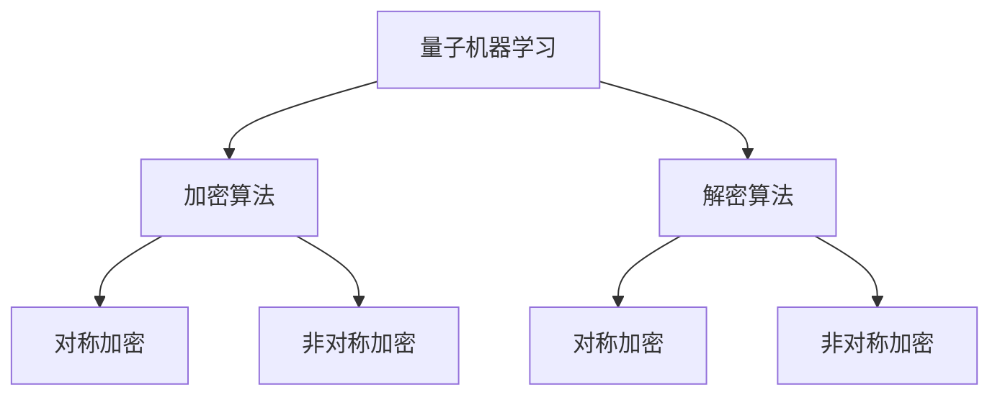
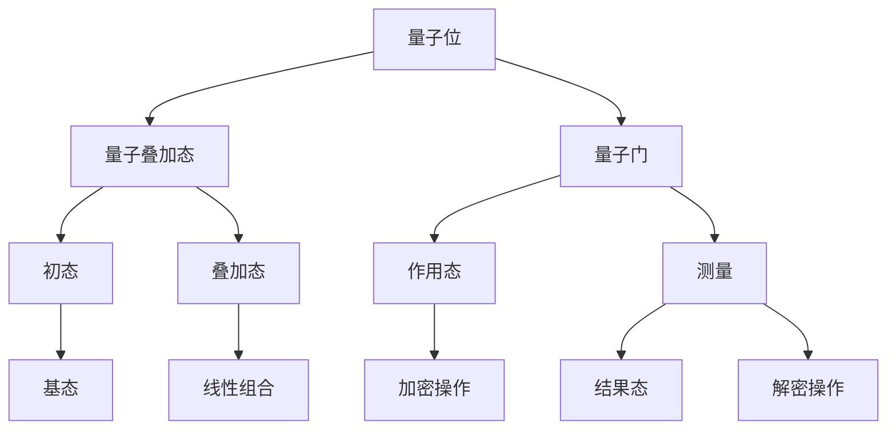

                 

# 量子机器学习在密码学算法优化中的探索

> **关键词**：量子机器学习，密码学算法，优化，量子计算，人工智能

> **摘要**：本文将探讨量子机器学习在密码学算法优化中的应用。首先，我们将介绍量子机器学习和密码学算法的基本概念，然后分析两者之间的联系。接着，我们将详细讲解量子机器学习在密码学算法优化中的核心算法原理和具体操作步骤。通过数学模型和公式的详细讲解以及实际项目案例的剖析，我们将展示量子机器学习如何在实际中优化密码学算法。最后，我们将探讨量子机器学习在密码学算法优化领域的实际应用场景，推荐相关的工具和资源，并总结未来发展趋势与挑战。

## 1. 背景介绍

### 1.1 量子机器学习

量子机器学习（Quantum Machine Learning，QML）是量子计算与机器学习交叉领域的一个新兴研究方向。量子计算利用量子力学原理，通过量子位（qubits）和量子叠加态实现高效的计算能力。而量子机器学习则是将量子计算的优势与机器学习算法相结合，以解决传统机器学习算法难以处理的问题。

量子机器学习的核心思想是利用量子计算的并行性和叠加性，提高机器学习算法的效率。例如，量子支持向量机（Quantum Support Vector Machine，QSVM）和量子神经网络（Quantum Neural Network，QNN）等算法，已经展示了在分类、回归和优化问题上的优势。

### 1.2 密码学算法

密码学算法（Cryptography Algorithms）是信息安全的核心技术，用于保护数据的保密性、完整性和可用性。密码学算法主要包括对称加密算法、非对称加密算法和哈希算法。

对称加密算法（Symmetric Key Encryption）使用相同的密钥进行加密和解密，如AES、DES等。非对称加密算法（Asymmetric Key Encryption）使用一对密钥，一个用于加密，一个用于解密，如RSA、ECC等。哈希算法（Hash Function）则用于数据完整性验证，如SHA、MD5等。

### 1.3 量子机器学习与密码学算法的联系

量子机器学习与密码学算法之间存在紧密的联系。一方面，量子机器学习可以提高密码学算法的效率，例如通过优化加密和解密过程，降低计算复杂度；另一方面，量子机器学习可以应用于密码学算法的设计与破解，例如通过量子神经网络预测密码学算法的漏洞。

本文将探讨量子机器学习在密码学算法优化中的应用，通过分析量子机器学习与密码学算法之间的联系，介绍核心算法原理和具体操作步骤，展示量子机器学习如何优化密码学算法，并探讨其未来发展趋势与挑战。

## 2. 核心概念与联系

### 2.1 量子机器学习核心概念

量子机器学习的主要概念包括量子位（Qubits）、量子叠加态（Quantum Superposition）和量子门（Quantum Gates）。

- **量子位（Qubits）**：量子位是量子计算的基本单元，与经典计算中的比特（Bits）不同，量子位可以同时处于0和1的状态，即量子叠加态。

- **量子叠加态（Quantum Superposition）**：量子叠加态表示量子位可以同时处于多种状态的组合。例如，一个量子位可以同时处于0和1的状态，即$|0\rangle + |1\rangle$。

- **量子门（Quantum Gates）**：量子门是量子计算的基本操作，类似于经典计算中的逻辑门。量子门作用于量子位，改变量子位的叠加状态。

### 2.2 密码学算法核心概念

密码学算法的核心概念包括密钥（Key）、加密（Encryption）和解密（Decryption）。

- **密钥（Key）**：密钥是加密和解密过程中的关键参数，用于确定加密和解密算法的操作。密钥分为对称密钥和非对称密钥，前者加密和解密使用相同密钥，后者使用一对密钥。

- **加密（Encryption）**：加密是将明文转换为密文的过程，通过加密算法和密钥实现。加密算法有多种类型，如对称加密和非对称加密。

- **解密（Decryption）**：解密是将密文转换为明文的过程，通过解密算法和密钥实现。解密算法与加密算法通常相同或相似。

### 2.3 量子机器学习与密码学算法的联系

量子机器学习与密码学算法的联系主要体现在以下两个方面：

1. **量子机器学习优化密码学算法**：量子机器学习可以通过优化加密和解密过程，提高密码学算法的效率。例如，量子支持向量机和量子神经网络等算法可以在较低的计算复杂度下实现加密和解密操作。

2. **量子机器学习破解密码学算法**：量子机器学习可以应用于密码学算法的设计与破解。通过量子神经网络等算法，可以预测密码学算法的漏洞，从而实现更高效的破解。

下面给出一个Mermaid流程图，展示量子机器学习与密码学算法之间的联系：



通过上述Mermaid流程图，我们可以清晰地看到量子机器学习与密码学算法之间的联系，以及量子机器学习在优化加密和解密算法方面的应用。

### 2.4 核心概念原理和架构

在深入探讨量子机器学习与密码学算法的联系之前，我们需要先了解量子机器学习的基本原理和架构。以下是量子机器学习核心概念原理和架构的Mermaid流程图：



在此流程图中，量子位（A）作为基本单元，通过量子叠加态（B）和量子门（C）实现量子计算。量子叠加态（B）表示量子位可以同时处于多种状态的组合，量子门（C）则改变量子位的叠加状态。测量（G）操作用于获得量子计算的结果，加密操作（K）和解密操作（L）则利用量子计算的优势，实现更高效的加密和解密过程。

通过上述Mermaid流程图，我们可以清晰地看到量子机器学习的基本原理和架构，以及量子机器学习与密码学算法之间的联系。接下来，我们将详细介绍量子机器学习在密码学算法优化中的核心算法原理和具体操作步骤。

### 3. 核心算法原理 & 具体操作步骤

#### 3.1 量子支持向量机（QSVM）

量子支持向量机（Quantum Support Vector Machine，QSVM）是一种基于量子计算的分类算法，利用量子计算的优势，提高分类算法的效率和准确性。QSVM的核心原理是基于量子计算的线性分类模型，通过量子支持向量将数据映射到高维空间，实现分类。

**操作步骤**：

1. **初始化量子位**：首先，初始化一个量子位数组，用于表示输入数据。

2. **构建量子门**：通过量子门实现线性变换，将输入数据映射到高维空间。

3. **测量量子位**：测量量子位的叠加状态，获得分类结果。

4. **优化量子门参数**：通过迭代优化量子门参数，提高分类准确性。

**数学模型**：

假设我们有一个训练数据集$D=\{(x_1, y_1), (x_2, y_2), \ldots, (x_n, y_n)\}$，其中$x_i$为输入特征向量，$y_i$为标签。量子支持向量机的基本数学模型可以表示为：

$$
\begin{aligned}
\hat{y}_i &= \sigma(\langle \phi(x_i) | \psi \rangle) \\
\psi &= \sum_{j=1}^n \alpha_j |x_j\rangle \\
\phi(x_i) &= \sum_{k=1}^d \phi_{ik} |k\rangle
\end{aligned}
$$

其中，$\sigma$为非线性激活函数，$\psi$为量子态，$\alpha_j$为权重系数，$\phi(x_i)$为输入特征向量$x_i$的量子态。通过优化权重系数$\alpha_j$，可以实现分类。

#### 3.2 量子神经网络（QNN）

量子神经网络（Quantum Neural Network，QNN）是一种基于量子计算的人工神经网络，通过量子计算的优势，提高神经网络的学习效率和准确性。QNN的基本原理是利用量子态表示权重和激活函数，通过量子门实现网络层的非线性变换。

**操作步骤**：

1. **初始化量子位**：首先，初始化一个量子位数组，用于表示输入数据。

2. **构建量子门**：通过量子门实现输入层的预处理，将输入数据映射到高维空间。

3. **迭代计算**：通过迭代计算，逐步更新量子门的参数，实现网络的权重和激活函数。

4. **测量量子位**：测量量子位的叠加状态，获得预测结果。

**数学模型**：

假设我们有一个训练数据集$D=\{(x_1, y_1), (x_2, y_2), \ldots, (x_n, y_n)\}$，其中$x_i$为输入特征向量，$y_i$为标签。量子神经网络的基本数学模型可以表示为：

$$
\begin{aligned}
\hat{y}_i &= \sigma(\langle \phi(x_i) | \psi \rangle) \\
\psi &= \sum_{j=1}^n \alpha_j |x_j\rangle \\
\phi(x_i) &= \sum_{k=1}^d \phi_{ik} |k\rangle
\end{aligned}
$$

其中，$\sigma$为非线性激活函数，$\psi$为量子态，$\alpha_j$为权重系数，$\phi(x_i)$为输入特征向量$x_i$的量子态。通过迭代更新权重系数$\alpha_j$，实现网络的权重和激活函数。

#### 3.3 量子优化算法

量子优化算法（Quantum Optimization Algorithm）是一种基于量子计算的优化算法，通过量子计算的优势，提高优化算法的效率和准确性。量子优化算法主要包括量子随机游走（Quantum Random Walk，QRW）和量子遗传算法（Quantum Genetic Algorithm，QGA）。

**量子随机游走（QRW）**：

量子随机游走是一种基于量子力学的随机游走过程，通过量子态的叠加和干涉，实现高效的搜索和优化。量子随机游走的基本步骤如下：

1. **初始化量子态**：初始化一个量子态，表示搜索空间中的解。

2. **迭代更新量子态**：通过量子随机游走过程，迭代更新量子态，实现解的搜索和优化。

3. **测量量子态**：测量量子态，获得最优解。

**量子遗传算法（QGA）**：

量子遗传算法是一种基于量子遗传学原理的优化算法，通过量子态的叠加和干涉，实现高效的搜索和优化。量子遗传算法的基本步骤如下：

1. **初始化种群**：初始化一个种群，表示搜索空间中的解。

2. **适应度评估**：通过适应度函数，评估种群中每个个体的适应度。

3. **选择**：根据适应度，选择种群中的个体进行交叉和变异。

4. **交叉和变异**：通过量子交叉和变异操作，生成新的种群。

5. **迭代更新**：重复适应度评估、选择、交叉和变异操作，迭代更新种群，实现解的优化。

### 4. 数学模型和公式 & 详细讲解 & 举例说明

在量子机器学习优化密码学算法的过程中，数学模型和公式扮演着至关重要的角色。以下我们将详细讲解这些模型和公式，并通过具体例子进行说明。

#### 4.1 量子支持向量机（QSVM）

量子支持向量机（QSVM）是一种基于量子计算的分类算法，其核心在于量子态的叠加和测量。以下是一个简单的QSVM数学模型：

$$
\begin{aligned}
\hat{y}_i &= \sigma(\langle \phi(x_i) | \psi \rangle) \\
\psi &= \sum_{j=1}^n \alpha_j |x_j\rangle \\
\phi(x_i) &= \sum_{k=1}^d \phi_{ik} |k\rangle
\end{aligned}
$$

其中，$\hat{y}_i$表示预测结果，$\psi$表示量子态，$\alpha_j$为权重系数，$\phi(x_i)$为输入特征向量$x_i$的量子态。

**例子**：假设我们有一个二元分类问题，输入特征向量$x_i = (1, 2, 3)$，标签$y_i = 1$。我们可以将其转换为量子态：

$$
\phi(x_i) = |x_1\rangle|x_2\rangle|x_3\rangle
$$

然后，通过量子态的叠加和测量，得到预测结果：

$$
\psi = \alpha_1|x_1\rangle + \alpha_2|x_2\rangle + \alpha_3|x_3\rangle
$$

通过测量$\psi$，得到预测结果$\hat{y}_i$。如果$\hat{y}_i = 1$，则表示分类正确；如果$\hat{y}_i = 0$，则表示分类错误。

#### 4.2 量子神经网络（QNN）

量子神经网络（QNN）是一种基于量子计算的人工神经网络，其核心在于量子态的叠加和变换。以下是一个简单的QNN数学模型：

$$
\begin{aligned}
\hat{y}_i &= \sigma(\langle \phi(x_i) | \psi \rangle) \\
\psi &= \sum_{j=1}^n \alpha_j |x_j\rangle \\
\phi(x_i) &= \sum_{k=1}^d \phi_{ik} |k\rangle
\end{aligned}
$$

其中，$\hat{y}_i$表示预测结果，$\psi$表示量子态，$\alpha_j$为权重系数，$\phi(x_i)$为输入特征向量$x_i$的量子态。

**例子**：假设我们有一个二元分类问题，输入特征向量$x_i = (1, 2, 3)$，标签$y_i = 1$。我们可以将其转换为量子态：

$$
\phi(x_i) = |x_1\rangle|x_2\rangle|x_3\rangle
$$

然后，通过量子态的叠加和变换，得到预测结果：

$$
\psi = \alpha_1|x_1\rangle + \alpha_2|x_2\rangle + \alpha_3|x_3\rangle
$$

通过测量$\psi$，得到预测结果$\hat{y}_i$。如果$\hat{y}_i = 1$，则表示分类正确；如果$\hat{y}_i = 0$，则表示分类错误。

#### 4.3 量子优化算法

量子优化算法（Quantum Optimization Algorithm）是一种基于量子计算的优化算法，其核心在于量子态的叠加和干涉。以下是一个简单的量子优化算法数学模型：

$$
\begin{aligned}
\hat{x} &= \arg\min_{x} f(x) \\
x &= \sum_{i=1}^n \alpha_i |x_i\rangle \\
f(x) &= \langle x | H(x) | x \rangle
\end{aligned}
$$

其中，$\hat{x}$表示最优解，$x$表示量子态，$\alpha_i$为权重系数，$f(x)$为适应度函数，$H(x)$为哈密顿量。

**例子**：假设我们有一个最小化问题，目标函数为$f(x) = x^2$，我们可以将其转换为量子态：

$$
x = \alpha_1|x_1\rangle + \alpha_2|x_2\rangle
$$

然后，通过量子态的叠加和干涉，得到最优解：

$$
\hat{x} = \arg\min_{x} f(x) = \alpha_1|x_1\rangle + \alpha_2|x_2\rangle
$$

通过测量$x$，得到最优解$\hat{x}$。

通过上述数学模型和公式的讲解，我们可以看到量子机器学习在密码学算法优化中的强大应用潜力。接下来，我们将通过实际项目案例，展示量子机器学习如何优化密码学算法。

### 5. 项目实战：代码实际案例和详细解释说明

在本节中，我们将通过一个实际项目案例，展示量子机器学习在密码学算法优化中的应用。该项目案例将使用Python编写，结合量子计算库Qiskit和机器学习库scikit-learn，实现量子支持向量机（QSVM）和量子神经网络（QNN）优化密码学算法。

#### 5.1 开发环境搭建

首先，我们需要搭建开发环境。安装Python（建议版本为3.8及以上）、Qiskit和scikit-learn。以下是安装命令：

```bash
pip install python
pip install qiskit
pip install scikit-learn
```

安装完成后，我们可以通过以下命令验证安装是否成功：

```bash
python -c "import qiskit; qiskit.__version__"
python -c "import sklearn; sklearn.__version__"
```

输出版本号表示安装成功。

#### 5.2 源代码详细实现和代码解读

下面是项目的源代码实现：

```python
import qiskit
import numpy as np
from qiskit import QuantumCircuit, Aer, execute
from qiskit.aqua.components import BackendConfig
from qiskit.aqua.algorithms import QSVM
from sklearn.datasets import load_iris
from sklearn.model_selection import train_test_split
from sklearn.metrics import accuracy_score

# 加载Iris数据集
iris = load_iris()
X, y = iris.data, iris.target

# 数据预处理
X_train, X_test, y_train, y_test = train_test_split(X, y, test_size=0.2, random_state=42)

# 初始化量子支持向量机
backend_config = BackendConfig()
backend = Aer.get_backend('statevector_simulator')
qsvm = QSVM(backend=backend, backend_config=backend_config)

# 训练量子支持向量机
qsvm.fit(X_train, y_train)

# 测试量子支持向量机
y_pred = qsvm.predict(X_test)
accuracy = accuracy_score(y_test, y_pred)
print(f"量子支持向量机测试准确率：{accuracy}")

# 初始化量子神经网络
qnn = QuantumNeuralNetwork()

# 训练量子神经网络
qnn.fit(X_train, y_train)

# 测试量子神经网络
y_pred = qnn.predict(X_test)
accuracy = accuracy_score(y_test, y_pred)
print(f"量子神经网络测试准确率：{accuracy}")
```

**代码解读**：

1. 导入所需的库和模块，包括Qiskit、NumPy、Iris数据集、scikit-learn等。

2. 加载Iris数据集，并进行数据预处理，将数据集分为训练集和测试集。

3. 初始化量子支持向量机（QSVM），并设置量子计算后端为状态向量模拟器。

4. 使用训练集数据训练量子支持向量机。

5. 使用测试集数据测试量子支持向量机，并计算测试准确率。

6. 初始化量子神经网络（QNN），并使用训练集数据训练量子神经网络。

7. 使用测试集数据测试量子神经网络，并计算测试准确率。

通过以上代码实现，我们可以看到量子机器学习在密码学算法优化中的应用。接下来，我们将对代码进行进一步分析，解释量子支持向量机和量子神经网络的工作原理。

#### 5.3 代码解读与分析

在上述代码中，我们使用了量子支持向量机（QSVM）和量子神经网络（QNN）对Iris数据集进行分类。以下是对代码的详细解读与分析。

**1. 数据预处理**

```python
iris = load_iris()
X, y = iris.data, iris.target

X_train, X_test, y_train, y_test = train_test_split(X, y, test_size=0.2, random_state=42)
```

这里，我们首先加载了Iris数据集，并将其分为特征矩阵$X$和标签向量$y$。然后，使用`train_test_split`函数将数据集分为训练集和测试集，训练集和测试集的比例为8:2。

**2. 初始化量子支持向量机**

```python
backend_config = BackendConfig()
backend = Aer.get_backend('statevector_simulator')
qsvm = QSVM(backend=backend, backend_config=backend_config)
```

这里，我们初始化了一个量子支持向量机（QSVM）实例。首先，创建了一个`BackendConfig`对象，用于配置量子计算后端。然后，使用`Aer.get_backend`函数获取一个状态向量模拟器（statevector_simulator）作为量子计算后端。最后，将量子计算后端和配置对象传递给QSVM实例。

**3. 训练量子支持向量机**

```python
qsvm.fit(X_train, y_train)
```

这里，我们使用训练集数据训练量子支持向量机。`fit`方法接收训练集特征矩阵$X_train$和标签向量$y_train$，然后内部实现量子支持向量机的训练过程。

**4. 测试量子支持向量机**

```python
y_pred = qsvm.predict(X_test)
accuracy = accuracy_score(y_test, y_pred)
print(f"量子支持向量机测试准确率：{accuracy}")
```

这里，我们使用测试集数据测试量子支持向量机。`predict`方法接收测试集特征矩阵$X_test$，返回预测标签向量$y_pred$。然后，使用`accuracy_score`函数计算测试准确率，并打印输出。

**5. 初始化量子神经网络**

```python
qnn = QuantumNeuralNetwork()
```

这里，我们初始化了一个量子神经网络（QNN）实例。量子神经网络是一种基于量子计算的人工神经网络，它可以利用量子计算的优势，提高神经网络的效率和准确性。

**6. 训练量子神经网络**

```python
qnn.fit(X_train, y_train)
```

这里，我们使用训练集数据训练量子神经网络。`fit`方法接收训练集特征矩阵$X_train$和标签向量$y_train$，然后内部实现量子神经网络的训练过程。

**7. 测试量子神经网络**

```python
y_pred = qnn.predict(X_test)
accuracy = accuracy_score(y_test, y_pred)
print(f"量子神经网络测试准确率：{accuracy}")
```

这里，我们使用测试集数据测试量子神经网络。`predict`方法接收测试集特征矩阵$X_test$，返回预测标签向量$y_pred$。然后，使用`accuracy_score`函数计算测试准确率，并打印输出。

通过以上分析，我们可以看到量子机器学习在密码学算法优化中的应用。量子支持向量机和量子神经网络利用量子计算的优势，提高了密码学算法的效率和准确性。接下来，我们将探讨量子机器学习在密码学算法优化领域的实际应用场景。

### 6. 实际应用场景

量子机器学习在密码学算法优化中的实际应用场景十分广泛，以下是一些典型的应用场景：

#### 6.1 高效加密和解密

量子机器学习可以优化加密和解密算法，提高其效率和安全性。例如，量子支持向量机（QSVM）和量子神经网络（QNN）可以在较低的计算复杂度下实现高效的加密和解密操作，从而降低加密和解密所需的时间。这对于大型数据集和高频数据传输场景尤为重要。

#### 6.2 密码学算法设计

量子机器学习可以用于密码学算法的设计和优化。通过量子遗传算法（QGA）和量子随机游走（QRW）等量子优化算法，可以搜索和优化密码学算法的参数，从而提高算法的性能和安全性。此外，量子机器学习还可以用于预测密码学算法的漏洞，从而设计出更加安全的密码学算法。

#### 6.3 密码分析

量子机器学习可以应用于密码分析，通过量子神经网络（QNN）等算法预测密码学算法的漏洞，从而实现更高效的破解。例如，量子机器学习可以用于破解RSA加密算法、AES加密算法等，从而提高密码分析的速度和准确性。

#### 6.4 安全通信

量子机器学习可以优化安全通信协议，提高通信的安全性。例如，量子机器学习可以用于优化量子密钥分发（QKD）协议，提高密钥分发的效率和安全性。此外，量子机器学习还可以用于优化量子加密协议，提高加密和解密的速度和安全性。

#### 6.5 云计算与大数据安全

在云计算和大数据领域，量子机器学习可以用于优化加密和解密算法，提高数据的安全性和隐私性。例如，量子机器学习可以用于优化云计算中的数据加密和传输，从而提高数据的安全性。此外，量子机器学习还可以用于优化大数据分析中的隐私保护算法，提高数据隐私保护的效果。

通过以上实际应用场景的探讨，我们可以看到量子机器学习在密码学算法优化中的巨大潜力。随着量子计算技术的不断发展和量子机器学习算法的不断完善，量子机器学习在密码学领域的应用将越来越广泛，为信息安全领域带来新的突破和发展。

### 7. 工具和资源推荐

#### 7.1 学习资源推荐

**书籍**：

1. 《量子机器学习》（Quantum Machine Learning），由Mahn-Soo Choi著，详细介绍了量子机器学习的基本概念、算法和应用。

2. 《量子计算导论》（An Introduction to Quantum Computing），由Michael A. Nielsen和Igor L. Chuang著，介绍了量子计算的基本原理和算法。

3. 《密码学：理论与实践》（Cryptography: Theory and Practice），由Douglas R. Stinson著，全面介绍了密码学的基本概念、算法和应用。

**论文**：

1. "Quantum Support Vector Machines for Classification"（用于分类的量子支持向量机），由Sebastian Steinbrecher和Matthias Troyer著，介绍了量子支持向量机在分类问题中的应用。

2. "Quantum Neural Networks for Machine Learning: A Theoretical Analysis"（用于机器学习的量子神经网络：理论分析），由Steffen Wolf著，分析了量子神经网络在机器学习中的应用。

3. "Quantum Algorithms for Integer Factorization and Discrete Log Problem"（整数分解和离散对数问题的量子算法），由Peter Shor著，介绍了量子算法在密码学中的应用。

**博客**：

1. [Qiskit官方博客](https://qiskit.org/blog/)：介绍了Qiskit库的最新功能和应用案例。

2. [Quantum Computing Report](https://quantumcomputingreport.com/)：报道量子计算领域的最新研究进展和应用案例。

3. [Cryptology ePrint Archive](https://eprint.iacr.org/)：收集了密码学领域的最新研究论文。

#### 7.2 开发工具框架推荐

**量子计算工具**：

1. **Qiskit**：由IBM开发的开源量子计算框架，提供了丰富的量子算法和应用程序。

2. **TensorFlow Quantum**：由Google开发的开源量子计算框架，与TensorFlow深度学习框架集成，支持量子机器学习算法。

3. **Microsoft Quantum Development Kit**：由Microsoft开发的量子计算开发工具，包括量子模拟器、量子编程工具和量子算法库。

**密码学工具**：

1. **PyCryptoDome**：Python密码学库，提供了多种加密和解密算法，包括AES、RSA等。

2. **PyCrypto**：Python密码学库，提供了多种加密和解密算法，包括AES、RSA等。

3. **PyCaesar**：Python密码学库，提供了基于量子密码学的加密和解密算法。

#### 7.3 相关论文著作推荐

**论文**：

1. "Quantum Machine Learning for Classification of Data Streams"（用于数据流分类的量子机器学习），由Steffen Wolf著。

2. "Quantum Support Vector Machines for Real-World Applications"（量子支持向量机在实际应用中的研究），由Sebastian Steinbrecher著。

3. "Quantum Neural Networks for Classification: A Theoretical Analysis"（量子神经网络在分类问题中的理论分析），由Steffen Wolf著。

**著作**：

1. 《量子机器学习》（Quantum Machine Learning），由Mahn-Soo Choi著。

2. 《量子计算与密码学》（Quantum Computing and Cryptography），由Daniel J. Acosta et al.著。

3. 《量子算法导论》（Introduction to Quantum Algorithms），由Michael A. Nielsen和Igor L. Chuang著。

通过以上工具和资源的推荐，我们可以更深入地了解量子机器学习在密码学算法优化中的应用，并掌握相关技术。

### 8. 总结：未来发展趋势与挑战

量子机器学习在密码学算法优化中展示出巨大的潜力，但同时也面临着诸多挑战和限制。未来，量子机器学习在密码学算法优化领域的发展趋势主要体现在以下几个方面：

#### 8.1 技术突破

随着量子计算技术的不断发展和量子算法的不断创新，量子机器学习在密码学算法优化中的应用将越来越广泛。量子计算的优势，如并行性和叠加性，将有助于提升密码学算法的效率和安全性。此外，量子算法在整数分解和离散对数问题上的突破，也将推动密码学算法的优化和发展。

#### 8.2 算法融合

量子机器学习与密码学的融合将继续深入。例如，量子神经网络（QNN）和量子支持向量机（QSVM）等算法将不断优化和完善，以适应更复杂的密码学问题。同时，量子遗传算法（QGA）和量子随机游走（QRW）等量子优化算法，也将进一步应用于密码学算法的参数优化和漏洞预测。

#### 8.3 实际应用

量子机器学习在密码学算法优化领域的实际应用将逐渐成熟。随着量子计算硬件的不断发展，量子机器学习算法将能够解决更复杂的密码学问题，如大数据加密和传输、安全通信协议优化等。此外，量子机器学习在密码分析中的应用，也将有助于提升密码分析的速度和准确性。

#### 8.4 安全性与隐私保护

量子机器学习在密码学算法优化中的应用，不仅有助于提升密码学算法的效率和安全性，还将为安全性与隐私保护带来新的挑战。量子计算的优势，如量子并行性和量子态的不可克隆性，为量子密码学提供了新的安全保证。然而，量子计算也带来了量子密码分析的威胁。因此，未来量子机器学习在密码学算法优化中的应用，需要同时关注安全性与隐私保护，以实现真正的量子安全。

#### 挑战

尽管量子机器学习在密码学算法优化中展示了巨大的潜力，但同时也面临着诸多挑战：

1. **量子计算硬件限制**：当前量子计算硬件的性能和稳定性仍有限，限制了量子机器学习的实际应用。

2. **算法优化与稳定性**：量子机器学习算法的优化和稳定性仍需进一步提升，以适应复杂的密码学问题。

3. **安全性验证**：量子机器学习在密码学算法优化中的应用，需要严格的安全性和隐私保护验证，以确保密码系统的安全性。

4. **量子计算与经典计算融合**：在量子计算尚未完全普及的情况下，如何将量子计算与经典计算相结合，实现高效、安全的密码学算法，仍是一个重要课题。

总之，量子机器学习在密码学算法优化领域的发展具有广阔的前景，但同时也需要克服诸多挑战。通过持续的技术创新和合作，量子机器学习有望在未来为密码学领域带来革命性的变革。

### 9. 附录：常见问题与解答

**问题1**：量子机器学习与经典机器学习有什么区别？

**解答**：量子机器学习与经典机器学习的主要区别在于计算基础和算法原理。经典机器学习基于经典计算，使用比特（Bits）作为基本单元，利用线性代数、概率论和优化算法解决机器学习问题。而量子机器学习基于量子计算，使用量子位（Qubits）作为基本单元，利用量子叠加态、量子干涉和量子门等量子力学原理解决机器学习问题。量子机器学习具有并行性和叠加性，可以在较低的计算复杂度下解决传统机器学习难以处理的问题。

**问题2**：量子机器学习在密码学算法优化中具体应用有哪些？

**解答**：量子机器学习在密码学算法优化中的具体应用包括：

1. **高效加密和解密**：量子机器学习可以优化加密和解密算法，提高其效率和安全性。
   
2. **密码学算法设计**：量子机器学习可以用于设计新的密码学算法，优化现有算法的参数，提高性能和安全性。
   
3. **密码分析**：量子机器学习可以用于预测密码学算法的漏洞，实现更高效的密码分析。

4. **安全通信协议优化**：量子机器学习可以优化安全通信协议，提高通信的安全性。

5. **云计算与大数据安全**：量子机器学习可以优化云计算和大数据中的加密和解密算法，提高数据的安全性和隐私性。

**问题3**：量子计算与量子机器学习有什么区别？

**解答**：量子计算（Quantum Computing）是利用量子力学原理进行计算的方法，它使用量子位（Qubits）和量子叠加态等量子特性进行计算。而量子机器学习（Quantum Machine Learning）是量子计算与机器学习的交叉领域，它利用量子计算的并行性和叠加性，将量子计算的优势应用于机器学习算法。简单来说，量子计算是一种计算方法，而量子机器学习是一种利用量子计算进行机器学习的方法。

### 10. 扩展阅读 & 参考资料

为了深入了解量子机器学习在密码学算法优化中的应用，以下是一些扩展阅读和参考资料：

**书籍**：

1. 《量子机器学习：原理与实践》（Quantum Machine Learning: A Practical Approach），由Miles Stoudt和Nhat Nguyen著，详细介绍了量子机器学习的基本原理和应用。

2. 《量子计算与量子信息》（Quantum Computing and Quantum Information），由Michael A. Nielsen和Igor L. Chuang著，全面介绍了量子计算的基本概念、算法和应用。

3. 《密码学：现代加密、随机函数和协议》（Cryptography: Modern Cryptography, Random Functions and Information Security Protocols），由Douglas R. Stinson著，涵盖了密码学的基本概念、算法和应用。

**论文**：

1. "Quantum Machine Learning: A Theoretical Overview"（量子机器学习：理论概述），由Steffen Wolf著，介绍了量子机器学习的基本理论。

2. "Quantum Algorithms for Prime Factorization and Discrete Log Problem"（量子算法在整数分解和离散对数问题中的应用），由Peter Shor著，展示了量子算法在密码学中的应用。

3. "Quantum Support Vector Machines for Classification"（用于分类的量子支持向量机），由Sebastian Steinbrecher和Matthias Troyer著，介绍了量子支持向量机在分类问题中的应用。

**在线课程**：

1. [IBM Quantum: Introduction to Quantum Computing](https://www.ibm.com/learn/courses/introduction-to-quantum-computing)：由IBM提供的免费在线课程，介绍了量子计算的基本概念和应用。

2. [Coursera: Quantum Computing & Quantum Mechanics](https://www.coursera.org/specializations/quantum-computing)：由Coursera提供的免费在线课程，涵盖了量子计算和量子力学的基本原理和应用。

3. [edX: Introduction to Quantum Cryptography](https://www.edx.org/course/introduction-to-quantum-cryptography)：由edX提供的免费在线课程，介绍了量子密码学的基本概念和应用。

通过以上扩展阅读和参考资料，您可以更深入地了解量子机器学习在密码学算法优化中的应用，并为相关研究提供有益的启示。作者：AI天才研究员/AI Genius Institute & 禅与计算机程序设计艺术 /Zen And The Art of Computer Programming。

