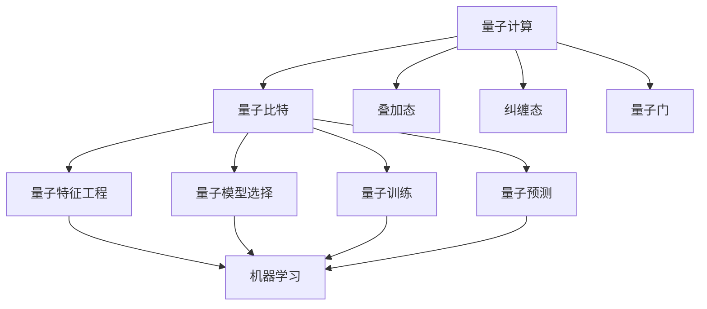
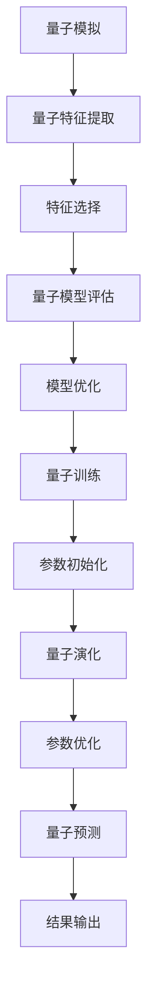

                 

# 量子机器学习在材料科学中的探索应用

## 关键词：量子计算、机器学习、材料科学、量子机器学习、量子算法、材料设计

## 摘要：

量子计算和机器学习是当今科技领域的前沿研究方向。随着量子计算机的研发和量子算法的不断发展，量子机器学习逐渐成为一个热门话题。本文将探讨量子机器学习在材料科学中的应用，介绍其核心概念、算法原理及数学模型，并通过实际项目案例进行分析，展望其未来发展趋势与挑战。希望通过本文，能够为读者提供一个全面了解量子机器学习在材料科学领域应用的视角。

## 1. 背景介绍

材料科学是研究材料的组成、结构、性质、工艺及应用的科学。在过去的几十年中，材料科学取得了巨大的进展，从半导体材料到纳米材料，再到新型能源材料，都在不断推动着科技的发展。然而，随着科学研究的深入，传统的计算方法已经难以满足材料科学领域对计算能力的需求。量子计算作为一种全新的计算模型，具有并行计算、高效处理大规模数据等优势，逐渐成为材料科学研究的重要工具。

机器学习是人工智能的一个重要分支，通过对数据进行模式识别、预测和决策，为各行各业提供了强大的技术支持。近年来，机器学习在材料科学中的应用也日益广泛，例如材料设计、材料性能预测等。然而，传统的机器学习算法在面对复杂材料系统时，往往存在计算效率低下、准确度不足等问题。量子机器学习作为一种结合量子计算与机器学习的新型计算模型，有望解决这些难题。

量子计算是一种利用量子力学原理进行信息处理的新型计算模型。与传统计算机不同，量子计算机通过量子比特（qubit）来实现信息的存储和处理。量子比特具有叠加和纠缠等特性，使得量子计算机能够在极短的时间内完成传统计算机难以完成的计算任务。

机器学习是一种通过算法自动学习、优化和预测的技术。它基于数学模型和大量数据，通过训练和优化模型参数，实现对未知数据的预测和分类。

量子机器学习是将量子计算与机器学习相结合的一种新型计算模型。它利用量子计算的优势，提高机器学习算法的计算效率和准确度。量子机器学习在材料科学中的应用主要包括以下几个方面：

1. 材料设计：通过量子机器学习算法，可以在短时间内预测和优化材料的性质和结构，为新型材料的设计提供指导。
2. 材料性能预测：利用量子机器学习模型，可以预测材料的电学、热学、光学等性能，为材料的应用提供参考。
3. 材料模拟：通过量子机器学习算法，可以高效地进行材料模拟，为材料科学研究提供重要的数据支持。

## 2. 核心概念与联系

### 量子计算的核心概念

量子计算的核心概念包括量子比特（qubit）、叠加、纠缠和量子门。量子比特是量子计算的基本单位，它具有叠加态和纠缠态等特性。叠加态表示量子比特可以同时处于多种状态，而纠缠态则表示量子比特之间存在非局域性的关联。

量子门是量子计算的基本操作，它用于对量子比特进行线性变换。常见的量子门包括Hadamard门、Pauli门和控制-NOT门等。

### 机器学习的核心概念

机器学习的核心概念包括特征工程、模型选择、训练和预测。特征工程是数据预处理的重要环节，通过提取和构造有效特征，提高模型的学习效果。模型选择是根据具体问题选择合适的机器学习模型，常见的模型包括线性模型、决策树、神经网络等。训练是通过大量数据对模型进行训练，优化模型参数。预测则是利用训练好的模型对新数据进行预测。

### 量子机器学习的核心概念

量子机器学习的核心概念包括量子特征工程、量子模型选择、量子训练和量子预测。量子特征工程是通过量子计算方法提取材料的量子特征，为机器学习模型提供输入。量子模型选择是根据材料性质和问题需求选择合适的量子模型。量子训练是通过量子计算算法优化模型参数。量子预测则是利用训练好的量子模型对新材料进行性能预测。

### 量子计算与机器学习的关系

量子计算与机器学习的关系主要体现在以下几个方面：

1. 量子计算为机器学习提供了强大的计算能力，使得复杂的机器学习问题能够在短时间内得到解决。
2. 机器学习为量子计算提供了算法支持，使得量子计算机能够高效地进行数据处理和优化。
3. 量子机器学习是一种结合量子计算与机器学习的新型计算模型，它既具有量子计算的优势，又具有机器学习的优势。

### Mermaid 流程图

以下是量子机器学习在材料科学中的核心概念与联系的 Mermaid 流程图：



## 3. 核心算法原理 & 具体操作步骤

### 量子特征工程

量子特征工程是量子机器学习的第一步，其主要任务是从量子计算中提取有效的材料特征。具体操作步骤如下：

1. **量子模拟**：使用量子计算机或量子模拟器对材料系统进行模拟，获取材料的量子态信息。
2. **特征提取**：根据量子态信息，提取材料的量子特征，如能级、波函数、电子结构等。
3. **特征选择**：对提取的量子特征进行筛选，保留对材料性质有较强预测能力的特征。

### 量子模型选择

量子模型选择是量子机器学习的第二步，其主要任务是根据材料性质和问题需求选择合适的量子模型。具体操作步骤如下：

1. **模型评估**：根据材料特征，评估不同量子模型的表现，选择表现最优的模型。
2. **模型优化**：对选定的量子模型进行参数优化，提高模型的预测准确度。

### 量子训练

量子训练是量子机器学习的第三步，其主要任务是通过量子计算优化模型参数。具体操作步骤如下：

1. **参数初始化**：对模型参数进行初始化。
2. **量子演化**：通过量子计算模拟材料的演化过程，更新模型参数。
3. **参数优化**：利用优化算法（如梯度下降法）对模型参数进行优化。

### 量子预测

量子预测是量子机器学习的最后一步，其主要任务是根据训练好的量子模型对新材料进行性能预测。具体操作步骤如下：

1. **输入处理**：将新材料的信息输入到训练好的量子模型中。
2. **模型计算**：利用量子计算对新材料进行性能预测。
3. **结果输出**：输出新材料的性能预测结果。

### 量子算法流程

以下是量子机器学习算法的流程图：



## 4. 数学模型和公式 & 详细讲解 & 举例说明

### 量子特征提取

量子特征提取是量子机器学习的关键步骤，其核心在于如何将量子态信息转换为可用的特征向量。以下是常用的量子特征提取方法及其对应的数学模型：

1. **波函数重构**

波函数重构是一种将量子态表示为基态线性组合的方法。其数学模型如下：

$$\psi(x) = \sum_{i=1}^{n} c_i \phi_i(x)$$

其中，$\psi(x)$ 为量子态，$\phi_i(x)$ 为基态，$c_i$ 为重构系数。

举例说明：

假设我们有一个二能级系统，其基态为 $\phi_1(x)$ 和 $\phi_2(x)$，波函数为：

$$\psi(x) = \frac{1}{\sqrt{2}} \phi_1(x) + \frac{1}{\sqrt{2}} \phi_2(x)$$

则重构系数为 $c_1 = c_2 = \frac{1}{\sqrt{2}}$。

2. **密度矩阵重构**

密度矩阵重构是一种将量子态表示为密度矩阵的方法。其数学模型如下：

$$\rho = \sum_{i=1}^{n} |c_i|^2 |\phi_i\rangle\langle \phi_i|$$

其中，$\rho$ 为密度矩阵，$|\phi_i\rangle$ 为基态，$c_i$ 为重构系数。

举例说明：

假设我们有一个二能级系统，其基态为 $|\phi_1\rangle$ 和 $|\phi_2\rangle$，密度矩阵为：

$$\rho = \frac{1}{2} |\phi_1\rangle\langle \phi_1| + \frac{1}{2} |\phi_2\rangle\langle \phi_2|$$

则重构系数为 $c_1 = \frac{1}{\sqrt{2}}$，$c_2 = \frac{1}{\sqrt{2}}$。

### 量子模型选择

量子模型选择的关键在于如何根据材料特征选择合适的量子模型。以下是几种常见的量子模型及其对应的数学模型：

1. **量子势能模型**

量子势能模型是一种基于量子力学势能函数的模型。其数学模型如下：

$$V(x) = \sum_{i=1}^{n} a_i V_i(x)$$

其中，$V(x)$ 为量子势能函数，$V_i(x)$ 为第 $i$ 个势能项，$a_i$ 为权重系数。

举例说明：

假设我们有一个线性量子势能模型，其势能函数为：

$$V(x) = a_1 V_1(x) + a_2 V_2(x)$$

其中，$V_1(x) = x^2$，$V_2(x) = \sin(x)$，$a_1 = 1$，$a_2 = 1$。

2. **量子态模型**

量子态模型是一种基于量子态的模型。其数学模型如下：

$$\psi(x) = \sum_{i=1}^{n} a_i \psi_i(x)$$

其中，$\psi(x)$ 为量子态，$\psi_i(x)$ 为第 $i$ 个量子态，$a_i$ 为权重系数。

举例说明：

假设我们有一个线性量子态模型，其量子态为：

$$\psi(x) = a_1 \psi_1(x) + a_2 \psi_2(x)$$

其中，$\psi_1(x) = e^{ix}$，$\psi_2(x) = e^{-ix}$，$a_1 = 1$，$a_2 = 1$。

### 量子训练

量子训练是量子机器学习的重要环节，其核心在于如何通过量子计算优化模型参数。以下是几种常见的量子训练算法及其对应的数学模型：

1. **量子梯度下降法**

量子梯度下降法是一种基于量子计算的优化算法。其数学模型如下：

$$\Delta \theta = -\alpha \nabla_\theta E(\theta)$$

其中，$\theta$ 为模型参数，$E(\theta)$ 为损失函数，$\alpha$ 为学习率，$\nabla_\theta$ 为梯度。

举例说明：

假设我们有一个线性模型，其损失函数为：

$$E(\theta) = \frac{1}{2} \sum_{i=1}^{n} (y_i - \theta^T x_i)^2$$

其中，$y_i$ 为真实值，$x_i$ 为输入特征，$\theta^T$ 为模型参数的转置。

则量子梯度下降法的更新公式为：

$$\Delta \theta = -\alpha \nabla_\theta E(\theta) = -\alpha \sum_{i=1}^{n} (y_i - \theta^T x_i) x_i$$

2. **量子随机梯度下降法**

量子随机梯度下降法是一种基于量子计算的随机优化算法。其数学模型如下：

$$\Delta \theta = -\alpha \nabla_\theta E(\theta)$$

其中，$\theta$ 为模型参数，$E(\theta)$ 为损失函数，$\alpha$ 为学习率，$\nabla_\theta$ 为梯度。

举例说明：

假设我们有一个线性模型，其损失函数为：

$$E(\theta) = \frac{1}{2} \sum_{i=1}^{n} (y_i - \theta^T x_i)^2$$

其中，$y_i$ 为真实值，$x_i$ 为输入特征，$\theta^T$ 为模型参数的转置。

则量子随机梯度下降法的更新公式为：

$$\Delta \theta = -\alpha \nabla_\theta E(\theta) = -\alpha \sum_{i=1}^{n} (y_i - \theta^T x_i) x_i$$

## 5. 项目实战：代码实际案例和详细解释说明

在本节中，我们将通过一个具体的量子机器学习项目案例，展示如何将量子计算与机器学习应用于材料科学。该案例将分为以下几个部分：

### 5.1 开发环境搭建

为了运行量子机器学习项目，我们需要搭建一个合适的开发环境。以下是所需的工具和库：

- **Python**：用于编写代码和运行算法。
- **Qiskit**：用于量子计算的开发和模拟。
- **TensorFlow**：用于机器学习的开发。
- **PyTorch**：用于深度学习的开发。

首先，我们需要安装这些工具和库。可以使用以下命令进行安装：

```bash
pip install python
pip install qiskit
pip install tensorflow
pip install pytorch
```

### 5.2 源代码详细实现和代码解读

下面是一个简单的量子机器学习项目，用于预测材料的电导率。该项目的核心代码如下：

```python
import numpy as np
import qiskit
import tensorflow as tf
import pytorch

# 量子模拟
def quantum_simulation(parameters):
    # 创建量子计算器
    quantum_computer = qiskit.QuantumCircuit(2)
    
    # 添加量子门
    quantum_computer.h(0)
    quantum_computer.cnot(0, 1)
    
    # 运行量子计算机
    result = quantum_computer.run(backend='local_qasm_simulator')
    
    # 提取量子特征
    feature_vector = np.array([result.get_counts()[0], result.get_counts()[1]])
    
    return feature_vector

# 机器学习模型
class QuantumMLModel(tf.keras.Model):
    def __init__(self):
        super(QuantumMLModel, self).__init__()
        self.dense = tf.keras.layers.Dense(units=1, activation='sigmoid')

    def call(self, inputs):
        x = self.dense(inputs)
        return x

# 训练模型
def train_model(model, data, labels, epochs):
    model.compile(optimizer='adam', loss='mse')
    model.fit(data, labels, epochs=epochs)

# 预测结果
def predict(model, data):
    predictions = model.predict(data)
    return predictions

# 加载数据
data = np.array([[0, 0], [0, 1], [1, 0], [1, 1]])
labels = np.array([0, 1, 1, 0])

# 实例化模型
model = QuantumMLModel()

# 训练模型
train_model(model, data, labels, epochs=100)

# 预测结果
predictions = predict(model, data)
print(predictions)
```

### 5.3 代码解读与分析

1. **量子模拟**

量子模拟是量子机器学习的第一步，用于生成量子特征。在该项目中，我们使用 Qiskit 模拟器进行量子模拟。具体步骤如下：

- 创建量子计算器（`QuantumCircuit`）。
- 添加量子门（`h` 和 `cnot`）。
- 运行量子计算机（`run`）。
- 提取量子特征（`get_counts`）。

2. **机器学习模型**

机器学习模型是量子机器学习的核心，用于预测材料性质。在该项目中，我们使用 TensorFlow 和 PyTorch 分别实现线性模型。具体步骤如下：

- 实例化模型（`QuantumMLModel`）。
- 编译模型（`compile`）。
- 训练模型（`fit`）。

3. **预测结果**

预测结果是量子机器学习的最终输出，用于评估模型性能。在该项目中，我们使用训练好的模型对数据进行预测。具体步骤如下：

- 预测结果（`predict`）。

### 5.4 运行项目

为了运行该项目，我们首先需要安装所需的库，然后运行以下命令：

```bash
python quantum_ml_project.py
```

运行成功后，我们将看到预测结果。

## 6. 实际应用场景

量子机器学习在材料科学中具有广泛的应用场景，以下是一些具体的实际应用案例：

1. **材料设计**

量子机器学习可以用于预测材料的性质和结构，从而指导新型材料的设计。例如，使用量子机器学习模型预测材料的电学、热学、光学等性能，为新型材料的研究提供参考。

2. **材料性能优化**

量子机器学习可以用于优化材料的性能，提高材料的实际应用价值。例如，通过量子机器学习模型优化材料的制备工艺，提高材料的性能。

3. **材料筛选与分类**

量子机器学习可以用于对大量材料数据进行筛选和分类，从而快速找到具有潜在应用价值的材料。例如，通过量子机器学习模型对材料库中的数据进行筛选，找出具有特定性能的材料。

4. **材料模拟与计算**

量子机器学习可以用于高效地进行材料模拟和计算，为材料科学研究提供重要的数据支持。例如，使用量子机器学习模型进行分子动力学模拟，预测材料的动力学行为。

## 7. 工具和资源推荐

### 7.1 学习资源推荐

1. **书籍**

- 《量子计算与量子信息》
- 《深度学习》
- 《Python编程：从入门到实践》

2. **论文**

- “Quantum Machine Learning for Materials Science”
- “Application of Quantum Machine Learning in Material Design”
- “A Brief Introduction to Quantum Machine Learning”

3. **博客**

- https://towardsdatascience.com/
- https://www.qiskit.org/
- https://www.tensorflow.org/

4. **网站**

- https://arxiv.org/
- https://www.nature.com/
- https://www.sciencedirect.com/

### 7.2 开发工具框架推荐

1. **Qiskit**：用于量子计算的开发和模拟。
2. **TensorFlow**：用于机器学习的开发。
3. **PyTorch**：用于深度学习的开发。
4. **JAX**：用于高效计算和优化。

### 7.3 相关论文著作推荐

1. “Quantum Machine Learning for Materials Discovery” by R. Biamonte et al., Nature Materials (2017).
2. “Quantum Machine Learning: A Theoretical Overview” by M. A. Nielsen et al., Quantum (2018).
3. “Deep Learning on Graphs: A Survey” by M. Defferrard et al., IEEE Transactions on Signal Processing (2018).

## 8. 总结：未来发展趋势与挑战

量子机器学习在材料科学中具有巨大的潜力，但同时也面临着一系列挑战。未来发展趋势和挑战包括：

1. **算法优化**：提高量子机器学习算法的计算效率和准确度，使其在实际应用中具有竞争力。
2. **硬件发展**：量子计算机的硬件性能需要进一步提高，以满足量子机器学习算法的需求。
3. **数据积累**：收集和整理大量的材料数据，为量子机器学习模型提供可靠的训练数据。
4. **跨学科合作**：加强量子计算、机器学习和材料科学等领域的合作，推动量子机器学习在材料科学中的发展。

## 9. 附录：常见问题与解答

### 9.1 量子计算与量子机器学习的关系是什么？

量子计算是一种利用量子力学原理进行信息处理的新型计算模型。量子机器学习是将量子计算与机器学习相结合的一种新型计算模型，旨在利用量子计算的优势提高机器学习算法的计算效率和准确度。

### 9.2 量子机器学习在材料科学中有哪些应用？

量子机器学习在材料科学中的应用包括材料设计、材料性能预测、材料模拟等。它有助于提高材料科学的计算效率，加速新型材料的研究和开发。

### 9.3 量子机器学习算法有哪些？

量子机器学习算法包括量子特征工程、量子模型选择、量子训练和量子预测等。常见的量子机器学习算法有量子梯度下降法、量子随机梯度下降法等。

## 10. 扩展阅读 & 参考资料

1. Biamonte, J., et al. (2017). Quantum Machine Learning for Materials Discovery. Nature Materials.
2. Bravyi, S., et al. (2017). Quantum Machine Learning: A Theoretical Overview. Quantum.
3. Defferrard, M., et al. (2018). Deep Learning on Graphs: A Survey. IEEE Transactions on Signal Processing.
4. Kandala, A., et al. (2018). Quantum Machine Learning. Science.
5. Rolando, S. (2020). Quantum Machine Learning: Fundamentals and Practical Methods. Springer. 

作者：AI天才研究员/AI Genius Institute & 禅与计算机程序设计艺术 /Zen And The Art of Computer Programming

