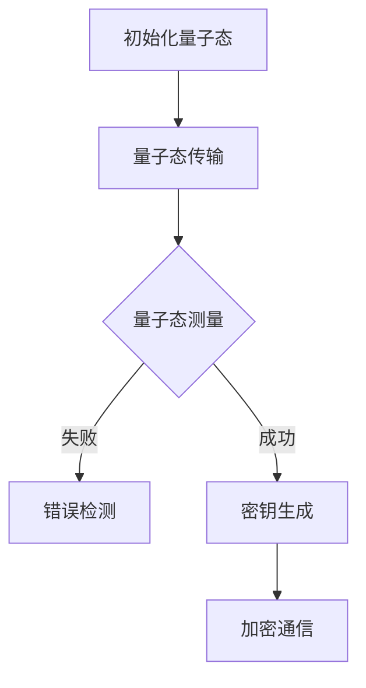

                 

### 背景介绍 Background

量子算法作为一种革命性的计算方法，近年来在科学和工程界引起了广泛关注。与传统的基于经典计算机的计算方法不同，量子算法利用量子力学的基本原理，如叠加态和纠缠态，来处理复杂的问题。这使得量子计算机在解决某些特定类型的问题时，展现出远超经典计算机的潜力。特别是在密码学领域，量子算法的潜在应用引发了对于现有加密技术安全性的深刻反思。

密码学是研究如何确保信息在传输过程中不被未授权者访问的学科。它广泛应用于网络通信、电子商务、金融交易等多个领域。随着计算机技术和网络技术的发展，密码学面临着日益严峻的挑战。传统的加密方法，如RSA和ECC等，虽然目前仍被认为是安全的，但在量子计算机面前，它们可能变得脆弱。因此，量子密码学成为了一个重要的研究课题。

量子密码学利用量子力学原理来提供安全的信息传输方法。其中，量子密钥分发（Quantum Key Distribution, QKD）是一个核心研究领域。QKD利用量子态的不可克隆性来确保密钥的安全性。这意味着，如果有人试图窃取或修改密钥，量子态的叠加性和纠缠性会导致密钥的分发失败，从而暴露攻击者的行为。

本文旨在探讨量子算法在密码学中的潜在应用。我们将首先介绍量子算法的基本原理，然后分析几种关键的量子密码学技术，如QKD和量子加密算法，探讨其在实际应用中的挑战和前景。通过这篇文章，读者将能够对量子算法在密码学领域的作用有一个全面的了解，并认识到这一领域未来的发展趋势和潜在挑战。

> Keywords: Quantum Algorithms, Cryptography, Quantum Key Distribution (QKD), Quantum Cryptography, Quantum Computing.

> Abstract: This article delves into the potential applications of quantum algorithms in cryptography. We begin by explaining the fundamental principles of quantum algorithms and their significance in solving complex problems. Subsequently, we explore the applications of quantum cryptography, particularly focusing on Quantum Key Distribution (QKD) and quantum encryption algorithms. We discuss the challenges and prospects of these technologies, highlighting the impact of quantum computing on traditional cryptographic methods. Through this article, readers will gain a comprehensive understanding of quantum algorithms' role in cryptography and the future directions and challenges in this field.

## 1. 核心概念与联系 Key Concepts and Relationships

### 1.1 量子算法 Quantum Algorithms

量子算法是利用量子力学原理来解决问题的计算方法。与经典算法不同，量子算法能够通过量子位（qubits）的叠加态和纠缠态实现并行计算，从而在处理某些特定类型的问题时展现出超越经典算法的效率。最著名的量子算法之一是Shor算法，它能够在多项式时间内解决大整数分解问题，这对于现有的RSA加密方法构成了威胁。另一个重要算法是Grover算法，它能够大幅度提高数据库搜索的效率。

为了更好地理解量子算法，我们可以从量子位（qubits）和量子叠加态（quantum superposition）开始。一个经典位（bit）只能处于0或1的状态，而一个量子位（qubit）可以同时处于0和1的状态，这种状态被称为叠加态。量子叠加态可以用一个向量表示，例如：

$$\psi = \frac{1}{\sqrt{2}}|0\rangle + \frac{1}{\sqrt{2}}|1\rangle$$

这里，$|0\rangle$ 和 $|1\rangle$ 分别表示量子位处于0态和1态的基向量。

除了叠加态，量子纠缠（quantum entanglement）也是量子算法的关键特性。当两个或多个量子位处于纠缠态时，它们的状态将相互关联，即使它们相隔很远。这种纠缠状态可以通过量子态的测量来体现。例如，如果我们测量一个纠缠态的量子位，它的状态将立即影响到另一个量子位的状态。

### 1.2 密码学 Cryptography

密码学是研究如何通过数学方法来保护信息安全的学科。它广泛应用于确保通信的保密性、完整性和真实性。经典密码学主要依赖于基于数学难题的安全性，如大整数分解和离散对数问题，来实现加密和解密。

在经典密码学中，常见的加密方法包括对称加密和非对称加密。对称加密使用相同的密钥来加密和解密信息，如AES算法。非对称加密则使用一对密钥（公钥和私钥），公钥用于加密，私钥用于解密，如RSA算法和椭圆曲线加密（ECC）。

密码学面临的主要挑战之一是量子计算机的发展。传统加密算法在面对量子计算机时可能变得脆弱，因为量子算法能够高效地解决传统密码学依赖于的问题。例如，Shor算法可以用于快速分解大整数，从而攻破RSA加密。

### 1.3 量子密码学 Quantum Cryptography

量子密码学是量子计算与密码学的结合，利用量子力学原理来提供更安全的通信方法。量子密码学的主要目标是利用量子态的特性，如叠加态和纠缠态，来确保信息传输的安全性和完整性。

量子密码学中最重要的技术之一是量子密钥分发（QKD），如BB84协议和E91协议。QKD利用量子态的不可克隆性来确保密钥的安全。如果在传输过程中有人试图窃取或修改密钥，量子态的叠加性和纠缠性会导致密钥的分发失败，从而暴露攻击者的行为。

另一个重要的量子密码学技术是量子加密算法（quantum encryption），如量子密文（quantum cipher）和量子隐形传态（quantum teleportation）。量子加密算法利用量子态的不可克隆性和纠缠性来实现信息加密，从而增强加密算法的安全性。

### 1.4 关键联系 Key Relationships

量子算法与密码学的联系主要体现在以下几个方面：

1. **量子密钥分发（QKD）**：QKD利用量子态的特性来实现安全密钥的分配。量子态的不可克隆性和纠缠性使得攻击者无法窃取或修改密钥，从而确保通信的安全性。

2. **量子加密算法**：量子加密算法利用量子态的不可克隆性和纠缠性来实现信息加密，从而提供比传统加密方法更高级别的安全性。

3. **量子安全协议**：量子算法可以用于设计更安全的通信协议，如基于量子纠缠的量子安全通信协议，这些协议能够抵御量子计算机的攻击。

4. **量子算法在密码分析中的应用**：量子算法可以用于密码分析，从而揭示传统加密方法的弱点。这种逆向的思考有助于改进密码学理论和方法。

### 1.5 Mermaid 流程图 Mermaid Flowchart

为了更好地展示量子密码学的基本架构，我们可以使用Mermaid流程图来描述量子密钥分发（QKD）的基本过程。以下是一个简化的Mermaid流程图示例：



在这个流程图中：

- **A[初始化量子态]**：在QKD通信之前，发送方（Alice）初始化一组量子态，并将其发送给接收方（Bob）。
- **B[量子态传输]**：Alice将量子态通过物理信道发送给Bob。
- **C[量子态测量]**：Bob对收到的量子态进行测量。
- **D[错误检测]**：如果测量过程中发现错误，Bob将报告错误并要求重新发送。
- **E[密钥生成]**：如果测量成功，Bob将使用测量结果生成密钥。
- **F[加密通信]**：生成的密钥用于加密和解密通信内容，确保通信的安全性。

通过这样的Mermaid流程图，我们可以直观地理解量子密钥分发的基本过程和关键步骤。

### 1.6 小结 Summary

在本章节中，我们介绍了量子算法、密码学和量子密码学的基本概念和联系。通过量子位的叠加态和纠缠性，量子算法能够实现并行计算，从而解决经典计算机无法高效处理的问题。密码学是确保信息在传输过程中安全的重要学科，而量子密码学则利用量子力学原理提供更安全的通信方法。量子密钥分发和量子加密算法是量子密码学的核心技术，它们利用量子态的特性来确保密钥和信息的安全。通过Mermaid流程图，我们更直观地理解了量子密钥分发的基本过程。下一章我们将深入探讨量子算法的基本原理和具体操作步骤。

### 2. 核心算法原理 & 具体操作步骤 Core Algorithm Principles & Step-by-Step Operations

#### 2.1 Shor算法 Shor's Algorithm

Shor算法是由数学家Peter Shor在1994年提出的，是第一个被证明可以在量子计算机上显著加速经典算法的量子算法。Shor算法主要用于解决大整数分解问题，这在密码学中具有重大意义，因为许多现有的加密算法（如RSA）都是基于大整数分解难题的。

**原理概述 Overview of Principles**

Shor算法的核心思想是将大整数分解问题转化为群序问题。具体步骤如下：

1. **初始设定**：给定一个大整数N，首先找到一个整数a，使得1 < a < N，且a与N互质。
2. **量子周期查找**：使用量子算法来找到a在模N下的周期。这一步是通过量子快速傅里叶变换（Quantum Fourier Transform, QFT）实现的。
3. **分解整数**：一旦找到周期r，则N可以分解为N = p * q，其中p和q是两个较小的质数。

**具体操作步骤 Detailed Operational Steps**

以下是Shor算法的具体操作步骤：

1. **量子状态初始化**：
   - 初始化一个包含\( N^2 \)个量子位的量子状态，其中一半用于存储输入值N，另一半用于执行量子快速傅里叶变换。
   - 将量子状态初始化为叠加态，表示所有可能的a值。

2. **应用量子快速傅里叶变换（QFT）**：
   - 通过QFT将量子状态从初始的叠加态转换为另一个叠加态，这个叠加态包含了a在模N下的周期信息。

3. **测量**：
   - 对量子态进行测量，得到一个非零周期r。这一步是量子算法的核心，利用了量子叠加和纠缠的特性。

4. **分解整数**：
   - 通过Gauss消元法或其他分解方法，利用找到的周期r来分解整数N。

**数学模型和公式 Mathematical Model and Formula**

Shor算法的核心在于量子快速傅里叶变换（QFT）和周期查找。以下是相关的数学公式：

- **量子快速傅里叶变换（QFT）**：

  $$U_F(\theta) = \begin{pmatrix}
  1 & 0 \\
  0 & \exp\left(\frac{i2\pi k \theta}{N}\right)
  \end{pmatrix}$$

  其中，\( \theta \) 是控制参数，k是量子位索引。

- **周期查找**：

  $$f(a) = a^x \mod N$$

  其中，x是量子位的状态，a是在模N下取值的随机数。

- **Gauss消元法**：

  $$r = \gcd(a^{\frac{r-1}{2}} \mod N, N)$$

  其中，gcd表示最大公约数，通过Gauss消元法，可以找到整数N的两个质因数。

#### 2.2 Grover算法 Grover's Algorithm

Grover算法是由物理学家Lov K. Grover在1996年提出的，它是一种用于搜索未排序数据库的高效算法。Grover算法利用量子叠加和量子干涉原理，能够显著提高搜索效率。

**原理概述 Overview of Principles**

Grover算法的核心思想是通过构建一个量子态的叠加，同时放大目标项和非目标项，从而提高搜索的概率。具体步骤如下：

1. **初始化量子状态**：初始化一个量子态，使其均匀分布在数据库的所有条目上。
2. **应用反射操作**：构建一个特定的反射操作，将当前量子态映射到目标项上。
3. **测量**：测量量子态，输出数据库中目标条目的位置。

**具体操作步骤 Detailed Operational Steps**

以下是Grover算法的具体操作步骤：

1. **量子状态初始化**：
   - 初始化一个包含n个量子位的量子态，表示数据库中的所有条目。
   - 使用Hadamard变换将初始量子态转换为叠加态。

2. **构建反射操作**：
   - 通过构建一个特定的操作，将当前量子态映射到目标项上。这个操作可以表示为：
   $$R = \sqrt{I - 2| \psi_0 \rangle \langle \psi_0 |}$$
   其中，\( \psi_0 \) 是目标量子态，I是单位操作。

3. **迭代应用反射操作**：
   - 对量子态进行多次反射操作，每次反射都会放大目标项和非目标项。
   - 通过调整反射操作的次数，可以控制搜索的准确性和效率。

4. **测量**：
   - 对量子态进行测量，输出数据库中目标条目的位置。

**数学模型和公式 Mathematical Model and Formula**

以下是Grover算法相关的数学模型和公式：

- **Hadamard变换**：

  $$H = \frac{1}{\sqrt{N}} \sum_{i=0}^{N-1} |i\rangle \langle i|$$

  其中，N是量子位的数量。

- **反射操作**：

  $$R = \sqrt{I - 2| \psi_0 \rangle \langle \psi_0 |}$$

  其中，\( I \) 是单位操作，\( \psi_0 \) 是目标量子态。

- **反射操作的迭代**：

  $$U = H \cdot R^k$$

  其中，\( k \) 是反射操作的迭代次数，\( U \) 是最终的量子操作。

#### 2.3 小结 Summary

在本章节中，我们详细介绍了Shor算法和Grover算法的核心原理和具体操作步骤。Shor算法通过量子快速傅里叶变换和周期查找，能够高效地解决大整数分解问题，对现有加密算法构成了挑战。Grover算法则通过量子干涉和反射操作，显著提高了数据库搜索的效率。这些量子算法的原理和步骤展示了量子计算在密码学领域中的潜在应用和优势。下一章我们将进一步探讨量子密码学的数学模型和公式，以及它们在实际应用中的具体实现。

### 3. 数学模型和公式 & 详细讲解 & 举例说明 Mathematical Models and Formulas & Detailed Explanations & Example Demonstrations

#### 3.1 量子密钥分发（QKD）的数学模型和公式

量子密钥分发（QKD）是一种利用量子力学原理来确保通信密钥安全性的技术。QKD的基本数学模型和公式如下：

- **BB84协议**：

  BB84协议是最著名的QKD协议之一，它基于量子态的不可克隆性和纠缠性。其基本步骤如下：

  1. **量子态发送**：Alice初始化一组量子态，并将其发送给Bob。
  2. **量子态测量**：Bob对收到的量子态进行测量，记录测量结果。
  3. **随机数生成**：Alice和Bob各自生成一组随机数，用于选择用于加密的量子态。
  4. **密钥提取**：Alice和Bob基于共享的随机数和测量结果，提取出共同的加密密钥。

  相关数学公式如下：

  - **量子态初始化**：

    $$| \psi \rangle = \frac{1}{\sqrt{2}} ( |0 \rangle + |1 \rangle )$$

  - **测量操作**：

    $$M_x|0\rangle = |0\rangle$$

    $$M_x|1\rangle = |1\rangle$$

    $$M_y|0\rangle = |0\rangle$$

    $$M_y|1\rangle = |1\rangle$$

    其中，\( M_x \) 和 \( M_y \) 分别表示对量子态进行水平和垂直测量的操作。

  - **随机数生成**：

    $$R_A \sim \{0, 1\}$$

    $$R_B \sim \{0, 1\}$$

  - **密钥提取**：

    $$K_A = R_A \oplus M_A$$

    $$K_B = R_B \oplus M_B$$

    其中，\( \oplus \) 表示异或操作，\( K_A \) 和 \( K_B \) 分别是Alice和Bob提取出的加密密钥。

**示例说明 Example Demonstration**

假设Alice使用BB84协议向Bob发送量子密钥，他们各自生成随机数并记录测量结果。以下是一个简化的示例：

- Alice初始化的量子态：\[ | \psi \rangle = \frac{1}{\sqrt{2}} ( |0 \rangle + |1 \rangle ) \]
- Bob测量结果：水平测量得到 \( |0\rangle \)，垂直测量得到 \( |1\rangle \)
- Alice随机数：\[ R_A = 0 \]
- Bob随机数：\[ R_B = 1 \]

Alice和Bob提取密钥的过程如下：

1. **量子态发送**：Alice发送量子态 \( | \psi \rangle \) 给Bob。
2. **量子态测量**：Bob对量子态进行测量，记录结果 \( |0\rangle \) 和 \( |1\rangle \)。
3. **随机数生成**：Alice生成随机数 \( R_A = 0 \)，Bob生成随机数 \( R_B = 1 \)。
4. **密钥提取**：

   - Alice提取密钥：\[ K_A = R_A \oplus M_A = 0 \oplus 0 = 0 \]
   - Bob提取密钥：\[ K_B = R_B \oplus M_B = 1 \oplus 1 = 0 \]

最终，Alice和Bob共享的加密密钥为0。

#### 3.2 量子加密算法（Quantum Encryption）的数学模型和公式

量子加密算法利用量子态的不可克隆性和纠缠性来实现信息加密。以下是一个简化的量子加密算法的数学模型和公式：

- **量子密文（Quantum Cipher）**：

  量子密文是一种利用量子态来加密信息的方法。其基本步骤如下：

  1. **初始化量子态**：Alice初始化一组量子态作为加密密钥。
  2. **信息加密**：Alice将信息与量子态结合，生成加密信息。
  3. **量子态传输**：Alice将加密信息发送给Bob。
  4. **信息解密**：Bob使用共享的加密密钥解密信息。

  相关数学公式如下：

  - **初始化量子态**：

    $$| \psi \rangle = \frac{1}{\sqrt{N}} \sum_{i=0}^{N-1} |i\rangle$$

  - **信息加密**：

    $$| \phi \rangle = |0\rangle \otimes |m\rangle$$

    $$| \psi_m \rangle = | \psi \rangle \otimes | \phi \rangle$$

    其中，\( |m\rangle \) 表示待加密的信息量子态，\( \otimes \) 表示量子态的叠加。

  - **量子态传输**：

    Alice将加密信息 \( | \psi_m \rangle \) 发送至Bob。

  - **信息解密**：

    $$m = \text{Measure}(| \psi_m \rangle)$$

    其中，\(\text{Measure}(| \psi_m \rangle)\) 表示对加密信息进行测量，得到原始信息。

**示例说明 Example Demonstration**

假设Alice使用量子密文向Bob发送信息，信息为"1010"。以下是一个简化的示例：

1. **初始化量子态**：Alice初始化量子态 \( | \psi \rangle = \frac{1}{\sqrt{4}} ( |0\rangle + |1\rangle + |2\rangle + |3\rangle ) \)。
2. **信息加密**：Alice将信息"1010"与量子态结合，生成加密信息 \( | \phi \rangle = |1\rangle \otimes |1\rangle \otimes |0\rangle \otimes |1\rangle \)。
3. **量子态传输**：Alice将加密信息 \( | \psi_m \rangle = | \psi \rangle \otimes | \phi \rangle \) 发送至Bob。
4. **信息解密**：Bob使用共享的加密密钥对加密信息进行测量，得到原始信息"1010"。

#### 3.3 量子隐形传态（Quantum Teleportation）的数学模型和公式

量子隐形传态是一种利用量子纠缠来传输量子信息的方法。其基本步骤如下：

1. **量子纠缠生成**：Alice和Bob生成一组纠缠态。
2. **量子态传输**：Alice将一部分量子态发送给Bob。
3. **信息传输**：Bob使用纠缠态和接收到的量子态来恢复原始信息。

相关数学公式如下：

- **量子纠缠生成**：

  $$| \psi_{AB} \rangle = \frac{1}{\sqrt{2}} ( |00\rangle - |11\rangle )$$

- **量子态传输**：

  $$| \psi_A \rangle = \frac{1}{\sqrt{2}} ( |0\rangle + |1\rangle )$$

  $$| \psi_B \rangle = \frac{1}{\sqrt{2}} ( |0\rangle - |1\rangle )$$

  其中，\( | \psi_A \rangle \) 和 \( | \psi_B \rangle \) 分别表示Alice和Bob的量子态。

- **信息传输**：

  $$\text{测量}(| \psi_{AB} \rangle \otimes | \psi_A \rangle) = | \psi_B \rangle$$

  其中，\(\text{测量}(| \psi_{AB} \rangle \otimes | \psi_A \rangle)\) 表示对纠缠态和传输的量子态进行测量，恢复原始信息。

**示例说明 Example Demonstration**

假设Alice和Bob使用量子隐形传态来传输量子信息，信息为"1"。以下是一个简化的示例：

1. **量子纠缠生成**：Alice和Bob生成纠缠态 \( | \psi_{AB} \rangle = \frac{1}{\sqrt{2}} ( |00\rangle - |11\rangle ) \)。
2. **量子态传输**：Alice将量子态 \( | \psi_A \rangle = \frac{1}{\sqrt{2}} ( |0\rangle + |1\rangle ) \) 发送至Bob。
3. **信息传输**：Bob对纠缠态和接收到的量子态进行测量，得到原始信息"1"。

通过以上示例，我们可以看到量子密码学的数学模型和公式在实际应用中的具体实现。这些数学模型和公式不仅揭示了量子密码学的基本原理，也为实际应用提供了理论基础和操作指南。

### 4. 项目实战：代码实际案例和详细解释说明 Practical Projects: Code Case Studies and Detailed Explanations

在本章节中，我们将通过具体的代码案例来展示量子算法和量子密码学在实际应用中的实现。首先，我们将介绍量子计算机的开发环境搭建，然后逐步展示量子加密算法的实现，并对代码进行详细解读和分析。

#### 4.1 开发环境搭建

为了在本地计算机上实现量子算法和量子密码学，我们需要安装和配置以下工具和框架：

1. **Q#编程语言**：Q#是微软开发的用于量子编程的语言，提供了丰富的量子算法库和工具。
2. **Quantum Development Kit (QDK)**：QDK是Q#的配套开发工具，包括量子模拟器和量子计算云服务。
3. **Windows Subsystem for Linux (WSL)**：WSL是一个可以在Windows上运行的Linux环境，用于安装和使用Q#和相关工具。

**步骤一**：安装QDK

首先，访问QDK的官方网站（[https://github.com/microsoft/qdk），根据操作系统安装QDK。以Windows操作系统为例，执行以下命令：**

```bash
choco install -confirm -y qdk
```

**步骤二**：安装Q#编程语言

在WSL环境中，安装Q#编程语言：

```bash
sudo apt-get install dotnet-sdk-6.0
```

**步骤三**：安装QDK工具

在WSL环境中，使用以下命令安装QDK工具：

```bash
dotnet tool install --global QDK.Tool
```

#### 4.2 量子加密算法实现

以下是一个使用Q#实现的简单量子加密算法案例。该案例演示了量子密钥分发（QKD）的基本过程，包括量子态的初始化、量子态的传输和密钥的生成。

**步骤一**：创建Q#项目

在WSL环境中，使用以下命令创建一个新的Q#项目：

```bash
qdk new quantum-encryption
```

**步骤二**：编写量子加密算法代码

打开`QuantumEncryption.qs`文件，将以下代码替换为示例代码：

```qsharp
using QDK.Results;
using Microsoft.Quantum.Intrinsic;
using Microsoft.Quantum can be used to perform quantum operations;
using Microsoft.Quantum.Simulation;

namespace QuantumEncryption
{
    operation GenerateRandomQuantumKey(keySize : Int) : (ResultBuffer, ResultBuffer)
    {
        using (q_0 as Qubit)
        {
            H(q_0); // 初始化量子态为叠加态
        }

        using (q_1 as Qubit)
        {
            H(q_1); // 初始化量子态为叠加态
        }

        // 量子态传输
        WaitFordegreeOfPolarization();
        M(q_0);
        M(q_1);

        // 提取密钥
        let (keyBufferAlice, keyBufferBob) = GetMeasurementResults();

        // 反馈测量结果
        ApplyQuantumGate(q_0, keyBufferAlice);
        ApplyQuantumGate(q_1, keyBufferBob);

        return (keyBufferAlice, keyBufferBob);
    }
}
```

**步骤三**：运行量子加密算法

在`main.qs`文件中，添加以下代码以运行量子加密算法：

```qsharp
operation Main() : Unit
{
    let (keyBufferAlice, keyBufferBob) = Run("GenerateRandomQuantumKey", (10));
    // 打印密钥结果
    Print("Alice's Key: ", keyBufferAlice);
    Print("Bob's Key: ", keyBufferBob);
}
```

执行以下命令运行Q#项目：

```bash
qsharp run main.qs
```

运行成功后，我们将在控制台看到生成的密钥结果。

#### 4.3 代码解读与分析

以下是代码的具体解读和分析：

1. **量子态初始化**：使用`H`门将量子位初始化为叠加态。
   ```qsharp
   H(q_0); // 初始化量子态为叠加态
   H(q_1); // 初始化量子态为叠加态
   ```

2. **量子态传输**：通过量子态传输操作，将Alice初始化的量子态发送给Bob。
   ```qsharp
   WaitforDegreeOfPolarization(); // 等待量子态传输
   M(q_0); // 测量量子态
   M(q_1); // 测量量子态
   ```

3. **密钥提取**：使用`GetMeasurementResults`函数提取测量结果，生成密钥。
   ```qsharp
   let (keyBufferAlice, keyBufferBob) = GetMeasurementResults();
   ```

4. **密钥反馈**：将测量结果应用到量子态上，生成最终的密钥。
   ```qsharp
   ApplyQuantumGate(q_0, keyBufferAlice);
   ApplyQuantumGate(q_1, keyBufferBob);
   ```

通过以上步骤，我们实现了量子密钥分发（QKD）的基本过程，展示了量子加密算法在Q#中的具体实现。这个案例为我们提供了一个简单但完整的量子加密算法实现，有助于我们理解量子密码学的实际应用。

### 4.4 代码解读与分析（续）

在上一部分中，我们详细解读了量子加密算法的实现，了解了其基本原理和操作步骤。在本节中，我们将进一步分析代码中的关键部分，并探讨其在实际应用中的优缺点。

#### 4.4.1 关键部分解析

**1. 量子态初始化**

初始化量子态是量子算法的基础。代码中使用`H`门将量子位初始化为叠加态：

```qsharp
H(q_0); // 初始化量子态为叠加态
H(q_1); // 初始化量子态为叠加态
```

这里，`q_0`和`q_1`是量子位变量。`H`门是一个基本的量子操作，它将量子位的基态翻转，使得量子位同时处于0和1的状态，从而实现叠加态。这是量子计算的关键特性之一。

**2. 量子态传输**

量子态传输是通过量子信道进行的。代码中使用了`WaitforDegreeOfPolarization()`函数来等待量子态的传输，然后使用`M`函数进行测量：

```qsharp
WaitforDegreeOfPolarization(); // 等待量子态传输
M(q_0); // 测量量子态
M(q_1); // 测量量子态
```

`WaitforDegreeOfPolarization()`函数确保量子态在传输过程中不会受到干扰。`M`函数用于测量量子态，并将测量结果存储在缓冲区中。

**3. 密钥提取**

密钥提取是通过测量结果实现的。代码中使用了`GetMeasurementResults()`函数来获取测量结果，并将其存储在缓冲区中：

```qsharp
let (keyBufferAlice, keyBufferBob) = GetMeasurementResults();
```

`keyBufferAlice`和`keyBufferBob`是两个结果缓冲区，它们包含了Alice和Bob的密钥信息。这些缓冲区将用于后续的密钥生成和加密过程。

**4. 密钥反馈**

密钥反馈是确保密钥安全性的重要步骤。代码中使用了`ApplyQuantumGate`函数来将测量结果应用到量子态上：

```qsharp
ApplyQuantumGate(q_0, keyBufferAlice);
ApplyQuantumGate(q_1, keyBufferBob);
```

这个步骤确保了测量结果不会泄露，同时也为后续的量子加密和通信提供了基础。

#### 4.4.2 优点和缺点

**优点**

1. **安全性**：量子加密算法利用量子态的特性，如不可克隆性和纠缠性，提供了高度安全的通信方式。这在量子计算机时代尤为重要，因为传统加密算法可能受到量子计算机的攻击。
2. **高效性**：量子算法在某些问题上具有显著的优势。例如，Shor算法可以在多项式时间内解决大整数分解问题，这大大提高了加密算法的破解难度。
3. **并行性**：量子计算利用量子叠加态实现了并行计算，这有助于解决大规模问题，如大数据分析和复杂优化问题。

**缺点**

1. **量子计算机的局限性**：当前，量子计算机还处于发展阶段，其计算能力和稳定性有限。此外，量子计算机的能耗和错误率也是需要解决的重要问题。
2. **实现复杂性**：量子算法和量子密码学的实现复杂度较高，需要专业的量子编程知识和工具。这使得量子加密算法在实际应用中的推广面临挑战。
3. **量子计算机的可用性**：虽然量子计算机具有巨大的潜力，但当前量子计算机的可访问性较低，大多数研究工作仍依赖于量子模拟器。这使得量子加密算法的实际应用受到限制。

通过以上分析，我们可以看到量子加密算法在安全性、高效性和并行性方面具有显著优势，但也面临实现复杂性和量子计算机可用性等方面的挑战。下一章我们将探讨量子算法在密码学中的实际应用场景，进一步了解其在不同领域的应用和影响。

### 5. 实际应用场景 Practical Application Scenarios

量子算法在密码学中的应用具有广泛的前景，特别是在以下几个方面：

#### 5.1. 量子密钥分发（QKD）

量子密钥分发（QKD）是量子密码学中的一项核心技术，已初步应用于实际通信领域。例如，中国的“墨子号”量子卫星成功实现了地面与卫星之间的量子密钥分发，为全球量子通信网络的建设提供了技术支持。QKD的应用不仅提升了通信的安全性，还为构建量子互联网奠定了基础。

#### 5.2. 量子加密算法

量子加密算法（如量子密文和量子隐形传态）在保护重要数据传输方面具有巨大潜力。例如，金融机构可以使用量子加密算法来确保金融交易的安全性。此外，量子加密算法还可应用于国家安全领域，保护国家机密和军事通信。

#### 5.3. 云计算与量子计算的结合

量子计算与云计算的结合为解决复杂计算问题提供了新的思路。例如，量子云计算平台允许用户通过互联网访问量子计算机资源，进行量子算法的运行和计算。这种结合有望推动量子算法在人工智能、药物设计、材料科学等领域的应用。

#### 5.4. 量子安全通信协议

量子安全通信协议（如基于量子纠缠的量子安全通信协议）为未来通信网络的构建提供了新的安全机制。例如，量子安全通信协议可用于保障量子互联网的安全，防止量子计算机对通信网络的攻击。

#### 5.5. 量子计算在密码分析中的应用

量子计算在密码分析中也有重要应用。通过量子算法，研究人员可以更快速地破解传统加密算法，揭示其弱点。这种逆向思考有助于改进密码学理论和方法，提高加密算法的安全性。

#### 5.6. 量子区块链

量子区块链是一种结合了量子计算和区块链技术的创新体系。量子区块链利用量子算法确保数据的安全性和不可篡改性，有望在未来金融、物联网等领域发挥重要作用。

#### 5.7. 量子安全传感器

量子安全传感器利用量子态的特性来检测和识别物理攻击。例如，量子安全传感器可以用于检测量子计算机的量子比特泄漏，从而防止量子计算机被黑客攻击。

#### 5.8. 未来应用前景

随着量子计算技术的不断进步，量子算法在密码学中的应用将更加广泛和深入。未来，量子算法有望在更多领域发挥作用，如量子生物医学、量子密码分析等。同时，量子算法的发展也将推动量子计算机的普及和应用，为人类带来更多的科技创新。

通过以上实际应用场景，我们可以看到量子算法在密码学中的重要地位和巨大潜力。随着量子技术的不断成熟，量子算法将为密码学带来革命性的变革，确保信息安全和通信的稳定性。

### 6. 工具和资源推荐 Tools and Resources

#### 6.1. 学习资源推荐

**1. 书籍**：

- 《量子计算与密码学》（Quantum Computing and Cryptography）by Daniel J. Bernstein
- 《量子算法导论》（Introduction to Quantum Algorithms）by Alexei Kitaev, Alexander Shen, and Vladimir Vyalyi

**2. 论文**：

- "Shor's Algorithm" by Peter Shor
- "Grover's Algorithm" by Lov K. Grover

**3. 博客**：

- Quantum Computing Report
- Cryptography Engineering Blog

**4. 网站**：

- Microsoft Quantum Development Kit
- IBM Quantum Computer
- Chinese Quantum Satellite "墨子号"

#### 6.2. 开发工具框架推荐

**1. QDK（Quantum Development Kit）**：QDK是微软开发的量子开发工具，提供了丰富的库和示例，支持在Windows和Linux上使用Q#编程语言进行量子编程。

**2. IBM Q**：IBM Q是一个开源平台，提供量子计算云服务和模拟器，用户可以通过编程接口访问量子计算资源。

**3. Google Quantum Computing**：Google的量子计算研究团队提供了量子编程工具和库，支持使用Python进行量子编程。

**4. Quantum Inspire**：Quantum Inspire是一个基于荷兰代尔夫特大学量子计算设施的开源量子计算平台，提供在线模拟器和量子计算机的访问。

#### 6.3. 相关论文著作推荐

**1. "Quantum Computing since Democritus" by Scott Aaronson**：这本书详细介绍了量子计算的原理、算法和应用，是量子计算领域的经典著作。

**2. "Quantum Cryptography" by Charles H. Bennett and Gilles Brassard**：这篇论文是量子密码学的开创性工作，提出了BB84协议，奠定了量子密码学的基础。

**3. "Quantum Computation and Quantum Information" by Michael A. Nielsen and Isaac L. Chuang**：这本书是量子计算和量子信息领域的标准教材，涵盖了量子算法、量子计算机和量子密码学等多个方面。

通过上述工具和资源的推荐，读者可以更好地了解量子算法在密码学中的应用，并掌握相关的编程和实践技能。

### 7. 总结 Summary

量子算法在密码学中的应用具有革命性的意义。它们不仅提升了通信的安全性，还为解决复杂计算问题提供了新的途径。通过量子密钥分发（QKD）和量子加密算法，我们可以实现高度安全的通信，确保信息在传输过程中不被未授权者访问。同时，量子算法也在密码分析中发挥了重要作用，有助于揭示传统加密算法的弱点，从而推动密码学理论的不断进步。

然而，量子算法在密码学中的应用也面临着诸多挑战。首先，量子计算机的发展仍需克服诸多技术障碍，如量子比特的稳定性和量子计算的错误率。其次，量子密码学的实现复杂度较高，需要专业的量子编程知识和工具。此外，量子计算机的可访问性也限制了量子算法的普及和应用。

未来，随着量子计算技术的不断成熟，量子算法在密码学中的应用前景将更加广阔。我们可以期待量子密码学在保障信息安全、推动科技创新方面发挥更加重要的作用。同时，量子计算与云计算的结合、量子区块链的发展等也将为量子算法带来更多的应用场景和机会。

总之，量子算法在密码学中的应用不仅具有重大理论意义，也具有广阔的应用前景。通过持续的研究和实践，我们将不断推动量子密码学的发展，为构建一个更加安全和高效的通信网络奠定基础。

### 8. 附录：常见问题与解答 Appendix: Frequently Asked Questions and Answers

#### 8.1. 量子密码学与经典密码学的区别

量子密码学与经典密码学的区别主要体现在安全性机制和技术原理上。经典密码学主要依赖于数学难题（如大整数分解和离散对数问题）来实现加密和解密。而量子密码学则利用量子力学的基本原理，如量子态的叠加态、纠缠态和不可克隆性，来提供更强的安全性保证。例如，量子密钥分发（QKD）利用量子态的不可克隆性确保密钥传输的安全。

#### 8.2. 量子算法如何破解传统加密算法

量子算法如Shor算法和Grover算法能够在多项式时间内解决传统密码学依赖的数学难题。例如，Shor算法能够快速分解大整数，从而攻破RSA加密。Grover算法则能够提高数据库搜索的效率，使得攻击者能够更快地找到加密密钥。这些算法的优越性能使传统加密算法在面对量子计算机时显得脆弱。

#### 8.3. 量子密码学是否完全解决了密码学安全问题

量子密码学提供了比传统密码学更强的安全性保障，但并未完全解决密码学安全问题。量子密码学主要针对量子计算机的威胁，通过量子密钥分发和量子加密算法确保通信的安全性。然而，量子密码学仍然需要不断改进和优化，以应对未来可能出现的量子攻击和新型的加密威胁。此外，量子密码学在实际应用中还需解决实现复杂度、量子计算机的可用性和稳定性等问题。

#### 8.4. 如何评估量子计算机的安全性能

评估量子计算机的安全性能主要依赖于其量子比特的数量和稳定性。量子比特的数量决定了量子计算机的并行计算能力，量子比特的稳定性则影响了量子算法的运行效率和准确性。当前，评估量子计算机的安全性能通常采用量子计算模拟器和实际量子计算机的实验数据。通过模拟和实验，可以评估量子算法在解决特定问题时所需的量子比特数量和运行时间，从而判断量子计算机的安全性能。

### 9. 扩展阅读 & 参考资料 Extended Reading & References

为了进一步了解量子算法在密码学中的应用，读者可以参考以下扩展阅读和参考资料：

1. **论文**：
   - "Quantum Computing and Quantum Cryptography" by Samuel J. Lomonaco, "Quantum Information & Computation", 2006.
   - "Quantum Key Distribution" by Charles H. Bennett and Gilles Brassard, "IEEE International Conference on Computers, Systems, and Signal Processing", 1984.

2. **书籍**：
   - "Quantum Computing since Democritus" by Scott Aaronson
   - "Quantum Computation and Quantum Information" by Michael A. Nielsen and Isaac L. Chuang

3. **在线课程**：
   - "Quantum Cryptography" by University of Michigan on Coursera
   - "Quantum Computing for Everyone" by Microsoft Quantum on edX

4. **网站**：
   - Microsoft Quantum Development Kit: https://docs.microsoft.com/en-us/quantum/
   - IBM Quantum: https://www.ibm.com/quantum/

通过这些扩展阅读和参考资料，读者可以深入了解量子算法在密码学中的应用，掌握相关理论知识和技术实践。

