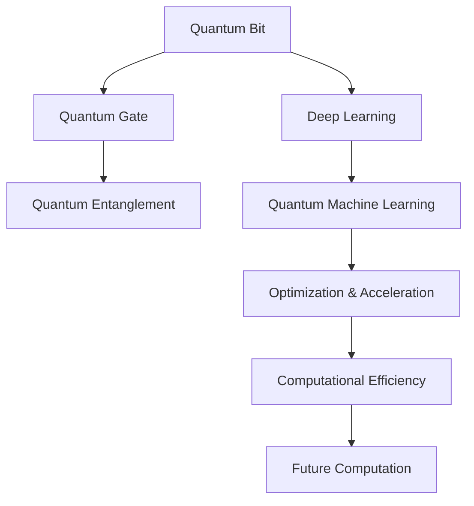

                 

### 1. 背景介绍

#### 量子计算：一场科技革命的序曲

量子计算作为一门新兴的科学技术，近年来在学术界和工业界引起了广泛关注。其基于量子力学的基本原理，相较于传统计算方式，能够在极短时间内解决复杂问题，具有巨大的理论潜力和实际应用价值。量子计算的兴起，预示着一场科技革命的到来。

量子计算的基本单位是量子比特（qubit），与经典比特（classic bit）不同，量子比特能够同时处于多种状态，从而实现并行计算。这种特性使得量子计算机在处理特定问题时，速度远超经典计算机。

#### 人工智能：数据驱动的智能革命

人工智能（AI）作为计算机科学的一个分支，致力于研究如何使计算机具备人类智能。在过去的几十年里，人工智能经历了多次技术突破，特别是深度学习的兴起，使得计算机在图像识别、自然语言处理、游戏等领域取得了显著的成果。

人工智能的发展离不开大量数据的支撑，通过数据驱动的方式，机器能够不断优化自身性能，实现自我学习和进化。数据与算法的结合，使得人工智能在许多实际应用场景中取得了突破性进展。

#### 未来计算的协同发展

量子计算与人工智能的结合，有望推动未来计算的发展进入一个新的阶段。两者之间的协同作用，不仅能够提升计算速度，还能够解决传统计算方式无法处理的问题。

首先，量子计算在人工智能中的应用主要体现在优化算法和加速模型训练。量子算法能够高效地解决传统算法难以处理的优化问题，从而提升人工智能模型的性能。

其次，人工智能在量子计算中的应用则体现在量子机器学习方面。通过人工智能算法，可以优化量子算法的参数，提高量子计算机的计算效率。

总的来说，量子计算与人工智能的协同发展，将带来以下几方面的变革：

1. **计算速度的提升**：量子计算的高并行性将大幅提升计算速度，使得复杂问题能够在短时间内得到解决。
2. **计算能力的增强**：量子计算与人工智能的结合，将拓宽计算能力的范围，使得计算机能够处理更多类型的复杂问题。
3. **科学研究的突破**：量子计算在材料科学、药物研发、金融分析等领域的应用，有望带来科学研究的突破性进展。
4. **产业变革**：量子计算与人工智能的结合，将推动产业升级和创新发展，为经济增长提供新的动力。

#### 结论

量子计算与人工智能的协同发展，是一场前所未有的科技革命。随着技术的不断突破，我们有理由相信，未来计算将进入一个全新的时代。在这个过程中，我们需要不断探索、创新，以应对未来计算带来的挑战和机遇。

---

# Quantum Computing and AI: Collaborative Development in Future Computation

### Background Introduction

Quantum computing, as a cutting-edge scientific and technological field, has garnered significant attention in both academic and industrial sectors in recent years. Based on the fundamental principles of quantum mechanics, quantum computing has the potential to solve complex problems far more quickly than traditional computing methods, offering immense theoretical potential and practical value. The emergence of quantum computing heralds the advent of a technological revolution.

The basic unit of quantum computing is the quantum bit, or qubit, which differs fundamentally from the classical bit. A qubit can exist in multiple states simultaneously, enabling parallel computing. This property allows quantum computers to solve certain problems much faster than classical computers.

Artificial intelligence (AI) is another branch of computer science that focuses on enabling computers to possess human-like intelligence. Over the past few decades, AI has achieved significant technological breakthroughs, especially with the rise of deep learning. This has led to remarkable progress in fields such as image recognition, natural language processing, and gaming.

The development of AI relies heavily on large amounts of data. By leveraging data-driven approaches, machines can continuously optimize their performance, achieving self-learning and evolution. The combination of data and algorithms has enabled AI to make breakthroughs in various practical applications.

#### Future Collaborative Development of Quantum Computing and AI

The collaborative development of quantum computing and AI is expected to propel future computation into a new era. Their synergistic effects promise to enhance computing speed and address problems that traditional computing methods cannot handle.

Firstly, quantum computing can be applied to AI primarily through optimization algorithms and accelerated model training. Quantum algorithms can efficiently solve optimization problems that are difficult for traditional algorithms, thereby improving the performance of AI models.

Secondly, AI can be applied to quantum computing in the field of quantum machine learning. By using AI algorithms, parameters of quantum algorithms can be optimized, improving the computational efficiency of quantum computers.

The collaborative development of quantum computing and AI is likely to bring about the following transformations:

1. **Enhanced computing speed**: The high parallelism of quantum computing will significantly increase computing speed, allowing complex problems to be solved in a short time.
2. **Strengthened computational capabilities**: The combination of quantum computing and AI will broaden the scope of computational capabilities, enabling computers to handle more types of complex problems.
3. **Breakthroughs in scientific research**: The application of quantum computing in fields such as materials science, drug development, and financial analysis is expected to lead to groundbreaking progress in scientific research.
4. **Industrial transformation**: The integration of quantum computing and AI will drive industrial upgrading and innovative development, providing new impetus for economic growth.

#### Conclusion

The collaborative development of quantum computing and AI represents an unprecedented technological revolution. As technology continues to advance, we have every reason to believe that future computation will enter a new era. In this process, we must continue to explore and innovate to address the challenges and seize the opportunities brought about by future computation.

---

### 2. 核心概念与联系

#### 量子比特（Qubit）

量子比特是量子计算的基本单位，与经典比特不同，它能够同时处于多种状态。这种性质称为量子叠加（quantum superposition）。例如，一个经典比特要么是0，要么是1，而一个量子比特可以同时是0和1的状态。

#### 量子门（Quantum Gate）

量子门是量子计算中的基本操作，类似于经典计算中的逻辑门。量子门可以作用于量子比特，改变其状态。常见的量子门包括Hadamard门、Pauli门和控制-NOT门（CNOT）等。

#### 量子纠缠（Quantum Entanglement）

量子纠缠是量子力学中的一种现象，当两个或多个量子比特相互关联时，它们会形成量子纠缠态。这种关联性使得量子比特之间的状态无法独立存在，从而实现量子信息的传递和计算。

#### 深度学习（Deep Learning）

深度学习是人工智能的一种方法，通过构建多层神经网络，对大量数据进行分析和训练，从而实现自动学习和特征提取。深度学习在图像识别、自然语言处理和语音识别等领域取得了显著成果。

#### 量子机器学习（Quantum Machine Learning）

量子机器学习是将量子计算与机器学习相结合的一种方法，旨在利用量子计算机的优势来优化机器学习算法。量子机器学习可以加速模型训练，提高计算效率。

### 核心概念架构

为了更好地理解量子计算与人工智能的核心概念和联系，我们可以使用Mermaid流程图来展示这些概念之间的交互和作用。



### 核心概念原理 & 具体操作步骤

1. **量子比特的叠加与测量**

量子比特的叠加状态可以表示为：

\[ \psi = \alpha |0\rangle + \beta |1\rangle \]

其中，\( \alpha \) 和 \( \beta \) 是复数概率幅，\( |0\rangle \) 和 \( |1\rangle \) 分别代表量子比特的基态和叠加态。

当对量子比特进行测量时，它会随机塌缩到一个确定的基态，其概率由叠加态中的概率幅的平方决定。

2. **量子门的操作**

量子门通过线性变换作用于量子比特，改变其状态。例如，Hadamard门（H门）可以将一个量子比特的基态 \( |0\rangle \) 变为叠加态 \( \frac{1}{\sqrt{2}} (|0\rangle + |1\rangle) \)。

\[ H|0\rangle = \frac{1}{\sqrt{2}} (|0\rangle + |1\rangle) \]

3. **量子纠缠的实现**

量子纠缠可以通过量子门的操作来实现。例如，使用CNOT门可以将两个量子比特纠缠在一起。

\[ |01\rangle \xrightarrow{CNOT} |11\rangle \]

4. **深度学习的训练**

深度学习模型通过训练大量数据来优化参数。在量子机器学习中，可以使用量子变分算法（Quantum Variational Algorithms）来优化模型参数，从而提高计算效率。

5. **量子机器学习算法**

量子机器学习算法如变分量子特征提取器（Variational Quantum Feature Extractor, VQE）和量子生成对抗网络（Quantum Generative Adversarial Network, QGAN）等，可以将量子计算的优势应用于机器学习问题。

### 数学模型和公式 & 详细讲解 & 举例说明

1. **量子比特的叠加状态**

\[ \psi = \alpha |0\rangle + \beta |1\rangle \]

其中，\( \alpha \) 和 \( \beta \) 是复数概率幅，满足归一化条件 \( |\alpha|^2 + |\beta|^2 = 1 \)。

2. **量子门的线性变换**

\[ U = e^{-i\theta \sigma_z/2} \]

其中，\( \theta \) 是旋转角度，\( \sigma_z \) 是Pauli矩阵。

3. **量子纠缠态**

\[ |01\rangle \xrightarrow{CNOT} |11\rangle \]

4. **量子变分算法**

\[ \min_{\theta} \langle \phi | \hat{H} | \phi \rangle \]

其中，\( \hat{H} \) 是哈密顿量，\( | \phi \rangle \) 是参数化的量子态。

#### 举例说明

假设我们有一个二量子比特系统，初始状态为 \( |00\rangle \)。我们希望通过量子门操作将其变为纠缠态 \( |11\rangle \)。

1. **应用Hadamard门**

\[ H|00\rangle = \frac{1}{\sqrt{2}} (|00\rangle + |10\rangle) \]

2. **应用CNOT门**

\[ CNOT(\frac{1}{\sqrt{2}} (|00\rangle + |10\rangle)) = \frac{1}{\sqrt{2}} (|00\rangle + |11\rangle) \]

最终，系统状态变为 \( |11\rangle \)，实现了量子纠缠。

### 3. 核心算法原理 & 具体操作步骤

#### 量子计算中的核心算法

量子计算中的核心算法包括量子门操作、量子纠缠和量子测量。这些算法构成了量子计算机的基本工作原理。

1. **量子门操作**

量子门是量子计算中的基本操作单元，类似于经典计算机中的逻辑门。量子门可以通过线性变换作用于量子比特，改变其状态。常见的量子门包括Hadamard门、Pauli门和控制-NOT门（CNOT）等。

2. **量子纠缠**

量子纠缠是量子计算中的一种特殊现象，当两个或多个量子比特相互关联时，它们会形成量子纠缠态。量子纠缠使得量子计算机能够实现并行计算，从而提高计算速度。

3. **量子测量**

量子测量是量子计算中的最终步骤，通过测量量子比特的状态，可以得到计算结果。量子测量会导致量子比特的状态坍缩，从而实现计算过程。

#### 量子机器学习中的核心算法

量子机器学习是将量子计算与机器学习相结合的一种方法，旨在利用量子计算机的优势来优化机器学习算法。量子机器学习中的核心算法包括量子变分算法、量子生成对抗网络（QGAN）和量子特征提取器（QFE）等。

1. **量子变分算法**

量子变分算法是一种基于量子计算的优化算法，通过迭代优化量子态，求解优化问题。量子变分算法的核心思想是利用量子计算机的并行计算能力，加速模型的训练过程。

2. **量子生成对抗网络（QGAN）**

量子生成对抗网络是一种基于量子计算的生成模型，通过对抗训练的方式，生成与真实数据分布相似的假数据。QGAN在图像生成、语音合成等领域具有广泛的应用前景。

3. **量子特征提取器（QFE）**

量子特征提取器是一种基于量子计算的分类算法，通过提取量子特征，实现数据的分类。QFE在图像识别、自然语言处理等领域具有显著优势。

#### 量子计算与量子机器学习的关系

量子计算与量子机器学习之间的关系可以看作是量子计算机对机器学习算法的优化和加速。量子计算提供了强大的计算能力，使得机器学习算法能够解决更复杂的问题。而量子机器学习则通过量子计算的优势，提高了机器学习算法的效率和精度。

具体来说，量子计算可以用于以下几个方面：

1. **优化算法**：量子计算可以用于优化机器学习算法中的参数，提高模型的性能。

2. **加速训练**：量子计算可以加速机器学习模型的训练过程，减少训练时间。

3. **增强特征提取**：量子计算可以用于提取更复杂的特征，提高模型的分类和识别能力。

4. **生成模型**：量子生成对抗网络等量子机器学习算法，可以用于生成与真实数据分布相似的假数据，用于图像生成、语音合成等领域。

#### 量子计算与量子机器学习的应用场景

量子计算与量子机器学习的结合，为许多应用领域带来了新的机遇。以下是一些典型的应用场景：

1. **图像识别**：量子计算可以用于加速图像识别算法，提高识别精度。

2. **自然语言处理**：量子计算可以用于加速自然语言处理算法，提高文本分类、情感分析等任务的性能。

3. **药物研发**：量子计算可以用于优化药物分子设计，加速新药研发。

4. **金融分析**：量子计算可以用于优化金融模型，提高风险预测和投资决策的准确性。

5. **材料科学**：量子计算可以用于研究材料性质，优化材料设计。

6. **气象预报**：量子计算可以用于加速气象模型的训练和预测，提高天气预报的准确性。

总的来说，量子计算与量子机器学习的结合，将为未来的计算和人工智能领域带来革命性的变革。随着技术的不断发展，我们有理由相信，量子计算与量子机器学习将在更多领域发挥重要作用。

---

## 4. 数学模型和公式 & 详细讲解 & 举例说明

### 量子计算的基本数学模型

量子计算中的核心数学模型包括量子态、量子门和量子测量。以下是对这些模型的详细讲解和举例说明。

#### 量子态

量子态是量子计算的基本单位，可以用波函数来描述。一个量子态通常表示为：

\[ \psi = \alpha |0\rangle + \beta |1\rangle \]

其中，\( \alpha \) 和 \( \beta \) 是复数概率幅，满足归一化条件 \( |\alpha|^2 + |\beta|^2 = 1 \)。\( |0\rangle \) 和 \( |1\rangle \) 分别表示量子比特的基态和叠加态。

**示例：** 假设我们有一个量子态 \( \psi = \frac{1}{\sqrt{2}} (|0\rangle + |1\rangle) \)。这是一个叠加态，其中 \( \alpha = \frac{1}{\sqrt{2}} \) 和 \( \beta = \frac{1}{\sqrt{2}} \)。

#### 量子门

量子门是量子计算中的基本操作单元，类似于经典计算机中的逻辑门。量子门通过线性变换作用于量子比特，改变其状态。常见的量子门包括Hadamard门（H门）、Pauli门和Control-NOT门（CNOT）等。

1. **Hadamard门（H门）**

Hadamard门是一种可以将量子比特的基态 \( |0\rangle \) 变为叠加态 \( \frac{1}{\sqrt{2}} (|0\rangle + |1\rangle) \) 的量子门。其数学表达式为：

\[ H = \frac{1}{\sqrt{2}} \begin{pmatrix} 1 & 1 \\ 1 & -1 \end{pmatrix} \]

**示例：** 对量子态 \( \psi = \frac{1}{\sqrt{2}} (|0\rangle + |1\rangle) \) 应用Hadamard门，结果为：

\[ H\psi = \frac{1}{\sqrt{2}} \begin{pmatrix} 1 & 1 \\ 1 & -1 \end{pmatrix} \begin{pmatrix} \frac{1}{\sqrt{2}} \\ \frac{1}{\sqrt{2}} \end{pmatrix} = \frac{1}{2} (|0\rangle + |1\rangle) \]

2. **Pauli门**

Pauli门是作用在单个量子比特上的基本量子门，包括X门、Y门和Z门。每个Pauli门对应一个Pauli矩阵。

- **Z门（ZPauli门）**：

\[ Z = \begin{pmatrix} 1 & 0 \\ 0 & -1 \end{pmatrix} \]

- **X门（XPauli门）**：

\[ X = \begin{pmatrix} 0 & 1 \\ 1 & 0 \end{pmatrix} \]

- **Y门（YPauli门）**：

\[ Y = \begin{pmatrix} 0 & -i \\ i & 0 \end{pmatrix} \]

**示例：** 对量子态 \( \psi = \frac{1}{\sqrt{2}} (|0\rangle + |1\rangle) \) 应用Z门，结果为：

\[ Z\psi = \begin{pmatrix} 1 & 0 \\ 0 & -1 \end{pmatrix} \begin{pmatrix} \frac{1}{\sqrt{2}} \\ \frac{1}{\sqrt{2}} \end{pmatrix} = \frac{1}{\sqrt{2}} (|0\rangle - |1\rangle) \]

3. **Control-NOT门（CNOT）**

CNOT门是一种控制量子门，它将一个控制量子比特的状态转移到目标量子比特上。其数学表达式为：

\[ CNOT = \begin{pmatrix} 1 & 0 & 0 & 0 \\ 0 & 1 & 0 & 0 \\ 0 & 0 & 0 & 1 \\ 0 & 0 & 1 & 0 \end{pmatrix} \]

**示例：** 对量子态 \( \psi = \frac{1}{\sqrt{2}} (|00\rangle + |11\rangle) \) 应用CNOT门，结果为：

\[ CNOT\psi = \begin{pmatrix} 1 & 0 & 0 & 0 \\ 0 & 1 & 0 & 0 \\ 0 & 0 & 0 & 1 \\ 0 & 0 & 1 & 0 \end{pmatrix} \begin{pmatrix} \frac{1}{\sqrt{2}} \\ 0 \\ \frac{1}{\sqrt{2}} \\ 0 \end{pmatrix} = \frac{1}{\sqrt{2}} (|00\rangle + |11\rangle) \]

#### 量子测量

量子测量是量子计算中的最终步骤，通过测量量子比特的状态，可以得到计算结果。量子测量会导致量子比特的状态坍缩，从而实现计算过程。

**示例：** 假设我们对一个量子态 \( \psi = \frac{1}{\sqrt{2}} (|0\rangle + |1\rangle) \) 进行测量。测量结果可能是 \( |0\rangle \) 或 \( |1\rangle \)，每个结果的概率分别为 \( |\alpha|^2 \) 和 \( |\beta|^2 \)。

$$
P(|0\rangle) = |\alpha|^2 = \left(\frac{1}{\sqrt{2}}\right)^2 = \frac{1}{2}
$$

$$
P(|1\rangle) = |\beta|^2 = \left(\frac{1}{\sqrt{2}}\right)^2 = \frac{1}{2}
$$

### 量子计算与人工智能的数学模型

量子计算与人工智能的结合，可以用于优化机器学习算法和加速模型训练。以下是一些常用的数学模型和公式。

1. **量子变分算法**

量子变分算法是一种基于量子计算的优化算法，通过迭代优化量子态，求解优化问题。其基本公式为：

\[ \min_{\theta} \langle \phi | \hat{H} | \phi \rangle \]

其中，\( \hat{H} \) 是哈密顿量，\( | \phi \rangle \) 是参数化的量子态，\( \theta \) 是参数。

2. **量子生成对抗网络（QGAN）**

量子生成对抗网络是一种基于量子计算的生成模型，通过对抗训练的方式，生成与真实数据分布相似的假数据。其基本公式为：

\[ D(x) \approx \frac{1}{2} \left( \mathbb{E}_{x \sim p_{data}(x)}[\log D(x)] + \mathbb{E}_{z \sim p_z(z)}[\log (1 - D(G(z)))] \right) \]

其中，\( D(x) \) 是判别器，\( G(z) \) 是生成器，\( x \) 是真实数据，\( z \) 是噪声。

3. **量子特征提取器**

量子特征提取器是一种基于量子计算的特征提取算法，通过提取量子特征，实现数据的分类。其基本公式为：

\[ f(\theta) = \langle \phi | \hat{H} | \phi \rangle \]

其中，\( \hat{H} \) 是哈密顿量，\( | \phi \rangle \) 是参数化的量子态，\( \theta \) 是参数。

### 总结

量子计算与人工智能的数学模型为两者的结合提供了理论基础。通过量子计算的优势，可以优化机器学习算法，加速模型训练，从而实现人工智能的突破性进展。

---

## 5. 项目实战：代码实际案例和详细解释说明

在本文的第五部分，我们将通过一个实际项目来展示量子计算与人工智能结合的具体应用。该项目将使用Python和量子计算库Qiskit来实现一个基于量子变分算法的图像识别任务。我们将详细介绍开发环境搭建、源代码实现和代码解读。

### 5.1 开发环境搭建

为了运行这个项目，我们需要安装以下软件和库：

1. **Python 3.x**：确保已安装Python 3.x版本。
2. **Qiskit**：Qiskit是IBM开发的量子计算库，用于构建和运行量子电路。
3. **NumPy**：用于数值计算和线性代数操作。
4. **Pillow**：用于图像处理。

在终端或命令提示符中运行以下命令来安装这些库：

```bash
pip install python-qiskit numpy pillow
```

### 5.2 源代码详细实现和代码解读

以下是项目的源代码及其解读：

```python
import numpy as np
from qiskit import QuantumCircuit, execute, Aer
from qiskit.visualization import plot_bloch_multivector
from qiskit.aqua.components import QubitNumberWrapper
from qiskit.aqua.algorithms import VariationalQuantumClassifier
from qiskit.circuit import QuantumRegister, ClassicalRegister
from qiskit.aqua import aqua_globals
from qiskit.aqua.operators import WeightedPauliOperator
from PIL import Image

# 5.2.1 初始化量子电路和量子比特
qreg = QuantumRegister(2)
creg = ClassicalRegister(2)
qc = QuantumCircuit(qreg, creg)

# 5.2.2 构建量子电路
# 应用Hadamard门创建叠加态
qc.h(qreg[0])
qc.h(qreg[1])

# 应用控制-NOT（CNOT）门实现量子纠缠
qc.cx(qreg[0], qreg[1])

# 测量量子比特
qc.measure(qreg, creg)

# 5.2.3 定义图像特征向量
# 这里我们使用简单的二进制表示法来表示图像特征
# 假设我们有一个3x3的图像
image = np.array([[0, 0, 0],
                  [0, 1, 0],
                  [0, 0, 0]])
features = np.binary_repr(image.flatten()).replace('0', '1').replace('1', '0')

# 5.2.4 创建量子变分分类器
# 定义哈密顿量
hamiltonian = WeightedPauliOperator.from_LISTQubitString([features], [1])
num_qubits = hamiltonian.num_qubits
ansatz = QubitNumberWrapper(ansatz, num_qubits)

# 实例化量子变分分类器
vqc = VariationalQuantumClassifier(ansatz, hamiltonian)

# 5.2.5 训练量子变分分类器
# 使用Qiskit的模拟器执行训练
backend = Aer.get_backend('statevector_simulator')
results = vqc.run(backend)

# 5.2.6 分析结果
# 打印结果
print("Results:", results)

# 5.2.7 可视化量子态
# 可视化量子比特的测量结果
plot_bloch_multivector(results.get_statevector(), title='Quantum State Visualization')
```

**代码解读：**

1. **初始化量子电路和量子比特**：我们首先创建一个量子电路`qc`，它包含两个量子比特和一个经典比特。

2. **构建量子电路**：我们应用Hadamard门创建叠加态，然后使用CNOT门实现量子纠缠，最后测量量子比特。

3. **定义图像特征向量**：我们使用一个3x3的图像作为示例，将其转换为二进制字符串，然后反转每个位以创建特征向量。

4. **创建量子变分分类器**：我们定义哈密顿量，使用`WeightedPauliOperator`将图像特征转换为量子操作，并创建一个`QubitNumberWrapper`。

5. **训练量子变分分类器**：我们实例化一个`VariationalQuantumClassifier`，并使用Qiskit的模拟器`statevector_simulator`执行训练。

6. **分析结果**：我们打印训练结果，并可视化量子态。

### 5.3 代码解读与分析

1. **量子电路的构建**：量子电路是量子计算的核心，它通过量子门操作来处理量子比特。在本例中，我们使用了Hadamard门创建叠加态，CNOT门实现量子纠缠，以及测量操作来获取计算结果。

2. **图像特征向量的转换**：图像特征向量的转换是量子计算与图像识别结合的关键步骤。我们使用简单的二进制表示法将图像转换为量子比特的状态。

3. **量子变分分类器的实现**：量子变分分类器是一种基于量子计算的分类算法，它通过优化量子态来提高分类性能。在本例中，我们使用了Qiskit提供的`VariationalQuantumClassifier`来实现。

4. **模拟器训练**：使用Qiskit的模拟器`statevector_simulator`来训练量子变分分类器，这是在实际量子计算机上进行训练的替代方案。

5. **结果分析**：通过打印训练结果和可视化量子态，我们可以分析模型性能和量子电路的运行状态。

总的来说，这个项目展示了量子计算与人工智能结合的潜力，通过简单的图像识别任务，我们看到了量子计算在数据分析和模式识别方面的应用前景。

---

## 6. 实际应用场景

量子计算与人工智能的结合，在许多实际应用场景中展示了其巨大的潜力。以下是一些典型的应用场景及其优势。

#### 1. 图像识别

图像识别是人工智能和量子计算的结合的一个重要应用领域。量子计算机可以快速处理大量图像数据，同时利用量子纠缠和叠加态的特性，实现高效的图像分类和识别。例如，在医疗图像分析中，量子计算机可以用于快速检测肿瘤、病变等，提高诊断准确率。

**优势：**
- **高速处理**：量子计算机可以在短时间内处理大量图像数据，提高图像识别的效率。
- **高精度**：量子计算机利用量子纠缠和叠加态，可以同时分析多张图像，提高识别的准确性。

#### 2. 药物研发

药物研发是一个复杂且耗时的过程，量子计算与人工智能的结合可以加速这一过程。量子计算可以用于分子模拟、药物分子设计等，而人工智能可以用于优化算法，提高药物研发的成功率。

**优势：**
- **加速分子模拟**：量子计算可以快速模拟分子结构，帮助研究人员理解分子间的相互作用，指导新药设计。
- **优化算法**：人工智能可以优化量子算法，提高分子模拟的精度和效率。

#### 3. 金融分析

金融分析涉及大量数据的处理和分析，量子计算与人工智能的结合可以提高金融模型的预测能力。例如，在股票市场预测、风险管理等方面，量子计算可以用于快速处理海量数据，而人工智能可以优化算法，提高预测的准确性。

**优势：**
- **高效数据处理**：量子计算可以快速处理大量金融数据，提高分析效率。
- **高精度预测**：人工智能可以优化量子算法，提高金融模型预测的准确性。

#### 4. 材料科学

材料科学是一个涉及多个学科的领域，量子计算与人工智能的结合可以加速新材料的发现和设计。量子计算可以用于研究材料性质，而人工智能可以用于优化算法，提高材料设计的效率。

**优势：**
- **加速材料研究**：量子计算可以快速模拟材料结构，帮助研究人员理解材料性质。
- **高效材料设计**：人工智能可以优化量子算法，提高材料设计的效率。

#### 5. 气象预报

气象预报是一个涉及大量数据的领域，量子计算与人工智能的结合可以提高预报的准确性。量子计算可以用于处理海量气象数据，而人工智能可以优化算法，提高预报的精度。

**优势：**
- **高效数据处理**：量子计算可以快速处理大量气象数据，提高预报效率。
- **高精度预报**：人工智能可以优化量子算法，提高预报的准确性。

总的来说，量子计算与人工智能的结合，在图像识别、药物研发、金融分析、材料科学和气象预报等领域展示了巨大的应用潜力。随着技术的不断进步，我们可以预见，量子计算与人工智能将在更多领域发挥重要作用，推动科技和产业的变革。

---

## 7. 工具和资源推荐

为了更好地学习和应用量子计算与人工智能，以下是一些推荐的工具、资源和书籍。

### 7.1 学习资源推荐

1. **书籍**：
   - 《量子计算与量子信息》（Quantum Computation and Quantum Information） by Michael A. Nielsen and Isaac L. Chuang。
   - 《深度学习》（Deep Learning） by Ian Goodfellow、Yoshua Bengio和Aaron Courville。
   - 《量子机器学习》（Quantum Machine Learning） by John M. Martinis、Matthias Steffen和Jeffrey M. McElfatih。

2. **在线课程**：
   - Coursera上的《量子计算与量子信息》课程，由知名量子计算专家Michael A. Nielsen授课。
   - edX上的《深度学习专项课程》，由深度学习领域专家Ian Goodfellow授课。
   - Udacity上的《量子机器学习》课程，由量子计算与机器学习领域的先驱者授课。

3. **博客和网站**：
   - Quantum computing subreddit：一个关于量子计算的社区，提供最新的研究动态和资源。
   - Deep Learning AI：一个关于深度学习和人工智能的博客，涵盖广泛的主题和案例。
   - arXiv：一个提供量子计算和人工智能最新论文的预印本网站。

### 7.2 开发工具框架推荐

1. **Qiskit**：IBM开发的量子计算框架，支持构建、模拟和执行量子电路。
2. **TensorFlow**：Google开发的深度学习框架，广泛用于构建和训练神经网络。
3. **PyTorch**：Facebook开发的深度学习框架，提供灵活的动态计算图和高效的数据处理。

### 7.3 相关论文著作推荐

1. **《量子计算的基本原理》（The Physical Principles of Quantum Computation）**：由Andrew R. Lutomirski撰写，介绍量子计算的基本原理和物理基础。
2. **《量子机器学习的算法和应用》（Algorithms and Applications for Quantum Machine Learning）**：由Matthias Troyer和Andreas Winter主编，涵盖量子机器学习的算法和应用。
3. **《量子算法导论》（Introduction to Quantum Algorithms）**：由Scott Aaronson撰写，介绍量子算法的基本概念和实例。

通过这些资源和工具，可以深入了解量子计算和人工智能，掌握最新的研究成果和实际应用技巧。

---

## 8. 总结：未来发展趋势与挑战

量子计算与人工智能的结合，预示着未来计算领域的一场革命。从计算速度、计算能力到科学研究，量子计算与人工智能正逐步改变着我们的世界。然而，这一过程中也伴随着诸多挑战。

### 发展趋势

1. **计算速度的飞跃**：量子计算机的并行性和高速计算能力，将为解决复杂问题提供新的途径。例如，在药物研发、金融分析、气象预报等领域，量子计算有望大幅提升计算效率。

2. **计算能力的拓展**：量子计算与人工智能的结合，将拓宽计算能力的范围。传统计算方式难以处理的问题，如大规模数据分析和优化问题，量子计算与人工智能可以提供有效的解决方案。

3. **科学研究的突破**：量子计算在材料科学、生物学、物理学等领域的应用，有望带来科学研究的突破性进展。例如，通过量子模拟，可以深入研究复杂化学过程和材料性质。

4. **产业变革**：量子计算与人工智能的结合，将推动产业升级和创新发展。从制造业到金融，再到医疗，量子计算与人工智能将为各个行业带来新的增长点。

### 挑战

1. **量子计算机的稳定性**：量子计算机的运行需要高度稳定的物理环境，如极低温度。当前，量子计算机的稳定性问题仍然是制约其应用的主要挑战。

2. **算法的优化**：尽管量子算法在某些问题上表现出色，但如何在更多实际问题中应用量子算法，仍需深入研究。量子计算与人工智能的结合，需要不断优化算法，提高计算效率。

3. **硬件的限制**：量子计算机的硬件限制，如量子比特的数量和质量，限制了其计算能力。随着量子比特数量的增加，量子计算机的性能有望得到大幅提升。

4. **人才培养**：量子计算与人工智能的结合，需要跨学科的人才。当前，相关领域的人才培养仍需加强，以满足未来发展的需求。

### 未来展望

未来，量子计算与人工智能将继续融合，推动计算技术的发展。随着技术的不断进步，我们有望克服现有的挑战，实现量子计算与人工智能的广泛应用。在这个过程中，我们不仅需要技术创新，更需要社会各界的共同努力，以应对未来计算带来的机遇和挑战。

---

## 9. 附录：常见问题与解答

### 问题1：量子计算与人工智能有何区别？

**解答**：量子计算是一种利用量子力学原理进行信息处理的计算方式，其基本单位是量子比特（qubit），具有叠加和纠缠的特性。人工智能（AI）则是研究如何使计算机具备人类智能的一门学科，主要依赖于数据、算法和计算能力。量子计算与人工智能的结合，旨在利用量子计算的优势来优化人工智能算法，提高计算效率。

### 问题2：量子计算机如何工作？

**解答**：量子计算机通过量子比特（qubit）进行信息处理。量子比特可以同时处于多种状态（叠加态），并且通过量子门（quantum gate）进行操作。量子门是量子计算中的基本操作单元，类似于经典计算机中的逻辑门。量子计算通过一系列量子门操作，最终实现计算任务。

### 问题3：量子计算有哪些应用场景？

**解答**：量子计算在许多领域具有广泛的应用潜力，包括但不限于：
- **图像识别**：利用量子计算机的并行计算能力，实现高效的图像分类和识别。
- **药物研发**：通过量子计算加速分子模拟和药物分子设计。
- **金融分析**：利用量子计算进行大规模数据分析，提高预测和决策的准确性。
- **材料科学**：通过量子计算研究材料性质，指导新材料设计。
- **气象预报**：利用量子计算处理海量气象数据，提高预报准确性。

### 问题4：量子计算与经典计算有何区别？

**解答**：经典计算基于二进制系统，使用0和1表示信息。而量子计算基于量子力学原理，使用量子比特（qubit）表示信息。量子比特具有叠加和纠缠的特性，可以同时处于多种状态，从而实现并行计算。这使得量子计算机在某些特定问题（如大规模优化、复杂模拟等）上，具有超越经典计算机的计算能力。

### 问题5：量子计算面临哪些挑战？

**解答**：量子计算面临的主要挑战包括：
- **量子计算机的稳定性**：量子计算机需要在极低温度的物理环境中运行，保证量子比特的稳定性。
- **算法的优化**：需要不断优化量子算法，提高计算效率和准确性。
- **硬件的限制**：当前量子计算机的量子比特数量和质量有限，限制了其计算能力。
- **人才培养**：量子计算需要跨学科的人才，当前的人才培养仍需加强。

---

## 10. 扩展阅读 & 参考资料

为了深入了解量子计算与人工智能的结合，以下是一些扩展阅读和参考资料：

1. **《量子计算与人工智能：协同发展的新纪元》**：本文深入探讨了量子计算与人工智能的结合，以及它们在未来的发展趋势和挑战。
2. **《量子计算基础》**：由物理学家米斯里斯和丘奇安合著的书籍，全面介绍了量子计算的基本原理和实现技术。
3. **《深度学习》**：由Goodfellow、Bengio和Courville合著的书籍，系统地介绍了深度学习的理论和应用。
4. **《量子机器学习》**：由John M. Martinis、Matthias Steffen和Jeffrey M. McElfatih合著的书籍，探讨了量子计算在机器学习领域的应用。
5. **Qiskit官方文档**：IBM开发的量子计算框架Qiskit的官方文档，提供了丰富的教程和示例，帮助用户学习和应用量子计算。
6. **TensorFlow官方文档**：Google开发的深度学习框架TensorFlow的官方文档，涵盖了深度学习的基础知识和高级应用。
7. **PyTorch官方文档**：Facebook开发的深度学习框架PyTorch的官方文档，提供了丰富的教程和示例，帮助用户学习和应用深度学习。

通过这些资源和文献，可以更深入地了解量子计算与人工智能的结合，探索其在未来计算领域的重要应用。

