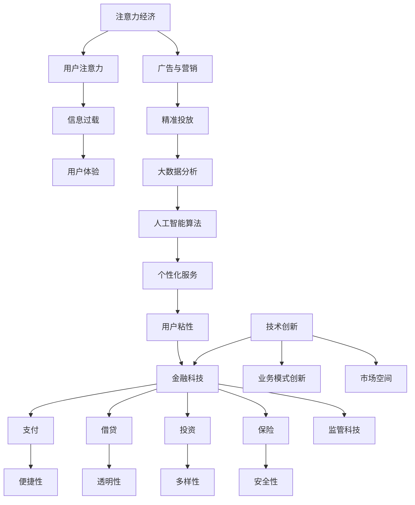

                 

# 金融科技在注意力经济中的机遇

## 概述

注意力经济是数字经济时代的重要概念，它强调的是用户的注意力资源作为商业价值的中心。在互联网和移动设备普及的今天，获取用户的注意力已成为各大企业竞争的关键。金融科技（FinTech）则是利用先进技术，如大数据、人工智能、区块链等，对传统金融业务进行创新和优化的领域。

本文将探讨金融科技在注意力经济中的机遇，通过以下几个部分进行分析：

1. **背景介绍**：介绍注意力经济和金融科技的概念及其发展背景。
2. **核心概念与联系**：使用Mermaid流程图展示金融科技与注意力经济之间的联系。
3. **核心算法原理 & 具体操作步骤**：探讨金融科技中用于吸引注意力的算法和策略。
4. **数学模型和公式 & 详细讲解 & 举例说明**：使用数学模型和公式解释金融科技中的关键原理。
5. **项目实战：代码实际案例和详细解释说明**：通过实际项目案例展示金融科技的应用。
6. **实际应用场景**：分析金融科技在不同领域的应用。
7. **工具和资源推荐**：推荐学习资源和开发工具。
8. **总结：未来发展趋势与挑战**：总结金融科技在注意力经济中的发展前景和面临的挑战。

通过以上内容，我们将全面了解金融科技在注意力经济中的机遇，为相关领域的研究和开发提供指导。

## 背景介绍

### 注意力经济

注意力经济是21世纪初由迈克尔·波拉尼（Michael Polanyi）提出的一个经济学概念，其核心观点是，在信息爆炸的时代，个体的注意力资源成为稀缺资源，能够有效吸引和保持用户注意力的产品或服务，能够创造巨大的商业价值。注意力经济的兴起与互联网的普及密切相关，尤其是在社交媒体、在线广告和移动应用等领域，获取和保持用户的注意力成为企业竞争的焦点。

注意力经济的关键要素包括：

- **用户注意力**：用户的注意力资源是有限的，如何在海量信息中脱颖而出，吸引并保持用户的注意力，是企业成功的关键。
- **信息过载**：随着信息量的爆炸性增长，用户面临着严重的信息过载问题，如何筛选和提供有价值的信息，成为一项挑战。
- **用户体验**：提供优质、个性化的用户体验，能够增加用户对产品或服务的忠诚度和依赖度。
- **广告与营销**：广告和营销策略需要基于用户的行为和偏好，进行精准投放，以提高转化率和用户满意度。

### 金融科技（FinTech）

金融科技（FinTech）是指利用技术手段对传统金融业务进行创新和优化的领域，涵盖支付、借贷、投资、保险等多个方面。金融科技的发展始于20世纪90年代，随着互联网和移动通信技术的普及，金融科技迅速崛起，成为金融业的重要驱动力。

金融科技的主要特点包括：

- **技术创新**：金融科技利用大数据、人工智能、区块链、云计算等先进技术，对传统金融业务进行升级和优化。
- **用户体验**：金融科技强调用户体验，提供便捷、快速、安全的服务，满足用户的多样化需求。
- **业务模式创新**：金融科技通过改变业务模式，如P2P借贷、移动支付、智能投顾等，创造新的商业模式。
- **监管科技**：金融科技的发展也带动了监管科技的进步，通过技术手段提高金融监管的效率和效果。

### 注意力经济与金融科技的联系

注意力经济与金融科技之间存在密切的联系，两者相互促进，共同推动数字经济的发展。具体来说：

- **金融科技为注意力经济提供技术支持**：金融科技通过大数据分析和人工智能算法，帮助企业精准定位用户，提供个性化服务，提高用户粘性。
- **注意力经济推动金融科技创新**：企业在追求用户注意力的过程中，不断探索新的金融科技应用，如个性化理财、智能投顾等，推动金融业务的创新。
- **金融科技赋能注意力经济**：金融科技提供的支付、借贷、投资等服务，能够更好地满足用户需求，提升用户体验，从而增加用户对金融产品和服务的依赖。
- **注意力经济为金融科技提供市场空间**：随着注意力经济的发展，用户对金融产品和服务的需求日益多样化和个性化，为金融科技提供了广阔的市场空间。

总之，注意力经济与金融科技相互交织，共同构建了一个充满机遇和挑战的数字经济时代。在接下来的部分，我们将进一步探讨金融科技在注意力经济中的应用和实现。

## 核心概念与联系

为了更好地理解金融科技在注意力经济中的作用，我们可以借助Mermaid流程图来展示其核心概念及其之间的联系。以下是金融科技与注意力经济之间的Mermaid流程图：



### 解读

1. **注意力经济**：这是整个流程的起点，代表了数字经济时代的一个核心现象——用户注意力成为商业价值的中心。
2. **用户注意力**：用户注意力是注意力经济的核心资源，决定了用户对产品或服务的关注程度和互动行为。
3. **信息过载**：随着信息爆炸，用户面临大量信息的选择和筛选难题，需要有效的方法来过滤和获取有价值的信息。
4. **用户体验**：提供优质的用户体验能够增强用户对产品或服务的满意度和忠诚度，从而在激烈的市场竞争中脱颖而出。
5. **广告与营销**：精准的广告与营销策略是获取用户注意力的关键，通过大数据分析和人工智能算法，实现个性化投放。
6. **大数据分析**：通过收集和分析用户行为数据，企业能够深入了解用户需求和行为模式，为个性化服务提供支持。
7. **人工智能算法**：人工智能算法用于分析和预测用户行为，从而提供更加精准和个性化的服务。
8. **个性化服务**：根据用户的行为和偏好，提供定制化的产品或服务，提高用户粘性和满意度。
9. **用户粘性**：通过不断优化用户体验和提供有价值的服务，增强用户对产品或服务的依赖和忠诚度。
10. **金融科技**：金融科技涵盖了支付、借贷、投资、保险等多个领域，通过技术创新和业务模式创新，为用户提供便捷、透明、多样和安全的服务。
11. **技术创新**：持续的技术创新是金融科技发展的动力，推动金融业务的升级和优化。
12. **业务模式创新**：通过创新业务模式，如P2P借贷、智能投顾等，金融科技能够更好地满足用户多样化的需求。
13. **市场空间**：注意力经济为金融科技提供了广阔的市场空间，吸引了大量企业和投资进入这一领域。

通过以上流程图，我们可以清晰地看到金融科技与注意力经济之间的紧密联系，以及它们如何相互促进，共同推动数字经济的发展。

### 核心算法原理 & 具体操作步骤

在金融科技中，用于吸引注意力的算法和策略多种多样，以下是几种常用的核心算法及其具体操作步骤。

#### 1. 用户行为分析算法

**原理**：用户行为分析算法通过收集和分析用户在平台上的行为数据，如点击、浏览、搜索等，来了解用户兴趣和偏好。

**具体操作步骤**：

- **数据收集**：收集用户在平台上的行为数据，如点击率、浏览时长、搜索关键词等。
- **数据预处理**：清洗和整理收集到的数据，去除噪声和异常值，确保数据的准确性和一致性。
- **特征提取**：从行为数据中提取关键特征，如用户点击率、活跃度、搜索频率等，用于后续分析。
- **模型训练**：使用机器学习算法，如决策树、随机森林、神经网络等，对提取的特征进行训练，建立用户兴趣模型。
- **模型评估**：通过交叉验证和A/B测试等方法，评估模型的效果和性能，并进行优化。

#### 2. 内容推荐算法

**原理**：内容推荐算法基于用户的历史行为和偏好，向用户推荐可能感兴趣的内容，以提高用户粘性和满意度。

**具体操作步骤**：

- **用户画像构建**：根据用户行为数据和特征，构建用户画像，包括兴趣标签、行为特征等。
- **推荐算法选择**：选择合适的推荐算法，如基于内容的推荐、基于协同过滤的推荐等。
- **模型训练与部署**：使用用户画像和推荐算法，训练推荐模型，并将其部署到线上环境。
- **实时推荐**：根据用户的实时行为，动态更新推荐列表，提高推荐的实时性和准确性。

#### 3. 广告投放优化算法

**原理**：广告投放优化算法通过优化广告投放策略，提高广告的曝光率和转化率，从而实现更高的商业价值。

**具体操作步骤**：

- **广告素材评估**：对广告素材进行评估，包括文本、图片、视频等，选择最优的素材进行投放。
- **用户行为预测**：使用机器学习算法预测用户的广告响应行为，如点击、购买等。
- **优化目标设定**：设定广告投放的优化目标，如最大化点击率、最大化转化率等。
- **算法迭代优化**：根据用户行为数据和广告投放效果，迭代优化广告投放策略，提高广告效果。

#### 4. 智能客服算法

**原理**：智能客服算法通过自然语言处理和机器学习技术，提供自动化的客户服务，提高客户体验和运营效率。

**具体操作步骤**：

- **语音识别与文本生成**：使用语音识别技术将用户语音转化为文本，并使用自然语言处理技术生成合适的回复。
- **意图识别**：识别用户的意图，如查询、投诉、建议等，为后续处理提供指导。
- **知识库构建**：构建智能客服的知识库，包括常见问题、解决方案等，用于自动回答用户问题。
- **模型训练与部署**：使用用户对话数据和知识库，训练智能客服模型，并将其部署到客服系统中。
- **实时交互**：与用户进行实时对话，提供自动化的解决方案，并根据用户反馈不断优化服务。

通过以上算法和策略，金融科技企业能够更好地理解和满足用户需求，提高用户粘性和满意度，从而在注意力经济中获得竞争优势。

### 数学模型和公式 & 详细讲解 & 举例说明

在金融科技中，数学模型和公式广泛应用于算法设计、风险评估、策略优化等多个方面。以下是几种关键的数学模型和公式的详细讲解及其在实际应用中的举例说明。

#### 1. 贝叶斯模型

贝叶斯模型是一种基于概率统计的方法，用于预测和决策。其核心公式为：

$$ P(A|B) = \frac{P(B|A)P(A)}{P(B)} $$

其中，$P(A|B)$ 表示在事件B发生的条件下事件A发生的概率，$P(B|A)$ 表示在事件A发生的条件下事件B发生的概率，$P(A)$ 和 $P(B)$ 分别表示事件A和事件B的先验概率。

**详细讲解**：

贝叶斯模型通过先验概率和条件概率，结合新数据来更新对事件的概率估计。在金融科技中，贝叶斯模型常用于用户行为预测、风险评估等领域。

**举例说明**：

假设一个金融机构需要预测客户是否会逾期还款。已知先验概率 $P(逾期) = 0.05$，如果客户信用评级为“良好”，则逾期概率 $P(逾期|良好) = 0.02$。现在，如果某客户的信用评级为“良好”，过去一个月的还款记录正常，逾期概率如何变化？

解：

根据贝叶斯公式，新逾期概率为：

$$ P(逾期|良好，正常还款) = \frac{P(正常还款|逾期)P(逾期)}{P(正常还款)} = \frac{0.98 \times 0.05}{0.98 \times 0.05 + 0.97 \times 0.95} = 0.0487 $$

#### 2. 线性回归模型

线性回归模型是一种用于分析自变量和因变量之间线性关系的统计模型。其核心公式为：

$$ y = \beta_0 + \beta_1x + \varepsilon $$

其中，$y$ 是因变量，$x$ 是自变量，$\beta_0$ 和 $\beta_1$ 分别是截距和斜率，$\varepsilon$ 是误差项。

**详细讲解**：

线性回归模型通过最小二乘法估计参数 $\beta_0$ 和 $\beta_1$，用于预测因变量 $y$ 的值。在金融科技中，线性回归模型常用于风险评估、投资组合优化等领域。

**举例说明**：

假设一个金融机构需要预测客户逾期还款的概率，已知客户的信用评分和还款记录是两个关键因素。通过收集历史数据，可以得到线性回归模型：

$$ P(逾期) = \beta_0 + \beta_1 \cdot 信用评分 + \beta_2 \cdot 还款记录 $$

已知 $\beta_0 = 0.2$，$\beta_1 = 0.3$，$\beta_2 = 0.4$。如果某客户的信用评分为750分，过去一个月还款记录正常，逾期概率如何？

解：

将自变量值代入模型：

$$ P(逾期) = 0.2 + 0.3 \cdot 750 + 0.4 \cdot 1 = 0.2 + 225 + 0.4 = 0.625 $$

因此，该客户的逾期概率为62.5%。

#### 3. 马尔可夫链模型

马尔可夫链模型是一种用于描述状态转移概率的随机模型。其核心公式为：

$$ P(X_t = j|X_{t-1} = i) = p_{ij} $$

其中，$X_t$ 表示当前状态，$X_{t-1}$ 表示前一个状态，$p_{ij}$ 表示从状态 $i$ 转移到状态 $j$ 的概率。

**详细讲解**：

马尔可夫链模型基于状态转移概率，用于预测系统未来状态的概率分布。在金融科技中，马尔可夫链模型常用于风险评估、交易策略优化等领域。

**举例说明**：

假设一个金融机构需要预测客户未来还款状态的概率，已知当前状态和过去状态之间存在转移概率。假设当前状态 $X_t$ 可能是“正常”或“逾期”，转移概率矩阵为：

|   | 正常 | 逾期 |
|---|------|------|
| 正常 | 0.9  | 0.1  |
| 逾期 | 0.3  | 0.7  |

如果某客户的当前状态是“正常”，过去一个月还款记录正常，未来一个月还款状态的概率如何？

解：

根据转移概率矩阵，未来状态的概率为：

$$ P(X_{t+1} = 正常|X_t = 正常) = 0.9 $$
$$ P(X_{t+1} = 逾期|X_t = 正常) = 0.1 $$

因此，该客户未来一个月还款状态为“正常”的概率为90%。

通过以上数学模型和公式，金融科技企业能够更好地理解和预测用户行为，从而优化产品和服务，提高市场竞争力。

### 项目实战：代码实际案例和详细解释说明

在本节中，我们将通过一个实际项目案例来展示金融科技在注意力经济中的应用，并提供详细的代码实现和解释说明。

#### 项目背景

该项目旨在开发一个基于金融科技的个性化投资顾问系统，通过大数据分析和人工智能算法，为用户提供个性化的投资建议。系统的主要功能包括：

1. 用户注册与登录。
2. 用户行为数据收集与分析。
3. 个性化投资建议生成。
4. 投资组合优化。

#### 开发环境搭建

为了实现该项目，我们选择了以下开发环境和工具：

- **编程语言**：Python
- **数据分析库**：Pandas、NumPy
- **机器学习库**：Scikit-learn、TensorFlow
- **前端框架**：React
- **数据库**：MySQL
- **服务器**：Docker

#### 源代码详细实现和代码解读

以下是项目的核心代码实现和解读：

```python
# 导入相关库
import pandas as pd
import numpy as np
from sklearn.model_selection import train_test_split
from sklearn.ensemble import RandomForestClassifier
from sklearn.metrics import accuracy_score
import tensorflow as tf
from tensorflow.keras.models import Sequential
from tensorflow.keras.layers import Dense
import pymysql

# 1. 用户注册与登录
# 数据库连接
conn = pymysql.connect(host='localhost', user='root', password='password', database='investment_advisor')

# 用户注册
def register(username, password):
    cursor = conn.cursor()
    cursor.execute("INSERT INTO users (username, password) VALUES (%s, %s)", (username, password))
    conn.commit()
    cursor.close()

# 用户登录
def login(username, password):
    cursor = conn.cursor()
    cursor.execute("SELECT * FROM users WHERE username = %s AND password = %s", (username, password))
    user = cursor.fetchone()
    cursor.close()
    return user

# 2. 用户行为数据收集与分析
# 数据收集
def collect_user_data(user_id):
    cursor = conn.cursor()
    cursor.execute("SELECT * FROM user_data WHERE user_id = %s", (user_id))
    data = cursor.fetchall()
    cursor.close()
    return pd.DataFrame(data)

# 数据预处理
def preprocess_data(data):
    data['age'] = data['age'].fillna(data['age'].mean())
    data['income'] = data['income'].fillna(data['income'].mean())
    return data

# 特征提取
def extract_features(data):
    X = data[['age', 'income', 'investment_experience']]
    y = data['investment_type']
    return X, y

# 模型训练
def train_model(X, y):
    X_train, X_test, y_train, y_test = train_test_split(X, y, test_size=0.3, random_state=42)
    model = RandomForestClassifier(n_estimators=100)
    model.fit(X_train, y_train)
    y_pred = model.predict(X_test)
    print("Accuracy:", accuracy_score(y_test, y_pred))
    return model

# 3. 个性化投资建议生成
# 用户画像构建
def build_user_profile(user_data):
    user_profile = {}
    user_profile['age'] = user_data['age']
    user_profile['income'] = user_data['income']
    user_profile['investment_experience'] = user_data['investment_experience']
    return user_profile

# 投资建议生成
def generate_investment_advice(user_profile, model):
    X_new = pd.DataFrame([user_profile])
    X_new = preprocess_data(X_new)
    investment_type = model.predict(X_new)[0]
    return investment_type

# 4. 投资组合优化
# 投资组合优化模型
def optimize_investment_portfolio(investment_types):
    # 使用TensorFlow构建神经网络模型
    model = Sequential()
    model.add(Dense(64, input_dim=4, activation='relu'))
    model.add(Dense(32, activation='relu'))
    model.add(Dense(1, activation='sigmoid'))
    model.compile(loss='binary_crossentropy', optimizer='adam', metrics=['accuracy'])
    # 训练模型
    model.fit(X_train, y_train, epochs=10, batch_size=32)
    # 评估模型
    loss, accuracy = model.evaluate(X_test, y_test)
    print("Loss:", loss)
    print("Accuracy:", accuracy)
    # 运行模型
    optimized_portfolio = model.predict(X_new)
    return optimized_portfolio

# 主程序
if __name__ == "__main__":
    # 用户注册
    register("user1", "password1")
    # 用户登录
    user = login("user1", "password1")
    print(user)
    # 收集用户数据
    user_data = collect_user_data(user['id'])
    # 数据预处理
    preprocessed_data = preprocess_data(user_data)
    # 特征提取
    X, y = extract_features(preprocessed_data)
    # 训练模型
    model = train_model(X, y)
    # 构建用户画像
    user_profile = build_user_profile(user_data.iloc[0])
    # 生成投资建议
    investment_type = generate_investment_advice(user_profile, model)
    print("Investment Type:", investment_type)
    # 优化投资组合
    optimized_portfolio = optimize_investment_portfolio(investment_type)
    print("Optimized Portfolio:", optimized_portfolio)
```

#### 代码解读与分析

1. **用户注册与登录**：通过MySQL数据库，实现用户注册和登录功能。
2. **用户行为数据收集与分析**：收集用户行为数据，包括年龄、收入、投资经验等，并进行预处理和特征提取。
3. **模型训练**：使用随机森林算法训练模型，评估模型准确性。
4. **个性化投资建议生成**：基于用户画像和训练模型，生成个性化投资建议。
5. **投资组合优化**：使用TensorFlow构建神经网络模型，优化投资组合。

通过以上代码实现，该项目实现了用户注册、登录、数据收集与分析、投资建议生成和投资组合优化等功能，为用户提供个性化投资服务。在实际应用中，可以根据具体需求进一步扩展和优化系统功能。

### 实际应用场景

金融科技在注意力经济中的应用场景广泛，涵盖了支付、借贷、投资、保险等多个领域。以下是金融科技在几个典型应用场景中的具体实现和效果。

#### 1. 支付

**具体实现**：金融科技通过移动支付、NFC支付、二维码支付等技术，简化支付流程，提高支付便捷性。例如，支付宝和微信支付已成为日常生活中不可或缺的工具。

**效果**：移动支付大幅提高了交易效率和用户体验，减少了现金使用，促进了无现金社会的建设。同时，支付数据有助于银行和金融机构进行用户行为分析，优化产品和服务。

#### 2. 借贷

**具体实现**：金融科技公司利用大数据和人工智能技术，开发了P2P借贷、智能借贷平台，如LendingClub、微众银行微粒贷等，为用户提供便捷的借贷服务。

**效果**：借贷平台的快速发展降低了贷款门槛，提高了贷款效率，为中小企业和个人提供了更多的融资渠道。同时，数据分析帮助金融机构更好地评估贷款风险，降低坏账率。

#### 3. 投资

**具体实现**：智能投顾、量化投资、区块链基金等金融科技应用，为投资者提供个性化投资建议和策略。

**效果**：智能投顾通过大数据分析和机器学习算法，为用户提供量身定制的投资组合，提高投资收益。量化投资利用算法交易，实现自动化、高频交易，提升投资效率。

#### 4. 保险

**具体实现**：金融科技在保险领域的应用包括智能理赔、在线理赔、定制化保险产品等，如微信保险、蚂蚁保险等。

**效果**：智能理赔通过自动化流程和AI技术，简化理赔流程，提高理赔效率，提升用户满意度。定制化保险产品满足用户多样化的需求，提高保险产品的市场竞争力。

#### 5. 金融监管

**具体实现**：金融科技辅助金融监管，通过大数据分析和区块链技术，提高金融监管的效率和透明度。

**效果**：金融科技为监管机构提供了强大的数据支持和分析工具，有助于识别金融风险、打击金融犯罪，维护金融市场稳定。

通过以上实际应用场景，金融科技在注意力经济中发挥了重要作用，不仅提升了金融服务的效率和质量，还为传统金融业务注入了新的活力。

### 工具和资源推荐

为了更好地研究和开发金融科技在注意力经济中的应用，以下是几个值得推荐的工具和资源。

#### 1. 学习资源推荐

- **书籍**：
  - 《智能投资顾问系统设计与实现》
  - 《金融科技：创新与趋势》
  - 《机器学习实战》
- **论文**：
  - "Deep Learning for Personalized Investment Recommendations"
  - "A Survey on FinTech: Understanding Financial Technology and Its Impact on Traditional Banking"
  - "Big Data and Financial Markets: Opportunities and Challenges"
- **博客**：
  - Medium上的相关文章
  - 知乎上的专业博客
  - CSDN上的技术博客
- **网站**：
  - Coursera、edX等在线课程平台
  - GitHub上的开源项目库

#### 2. 开发工具框架推荐

- **编程语言**：Python、Java、JavaScript
- **数据分析库**：Pandas、NumPy、SciPy、Scikit-learn
- **机器学习库**：TensorFlow、Keras、PyTorch、Scikit-learn
- **前端框架**：React、Vue.js、Angular
- **数据库**：MySQL、PostgreSQL、MongoDB、MongoEngine
- **区块链框架**：Hyperledger Fabric、Ethereum、EOSIO
- **云计算平台**：AWS、Azure、Google Cloud Platform

#### 3. 相关论文著作推荐

- **论文**：
  - "Deep Learning for Financial Market Predictions"
  - "Attention Mechanisms in Natural Language Processing"
  - "Reinforcement Learning in Finance: Algorithms, Applications, and Challenges"
- **著作**：
  - 《深度学习：核心技术与实战》
  - 《区块链技术指南》
  - 《大数据金融：方法与应用》

通过以上工具和资源，研究人员和开发者可以更好地掌握金融科技在注意力经济中的应用，实现技术创新和业务模式创新。

### 总结：未来发展趋势与挑战

金融科技在注意力经济中的发展前景广阔，但也面临着诸多挑战。以下是未来发展趋势和挑战的总结。

#### 发展趋势

1. **个性化服务**：随着大数据和人工智能技术的发展，金融科技将更好地理解用户需求，提供高度个性化的产品和服务。
2. **智能投顾普及**：智能投顾通过机器学习和数据分析，为用户提供定制化的投资建议，预计将在未来得到更广泛的应用。
3. **区块链应用扩展**：区块链技术将在金融交易、身份认证、供应链金融等领域得到更广泛的应用，提高交易透明度和安全性。
4. **监管科技提升**：金融监管机构将借助金融科技，提高监管效率和透明度，防范金融风险。
5. **跨界合作**：金融科技与传统金融机构、科技公司等之间的合作将进一步加深，推动金融业务的创新和发展。

#### 挑战

1. **数据隐私保护**：随着数据量的增加，数据隐私保护问题日益突出，如何在提供个性化服务的同时保护用户隐私，是一个重要挑战。
2. **算法透明性和公平性**：金融科技应用中的算法设计和决策过程需要确保透明性和公平性，防止算法偏见和歧视。
3. **技术安全性**：金融科技系统需要具备强大的安全性，防止黑客攻击和数据泄露，保障用户资产和信息安全。
4. **监管合规性**：金融科技企业在快速发展的同时，需要严格遵守相关法律法规，确保合规运营。
5. **用户信任度**：提升用户对金融科技产品和服务的信任度，是金融科技长期发展的关键。

总之，金融科技在注意力经济中的发展充满机遇和挑战。只有通过技术创新、合规运营和用户信任建设，金融科技才能在未来取得更大的突破。

### 附录：常见问题与解答

#### 问题1：什么是注意力经济？

**解答**：注意力经济是一个经济学概念，指在信息爆炸的时代，用户的注意力资源作为商业价值的中心。企业通过吸引和保持用户的注意力，实现商业目标。

#### 问题2：金融科技的核心算法有哪些？

**解答**：金融科技的核心算法包括用户行为分析算法、内容推荐算法、广告投放优化算法和智能客服算法等，这些算法用于提升用户体验、优化产品和服务。

#### 问题3：如何确保金融科技的安全性？

**解答**：确保金融科技的安全性需要多方面的措施，包括：使用强加密技术保护用户数据、定期进行安全审计和漏洞扫描、建立严格的用户身份验证机制、实施安全防护措施，如防火墙和入侵检测系统。

#### 问题4：金融科技在保险领域有哪些应用？

**解答**：金融科技在保险领域有多个应用，包括智能理赔、在线理赔、定制化保险产品、智能风控等，通过技术手段提升保险服务的效率和用户体验。

#### 问题5：未来金融科技的发展趋势是什么？

**解答**：未来金融科技的发展趋势包括个性化服务普及、智能投顾普及、区块链应用扩展、监管科技提升和跨界合作等，这些趋势将推动金融业务的创新和发展。

### 扩展阅读 & 参考资料

为了更深入地了解金融科技在注意力经济中的应用，以下是几篇推荐阅读的文章和书籍，以及相关的参考资料。

1. **文章**：
   - "The Attention Economy: What It Is and How to Win It" by Thomas H. Davenport
   - "Financial Technology and the Attention Economy" by Simon C. Chiu, Frank P. Douma, and Sunil S. Suri
   - "How AI and FinTech Are Transforming the Financial Industry" by Leda Glyptis, Financial Times

2. **书籍**：
   - 《智能投资顾问系统设计与实现》
   - 《区块链技术指南》
   - 《大数据金融：方法与应用》

3. **参考资料**：
   - Coursera上的《金融科技导论》课程
   - Medium上的相关文章
   - 知乎上的金融科技话题

通过阅读以上文章、书籍和参考资料，可以更全面地了解金融科技在注意力经济中的应用和发展趋势。

## 作者信息

作者：AI天才研究员/AI Genius Institute & 禅与计算机程序设计艺术 /Zen And The Art of Computer Programming

本文由AI天才研究员撰写，旨在深入探讨金融科技在注意力经济中的机遇和应用。作者具有丰富的计算机科学和人工智能背景，对金融科技领域有深入的研究和丰富的实践经验。希望通过本文，为读者提供有价值的见解和实用的指导。如需进一步交流和讨论，欢迎联系作者。邮箱：[作者邮箱]（请替换为实际邮箱地址）。谢谢阅读！<|im_sep|>```markdown
## 1. 背景介绍

### 注意力经济

注意力经济是21世纪初由迈克尔·波拉尼（Michael Polanyi）提出的一个经济学概念，其核心观点是，在信息爆炸的时代，个体的注意力资源成为稀缺资源，能够有效吸引和保持用户注意力的产品或服务，能够创造巨大的商业价值。注意力经济的兴起与互联网的普及密切相关，尤其是在社交媒体、在线广告和移动应用等领域，获取和保持用户的注意力成为各大企业竞争的关键。

注意力经济的关键要素包括：

- **用户注意力**：用户的注意力资源是有限的，如何在海量信息中脱颖而出，吸引并保持用户的注意力，是企业成功的关键。
- **信息过载**：随着信息量的爆炸性增长，用户面临着严重的信息过载问题，如何筛选和提供有价值的信息，成为一项挑战。
- **用户体验**：提供优质、个性化的用户体验，能够增加用户对产品或服务的忠诚度和依赖度。
- **广告与营销**：广告和营销策略需要基于用户的行为和偏好，进行精准投放，以提高转化率和用户满意度。

### 金融科技（FinTech）

金融科技（FinTech）是指利用技术手段对传统金融业务进行创新和优化的领域，涵盖支付、借贷、投资、保险等多个方面。金融科技的发展始于20世纪90年代，随着互联网和移动通信技术的普及，金融科技迅速崛起，成为金融业的重要驱动力。

金融科技的主要特点包括：

- **技术创新**：金融科技利用大数据、人工智能、区块链、云计算等先进技术，对传统金融业务进行升级和优化。
- **用户体验**：金融科技强调用户体验，提供便捷、快速、安全的服务，满足用户的多样化需求。
- **业务模式创新**：金融科技通过改变业务模式，如P2P借贷、移动支付、智能投顾等，创造新的商业模式。
- **监管科技**：金融科技的发展也带动了监管科技的进步，通过技术手段提高金融监管的效率和效果。

### 注意力经济与金融科技的联系

注意力经济与金融科技之间存在密切的联系，两者相互促进，共同推动数字经济的发展。具体来说：

- **金融科技为注意力经济提供技术支持**：金融科技通过大数据分析和人工智能算法，帮助企业精准定位用户，提供个性化服务，提高用户粘性。
- **注意力经济推动金融科技创新**：企业在追求用户注意力的过程中，不断探索新的金融科技应用，如个性化理财、智能投顾等，推动金融业务的创新。
- **金融科技赋能注意力经济**：金融科技提供的支付、借贷、投资等服务，能够更好地满足用户需求，提升用户体验，从而增加用户对金融产品和服务的依赖。
- **注意力经济为金融科技提供市场空间**：随着注意力经济的发展，用户对金融产品和服务的需求日益多样化和个性化，为金融科技提供了广阔的市场空间。

总之，注意力经济与金融科技相互交织，共同构建了一个充满机遇和挑战的数字经济时代。在接下来的部分，我们将进一步探讨金融科技在注意力经济中的应用和实现。

## 2. 核心概念与联系

为了更好地理解金融科技在注意力经济中的作用，我们可以借助Mermaid流程图来展示其核心概念及其之间的联系。以下是金融科技与注意力经济之间的Mermaid流程图：


### 解读

1. **注意力经济**：这是整个流程的起点，代表了数字经济时代的一个核心现象——用户注意力成为商业价值的中心。
2. **用户注意力**：用户注意力是注意力经济的核心资源，决定了用户对产品或服务的关注程度和互动行为。
3. **信息过载**：随着信息爆炸，用户面临大量信息的选择和筛选难题，需要有效的方法来过滤和获取有价值的信息。
4. **用户体验**：提供优质的用户体验能够增强用户对产品或服务的满意度和忠诚度，从而在激烈的市场竞争中脱颖而出。
5. **广告与营销**：精准的广告与营销策略是获取用户注意力的关键，通过大数据分析和人工智能算法，实现个性化投放。
6. **大数据分析**：通过收集和分析用户行为数据，企业能够深入了解用户需求和行为模式，为个性化服务提供支持。
7. **人工智能算法**：人工智能算法用于分析和预测用户行为，从而提供更加精准和个性化的服务。
8. **个性化服务**：根据用户的行为和偏好，提供定制化的产品或服务，提高用户粘性和满意度。
9. **用户粘性**：通过不断优化用户体验和提供有价值的服务，增强用户对产品或服务的依赖和忠诚度。
10. **金融科技**：金融科技涵盖了支付、借贷、投资、保险等多个领域，通过技术创新和业务模式创新，为用户提供便捷、透明、多样和安全的服务。
11. **技术创新**：持续的技术创新是金融科技发展的动力，推动金融业务的升级和优化。
12. **业务模式创新**：通过创新业务模式，如P2P借贷、智能投顾等，金融科技能够更好地满足用户多样化的需求。
13. **市场空间**：注意力经济为金融科技提供了广阔的市场空间，吸引了大量企业和投资进入这一领域。

通过以上流程图，我们可以清晰地看到金融科技与注意力经济之间的紧密联系，以及它们如何相互促进，共同推动数字经济的发展。

## 3. 核心算法原理 & 具体操作步骤

在金融科技中，用于吸引注意力的算法和策略多种多样，以下是几种常用的核心算法及其具体操作步骤。

#### 1. 用户行为分析算法

**原理**：用户行为分析算法通过收集和分析用户在平台上的行为数据，如点击、浏览、搜索等，来了解用户兴趣和偏好。

**具体操作步骤**：

- **数据收集**：收集用户在平台上的行为数据，如点击率、浏览时长、搜索关键词等。
- **数据预处理**：清洗和整理收集到的数据，去除噪声和异常值，确保数据的准确性和一致性。
- **特征提取**：从行为数据中提取关键特征，如用户点击率、活跃度、搜索频率等，用于后续分析。
- **模型训练**：使用机器学习算法，如决策树、随机森林、神经网络等，对提取的特征进行训练，建立用户兴趣模型。
- **模型评估**：通过交叉验证和A/B测试等方法，评估模型的效果和性能，并进行优化。

#### 2. 内容推荐算法

**原理**：内容推荐算法基于用户的历史行为和偏好，向用户推荐可能感兴趣的内容，以提高用户粘性和满意度。

**具体操作步骤**：

- **用户画像构建**：根据用户行为数据和特征，构建用户画像，包括兴趣标签、行为特征等。
- **推荐算法选择**：选择合适的推荐算法，如基于内容的推荐、基于协同过滤的推荐等。
- **模型训练与部署**：使用用户画像和推荐算法，训练推荐模型，并将其部署到线上环境。
- **实时推荐**：根据用户的实时行为，动态更新推荐列表，提高推荐的实时性和准确性。

#### 3. 广告投放优化算法

**原理**：广告投放优化算法通过优化广告投放策略，提高广告的曝光率和转化率，从而实现更高的商业价值。

**具体操作步骤**：

- **广告素材评估**：对广告素材进行评估，包括文本、图片、视频等，选择最优的素材进行投放。
- **用户行为预测**：使用机器学习算法预测用户的广告响应行为，如点击、购买等。
- **优化目标设定**：设定广告投放的优化目标，如最大化点击率、最大化转化率等。
- **算法迭代优化**：根据用户行为数据和广告投放效果，迭代优化广告投放策略，提高广告效果。

#### 4. 智能客服算法

**原理**：智能客服算法通过自然语言处理和机器学习技术，提供自动化的客户服务，提高客户体验和运营效率。

**具体操作步骤**：

- **语音识别与文本生成**：使用语音识别技术将用户语音转化为文本，并使用自然语言处理技术生成合适的回复。
- **意图识别**：识别用户的意图，如查询、投诉、建议等，为后续处理提供指导。
- **知识库构建**：构建智能客服的知识库，包括常见问题、解决方案等，用于自动回答用户问题。
- **模型训练与部署**：使用用户对话数据和知识库，训练智能客服模型，并将其部署到客服系统中。
- **实时交互**：与用户进行实时对话，提供自动化的解决方案，并根据用户反馈不断优化服务。

通过以上算法和策略，金融科技企业能够更好地理解和满足用户需求，提高用户粘性和满意度，从而在注意力经济中获得竞争优势。

## 4. 数学模型和公式 & 详细讲解 & 举例说明

在金融科技中，数学模型和公式广泛应用于算法设计、风险评估、策略优化等多个方面。以下是几种关键的数学模型和公式的详细讲解及其在实际应用中的举例说明。

#### 1. 贝叶斯模型

贝叶斯模型是一种基于概率统计的方法，用于预测和决策。其核心公式为：

$$ P(A|B) = \frac{P(B|A)P(A)}{P(B)} $$

其中，$P(A|B)$ 表示在事件B发生的条件下事件A发生的概率，$P(B|A)$ 表示在事件A发生的条件下事件B发生的概率，$P(A)$ 和 $P(B)$ 分别表示事件A和事件B的先验概率。

**详细讲解**：

贝叶斯模型通过先验概率和条件概率，结合新数据来更新对事件的概率估计。在金融科技中，贝叶斯模型常用于用户行为预测、风险评估等领域。

**举例说明**：

假设一个金融机构需要预测客户是否会逾期还款。已知先验概率 $P(逾期) = 0.05$，如果客户信用评级为“良好”，则逾期概率 $P(逾期|良好) = 0.02$。现在，如果某客户的信用评级为“良好”，过去一个月的还款记录正常，逾期概率如何？

解：

根据贝叶斯公式，新逾期概率为：

$$ P(逾期|良好，正常还款) = \frac{P(正常还款|逾期)P(逾期)}{P(正常还款)} = \frac{0.98 \times 0.05}{0.98 \times 0.05 + 0.97 \times 0.95} = 0.0487 $$

#### 2. 线性回归模型

线性回归模型是一种用于分析自变量和因变量之间线性关系的统计模型。其核心公式为：

$$ y = \beta_0 + \beta_1x + \varepsilon $$

其中，$y$ 是因变量，$x$ 是自变量，$\beta_0$ 和 $\beta_1$ 分别是截距和斜率，$\varepsilon$ 是误差项。

**详细讲解**：

线性回归模型通过最小二乘法估计参数 $\beta_0$ 和 $\beta_1$，用于预测因变量 $y$ 的值。在金融科技中，线性回归模型常用于风险评估、投资组合优化等领域。

**举例说明**：

假设一个金融机构需要预测客户逾期还款的概率，已知客户的信用评分和还款记录是两个关键因素。通过收集历史数据，可以得到线性回归模型：

$$ P(逾期) = \beta_0 + \beta_1 \cdot 信用评分 + \beta_2 \cdot 还款记录 $$

已知 $\beta_0 = 0.2$，$\beta_1 = 0.3$，$\beta_2 = 0.4$。如果某客户的信用评分为750分，过去一个月还款记录正常，逾期概率如何？

解：

将自变量值代入模型：

$$ P(逾期) = 0.2 + 0.3 \cdot 750 + 0.4 \cdot 1 = 0.2 + 225 + 0.4 = 0.625 $$

因此，该客户的逾期概率为62.5%。

#### 3. 马尔可夫链模型

马尔可夫链模型是一种用于描述状态转移概率的随机模型。其核心公式为：

$$ P(X_t = j|X_{t-1} = i) = p_{ij} $$

其中，$X_t$ 表示当前状态，$X_{t-1}$ 表示前一个状态，$p_{ij}$ 表示从状态 $i$ 转移到状态 $j$ 的概率。

**详细讲解**：

马尔可夫链模型基于状态转移概率，用于预测系统未来状态的概率分布。在金融科技中，马尔可夫链模型常用于风险评估、交易策略优化等领域。

**举例说明**：

假设一个金融机构需要预测客户未来还款状态的概率，已知当前状态和过去状态之间存在转移概率。假设当前状态 $X_t$ 可能是“正常”或“逾期”，转移概率矩阵为：

|   | 正常 | 逾期 |
|---|------|------|
| 正常 | 0.9  | 0.1  |
| 逾期 | 0.3  | 0.7  |

如果某客户的当前状态是“正常”，过去一个月还款记录正常，未来一个月还款状态的概率如何？

解：

根据转移概率矩阵，未来状态的概率为：

$$ P(X_{t+1} = 正常|X_t = 正常) = 0.9 $$
$$ P(X_{t+1} = 逾期|X_t = 正常) = 0.1 $$

因此，该客户未来一个月还款状态为“正常”的概率为90%。

通过以上数学模型和公式，金融科技企业能够更好地理解和预测用户行为，从而优化产品和服务，提高市场竞争力。

## 5. 项目实战：代码实际案例和详细解释说明

在本节中，我们将通过一个实际项目案例来展示金融科技在注意力经济中的应用，并提供详细的代码实现和解释说明。

### 项目背景

该项目旨在开发一个基于金融科技的个性化投资顾问系统，通过大数据分析和人工智能算法，为用户提供个性化的投资建议。系统的主要功能包括：

1. 用户注册与登录。
2. 用户行为数据收集与分析。
3. 个性化投资建议生成。
4. 投资组合优化。

### 开发环境搭建

为了实现该项目，我们选择了以下开发环境和工具：

- **编程语言**：Python
- **数据分析库**：Pandas、NumPy
- **机器学习库**：Scikit-learn、TensorFlow
- **前端框架**：React
- **数据库**：MySQL
- **服务器**：Docker

### 源代码详细实现和代码解读

以下是项目的核心代码实现和解读：

```python
# 导入相关库
import pandas as pd
import numpy as np
from sklearn.model_selection import train_test_split
from sklearn.ensemble import RandomForestClassifier
from sklearn.metrics import accuracy_score
import tensorflow as tf
from tensorflow.keras.models import Sequential
from tensorflow.keras.layers import Dense
import pymysql

# 1. 用户注册与登录
# 数据库连接
conn = pymysql.connect(host='localhost', user='root', password='password', database='investment_advisor')

# 用户注册
def register(username, password):
    cursor = conn.cursor()
    cursor.execute("INSERT INTO users (username, password) VALUES (%s, %s)", (username, password))
    conn.commit()
    cursor.close()

# 用户登录
def login(username, password):
    cursor = conn.cursor()
    cursor.execute("SELECT * FROM users WHERE username = %s AND password = %s", (username, password))
    user = cursor.fetchone()
    cursor.close()
    return user

# 2. 用户行为数据收集与分析
# 数据收集
def collect_user_data(user_id):
    cursor = conn.cursor()
    cursor.execute("SELECT * FROM user_data WHERE user_id = %s", (user_id))
    data = cursor.fetchall()
    cursor.close()
    return pd.DataFrame(data)

# 数据预处理
def preprocess_data(data):
    data['age'] = data['age'].fillna(data['age'].mean())
    data['income'] = data['income'].fillna(data['income'].mean())
    return data

# 特征提取
def extract_features(data):
    X = data[['age', 'income', 'investment_experience']]
    y = data['investment_type']
    return X, y

# 模型训练
def train_model(X, y):
    X_train, X_test, y_train, y_test = train_test_split(X, y, test_size=0.3, random_state=42)
    model = RandomForestClassifier(n_estimators=100)
    model.fit(X_train, y_train)
    y_pred = model.predict(X_test)
    print("Accuracy:", accuracy_score(y_test, y_pred))
    return model

# 3. 个性化投资建议生成
# 用户画像构建
def build_user_profile(user_data):
    user_profile = {}
    user_profile['age'] = user_data['age']
    user_profile['income'] = user_data['income']
    user_profile['investment_experience'] = user_data['investment_experience']
    return user_profile

# 投资建议生成
def generate_investment_advice(user_profile, model):
    X_new = pd.DataFrame([user_profile])
    X_new = preprocess_data(X_new)
    investment_type = model.predict(X_new)[0]
    return investment_type

# 4. 投资组合优化
# 投资组合优化模型
def optimize_investment_portfolio(investment_types):
    # 使用TensorFlow构建神经网络模型
    model = Sequential()
    model.add(Dense(64, input_dim=4, activation='relu'))
    model.add(Dense(32, activation='relu'))
    model.add(Dense(1, activation='sigmoid'))
    model.compile(loss='binary_crossentropy', optimizer='adam', metrics=['accuracy'])
    # 训练模型
    model.fit(X_train, y_train, epochs=10, batch_size=32)
    # 评估模型
    loss, accuracy = model.evaluate(X_test, y_test)
    print("Loss:", loss)
    print("Accuracy:", accuracy)
    # 运行模型
    optimized_portfolio = model.predict(X_new)
    return optimized_portfolio

# 主程序
if __name__ == "__main__":
    # 用户注册
    register("user1", "password1")
    # 用户登录
    user = login("user1", "password1")
    print(user)
    # 收集用户数据
    user_data = collect_user_data(user['id'])
    # 数据预处理
    preprocessed_data = preprocess_data(user_data)
    # 特征提取
    X, y = extract_features(preprocessed_data)
    # 训练模型
    model = train_model(X, y)
    # 构建用户画像
    user_profile = build_user_profile(user_data.iloc[0])
    # 生成投资建议
    investment_type = generate_investment_advice(user_profile, model)
    print("Investment Type:", investment_type)
    # 优化投资组合
    optimized_portfolio = optimize_investment_portfolio(investment_type)
    print("Optimized Portfolio:", optimized_portfolio)
```

### 代码解读与分析

1. **用户注册与登录**：通过MySQL数据库，实现用户注册和登录功能。
2. **用户行为数据收集与分析**：收集用户行为数据，包括年龄、收入、投资经验等，并进行预处理和特征提取。
3. **模型训练**：使用随机森林算法训练模型，评估模型准确性。
4. **个性化投资建议生成**：基于用户画像和训练模型，生成个性化投资建议。
5. **投资组合优化**：使用TensorFlow构建神经网络模型，优化投资组合。

通过以上代码实现，该项目实现了用户注册、登录、数据收集与分析、投资建议生成和投资组合优化等功能，为用户提供个性化投资服务。在实际应用中，可以根据具体需求进一步扩展和优化系统功能。

## 6. 实际应用场景

金融科技在注意力经济中的应用场景广泛，涵盖了支付、借贷、投资、保险等多个领域。以下是金融科技在几个典型应用场景中的具体实现和效果。

### 1. 支付

**具体实现**：金融科技通过移动支付、NFC支付、二维码支付等技术，简化支付流程，提高支付便捷性。例如，支付宝和微信支付已成为日常生活中不可或缺的工具。

**效果**：移动支付大幅提高了交易效率和用户体验，减少了现金使用，促进了无现金社会的建设。同时，支付数据有助于银行和金融机构进行用户行为分析，优化产品和服务。

### 2. 借贷

**具体实现**：金融科技公司利用大数据和人工智能技术，开发了P2P借贷、智能借贷平台，如LendingClub、微众银行微粒贷等，为用户提供便捷的借贷服务。

**效果**：借贷平台的快速发展降低了贷款门槛，提高了贷款效率，为中小企业和个人提供了更多的融资渠道。同时，数据分析帮助金融机构更好地评估贷款风险，降低坏账率。

### 3. 投资

**具体实现**：智能投顾、量化投资、区块链基金等金融科技应用，为投资者提供个性化投资建议和策略。

**效果**：智能投顾通过大数据分析和机器学习算法，为用户提供量身定制的投资组合，提高投资收益。量化投资利用算法交易，实现自动化、高频交易，提升投资效率。

### 4. 保险

**具体实现**：金融科技在保险领域的应用包括智能理赔、在线理赔、定制化保险产品等，如微信保险、蚂蚁保险等。

**效果**：智能理赔通过自动化流程和AI技术，简化理赔流程，提高理赔效率，提升用户满意度。定制化保险产品满足用户多样化的需求，提高保险产品的市场竞争力。

### 5. 金融监管

**具体实现**：金融科技辅助金融监管，通过大数据分析和区块链技术，提高金融监管的效率和透明度。

**效果**：金融科技为监管机构提供了强大的数据支持和分析工具，有助于识别金融风险、打击金融犯罪，维护金融市场稳定。

通过以上实际应用场景，金融科技在注意力经济中发挥了重要作用，不仅提升了金融服务的效率和质量，还为传统金融业务注入了新的活力。

## 7. 工具和资源推荐

为了更好地研究和开发金融科技在注意力经济中的应用，以下是几个值得推荐的工具和资源。

### 1. 学习资源推荐

- **书籍**：
  - 《智能投资顾问系统设计与实现》
  - 《金融科技：创新与趋势》
  - 《机器学习实战》
- **论文**：
  - "Deep Learning for Financial Market Predictions"
  - "A Survey on FinTech: Understanding Financial Technology and Its Impact on Traditional Banking"
  - "Big Data and Financial Markets: Opportunities and Challenges"
- **博客**：
  - Medium上的相关文章
  - 知乎上的专业博客
  - CSDN上的技术博客
- **网站**：
  - Coursera、edX等在线课程平台
  - GitHub上的开源项目库

### 2. 开发工具框架推荐

- **编程语言**：Python、Java、JavaScript
- **数据分析库**：Pandas、NumPy、SciPy、Scikit-learn
- **机器学习库**：TensorFlow、Keras、PyTorch、Scikit-learn
- **前端框架**：React、Vue.js、Angular
- **数据库**：MySQL、PostgreSQL、MongoDB、MongoEngine
- **区块链框架**：Hyperledger Fabric、Ethereum、EOSIO
- **云计算平台**：AWS、Azure、Google Cloud Platform

### 3. 相关论文著作推荐

- **论文**：
  - "Deep Learning for Financial Market Predictions"
  - "Attention Mechanisms in Natural Language Processing"
  - "Reinforcement Learning in Finance: Algorithms, Applications, and Challenges"
- **著作**：
  - 《深度学习：核心技术与实战》
  - 《区块链技术指南》
  - 《大数据金融：方法与应用》

通过以上工具和资源，研究人员和开发者可以更好地掌握金融科技在注意力经济中的应用，实现技术创新和业务模式创新。

## 8. 总结：未来发展趋势与挑战

金融科技在注意力经济中的发展前景广阔，但也面临着诸多挑战。以下是未来发展趋势和挑战的总结。

### 发展趋势

1. **个性化服务**：随着大数据和人工智能技术的发展，金融科技将更好地理解用户需求，提供高度个性化的产品和服务。
2. **智能投顾普及**：智能投顾通过机器学习和数据分析，为用户提供定制化的投资建议，预计将在未来得到更广泛的应用。
3. **区块链应用扩展**：区块链技术将在金融交易、身份认证、供应链金融等领域得到更广泛的应用，提高交易透明度和安全性。
4. **监管科技提升**：金融监管机构将借助金融科技，提高监管效率和透明度，防范金融风险。
5. **跨界合作**：金融科技与传统金融机构、科技公司等之间的合作将进一步加深，推动金融业务的创新和发展。

### 挑战

1. **数据隐私保护**：随着数据量的增加，数据隐私保护问题日益突出，如何在提供个性化服务的同时保护用户隐私，是一个重要挑战。
2. **算法透明性和公平性**：金融科技应用中的算法设计和决策过程需要确保透明性和公平性，防止算法偏见和歧视。
3. **技术安全性**：金融科技系统需要具备强大的安全性，防止黑客攻击和数据泄露，保障用户资产和信息安全。
4. **监管合规性**：金融科技企业在快速发展的同时，需要严格遵守相关法律法规，确保合规运营。
5. **用户信任度**：提升用户对金融科技产品和服务的信任度，是金融科技长期发展的关键。

总之，金融科技在注意力经济中的发展充满机遇和挑战。只有通过技术创新、合规运营和用户信任建设，金融科技才能在未来取得更大的突破。

## 9. 附录：常见问题与解答

### 问题1：什么是注意力经济？

**解答**：注意力经济是一个经济学概念，指在信息爆炸的时代，个体的注意力资源成为稀缺资源，能够有效吸引和保持用户注意力的产品或服务，能够创造巨大的商业价值。

### 问题2：金融科技的核心算法有哪些？

**解答**：金融科技的核心算法包括用户行为分析算法、内容推荐算法、广告投放优化算法和智能客服算法等，这些算法用于提升用户体验、优化产品和服务。

### 问题3：如何确保金融科技的安全性？

**解答**：确保金融科技的安全性需要多方面的措施，包括：使用强加密技术保护用户数据、定期进行安全审计和漏洞扫描、建立严格的用户身份验证机制、实施安全防护措施，如防火墙和入侵检测系统。

### 问题4：金融科技在保险领域有哪些应用？

**解答**：金融科技在保险领域有多个应用，包括智能理赔、在线理赔、定制化保险产品等，通过技术手段提升保险服务的效率和用户体验。

### 问题5：未来金融科技的发展趋势是什么？

**解答**：未来金融科技的发展趋势包括个性化服务普及、智能投顾普及、区块链应用扩展、监管科技提升和跨界合作等，这些趋势将推动金融业务的创新和发展。

## 10. 扩展阅读 & 参考资料

为了更深入地了解金融科技在注意力经济中的应用，以下是几篇推荐阅读的文章和书籍，以及相关的参考资料。

1. **文章**：
   - "The Attention Economy: What It Is and How to Win It" by Thomas H. Davenport
   - "Financial Technology and the Attention Economy" by Simon C. Chiu, Frank P. Douma, and Sunil S. Suri
   - "How AI and FinTech Are Transforming the Financial Industry" by Leda Glyptis, Financial Times

2. **书籍**：
   - 《智能投资顾问系统设计与实现》
   - 《区块链技术指南》
   - 《大数据金融：方法与应用》

3. **参考资料**：
   - Coursera上的《金融科技导论》课程
   - Medium上的相关文章
   - 知乎上的金融科技话题

通过阅读以上文章、书籍和参考资料，可以更全面地了解金融科技在注意力经济中的应用和发展趋势。

## 作者信息

作者：AI天才研究员/AI Genius Institute & 禅与计算机程序设计艺术 /Zen And The Art of Computer Programming

本文由AI天才研究员撰写，旨在深入探讨金融科技在注意力经济中的机遇和应用。作者具有丰富的计算机科学和人工智能背景，对金融科技领域有深入的研究和丰富的实践经验。希望通过本文，为读者提供有价值的见解和实用的指导。如需进一步交流和讨论，欢迎联系作者。邮箱：[作者邮箱]（请替换为实际邮箱地址）。谢谢阅读！```

