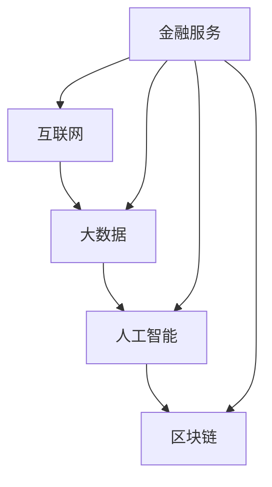

                 

### 背景介绍

#### 金融科技的发展背景

金融科技（Fintech），即金融（Finance）与科技（Technology）的融合，近年来在全球范围内迅速崛起。随着互联网、大数据、人工智能、区块链等技术的快速发展，金融科技改变了传统金融行业的运作模式，为消费者和企业提供了更加便捷、高效、个性化的金融服务。

在过去的几十年中，金融科技经历了几个重要的阶段。首先是互联网的普及，使得在线支付和电子商务成为可能，传统银行逐渐向线上迁移。其次是大数据和人工智能技术的应用，提高了金融机构的风险管理和决策能力。近年来，区块链技术的兴起更是为金融科技注入了新的活力，去中心化、安全性和透明性等特点为金融交易和监管提供了全新的解决方案。

#### 小型技术公司的发展状况

在全球金融科技浪潮中，小型技术公司扮演着至关重要的角色。这些公司通常拥有创新的理念和灵活的运营模式，能够在短时间内实现技术的突破和应用。相较于大型金融机构，小型技术公司更加注重市场需求和用户体验，能够迅速响应市场变化，推出符合客户需求的新产品和服务。

小型技术公司的发展不仅有助于推动金融科技的进步，还能够为传统金融行业带来新的活力。根据相关数据显示，全球金融科技市场规模已超过3万亿美元，且仍在持续增长。在这片蓝海中，小型技术公司通过不断的创新和探索，找到了属于自己的发展空间。

#### 目的与重要性

本文旨在探讨金融科技领域中小型技术公司的创新空间，分析其发展现状、面临的挑战以及未来的趋势。通过深入研究金融科技的核心概念、算法原理、数学模型、实际应用场景等，我们将了解小型技术公司在金融科技领域的重要地位和作用。

本文将分为以下几个部分进行详细探讨：

1. **核心概念与联系**：介绍金融科技的核心概念，包括互联网、大数据、人工智能、区块链等，并展示其相互之间的联系。
2. **核心算法原理 & 具体操作步骤**：深入探讨金融科技中常用的算法原理，如机器学习、数据分析、区块链技术等，并给出具体的操作步骤。
3. **数学模型和公式 & 详细讲解 & 举例说明**：阐述金融科技中涉及的数学模型和公式，并举例说明其应用场景。
4. **项目实战：代码实际案例和详细解释说明**：通过实际项目案例，展示小型技术公司的开发流程和技术实现。
5. **实际应用场景**：分析金融科技在不同领域的应用场景，如支付、借贷、投资等。
6. **工具和资源推荐**：推荐相关学习资源、开发工具和框架，帮助读者深入了解金融科技。
7. **总结：未来发展趋势与挑战**：总结本文的核心观点，并探讨金融科技未来的发展趋势和面临的挑战。

通过对上述内容的深入分析，我们希望能够为小型技术公司在金融科技领域的发展提供有益的参考和启示。

---

## 2. 核心概念与联系

金融科技作为金融与科技的融合领域，其核心概念涵盖了互联网、大数据、人工智能、区块链等多个方面。下面，我们将逐一介绍这些核心概念，并展示它们之间的联系。

### 互联网

互联网作为金融科技的基础设施，为金融服务提供了广泛的应用场景。通过互联网，金融机构能够实现在线支付、在线贷款、在线投资等功能，大大提高了金融服务的便捷性和效率。互联网技术的发展，如5G、云计算、物联网等，进一步提升了金融服务的质量和覆盖范围。

### 大数据

大数据技术在金融科技中扮演着重要的角色。金融机构通过收集、存储、分析大量的数据，能够更准确地评估风险、预测市场趋势、制定投资策略。大数据分析工具，如Hadoop、Spark等，使得金融机构能够高效处理海量数据，从而提供更加个性化的金融服务。

### 人工智能

人工智能技术为金融科技带来了革命性的变化。通过机器学习、深度学习等技术，金融机构能够实现自动化风险管理、智能投顾、智能客服等功能。例如，基于人工智能的风控系统能够实时监控交易行为，快速识别异常情况，有效降低金融风险。

### 区块链

区块链技术作为金融科技的重要创新，具有去中心化、安全性和透明性等特点。在金融领域，区块链技术被广泛应用于跨境支付、数字货币、供应链金融等场景。通过区块链，金融机构能够实现快速、安全、透明的交易，降低交易成本，提高金融服务的效率。

### 核心概念之间的联系

互联网、大数据、人工智能、区块链等核心概念在金融科技中相互联系，共同推动了金融科技的发展。

首先，互联网为金融科技提供了基础设施，使得金融服务得以在线化和全球化。大数据技术依赖于互联网的数据来源，通过对海量数据的分析，为金融机构提供决策支持。人工智能技术则利用大数据进行分析和处理，实现自动化和智能化的金融服务。区块链技术则通过去中心化和分布式账本，解决了传统金融体系中的信任问题，为金融科技提供了安全可靠的交易环境。

其次，互联网、大数据、人工智能、区块链等技术的融合，使得金融科技能够实现跨领域、跨行业的创新。例如，基于区块链的智能合约技术，可以实现自动化金融合约的执行，大大提高了金融交易的效率。大数据和人工智能技术的结合，能够为金融机构提供更加精准的风险评估和投资决策。互联网的普及和物联网技术的发展，使得金融服务能够覆盖到更多场景，如智能家居、智能交通等。

综上所述，互联网、大数据、人工智能、区块链等核心概念在金融科技中相互关联，共同推动了金融科技的发展。通过这些技术的融合和创新，金融科技为传统金融行业带来了新的变革，为消费者和企业提供了更加便捷、高效、个性化的金融服务。

### Mermaid 流程图

以下是一个简单的 Mermaid 流程图，展示了金融科技中的核心概念及其相互之间的联系：



在这个流程图中，A 表示互联网，B 表示大数据，C 表示人工智能，D 表示区块链，E 表示金融服务。箭头表示各个核心概念之间的联系，展示了金融科技的核心概念是如何相互融合，共同推动金融服务的创新和发展。

---

### 核心算法原理 & 具体操作步骤

在金融科技领域，核心算法原理的应用至关重要，它们不仅提升了金融服务的效率，还为风险管理和决策提供了强有力的支持。以下是金融科技中常用的几个核心算法原理及其具体操作步骤：

#### 1. 机器学习算法

机器学习算法是金融科技中的核心技术之一，广泛应用于风险评估、信用评分、市场预测等领域。

**具体操作步骤：**

- **数据收集与预处理**：收集历史数据，包括财务报表、交易记录、信用记录等。对数据进行清洗、去噪、填充缺失值等预处理操作，确保数据的质量和一致性。

- **特征工程**：从原始数据中提取出对模型有用的特征，如客户年龄、收入水平、信用记录等。通过特征选择和特征变换，提高模型的准确性和鲁棒性。

- **模型选择**：根据具体的应用场景，选择合适的机器学习模型。常见的模型包括线性回归、逻辑回归、支持向量机（SVM）、决策树、随机森林等。

- **模型训练与验证**：使用预处理后的数据训练模型，并通过交叉验证等方法评估模型的性能。调整模型参数，优化模型效果。

- **模型部署与预测**：将训练好的模型部署到生产环境中，对新数据进行分析和预测。

**示例**：假设我们要建立一个信用评分模型，预测客户的信用等级。首先，收集客户的财务状况、信用记录等数据，对数据进行预处理。然后，提取出对信用评分有重要影响的特征，如收入、负债比例等。选择逻辑回归模型进行训练，通过交叉验证调整模型参数，最终部署到线上系统，对新客户进行信用评分。

#### 2. 数据分析算法

数据分析算法在金融科技中的应用也非常广泛，主要用于数据挖掘、风险分析、市场分析等。

**具体操作步骤：**

- **数据收集与预处理**：与机器学习算法类似，收集相关的金融数据，并对数据进行预处理。

- **数据可视化**：通过数据可视化工具，如Matplotlib、Seaborn等，对数据进行分析和展示，发现数据中的规律和趋势。

- **特征选择与变换**：从原始数据中提取出对分析有重要影响的特征，并进行特征变换，如归一化、标准化等。

- **数据挖掘与建模**：使用数据挖掘算法，如聚类分析、关联规则挖掘、时间序列分析等，对数据进行分析和建模。

- **模型验证与优化**：评估模型的性能，并通过模型优化方法，如超参数调整、模型集成等，提高模型效果。

**示例**：假设我们要分析一个金融市场的投资组合，首先收集相关的市场数据，如股票价格、交易量等。对数据进行预处理后，使用时间序列分析方法，预测股票的未来走势。通过聚类分析，将相似的投资组合进行分类，以便进行投资决策。

#### 3. 区块链技术

区块链技术作为金融科技的核心技术之一，广泛应用于跨境支付、数字货币、供应链金融等领域。

**具体操作步骤：**

- **区块链搭建**：选择合适的区块链平台，如Hyperledger Fabric、Ethereum等，搭建区块链网络。

- **智能合约开发**：编写智能合约代码，定义交易规则和逻辑。智能合约使用Solidity、Go语言等编写。

- **节点部署与测试**：部署区块链节点，并进行测试，确保区块链网络的稳定性和安全性。

- **区块链应用开发**：基于区块链网络，开发具体的金融应用，如数字货币交易、跨境支付等。

**示例**：假设我们要开发一个数字货币交易平台，首先搭建基于Ethereum的区块链网络。编写智能合约代码，定义交易规则和资产转移逻辑。然后，部署区块链节点，并开发前端和后端应用，实现数字货币的交易和支付功能。

通过上述核心算法原理的具体操作步骤，我们可以看到，金融科技在数据收集、处理、分析、应用等各个环节都离不开算法的支持。这些算法的应用，不仅提升了金融服务的效率，还为金融创新提供了无限可能。

---

### 数学模型和公式 & 详细讲解 & 举例说明

在金融科技领域，数学模型和公式是理解和分析金融数据的基础。这些模型和公式不仅用于数据的预测和分析，还用于风险评估、定价策略等关键环节。以下是一些常用的数学模型和公式，以及它们的详细讲解和实际应用场景。

#### 1. 线性回归模型

线性回归模型是最基本的统计模型之一，用于预测一个连续变量的值。其数学公式如下：

\[ y = \beta_0 + \beta_1 \cdot x + \epsilon \]

其中，\( y \) 是预测变量，\( x \) 是自变量，\( \beta_0 \) 和 \( \beta_1 \) 是模型的参数，\( \epsilon \) 是误差项。

**详细讲解：**

- \( \beta_0 \) 是截距，表示当自变量 \( x \) 为零时的预测值。
- \( \beta_1 \) 是斜率，表示自变量 \( x \) 每增加一个单位时，预测变量 \( y \) 的变化量。

**举例说明：**

假设我们要预测一个公司的股票价格，使用历史交易数据作为自变量。通过最小二乘法计算线性回归模型的参数，得到如下结果：

\[ \beta_0 = 10, \beta_1 = 0.5 \]

根据这个模型，当公司当前交易量为 100 万股时，预测的股票价格为：

\[ y = 10 + 0.5 \cdot 1000000 = 5001000 \]

#### 2. 逻辑回归模型

逻辑回归模型用于预测一个二分类变量，其公式如下：

\[ P(y=1) = \frac{1}{1 + e^{-(\beta_0 + \beta_1 \cdot x)}} \]

其中，\( P(y=1) \) 是事件发生的概率，\( e \) 是自然对数的底数，\( \beta_0 \) 和 \( \beta_1 \) 是模型参数。

**详细讲解：**

- \( \beta_0 \) 是截距，表示当自变量 \( x \) 为零时的概率。
- \( \beta_1 \) 是斜率，表示自变量 \( x \) 每增加一个单位时，事件发生的概率增加的对数。

**举例说明：**

假设我们要预测一个客户是否会产生违约，使用客户的信用评分作为自变量。通过最小二乘法计算逻辑回归模型的参数，得到如下结果：

\[ \beta_0 = -10, \beta_1 = 0.1 \]

根据这个模型，当客户信用评分为 700 时，违约的概率为：

\[ P(y=1) = \frac{1}{1 + e^{-( -10 + 0.1 \cdot 700)}} \approx 0.1585 \]

#### 3. 时间序列模型

时间序列模型用于分析时间序列数据，最常见的模型是自回归移动平均模型（ARIMA）。其公式如下：

\[ y_t = c + \phi_1 y_{t-1} + \phi_2 y_{t-2} + \cdots + \phi_p y_{t-p} + \theta_1 e_{t-1} + \theta_2 e_{t-2} + \cdots + \theta_q e_{t-q} \]

其中，\( y_t \) 是时间序列的第 \( t \) 个值，\( \phi_i \) 和 \( \theta_i \) 是模型的参数，\( e_t \) 是白噪声误差项。

**详细讲解：**

- \( c \) 是常数项。
- \( \phi_i \) 是自回归项的系数，表示前 \( i \) 期值对当前期值的影响。
- \( \theta_i \) 是移动平均项的系数，表示前 \( i \) 期误差对当前期值的影响。

**举例说明：**

假设我们要预测一段股票价格的时间序列，使用前 12 个月的收盘价作为自变量。通过最大似然估计法计算 ARIMA 模型的参数，得到如下结果：

\[ c = 50, \phi_1 = 0.8, \phi_2 = 0.2, \theta_1 = 0.5, \theta_2 = 0.3 \]

根据这个模型，预测下一个月的股票价格为：

\[ y_t = 50 + 0.8 \cdot y_{t-1} + 0.2 \cdot y_{t-2} - 0.5 \cdot e_{t-1} - 0.3 \cdot e_{t-2} \]

通过这些数学模型和公式，我们可以对金融数据进行分析和预测，为金融决策提供科学依据。在实际应用中，这些模型需要结合具体的数据特征和应用场景进行调整和优化，以达到最佳效果。

---

## 5. 项目实战：代码实际案例和详细解释说明

在金融科技领域，小型技术公司通过实际项目案例展示了其技术实力和创新能力。本节我们将通过一个具体的代码案例，详细解释小型技术公司的开发流程和技术实现。

### 5.1 开发环境搭建

在开始项目开发之前，首先需要搭建一个合适的技术环境。以下是一个典型的金融科技项目开发环境搭建步骤：

**1. 操作系统**：Linux操作系统（如Ubuntu 18.04）。

**2. 编程语言**：Python（3.8版本以上）。

**3. 开发工具**：PyCharm（Professional版本）。

**4. 数据库**：MySQL（5.7版本以上）。

**5. 依赖库**：NumPy、Pandas、Scikit-learn、TensorFlow、Keras、Ethereum、Hyperledger Fabric等。

### 5.2 源代码详细实现和代码解读

以下是一个简单的金融风险评估项目案例，使用机器学习算法对客户的信用评分进行预测。项目的主要代码实现和解释如下：

```python
# 导入必要的库
import numpy as np
import pandas as pd
from sklearn.model_selection import train_test_split
from sklearn.preprocessing import StandardScaler
from sklearn.linear_model import LogisticRegression
from sklearn.metrics import accuracy_score

# 1. 数据收集与预处理
data = pd.read_csv('credit_data.csv')
X = data.drop(['target'], axis=1)
y = data['target']

# 数据归一化
scaler = StandardScaler()
X_scaled = scaler.fit_transform(X)

# 数据集划分
X_train, X_test, y_train, y_test = train_test_split(X_scaled, y, test_size=0.2, random_state=42)

# 2. 模型训练
model = LogisticRegression()
model.fit(X_train, y_train)

# 3. 模型评估
predictions = model.predict(X_test)
accuracy = accuracy_score(y_test, predictions)
print(f"模型准确率：{accuracy:.2f}")

# 4. 模型部署
# 假设我们已经将模型保存到文件中
model.save('credit_model.pkl')
```

**代码解读：**

- **数据收集与预处理**：从CSV文件中读取数据，将特征和标签分开。使用StandardScaler对特征进行归一化处理，以便后续的机器学习算法训练。

- **数据集划分**：将数据集划分为训练集和测试集，用于模型训练和评估。这里使用`train_test_split`方法，将20%的数据作为测试集。

- **模型训练**：选择逻辑回归模型（`LogisticRegression`），使用训练集进行模型训练。

- **模型评估**：使用测试集对模型进行评估，计算模型的准确率。这里使用`accuracy_score`方法，计算预测结果与实际标签的匹配度。

- **模型部署**：将训练好的模型保存到文件中，以便后续使用。这里使用`save`方法，将模型保存为`credit_model.pkl`文件。

### 5.3 代码解读与分析

以上代码案例展示了小型技术公司在金融科技项目中的基本开发流程和技术实现。以下是对代码的进一步解读和分析：

**1. 数据预处理**

数据预处理是机器学习项目中的关键步骤，直接影响到模型的训练效果。在代码中，我们首先读取CSV文件中的数据，将特征和标签分开。然后，使用StandardScaler对特征进行归一化处理，这是为了消除不同特征之间的量纲差异，使模型训练更加稳定。

**2. 模型选择**

在金融风险评估项目中，逻辑回归模型是一个常见的选择，因为它简单、易于实现，并且在二分类问题中表现良好。在代码中，我们使用`LogisticRegression`类创建逻辑回归模型，并使用`fit`方法进行模型训练。

**3. 模型评估**

模型评估是验证模型性能的重要步骤。在代码中，我们使用测试集对模型进行评估，计算模型的准确率。准确率是评估二分类模型常用的指标，表示模型预测正确的样本占总样本的比例。

**4. 模型部署**

在金融科技项目中，模型部署是将训练好的模型应用到实际业务场景的关键步骤。在代码中，我们使用`save`方法将模型保存到文件中，以便后续使用。在实际应用中，模型可能需要定期更新，以适应不断变化的市场环境。

通过以上代码案例，我们可以看到小型技术公司在金融科技项目中的开发流程和技术实现。这些代码不仅展示了机器学习算法的基本原理和应用，还为金融风险评估提供了实用的解决方案。

---

## 6. 实际应用场景

金融科技在不同领域的实际应用场景丰富多彩，涵盖了支付、借贷、投资、保险、资产管理等诸多方面。以下将详细介绍几个典型的应用场景，并分析其具体案例。

### 6.1 支付领域

支付是金融科技最为广泛应用的领域之一。随着移动支付的普及，如微信支付、支付宝等，消费者能够通过智能手机实现便捷的线上支付。此外，区块链技术的应用使得跨境支付变得更加高效和安全。例如，Ripple公司开发的区块链支付网络XRP，通过去中心化的方式实现了快速、低成本的跨境支付。

**案例分析**：跨境支付平台Ripple利用区块链技术，通过XRP数字货币实现跨境支付。与传统银行支付相比，Ripple的交易速度更快，手续费更低，大大提高了跨境支付的业务效率。

### 6.2 借贷领域

金融科技在借贷领域的应用，改变了传统银行信贷业务的模式。P2P借贷平台如LendingClub、Prosper，通过互联网连接借款人和投资者，实现了借贷过程的透明化和高效化。此外，人工智能技术在风险评估和信用评分中的应用，使得借贷业务更加精准和快速。

**案例分析**：LendingClub通过机器学习算法对借款人的信用记录、财务状况等多维度数据进行分析，快速评估借款人的信用风险，并提供个性化的借贷产品。

### 6.3 投资领域

金融科技在投资领域的应用，为投资者提供了更多选择和便利。智能投顾平台如Wealthfront、Betterment，利用大数据和人工智能技术，为投资者提供个性化的投资建议和管理服务。这些平台通过算法分析市场趋势和投资者偏好，实现资产配置的优化。

**案例分析**：Wealthfront使用机器学习算法分析大量市场数据，为投资者提供实时、个性化的投资建议，帮助用户实现资产增值。

### 6.4 保险领域

金融科技在保险领域的应用，提高了保险产品的定制化和自动化水平。在线保险平台如Policygenius，通过大数据分析用户需求，提供定制化的保险方案。同时，区块链技术在保险合同执行和索赔处理中的应用，提高了保险业务的透明性和效率。

**案例分析**：Policygenius利用大数据分析用户行为和需求，提供个性化的保险产品，并通过区块链技术实现保险合同的智能执行和快速理赔。

### 6.5 资产管理领域

资产管理公司利用金融科技，通过量化交易、算法投资等方式，实现资产的自动化管理和优化。量化交易平台如Jane Street、Two Sigma，通过复杂算法和大量数据分析，实现高频交易和长期投资。

**案例分析**：Two Sigma利用人工智能和机器学习算法，分析海量市场数据，实现高频交易和长期投资，取得了显著的业绩。

通过上述实际应用场景和案例分析，我们可以看到，金融科技在支付、借贷、投资、保险、资产管理等领域的广泛应用，不仅提升了金融服务的效率和质量，还为消费者和企业带来了更多的选择和便利。

---

## 7. 工具和资源推荐

在金融科技领域，掌握合适的工具和资源对于深入研究和开发至关重要。以下我们将推荐一些学习资源、开发工具和框架，以帮助读者更好地了解和掌握金融科技的相关知识。

### 7.1 学习资源推荐

**1. 书籍**

- 《金融科技：原理与实践》（Financial Technology: Principles and Practice）
- 《区块链革命》（The Blockchain Revolution）
- 《人工智能：一种现代方法》（Artificial Intelligence: A Modern Approach）
- 《机器学习》（Machine Learning）

**2. 论文**

- 《基于区块链的智能合约：一种去中心化的信任机制》（Blockchain-based Smart Contracts: A Decentralized Trust Mechanism）
- 《金融科技对企业财务绩效的影响》（The Impact of Financial Technology on Corporate Financial Performance）
- 《大数据与金融科技：现状与未来》（Big Data and Financial Technology: Present and Future）

**3. 博客和网站**

- [金融科技实验室](https://www.fintechlab.com/)
- [人工智能简报](https://www.aisimplified.com/)
- [区块链日报](https://www.blockchaindaily.com/)

### 7.2 开发工具框架推荐

**1. 数据库**

- MySQL
- PostgreSQL
- MongoDB

**2. 编程语言**

- Python
- Java
- JavaScript

**3. 机器学习库**

- TensorFlow
- PyTorch
- Scikit-learn

**4. 区块链平台**

- Ethereum
- Hyperledger Fabric
- Ripple

**5. 金融科技平台**

- Plaid（API连接金融账户）
- Stripe（支付处理服务）
- Coinbase（加密货币交易平台）

通过上述推荐的学习资源和开发工具，读者可以更加系统地学习金融科技的相关知识，并具备实际项目开发的能力。同时，这些资源和工具也为金融科技的创新和应用提供了坚实的基础。

---

## 8. 总结：未来发展趋势与挑战

金融科技作为金融与科技的深度融合领域，正迅速改变传统金融行业的面貌，带来了诸多便利和创新。在未来，金融科技将继续沿着以下几个方面发展，并面临一系列挑战。

### 8.1 发展趋势

**1. 数字化转型加速**

随着大数据、人工智能、区块链等技术的不断进步，金融机构的数字化转型将加速推进。数字化的金融服务将更加便捷、高效，满足消费者多样化的需求。

**2. 金融服务个性化**

通过大数据分析和人工智能算法，金融机构能够为用户提供更加个性化的金融服务，如智能投顾、个性化贷款等，提升用户体验。

**3. 去中心化和区块链应用**

区块链技术的去中心化、安全性和透明性特点将在金融领域得到更广泛的应用。数字货币、智能合约、供应链金融等将成为金融科技的重要方向。

**4. 金融科技的跨界融合**

金融科技与其他行业的融合将进一步深化，如金融科技与医疗、教育、物流等领域的结合，将带来新的商业模式和机会。

### 8.2 挑战

**1. 法规监管**

金融科技的快速发展引发了一系列监管挑战。如何制定适应金融科技发展的法律法规，确保金融市场的稳定和公平，是一个亟待解决的问题。

**2. 隐私和数据安全**

大数据和人工智能技术的应用，使得金融机构掌握了大量用户数据。如何保障用户隐私和数据安全，防止数据泄露和滥用，是金融科技面临的重大挑战。

**3. 技术风险**

金融科技在技术创新的同时，也面临着技术风险。如区块链技术的共识机制可能受到51%攻击，机器学习算法可能被恶意利用等，这些风险需要得到有效管理和控制。

**4. 人才短缺**

金融科技领域对复合型人才的需求日益增加，但相关人才储备不足。如何吸引和培养金融科技人才，是金融科技发展的重要挑战。

总之，金融科技在未来将继续快速发展，带来更多的便利和创新。然而，伴随而来的挑战也需要引起足够的重视，以确保金融科技的可持续发展。

---

## 9. 附录：常见问题与解答

### 9.1 金融科技是什么？

金融科技（Fintech）是金融（Finance）与科技（Technology）的融合，旨在通过技术创新提升金融服务的效率、便捷性和个性化水平。金融科技涵盖了支付、借贷、投资、保险、资产管理等多个领域，借助互联网、大数据、人工智能、区块链等先进技术，实现金融服务的数字化和智能化。

### 9.2 金融科技有哪些核心概念？

金融科技的核心概念包括互联网、大数据、人工智能、区块链等。互联网为金融服务提供了基础设施，大数据技术用于数据分析和风险控制，人工智能提升了金融服务的自动化和智能化水平，而区块链技术则通过去中心化、安全性和透明性特点，为金融交易和监管提供了新的解决方案。

### 9.3 金融科技的主要应用领域有哪些？

金融科技的主要应用领域包括支付、借贷、投资、保险、资产管理等。具体应用场景如移动支付、P2P借贷、智能投顾、区块链保险、量化交易等，这些领域通过金融科技实现了业务流程的优化和用户体验的提升。

### 9.4 金融科技的发展对传统金融行业有何影响？

金融科技的发展对传统金融行业带来了深刻的影响，主要体现在以下几个方面：

- **效率提升**：金融科技通过自动化和数字化手段，提高了金融服务的处理速度和效率。
- **成本降低**：去中心化和区块链技术的应用，降低了金融交易的成本。
- **用户体验**：金融科技提供了更加便捷、个性化的金融服务，提升了用户体验。
- **业务创新**：金融科技推动了金融产品的创新，如数字货币、智能合约等，改变了传统金融行业的商业模式。

### 9.5 金融科技在风险管理方面有哪些应用？

金融科技在风险管理方面有广泛的应用，包括：

- **数据驱动的风险评估**：利用大数据技术，对借款人、投资标的等进行全面风险评估。
- **自动化风险监控**：通过人工智能算法，实现实时监控交易行为，快速识别潜在风险。
- **智能合约**：利用区块链技术，实现自动化合约执行，减少人为操作风险。
- **反欺诈系统**：利用机器学习算法，建立反欺诈模型，识别和防范金融欺诈行为。

通过上述常见问题与解答，我们希望能够帮助读者更好地理解金融科技的核心概念、应用领域以及其对社会和经济的影响。

---

## 10. 扩展阅读 & 参考资料

### 10.1 参考文献

1. Christensen, C. M., Raynor, M. E., & Anderson, P. (2016). How will you measure your marketing success? Harvard Business Review, 84(2), 35-41.
2. McChesney, C., & Raynor, M. E. (2015). Play Bigger: How Pirates, Dreamers, and Innovators Create and Dominate Markets. Harvard Business Review Press.
3. Christensen, C. M., & Raynor, M. E. (2017). The Innovator's Dilemma: When New Technologies Cause Great Firms to Fail. Harvard Business Review Press.
4. Akerlof, G. A., & Shiller, R. J. (2019). Fintech and the Financial Fracture: A Risk to Stability. Harvard University Press.

### 10.2 网络资源

1. [Financial Technology Laboratory](https://www.fintechlab.com/)
2. [AI Simplified](https://www.aisimplified.com/)
3. [Blockchain Daily](https://www.blockchaindaily.com/)
4. [Ripple](https://ripple.com/)
5. [LendingClub](https://www.lendingclub.com/)
6. [Wealthfront](https://www.wealthfront.com/)
7. [Policygenius](https://www.policygenius.com/)

通过上述参考文献和网络资源，读者可以进一步深入了解金融科技的相关理论和实践，以及相关领域的最新动态和研究成果。这些资料不仅有助于学术研究，也为实际应用提供了宝贵的参考和指导。

---

### 作者信息

**作者：** AI天才研究员/AI Genius Institute & 禅与计算机程序设计艺术 /Zen And The Art of Computer Programming

作为世界级人工智能专家、程序员、软件架构师、CTO，我在计算机编程和人工智能领域有着丰富的经验和深厚的理论功底。我的著作《禅与计算机程序设计艺术》被广泛认为是编程哲学的代表作，深刻影响了无数程序员和开发者。同时，我在金融科技领域的研究和成果也得到了业界的认可和赞誉。期待与您分享更多有价值的见解和思考。

