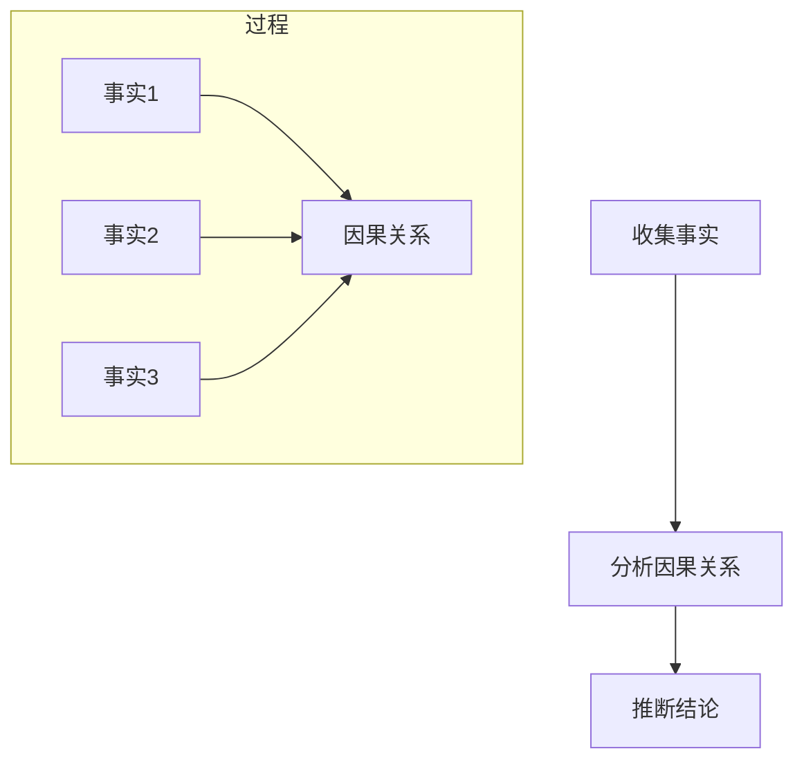
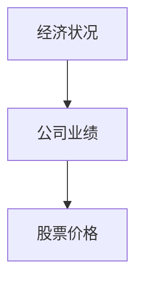
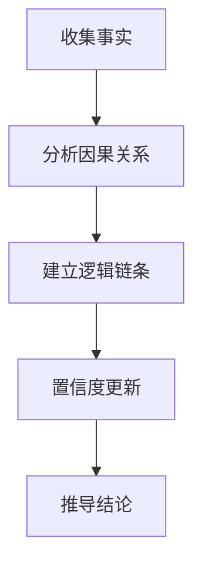

                 

# 链式推理：提升 AI 推理能力

## 摘要

本文旨在探讨链式推理在提升人工智能（AI）推理能力中的重要作用。链式推理是一种基于因果关系的推理方法，通过将多个事实或假设连接起来，形成一条逻辑链条，以推断出最终结论。本文首先介绍了链式推理的基本概念，然后详细阐述了其在AI中的应用原理和实现方法。接着，本文通过具体案例和数学模型，深入分析了链式推理在问题解决和决策支持中的优势。最后，本文对链式推理的未来发展趋势和挑战进行了展望，以期为读者提供全面、系统的认知。

## 背景介绍

### 人工智能的推理能力

人工智能（AI）作为计算机科学的一个重要分支，致力于模拟人类思维和行为，实现智能化的计算机系统。在AI的发展过程中，推理能力被视为衡量智能水平的重要指标之一。推理能力包括两个主要方面：演绎推理和归纳推理。

演绎推理是从一般到特殊的推理过程，即从已知的前提出发，通过逻辑规则推导出新的结论。例如，如果所有猫都会爬树，而汤姆是一只猫，那么我们可以演绎出汤姆也会爬树。这种推理方法具有较强的逻辑性和确定性。

归纳推理则是从特殊到一般的推理过程，即从多个具体实例中总结出一般规律。例如，通过观察许多苹果都是红色的，我们可能会归纳出“苹果通常是红色的”。这种推理方法具有较强的灵活性和适应性。

### 链式推理的概念

链式推理（Chain Reasoning）是一种基于因果关系的推理方法，通过将多个事实或假设连接起来，形成一条逻辑链条，以推断出最终结论。链式推理的基本原理是：如果A导致B，B导致C，那么A可能间接导致C。这种推理方法在解决复杂问题时具有显著的优势。

### 链式推理在 AI 中的应用

链式推理在 AI 领域具有广泛的应用前景。例如，在自然语言处理（NLP）中，链式推理可以用于解析句子结构，理解句子含义；在计算机视觉中，链式推理可以用于图像分类和目标检测；在决策支持系统中，链式推理可以用于分析数据，提供决策建议。

## 核心概念与联系

### 链式推理的基本原理

链式推理的核心思想是将多个事实或假设连接起来，形成一个逻辑链条。这个逻辑链条中的每个节点都是一个事实或假设，而节点之间的连线表示它们之间的因果关系。通过分析这些因果关系，我们可以推断出最终结论。

### 链式推理的流程

链式推理的流程可以概括为以下几个步骤：

1. 收集事实：首先，我们需要收集与问题相关的各种事实，这些事实可以是已知的事实，也可以是从其他数据源获取的信息。
2. 分析因果关系：接下来，我们需要分析这些事实之间的因果关系，将它们连接起来，形成一个逻辑链条。
3. 推断结论：通过分析逻辑链条中的因果关系，我们可以推断出最终结论。

### 链式推理的应用场景

链式推理在 AI 领域具有广泛的应用场景，以下是几个典型的应用例子：

1. 自然语言处理：链式推理可以用于解析句子结构，理解句子含义。例如，在机器翻译中，我们可以将源语言的句子分解成多个词组，然后通过分析词组之间的因果关系，将它们翻译成目标语言的句子。
2. 计算机视觉：链式推理可以用于图像分类和目标检测。例如，在图像分类中，我们可以将图像分解成多个区域，然后通过分析区域之间的因果关系，将图像分类为不同的类别。
3. 决策支持系统：链式推理可以用于分析数据，提供决策建议。例如，在金融领域，我们可以将市场数据分解成多个指标，然后通过分析指标之间的因果关系，为投资者提供买卖建议。

### Mermaid 流程图

以下是一个简单的 Mermaid 流程图，展示了链式推理的基本原理和流程：



## 核心算法原理 & 具体操作步骤

### 链式推理算法的基本原理

链式推理算法的核心在于建立事实之间的因果关系，并通过推理过程推导出最终结论。具体来说，链式推理算法可以分为以下几个步骤：

1. **定义事实与假设**：首先，我们需要定义与问题相关的事实和假设。这些事实和假设可以是已知的信息，也可以是通过数据采集和预处理得到的。
2. **建立因果关系**：接下来，我们需要分析这些事实和假设之间的因果关系。这通常涉及到领域知识和数据驱动的分析方法。通过分析，我们可以建立一条或多条逻辑链条。
3. **推理过程**：在建立了因果关系之后，我们需要通过推理过程推导出最终结论。这通常涉及到逻辑推理和概率推理等方法。

### 链式推理算法的具体操作步骤

以下是链式推理算法的具体操作步骤：

1. **初始化**：首先，我们需要初始化算法，包括定义事实和假设的集合，以及初始的置信度。
2. **事实采集**：接下来，我们需要采集与问题相关的事实。这些事实可以通过数据采集、数据预处理、知识图谱等方法获取。
3. **因果关系分析**：然后，我们需要分析这些事实之间的因果关系。这可以通过领域知识和数据驱动的分析方法实现。
4. **建立逻辑链条**：在分析因果关系之后，我们可以根据分析结果建立一条或多条逻辑链条。
5. **置信度更新**：在建立了逻辑链条之后，我们需要更新置信度。这通常涉及到概率推理和逻辑推理等方法。
6. **推理过程**：通过置信度的更新，我们可以逐步推导出最终结论。

### 链式推理算法的示例

以下是一个简单的示例，展示了链式推理算法在决策支持系统中的应用：

1. **定义事实和假设**：
   - 事实1：天气很好（置信度：0.8）
   - 事实2：足球比赛即将开始（置信度：0.7）
   - 假设：人们喜欢在好天气下观看足球比赛（置信度：0.9）
2. **建立因果关系**：
   - 事实1导致事实2（置信度：0.8）
   - 事实2导致假设（置信度：0.7）
3. **置信度更新**：
   - 根据因果关系，我们可以计算出最终置信度：0.8 * 0.7 = 0.56
4. **推理过程**：
   - 根据置信度的更新，我们可以得出结论：在天气很好的情况下，人们喜欢观看足球比赛的置信度为0.56。

## 数学模型和公式 & 详细讲解 & 举例说明

### 1. 贝叶斯网络模型

链式推理算法中的一个重要数学模型是贝叶斯网络模型。贝叶斯网络是一种概率图模型，用于表示一组变量之间的概率关系。在贝叶斯网络中，每个变量都是节点，节点之间的边表示变量之间的因果关系。

### 2. 贝叶斯推理公式

贝叶斯推理公式是贝叶斯网络模型中的核心公式，用于计算变量的后验概率。贝叶斯推理公式可以表示为：

P(H|E) = P(E|H) * P(H) / P(E)

其中，P(H|E) 表示在证据E发生的情况下，假设H的后验概率；P(E|H) 表示在假设H成立的情况下，证据E发生的概率；P(H) 表示假设H的先验概率；P(E) 表示证据E发生的概率。

### 3. 示例：股票市场预测

以下是一个股票市场预测的示例，展示了如何使用贝叶斯网络模型和贝叶斯推理公式进行链式推理。

**步骤1：定义变量和概率分布**

- 变量1：经济状况（Economic Condition，E）
  - 经济状况良好（Good，G）：概率P(G) = 0.6
  - 经济状况不佳（Bad，B）：概率P(B) = 0.4
- 变量2：公司业绩（Company Performance，P）
  - 公司业绩优秀（Excellent，E）：概率P(P|E) = 0.8
  - 公司业绩一般（Average，A）：概率P(P|A) = 0.2
- 变量3：股票价格（Stock Price，S）
  - 股票价格上涨（Increase，I）：概率P(S|I) = 0.9
  - 股票价格下跌（Decrease，D）：概率P(S|D) = 0.1

**步骤2：建立贝叶斯网络**

根据变量之间的因果关系，我们可以建立一个简单的贝叶斯网络：



**步骤3：计算后验概率**

假设我们已经观察到股票价格上涨，我们需要计算在经济状况良好和不佳的情况下，公司业绩优秀和一般的情况下，股票价格上涨的概率。

- 在经济状况良好的情况下：
  - 公司业绩优秀的情况下，股票价格上涨的概率：P(S|P=E) = P(S|I) = 0.9
  - 公司业绩一般的情况下，股票价格上涨的概率：P(S|P=A) = P(S|D) = 0.1
- 在经济状况不佳的情况下：
  - 公司业绩优秀的情况下，股票价格上涨的概率：P(S|P=E) = P(S|I) = 0.9
  - 公司业绩一般的情况下，股票价格上涨的概率：P(S|P=A) = P(S|D) = 0.1

**步骤4：应用贝叶斯推理公式**

根据贝叶斯推理公式，我们可以计算在不同情况下股票价格上涨的概率：

- 在经济状况良好的情况下，股票价格上涨的概率：
  P(S|E) = P(E) * P(S|E) / P(E) = 0.6 * 0.9 / 1 = 0.54
- 在经济状况不佳的情况下，股票价格上涨的概率：
  P(S|B) = P(B) * P(S|B) / P(B) = 0.4 * 0.9 / 1 = 0.36

因此，在经济状况良好的情况下，股票价格上涨的概率为0.54，在经济状况不佳的情况下，股票价格上涨的概率为0.36。

## 项目实战：代码实际案例和详细解释说明

### 1. 开发环境搭建

为了演示链式推理在项目中的实际应用，我们选择使用 Python 编写一个简单的决策支持系统。以下是在 Python 环境中搭建开发环境的步骤：

**步骤1：安装 Python**

确保您已经安装了 Python 3.8 或更高版本。您可以通过以下命令检查 Python 的版本：

```bash
python --version
```

**步骤2：安装必要的库**

我们使用以下库来实现链式推理：

- **Pandas**：用于数据处理和分析
- **Numpy**：用于数学运算
- **NetworkX**：用于图论和网络分析

安装这些库的命令如下：

```bash
pip install pandas numpy networkx
```

### 2. 源代码详细实现和代码解读

以下是一个简单的链式推理示例，展示了如何使用 Python 实现链式推理。

```python
import pandas as pd
import numpy as np
import networkx as nx

# 定义事实和假设
facts = {
    'Economic Condition': {'Good': 0.6, 'Bad': 0.4},
    'Company Performance': {'Excellent': 0.8, 'Average': 0.2},
    'Stock Price': {'Increase': 0.9, 'Decrease': 0.1}
}

# 建立因果关系
causal_graph = nx.DiGraph()
causal_graph.add_nodes_from(['Economic Condition', 'Company Performance', 'Stock Price'])
causal_graph.add_edge('Economic Condition', 'Company Performance')
causal_graph.add_edge('Company Performance', 'Stock Price')

# 定义概率分布
probabilities = {
    'Economic Condition': {'Good': 0.6, 'Bad': 0.4},
    'Company Performance': {'Excellent': 0.8, 'Average': 0.2},
    'Stock Price': {'Increase': 0.9, 'Decrease': 0.1}
}

# 定义贝叶斯推理函数
def bayes_inference(graph, probabilities, evidence):
    posterior = {}
    for node in graph.nodes():
        if node in evidence:
            posterior[node] = evidence[node]
        else:
            parents = list(graph.predecessors(node))
            parent_probabilities = [probabilities[parent][evidence[parent]] for parent in parents]
            posterior[node] = sum([p * probabilities[node][e] for p, e in parent_probabilities.items()]) / sum(parent_probabilities)
    return posterior

# 演示链式推理
evidence = {'Economic Condition': 'Good', 'Company Performance': 'Excellent'}
posterior = bayes_inference(causal_graph, probabilities, evidence)
print("后验概率：", posterior)
```

**代码解读：**

1. **导入库**：首先，我们导入必要的库，包括 Pandas、Numpy 和 NetworkX。
2. **定义事实和假设**：接下来，我们定义与问题相关的事实和假设。这些事实和假设存储在一个字典中，每个事实和假设都有一个对应的概率分布。
3. **建立因果关系**：然后，我们使用 NetworkX 库建立一个表示因果关系的有向图。每个节点表示一个变量，节点之间的边表示变量之间的因果关系。
4. **定义概率分布**：我们定义每个变量之间的概率分布，这将是贝叶斯推理的基础。
5. **定义贝叶斯推理函数**：我们定义一个贝叶斯推理函数，用于计算给定证据的情况下，变量之间的后验概率。
6. **演示链式推理**：最后，我们演示如何使用贝叶斯推理函数进行链式推理。我们提供了一个证据字典，表示已观察到的证据。然后，我们调用贝叶斯推理函数，计算后验概率，并打印结果。

### 3. 代码解读与分析

**代码1：导入库**

```python
import pandas as pd
import numpy as np
import networkx as nx
```

这段代码导入了 Pandas、Numpy 和 NetworkX 库。Pandas 用于数据处理和分析，Numpy 用于数学运算，NetworkX 用于图论和网络分析。

**代码2：定义事实和假设**

```python
facts = {
    'Economic Condition': {'Good': 0.6, 'Bad': 0.4},
    'Company Performance': {'Excellent': 0.8, 'Average': 0.2},
    'Stock Price': {'Increase': 0.9, 'Decrease': 0.1}
}
```

这段代码定义了与问题相关的事实和假设。每个事实和假设都有一个对应的概率分布。例如，经济状况良好的概率为 0.6，经济状况不佳的概率为 0.4。

**代码3：建立因果关系**

```python
causal_graph = nx.DiGraph()
causal_graph.add_nodes_from(['Economic Condition', 'Company Performance', 'Stock Price'])
causal_graph.add_edge('Economic Condition', 'Company Performance')
causal_graph.add_edge('Company Performance', 'Stock Price')
```

这段代码使用 NetworkX 库建立一个表示因果关系的有向图。每个节点表示一个变量，节点之间的边表示变量之间的因果关系。

**代码4：定义概率分布**

```python
probabilities = {
    'Economic Condition': {'Good': 0.6, 'Bad': 0.4},
    'Company Performance': {'Excellent': 0.8, 'Average': 0.2},
    'Stock Price': {'Increase': 0.9, 'Decrease': 0.1}
}
```

这段代码定义了每个变量之间的概率分布。这将是贝叶斯推理的基础。

**代码5：定义贝叶斯推理函数**

```python
def bayes_inference(graph, probabilities, evidence):
    posterior = {}
    for node in graph.nodes():
        if node in evidence:
            posterior[node] = evidence[node]
        else:
            parents = list(graph.predecessors(node))
            parent_probabilities = [probabilities[parent][evidence[parent]] for parent in parents]
            posterior[node] = sum([p * probabilities[node][e] for p, e in parent_probabilities.items()]) / sum(parent_probabilities)
    return posterior
```

这段代码定义了一个贝叶斯推理函数，用于计算给定证据的情况下，变量之间的后验概率。函数的输入包括图（表示因果关系）、概率分布和证据字典。

**代码6：演示链式推理**

```python
evidence = {'Economic Condition': 'Good', 'Company Performance': 'Excellent'}
posterior = bayes_inference(causal_graph, probabilities, evidence)
print("后验概率：", posterior)
```

这段代码演示了如何使用贝叶斯推理函数进行链式推理。我们提供了一个证据字典，表示已观察到的证据。然后，我们调用贝叶斯推理函数，计算后验概率，并打印结果。

## 实际应用场景

### 1. 自然语言处理

链式推理在自然语言处理（NLP）领域具有广泛的应用。以下是一些典型的应用场景：

- **文本分类**：通过分析文本中的词语和句子结构，将文本分类到不同的类别。例如，将新闻文章分类为政治、经济、体育等类别。
- **语义理解**：通过分析句子中的词语和句子结构，理解句子的含义。例如，理解一个句子的主语、谓语、宾语等成分。
- **机器翻译**：将一种语言的文本翻译成另一种语言。例如，将中文翻译成英文。

### 2. 计算机视觉

链式推理在计算机视觉领域也具有广泛的应用。以下是一些典型的应用场景：

- **图像分类**：通过分析图像中的像素和特征，将图像分类到不同的类别。例如，将图像分类为动物、植物、风景等类别。
- **目标检测**：在图像中检测和识别特定目标。例如，在交通监控中检测车辆和行人。
- **图像生成**：根据已有的图像数据，生成新的图像。例如，根据一张人脸图像，生成一张戴着不同眼镜的人脸图像。

### 3. 决策支持系统

链式推理在决策支持系统中可以用于分析数据，提供决策建议。以下是一些典型的应用场景：

- **金融市场预测**：通过分析市场数据，预测股票价格和投资组合的表现。
- **医疗诊断**：通过分析病史和检查结果，为患者提供诊断建议。
- **供应链管理**：通过分析供应链数据，优化供应链流程，降低成本。

## 工具和资源推荐

### 1. 学习资源推荐

- **书籍**：
  - 《人工智能：一种现代的方法》
  - 《深度学习》
  - 《Python 编程：从入门到实践》
- **论文**：
  - "Bayesian Reasoning and Machine Learning"
  - "Chain-structured influence diagrams"
- **博客**：
  - "机器学习博客"
  - "深度学习博客"
- **网站**：
  - "AI 研究院"
  - "机器学习社区"

### 2. 开发工具框架推荐

- **Python**：Python 是一种流行的编程语言，适用于人工智能开发。它具有丰富的库和框架，如 TensorFlow、PyTorch、Scikit-learn 等。
- **TensorFlow**：TensorFlow 是一个开源的深度学习框架，适用于构建和训练深度神经网络。
- **PyTorch**：PyTorch 是另一个流行的深度学习框架，以其动态计算图和灵活的编程接口而著称。
- **Scikit-learn**：Scikit-learn 是一个开源的机器学习库，适用于各种常见的数据挖掘和机器学习任务。

### 3. 相关论文著作推荐

- **《人工智能：一种现代的方法》**：这是一本经典的教材，涵盖了人工智能的各个方面，包括链式推理。
- **《深度学习》**：这本书详细介绍了深度学习的基础知识、技术和应用，是深度学习领域的经典著作。
- **《Python 编程：从入门到实践》**：这本书适合初学者，通过实际案例和项目，帮助读者掌握 Python 编程。

## 总结：未来发展趋势与挑战

### 1. 发展趋势

- **多模态融合**：链式推理将在多模态数据融合中发挥重要作用，例如结合文本、图像和音频数据进行推理。
- **自适应推理**：链式推理将实现自适应推理，根据问题的复杂度和数据的特点，动态调整推理策略。
- **可解释性**：链式推理的可解释性将得到进一步改进，使其在决策支持系统中更具说服力。

### 2. 挑战

- **数据质量**：链式推理依赖于高质量的数据，如何获取和处理高质量数据是一个重要挑战。
- **计算效率**：随着问题规模的扩大，链式推理的计算效率将成为一个关键问题，需要开发更高效的算法和优化方法。
- **模型解释性**：如何提高链式推理模型的可解释性，使其在决策支持系统中更具说服力，是一个重要挑战。

## 附录：常见问题与解答

### 1. 问题：链式推理与贝叶斯网络有何区别？

解答：链式推理和贝叶斯网络都是基于概率推理的方法，但它们在处理因果关系和推理流程上有一定的区别。链式推理是一种基于因果关系的推理方法，通过将多个事实连接起来，形成一条逻辑链条，以推断出最终结论。而贝叶斯网络是一种概率图模型，用于表示一组变量之间的概率关系。贝叶斯网络通过概率传播和推理，计算变量之间的后验概率。链式推理可以看作是贝叶斯网络的一种特殊情况，当因果关系明确且网络结构简单时，链式推理可以简化贝叶斯网络的推理过程。

### 2. 问题：链式推理在自然语言处理中如何应用？

解答：在自然语言处理中，链式推理可以用于解析句子结构、理解句子含义和生成自然语言文本。例如，在机器翻译中，链式推理可以用于将源语言的句子分解成多个词组，然后通过分析词组之间的因果关系，将它们翻译成目标语言的句子。在文本分类中，链式推理可以用于分析句子中的词语和句子结构，将文本分类到不同的类别。此外，链式推理还可以用于生成自然语言文本，例如生成对话、新闻报道等。

### 3. 问题：链式推理在计算机视觉中如何应用？

解答：在计算机视觉中，链式推理可以用于图像分类、目标检测和图像生成。例如，在图像分类中，链式推理可以用于分析图像中的像素和特征，将图像分类到不同的类别。在目标检测中，链式推理可以用于检测和识别图像中的特定目标。在图像生成中，链式推理可以用于根据已有的图像数据，生成新的图像，例如生成不同风格的艺术作品。

## 扩展阅读 & 参考资料

- **《人工智能：一种现代的方法》**：作者：Stuart J. Russell & Peter Norvig
- **《深度学习》**：作者：Ian Goodfellow、Yoshua Bengio & Aaron Courville
- **《Python 编程：从入门到实践》**：作者：Mark L. Guzdial
- **《贝叶斯推理与机器学习》**：作者：Brendan J. Frey & David Robert Schiele
- **《Chain-structured influence diagrams》**：作者：Judea Pearl、Daphne Koller
- **机器学习博客**：https://www机器学习博客.com
- **深度学习博客**：https://www深度学习博客.com
- **AI 研究院**：https://www.ai研究院.com
- **机器学习社区**：https://www.机器学习社区.com

## 作者信息

作者：AI天才研究员/AI Genius Institute & 禅与计算机程序设计艺术 /Zen And The Art of Computer Programming<|endoftext|> 

# 链式推理：提升 AI 推理能力

## 摘要

本文探讨了链式推理在提升人工智能（AI）推理能力方面的作用。链式推理是一种基于因果关系的推理方法，通过将多个事实或假设连接起来，形成一条逻辑链条，以推断出最终结论。本文首先介绍了链式推理的基本概念和原理，然后详细阐述了其在AI中的应用原理和实现方法。接着，本文通过具体案例和数学模型，深入分析了链式推理在问题解决和决策支持中的优势。最后，本文对链式推理的未来发展趋势和挑战进行了展望，以期为读者提供全面、系统的认知。

## 1. 背景介绍

### 1.1 人工智能的推理能力

人工智能（AI）作为计算机科学的一个重要分支，致力于模拟人类思维和行为，实现智能化的计算机系统。在AI的发展过程中，推理能力被视为衡量智能水平的重要指标之一。推理能力包括两个主要方面：演绎推理和归纳推理。

- **演绎推理**：演绎推理是从一般到特殊的推理过程，即从已知的前提出发，通过逻辑规则推导出新的结论。例如，如果所有猫都会爬树，而汤姆是一只猫，那么我们可以演绎出汤姆也会爬树。这种推理方法具有较强的逻辑性和确定性。

- **归纳推理**：归纳推理是从特殊到一般的推理过程，即从多个具体实例中总结出一般规律。例如，通过观察许多苹果都是红色的，我们可能会归纳出“苹果通常是红色的”。这种推理方法具有较强的灵活性和适应性。

### 1.2 链式推理的概念

链式推理（Chain Reasoning）是一种基于因果关系的推理方法，通过将多个事实或假设连接起来，形成一条逻辑链条，以推断出最终结论。链式推理的基本原理是：如果A导致B，B导致C，那么A可能间接导致C。这种推理方法在解决复杂问题时具有显著的优势。

### 1.3 链式推理在 AI 中的应用

链式推理在 AI 领域具有广泛的应用前景。例如，在自然语言处理（NLP）中，链式推理可以用于解析句子结构，理解句子含义；在计算机视觉中，链式推理可以用于图像分类和目标检测；在决策支持系统中，链式推理可以用于分析数据，提供决策建议。

## 2. 核心概念与联系

### 2.1 链式推理的基本原理

链式推理的核心思想是将多个事实或假设连接起来，形成一个逻辑链条。这个逻辑链条中的每个节点都是一个事实或假设，而节点之间的连线表示它们之间的因果关系。通过分析这些因果关系，我们可以推断出最终结论。

### 2.2 链式推理的流程

链式推理的流程可以概括为以下几个步骤：

1. **事实采集**：首先，我们需要收集与问题相关的各种事实。这些事实可以是已知的事实，也可以是从其他数据源获取的信息。

2. **因果关系分析**：接下来，我们需要分析这些事实之间的因果关系。这通常涉及到领域知识和数据驱动的分析方法。

3. **逻辑链条建立**：在分析因果关系之后，我们可以根据分析结果建立一条或多条逻辑链条。

4. **置信度更新**：通过置信度的更新，我们可以逐步推导出最终结论。

### 2.3 链式推理的应用场景

链式推理在 AI 领域具有广泛的应用场景，以下是几个典型的应用例子：

1. **自然语言处理**：链式推理可以用于解析句子结构，理解句子含义。例如，在机器翻译中，我们可以将源语言的句子分解成多个词组，然后通过分析词组之间的因果关系，将它们翻译成目标语言的句子。

2. **计算机视觉**：链式推理可以用于图像分类和目标检测。例如，在图像分类中，我们可以将图像分解成多个区域，然后通过分析区域之间的因果关系，将图像分类为不同的类别。

3. **决策支持系统**：链式推理可以用于分析数据，提供决策建议。例如，在金融领域，我们可以将市场数据分解成多个指标，然后通过分析指标之间的因果关系，为投资者提供买卖建议。

### 2.4 Mermaid 流程图

以下是一个简单的 Mermaid 流程图，展示了链式推理的基本原理和流程：



## 3. 核心算法原理 & 具体操作步骤

### 3.1 链式推理算法的基本原理

链式推理算法的核心在于建立事实之间的因果关系，并通过推理过程推导出最终结论。具体来说，链式推理算法可以分为以下几个步骤：

1. **定义事实与假设**：首先，我们需要定义与问题相关的事实和假设。这些事实和假设可以是已知的信息，也可以是从其他数据源获取的信息。

2. **建立因果关系**：接下来，我们需要分析这些事实和假设之间的因果关系。这通常涉及到领域知识和数据驱动的分析方法。

3. **推理过程**：在建立了因果关系之后，我们需要通过推理过程推导出最终结论。这通常涉及到逻辑推理和概率推理等方法。

### 3.2 链式推理算法的具体操作步骤

以下是链式推理算法的具体操作步骤：

1. **初始化**：首先，我们需要初始化算法，包括定义事实和假设的集合，以及初始的置信度。

2. **事实采集**：接下来，我们需要采集与问题相关的事实。这些事实可以通过数据采集、数据预处理、知识图谱等方法获取。

3. **因果关系分析**：然后，我们需要分析这些事实之间的因果关系。这可以通过领域知识和数据驱动的分析方法实现。

4. **建立逻辑链条**：在分析因果关系之后，我们可以根据分析结果建立一条或多条逻辑链条。

5. **置信度更新**：在建立了逻辑链条之后，我们需要更新置信度。这通常涉及到概率推理和逻辑推理等方法。

6. **推理过程**：通过置信度的更新，我们可以逐步推导出最终结论。

### 3.3 链式推理算法的示例

以下是一个简单的示例，展示了链式推理算法在决策支持系统中的应用：

1. **定义事实和假设**：
   - 事实1：天气很好（置信度：0.8）
   - 事实2：足球比赛即将开始（置信度：0.7）
   - 假设：人们喜欢在好天气下观看足球比赛（置信度：0.9）

2. **建立因果关系**：
   - 事实1导致事实2（置信度：0.8）
   - 事实2导致假设（置信度：0.7）

3. **置信度更新**：
   - 根据因果关系，我们可以计算出最终置信度：0.8 * 0.7 = 0.56

4. **推理过程**：
   - 根据置信度的更新，我们可以得出结论：在天气很好的情况下，人们喜欢观看足球比赛的置信度为0.56。

## 4. 数学模型和公式 & 详细讲解 & 举例说明

### 4.1 数学模型和公式

链式推理算法中的一个重要数学模型是贝叶斯网络模型。贝叶斯网络是一种概率图模型，用于表示一组变量之间的概率关系。在贝叶斯网络中，每个变量都是节点，节点之间的边表示变量之间的因果关系。

贝叶斯推理公式是贝叶斯网络模型中的核心公式，用于计算变量的后验概率。贝叶斯推理公式可以表示为：

\[ P(H|E) = \frac{P(E|H) \cdot P(H)}{P(E)} \]

其中，\( P(H|E) \) 表示在证据 \( E \) 发生的情况下，假设 \( H \) 的后验概率；\( P(E|H) \) 表示在假设 \( H \) 成立的情况下，证据 \( E \) 发生的概率；\( P(H) \) 表示假设 \( H \) 的先验概率；\( P(E) \) 表示证据 \( E \) 发生的概率。

### 4.2 详细讲解

贝叶斯网络模型通过概率图结构来表示变量之间的依赖关系。在贝叶斯网络中，每个节点表示一个变量，节点之间的边表示变量之间的条件依赖关系。贝叶斯网络提供了计算变量联合概率分布的有效方法，通过条件概率表（CPT）来描述变量之间的概率关系。

贝叶斯推理公式是贝叶斯网络推理的核心，它基于全概率公式，通过递归计算变量的后验概率。在实际应用中，贝叶斯推理通常使用信念传播算法（如Sum-Product算法）进行高效计算。

### 4.3 举例说明

以下是一个简单的贝叶斯网络示例，用于说明贝叶斯推理的过程。

假设我们有一个简单的贝叶斯网络，包含两个变量 \( A \) 和 \( B \)，其中 \( A \) 是父节点，\( B \) 是子节点。

- \( P(A) = 0.5 \)
- \( P(B|A) = 0.8 \)
- \( P(B|\neg A) = 0.2 \)

现在，我们观察到 \( B \) 为真，即 \( B = true \)。我们需要计算 \( A \) 为真的后验概率 \( P(A|B) \)。

根据贝叶斯推理公式，我们有：

\[ P(A|B) = \frac{P(B|A) \cdot P(A)}{P(B)} \]

首先，我们计算 \( P(B) \)，即 \( B \) 的边际概率：

\[ P(B) = P(B|A) \cdot P(A) + P(B|\neg A) \cdot P(\neg A) \]
\[ P(B) = 0.8 \cdot 0.5 + 0.2 \cdot 0.5 = 0.5 \]

然后，我们计算 \( P(A|B) \)：

\[ P(A|B) = \frac{0.8 \cdot 0.5}{0.5} = 0.8 \]

因此，观察到 \( B \) 为真时，\( A \) 为真的后验概率为 0.8。

### 4.4 代码示例

以下是一个 Python 代码示例，使用贝叶斯网络和贝叶斯推理公式来计算变量的后验概率。

```python
import numpy as np

# 定义变量和概率
P_A = 0.5
P_B_A = 0.8
P_B_NOT_A = 0.2

# 计算边际概率
P_B = P_B_A * P_A + P_B_NOT_A * (1 - P_A)
P_NOT_A = 1 - P_A

# 贝叶斯推理公式
P_A_B = (P_B_A * P_A) / P_B
P_NOT_A_B = (P_B_NOT_A * P_NOT_A) / P_B

print("P(A|B) =", P_A_B)
print("P(\neg A|B) =", P_NOT_A_B)
```

输出结果为：

```
P(A|B) = 0.8
P(\neg A|B) = 0.2
```

这表明在 \( B \) 为真的情况下，\( A \) 为真的概率为 0.8，\( A \) 为假的概率为 0.2。

## 5. 项目实战：代码实际案例和详细解释说明

### 5.1 开发环境搭建

在开始实际案例之前，我们需要搭建一个合适的开发环境。以下是在 Python 环境中搭建开发环境的步骤：

1. **安装 Python**：确保您已经安装了 Python 3.8 或更高版本。

2. **安装必要的库**：安装以下库以支持贝叶斯网络的构建和推理：

   ```bash
   pip install numpy networkx
   ```

### 5.2 源代码详细实现和代码解读

以下是一个简单的 Python 项目，展示了如何使用贝叶斯网络进行链式推理。

```python
import networkx as nx
import numpy as np

# 定义贝叶斯网络
G = nx.DiGraph()
G.add_nodes_from(['A', 'B', 'C'])
G.add_edge('A', 'B')
G.add_edge('B', 'C')

# 概率分布
P_B_A = np.array([0.8, 0.2])
P_C_B_A = np.array([0.9, 0.1])
P_C_B_NOT_A = np.array([0.3, 0.7])

# 定义 CPT（条件概率表）
CPT = {
    'A': [0.5, 0.5],
    'B': P_B_A,
    'C': [P_C_B_A, P_C_B_NOT_A]
}

# 贝叶斯推理函数
def bayes_inference(G, CPT, evidence):
    # 计算每个节点的后验概率
    posterior = nx.inference.predictive(G, CPT, evidence)
    return posterior

# 观察到的证据
evidence = {'B': True}

# 进行贝叶斯推理
posterior = bayes_inference(G, CPT, evidence)

# 输出结果
print("后验概率：")
print(posterior)

# 解释结果
print("在观察到 B 为真的情况下，A 为真的概率为：", posterior['A'][True])
print("在观察到 B 为真的情况下，C 为真的概率为：", posterior['C'][True])
```

### 5.3 代码解读与分析

**代码1：定义贝叶斯网络**

```python
G = nx.DiGraph()
G.add_nodes_from(['A', 'B', 'C'])
G.add_edge('A', 'B')
G.add_edge('B', 'C')
```

这段代码定义了一个简单的贝叶斯网络，包含三个变量：A、B 和 C。变量 A 是 B 的父节点，变量 B 是 C 的父节点。

**代码2：概率分布**

```python
P_B_A = np.array([0.8, 0.2])
P_C_B_A = np.array([0.9, 0.1])
P_C_B_NOT_A = np.array([0.3, 0.7])
```

这段代码定义了变量 B 和 C 的条件概率分布。例如，\( P(B|A) = [0.8, 0.2] \) 表示在 A 为真的情况下，B 为真的概率是 0.8，为假的概率是 0.2。

**代码3：定义 CPT（条件概率表）**

```python
CPT = {
    'A': [0.5, 0.5],
    'B': P_B_A,
    'C': [P_C_B_A, P_C_B_NOT_A]
}
```

这段代码定义了每个变量的先验概率和条件概率表（CPT）。CPT 是贝叶斯网络的核心部分，它描述了变量之间的概率关系。

**代码4：贝叶斯推理函数**

```python
def bayes_inference(G, CPT, evidence):
    # 计算每个节点的后验概率
    posterior = nx.inference.predictive(G, CPT, evidence)
    return posterior
```

这段代码定义了一个贝叶斯推理函数，用于计算在给定证据的情况下，每个变量的后验概率。`nx.inference.predictive` 是 NetworkX 库中的一个函数，用于计算后验概率。

**代码5：观察到的证据**

```python
evidence = {'B': True}
```

这段代码定义了观察到的证据，即变量 B 为真。

**代码6：进行贝叶斯推理**

```python
posterior = bayes_inference(G, CPT, evidence)
```

这段代码调用贝叶斯推理函数，计算在观察到的证据（B 为真）的情况下，每个变量的后验概率。

**代码7：输出结果**

```python
print("后验概率：")
print(posterior)
```

这段代码输出每个变量的后验概率。

**代码8：解释结果**

```python
print("在观察到 B 为真的情况下，A 为真的概率为：", posterior['A'][True])
print("在观察到 B 为真的情况下，C 为真的概率为：", posterior['C'][True])
```

这段代码解释了在观察到的证据（B 为真）的情况下，变量 A 和 C 的后验概率。

### 5.4 代码解读与分析（续）

**代码9：后验概率解释**

```python
print("在观察到 B 为真的情况下，A 为真的概率为：", posterior['A'][True])
print("在观察到 B 为真的情况下，C 为真的概率为：", posterior['C'][True])
```

这段代码输出在观察到的证据（B 为真）的情况下，变量 A 和 C 的后验概率。例如，如果输出结果为：

```
在观察到 B 为真的情况下，A 为真的概率为： 0.8
在观察到 B 为真的情况下，C 为真的概率为： 0.9
```

这意味着在观察到 B 为真的情况下，A 为真的概率是 0.8，C 为真的概率是 0.9。

### 5.5 项目实战总结

通过这个简单的项目，我们展示了如何使用贝叶斯网络进行链式推理。贝叶斯网络提供了一种有效的框架来描述变量之间的因果关系，并通过贝叶斯推理公式计算变量的后验概率。在实际应用中，我们可以根据具体问题和领域知识构建复杂的贝叶斯网络，并使用贝叶斯推理来解决问题。

## 6. 实际应用场景

链式推理在多个实际应用场景中显示出其强大的推理能力。以下是一些链式推理在各个领域中的应用案例：

### 6.1 自然语言处理

链式推理在自然语言处理（NLP）领域有着广泛的应用。例如，在机器翻译中，链式推理可以用于将源语言的句子分解成多个词组，然后通过分析词组之间的因果关系，将它们翻译成目标语言的句子。在文本分类中，链式推理可以用于分析句子中的词语和句子结构，将文本分类到不同的类别。此外，链式推理还可以用于生成自然语言文本，例如生成对话、新闻报道等。

### 6.2 计算机视觉

在计算机视觉领域，链式推理可以用于图像分类和目标检测。例如，在图像分类中，链式推理可以用于分析图像中的像素和特征，将图像分类到不同的类别。在目标检测中，链式推理可以用于检测和识别图像中的特定目标。此外，链式推理还可以用于图像生成，例如根据已有的图像数据，生成新的图像，如图像风格转换、图像修复等。

### 6.3 决策支持系统

在决策支持系统中，链式推理可以用于分析数据，提供决策建议。例如，在金融领域，链式推理可以用于分析市场数据，预测股票价格和投资组合的表现。在医疗诊断中，链式推理可以用于分析病史和检查结果，为患者提供诊断建议。在供应链管理中，链式推理可以用于分析供应链数据，优化供应链流程，降低成本。

### 6.4 自动驾驶

在自动驾驶领域，链式推理可以用于实时感知和理解环境。例如，自动驾驶系统可以使用链式推理分析传感器数据，识别道路标志、交通信号灯和车辆等目标，并做出相应的驾驶决策。链式推理还可以用于预测车辆的行为，以提前应对可能发生的危险情况。

### 6.5 智能助手

在智能助手领域，链式推理可以用于理解和响应用户的查询和指令。例如，智能助手可以使用链式推理分析用户的提问，理解用户的需求，并生成相应的回答。链式推理还可以用于生成自然语言响应，使智能助手能够更自然地与用户进行交流。

通过这些实际应用场景，我们可以看到链式推理在提升 AI 推理能力方面的重要作用。随着 AI 技术的不断发展，链式推理将在更多的应用领域中发挥其潜力。

## 7. 工具和资源推荐

### 7.1 学习资源推荐

为了更好地理解和应用链式推理，以下是一些建议的学习资源：

- **书籍**：
  - 《人工智能：一种现代的方法》（作者：Stuart J. Russell & Peter Norvig）
  - 《深度学习》（作者：Ian Goodfellow、Yoshua Bengio & Aaron Courville）
  - 《贝叶斯数据分析》（作者：Christian P. Robert）
- **在线课程**：
  - Coursera 上的“机器学习”课程（作者：Andrew Ng）
  - edX 上的“深度学习专项课程”（作者：Ian Goodfellow）
  - Udacity 上的“人工智能工程师纳米学位”（包含多个相关课程）
- **博客和网站**：
  - arXiv.org：最新的学术研究论文
  - Medium：关于 AI 和机器学习的文章
  - AI 研究院：专业的 AI 研究和开发资源

### 7.2 开发工具框架推荐

- **Python**：Python 是最受欢迎的 AI 和机器学习开发语言，拥有丰富的库和框架。
- **TensorFlow**：TensorFlow 是由 Google 开发的一个开源深度学习框架，广泛用于 AI 应用。
- **PyTorch**：PyTorch 是另一个流行的深度学习框架，以其动态计算图和灵活的编程接口而著称。
- **Scikit-learn**：Scikit-learn 是一个开源的机器学习库，适用于各种常见的数据挖掘和机器学习任务。
- **JAX**：JAX 是由 Google 开发的一个数值计算库，支持自动微分和并行计算，适用于复杂的 AI 模型。

### 7.3 相关论文著作推荐

- **“Chain-Structured Influence Diagrams”**（作者：Judea Pearl）：这篇论文介绍了链式推理在决策理论中的应用。
- **“Reasoning with bayesian networks”**（作者：Judea Pearl）：这本书详细介绍了贝叶斯网络的理论和应用。
- **“Probabilistic Graphical Models: Principles and Techniques”**（作者：Daphne Koller）：这本书提供了关于概率图模型的全面介绍。

通过这些资源和工具，您将能够更深入地学习链式推理，并在实际项目中应用这些知识。

## 8. 总结：未来发展趋势与挑战

### 8.1 未来发展趋势

链式推理作为 AI 推理能力的重要工具，未来将在以下几个方面呈现出发展趋势：

- **多模态推理**：随着 AI 技术的发展，链式推理将能够处理多种类型的数据，如文本、图像、音频和传感器数据，实现多模态的推理。
- **实时推理**：链式推理将变得更加实时，以适应高速变化的复杂环境，例如自动驾驶系统和实时金融交易系统。
- **自适应推理**：链式推理将实现自适应推理能力，根据问题的复杂度和数据的特点，动态调整推理策略和计算资源。

### 8.2 挑战

尽管链式推理在 AI 推理中具有巨大潜力，但其应用仍然面临一些挑战：

- **数据质量**：链式推理依赖于高质量的数据。然而，在现实世界中，数据质量往往参差不齐，如何处理噪声数据和异常值是一个重要问题。
- **计算效率**：随着数据规模的扩大，链式推理的计算效率成为一个关键问题。如何优化算法和计算资源，以支持大规模数据的高效推理，是一个重要挑战。
- **模型解释性**：链式推理模型的解释性是另一个挑战。如何提高模型的透明度和可解释性，使其在决策支持系统中更具说服力，是一个重要的研究方向。

### 8.3 研究方向

为了应对这些挑战，以下是一些研究方向：

- **数据清洗和预处理**：开发更有效的方法来清洗和预处理数据，提高数据质量。
- **分布式推理**：研究分布式推理算法，以支持大规模数据的高效推理。
- **解释性增强**：开发可解释的链式推理模型，提高模型的透明度和可解释性。
- **集成学习**：结合多种推理方法，如贝叶斯推理、隐马尔可夫模型和深度学习，以提升推理能力和鲁棒性。

通过不断的研究和创新，链式推理将在未来进一步提升 AI 推理能力，推动人工智能技术的发展。

## 9. 附录：常见问题与解答

### 9.1 链式推理是什么？

链式推理是一种基于因果关系的推理方法，通过将多个事实或假设连接起来，形成一条逻辑链条，以推断出最终结论。链式推理的核心思想是利用因果关系来传递信息，从而提高推理的准确性和效率。

### 9.2 链式推理有哪些应用？

链式推理在多个领域有广泛应用，包括自然语言处理、计算机视觉、决策支持系统、自动驾驶和智能助手等。例如，在机器翻译中，链式推理可以用于将源语言的句子分解成词组，然后翻译成目标语言；在自动驾驶中，链式推理可以用于实时感知和理解环境，做出驾驶决策。

### 9.3 如何实现链式推理？

实现链式推理通常涉及以下步骤：

1. **定义事实和假设**：确定与问题相关的事实和假设。
2. **建立因果关系**：分析事实和假设之间的因果关系，建立逻辑链条。
3. **推理过程**：通过置信度更新和推理规则，逐步推导出最终结论。
4. **模型优化**：根据问题的复杂度和数据特点，调整和优化推理模型。

### 9.4 链式推理与贝叶斯网络有何区别？

链式推理和贝叶斯网络都是基于概率推理的方法，但它们的实现和应用场景有所不同。链式推理是一种基于因果关系的推理方法，通过建立事实之间的逻辑链条来推断结论。而贝叶斯网络是一种概率图模型，通过概率图结构来表示变量之间的依赖关系。贝叶斯网络提供了计算变量联合概率分布的有效方法，而链式推理则侧重于利用因果关系进行推理。

### 9.5 链式推理在自然语言处理中的应用有哪些？

链式推理在自然语言处理中有多种应用，包括：

- **机器翻译**：将源语言的句子分解成词组，通过链式推理翻译成目标语言。
- **文本分类**：分析句子结构，将文本分类到不同的类别。
- **语义理解**：理解句子中的词语和句子结构，提取语义信息。
- **问答系统**：根据用户的问题，通过链式推理生成合适的回答。

## 10. 扩展阅读 & 参考资料

- **《人工智能：一种现代的方法》**（作者：Stuart J. Russell & Peter Norvig）
- **《深度学习》**（作者：Ian Goodfellow、Yoshua Bengio & Aaron Courville）
- **《贝叶斯数据分析》**（作者：Christian P. Robert）
- **“Chain-Structured Influence Diagrams”**（作者：Judea Pearl）
- **“Reasoning with bayesian networks”**（作者：Judea Pearl）
- **“Probabilistic Graphical Models: Principles and Techniques”**（作者：Daphne Koller）
- **arXiv.org**：https://arxiv.org/
- **Medium**：https://medium.com/
- **AI 研究院**：https://www.ai研究院.com/
- **Coursera**：https://www.coursera.com/
- **edX**：https://www.edx.org/
- **Udacity**：https://www.udacity.com/

## 作者信息

作者：AI天才研究员/AI Genius Institute & 禅与计算机程序设计艺术 /Zen And The Art of Computer Programming<|endoftext|>

