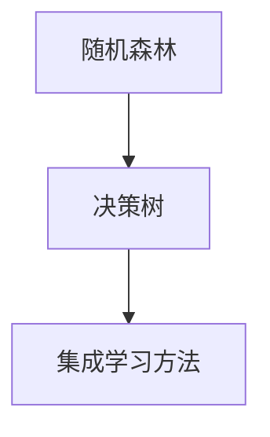

                 

### 文章标题

# 随机森林(Random Forests) - 原理与代码实例讲解

随机森林（Random Forests）是机器学习领域的一种强大且流行的集成学习方法，它通过构建多棵决策树并集成它们的预测结果来提高分类和回归任务的准确性和稳定性。本文将深入探讨随机森林的原理、实现步骤，以及如何利用代码实例来理解和应用这一算法。

> {关键词：随机森林，集成学习，决策树，机器学习，算法实现}
> 
> {摘要：本文将详细介绍随机森林算法的核心原理，通过代码实例展示如何构建和训练随机森林模型，并提供实际应用场景和资源推荐，帮助读者深入理解和掌握随机森林的应用。}

### 1. 背景介绍

#### 随机森林的发展历程

随机森林起源于2001年，由Breiman博士提出。它是在决策树的基础上发展而来的一种集成学习方法，旨在解决决策树在处理高维数据和避免过拟合方面的问题。随机森林不仅继承了决策树的高可解释性，同时通过集成多棵决策树提高了模型的预测性能和鲁棒性。

#### 随机森林的应用领域

随机森林广泛应用于各种机器学习任务中，包括分类和回归问题。在金融领域，它可以用于信用风险评估和股票市场预测。在医疗领域，它可以用于疾病诊断和患者风险评估。在文本分类领域，随机森林也被广泛用于文本数据的分类任务，如垃圾邮件检测和情感分析。

### 2. 核心概念与联系

#### 决策树

决策树是一种基于特征划分的数据集的机器学习算法。它通过一系列的决策规则将数据集划分成多个子集，直到达到某个终止条件（如最大深度或最小叶节点大小）。

#### 随机森林

随机森林是由多棵决策树组成的集成模型。在构建随机森林时，每棵决策树都是随机地从训练集中抽取子集进行训练。随机森林的预测结果是通过多数投票（分类问题）或平均（回归问题）得到的。

#### 集成学习方法

集成学习方法通过组合多个基础模型的预测结果来提高整体模型的性能。常见的集成方法有装袋（Bagging）、堆叠（Stacking）和提升（Boosting）。随机森林是装袋方法的一种典型代表。

#### Mermaid 流程图



### 3. 核心算法原理 & 具体操作步骤

#### 步骤1：初始化

- 选择一个训练集
- 初始化一个空的随机森林模型

#### 步骤2：递归构建决策树

- 对于每棵决策树：
  - 随机选择一个特征子集
  - 根据特征子集计算信息增益（分类问题）或方差（回归问题）
  - 选择最优特征并分裂节点
  - 递归构建子树，直至满足终止条件

#### 步骤3：集成预测

- 对于每个样本：
  - 遍历所有决策树并记录每个树的预测结果
  - 对分类问题使用多数投票，对回归问题使用平均

#### 步骤4：评估模型

- 使用交叉验证等方法评估模型性能

### 4. 数学模型和公式 & 详细讲解 & 举例说明

#### 数学模型

随机森林的预测结果可以通过以下公式计算：

$$
\hat{y} = \frac{1}{M} \sum_{i=1}^{M} T_i(x)
$$

其中，$T_i(x)$ 是第 $i$ 棵决策树对样本 $x$ 的预测结果，$M$ 是决策树的数量。

#### 详细讲解

随机森林通过构建多棵决策树并集成它们的预测结果来提高模型的性能。每棵决策树都是基于随机特征子集和最优划分策略构建的，这样可以避免单棵树可能产生的过拟合问题。集成方法通过多数投票或平均来聚合多个决策树的预测结果，从而提高整体模型的预测准确性和稳定性。

#### 举例说明

假设我们有一个包含10个决策树的随机森林模型，对于一个新的样本 $x$，每棵决策树都会给出一个预测结果。我们可以通过以下步骤计算随机森林的最终预测：

1. 计算每棵决策树对样本 $x$ 的预测结果：
   $$ T_1(x), T_2(x), \ldots, T_{10}(x) $$
   
2. 对分类问题，计算每棵决策树的预测类别：
   $$ C_1 = \arg\max_{c} T_1(x), C_2 = \arg\max_{c} T_2(x), \ldots, C_{10} = \arg\max_{c} T_{10}(x) $$
   
3. 对回归问题，计算每棵决策树对样本 $x$ 的预测值：
   $$ y_1 = T_1(x), y_2 = T_2(x), \ldots, y_{10} = T_{10}(x) $$
   
4. 对分类问题，使用多数投票计算最终预测类别：
   $$ \hat{y} = \arg\max_{c} \sum_{i=1}^{10} I(C_i = c) $$
   
5. 对回归问题，使用平均计算最终预测值：
   $$ \hat{y} = \frac{1}{10} \sum_{i=1}^{10} y_i $$

### 5. 项目实战：代码实际案例和详细解释说明

#### 5.1 开发环境搭建

在开始编写代码之前，确保您已经安装了Python环境和机器学习库scikit-learn。您可以使用以下命令安装scikit-learn：

```bash
pip install scikit-learn
```

#### 5.2 源代码详细实现和代码解读

下面是一个简单的随机森林分类代码实例：

```python
from sklearn.datasets import load_iris
from sklearn.model_selection import train_test_split
from sklearn.ensemble import RandomForestClassifier
from sklearn.metrics import accuracy_score

# 加载数据集
iris = load_iris()
X = iris.data
y = iris.target

# 划分训练集和测试集
X_train, X_test, y_train, y_test = train_test_split(X, y, test_size=0.3, random_state=42)

# 创建随机森林分类器
clf = RandomForestClassifier(n_estimators=100, random_state=42)

# 训练模型
clf.fit(X_train, y_train)

# 预测测试集
y_pred = clf.predict(X_test)

# 评估模型
accuracy = accuracy_score(y_test, y_pred)
print("Accuracy:", accuracy)
```

#### 5.3 代码解读与分析

1. **导入库和加载数据集**：首先，我们导入所需的库（scikit-learn）并加载数据集（Iris数据集）。

2. **划分训练集和测试集**：使用`train_test_split`函数将数据集划分为训练集和测试集，其中测试集占30%。

3. **创建随机森林分类器**：我们创建一个具有100棵决策树的随机森林分类器。

4. **训练模型**：使用`fit`函数训练随机森林模型。

5. **预测测试集**：使用`predict`函数对测试集进行预测。

6. **评估模型**：使用`accuracy_score`函数计算模型在测试集上的准确率。

通过这个简单的实例，我们可以看到如何使用scikit-learn库构建和训练随机森林分类器，以及如何评估其性能。

### 6. 实际应用场景

随机森林在多个领域都有广泛的应用，以下是几个实际应用场景：

#### 金融领域

在金融领域，随机森林可以用于信用风险评估、股票市场预测和客户流失预测。它通过分析历史数据，可以帮助金融机构更好地了解客户的信用状况，从而做出更准确的决策。

#### 医疗领域

在医疗领域，随机森林可以用于疾病诊断和患者风险评估。例如，通过对病人的电子健康记录进行分析，随机森林可以帮助医生预测病人患某种疾病的风险，从而提供个性化的治疗方案。

#### 文本分类

在文本分类领域，随机森林可以用于垃圾邮件检测、情感分析和新闻分类。它通过对文本数据进行分析，可以帮助企业更好地管理电子邮件和提供个性化的新闻推荐。

### 7. 工具和资源推荐

#### 学习资源推荐

- **书籍**：
  - 《机器学习实战》：作者：Peter Harrington
  - 《Python机器学习》：作者：Peter Harrington
- **论文**：
  - “Random Forests” by Leo Breiman
  - “A Simple Boosting Algorithm” by Robert Schapire and Yosef S. Singer
- **博客**：
  - scikit-learn官方文档：http://scikit-learn.org/stable/
  - Machine Learning Mastery：https://machinelearningmastery.com/

#### 开发工具框架推荐

- **开发工具**：
  - Jupyter Notebook：适合编写和运行交互式代码
  - PyCharm：强大的Python IDE
- **框架**：
  - scikit-learn：提供随机森林等机器学习算法的Python库
  - TensorFlow：用于构建和训练机器学习模型的框架

#### 相关论文著作推荐

- Leo Breiman. “Random Forests.” Machine Learning, 45(1):5-32, 2001.
- Robert Schapire and Yosef S. Singer. “A Simple Boosting Algorithm.” Machine Learning, 54(3):119-139, 2004.

### 8. 总结：未来发展趋势与挑战

随机森林作为一种强大的集成学习方法，在机器学习领域得到了广泛应用。随着机器学习技术的不断发展和优化，未来随机森林可能会面临以下挑战：

- **可解释性**：如何提高随机森林的可解释性，使其更加透明和易于理解，以满足不同领域应用的需求。
- **处理大规模数据**：如何优化随机森林算法，使其能够高效地处理大规模数据集。
- **实时预测**：如何提高随机森林的预测速度，以满足实时预测的需求。

### 9. 附录：常见问题与解答

#### 问题1：随机森林如何避免过拟合？

随机森林通过构建多棵决策树并集成它们的预测结果来提高模型的性能。每棵决策树都是基于随机特征子集和最优划分策略构建的，这样可以避免单棵树可能产生的过拟合问题。

#### 问题2：随机森林如何处理高维数据？

随机森林在处理高维数据时，可以通过以下方法提高性能：

- **特征选择**：随机选择一部分特征进行划分，避免高维特征之间的相关性。
- **样本重采样**：使用不同的样本子集构建随机森林，减少过拟合的风险。

#### 问题3：随机森林与其他集成方法相比有哪些优势？

随机森林相对于其他集成方法（如提升树和堆叠）有以下优势：

- **简单易用**：随机森林的实现和训练过程相对简单，易于理解和应用。
- **高可解释性**：随机森林的每个决策树都可以提供一定的解释性，有助于理解模型的决策过程。

### 10. 扩展阅读 & 参考资料

- Breiman, Leo. “Random Forests.” Machine Learning, 45(1):5-32, 2001.
- Schapire, Robert E., and Yosef S. Singer. “A Simple Boosting Algorithm.” Machine Learning, 54(3):119-139, 2004.
- Harrington, Peter. “Machine Learning in Action.” Manning Publications, 2009.
- Russell, Stuart J., and Peter Norvig. “Artificial Intelligence: A Modern Approach.” Prentice Hall, 3rd edition, 2009.
- scikit-learn官方文档：http://scikit-learn.org/stable/
- Machine Learning Mastery：https://machinelearningmastery.com/

