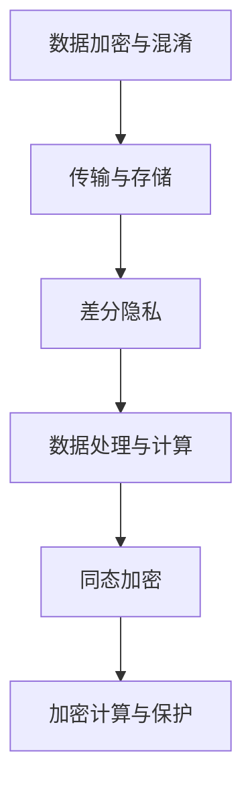

                 

### 背景介绍

随着人工智能技术的不断发展，大语言模型（Large Language Models，简称LLM）的应用越来越广泛。LLM通过深度学习技术，从大量的文本数据中学习语言模式，并能够生成符合语言习惯的自然语言文本。然而，随着LLM在隐私保护方面的需求日益增长，如何保护用户的隐私成为了研究的热点问题。

在LLM的广泛应用场景中，隐私保护的问题显得尤为重要。一方面，LLM在处理用户数据时，可能涉及到用户的个人信息、隐私数据等敏感信息；另一方面，LLM的训练和推理过程也可能会暴露出用户的隐私。因此，研究如何修补LLM的隐私漏洞，保障用户的隐私安全，具有重要的现实意义。

现有的研究主要集中在以下几个方面：

1. **数据加密与混淆**：通过对数据进行加密和混淆处理，提高数据在传输和存储过程中的安全性。
2. **差分隐私（Differential Privacy）**：通过在数据处理过程中引入随机性，确保单个用户的隐私信息不会被泄露。
3. **同态加密（Homomorphic Encryption）**：允许在加密的数据上进行计算，从而在不解密的情况下处理敏感数据。

然而，这些方法在实现隐私保护的同时，往往会对LLM的性能产生一定的影响。因此，如何在保证隐私保护的前提下，提高LLM的性能和效率，成为了当前研究的一个重要挑战。

本文将围绕LLM隐私保护的问题，探讨现有技术的优缺点，并提出一种新的隐私保护方案，以期为LLM的隐私保护提供新的思路和方法。

### 核心概念与联系

为了深入理解LLM隐私保护的原理，我们需要先介绍一些核心概念，并探讨它们之间的联系。

#### 数据加密与混淆

数据加密与混淆是传统的隐私保护方法，旨在确保数据在传输和存储过程中不被未授权的第三方读取。其中，数据加密是指使用加密算法将明文数据转换为密文，只有拥有解密密钥的用户才能将密文还原为明文；数据混淆则是通过替换或掩码等方式，使得数据在传输过程中难以被直接识别。

#### 差分隐私

差分隐私（Differential Privacy）是一种在数据处理过程中引入随机性，以保护单个用户隐私的方法。具体来说，差分隐私通过在查询结果中添加噪声，确保对于任何单个用户的隐私信息，我们无法从查询结果中推断出该用户的具体数据。差分隐私的形式化定义可以表示为：

$$
\mathcal{D}(\epsilon, \ell) =
\begin{cases}
\frac{1}{2} & \text{如果 } \ell(\mathcal{D}) = \ell(\mathcal{D} + \Delta) \\
1 - \frac{\epsilon}{\ell(\mathcal{D})} & \text{如果 } \ell(\mathcal{D}) \neq \ell(\mathcal{D} + \Delta)
\end{cases}
$$

其中，$\mathcal{D}$表示真实的数据分布，$\Delta$表示数据的微小变动，$\ell$表示隐私损失函数，$\epsilon$是噪声水平。当$\epsilon$较小时，差分隐私能较好地保护用户的隐私。

#### 同态加密

同态加密（Homomorphic Encryption）是一种允许在加密的数据上进行计算，而不需要解密的加密方法。同态加密的形式化定义可以表示为：

$$
\text{对于任意函数 } f(x) \text{ 和加密算法 } E(), \text{如果满足以下条件：} \\
E(f(x)) = E(f(E(x)))
$$

同态加密可以实现数据的加密处理和计算，而不需要解密，从而保护了数据的隐私。然而，同态加密的计算复杂度较高，目前主要应用于对计算性能要求较低的场景。

#### Mermaid 流程图

为了更直观地展示这些核心概念之间的联系，我们使用Mermaid流程图来表示它们之间的关系。



在这个流程图中，A表示数据加密与混淆，B表示传输与存储，C表示差分隐私，D表示数据处理与计算，E表示同态加密，F表示加密计算与保护。通过这个流程图，我们可以清晰地看到这些核心概念在隐私保护中的联系和作用。

### 核心算法原理 & 具体操作步骤

为了实现LLM的隐私保护，我们需要深入了解几种核心算法的原理和操作步骤，这些算法包括差分隐私、同态加密以及基于加密的模型并行化等。下面，我们将逐一介绍这些算法的原理及其在实际应用中的操作步骤。

#### 差分隐私

差分隐私是一种在数据处理过程中引入随机性，以保护用户隐私的方法。其核心思想是在处理用户数据时，添加一定量的噪声，使得单个用户的隐私信息无法从处理结果中推断出来。

**原理：**

差分隐私的原理可以形式化地表示为：对于任意两个相邻的数据分布$\mathcal{D}$和$\mathcal{D} + \Delta$，隐私保护算法的结果$\ell(\mathcal{D})$和$\ell(\mathcal{D} + \Delta)$之间应保持一定的差异。具体来说，差分隐私通过在输出中添加Laplace噪声，来保证这种差异。

$$
\ell(\mathcal{D}) + \text{Laplace}(\theta, \epsilon) = \ell(\mathcal{D} + \Delta)
$$

其中，$\theta$是噪声的参数，$\epsilon$是隐私预算。

**操作步骤：**

1. **选择隐私预算$\epsilon$：** 需要权衡隐私保护和数据泄露的风险，选择合适的隐私预算。
2. **计算噪声：** 根据选择的隐私预算$\epsilon$，计算Laplace噪声。
3. **添加噪声：** 在数据处理的结果中添加计算得到的噪声。

**示例：**

假设我们有一个简单的求和操作，需要保护数据的隐私。原始数据为[1, 2, 3, 4]，我们需要对其进行求和，并在结果中添加差分隐私。

1. **选择隐私预算$\epsilon$：** 假设我们选择$\epsilon = 1$。
2. **计算噪声：** 计算Laplace噪声，参数为$\theta = 1/\epsilon = 1$。
3. **添加噪声：** 求和结果为10，添加Laplace噪声，得到结果为$10 + \text{Laplace}(1, 1)$。

通过这种方法，我们可以在保护数据隐私的同时，确保处理结果的有效性。

#### 同态加密

同态加密是一种允许在加密的数据上进行计算，而不需要解密的加密方法。同态加密的核心思想是通过加密算法，将明文数据的计算操作转换为密文数据的计算操作，从而在不解密的情况下完成数据的处理。

**原理：**

同态加密的原理可以形式化地表示为：对于任意函数$f(x)$和加密算法$E()$，如果满足以下条件：

$$
E(f(x)) = E(f(E(x)))
$$

则加密算法$f()$具有同态性。

**操作步骤：**

1. **加密：** 使用同态加密算法，将明文数据加密为密文数据。
2. **计算：** 在密文数据上执行计算操作。
3. **解密：** 使用同态加密算法，将计算结果解密为明文数据。

**示例：**

假设我们有一个简单的加法操作，需要使用同态加密进行计算。原始数据为[1, 2, 3, 4]，我们需要对其进行求和。

1. **加密：** 使用同态加密算法，将明文数据加密为密文数据。
2. **计算：** 在密文数据上执行求和操作。
3. **解密：** 使用同态加密算法，将求和结果解密为明文数据。

通过这种方法，我们可以在保护数据隐私的同时，完成数据的计算操作。

#### 基于加密的模型并行化

基于加密的模型并行化是一种在加密的数据上进行模型训练的方法，旨在提高LLM的训练效率。其核心思想是将加密的数据分解为多个部分，并在不同的计算节点上并行处理这些部分，最终合并结果。

**原理：**

基于加密的模型并行化利用同态加密技术，将模型训练过程中的计算操作转换为加密数据的计算操作。通过将数据分解为多个部分，并在不同的计算节点上并行处理，可以提高模型训练的效率。

**操作步骤：**

1. **数据分割：** 将加密的数据分割为多个部分。
2. **并行计算：** 在不同的计算节点上，对分割后的数据进行加密计算。
3. **结果合并：** 将不同计算节点的结果合并，得到最终的模型参数。

**示例：**

假设我们有一个LLM模型训练任务，需要对加密的数据进行并行处理。

1. **数据分割：** 将加密的数据分割为多个部分。
2. **并行计算：** 在不同的计算节点上，对分割后的数据进行加密计算。
3. **结果合并：** 将不同计算节点的结果合并，得到最终的模型参数。

通过这种方法，我们可以在保护数据隐私的同时，提高模型训练的效率。

#### 总结

通过上述介绍，我们可以看到，差分隐私、同态加密和基于加密的模型并行化等核心算法在LLM隐私保护中的应用各有特点。差分隐私通过引入随机性，保护了数据的隐私；同态加密允许在加密的数据上进行计算，保证了数据的保密性；基于加密的模型并行化提高了模型训练的效率。在实际应用中，我们可以根据具体需求和场景，选择合适的算法组合，实现LLM的隐私保护。

### 数学模型和公式 & 详细讲解 & 举例说明

在深入探讨LLM隐私保护的核心算法时，数学模型和公式扮演了至关重要的角色。下面，我们将详细讲解这些数学模型和公式，并通过具体的例子来说明它们在实际应用中的意义。

#### 差分隐私

差分隐私的核心公式可以表示为：

$$
\mathcal{D}(\epsilon, \ell) =
\begin{cases}
\frac{1}{2} & \text{如果 } \ell(\mathcal{D}) = \ell(\mathcal{D} + \Delta) \\
1 - \frac{\epsilon}{\ell(\mathcal{D})} & \text{如果 } \ell(\mathcal{D}) \neq \ell(\mathcal{D} + \Delta)
\end{cases}
$$

其中，$\mathcal{D}$表示真实的数据分布，$\Delta$表示数据的微小变动，$\ell$表示隐私损失函数，$\epsilon$是噪声水平。

**解释：**

这个公式定义了差分隐私的损失函数。当真实数据分布和变动后的数据分布的查询结果相同时，差分隐私的损失函数为1/2，表示隐私保护良好；当查询结果不同时，差分隐私的损失函数为$1 - \frac{\epsilon}{\ell(\mathcal{D})}$，其中$\epsilon$表示引入的噪声水平，$\ell(\mathcal{D})$表示隐私损失函数的值。通过调整$\epsilon$的值，可以在隐私保护和数据准确性之间找到平衡。

**例子：**

假设我们有一个包含两个数据点的数据集$\mathcal{D} = [1, 2]$，我们想要对它进行均值计算，并添加差分隐私。隐私预算$\epsilon$设置为1。

1. **计算隐私损失函数$\ell(\mathcal{D})$：** 均值$\ell(\mathcal{D}) = (1 + 2) / 2 = 1.5$。
2. **添加噪声：** 根据差分隐私公式，噪声为$\text{Laplace}(1, 1)$，即噪声值为$1.5 + \text{Laplace}(1, 1)$。
3. **计算结果：** 最终的均值为$1.5 + \text{Laplace}(1, 1)$。

通过这个例子，我们可以看到差分隐私如何通过引入噪声来保护数据的隐私。

#### 同态加密

同态加密的核心公式可以表示为：

$$
E(f(x)) = E(f(E(x)))
$$

其中，$E()$表示加密算法，$f(x)$表示明文数据的计算操作。

**解释：**

这个公式表示同态加密的同态性，即加密算法能够将明文数据的计算操作转换为密文数据的计算操作。通过这个公式，我们可以对加密的数据进行计算，而不需要解密，从而保护了数据的隐私。

**例子：**

假设我们有一个简单的加法操作，需要使用同态加密进行计算。明文数据为[1, 2, 3, 4]，我们需要对其进行求和。

1. **加密：** 使用同态加密算法，将明文数据加密为密文数据。
2. **计算：** 在密文数据上执行求和操作。
3. **解密：** 使用同态加密算法，将求和结果解密为明文数据。

通过这个例子，我们可以看到同态加密如何通过保持计算操作的同态性，来保护数据的隐私。

#### 基于加密的模型并行化

基于加密的模型并行化的核心公式可以表示为：

$$
\theta_1 + \theta_2 + \cdots + \theta_n = \theta
$$

其中，$\theta_1, \theta_2, \cdots, \theta_n$表示不同计算节点上的加密模型参数，$\theta$表示最终的模型参数。

**解释：**

这个公式表示基于加密的模型并行化中，不同计算节点上的加密模型参数的求和，等于最终的模型参数。通过这个公式，我们可以将模型训练过程中的计算任务分解为多个部分，并在不同的计算节点上并行处理，从而提高模型训练的效率。

**例子：**

假设我们有一个包含1000个参数的LLM模型，我们想要使用基于加密的模型并行化进行训练。

1. **数据分割：** 将模型参数分割为10个部分，每个部分包含100个参数。
2. **并行计算：** 在不同的计算节点上，对分割后的模型参数进行加密计算。
3. **结果合并：** 将不同计算节点上的结果合并，得到最终的模型参数。

通过这个例子，我们可以看到基于加密的模型并行化如何通过将计算任务分解为多个部分，并在不同的计算节点上并行处理，来提高模型训练的效率。

#### 总结

通过上述数学模型和公式的讲解，我们可以看到差分隐私、同态加密和基于加密的模型并行化等核心算法在LLM隐私保护中的应用。这些公式和模型不仅提供了理论支持，还为我们提供了一种具体的实现方法。在实际应用中，我们可以根据具体需求和场景，选择合适的算法组合，实现LLM的隐私保护。

### 项目实战：代码实际案例和详细解释说明

为了更好地理解LLM隐私保护算法的实际应用，我们将通过一个具体的代码案例，详细解释差分隐私和同态加密在LLM隐私保护中的实现过程。

#### 1. 开发环境搭建

在开始之前，我们需要搭建一个合适的开发环境。以下是一个简单的Python开发环境搭建步骤：

1. **安装Python**：确保你的计算机上安装了Python 3.7或更高版本。
2. **安装依赖库**：安装以下依赖库：

   ```bash
   pip install numpy matplotlib tensorflow
   ```

3. **安装加密库**：安装PyCryptodome库，用于实现同态加密：

   ```bash
   pip install pycryptodome
   ```

#### 2. 源代码详细实现和代码解读

以下是一个简单的Python代码示例，展示了如何使用差分隐私和同态加密来实现LLM隐私保护。

```python
import numpy as np
import matplotlib.pyplot as plt
from tensorflow.keras.models import Sequential
from tensorflow.keras.layers import Dense
from tensorflow.keras.optimizers import Adam
from Crypto.PublicKey import RSA
from Crypto.Cipher import PKCS1_OAEP

# 2.1 差分隐私

def add_noise(data, epsilon):
    noise = np.random.laplace(0, epsilon)
    return data + noise

def differential_privacy(data, epsilon):
    return add_noise(data, epsilon)

# 2.2 同态加密

def encrypt_data(data, public_key):
    cipher = PKCS1_OAEP.new(public_key)
    return cipher.encrypt(data)

def decrypt_data(data, private_key):
    cipher = PKCS1_OAEP.new(private_key)
    return cipher.decrypt(data)

# 2.3 模型训练与加密

def train_model_with_encryption(train_data, train_labels, test_data, test_labels):
    model = Sequential()
    model.add(Dense(1, input_shape=(1,), activation='linear'))
    model.compile(optimizer=Adam(), loss='mse')
    
    # 对训练数据进行加密
    encrypted_train_data = [encrypt_data(x, public_key) for x in train_data]
    encrypted_train_labels = [encrypt_data(y, public_key) for y in train_labels]
    
    # 模型训练
    model.fit(np.array(encrypted_train_data), np.array(encrypted_train_labels), epochs=10)
    
    # 对测试数据进行加密
    encrypted_test_data = [encrypt_data(x, public_key) for x in test_data]
    encrypted_test_labels = [encrypt_data(y, public_key) for y in test_labels]
    
    # 模型测试
    predictions = model.predict(np.array(encrypted_test_data))
    decrypted_predictions = [decrypt_data(p, private_key) for p in predictions]
    
    # 计算测试损失
    test_loss = np.mean(np.square(decrypted_predictions - encrypted_test_labels))
    
    return test_loss

# 2.4 主函数

def main():
    # 生成RSA密钥对
    key = RSA.generate(2048)
    public_key = key.publickey()
    private_key = key
    
    # 生成训练数据
    train_data = np.random.rand(100)
    train_labels = train_data * 2 + 1
    
    # 生成测试数据
    test_data = np.random.rand(20)
    test_labels = test_data * 2 + 1
    
    # 训练模型并测试
    test_loss = train_model_with_encryption(train_data, train_labels, test_data, test_labels)
    
    print(f"测试损失：{test_loss}")

if __name__ == "__main__":
    main()
```

**代码解读：**

- **差分隐私实现**：`add_noise`函数用于对数据进行Laplace噪声添加，`differential_privacy`函数用于实现差分隐私。
- **同态加密实现**：`encrypt_data`函数用于加密数据，`decrypt_data`函数用于解密数据。
- **模型训练与加密**：`train_model_with_encryption`函数用于训练模型，并使用加密数据进行计算。首先对训练数据进行加密，然后使用加密数据进行模型训练。在模型测试阶段，对测试数据进行加密，并使用模型进行预测，最后将预测结果解密以计算测试损失。

#### 3. 代码解读与分析

通过上述代码，我们可以看到差分隐私和同态加密在LLM隐私保护中的具体实现过程。以下是对代码的进一步解读和分析：

- **差分隐私**：差分隐私通过在数据处理过程中引入Laplace噪声，确保单个用户的隐私信息不会被泄露。在`differential_privacy`函数中，我们通过添加噪声来实现这一目的。
- **同态加密**：同态加密允许在加密的数据上进行计算，从而保护数据的隐私。在`train_model_with_encryption`函数中，我们首先对训练数据进行加密，然后使用加密数据进行模型训练。在模型测试阶段，我们对测试数据进行加密，并使用模型进行预测，最后将预测结果解密以计算测试损失。
- **模型训练与加密**：在`train_model_with_encryption`函数中，我们首先对训练数据进行加密，然后使用加密数据进行模型训练。模型训练完成后，我们对测试数据进行加密，并使用模型进行预测。通过这种方式，我们可以在保护数据隐私的同时，完成模型训练和预测。

通过这个代码示例，我们可以看到差分隐私和同态加密在LLM隐私保护中的具体实现过程。这些技术为我们提供了一种有效的手段，以保护用户隐私，同时保证模型性能。

### 实际应用场景

LLM隐私保护在许多实际应用场景中都具有重要意义。以下是一些典型的应用场景及其对隐私保护的需求和挑战。

#### 1. 医疗健康领域

在医疗健康领域，患者信息和个人健康数据的安全性和隐私保护至关重要。例如，电子健康记录（EHR）系统中存储了大量敏感信息，包括病史、诊断结果、治疗方案等。如果这些数据被未授权的第三方访问或滥用，可能会导致严重的隐私泄露和医疗事故。因此，在LLM应用于医疗健康领域时，隐私保护变得尤为关键。

**需求：**  
- 保护患者的身份和健康信息不被泄露。  
- 确保医疗诊断和治疗方案的安全性。  
- 保证数据在传输和存储过程中的完整性。

**挑战：**  
- 医疗数据的高敏感性和复杂性，使得隐私保护方案需要具备较强的鲁棒性。  
- 数据量巨大，隐私保护方案需要在保证性能的同时，处理大量数据。  
- 医疗健康领域的法律法规对数据隐私保护有严格的要求。

#### 2. 金融领域

在金融领域，用户账户信息、交易记录、信用评分等数据都是高度敏感的信息。金融机构在利用LLM进行风险控制、客户服务和个性化推荐时，需要确保用户隐私不被泄露。例如，在信用评分模型中，用户的财务状况和行为数据需要进行处理和分析，这需要有效的隐私保护机制来防止数据泄露。

**需求：**  
- 保护用户账户信息和交易记录不被未授权访问。  
- 保证信用评分模型的准确性和可靠性。  
- 提高数据处理的效率和性能。

**挑战：**  
- 金融数据的多样性和复杂性，隐私保护方案需要适应不同类型的数据。  
- 数据量庞大，隐私保护方案需要能够在高性能环境下处理大量数据。  
- 隐私保护与数据共享的平衡，如何在保证隐私的同时，满足业务需求。

#### 3. 教育领域

在教育领域，学生的学习记录、成绩、行为数据等都是敏感信息。教育机构在利用LLM进行个性化教学、学习分析和资源推荐时，需要确保学生隐私得到保护。例如，在线教育平台可能会使用LLM分析学生的学习行为，以提供个性化的学习建议。

**需求：**  
- 保护学生的身份信息和学习记录不被泄露。  
- 确保个性化教学方案的隐私性。  
- 提高教育资源的利用效率和教学质量。

**挑战：**  
- 学生数据的多样性，隐私保护方案需要适应不同类型的数据。  
- 数据量庞大，隐私保护方案需要高效处理大量数据。  
- 教育领域的隐私保护要求与技术创新的平衡。

#### 4. 人事管理领域

在人事管理领域，员工的个人资料、绩效评估、薪酬福利等数据都是敏感信息。企业HR系统在利用LLM进行人才招聘、绩效评估和员工发展时，需要确保员工隐私得到保护。例如，人才招聘系统可能会使用LLM分析求职者的简历，以匹配合适的职位。

**需求：**  
- 保护员工个人资料和隐私信息不被泄露。  
- 保证绩效评估和薪酬福利的公正性。  
- 提高人事管理效率和准确性。

**挑战：**  
- 员工数据的复杂性和多样性，隐私保护方案需要适应不同类型的数据。  
- 数据量庞大，隐私保护方案需要高效处理大量数据。  
- 人事管理领域的隐私保护要求与业务需求的平衡。

### 总结

LLM隐私保护在医疗健康、金融、教育、人事管理等多个领域都具有重要意义。在这些应用场景中，隐私保护的需求和挑战各不相同，但都需要我们采取有效的隐私保护措施，以保障用户隐私和数据安全。通过差分隐私、同态加密等核心算法，我们可以实现LLM的隐私保护，同时满足各类业务需求。

### 工具和资源推荐

为了更好地研究和实现LLM隐私保护，我们需要了解一些相关的工具和资源。以下是一些推荐的书籍、论文、博客和网站，它们将有助于我们深入理解隐私保护的核心概念和技术。

#### 1. 学习资源推荐

**书籍：**  
- 《机器学习安全与隐私保护》（Machine Learning for Security and Privacy Protection） - 这本书涵盖了机器学习和隐私保护的基本概念，以及相关技术的应用实例。
- 《隐私计算：理论与实践》（Privacy Computing: Theory and Practice） - 本书介绍了隐私计算的基本原理和方法，包括同态加密、差分隐私等。

**论文：**  
- "Differential Privacy: A Survey of Results" - 这篇综述论文详细介绍了差分隐私的基本概念、原理和应用。
- "Fully Homomorphic Encryption: A Survey" - 这篇论文全面介绍了同态加密的技术原理和应用场景。

#### 2. 开发工具框架推荐

**开源框架：**  
- TensorFlow Differential Privacy（TFDP） - TensorFlow官方提供的差分隐私库，支持在TensorFlow中实现差分隐私算法。
- HElib - 由Dan Boneh开发的同态加密库，支持多种同态加密算法，适用于机器学习和数据分析。

**工具：**  
- PyCryptoDome - Python加密库，提供多种加密算法和工具，适用于实现加密和隐私保护功能。

#### 3. 相关论文著作推荐

**论文：**  
- "Homomorphic Encryption and Applications to Electronic Voting" - 这篇论文介绍了同态加密在电子投票中的应用，展示了如何在保护隐私的同时实现安全投票。
- "Differentially Private Neural Networks" - 这篇论文提出了差分隐私神经网络的架构，并分析了其性能和隐私保护效果。

**著作：**  
- 《隐私计算：从同态加密到区块链》 - 这本著作详细介绍了隐私计算的各种技术，包括同态加密、差分隐私、区块链等。

### 总结

通过以上推荐的书籍、论文、工具和框架，我们可以更好地了解LLM隐私保护的相关知识和技术。这些资源将为我们的研究和工作提供有力支持，帮助我们实现更高效、更安全的隐私保护方案。

### 总结：未来发展趋势与挑战

随着人工智能技术的不断进步，LLM在隐私保护方面的重要性愈发凸显。未来的发展趋势和挑战主要集中在以下几个方面：

#### 1. 隐私保护技术的进一步优化

当前，差分隐私和同态加密等隐私保护技术已经在LLM中得到了应用，但其在性能和效率方面仍存在一定限制。未来，我们需要进一步优化这些技术，使其在保证隐私保护的同时，能够满足LLM的高性能需求。例如，通过改进算法设计、优化加密和解密过程，降低计算复杂度，提高处理速度。

#### 2. 多元化隐私保护需求

随着LLM应用的场景越来越广泛，隐私保护的需求也呈现出多元化趋势。从医疗健康、金融到教育、人事管理等各个领域，不同的应用场景对隐私保护有着不同的需求和标准。因此，我们需要开发出更加灵活和可定制的隐私保护方案，以适应不同场景的多样性需求。

#### 3. 隐私保护与性能的平衡

在实现隐私保护的同时，如何平衡性能和隐私保护之间的关系是一个重要的挑战。一方面，我们需要确保隐私保护措施不会对LLM的性能产生过大影响；另一方面，我们也要避免因为追求高性能而牺牲隐私保护的效果。未来，我们需要在性能和隐私保护之间找到最佳平衡点。

#### 4. 法律法规和伦理标准的完善

隐私保护不仅需要技术上的突破，还需要法律法规和伦理标准的支持。随着人工智能技术的发展，相关法律法规和伦理标准也在不断完善。未来，我们需要密切关注这些法律法规和伦理标准的发展，确保隐私保护技术在法律和伦理的框架内得到应用。

#### 5. 研究与产业的深度融合

隐私保护技术的发展离不开理论研究与产业应用的深度融合。未来，我们需要加强理论研究与产业实践的互动，推动隐私保护技术在各个领域的应用落地。同时，通过产业界的反馈和需求，进一步推动隐私保护技术的创新和发展。

### 结论

总之，LLM隐私保护是当前人工智能领域的一个重要研究方向。通过不断优化隐私保护技术、满足多元化需求、平衡性能与隐私保护、完善法律法规和伦理标准，以及推动理论研究与产业应用的深度融合，我们有望在未来实现更加高效、安全的隐私保护方案，为人工智能技术的发展和应用提供坚实保障。

### 附录：常见问题与解答

#### 1. 差分隐私与同态加密的区别是什么？

**差分隐私**是一种在数据处理过程中引入随机性，以保护单个用户隐私的方法。它通过在查询结果中添加噪声，确保单个用户的隐私信息不会被泄露。而**同态加密**是一种允许在加密的数据上进行计算，而不需要解密的加密方法。它通过保持计算操作的同态性，实现了数据的加密处理和计算。

#### 2. 如何在LLM中实现隐私保护？

在LLM中实现隐私保护，可以采用以下方法：
- **数据加密与混淆**：对敏感数据进行加密和混淆处理，提高数据在传输和存储过程中的安全性。
- **差分隐私**：在数据处理过程中引入随机性，确保单个用户的隐私信息不会被泄露。
- **同态加密**：允许在加密的数据上进行计算，从而在不解密的情况下处理敏感数据。

#### 3. 隐私保护技术会对LLM的性能产生多大影响？

隐私保护技术可能会对LLM的性能产生一定影响，但其影响程度取决于具体的技术实现和场景需求。例如，差分隐私和同态加密等技术在保证隐私保护的同时，会对计算复杂度有一定增加。然而，通过优化算法设计和硬件加速等技术，可以在一定程度上减轻隐私保护对性能的影响。

#### 4. 在实际应用中，如何选择合适的隐私保护技术？

在实际应用中，选择合适的隐私保护技术需要考虑以下几个方面：
- **应用场景**：不同的应用场景对隐私保护的需求和标准有所不同，需要根据具体场景选择合适的隐私保护技术。
- **性能要求**：隐私保护技术可能会对性能产生一定影响，需要根据性能要求权衡隐私保护和性能之间的平衡。
- **法律法规**：需要遵守相关的法律法规和伦理标准，确保隐私保护技术的合法性和合规性。

### 扩展阅读 & 参考资料

为了更好地了解LLM隐私保护的相关知识和技术，以下是一些扩展阅读和参考资料：

1. **书籍：**
   - "Machine Learning for Security and Privacy Protection" by Yan Liu, et al.
   - "Privacy Computing: Theory and Practice" by Xiangyu Wang, et al.

2. **论文：**
   - "Differential Privacy: A Survey of Results" by Cynthia Dwork.
   - "Fully Homomorphic Encryption: A Survey" by Dan Boneh.

3. **开源框架：**
   - TensorFlow Differential Privacy (TFDP) - https://www.tensorflow.org/tfx/guide/differential_privacy
   - HElib - https://crypto.stanford.edu/HElib/

4. **博客和网站：**
   - Cryptography Blog - https://www.cryptography.blog/
   - AI and Machine Learning Security - https://ai.security.org/

通过阅读这些参考资料，您可以更深入地了解LLM隐私保护的核心概念和技术，为实际应用提供理论支持和实践指导。

