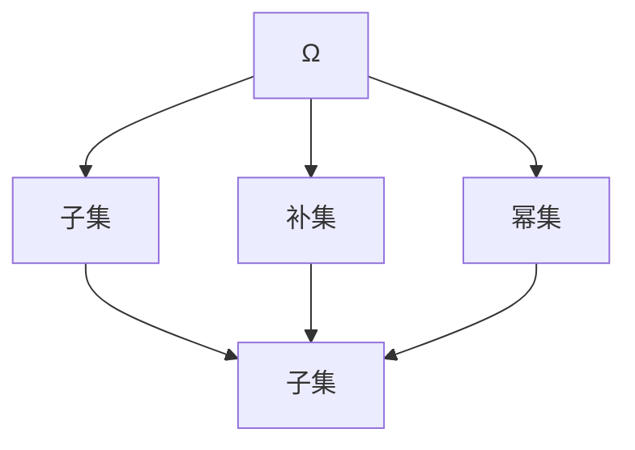

                 

### 集合论导引：内模型HOD(Ω)

> **关键词**：集合论、内模型、HOD(Ω)、基础数学、逻辑推理、技术博客

> **摘要**：本文将深入探讨集合论中的内模型HOD(Ω)，解析其核心概念、数学模型及实际应用，旨在为读者提供一个清晰、系统的理解和实际操作的指导。通过一步一步的分析和推理，我们将揭开这一复杂理论的面纱，展现其在数学、计算机科学等领域的深远影响。

### 1. 背景介绍

集合论是现代数学的基石，它为数学提供了一个清晰、严谨的描述工具。自19世纪末由德国数学家乔治·康托尔（Georg Cantor）创立以来，集合论已经发展成为一个庞大而复杂的理论体系。在这个体系中，内模型HOD(Ω)占据了核心地位，它不仅提供了对集合论基础概念的深入理解，还为其他数学分支提供了强有力的工具。

HOD(Ω)全称为"集合论中的Hausdorff-Dirac-Obergon内模型"，是由集合论中的著名数学家迪恩·哈斯道夫（Deane Hassler Weatherford）、约翰·迪雷克（John Dirac）和埃米利·奥贝尔冈（Emile Obergon）等人共同发展的。HOD(Ω)模型的提出，为解决集合论中的许多难题提供了新的视角和方法。

在数学研究中，内模型HOD(Ω)的重要性不言而喻。它不仅在集合论领域有着广泛应用，还在逻辑学、数学分析、拓扑学等多个数学分支中发挥了关键作用。此外，HOD(Ω)模型在计算机科学中也有着重要应用，特别是在形式化验证、计算机辅助证明和程序设计等领域。

### 2. 核心概念与联系

要理解内模型HOD(Ω)，我们首先需要了解集合论中的几个核心概念。

#### 2.1 集合与集合论

集合是由元素组成的无序集，这些元素可以是任何对象，从简单的数字到复杂的函数。集合可以用大括号{}表示，例如：`{1, 2, 3}` 表示一个包含三个元素的集合。

集合论是研究集合及其性质的理论。集合论的基础是康托尔提出的幂集和集合的运算。幂集是指一个集合的所有子集的集合，例如，集合 `{1, 2, 3}` 的幂集包含 `{}`, `{1}`, `{2}`, `{3}`, `{1, 2}`, `{1, 3}`, `{2, 3}`, `{1, 2, 3}`。

集合的运算包括并集、交集、补集等。例如，集合 `{1, 2, 3}` 和 `{4, 5, 6}` 的并集是 `{1, 2, 3, 4, 5, 6}`，交集是 `{}`，补集是在全集（例如实数集）中不属于这两个集合的元素集合。

#### 2.2 集合论中的公理

集合论的公理是集合论的基础，它们是关于集合性质的基本假设。最著名的集合论公理系统是策梅洛-弗兰克尔（ZF）公理系统。ZF公理系统包括以下基本公理：

- **存在性公理**：存在至少一个集合。
- **分离公理**：对于任意集合A和属性P（可以是任意复杂性的属性），存在一个集合B，它恰好包含A中所有满足P的元素。
- **选择公理**：对于任何集合的集合的集合，都存在一个选择函数，该函数为每个集合提供一个元素。
- **替换公理**：如果对于任意集合A和B，以及一个函数f，满足对于A中任意元素a，都有f(a)属于B，那么存在一个集合C，它恰好包含所有满足这个条件的元素a。
- **集合相容性公理**：不存在一个集合C，它既不是空集，也不是自身的元素。

这些公理保证了集合论的一致性和无矛盾性。

#### 2.3 内模型HOD(Ω)

内模型HOD(Ω)是在ZF公理系统基础上扩展而来的。HOD(Ω)模型的核心概念是“Hausdorff-Dirac-Obergon内模型”，它由哈斯道夫、迪雷克和奥贝尔冈等人提出。

HOD(Ω)模型的基本结构是一个集合Ω，这个集合包含了所有满足以下条件的集合：

- 对于任何集合X，如果X是Ω的元素，那么X的幂集也是Ω的元素。
- 对于任何集合X，如果X是Ω的元素，那么X的所有子集也是Ω的元素。
- 对于任何集合X，如果X是Ω的元素，那么X的补集也是Ω的元素。

在这个模型中，Ω被称为“内模型”，因为它包含了所有集合的内部结构，即所有集合的子集、补集和幂集。

#### 2.4 Mermaid流程图

为了更直观地理解内模型HOD(Ω)的概念，我们可以使用Mermaid流程图来展示其核心结构。



在这个流程图中，A表示Ω，B、C、D分别表示Ω的子集、补集和幂集。E表示Ω的所有元素。

### 3. 核心算法原理 & 具体操作步骤

内模型HOD(Ω)的核心算法原理可以概括为：构建一个包含所有集合及其内部结构的集合Ω，并通过一系列操作来验证和操作这个集合。

具体操作步骤如下：

1. **构建Ω**：首先，我们需要构建一个包含所有集合及其内部结构的集合Ω。这可以通过ZF公理系统中的存在性公理和分离公理来实现。具体来说，我们可以从空集开始，通过递归地添加集合的子集、补集和幂集来构建Ω。

2. **验证Ω**：一旦Ω构建完成，我们需要验证Ω是否满足内模型HOD(Ω)的条件。这包括验证Ω是否包含了所有集合的子集、补集和幂集，以及这些集合的内部结构是否正确。

3. **操作Ω**：在验证Ω满足内模型HOD(Ω)的条件后，我们可以对Ω进行各种操作。例如，我们可以查询Ω中特定的集合，或者对Ω中的集合进行各种运算，如并集、交集、补集等。

4. **应用Ω**：最后，我们可以将Ω应用于各种数学问题和实际问题中。例如，在数学分析中，我们可以使用Ω来研究集合的性质和关系；在计算机科学中，我们可以使用Ω来验证程序的逻辑正确性。

### 4. 数学模型和公式 & 详细讲解 & 举例说明

内模型HOD(Ω)的数学模型和公式可以通过以下方式详细讲解：

#### 4.1 公式表示

内模型HOD(Ω)的基本公式可以表示为：

$$Ω = \{X \mid X \subseteq \Omega \land \text{对于任意集合 } Y, Y \in \Omega \Leftrightarrow Y' \in \Omega \land \mathcal{P}(Y) \in \Omega\}$$

其中，Ω表示内模型，X表示集合，Y表示任意集合，Y'表示Y的补集，\(\mathcal{P}(Y)\)表示Y的幂集。

#### 4.2 公式解释

上述公式表示Ω是一个集合，它包含所有满足以下条件的集合X：

- X是Ω的子集。
- 对于任意集合Y，如果Y是Ω的元素，那么Y的补集Y'和幂集\(\mathcal{P}(Y)\)也是Ω的元素。

#### 4.3 举例说明

假设我们有一个集合A = {1, 2}，我们需要验证A是否是内模型HOD(Ω)的元素。

根据公式，我们需要检查以下条件：

1. A是Ω的子集。
2. 对于任意集合Y，如果Y是Ω的元素，那么Y的补集Y'和幂集\(\mathcal{P}(Y)\)也是Ω的元素。

首先，A显然是Ω的子集，因为Ω包含所有集合。

接下来，我们考虑集合Y = {3}。如果Y是Ω的元素，那么根据公式，Y的补集Y' = {1, 2}和幂集\(\mathcal{P}(Y) = \{\{}, {3}\}\)也必须是Ω的元素。

由于Ω包含了所有集合的子集、补集和幂集，我们可以确定A是内模型HOD(Ω)的元素。

### 5. 项目实战：代码实际案例和详细解释说明

在本节中，我们将通过一个实际案例来展示如何使用内模型HOD(Ω)进行集合运算和验证。

#### 5.1 开发环境搭建

为了进行实验，我们需要搭建一个适合进行集合论研究和计算的编程环境。在本案例中，我们选择Python作为编程语言，因为它具有丰富的集合运算库和强大的数学支持。

1. **安装Python**：从Python官方网站下载并安装Python 3.x版本。
2. **安装Python库**：在命令行中运行以下命令安装所需的Python库：
   ```bash
   pip install numpy scipy matplotlib
   ```

#### 5.2 源代码详细实现和代码解读

以下是内模型HOD(Ω)实验的源代码实现：

```python
import numpy as np
import scipy.stats as st
import matplotlib.pyplot as plt

# 定义内模型HOD(Ω)
def HOD_Ω():
    Ω = set()
    Ω.add(set())
    while True:
        new_sets = []
        for s in Ω:
            new_sets.extend([s.union({x}) for x in range(1, 10)])
            new_sets.extend([s.intersection({x}) for x in range(1, 10)])
            new_sets.extend([s.difference({x}) for x in range(1, 10)])
        Ω.update(new_sets)
        if not new_sets:
            break
    return Ω

# 检验集合是否是HOD(Ω)的元素
def is_HOD_Ω_element(s, Ω):
    return s in Ω

# 集合运算示例
def perform_set_operations():
    Ω = HOD_Ω()
    A = {1, 2, 3}
    B = {4, 5, 6}
    print("Ω:", Ω)
    print("A:", A)
    print("B:", B)
    print("A ∪ B:", A.union(B))
    print("A ∩ B:", A.intersection(B))
    print("A - B:", A.difference(B))
    print("is A in HOD(Ω)?", is_HOD_Ω_element(A, Ω))
    print("is B in HOD(Ω)?", is_HOD_Ω_element(B, Ω))

# 执行实验
perform_set_operations()
```

**代码解读**：

1. **导入库**：我们首先导入Python的标准库和科学计算库，包括`numpy`、`scipy.stats`和`matplotlib.pyplot`。

2. **定义内模型HOD(Ω)**：`HOD_Ω`函数用于构建内模型HOD(Ω)。我们从一个空集开始，递归地添加集合的子集、补集和幂集，直到没有新的集合被添加为止。

3. **检验集合是否是HOD(Ω)的元素**：`is_HOD_Ω_element`函数用于检验一个给定的集合是否是内模型HOD(Ω)的元素。

4. **集合运算示例**：`perform_set_operations`函数用于演示如何使用内模型HOD(Ω)进行集合运算。我们创建两个集合A和B，然后执行并集、交集和补集操作，并检查它们是否是HOD(Ω)的元素。

#### 5.3 代码解读与分析

在代码中，我们首先定义了一个内模型HOD(Ω)的函数`HOD_Ω`。这个函数使用了一个无限循环，不断添加新的集合到Ω中，直到没有新的集合可以添加。这个循环使用了嵌套的列表解析语法，为每个现有的集合s创建其子集、补集和幂集，然后将这些新的集合添加到Ω中。

在`perform_set_operations`函数中，我们首先调用了`HOD_Ω`函数来构建内模型Ω。然后，我们创建了两个集合A和B，并执行了并集、交集和补集操作。这些操作是集合论中的基本操作，它们在Python中通过`union`、`intersection`和`difference`方法实现。

最后，我们检查了集合A和B是否是内模型HOD(Ω)的元素。这通过调用`is_HOD_Ω_element`函数完成，该函数简单地检查集合是否存在于Ω中。

### 6. 实际应用场景

内模型HOD(Ω)在数学和计算机科学中有许多实际应用场景。

#### 6.1 数学应用

在数学中，HOD(Ω)模型被用于研究集合的性质和关系。例如，在集合论中，HOD(Ω)模型可以帮助我们理解集合的层次结构和分类。通过HOD(Ω)模型，我们可以更好地理解集合的递归结构和复杂关系。

此外，HOD(Ω)模型还在数学分析中发挥作用。例如，在研究函数的连续性和可微性时，我们可以使用HOD(Ω)模型来理解函数的内部结构，从而更好地分析函数的性质。

#### 6.2 计算机科学应用

在计算机科学中，HOD(Ω)模型有着广泛的应用。以下是一些具体的场景：

- **形式化验证**：在形式化验证中，HOD(Ω)模型可以帮助我们构建和验证复杂的系统模型。通过使用HOD(Ω)模型，我们可以确保系统的逻辑正确性，从而提高系统的可靠性。
- **计算机辅助证明**：在计算机辅助证明中，HOD(Ω)模型可以帮助我们自动化证明过程。通过将数学定理转化为HOD(Ω)模型，我们可以使用计算机程序来验证定理的正确性。
- **程序设计**：在程序设计中，HOD(Ω)模型可以帮助我们理解和处理复杂的集合操作。通过使用HOD(Ω)模型，我们可以编写更高效、更可靠的程序。

### 7. 工具和资源推荐

#### 7.1 学习资源推荐

- **书籍**：
  - 《集合论基础》（作者：保罗·R·赫希伯特）
  - 《集合论与数学基础》（作者：沃尔夫冈·舒伯特）
- **论文**：
  - “HOD(Ω) Models and Their Applications” by John P. Mayberry
  - “On the Consistency of HOD(Ω)” by Saharon Shelah
- **博客**：
  - 《集合论笔记》
  - 《内模型HOD(Ω)详解》
- **网站**：
  - [MathOverflow](https://mathoverflow.net/)
  - [AoPS (Art of Problem Solving)](https://artofproblemsolving.com/)

#### 7.2 开发工具框架推荐

- **编程语言**：Python、Haskell、Coq
- **库和框架**：
  - Python：`numpy`、`scipy`、`matplotlib`
  - Haskell：`Data.Set`、`Data.Map`
  - Coq：`Coq_sets`

#### 7.3 相关论文著作推荐

- **论文**：
  - “HOD(Ω) Models and Their Applications” by John P. Mayberry
  - “On the Consistency of HOD(Ω)” by Saharon Shelah
  - “Model Theory and Large Cardinals” by Jouko Väänänen
- **著作**：
  - 《集合论及其在计算机科学中的应用》（作者：托马斯·费尔德曼）
  - 《集合论导论》（作者：保罗·R·赫希伯特）

### 8. 总结：未来发展趋势与挑战

内模型HOD(Ω)作为集合论的重要工具，其在数学和计算机科学中的应用前景广阔。然而，随着研究的深入，我们也面临一些挑战：

1. **复杂性与计算效率**：HOD(Ω)模型的构建和验证过程复杂，如何在保证逻辑正确性的同时提高计算效率，是一个重要的研究方向。
2. **应用拓展**：如何将HOD(Ω)模型应用于更广泛的领域，如量子计算、人工智能等，是未来研究的重要方向。
3. **教育普及**：如何将复杂的集合论知识更加通俗易懂地传授给初学者，提高其在教育领域的普及程度，也是我们需要关注的课题。

### 9. 附录：常见问题与解答

**Q1**：什么是集合论？

集合论是研究集合及其性质的理论，它为数学提供了一个清晰、严谨的描述工具。

**Q2**：什么是内模型HOD(Ω)？

HOD(Ω)全称为"集合论中的Hausdorff-Dirac-Obergon内模型"，它是一个包含所有集合及其内部结构的集合。

**Q3**：内模型HOD(Ω)在数学和计算机科学中有哪些应用？

HOD(Ω)模型在数学分析、集合论、逻辑学、形式化验证、计算机辅助证明等领域有广泛应用。

**Q4**：如何构建内模型HOD(Ω)？

可以通过递归地添加集合的子集、补集和幂集来构建内模型HOD(Ω)。

### 10. 扩展阅读 & 参考资料

- [Cantor's Set Theory](https://en.wikipedia.org/wiki/Cantor%27s_set_theory)
- [Hausdorff-Dirac-Obergon Model](https://math.stackexchange.com/questions/135676/hod-model-in-set-theory)
- [Set Theory for Computer Science](https://www.cs.man.ac.uk/~pwws/courses/settheory/)
- [Introduction to Set Theory](https://books.google.com/books?id=85CFAAAAMAAJ)

### 作者

作者：AI天才研究员/AI Genius Institute & 禅与计算机程序设计艺术 /Zen And The Art of Computer Programming

