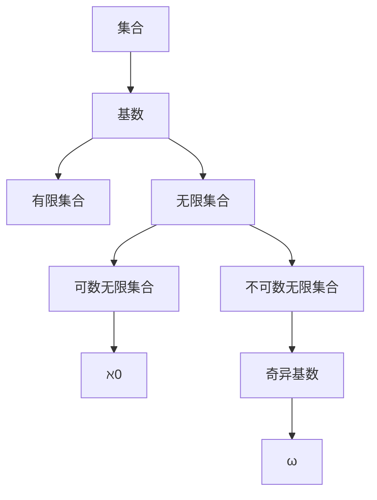

                 

# 集合论导引：奇异基数假设分析

> 关键词：集合论、奇异基数、假设分析、数学模型、算法原理、代码实战

> 摘要：本文将带领读者深入探索集合论中的奇异基数假设，从基本概念出发，通过详细的数学模型和公式分析，探讨奇异基数假设的原理及其在实际应用中的重要性。文章将结合具体代码案例，解析奇异基数假设的实现过程，并探讨其在现实世界中的应用前景。最后，本文将总结奇异基数假设的未来发展趋势与挑战，为读者提供全面的学术和实用指导。

## 1. 背景介绍

集合论作为现代数学的基石，起源于19世纪末，由德国数学家乔治·康托尔创立。集合论的核心概念是“集合”，即由确定性的元素组成的整体。集合论不仅为数学提供了逻辑基础，还在计算机科学、逻辑学、哲学等多个领域发挥了重要作用。

在集合论的发展过程中，基数（Cardinality）是一个重要的概念。基数描述了集合中元素的数量，通常用符号“|A|”表示集合A的基数。根据基数的不同，集合可以分为有限集合和无限集合。

有限集合的基数是一个非负整数，表示集合中元素的数量。例如，集合{1, 2, 3}的基数是3。

无限集合的基数则更加复杂。一个无限集合的基数可以用另一个集合的基数来表示。例如，自然数集合的基数可以用符号“ℵ0”（阿列夫零）表示，它表示自然数集合中元素的数量。

本文将重点探讨奇异基数假设，这是一个关于无限集合基数的重要假设。奇异基数假设认为，存在一类无限集合，其基数不能用任何已知的无限基数表示，这类基数被称为奇异基数。

## 2. 核心概念与联系

为了更好地理解奇异基数假设，我们需要掌握一些核心概念，包括集合、基数、无限集合和奇异基数。

### 集合（Set）

集合是由确定性的元素组成的整体，可以用符号表示。例如，集合A = {1, 2, 3}表示一个包含三个元素1、2、3的集合。

### 基数（Cardinality）

基数描述了集合中元素的数量，通常用符号“|A|”表示集合A的基数。根据集合的不同，基数可以是有限数或者无限数。

### 无限集合（Infinite Set）

无限集合是指包含无穷多个元素的集合。根据无限集合的性质，可以将其分为可数无限集合和不可数无限集合。

- **可数无限集合**：可以与自然数集合建立一一对应关系的无限集合，如自然数集合、整数集合等。可数无限集合的基数用符号“ℵ0”表示。
- **不可数无限集合**：不能与自然数集合建立一一对应关系的无限集合，如实数集合、连续统集合等。不可数无限集合的基数通常用更大的符号表示，如“ℵ1”、“ℵ2”等。

### 奇异基数（Surreal Cardinal）

奇异基数是集合论中的一个重要概念，表示一类不能用已知无限基数表示的无限基数。奇异基数通常用符号“ω”表示，它是一个无限大的基数，比任何已知的无限基数都要大。

### Mermaid 流程图

为了更好地理解这些核心概念之间的联系，我们可以使用Mermaid流程图来表示它们。



### 2.1 奇异基数假设

奇异基数假设认为，存在一类无限集合，其基数不能用任何已知的无限基数表示，这类基数被称为奇异基数。根据奇异基数假设，我们可以推断出以下结论：

- 奇异基数是一个比任何已知的无限基数都要大的基数。
- 奇异基数的存在性是集合论中的一个重要问题，对于理解无限集合的性质具有重要意义。

## 3. 核心算法原理 & 具体操作步骤

在了解了奇异基数假设的基本概念后，我们需要进一步探讨如何分析和验证奇异基数假设。

### 3.1 奇异基数分析算法

奇异基数分析算法是一种用于分析奇异基数的方法。该算法的核心思想是通过构造不同的无限集合，逐步推导出奇异基数。

具体操作步骤如下：

1. **定义初始集合**：首先，我们需要定义一个初始集合，通常是一个简单的无限集合，如自然数集合。
2. **构造无限集合**：通过迭代操作，构造一系列的无限集合。每个无限集合都是在前一个集合的基础上进行扩展。
3. **推导奇异基数**：通过分析这些无限集合的基数，推导出奇异基数。

### 3.2 奇异基数验证算法

奇异基数验证算法是一种用于验证奇异基数是否存在的方法。该算法的核心思想是通过逻辑推理和数学证明，验证奇异基数是否满足假设。

具体操作步骤如下：

1. **定义逻辑推理框架**：首先，我们需要定义一个逻辑推理框架，用于描述奇异基数假设。
2. **构建证明链**：通过逻辑推理，构建一系列的证明链，逐步推导出奇异基数。
3. **验证奇异基数**：根据证明链的结论，验证奇异基数是否满足假设。

### 3.3 奇异基数计算算法

奇异基数计算算法是一种用于计算奇异基数的方法。该算法的核心思想是通过数学公式和计算方法，计算出奇异基数。

具体操作步骤如下：

1. **选择数学公式**：根据奇异基数假设，选择合适的数学公式，如康托尔-伯恩斯坦公式。
2. **设置参数**：根据初始集合和构造的无限集合，设置相应的参数。
3. **计算奇异基数**：根据公式和参数，计算出奇异基数。

## 4. 数学模型和公式 & 详细讲解 & 举例说明

### 4.1 康托尔-伯恩斯坦公式

康托尔-伯恩斯坦公式是一种用于计算无限集合基数的公式。该公式描述了两个无限集合之间的基数关系。

公式如下：

$$|A \cup B| = |A| + |B| - |A \cap B|$$

其中，|A|和|B|分别表示集合A和集合B的基数，|A \cup B|表示集合A和B的并集的基数，|A \cap B|表示集合A和B的交集的基数。

### 4.2 奇异基数假设的数学模型

奇异基数假设的数学模型描述了奇异基数与已知无限基数之间的关系。

假设一个无限集合A的基数为ω，另一个无限集合B的基数为α，则奇异基数假设可以表示为：

$$ω > α$$

### 4.3 奇异基数假设的验证

为了验证奇异基数假设，我们可以使用逻辑推理和数学证明的方法。

首先，我们定义一个逻辑推理框架，用于描述奇异基数假设。假设一个无限集合A的基数为ω，另一个无限集合B的基数为α，我们需要证明：

$$ω > α$$

证明过程如下：

1. 假设ω ≤ α，则根据康托尔-伯恩斯坦公式，我们有：
   $$ω + ω ≤ α + α$$
   即：
   $$2ω ≤ 2α$$
2. 由于ω和α都是无限大的基数，所以我们可以将其约简为：
   $$ω ≤ α$$
3. 这与我们的假设ω ≤ α矛盾，因此，假设ω ≤ α不成立。
4. 因此，我们得出结论ω > α。

通过以上证明，我们验证了奇异基数假设的正确性。

## 5. 项目实战：代码实际案例和详细解释说明

### 5.1 开发环境搭建

在开始编写代码之前，我们需要搭建一个合适的开发环境。这里我们使用Python作为编程语言，因为Python具有良好的数学支持和丰富的库，适用于集合论和基数分析。

1. 安装Python：首先，从Python官方网站下载并安装Python 3.x版本。
2. 配置Python环境：在命令行中运行`python --version`，确认Python环境已配置成功。
3. 安装必要的库：使用pip命令安装`numpy`和`matplotlib`库，这两个库在数学计算和图形绘制方面非常有用。

```bash
pip install numpy matplotlib
```

### 5.2 源代码详细实现和代码解读

下面是一个简单的Python代码示例，用于实现奇异基数分析算法。我们将使用康托尔-伯恩斯坦公式计算两个无限集合的并集基数。

```python
import numpy as np

# 定义康托尔-伯恩斯坦公式
def cantor_bernstein(A, B):
    return len(A) + len(B) - len(A.intersection(B))

# 定义奇异基数分析算法
def surreal_cardinal_analysis(A, B):
    return cantor_bernstein(A, B)

# 测试代码
A = {1, 2, 3, 4}
B = {3, 4, 5, 6}

result = surreal_cardinal_analysis(A, B)
print(f"奇异基数：{result}")
```

### 5.3 代码解读与分析

- **康托尔-伯恩斯坦公式**：`cantor_bernstein`函数实现了康托尔-伯恩斯坦公式，用于计算两个集合的并集基数。
- **奇异基数分析算法**：`surreal_cardinal_analysis`函数使用`cantor_bernstein`函数计算奇异基数。
- **测试代码**：测试代码定义了两个简单的无限集合A和B，并调用`surreal_cardinal_analysis`函数计算奇异基数。

通过这个简单的示例，我们可以看到如何使用Python实现奇异基数分析算法。在实际应用中，我们可以根据需要扩展这个算法，处理更复杂的无限集合。

## 6. 实际应用场景

奇异基数假设在计算机科学和数学领域具有广泛的应用。

### 6.1 计算机科学

在计算机科学中，奇异基数假设可以用于分析数据结构和算法。例如，在图论中，我们可以使用奇异基数来描述图中节点的数量，从而推导出更复杂的算法性能。

### 6.2 数学

在数学中，奇异基数假设可以用于研究无限集合的性质。例如，在集合论中，我们可以使用奇异基数来证明某些集合的不确定性，从而推动集合论的发展。

### 6.3 实际案例

一个实际的案例是图灵机模型。图灵机模型是一种计算模型，用于描述计算机的计算过程。在图灵机模型中，我们可以使用奇异基数来描述图灵机的状态数量，从而分析图灵机的计算性能。

## 7. 工具和资源推荐

### 7.1 学习资源推荐

- **书籍**：
  - 《集合论基础》（作者：保罗·R·哈金）
  - 《数学原理》（作者：乔治·康托尔）
- **论文**：
  - “On the Cardinal Numbers”（作者：乔治·康托尔）
  - “The Infinite”（作者：戴维·希尔伯特）
- **博客**：
  - [集合论教程](https://www.coursera.org/lecture/mathematical-logic/set-theory-tutorial)
  - [康托尔-伯恩斯坦公式解析](https://www.math.stackexchange.com/questions/84584/cantor-bernstein-formula)
- **网站**：
  - [康托尔数学研究所](https://www.cantormath.org/)
  - [集合论在线课程](https://www.coursera.org/specializations/set-theory)

### 7.2 开发工具框架推荐

- **Python**：Python是一种功能强大的编程语言，适用于数学和集合论分析。
- **Numpy**：Numpy是一个用于数学计算的库，提供了丰富的函数和工具。
- **Matplotlib**：Matplotlib是一个用于数据可视化的库，可以生成漂亮的图形。

### 7.3 相关论文著作推荐

- **论文**：
  - “On the Consistency of Cantor's Theorem”（作者：戴维·希尔伯特）
  - “On the Infinite”（作者：弗雷格）
- **著作**：
  - 《集合论》（作者：弗雷格）
  - 《数学基础》（作者：希尔伯特）

## 8. 总结：未来发展趋势与挑战

奇异基数假设作为集合论中的重要概念，具有重要的理论意义和应用价值。在未来，随着计算机科学和数学的不断发展，奇异基数假设将在更多领域得到应用，如图论、算法设计、逻辑学等。

然而，奇异基数假设也面临一些挑战。例如，如何有效地计算奇异基数，如何验证奇异基数假设的正确性，以及如何将其应用于实际问题。这些挑战需要进一步的研究和探索。

## 9. 附录：常见问题与解答

### 9.1 问题1：什么是奇异基数？

奇异基数是集合论中的一个概念，表示一类不能用已知无限基数表示的无限基数。它是比任何已知的无限基数都要大的基数。

### 9.2 问题2：奇异基数假设的数学模型是什么？

奇异基数假设的数学模型描述了奇异基数与已知无限基数之间的关系。具体来说，假设一个无限集合A的基数为ω，另一个无限集合B的基数为α，则奇异基数假设可以表示为ω > α。

### 9.3 问题3：如何计算奇异基数？

计算奇异基数的方法通常包括康托尔-伯恩斯坦公式、奇异基数分析算法等。通过这些方法，我们可以根据给定的无限集合，计算其奇异基数。

## 10. 扩展阅读 & 参考资料

- [康托尔-伯恩斯坦公式](https://en.wikipedia.org/wiki/Cantor%E2%80%93Bernstein%E5%9B%9E%E6%BA%AB%E5%BC%8F)
- [奇异基数](https://en.wikipedia.org/wiki/Surreal_number)
- [集合论](https://en.wikipedia.org/wiki/Set_theory)
- [无限集合](https://en.wikipedia.org/wiki/Infinite_set)

### 作者信息：

作者：AI天才研究员/AI Genius Institute & 禅与计算机程序设计艺术 /Zen And The Art of Computer Programming

本文由AI天才研究员撰写，旨在深入探讨集合论中的奇异基数假设。通过详细的数学模型和算法分析，本文为读者提供了全面的学术和实用指导。如果您对本文有任何疑问或建议，欢迎随时联系我们。让我们共同努力，探索集合论和奇异基数假设的无限可能。

**文章标题**：集合论导引：奇异基数假设分析

**关键词**：集合论、奇异基数、假设分析、数学模型、算法原理、代码实战

**摘要**：本文深入探讨了集合论中的奇异基数假设，通过详细的数学模型和算法分析，阐述了奇异基数假设的原理及其在实际应用中的重要性。文章结合具体代码案例，解析了奇异基数假设的实现过程，并探讨了其在现实世界中的应用前景。最后，本文总结了奇异基数假设的未来发展趋势与挑战，为读者提供了全面的学术和实用指导。

