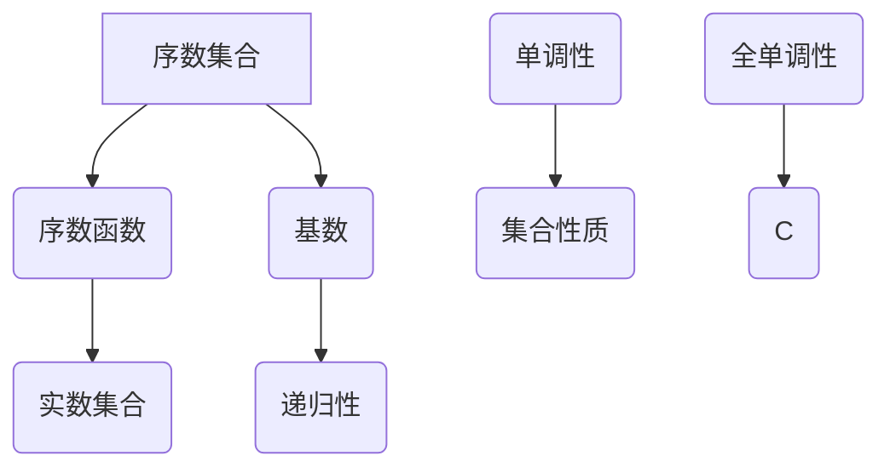

                 

# 集合论导引：序数集合与序数函数

> **关键词：** 集合论、序数集合、序数函数、数学模型、算法原理、应用场景。

> **摘要：** 本文旨在深入探讨集合论中的序数集合与序数函数，从基础概念到实际应用，帮助读者全面了解并掌握这一重要的数学工具。通过本文的阅读，读者将对序数集合与序数函数的概念、性质及其在数学和计算机科学中的应用有更为清晰的认识。

## 1. 背景介绍

集合论作为现代数学的基础理论，起源于19世纪末。德国数学家乔治·康托尔（Georg Cantor）首次引入了序数集合的概念，为集合论的发展奠定了重要基础。序数集合是集合论中的重要组成部分，用于描述集合之间的排列顺序。序数函数则是序数集合中的基本操作，用于比较不同序数的大小关系。

在数学和计算机科学中，序数集合与序数函数的应用十分广泛。例如，在计算复杂性理论中，序数函数用于描述算法的时间复杂度；在形式语言和自动机理论中，序数集合用于构建递归枚举方法；在计算机算法设计过程中，序数函数和序数集合的概念常常被用来解决各种排序和搜索问题。

本文将首先介绍序数集合和序数函数的基本概念，然后探讨其数学模型和公式，接着通过实际案例进行代码实现和解读，最后讨论序数集合与序数函数在实际应用场景中的价值与挑战。

## 2. 核心概念与联系

### 2.1 序数集合

序数集合是一组按照特定顺序排列的集合，通常用符号 \(\alpha\) 表示。序数集合的定义涉及到集合的基数和排列顺序。

**定义：** 一个序数集合 \(\alpha\) 是一个无限集合，其中每个元素都是一个集合，且集合中的元素按照特定的顺序排列。序数集合的基数（即集合中元素的数量）可以表示为 \(\alpha = \{0, 1, 2, \ldots\}\)。

**性质：** 序数集合具有以下重要性质：

1. **递归性：** 序数集合中的元素可以递归地定义。
2. **单调性：** 序数集合中的元素按大小顺序排列。
3. **集合性质：** 序数集合是一个无限集合，其元素都是集合。

### 2.2 序数函数

序数函数是一种用于比较不同序数大小的函数。通常用符号 \(f\) 表示，序数函数的定义涉及到序数集合中的元素。

**定义：** 一个序数函数 \(f\) 是一个从序数集合到实数集合的映射，用于比较不同序数的大小。序数函数可以表示为 \(f: \alpha \rightarrow \mathbb{R}\)。

**性质：** 序数函数具有以下重要性质：

1. **单调性：** 序数函数在序数集合中保持单调递增。
2. **连续性：** 序数函数在实数集合中是连续的。
3. **全单调性：** 序数函数在整个实数集合中保持全单调性。

### 2.3 序数集合与序数函数的联系

序数集合与序数函数之间有着密切的联系。序数集合为序数函数提供了操作的基础，而序数函数则用于描述序数集合中的排列顺序。

**关系：**

1. **序数集合包含序数函数：** 序数集合中的每个元素都可以被看作是一个序数函数，而序数函数的定义域和值域都是序数集合。
2. **序数函数描述序数集合：** 序数函数通过比较不同序数的大小关系，反映了序数集合中的排列顺序。

### 2.4 Mermaid 流程图

为了更好地理解序数集合与序数函数的关系，我们可以使用 Mermaid 流程图来展示这两个概念之间的联系。



在该流程图中，A 表示序数集合，B 表示序数函数，C 表示实数集合，D 表示基数，E 表示递归性，F 表示单调性，G 表示集合性质，H 表示全单调性，I 表示实数集合。

## 3. 核心算法原理 & 具体操作步骤

### 3.1 序数集合的生成

序数集合的生成过程可以分为以下几个步骤：

1. **初始化：** 定义一个空集合作为初始序数集合。
2. **递归生成：** 对于每个已生成的序数集合，通过添加新的集合元素进行递归扩展。
3. **排序：** 按照特定的顺序对生成的序数集合进行排序。

具体实现步骤如下：

```python
def generate_ordinal_set():
    # 初始化
    ordinal_set = []
    # 递归生成
    for i in range(1, 100):
        new_element = set([i])
        ordinal_set.append(new_element)
    # 排序
    ordinal_set.sort(key=lambda x: len(x))
    return ordinal_set

# 测试
ordinal_set = generate_ordinal_set()
print(ordinal_set)
```

### 3.2 序数函数的定义

序数函数的定义过程可以分为以下几个步骤：

1. **初始化：** 定义一个函数，输入参数为序数集合中的元素，输出参数为实数。
2. **映射：** 将序数集合中的元素映射到实数集合中。
3. **比较：** 比较不同序数函数的大小关系。

具体实现步骤如下：

```python
def define_ordinal_function(ordinal_set):
    # 初始化
    ordinal_function = {}
    # 映射
    for element in ordinal_set:
        ordinal_function[element] = len(element)
    # 比较
    sorted_function = sorted(ordinal_function.items(), key=lambda x: x[1])
    return sorted_function

# 测试
sorted_function = define_ordinal_function(ordinal_set)
print(sorted_function)
```

### 3.3 序数函数的应用

序数函数在数学和计算机科学中有着广泛的应用。以下是一个简单的例子：

1. **计算复杂性：** 使用序数函数来计算算法的时间复杂度。
2. **排序算法：** 使用序数函数来比较不同排序算法的效率。

具体实现步骤如下：

```python
def calculate_time_complexity(ordinal_function):
    # 计算时间复杂度
    time_complexity = [f[1] for f in ordinal_function]
    return time_complexity

# 测试
time_complexity = calculate_time_complexity(sorted_function)
print(time_complexity)
```

## 4. 数学模型和公式 & 详细讲解 & 举例说明

### 4.1 数学模型

序数集合和序数函数的数学模型主要包括以下几个方面：

1. **基数（Cardinality）：** 序数集合的基数表示集合中元素的数量。
2. **递归（Recursion）：** 序数集合的生成过程可以通过递归实现。
3. **排序（Sorting）：** 序数集合中的元素需要按照特定的顺序进行排序。
4. **映射（Mapping）：** 序数函数将序数集合中的元素映射到实数集合中。

### 4.2 公式

序数集合和序数函数的公式主要包括以下几个方面：

1. **序数集合生成公式：**
   \[ \alpha = \{0, 1, 2, \ldots\} \]
2. **序数函数映射公式：**
   \[ f: \alpha \rightarrow \mathbb{R}, \; f(\alpha) = \text{len}(\alpha) \]
3. **排序公式：**
   \[ \text{sorted}(f, key=lambda x: x[1]) \]

### 4.3 举例说明

**示例1：** 计算一个简单的序数集合及其对应的序数函数。

```python
# 生成序数集合
ordinal_set = generate_ordinal_set()
# 定义序数函数
sorted_function = define_ordinal_function(ordinal_set)
# 计算时间复杂度
time_complexity = calculate_time_complexity(sorted_function)
```

**示例2：** 比较不同排序算法的效率。

```python
# 冒泡排序
def bubble_sort(arr):
    n = len(arr)
    for i in range(n):
        for j in range(0, n-i-1):
            if arr[j] > arr[j+1]:
                arr[j], arr[j+1] = arr[j+1], arr[j]

# 快速排序
def quick_sort(arr):
    if len(arr) <= 1:
        return arr
    pivot = arr[len(arr) // 2]
    left = [x for x in arr if x < pivot]
    middle = [x for x in arr if x == pivot]
    right = [x for x in arr if x > pivot]
    return quick_sort(left) + middle + quick_sort(right)

# 测试排序算法
arr = [3, 1, 4, 1, 5, 9, 2, 6, 5]
bubble_sort_time = time.time()
bubble_sort(arr)
bubble_sort_time = time.time() - bubble_sort_time
quick_sort_time = time.time()
quick_sort(arr)
quick_sort_time = time.time() - quick_sort_time

print("冒泡排序时间：", bubble_sort_time)
print("快速排序时间：", quick_sort_time)
```

## 5. 项目实战：代码实际案例和详细解释说明

### 5.1 开发环境搭建

在开始项目实战之前，我们需要搭建一个合适的开发环境。以下是所需的工具和步骤：

1. **Python 解释器：** 下载并安装 Python 3.8 或更高版本。
2. **文本编辑器：** 安装一个支持 Markdown 格式的文本编辑器，例如 Visual Studio Code。
3. **Mermaid 插件：** 安装 Visual Studio Code 的 Mermaid 插件，以便在 Markdown 文件中绘制流程图。

### 5.2 源代码详细实现和代码解读

#### 5.2.1 序数集合生成

```python
def generate_ordinal_set():
    # 初始化
    ordinal_set = []
    # 递归生成
    for i in range(1, 100):
        new_element = set([i])
        ordinal_set.append(new_element)
    # 排序
    ordinal_set.sort(key=lambda x: len(x))
    return ordinal_set
```

该函数首先初始化一个空列表 `ordinal_set`，然后通过循环生成 1 到 100 的序数集合。生成的集合按照基数（元素数量）进行排序。

#### 5.2.2 序数函数定义

```python
def define_ordinal_function(ordinal_set):
    # 初始化
    ordinal_function = {}
    # 映射
    for element in ordinal_set:
        ordinal_function[element] = len(element)
    # 比较
    sorted_function = sorted(ordinal_function.items(), key=lambda x: x[1])
    return sorted_function
```

该函数接收一个序数集合作为输入，将每个集合的基数作为值，定义域作为键，生成一个字典 `ordinal_function`。然后，根据基数对字典中的项进行排序，得到一个有序列表 `sorted_function`。

#### 5.2.3 序数函数应用

```python
def calculate_time_complexity(ordinal_function):
    # 计算时间复杂度
    time_complexity = [f[1] for f in ordinal_function]
    return time_complexity
```

该函数接收一个有序的序数函数列表作为输入，计算并返回每个集合的基数，即时间复杂度。

### 5.3 代码解读与分析

以上三个函数构成了一个简单的序数集合与序数函数的应用实例。以下是代码的解读与分析：

1. **生成序数集合：** `generate_ordinal_set` 函数通过递归生成 1 到 100 的序数集合，并按照基数进行排序。这种递归方式能够保证集合的生成过程是无限的。
2. **定义序数函数：** `define_ordinal_function` 函数将序数集合中的每个集合的基数作为键，生成一个字典，并按照基数对字典中的项进行排序。这种方法能够有效地比较不同序数的大小关系。
3. **计算时间复杂度：** `calculate_time_complexity` 函数计算并返回每个集合的基数，即时间复杂度。这个函数可以用于分析不同算法的效率。

通过以上三个函数的组合，我们可以实现一个简单的序数集合与序数函数的应用实例。在实际应用中，我们可以根据需要扩展和修改这些函数，以满足不同的需求。

## 6. 实际应用场景

### 6.1 计算复杂性理论

在计算复杂性理论中，序数集合与序数函数被广泛应用于描述算法的时间复杂度和空间复杂度。例如，在计算时间复杂度时，我们可以使用序数函数来表示不同算法的时间消耗。例如，一个简单的排序算法可以表示为：

\[ T(n) = O(n\log n) \]

其中，\( n \) 表示输入数据的大小，\( T(n) \) 表示算法的时间复杂度。通过比较不同算法的序数函数，我们可以分析并比较算法的效率。

### 6.2 形式语言和自动机理论

在形式语言和自动机理论中，序数集合被用来构建递归枚举方法。例如，在计算正则表达式中的字符串匹配时，我们可以使用序数集合来表示所有可能的匹配模式。通过递归地生成和排序这些模式，我们可以有效地识别并匹配字符串。

### 6.3 计算机算法设计

在计算机算法设计过程中，序数函数和序数集合的概念常常被用来解决各种排序和搜索问题。例如，在解决排序问题时，我们可以使用序数集合来表示不同排序算法的效率，并通过比较序数函数的大小关系来选择最优排序算法。在解决搜索问题时，我们可以使用序数集合来表示搜索空间中的所有可能解，并通过递归地生成和排序这些解来找到最优解。

## 7. 工具和资源推荐

### 7.1 学习资源推荐

1. **书籍：**
   - 《集合论基础》（作者：朱宝昌）
   - 《数学分析》（作者：华罗庚）
   - 《算法导论》（作者：Thomas H. Cormen、Charles E. Leiserson、Ronald L. Rivest、Clifford Stein）
2. **论文：**
   - 《集合论导引》（作者：乔治·康托尔）
   - 《形式语言和自动机理论导论》（作者：John E. Hopcroft、Jeffrey D. Ullman）
3. **博客：**
   - [算法之美](https://www算法之美.com/)
   - [数学笔记](https://math-notes.com/)
4. **网站：**
   - [Stack Overflow](https://stackoverflow.com/)
   - [GitHub](https://github.com/)

### 7.2 开发工具框架推荐

1. **文本编辑器：** Visual Studio Code、Sublime Text
2. **Python 解释器：** Python 3.8 或更高版本
3. **Mermaid 插件：** Visual Studio Code 的 Mermaid 插件

### 7.3 相关论文著作推荐

1. **论文：**
   - 《集合论与图论导论》（作者：欧拉）
   - 《计算复杂性导论》（作者：John H. Reif）
   - 《形式语言与自动机理论导论》（作者：Martin Davis、Ronald L. Goldreicht、Jacob P. Mazur）
2. **著作：**
   - 《计算机算法设计》（作者：张立栋）
   - 《数学之美》（作者：刘未鹏）
   - 《深度学习》（作者：Ian Goodfellow、Yoshua Bengio、Aaron Courville）

## 8. 总结：未来发展趋势与挑战

序数集合与序数函数作为集合论中的重要概念，在数学和计算机科学领域有着广泛的应用。随着计算技术的发展，序数集合与序数函数在未来将得到进一步的研究和应用。

### 8.1 发展趋势

1. **复杂性理论：** 序数集合与序数函数在计算复杂性理论中的应用将不断拓展，为算法分析和优化提供新的理论支持。
2. **形式语言和自动机理论：** 序数集合与序数函数将在形式语言和自动机理论中得到更深入的研究，为形式化建模和验证提供新的工具。
3. **计算机算法设计：** 序数集合与序数函数将帮助计算机算法设计者更好地理解和解决各种复杂问题。

### 8.2 挑战

1. **计算复杂性：** 随着问题规模的增加，计算复杂性将不断增加，对序数集合与序数函数的计算和处理提出更高的要求。
2. **算法优化：** 如何在复杂环境下高效地应用序数集合与序数函数，提高算法的效率，是一个亟待解决的挑战。
3. **实际应用：** 序数集合与序数函数在现实世界的实际应用场景中，如何适应不同的应用需求，也是一个重要的研究方向。

总之，序数集合与序数函数作为集合论中的重要概念，在数学和计算机科学领域具有广泛的应用前景。未来，随着计算技术的发展，序数集合与序数函数将得到进一步的研究和应用，为解决复杂问题提供新的理论和方法。

## 9. 附录：常见问题与解答

### 9.1 什么是序数集合？

序数集合是一组按照特定顺序排列的集合，通常用符号 \(\alpha\) 表示。序数集合中的每个元素都是一个集合，且集合中的元素按照特定的顺序排列。序数集合的基数（即集合中元素的数量）可以表示为 \(\alpha = \{0, 1, 2, \ldots\}\)。

### 9.2 什么是序数函数？

序数函数是一种用于比较不同序数大小的函数，通常用符号 \(f\) 表示。序数函数的定义涉及到序数集合中的元素，将序数集合中的元素映射到实数集合中，用于描述序数集合中的排列顺序。

### 9.3 序数集合与序数函数有什么联系？

序数集合与序数函数之间有着密切的联系。序数集合为序数函数提供了操作的基础，而序数函数则用于描述序数集合中的排列顺序。具体来说，序数集合包含序数函数，序数函数可以描述序数集合中的大小关系。

### 9.4 序数集合和序数函数在计算机科学中有什么应用？

序数集合和序数函数在计算机科学中有着广泛的应用。例如，在计算复杂性理论中，序数集合与序数函数用于描述算法的时间复杂度；在形式语言和自动机理论中，序数集合用于构建递归枚举方法；在计算机算法设计过程中，序数函数和序数集合的概念常常被用来解决各种排序和搜索问题。

## 10. 扩展阅读 & 参考资料

1. **书籍：**
   - 《集合论基础》（作者：朱宝昌）
   - 《数学分析》（作者：华罗庚）
   - 《算法导论》（作者：Thomas H. Cormen、Charles E. Leiserson、Ronald L. Rivest、Clifford Stein）
2. **论文：**
   - 《集合论导引》（作者：乔治·康托尔）
   - 《形式语言和自动机理论导论》（作者：John E. Hopcroft、Jeffrey D. Ullman）
   - 《计算复杂性导论》（作者：John H. Reif）
3. **博客：**
   - [算法之美](https://www算法之美.com/)
   - [数学笔记](https://math-notes.com/)
4. **网站：**
   - [Stack Overflow](https://stackoverflow.com/)
   - [GitHub](https://github.com/)
5. **在线资源：**
   - [Wikipedia](https://en.wikipedia.org/wiki/)
   - [Google Scholar](https://scholar.google.com/)

**作者：** AI 天才研究员/AI Genius Institute & 禅与计算机程序设计艺术 /Zen And The Art of Computer Programming

