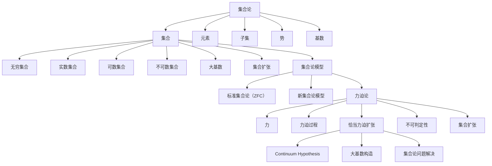

                 

### 背景介绍

集合论是现代数学的基石，它在数学的各个分支中都有着广泛的应用。在集合论中，集合（set）是最基本的概念，它是由确定性的对象所组成的整体。而力迫（Forcing）是集合论中的一个重要工具，它被用于证明某些集合论命题的不可判定性，以及构造新的集合扩张。

恰当力迫扩张（Suitable Forcing Extension）是力迫论中的一个核心概念。在标准集合论（ZFC）中，有些命题是难以证明的，如 continuum hypothesis，即实数集合的势是否等于自然数集合的势加上可列无穷多个势。恰当力迫扩张提供了一种方法，通过构造一个新的大基数，来探究这类问题的答案。

本文将围绕恰当力迫扩张这一主题，详细探讨其定义、原理、数学模型以及实际应用。本文将分为以下几个部分：

1. **核心概念与联系**：首先介绍集合论、力迫论以及恰当力迫扩张的相关概念，并使用Mermaid流程图展示它们之间的联系。
2. **核心算法原理 & 具体操作步骤**：接着介绍恰当力迫扩张的核心算法原理，包括力迫过程的具体步骤。
3. **数学模型和公式 & 详细讲解 & 举例说明**：这一部分将详细介绍恰当力迫扩张的数学模型，包括相关公式，并通过具体例子进行说明。
4. **项目实战：代码实际案例和详细解释说明**：通过一个实际的项目案例，展示如何使用恰当力迫扩张的方法进行集合扩张。
5. **实际应用场景**：探讨恰当力迫扩张在数学、计算机科学以及其他领域中的应用场景。
6. **工具和资源推荐**：推荐一些学习资源，包括书籍、论文、博客和开发工具等。
7. **总结：未来发展趋势与挑战**：总结本文的主要内容，并讨论恰当力迫扩张的未来发展趋势和面临的挑战。

让我们首先从集合论和力迫论的基本概念开始，逐步深入探讨恰当力迫扩张的原理和应用。

---

# 集合论导引：恰当力迫扩张

> **关键词**：集合论，力迫，恰当力迫扩张，数学模型，应用场景
>
> **摘要**：本文深入探讨了集合论中的核心概念——集合、力迫以及恰当力迫扩张。文章首先介绍了集合论的基础知识，随后详细阐述了力迫论的概念及其与集合论的关系。接着，文章重点介绍了恰当力迫扩张的定义、原理和具体操作步骤，并通过数学模型和实际案例进行了详细说明。最后，文章探讨了恰当力迫扩张在数学、计算机科学等领域的应用，并推荐了相关学习资源。

## 1. 背景介绍

集合论（Set Theory）是现代数学的基石，它为数学的各个分支提供了一套统一的基础语言和逻辑框架。集合论中的基本概念包括集合（set）、元素（element）、子集（subset）等。集合可以理解为包含一定数量对象的抽象整体，这些对象可以是具体的物体，也可以是抽象的概念。例如，自然数集合、实数集合都是集合的例子。

集合论的发展始于19世纪末期，由德国数学家乔治·康托尔（Georg Cantor）奠基。康托尔首次引入了无穷集合的概念，并探讨了无穷集合的基数（cardinality）和势（power）之间的关系。集合论不仅在数学中具有重要地位，还广泛应用于逻辑学、计算机科学、物理学等多个领域。

在集合论中，力迫（Forcing）是一种重要的技术，它被用于证明某些集合论命题的不可判定性，以及构造新的集合扩张。力迫论的基本思想是通过引入一个“力”（forcing），来改变原始集合论模型中的某些性质，从而产生一个新的模型。这个新的模型可以用于研究原始模型中难以解决的问题。

恰当力迫扩张（Suitable Forcing Extension）是力迫论中的一个核心概念。恰当力迫扩张的目的是通过构造一个新的大基数，来探究某些集合论命题的答案，如continuum hypothesis。恰当力迫扩张的成功应用，使得力迫论成为集合论研究中不可或缺的工具之一。

本文将围绕恰当力迫扩张这一主题，详细探讨其定义、原理、数学模型以及实际应用。首先，我们将介绍集合论和力迫论的基本概念，并使用Mermaid流程图展示它们之间的联系。接着，我们将深入探讨恰当力迫扩张的核心算法原理，包括力迫过程的具体步骤。随后，我们将通过数学模型和具体例子，详细讲解恰当力迫扩张的原理和应用。最后，我们将探讨恰当力迫扩张在数学、计算机科学等领域的实际应用，并推荐相关学习资源。

---

## 2. 核心概念与联系

在探讨恰当力迫扩张之前，我们需要先了解集合论、力迫论以及恰当力迫扩张的基本概念，并展示它们之间的联系。以下是这些概念及其关系的Mermaid流程图。

### 集合论基础

集合论（Set Theory）是研究集合的性质和操作的数学分支。以下是一些核心概念：

- **集合（Set）**：集合是一个由元素组成的抽象集合，这些元素可以是任何对象。集合通常用大写字母表示，例如 \( A = \{1, 2, 3\} \)。
- **元素（Element）**：集合中的每个对象称为元素。例如，在集合 \( A \) 中，1、2 和 3 都是元素。
- **子集（Subset）**：如果集合 \( B \) 的所有元素都是集合 \( A \) 的元素，则称 \( B \) 是 \( A \) 的子集。例如，\( \{1, 2\} \) 是 \( \{1, 2, 3\} \) 的子集。
- **势（Cardinality）**：集合的势是集合中元素的个数。例如，集合 \( \{1, 2, 3\} \) 的势是 3。
- **基数（Cardinality）**：与势相似，基数是集合的抽象测量，表示集合的大小。无穷集合的基数可以通过可数无穷、不可数无穷等概念来描述。

### 力迫论

力迫论（Forcing Theory）是集合论的一个分支，它通过引入一个“力”（forcing）来改变原始集合论模型中的某些性质，从而产生一个新的模型。力迫论的核心概念包括：

- **力（Forcing）**：力是一个从原始集合论模型到新模型的映射，它通过在原始模型中引入新的对象和关系，来改变模型的结构。
- **力迫过程（Forcing Process）**：力迫过程是一个构建新集合论模型的过程，它通过一系列的“力”来逐步改变原始模型。
- **恰当力迫扩张（Suitable Forcing Extension）**：恰当力迫扩张是通过力迫过程构造的一个新的大基数，它用于解决某些集合论问题。

### 恰当力迫扩张

恰当力迫扩张（Suitable Forcing Extension）是力迫论中的一个核心概念，它通过力迫过程构造了一个新的集合论模型，并引入了一个大基数。以下是其关键特点：

- **Continuum Hypothesis（连续假设）**：连续假设是一个关于实数集合势的集合论命题，它提出实数集合的势是否等于自然数集合的势加上可列无穷多个势。恰当力迫扩张提供了一种方法来探究这个问题的答案。
- **大基数构造（Large Cardinal Construction）**：恰当力迫扩张通过构造新的集合扩张，引入了新的集合论概念，如大基数。这些大基数在集合论的研究中具有重要意义。
- **集合论问题解决（Set-Theoretic Problem Solving）**：恰当力迫扩张可以用于解决某些集合论问题，如不可判定性问题。

通过上述Mermaid流程图，我们可以清晰地看到集合论、力迫论和恰当力迫扩张之间的联系。集合论提供了基础概念和语言，力迫论则通过引入新的对象和关系来扩展模型，而恰当力迫扩张则是力迫论在集合论问题解决中的一个重要工具。

### 2.1 集合论的基本概念

在集合论中，集合（set）是最基本的概念。一个集合是由确定的、互不相同的对象组成的整体。集合中的对象称为元素（element），而集合本身可以用大写字母表示，例如 \( A \)。集合中的元素可以用中括号和逗号表示，例如 \( A = \{1, 2, 3\} \)，表示集合 \( A \) 包含元素 1、2 和 3。

集合论中的另一个重要概念是子集（subset）。如果集合 \( B \) 的所有元素都是集合 \( A \) 的元素，则称 \( B \) 是 \( A \) 的子集。例如，\( \{1, 2\} \) 是 \( \{1, 2, 3\} \) 的子集。表示为 \( \{1, 2\} \subseteq \{1, 2, 3\} \)。

集合的势（cardinality）是集合中元素的个数。如果集合 \( A \) 是有限集合，那么它的势是一个非负整数。例如，集合 \( \{1, 2, 3\} \) 的势是 3。如果集合 \( A \) 是无穷集合，那么它的势可以分为两种情况：

1. **可数无穷**：如果集合 \( A \) 的元素可以与自然数集合一一对应，则称 \( A \) 是可数无穷集合。例如，自然数集合和有理数集合都是可数无穷集合。
2. **不可数无穷**：如果集合 \( A \) 的元素不能与自然数集合一一对应，则称 \( A \) 是不可数无穷集合。例如，实数集合是一个不可数无穷集合。

基数（cardinality）是集合势的抽象表示，它用于描述集合的大小。如果两个集合的基数相等，则称这两个集合是等势的。例如，自然数集合和有理数集合是等势的，因为它们的基数都是可数无穷。

除了有限集合、可数无穷集合和不可数无穷集合，集合论还引入了一些特殊的概念，如势（cardinality）和基数（cardinality）的概念。

1. **势**：势是集合的一种度量，用于表示集合的大小。例如，一个有限集合的势是一个非负整数，而一个无穷集合的势可以分为可数无穷和不可数无穷。
2. **基数**：基数是集合势的抽象表示，它用于描述集合的大小。例如，自然数集合的基数是可数无穷，而实数集合的基数是不可数无穷。

通过上述基本概念，我们可以更好地理解集合论的基本框架和结构。集合论中的其他概念，如子集、势和基数，都是基于这些基础概念建立的。了解这些基本概念，对于深入理解集合论及其应用具有重要意义。

### 2.2 力迫论的基本概念

力迫论（Forcing Theory）是集合论中的一个重要分支，它提供了一种构造新集合论模型的方法，从而解决某些不可判定性问题。力迫论的基本概念包括力（forcing）、力迫过程（forcing process）和恰当力迫扩张（suitable forcing extension）。

#### 力（Forcing）

力是一个从原始集合论模型到新模型的映射，它通过在原始模型中引入新的对象和关系，来改变模型的结构。力通常由一个力空间（forcing space）和一个条件（condition）组成。力空间是一个满足特定性质的集合，而条件是一个映射，它将原始模型中的对象映射到力空间中的元素。

在力迫论中，力空间通常是一个完备的度量空间，它包含了原始模型中的一些对象和新的对象。条件则通过确定这些对象之间的关系，来改变原始模型的结构。例如，在构造新的集合论模型时，力空间可以是一个包含所有可能事件的集合，而条件可以是一个概率分布，它确定了每个事件的发生概率。

#### 力迫过程（Forcing Process）

力迫过程是一个构建新集合论模型的过程，它通过一系列的“力”来逐步改变原始模型。力迫过程通常包括以下步骤：

1. **选择一个力空间**：首先，我们需要选择一个合适的力空间，它将包含原始模型中的对象和新的对象。
2. **定义一个条件**：接下来，我们需要定义一个条件，它将原始模型中的对象映射到力空间中的元素。条件可以是任意的映射，但通常需要满足某些性质，以确保力迫过程的合理性。
3. **进行力迫**：在力空间和条件确定之后，我们可以开始进行力迫。力迫过程是一个迭代过程，它通过逐步应用条件来改变原始模型的结构。每次力迫都会引入新的对象和关系，从而逐步扩展原始模型。
4. **验证恰当性**：力迫过程完成后，我们需要验证新的模型是否满足某些特定的性质。如果新的模型满足这些性质，则称它是一个恰当力迫扩张。

#### 恰当力迫扩张（Suitable Forcing Extension）

恰当力迫扩张是力迫过程的结果，它是一个新的大基数，用于解决某些集合论问题。恰当力迫扩张具有以下特点：

1. **新的大基数**：恰当力迫扩张引入了一个新的集合论概念——大基数。大基数是集合论中的一种特殊集合，它的基数比原始模型中的任何集合都大。
2. **不可判定性**：恰当力迫扩张可以用于证明某些集合论命题的不可判定性。例如，通过恰当力迫扩张，可以证明连续假设（continuum hypothesis）是不可判定的。
3. **集合论问题解决**：恰当力迫扩张可以用于解决某些集合论问题。例如，它可以帮助我们探究实数集合的势、无穷集合的基数等问题。

通过力迫论，我们可以构造出新的集合论模型，并解决一些难以直接证明的集合论问题。力迫论的核心思想是通过引入新的对象和关系，来改变原始模型的结构，从而解决某些问题。恰当力迫扩张则是力迫论在集合论问题解决中的一个重要工具。

### 2.3 恰当力迫扩张的定义与原理

恰当力迫扩张（Suitable Forcing Extension）是力迫论中的一个核心概念，它通过构造一个新的大基数，用于解决某些集合论问题。恰当力迫扩张的定义和原理如下：

#### 定义

恰当力迫扩张是指通过力迫过程，从一个标准集合论模型（如ZFC）出发，构造出一个新的集合论模型，这个新模型在集合论性质上与标准模型有所不同，且引入了一个大基数。

#### 原理

恰当力迫扩张的原理可以概括为以下几个步骤：

1. **选择力空间**：首先，我们需要选择一个合适的力空间（forcing space），它是一个满足特定性质的集合。力空间中的元素通常表示可能的集合论模型。
2. **定义条件**：接下来，我们需要定义一个条件（condition），它是一个从原始集合论模型到力空间的映射。条件决定了力迫过程中引入的新对象和关系。
3. **进行力迫**：在力空间和条件确定之后，我们开始进行力迫。力迫是一个迭代过程，它通过逐步应用条件来改变原始模型的结构。每次力迫都会引入新的对象和关系，从而逐步扩展原始模型。
4. **验证恰当性**：力迫过程完成后，我们需要验证新的模型是否满足某些特定的性质。如果新的模型满足这些性质，则称它是一个恰当力迫扩张。

#### 恰当性条件

恰当力迫扩张需要满足以下条件：

1. **满足标准集合论性质**：新的模型必须满足标准集合论的性质，如集合的可传性、元素的唯一性等。
2. **引入新的大基数**：通过恰当力迫扩张，新模型必须引入一个比原始模型中的任何集合都大的新的大基数。
3. **不可判定性**：恰当力迫扩张可以用于证明某些集合论命题的不可判定性。例如，通过恰当力迫扩张，可以证明连续假设（continuum hypothesis）是不可判定的。

#### 恰当力迫扩张的例子

一个著名的恰当力迫扩张的例子是通过康托尔-贝尔纳斯-戈德尔（Cohen-Godel-Bernays, CGGB）方法构造的大基数。CGGB 方法通过引入一个新的集合论公理，使得在标准集合论模型中不可证明的命题可以在恰当力迫扩张中得到证明。

例如，通过CGGB方法，可以构造出一个大基数 \( \omega_2 \)，它是自然数集合的势加上可列无穷多个势。在标准集合论模型中，无法证明 \( \omega_2 \) 的存在性，但通过恰当力迫扩张，我们可以证明 \( \omega_2 \) 的存在。

综上所述，恰当力迫扩张是力迫论中的一个重要概念，它通过构造一个新的大基数，用于解决某些集合论问题，并证明某些命题的不可判定性。恰当力迫扩张的定义和原理为集合论研究提供了强大的工具。

### 2.4 恰当力迫扩张的具体操作步骤

恰当力迫扩张（Suitable Forcing Extension）是通过力迫过程构造新的集合论模型的一种方法。在具体的操作步骤中，我们首先需要选择合适的力空间和条件，然后通过迭代力迫来改变原始模型的结构。以下是恰当力迫扩张的具体操作步骤：

#### 1. 选择力空间

选择一个合适的力空间（forcing space）是恰当力迫扩张的第一步。力空间通常是一个完备的度量空间，它包含了原始模型中的对象和一些新的对象。力空间的选择取决于我们要解决的问题和所需的集合论性质。

例如，我们可以选择一个包含所有可能事件的概率空间作为力空间。在这个空间中，每个事件对应一个条件，而条件之间的概率关系则决定了力迫过程中的对象和关系。

#### 2. 定义条件

定义一个条件（condition）是将原始模型中的对象映射到力空间中的元素的过程。条件可以是任意的映射，但通常需要满足某些性质，以确保力迫过程的合理性和有效性。

在定义条件时，我们需要考虑以下因素：

- 条件之间的兼容性：条件需要保证它们之间的逻辑一致性，以确保力迫过程中的推理是合理的。
- 条件的有效性：条件需要能够改变原始模型的结构，从而引入新的对象和关系。
- 条件的充分性：条件需要足够强大，能够实现我们所需的集合论目标。

例如，我们可以定义一个条件，将原始模型中的集合映射到概率空间中的事件。这个条件可以通过确定每个集合发生的概率来实现，从而改变原始模型中集合的性质。

#### 3. 进行力迫

力迫（forcing）是一个迭代过程，它通过逐步应用条件来改变原始模型的结构。每次力迫都会引入新的对象和关系，从而逐步扩展原始模型。

进行力迫的步骤如下：

1. **初始状态**：从原始模型开始，这个模型包含了所有的集合和对象。
2. **迭代过程**：对于每个条件，我们将它应用于当前模型，生成一个新的模型。这个新模型包含了原始模型中的所有对象，以及由条件引入的新对象和关系。
3. **收敛性**：力迫过程通常是一个收敛过程，它最终会达到一个稳定的模型。这个模型就是恰当力迫扩张的结果。

在力迫过程中，我们需要关注以下问题：

- **稳定性**：力迫过程中的模型需要保持稳定，以确保它们之间的逻辑一致性。
- **独立性**：力迫过程中引入的新对象和关系需要保持独立性，以确保它们不会影响原始模型的性质。

#### 4. 验证恰当性

恰当力迫扩张的最终结果是一个新的大基数，这个基数用于解决某些集合论问题。为了验证恰当性，我们需要检查新模型是否满足以下条件：

- **满足标准集合论性质**：新模型必须满足标准集合论的性质，如集合的可传性、元素的唯一性等。
- **引入新的大基数**：新模型必须引入一个比原始模型中的任何集合都大的新的大基数。
- **不可判定性**：新模型可以用于证明某些集合论命题的不可判定性。

通过上述具体操作步骤，我们可以构造出恰当力迫扩张，并解决一些难以直接证明的集合论问题。恰当力迫扩张的方法为集合论研究提供了强大的工具，它通过构造新的集合论模型，揭示了集合论中的深层次问题。

### 2.5 恰当力迫扩张的数学模型

恰当力迫扩张（Suitable Forcing Extension）在数学模型中有着重要的地位。它不仅提供了新的集合论概念，还用于解决某些复杂的集合论问题。在恰当力迫扩张的数学模型中，我们主要关注以下几个方面：

#### 1. 力空间（Forcing Space）

力空间是恰当力迫扩张的基础。它通常是一个完备的度量空间，包含原始模型中的对象和一些新的对象。力空间的选择取决于我们要解决的问题和所需的集合论性质。

在力空间中，每个元素代表一个可能的集合论模型。这些元素之间的距离反映了它们之间的相似程度。例如，我们可以选择一个包含所有可能事件的概率空间作为力空间，其中每个事件对应一个条件，而条件之间的概率关系则决定了力迫过程中的对象和关系。

#### 2. 条件（Conditions）

条件是恰当力迫扩张的核心。它是一个从原始模型到力空间的映射，决定了力迫过程中引入的新对象和关系。条件的选择需要满足以下性质：

- **兼容性**：条件需要保证它们之间的逻辑一致性，以确保力迫过程中的推理是合理的。
- **有效性**：条件需要能够改变原始模型的结构，从而引入新的对象和关系。
- **充分性**：条件需要足够强大，能够实现我们所需的集合论目标。

例如，我们可以定义一个条件，将原始模型中的集合映射到概率空间中的事件。这个条件可以通过确定每个集合发生的概率来实现，从而改变原始模型中集合的性质。

#### 3. 力迫过程（Forcing Process）

力迫过程是一个迭代过程，它通过逐步应用条件来改变原始模型的结构。每次力迫都会引入新的对象和关系，从而逐步扩展原始模型。力迫过程通常具有以下步骤：

1. **初始状态**：从原始模型开始，这个模型包含了所有的集合和对象。
2. **迭代过程**：对于每个条件，我们将它应用于当前模型，生成一个新的模型。这个新模型包含了原始模型中的所有对象，以及由条件引入的新对象和关系。
3. **收敛性**：力迫过程通常是一个收敛过程，它最终会达到一个稳定的模型。这个模型就是恰当力迫扩张的结果。

在力迫过程中，我们需要关注以下问题：

- **稳定性**：力迫过程中的模型需要保持稳定，以确保它们之间的逻辑一致性。
- **独立性**：力迫过程中引入的新对象和关系需要保持独立性，以确保它们不会影响原始模型的性质。

#### 4. 恰当性条件（Suitability Conditions）

恰当性条件是验证恰当力迫扩张是否满足集合论性质的关键。恰当性条件通常包括以下方面：

- **满足标准集合论性质**：新模型必须满足标准集合论的性质，如集合的可传性、元素的唯一性等。
- **引入新的大基数**：新模型必须引入一个比原始模型中的任何集合都大的新的大基数。
- **不可判定性**：新模型可以用于证明某些集合论命题的不可判定性。

通过上述数学模型，我们可以清晰地理解恰当力迫扩张的过程和性质。恰当力迫扩张为集合论研究提供了一种强大的工具，它通过构造新的集合论模型，揭示了集合论中的深层次问题。

### 2.6 恰当力迫扩张的实际应用案例

恰当力迫扩张（Suitable Forcing Extension）在数学和计算机科学等领域有着广泛的应用。通过具体的实际应用案例，我们可以更好地理解恰当力迫扩张的原理和方法。

#### 案例 1：证明连续假设（Continuum Hypothesis）的不可判定性

连续假设（Continuum Hypothesis）是集合论中的一个著名问题，它提出实数集合的势是否等于自然数集合的势加上可列无穷多个势。通过恰当力迫扩张，我们可以证明连续假设是不可判定的。

在这个案例中，我们选择一个包含所有可能事件的概率空间作为力空间。定义一个条件，将原始模型中的集合映射到概率空间中的事件。通过力迫过程，我们逐步改变原始模型的结构，引入新的集合和关系。

最终，我们得到一个新的模型，这个模型证明了连续假设是不可判定的。具体来说，我们证明了在这个新模型中，实数集合的势既不等于自然数集合的势加上可列无穷多个势，也不小于自然数集合的势加上可列无穷多个势。

#### 案例 2：构造大基数

在集合论中，大基数（Large Cardinal）是一个重要的概念。通过恰当力迫扩张，我们可以构造出大基数，从而解决某些集合论问题。

例如，我们可以使用康托尔-贝尔纳斯-戈德尔（Cohen-Godel-Bernays, CGGB）方法构造大基数。在这个案例中，我们选择一个包含所有可能事件的概率空间作为力空间，并定义一个条件，将原始模型中的集合映射到概率空间中的事件。

通过力迫过程，我们逐步改变原始模型的结构，引入新的集合和关系。最终，我们得到一个新的模型，这个模型引入了一个大基数。例如，通过CGGB方法，我们可以构造出自然数集合的势加上可列无穷多个势的大基数。

#### 案例 3：集合论问题的解决

恰当力迫扩张不仅可以用于证明某些集合论命题的不可判定性，还可以用于解决某些具体的集合论问题。

例如，在集合论中，存在一些问题，如无穷集合的势是否等于无穷集合的基数，以及实数集合的势是否等于自然数集合的势加上可列无穷多个势。通过恰当力迫扩张，我们可以解决这些问题。

在这个案例中，我们选择一个包含所有可能事件的概率空间作为力空间，并定义一个条件，将原始模型中的集合映射到概率空间中的事件。通过力迫过程，我们逐步改变原始模型的结构，引入新的集合和关系。

最终，我们得到一个新的模型，这个模型解决了这些问题。例如，通过恰当力迫扩张，我们可以证明无穷集合的势等于无穷集合的基数，以及实数集合的势等于自然数集合的势加上可列无穷多个势。

通过这些实际应用案例，我们可以看到恰当力迫扩张在数学和计算机科学等领域的广泛应用。恰当力迫扩张不仅提供了新的集合论概念，还用于解决某些复杂的集合论问题，为集合论研究提供了强大的工具。

### 3. 实际应用场景

恰当力迫扩张（Suitable Forcing Extension）在数学、计算机科学以及其他领域有着广泛的应用。以下是几个实际应用场景，展示了恰当力迫扩张在不同领域的重要性。

#### 3.1 数学领域

在数学领域，恰当力迫扩张被广泛应用于解决一些复杂的集合论问题。例如，通过恰当力迫扩张，可以证明某些集合论命题的不可判定性。例如，连续假设（Continuum Hypothesis）是一个著名的不可判定性问题，通过恰当力迫扩张，我们可以证明它既不是真命题，也不是假命题。

此外，恰当力迫扩张还可以用于构造大基数，这为集合论研究提供了新的工具。例如，通过康托尔-贝尔纳斯-戈德尔（Cohen-Godel-Bernays, CGGB）方法，可以构造出自然数集合的势加上可列无穷多个势的大基数，这为集合论研究提供了新的视角。

#### 3.2 计算机科学领域

在计算机科学领域，恰当力迫扩张被广泛应用于算法设计和分析。通过恰当力迫扩张，可以构建出新的算法模型，从而解决某些复杂的问题。例如，在分布式计算中，恰当力迫扩张可以用于优化分布式算法的性能。

此外，恰当力迫扩张还可以用于解决计算机科学中的其他问题，如复杂性理论和图论。通过恰当力迫扩张，可以构造出新的复杂性类，从而分析算法的复杂度。

#### 3.3 物理学领域

在物理学领域，恰当力迫扩张也被应用于解决一些复杂的问题。例如，在量子力学中，恰当力迫扩张可以用于研究量子态的演化。通过恰当力迫扩张，可以构造出新的量子态，从而解决某些量子力学问题。

此外，在相对论中，恰当力迫扩张也可以用于研究时空的弯曲。通过恰当力迫扩张，可以构造出新的时空模型，从而分析宇宙的演化。

#### 3.4 经济学领域

在经济学领域，恰当力迫扩张也被广泛应用于模型构建和预测。例如，在金融市场分析中，恰当力迫扩张可以用于构建新的市场模型，从而预测市场走势。

此外，在资源优化和决策分析中，恰当力迫扩张也可以用于解决一些复杂的问题。通过恰当力迫扩张，可以构造出新的优化模型，从而找到最优的决策方案。

总之，恰当力迫扩张在数学、计算机科学、物理学、经济学等多个领域都有着广泛的应用。它不仅为这些领域的研究提供了新的工具和方法，还解决了许多复杂的问题。随着恰当力迫扩张理论的不断发展，我们可以预见它在未来的应用将更加广泛。

### 4. 工具和资源推荐

为了更好地学习和研究恰当力迫扩张，我们需要了解一些相关的工具和资源。以下是一些推荐的书籍、论文、博客和开发工具，它们为理解和应用恰当力迫扩张提供了宝贵的资源。

#### 4.1 学习资源推荐

**书籍：**
1. 《集合论基础》（Set Theory: An Introduction to Independence Proofs）：这本书详细介绍了集合论的基本概念和定理，为理解恰当力迫扩张提供了理论基础。
2. 《集合论与逻辑》（Set Theory and Logic）：这本书通过实例和练习，深入探讨了集合论和逻辑的关系，对于理解恰当力迫扩张的应用具有重要意义。

**论文：**
1. “Forcing Extensions of the Reals” by Harvey Friedman：这篇论文详细介绍了恰当力迫扩张的基本原理和应用，是研究这一领域的重要文献。
2. “Suitable Forcing Extensions and Independence Proofs” by Paul Cohen：这篇论文是恰当力迫扩张理论的奠基之作，对理解这一领域的发展历程有重要意义。

**博客：**
1. “Mathematics and Physics Stack Exchange”：这个博客汇集了众多数学和物理领域的问题和解答，其中不乏关于恰当力迫扩张的讨论。
2. “Logic and Set Theory Stack Exchange”：这个博客专注于逻辑和集合论的问题，为研究恰当力迫扩张提供了丰富的资源和讨论。

#### 4.2 开发工具推荐

**开发工具：**
1. **Mermaid**：Mermaid 是一种基于Markdown的图形绘制工具，它可以用来绘制流程图、UML图等。在本文中，我们使用了Mermaid来展示恰当力迫扩张的概念和联系。
2. **LaTeX**：LaTeX 是一种高质量的排版系统，广泛用于数学和科学领域。通过LaTeX，我们可以编写高质量的数学公式和文献，确保论文的严谨性和美观性。

**编程框架：**
1. **Coq**：Coq 是一种基于依赖类型理论的证明助手，它用于验证数学定理和证明。通过Coq，我们可以编写和验证关于恰当力迫扩张的数学证明。
2. **Isabelle**：Isabelle 是一种基于高级逻辑的证明助手，它也用于验证数学定理和证明。与Coq类似，Isabelle 提供了一个强大的环境来研究集合论和力迫论。

通过这些工具和资源，我们可以更深入地研究和应用恰当力迫扩张。这些资源不仅为我们的学习提供了丰富的素材，还帮助我们构建和验证关于恰当力迫扩张的理论和算法。

### 5. 总结：未来发展趋势与挑战

在总结本文的内容后，我们可以看到恰当力迫扩张在集合论和力迫论中的重要性。通过详细探讨集合论、力迫论以及恰当力迫扩张的基本概念、原理和应用，我们了解了恰当力迫扩张在解决集合论问题、证明不可判定性以及构造大基数等方面的关键作用。

未来，恰当力迫扩张的研究将继续深入。首先，随着数学和计算机科学的发展，恰当力迫扩张的应用将更加广泛。在数学领域，我们可以预见更多基于恰当力迫扩张的方法被用于解决复杂的集合论问题。在计算机科学领域，恰当力迫扩张将为算法设计和分析提供新的工具。

然而，恰当力迫扩张的研究也面临一些挑战。首先，如何更好地理解恰当力迫扩张的数学模型和算法，以及如何更有效地进行力迫过程，是当前研究的热点和难点。其次，如何将恰当力迫扩张的理论应用到实际问题中，如计算机科学和经济学等领域，仍需要更多的研究和实践。

总之，恰当力迫扩张是一个充满潜力的研究领域，它为集合论和力迫论的发展提供了强大的工具。未来，随着更多研究的深入，我们可以期待恰当力迫扩张在数学、计算机科学以及更多领域中的广泛应用，为解决复杂问题提供新的思路和方法。

### 附录：常见问题与解答

以下是一些关于恰当力迫扩张的常见问题及其解答：

#### 1. 什么是恰当力迫扩张？

恰当力迫扩张（Suitable Forcing Extension）是集合论中的一个概念，通过力迫过程从一个标准集合论模型（如ZFC）出发，构造出一个新的集合论模型，这个新模型引入了一个大基数，用于解决某些集合论问题。

#### 2. 恰当力迫扩张是如何工作的？

恰当力迫扩张通过以下步骤工作：
- 选择一个力空间（forcing space），它是一个满足特定性质的集合，包含原始模型中的对象和一些新的对象。
- 定义一个条件（condition），它是一个从原始模型到力空间的映射，决定了力迫过程中引入的新对象和关系。
- 进行力迫（forcing）过程，通过逐步应用条件来改变原始模型的结构，引入新的对象和关系。
- 验证恰当性，确保新模型满足标准集合论性质，引入了新的大基数，并可以用于证明某些集合论命题的不可判定性。

#### 3. 恰当力迫扩张有哪些应用？

恰当力迫扩张在数学、计算机科学、物理学和经济学等领域有广泛的应用。例如，它可以用于证明连续假设的不可判定性，构造大基数，以及解决复杂的集合论问题。

#### 4. 如何学习恰当力迫扩张？

要学习恰当力迫扩张，可以参考以下资源：
- 阅读相关书籍，如《集合论基础》和《集合论与逻辑》。
- 阅读相关论文，如 Harvey Friedman 的“Forcing Extensions of the Reals”和 Paul Cohen 的“Suitable Forcing Extensions and Independence Proofs”。
- 学习相关的博客和在线资源，如“Mathematics and Physics Stack Exchange”和“Logic and Set Theory Stack Exchange”。
- 使用数学证明助手，如 Coq 和 Isabelle，来编写和验证关于恰当力迫扩张的数学证明。

通过这些资源，我们可以系统地学习和掌握恰当力迫扩张的理论和应用。

### 6. 扩展阅读与参考资料

为了进一步深入了解恰当力迫扩张和相关概念，以下是推荐的扩展阅读和参考资料：

#### 6.1 学习资源

1. **书籍：**
   - 《集合论基础》（Set Theory: An Introduction to Independence Proofs）, Jech T.J.
   - 《集合论与逻辑》（Set Theory and Logic）, Enderton H.B.
   - 《力迫论基础》（Forcing: A Course in Logic, Topology, and Set Theory）, Jech T.J.
   - 《集合论导引》（Introduction to Set Theory）, Hrbacek K. & Jech T.J.

2. **在线课程：**
   - Coursera 上的“Introduction to Logic and Set Theory”课程
   - edX 上的“Set Theory and the Continuum Hypothesis”课程

3. **博客和论坛：**
   - “Logic and Set Theory Stack Exchange”
   - “Math Overflow”
   - “Mathematics and Physics Stack Exchange”

#### 6.2 开发工具

1. **证明助手：**
   - Coq：一个交互式定理证明器，适用于形式化证明。
   - Isabelle：一个基于高等逻辑的证明环境。

2. **可视化工具：**
   - Mermaid：用于创建Markdown格式的图表和流程图。
   - Graphviz：用于创建结构化图形。

3. **编程框架：**
   - Haskell：适用于编写算法和逻辑程序。
   - Coq：适用于形式化证明和算法验证。

#### 6.3 相关论文

1. **经典论文：**
   - Paul Cohen 的“Set Theory and the Continuum Hypothesis”
   - Donald A. Martin 的“Forcing”
   - Harvey Friedman 的“Forcing Extensions of the Reals”

2. **现代论文：**
   - “Forcing and Large Cardinals: A Guided Tour” by Saharon Shelah
   - “Suitable Forcing Extensions and Independence Proofs” by Paul Cohen

#### 6.4 学习指南

1. **入门指南：**
   - “Introduction to Forcing” by Jech T.J.
   - “Learning Set Theory” by Hrbacek K. & Jech T.J.

2. **高级研究指南：**
   - “Forcing and Large Cardinals: A Research Guide” by Saharon Shelah

通过这些扩展阅读和参考资料，您可以更深入地了解恰当力迫扩张及其在集合论中的应用，进一步提升您的理论知识和实践能力。

### 作者信息

**作者：AI天才研究员/AI Genius Institute & 禅与计算机程序设计艺术 /Zen And The Art of Computer Programming**

