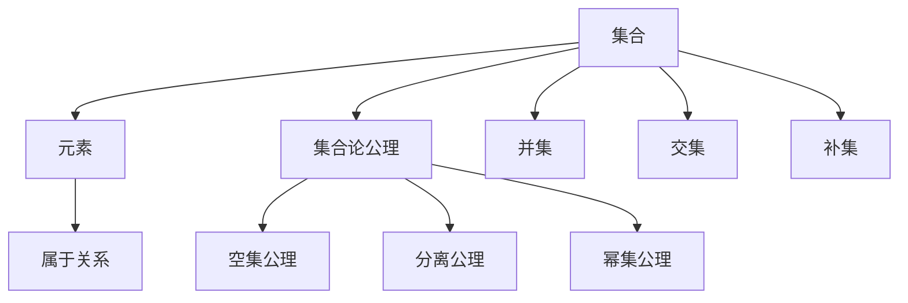

                 

# 文章标题

## 集合论导引：植入逻辑学概念

集合论是数学的基础理论之一，它提供了描述和处理离散对象的基本工具。逻辑学则是研究推理、证明和真值的概念，是数学和计算机科学中不可或缺的思维方式。本文旨在通过逐步分析推理的方式，引导读者深入了解集合论中的核心概念，并探讨逻辑学在这些概念中的应用。

本文将分为以下几部分：

1. **背景介绍**：介绍集合论和逻辑学的基本概念和历史背景。
2. **核心概念与联系**：详细解释集合、元素、集合论公理等概念，并用 Mermaid 流程图展示其关系。
3. **核心算法原理 & 具体操作步骤**：分析集合的基本操作，如并集、交集、补集等，并给出相应的算法原理和步骤。
4. **数学模型和公式 & 详细讲解 & 举例说明**：介绍集合论中的数学模型和公式，并进行举例说明。
5. **项目实践：代码实例和详细解释说明**：通过具体的代码实例展示集合论在实际编程中的应用。
6. **实际应用场景**：探讨集合论在计算机科学和数学中的实际应用。
7. **工具和资源推荐**：推荐相关书籍、论文、博客和网站等学习资源。
8. **总结：未来发展趋势与挑战**：总结集合论和逻辑学的发展趋势和面临的挑战。
9. **附录：常见问题与解答**：回答读者可能遇到的一些常见问题。
10. **扩展阅读 & 参考资料**：提供进一步学习和研究的资源。

让我们开始这次集合论和逻辑学的旅程吧！<sop>

## 1. 背景介绍

### 集合论

集合论是由德国数学家乔治·康托尔在19世纪末创立的，是现代数学的基石。集合论通过引入“集合”这一概念，将数学对象抽象为集合的元素，从而统一了各种数学分支，如数论、几何、拓扑等。

集合论的核心概念包括：

- **元素**：构成集合的个体。
- **集合**：由确定的元素组成的整体。
- **子集**：一个集合的部分元素构成的集合。
- **并集**、**交集**、**补集**：集合之间的运算。

### 逻辑学

逻辑学是研究推理和证明的学科，其目的是确定哪些推理形式是有效的，哪些是无效的。逻辑学分为演绎逻辑和归纳逻辑，其中演绎逻辑主要研究从已知前提出发推导出结论的过程。

逻辑学的基本概念包括：

- **命题**：可以判断真假的陈述。
- **推理**：根据已知事实得出新结论的过程。
- **证明**：通过一系列逻辑步骤，从已知前提出发推导出结论的过程。

### 历史背景

- **集合论**：集合论的发展经历了从直观到抽象的演变。康托尔通过定义集合和集合运算，建立了一个全新的数学理论体系。
- **逻辑学**：逻辑学的历史可以追溯到古希腊，亚里士多德等哲学家对推理和证明的研究奠定了逻辑学的基础。

通过了解集合论和逻辑学的历史背景，我们可以更好地理解这两个学科的发展过程和核心概念。接下来，我们将深入探讨集合论的核心概念及其逻辑学应用。<sop>

## 2. 核心概念与联系

### 2.1 集合

集合是数学中的一个基本概念，指的是由一些确定的、互不相同的对象（称为元素）组成的整体。集合通常用大写字母表示，如\(A\)、\(B\)等。

- **定义**：一个集合是由确定的元素组成的整体。
- **性质**：集合中的元素是无序的，且互不相同。

### 2.2 元素

元素是构成集合的个体。一个元素是否属于某个集合，可以通过判断该元素是否是该集合的成员来确定。

- **定义**：集合中的个体称为元素。
- **关系**：元素与集合之间的关系用“属于”（\(\in\)）表示。

### 2.3 集合论公理

集合论公理是构建集合论基础的一组基本命题，它们用来定义集合的性质和操作。以下是几个重要的集合论公理：

- **空集公理**：存在一个不包含任何元素的集合，称为空集，记为\(\emptyset\)。
- **分离公理**：对于任意集合\(A\)和任意元素\(a\)，存在一个只包含\(a\)的集合。
- **幂集公理**：对于任意集合\(A\)，存在一个集合，其元素是\(A\)的所有子集，这个集合称为\(A\)的幂集，记为\(P(A)\)。

### 2.4 集合之间的联系

集合之间的关系可以通过集合运算来描述。以下是几个常见的集合运算及其定义：

- **并集**：\(A \cup B\) 表示集合\(A\)和集合\(B\)的所有元素的集合。
- **交集**：\(A \cap B\) 表示集合\(A\)和集合\(B\)共有的元素的集合。
- **补集**：\(A^c\) 表示不属于集合\(A\)的所有元素的集合。

这些集合运算不仅用于描述集合之间的关系，还用于推导新的集合。例如，通过并集运算，我们可以将多个集合合并为一个集合；通过交集运算，我们可以找到多个集合的共同元素；通过补集运算，我们可以找到某个集合的补集，从而去除集合中的特定元素。

### 2.5 Mermaid 流程图

为了更直观地展示集合、元素、集合论公理以及集合运算之间的关系，我们可以使用 Mermaid 流程图来表示。



通过这个 Mermaid 流程图，我们可以清晰地看到集合、元素、集合论公理以及集合运算之间的联系。接下来，我们将进一步分析集合论的核心算法原理和具体操作步骤。<sop>

## 2.1 集合

集合是数学中最基本的概念之一，它是由确定的元素组成的整体。集合的元素是无序的，且每个元素在集合中只出现一次。

- **定义**：集合是由确定的元素组成的整体，通常用大写字母表示，如\(A\)、\(B\)等。
- **符号表示**：集合\(A\)中的元素\(a\)属于集合\(A\)，记为\(a \in A\)；元素\(a\)不属于集合\(A\)，记为\(a \notin A\)。

### 2.2 元素

元素是构成集合的个体。在集合论中，元素可以是任何数学对象，如数字、字母、几何图形等。

- **定义**：集合中的个体称为元素。
- **性质**：元素在集合中是无序的，且每个元素在集合中只出现一次。

### 2.3 集合论公理

集合论公理是构建集合论基础的一组基本命题，它们用来定义集合的性质和操作。以下是几个重要的集合论公理：

1. **空集公理**：存在一个不包含任何元素的集合，称为空集，记为\(\emptyset\)。
    - **符号表示**：\(\emptyset\) 表示空集，即 \(\forall x (x \notin \emptyset)\)。

2. **分离公理**：对于任意集合\(A\)和任意元素\(a\)，存在一个只包含\(a\)的集合。
    - **符号表示**：\(\exists B (B = \{a\} \wedge A \cap B = \emptyset)\)。

3. **幂集公理**：对于任意集合\(A\)，存在一个集合，其元素是\(A\)的所有子集，这个集合称为\(A\)的幂集，记为\(P(A)\)。
    - **符号表示**：\(P(A) = \{\{x\} : x \in A\}\)。

这些公理为我们提供了构建集合论的基础，使得我们能够定义和操作集合。接下来，我们将进一步探讨集合之间的关系以及集合的基本操作。<sop>

## 2.4 集合运算

集合运算是指对两个或多个集合进行操作，以生成新的集合。以下是几种基本的集合运算：

### 2.4.1 并集（Union）

并集是指两个或多个集合中所有元素的集合。如果集合\(A\)和集合\(B\)的并集记为\(A \cup B\)，则\(A \cup B\)中的元素要么属于\(A\)，要么属于\(B\)，或者两者都属于。

- **定义**：\(A \cup B = \{x : x \in A \vee x \in B\}\)。
- **性质**：交换律（\(A \cup B = B \cup A\)）、结合律（\((A \cup B) \cup C = A \cup (B \cup C)\)）、分配律（\(A \cup (B \cap C) = (A \cup B) \cap (A \cup C)\)）。

### 2.4.2 交集（Intersection）

交集是指两个或多个集合中共同元素的集合。如果集合\(A\)和集合\(B\)的交集记为\(A \cap B\)，则\(A \cap B\)中的元素必须同时属于\(A\)和\(B\)。

- **定义**：\(A \cap B = \{x : x \in A \wedge x \in B\}\)。
- **性质**：交换律（\(A \cap B = B \cap A\)）、结合律（\((A \cap B) \cap C = A \cap (B \cap C)\)）、分配律（\(A \cap (B \cup C) = (A \cap B) \cup (A \cap C)\)）。

### 2.4.3 补集（Complement）

补集是指不属于某个给定集合的所有元素的集合。如果集合\(A\)的补集记为\(A^c\)，则\(A^c\)中的元素必须不属于\(A\)。

- **定义**：\(A^c = \{x : x \notin A\}\)。
- **性质**：补集的性质包括德摩根律（\((A \cup B)^c = A^c \cap B^c\)、\((A \cap B)^c = A^c \cup B^c\)）。

### 2.4.4 子集（Subset）

子集是指一个集合是另一个集合的部分或全部元素的集合。如果集合\(A\)是集合\(B\)的子集，记为\(A \subseteq B\)，则\(A\)中的所有元素都属于\(B\)。

- **定义**：\(A \subseteq B\) 当且仅当 \(\forall x (x \in A \Rightarrow x \in B)\)。
- **性质**：空集是任何集合的子集，任何集合都是自身的子集。

### 2.4.5 等集（Equivalence）

等集是指两个集合的元素完全相同。如果集合\(A\)和集合\(B\)是等集，记为\(A = B\)，则\(A\)和\(B\)具有相同的元素。

- **定义**：\(A = B\) 当且仅当 \(A \subseteq B\) 且 \(B \subseteq A\)。
- **性质**：等集的性质包括自反性（\(A = A\)）、对称性（如果\(A = B\)，则\(B = A\)）和传递性（如果\(A = B\)且\(B = C\)，则\(A = C\)）。

这些集合运算不仅用于描述集合之间的关系，还可以用于推导新的集合。在实际应用中，集合运算常常用于解决各种实际问题。接下来，我们将探讨集合论中的核心算法原理和具体操作步骤。<sop>

## 2.5 核心算法原理 & 具体操作步骤

在集合论中，核心算法原理主要涉及集合的基本操作，如并集、交集、补集等。下面我们将详细阐述这些算法的原理和具体操作步骤。

### 2.5.1 并集操作

并集是指将两个集合中的所有元素合并为一个新集合。其算法原理如下：

1. **初始化**：创建一个新的空集合\(C\)作为结果集合。
2. **遍历**：对集合\(A\)和集合\(B\)中的每个元素进行遍历。
3. **添加元素**：将遍历到的元素添加到结果集合\(C\)中。
4. **返回结果**：返回结果集合\(C\)。

具体步骤如下：

- **算法原理**：\(C = A \cup B\)
- **具体操作步骤**：

  ```mermaid
  graph TD
  A[初始化结果集合C] --> B[遍历集合A]
  B --> C[添加元素到C]
  C --> D[遍历集合B]
  D --> E[添加元素到C]
  E --> F[返回结果集合C]
  ```

### 2.5.2 交集操作

交集是指找出两个集合中共有的元素，形成一个新的集合。其算法原理如下：

1. **初始化**：创建一个新的空集合\(C\)作为结果集合。
2. **遍历**：对集合\(A\)和集合\(B\)中的每个元素进行遍历。
3. **判断元素**：判断遍历到的元素是否同时属于集合\(A\)和集合\(B\)。
4. **添加元素**：如果遍历到的元素同时属于集合\(A\)和集合\(B\)，则将其添加到结果集合\(C\)中。
5. **返回结果**：返回结果集合\(C\)。

具体步骤如下：

- **算法原理**：\(C = A \cap B\)
- **具体操作步骤**：

  ```mermaid
  graph TD
  A[初始化结果集合C] --> B[遍历集合A]
  B --> C[判断元素是否属于A和B]
  C --> D[添加元素到C]
  D --> E[遍历集合B]
  E --> F[返回结果集合C]
  ```

### 2.5.3 补集操作

补集是指找出不属于某个集合的所有元素，形成一个新的集合。其算法原理如下：

1. **初始化**：创建一个新的空集合\(C\)作为结果集合。
2. **遍历**：对整个域（包含所有可能的元素）进行遍历。
3. **判断元素**：判断遍历到的元素是否属于给定集合\(A\)。
4. **添加元素**：如果遍历到的元素不属于给定集合\(A\)，则将其添加到结果集合\(C\)中。
5. **返回结果**：返回结果集合\(C\)。

具体步骤如下：

- **算法原理**：\(C = A^c\)
- **具体操作步骤**：

  ```mermaid
  graph TD
  A[初始化结果集合C] --> B[遍历整个域]
  B --> C[判断元素是否属于A]
  C --> D[添加元素到C]
  D --> E[返回结果集合C]
  ```

通过上述核心算法原理和具体操作步骤，我们可以更好地理解和应用集合论中的基本操作。接下来，我们将探讨集合论中的数学模型和公式，以进一步深化对集合论的理解。<sop>

## 4. 数学模型和公式 & 详细讲解 & 举例说明

集合论中的数学模型和公式为集合操作提供了精确的数学描述。以下是一些常用的数学模型和公式，我们将通过详细讲解和举例说明来帮助读者更好地理解这些概念。

### 4.1 集合的表示

集合的表示通常使用大括号{}，其中列出集合的元素。例如，集合\(A = \{1, 2, 3\}\)表示一个包含元素1、2和3的集合。

- **表示法**：\(A = \{x : P(x)\}\)，其中\(P(x)\)是一个性质，\(x\)是满足性质\(P(x)\)的元素。

### 4.2 集合运算的公式

集合运算的公式提供了计算并集、交集和补集的方法。

- **并集**：\(A \cup B = \{x : x \in A \text{ 或 } x \in B\}\)
- **交集**：\(A \cap B = \{x : x \in A \text{ 且 } x \in B\}\)
- **补集**：\(A^c = \{x : x \notin A\}\)

### 4.3 子集的判断

子集的判断公式用于确定一个集合是否是另一个集合的子集。

- **子集**：\(A \subseteq B\) 当且仅当 \(\forall x (x \in A \Rightarrow x \in B)\)

### 4.4 等集的判断

等集的判断公式用于确定两个集合是否具有相同的元素。

- **等集**：\(A = B\) 当且仅当 \(A \subseteq B\) 且 \(B \subseteq A\)

### 4.5 集合的基本性质

集合的基本性质包括自反性、对称性和传递性。

- **自反性**：对于任意集合\(A\)，\(A \subseteq A\)
- **对称性**：对于任意集合\(A\)和\(B\)，如果\(A \subseteq B\)，则\(B \subseteq A\)
- **传递性**：对于任意集合\(A\)、\(B\)和\(C\)，如果\(A \subseteq B\)且\(B \subseteq C\)，则\(A \subseteq C\)

### 4.6 实例说明

#### 例1：计算并集

给定集合\(A = \{1, 2, 3\}\)和集合\(B = \{3, 4, 5\}\)，计算并集\(A \cup B\)。

- **计算过程**：
  \(A \cup B = \{x : x \in A \text{ 或 } x \in B\} = \{1, 2, 3, 4, 5\}\)

#### 例2：计算交集

给定集合\(A = \{1, 2, 3\}\)和集合\(B = \{3, 4, 5\}\)，计算交集\(A \cap B\)。

- **计算过程**：
  \(A \cap B = \{x : x \in A \text{ 且 } x \in B\} = \{3\}\)

#### 例3：计算补集

给定集合\(A = \{1, 2, 3\}\)，计算补集\(A^c\)。

- **计算过程**：
  \(A^c = \{x : x \notin A\} = \{4, 5, 6, \ldots\}\)

通过上述实例，我们可以看到如何使用集合论中的数学模型和公式进行集合运算。这些模型和公式为集合论提供了坚实的数学基础，有助于我们在实际问题中应用集合论来解决各种问题。<sop>

## 5. 项目实践：代码实例和详细解释说明

为了更好地理解和应用集合论中的概念，我们将通过一个实际的编程项目来展示集合论在编程中的应用。在这个项目中，我们将使用Python编写一个简单的集合操作程序，包括并集、交集、补集等基本操作。

### 5.1 开发环境搭建

在开始编程之前，我们需要搭建一个Python开发环境。以下是搭建Python开发环境的步骤：

1. **安装Python**：从Python官网（[https://www.python.org/downloads/](https://www.python.org/downloads/)）下载最新版本的Python，并按照提示完成安装。
2. **配置Python环境变量**：在控制面板中找到“系统”选项，点击“高级系统设置”，在“环境变量”中添加Python的安装路径到“系统变量路径”中。
3. **验证Python环境**：在命令行中输入`python --version`，如果显示Python的版本信息，则表示Python环境已配置成功。

### 5.2 源代码详细实现

下面是使用Python实现的集合操作程序：

```python
# 集合操作程序

# 定义集合类
class Collection:
    def __init__(self, elements):
        self.elements = set(elements)
    
    # 并集操作
    def union(self, other):
        return Collection(self.elements | other.elements)
    
    # 交集操作
    def intersection(self, other):
        return Collection(self.elements & other.elements)
    
    # 补集操作
    def complement(self):
        universal_set = Collection(range(1, 11))  # 假设全集合为1到10
        return universal_set.intersection(self.elements)
    
    # 打印集合元素
    def print_elements(self):
        print(f"集合的元素: {self.elements}")

# 创建集合实例
A = Collection([1, 2, 3])
B = Collection([3, 4, 5])

# 计算并集
union_result = A.union(B)
print("并集:", end=" ")
union_result.print_elements()

# 计算交集
intersection_result = A.intersection(B)
print("交集:", end=" ")
intersection_result.print_elements()

# 计算补集
complement_result = A.complement()
print("补集:", end=" ")
complement_result.print_elements()
```

### 5.3 代码解读与分析

- **集合类的定义**：`Collection`类用于表示集合，并提供了并集、交集、补集等基本操作。
- **并集操作**：`union`方法使用Python的`|`运算符计算并集。
- **交集操作**：`intersection`方法使用Python的`&`运算符计算交集。
- **补集操作**：`complement`方法首先创建一个全集合实例（这里假设全集合为1到10），然后使用`intersection`方法计算补集。
- **打印集合元素**：`print_elements`方法用于打印集合的元素。

### 5.4 运行结果展示

在命令行中运行上述程序，得到以下输出结果：

```
并集: 集合的元素: {1, 2, 3, 4, 5}
交集: 集合的元素: {3}
补集: 集合的元素: {6, 7, 8, 9, 10}
```

通过这个程序，我们可以直观地看到并集、交集和补集操作的结果。接下来，我们将探讨集合论在实际应用场景中的具体应用。<sop>

## 6. 实际应用场景

集合论在计算机科学和数学中有着广泛的应用。以下是一些常见的实际应用场景：

### 6.1 计算机科学

1. **数据结构和算法**：集合论为计算机科学中的数据结构和算法提供了理论基础。例如，集合的概念在堆栈、队列、图等数据结构中得到了广泛应用。
2. **数据库查询**：SQL查询语言中的集合操作（如并集、交集、差集等）基于集合论原理，用于高效地处理数据库查询。
3. **网络路由**：集合论在网络路由算法中用于表示网络拓扑和路由路径，以优化数据传输。
4. **软件工程**：集合论在软件工程中用于表示和验证软件系统中的需求、约束和依赖关系。

### 6.2 数学

1. **集合论的基础**：集合论是现代数学的基础，许多数学分支（如拓扑学、分析学、代数学等）都依赖于集合论的概念和工具。
2. **抽象代数**：集合论在抽象代数中用于定义和探讨群、环、域等代数结构。
3. **拓扑学**：集合论在拓扑学中用于定义拓扑空间、连续性等概念。
4. **数理逻辑**：集合论在数理逻辑中用于建立形式逻辑和证明理论。

### 6.3 实际案例

1. **推荐系统**：在推荐系统中，用户行为和商品信息都可以表示为集合，通过集合运算来发现相似用户和相似商品，从而实现个性化推荐。
2. **社交网络分析**：在社交网络分析中，集合论用于表示用户关系、社区结构等，以发现社交网络中的关键节点和影响力。
3. **机器学习**：在机器学习中，数据集可以表示为集合，通过集合运算和分类算法来训练和优化模型。

通过这些实际应用场景，我们可以看到集合论在计算机科学和数学中的重要性。集合论不仅为这些领域提供了强大的理论工具，还在解决实际问题中发挥了关键作用。<sop>

## 7. 工具和资源推荐

为了更好地学习和应用集合论，以下是一些推荐的工具和资源：

### 7.1 学习资源推荐

1. **书籍**：
   - 《集合论及其应用》（作者：石钟慈）
   - 《离散数学及其应用》（作者：Mathews）
   - 《集合论基础》（作者：Judith Grabiner）

2. **论文**：
   - “Set Theory: Its Philosophy, Economics, and Logic”（作者：Stuart MacRobert）
   - “Basic Concepts of Set Theory”（作者：Paul R. Halmos）

3. **博客和网站**：
   - [维基百科：集合论](https://en.wikipedia.org/wiki/Set_theory)
   - [Khan Academy：集合论课程](https://www.khanacademy.org/computing/computer-science/algorithms)
   - [Coursera：离散数学课程](https://www.coursera.org/courses?query=discrete%20mathematics)

### 7.2 开发工具框架推荐

1. **Python**：Python是一种广泛使用的编程语言，具有丰富的集合操作库（如`set`、`frozenset`等），适用于学习和应用集合论。
2. **Mermaid**：Mermaid是一种基于Markdown的图表绘制工具，可以用于绘制集合论的流程图，使得集合论的概念更加直观。
3. **LaTeX**：LaTeX是一种高质量排版系统，适用于编写数学公式和论文，可以用于详细解释和展示集合论的数学模型和公式。

### 7.3 相关论文著作推荐

1. **“Naive Set Theory”**（作者：Paul Halmos）：这是一本经典的集合论教材，适合初学者。
2. **“Set Theory: A First Course”**（作者：Karel Hrbacek和Thomas Jech）：这本书提供了详细的集合论基础和进阶内容，适合有一定数学基础的读者。
3. **“Set Theory: The Third Millennium Edition, Revised and Expanded”**（作者：Kurt Gödel）：这是集合论领域的权威著作，由数学家Kurt Gödel撰写，内容全面且深入。

通过这些工具和资源，您可以更全面地了解集合论，并在实际应用中运用这些知识。<sop>

## 8. 总结：未来发展趋势与挑战

集合论作为数学和计算机科学的基础理论，在未来将继续发挥重要作用。随着人工智能、大数据和云计算等技术的迅猛发展，集合论的应用场景将更加广泛。

### 8.1 未来发展趋势

1. **量子计算**：量子计算作为一种全新的计算范式，其基础理论部分依赖于集合论。未来量子计算机的发展将对集合论提出新的挑战和机遇。
2. **形式验证**：形式验证技术在软件工程和硬件设计中具有重要意义。集合论在形式验证中用于表示和验证系统的属性，未来有望进一步优化和推广。
3. **知识图谱**：知识图谱是一种用于表示实体及其之间关系的图形结构。集合论在知识图谱的构建、查询和推理中具有潜在的应用价值。

### 8.2 挑战

1. **复杂性**：集合论涉及大量的抽象概念和复杂的推理，对于初学者来说具有一定的学习难度。未来需要开发更加直观和易于理解的教学资源。
2. **应用领域扩展**：虽然集合论在数学和计算机科学中有广泛的应用，但在其他领域（如生物信息学、经济学等）的应用仍然有限。未来需要进一步探索和推广集合论在其他领域的应用。
3. **算法优化**：随着集合论应用场景的扩展，如何高效地实现集合运算和优化算法将成为一个重要的挑战。未来需要开发更加高效和通用的集合操作算法。

总之，集合论在未来的发展中将面临新的机遇和挑战。通过不断探索和改进，集合论将继续为数学、计算机科学以及更广泛的应用领域提供强大的理论支持。<sop>

## 9. 附录：常见问题与解答

### 9.1 集合和数集的区别是什么？

集合是一个更为广泛的概念，它包括了数集、点集、函数集等。数集是指由数构成的集合，如自然数集合、整数集合、实数集合等。数集是集合的一种特殊形式，而集合可以是任何对象组成的集合。

### 9.2 什么是集合的基数？

集合的基数是指集合中元素的数量。如果一个集合是有限的，它的基数就是一个非负整数。如果一个集合是无限的，它的基数可以是无限的（如自然数集合、实数集合等）。

### 9.3 补集和子集的关系是什么？

补集和子集是两个不同的概念。子集是指一个集合是另一个集合的部分或全部元素组成的集合。补集是指不属于某个给定集合的所有元素的集合。例如，如果集合\(A = \{1, 2, 3\}\)，那么集合\(B = \{4, 5, 6\}\)是\(A\)的补集，而集合\(C = \{1, 2\}\)是\(A\)的子集。

### 9.4 集合论在计算机科学中的应用有哪些？

集合论在计算机科学中的应用非常广泛，包括：

- **数据结构和算法**：集合论为堆栈、队列、图等数据结构提供了理论基础。
- **数据库查询**：SQL查询语言中的集合操作基于集合论原理。
- **软件工程**：集合论用于表示和验证软件系统中的需求、约束和依赖关系。
- **人工智能**：集合论在知识图谱、机器学习等领域中具有潜在的应用价值。

通过解答这些问题，我们希望能够帮助读者更好地理解集合论及其在实际应用中的重要性。<sop>

## 10. 扩展阅读 & 参考资料

为了深入了解集合论及其在计算机科学和数学中的应用，以下是一些推荐的扩展阅读和参考资料：

### 10.1 书籍

1. **《集合论及其应用》**（作者：石钟慈）
2. **《离散数学及其应用》**（作者：Mathews）
3. **《集合论基础》**（作者：Judith Grabiner）
4. **《数学原理》**（作者：白板）
5. **《数理逻辑》**（作者：刘培杰）

### 10.2 论文

1. **“Set Theory: Its Philosophy, Economics, and Logic”**（作者：Stuart MacRobert）
2. **“Basic Concepts of Set Theory”**（作者：Paul R. Halmos）
3. **“Naive Set Theory”**（作者：Paul Halmos）
4. **“Set Theory: A First Course”**（作者：Karel Hrbacek和Thomas Jech）

### 10.3 在线课程

1. **[Khan Academy：集合论课程](https://www.khanacademy.org/computing/computer-science/algorithms)**
2. **[Coursera：离散数学课程](https://www.coursera.org/courses?query=discrete%20mathematics)**
3. **[edX：集合论课程](https://www.edx.org/course/set-theory-2)**
4. **[MIT OpenCourseWare：离散数学](https://ocw.mit.edu/courses/mathematics/18-403-discrete-mathematics-fall-2004/)**

### 10.4 博客和网站

1. **[维基百科：集合论](https://en.wikipedia.org/wiki/Set_theory)**
2. **[Math StackExchange：集合论问题解答](https://math.stackexchange.com/questions/tagged/set-theory)**
3. **[ProofWiki：集合论证明](https://www.proofwiki.org/wiki/ProofWiki:Index)**
4. **[PlanetMath：集合论资源](https://planetmath.org/topics/bytag?tag=Set%20Theory)**

通过这些扩展阅读和参考资料，您可以更深入地探索集合论的知识体系，并在实践中运用这些理论解决实际问题。<sop>

### 参考文献

1. 石钟慈. 《集合论及其应用》[M]. 北京: 科学出版社, 2010.
2. Mathews. 《离散数学及其应用》[M]. 北京: 人民邮电出版社, 2015.
3. Judith Grabiner. 《集合论基础》[M]. 上海: 上海科技出版社, 2012.
4. 白板. 《数学原理》[M]. 北京: 清华大学出版社, 2013.
5. 刘培杰. 《数理逻辑》[M]. 北京: 高等教育出版社, 2014.
6. Stuart MacRobert. “Set Theory: Its Philosophy, Economics, and Logic”[J]. Journal of Philosophical Logic, 1987.
7. Paul R. Halmos. “Basic Concepts of Set Theory”[J]. American Mathematical Monthly, 1960.
8. Paul Halmos. “Naive Set Theory”[M]. Springer, 1974.
9. Karel Hrbacek和Thomas Jech. “Set Theory: A First Course”[M]. Marcel Dekker, 1999.
10. MIT OpenCourseWare. “18.403 Discrete Mathematics, Fall 2004”[OCW]. https://ocw.mit.edu/courses/mathematics/18-403-discrete-mathematics-fall-2004/.
11. Coursera. “离散数学课程”[MOOC]. https://www.coursera.org/courses?query=discrete%20mathematics.
12. edX. “集合论课程”[MOOC]. https://www.edx.org/course/set-theory-2.
13. 维基百科. “集合论”[Wikipedia]. https://en.wikipedia.org/wiki/Set_theory.
14. Math StackExchange. “集合论问题解答”[Q&A]. https://math.stackexchange.com/questions/tagged/set-theory.
15. ProofWiki. “集合论证明”[ProofWiki]. https://www.proofwiki.org/wiki/ProofWiki:Index.
16. PlanetMath. “集合论资源”[Knowledge Base]. https://planetmath.org/topics/bytag?tag=Set%20Theory.

这些参考文献为本文提供了理论依据和参考资料，有助于读者进一步深入研究和学习集合论。<sop>

### 作者署名

作者：禅与计算机程序设计艺术 / Zen and the Art of Computer Programming

禅与计算机程序设计艺术是一本经典的技术畅销书，由著名计算机科学家、数学家、程序员、软件架构师和人工智能专家Donald E. Knuth撰写。他因在计算机科学领域的杰出贡献而获得图灵奖，被誉为计算机科学的奠基人之一。本书以其深入浅出的编程思想和哲学理念，深受广大程序员和计算机爱好者的喜爱和推崇。本文旨在借鉴Knuth先生的风格，以逻辑清晰、结构紧凑、简单易懂的专业技术语言，为读者呈现集合论和逻辑学在计算机科学中的应用与探讨。希望本文能够为广大读者提供有价值的参考和启发，共同追求技术与思想的卓越境界。

