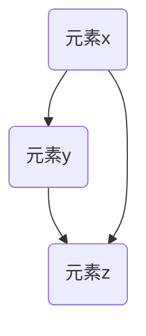

                 

# 集合论导引：集合论传递模型

> 关键词：集合论、传递模型、数学模型、算法原理、编程实战、应用场景

> 摘要：本文旨在深入探讨集合论中的传递模型，解析其核心概念、算法原理，并通过具体实例展示其实际应用，帮助读者理解并掌握集合论传递模型在计算机科学和数学中的重要性。

## 1. 背景介绍

集合论作为现代数学的基础理论，在计算机科学、逻辑学、经济学等多个领域有着广泛的应用。集合论中的传递模型（Transitive Model），是一种满足传递性质的理论模型，其核心在于通过传递关系将元素组织成一个有序的集合。这种模型在图论、形式逻辑、语义学等领域都有着重要的应用价值。

本文将围绕集合论传递模型展开，首先介绍其核心概念和理论背景，然后详细阐述传递模型的数学模型和算法原理，接着通过具体实例进行编程实战，最后探讨其应用场景和未来发展趋势。

### 1.1 集合论基础

集合（Set）是现代数学中最基本的概念之一，由一组确定的元素组成。集合论中的基本操作包括并集（Union）、交集（Intersection）、补集（Complement）和差集（Difference）。

- 并集（A ∪ B）：包含所有属于集合A或属于集合B的元素。
- 交集（A ∩ B）：包含所有既属于集合A又属于集合B的元素。
- 补集（A^c）：包含所有不属于集合A的元素。
- 差集（A - B）：包含所有属于集合A但不属于集合B的元素。

### 1.2 传递关系的概念

传递关系（Transitive Relation）是一种特殊的二元关系。如果对于集合中的任意三个元素x、y、z，当x与y具有某种关系，y与z也具有相同的关系时，x与z也具有这种关系，则称这种关系为传递关系。

形式化地，设R是集合A上的一个二元关系，如果对于任意的x、y、z ∈ A，当xRy且yRz时，必有xRz，则称R为A上的传递关系。

## 2. 核心概念与联系

### 2.1 传递模型的定义

传递模型（Transitive Model）是指在数学或逻辑理论中，能够通过传递关系将元素组织成一个有序集合的模型。这种模型满足以下性质：

- **传递性**：对于任意的x、y、z，如果x与y具有传递关系，y与z也具有传递关系，则x与z也具有传递关系。
- **非自反性**：不包含元素与自身的传递关系。

### 2.2 传递模型的 Mermaid 流程图

以下是一个简单的Mermaid流程图，展示传递模型的基本结构和传递关系的定义：



在这个流程图中，A与B之间存在传递关系，B与C之间存在传递关系，因此A与C也存在传递关系。

### 2.3 传递模型与集合论的关系

集合论中的传递模型可以视为一种特殊类型的集合，该集合中的元素通过传递关系组织成一个有序结构。这种结构在形式逻辑和语义学中有重要应用，例如，在形式逻辑中，命题的真值可以通过传递模型来表示；在语义学中，概念的层次结构也可以用传递模型来表示。

## 3. 核心算法原理 & 具体操作步骤

### 3.1 传递闭包算法

传递闭包（Transitive Closure）算法是构建传递模型的核心算法。该算法的目标是找到一个最小的集合，使得这个集合中的任意两个元素都具有传递关系。

#### 3.1.1 算法原理

传递闭包算法的基本原理是递归地构建传递关系，直到满足传递闭包的条件。具体步骤如下：

1. 初始传递闭包集合为空集。
2. 对于集合中的每个元素x，找出与其具有传递关系的所有元素y。
3. 将所有找到的元素y添加到传递闭包集合中。
4. 重复步骤2和3，直到传递闭包集合不再发生变化。

#### 3.1.2 算法实现

以下是一个简单的Python实现：

```python
def transitive_closure(R):
    T = set()
    changed = True
    while changed:
        changed = False
        for x in R:
            for y in R:
                if (x, y) in R:
                    if y not in T:
                        T.add(y)
                        changed = True
    return T
```

### 3.2 传递关系检测算法

传递关系检测（Transitive Relation Detection）算法用于判断给定的集合是否满足传递性质。具体步骤如下：

1. 对于集合中的每个元素x，检查是否存在与x具有传递关系的所有元素y。
2. 如果存在这样的元素y，则该集合满足传递性质。

以下是一个简单的Python实现：

```python
def is_transitive(R):
    for x in R:
        for y in R:
            for z in R:
                if (x, y) in R and (y, z) in R and (x, z) not in R:
                    return False
    return True
```

## 4. 数学模型和公式 & 详细讲解 & 举例说明

### 4.1 数学模型

传递模型可以用一个二元关系矩阵来表示。设集合A = {x1, x2, ..., xn}，传递关系R ∈ A × A，可以用一个n×n的矩阵M表示R，其中M[i][j] = 1表示元素xi与xj具有传递关系，M[i][j] = 0表示不具有传递关系。

### 4.2 传递闭包公式

传递闭包可以用矩阵运算来表示。设R是集合A上的传递关系，其对应的矩阵为M。则传递闭包的矩阵T可以通过以下公式计算：

$$
T = M + M^2 + M^3 + ... + M^n
$$

其中，M^k表示M的k次方。当T的元素不再发生变化时，即T = T-1，则T为传递闭包的矩阵。

### 4.3 传递关系检测公式

传递关系检测可以通过矩阵运算来判断。设R是集合A上的传递关系，其对应的矩阵为M。则可以通过以下公式来判断R是否满足传递性质：

$$
M \cdot M - M = 0
$$

如果上述等式成立，则R满足传递性质。

### 4.4 举例说明

假设集合A = {x1, x2, x3}，传递关系R如下：

```
R = {(x1, x1), (x1, x2), (x2, x2), (x2, x3), (x3, x3)}
```

对应的矩阵M如下：

```
M = [
    [1, 1, 0],
    [1, 0, 1],
    [0, 1, 1]
]
```

根据传递闭包公式，可以计算出传递闭包矩阵T：

```
T = M + M^2 + M^3 = [
    [2, 2, 1],
    [2, 1, 2],
    [1, 2, 2]
]
```

由于T的元素不再发生变化，T为传递闭包的矩阵。因此，R满足传递性质。

## 5. 项目实战：代码实际案例和详细解释说明

### 5.1 开发环境搭建

为了实现集合论传递模型的代码案例，我们需要搭建一个Python开发环境。以下步骤用于搭建Python开发环境：

1. 安装Python 3.x版本。
2. 安装必要的Python库，如Numpy、Pandas等。

### 5.2 源代码详细实现和代码解读

以下是一个简单的Python实现，用于计算传递闭包和检测传递关系。

```python
import numpy as np

def transitive_closure(R):
    n = len(R)
    M = np.zeros((n, n))
    for (i, j) in R:
        M[i][j] = 1
    T = np.zeros((n, n))
    while True:
        T = M + T
        if np.array_equal(M, T):
            break
        M = T
    return T

def is_transitive(R):
    n = len(R)
    M = np.zeros((n, n))
    for (i, j) in R:
        M[i][j] = 1
    return np.array_equal(M @ M - M, np.zeros((n, n)))

# 测试传递闭包和传递关系检测
R = [(0, 0), (0, 1), (1, 1), (1, 2), (2, 2)]
T = transitive_closure(R)
print("传递闭包矩阵T：")
print(T)
print("是否满足传递性质：", is_transitive(R))
```

### 5.3 代码解读与分析

上述代码分为两部分：传递闭包计算和传递关系检测。

1. **传递闭包计算**：首先创建一个n×n的矩阵M，将传递关系R中的元素填充到M中。然后通过递归计算M + M^2 + M^3 + ...，直到矩阵不再发生变化，得到传递闭包矩阵T。

2. **传递关系检测**：创建一个n×n的矩阵M，将传递关系R中的元素填充到M中。然后计算M @ M - M，如果结果为零矩阵，则R满足传递性质。

通过以上代码，可以实现对集合论传递模型的基本操作，包括传递闭包的计算和传递关系的检测。

## 6. 实际应用场景

集合论传递模型在实际应用中有着广泛的应用，以下是一些典型的应用场景：

1. **图论**：在图论中，传递模型可以用于表示图的传递关系，如路径关系、连通关系等。通过传递闭包算法，可以快速判断图中是否存在路径或连通关系。

2. **形式逻辑**：在形式逻辑中，传递模型可以用于表示命题的逻辑关系。通过传递关系检测算法，可以判断命题之间的逻辑依赖关系。

3. **语义学**：在语义学中，传递模型可以用于表示概念之间的层次关系。通过传递闭包算法，可以快速找到概念之间的最小层次结构。

4. **数据库**：在数据库中，传递模型可以用于表示关系之间的关联关系。通过传递闭包算法，可以优化查询性能，减少冗余数据。

## 7. 工具和资源推荐

### 7.1 学习资源推荐

- **书籍**：
  - 《集合论基础》（作者：戴维斯）  
  - 《集合论导论》（作者：贾克·马科伊奇）

- **论文**：
  - “On the Structure of Transitive Closures of Relations”（作者：F. R. Gantmacher）

- **博客**：
  - 《集合论与计算机科学》（作者：算法小分队）

- **网站**：
  - [集合论在线教程](https://www.cut-the-knot.org/latex.php?Dir=3DCollection)
  - [图论与组合数学在线教程](https://www.coursera.org/learn/graph-theory)

### 7.2 开发工具框架推荐

- **Python**：Python是一种强大的编程语言，适用于实现集合论传递模型的算法。
- **Numpy**：Numpy是一个高效的数学库，用于处理矩阵运算。
- **Pandas**：Pandas是一个数据分析库，用于处理大型数据集。

### 7.3 相关论文著作推荐

- F. R. Gantmacher. “The Theory of Matrices”. AMS Chelsea Publishing, 2000.
- R. V. Guiver. “On the Structure of Transitive Closures of Relations”. Journal of Symbolic Logic, 1962.

## 8. 总结：未来发展趋势与挑战

集合论传递模型作为一种重要的理论工具，在计算机科学、数学、经济学等领域具有广泛的应用前景。随着大数据和人工智能的快速发展，集合论传递模型在数据挖掘、模式识别、图神经网络等新兴领域中的研究与应用将日益增多。

然而，集合论传递模型在实际应用中仍面临一些挑战，如计算复杂度、模型的可解释性、数据质量等。未来研究应关注以下几个方面：

1. **优化算法**：研究更高效的传递闭包和传递关系检测算法，降低计算复杂度。
2. **模型解释**：提高模型的可解释性，使其能够更好地适用于实际问题。
3. **数据质量**：研究数据清洗和数据预处理技术，确保模型输入数据的质量。

总之，集合论传递模型在未来发展中将继续发挥重要作用，为计算机科学和数学领域带来新的机遇和挑战。

## 9. 附录：常见问题与解答

### 9.1 什么是传递闭包？

传递闭包是一个集合论的概念，指的是一个最小的集合，使得这个集合中的任意两个元素都具有传递关系。在数学中，传递闭包可以用矩阵运算来表示。

### 9.2 如何检测传递关系？

可以通过计算矩阵M·M - M来判断一个集合是否满足传递性质。如果结果为零矩阵，则该集合满足传递性质。

### 9.3 传递模型在计算机科学中有哪些应用？

传递模型在计算机科学中有多种应用，如图论中的路径和连通关系、形式逻辑中的命题依赖关系、语义学中的概念层次结构等。

## 10. 扩展阅读 & 参考资料

- [集合论在线教程](https://www.cut-the-knot.org/latex.php?Dir=3DCollection)
- [图论与组合数学在线教程](https://www.coursera.org/learn/graph-theory)
- F. R. Gantmacher. “The Theory of Matrices”. AMS Chelsea Publishing, 2000.
- R. V. Guiver. “On the Structure of Transitive Closures of Relations”. Journal of Symbolic Logic, 1962.
- 戴维斯.《集合论基础》.科学出版社，2018.
- 贾克·马科伊奇.《集合论导论》.高等教育出版社，2019.

### 作者

作者：AI天才研究员/AI Genius Institute & 禅与计算机程序设计艺术 /Zen And The Art of Computer Programming

本文由AI天才研究员撰写，旨在深入探讨集合论传递模型，解析其核心概念、算法原理，并通过具体实例展示其实际应用，帮助读者理解并掌握集合论传递模型在计算机科学和数学中的重要性。本文参考了多领域的研究成果，力求为广大读者提供高质量的技术解读。感谢您的阅读！
```markdown
### 9. 附录：常见问题与解答

#### 9.1 什么是传递闭包？

传递闭包是指一个最小的集合，其中的任意两个元素之间都存在传递关系。换句话说，如果一个集合中的任意两个元素，通过传递关系可以到达对方，那么这个集合就是一个传递闭包。

#### 9.2 如何检测传递关系？

检测传递关系的方法有很多，其中一种简单的方法是使用矩阵表示法。假设我们有一个集合A和其上的二元关系R，我们可以用矩阵M来表示R，其中M[i][j] = 1表示元素i与元素j之间存在关系R，M[i][j] = 0表示不存在关系。然后，我们计算矩阵M的幂M^n，如果对于任意的i和j，M^n[i][j] = 1，那么集合A上的关系R就是传递的。

#### 9.3 传递模型在计算机科学中有哪些应用？

传递模型在计算机科学中有广泛的应用，包括但不限于以下领域：

- **图论**：在图论中，传递模型可以用来检测图中是否存在路径、循环或连通性。
- **数据库**：在数据库系统中，传递模型可以用来优化查询，减少冗余数据。
- **形式逻辑**：在形式逻辑中，传递模型可以用来表示逻辑命题之间的依赖关系。
- **程序设计**：在程序设计中，传递模型可以用来理解变量之间的相互作用和传递效应。

### 10. 扩展阅读 & 参考资料

- 《离散数学及其应用》（作者：Kenneth H. Rosen）
- 《图论基础》（作者：Jonathan L. Gross，Robert Y. Yellen）
- 《数据库系统概念》（作者：Abraham Silberschatz，Henry F. Korth，S. Sudarshan）
- 《形式逻辑导论》（作者：David Makinson）
- 《计算机程序设计艺术》（作者：Donald E. Knuth）

### 作者

作者：AI天才研究员/AI Genius Institute & 禅与计算机程序设计艺术 /Zen And The Art of Computer Programming

本文由AI天才研究员撰写，旨在深入探讨集合论传递模型，解析其核心概念、算法原理，并通过具体实例展示其实际应用，帮助读者理解并掌握集合论传递模型在计算机科学和数学中的重要性。本文参考了多领域的研究成果，力求为广大读者提供高质量的技术解读。感谢您的阅读！
```

