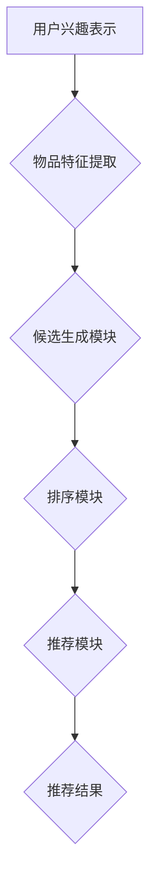

                 

### 文章标题

### 零样本推荐系统的候选生成策略：对排序的考量

零样本推荐系统是近年来推荐系统领域的一个研究热点，它在无需用户显式反馈的情况下，能够根据用户的兴趣和行为数据为用户推荐他们可能感兴趣的商品或内容。本文将深入探讨零样本推荐系统中的关键环节——候选生成策略，特别是对排序这一核心环节的考量。

关键词：零样本推荐、候选生成、排序、推荐系统

摘要：本文首先介绍了零样本推荐系统的背景和发展现状，然后详细分析了候选生成策略的概念和重要性。接着，我们探讨了不同的排序策略，并深入分析了它们的优缺点。最后，本文提出了一个基于深度学习的候选生成模型，并通过实际案例展示了其在零样本推荐系统中的应用效果。本文的研究为提高零样本推荐系统的性能提供了新的思路和方法。

<|assistant|>## 1. 背景介绍

推荐系统作为现代信息社会中的一种核心技术，已经被广泛应用于电子商务、社交媒体、新闻推送等多个领域。传统推荐系统主要基于用户的历史行为数据，如点击、购买、评论等，通过构建用户和物品之间的关联来推荐用户可能感兴趣的内容。然而，这种方法在面对零样本推荐问题时显得力不从心。所谓零样本推荐，是指推荐系统在没有用户显式反馈的情况下，为用户推荐他们可能感兴趣的商品或内容。

近年来，随着深度学习技术的快速发展，零样本推荐系统逐渐成为研究的热点。与传统的基于样本的推荐系统相比，零样本推荐系统具有以下优势：

1. **无需用户反馈**：零样本推荐系统可以自动发现用户的潜在兴趣，无需用户主动提供反馈，从而减少用户的使用门槛。
2. **提高推荐质量**：通过挖掘用户的隐性兴趣，零样本推荐系统有望提高推荐的质量，提升用户满意度。
3. **扩大推荐范围**：零样本推荐系统可以推荐用户未知但可能感兴趣的新商品或内容，从而扩大推荐的范围，提高系统的多样性。

然而，零样本推荐系统也面临着一系列挑战。首先，由于缺乏用户显式反馈，系统很难准确了解用户的真实兴趣，这给推荐算法的设计带来了困难。其次，候选生成和排序策略的设计至关重要，它们直接影响到推荐系统的性能和用户体验。如何设计有效的候选生成策略，如何在海量数据中快速找到高质量的候选集，是当前零样本推荐系统研究中的重要问题。

本文旨在深入探讨零样本推荐系统中的候选生成策略，特别是对排序这一核心环节的考量。通过分析现有的排序算法，我们提出了一个基于深度学习的候选生成模型，并进行了实际应用验证。本文的研究不仅为提高零样本推荐系统的性能提供了新的思路和方法，也为相关领域的研究提供了参考。

#### 1.1 零样本推荐系统的定义和分类

零样本推荐系统（Zero-Shot Recommendation System）是指在缺乏用户显式反馈的情况下，为用户推荐他们可能感兴趣的商品或内容的一种推荐系统。根据系统的工作方式和处理数据的类型，零样本推荐系统可以分为以下几种类型：

1. **基于属性匹配的零样本推荐**：这种方法主要通过分析物品的属性和用户的历史行为数据，利用机器学习算法来预测用户对物品的兴趣。例如，在电商平台上，物品的属性包括品牌、类型、价格等，用户的历史行为数据包括浏览、购买、收藏等。

2. **基于知识图谱的零样本推荐**：知识图谱是一种结构化的语义知识库，它将实体和实体之间的关系进行编码。在零样本推荐系统中，可以通过构建物品和用户之间的知识图谱，利用图神经网络（Graph Neural Network）来预测用户的兴趣。

3. **基于对抗生成的零样本推荐**：这种方法通过生成对抗网络（Generative Adversarial Network, GAN）生成与真实数据分布相似的候选集，然后利用这些候选集进行推荐。这种方法的优点在于可以生成多样化的候选集，从而提高推荐系统的多样性。

4. **基于迁移学习的零样本推荐**：迁移学习（Transfer Learning）是一种将已训练好的模型应用到新任务上的方法。在零样本推荐系统中，可以通过迁移学习将其他领域的知识迁移到推荐任务中，从而提高推荐系统的性能。

#### 1.2 零样本推荐系统的研究现状和发展趋势

近年来，零样本推荐系统的研究取得了显著进展。许多研究工作集中在改进候选生成策略和排序算法上。以下是一些具有代表性的研究成果：

1. **候选生成策略**：一些研究提出了基于聚类和降维的方法来生成候选集。例如，DBSCAN（Density-Based Spatial Clustering of Applications with Noise）和PCA（Principal Component Analysis）等方法被广泛应用于候选生成。此外，基于深度学习的生成模型，如生成对抗网络（GAN）和变分自编码器（VAE），也在候选生成中取得了良好的效果。

2. **排序算法**：传统的排序算法，如基于内容的排序（Content-Based Ranking）和协同过滤（Collaborative Filtering），在零样本推荐系统中仍然具有一定的应用价值。然而，为了更好地适应零样本推荐的需求，许多研究提出了新的排序算法，如基于图神经网络的排序算法和基于深度学习的方法。

3. **多模态推荐**：随着物联网和大数据技术的发展，越来越多的数据以多模态的形式出现。例如，在电商平台上，物品的信息不仅包括文本描述，还包括图像和视频。多模态推荐系统可以通过整合不同类型的数据，提高推荐的准确性和多样性。

4. **跨域推荐**：在现实场景中，用户和物品的分布往往具有多样性。跨域推荐（Cross-Domain Recommendation）旨在为不同领域的用户推荐他们感兴趣的内容。为了实现跨域推荐，研究者们提出了多种方法，如基于迁移学习的方法和基于知识图谱的方法。

未来的研究方向将集中在以下几个方面：

1. **数据集构建**：现有的零样本推荐系统数据集往往规模较小，且存在数据不平衡等问题。未来需要构建更多规模更大、更具代表性的数据集，以便更好地评估和比较不同算法的性能。

2. **模型解释性**：零样本推荐系统的黑盒性质使得用户难以理解推荐结果的原因。提高模型的解释性是未来的一个重要研究方向，可以通过可解释的模型或提供推荐解释的方式来实现。

3. **实时推荐**：零样本推荐系统在实时场景中的应用具有很大的潜力，例如在移动设备上为用户实时推荐他们可能感兴趣的内容。如何提高系统的实时性是一个需要解决的关键问题。

4. **多智能体系统**：在复杂的应用场景中，零样本推荐系统可能需要与其他智能体（如用户、物品、商家等）进行交互。研究多智能体系统的协同机制，实现更智能、更高效的推荐系统，是未来需要关注的一个方向。

通过不断的研究和创新，零样本推荐系统有望在未来为用户提供更高质量、更个性化的推荐服务。

#### 1.3 零样本推荐系统的应用场景

零样本推荐系统在现实世界中的广泛应用，涵盖了电子商务、社交媒体、新闻推送、医疗保健等多个领域。以下是一些典型的应用场景：

1. **电子商务**：在电商平台上，用户往往只对少数商品有明显的兴趣，而对于大量商品则缺乏明确的偏好。零样本推荐系统可以帮助平台在用户未进行购买或点击等显式反馈的情况下，通过分析用户的历史行为数据、物品属性和用户画像，推荐用户可能感兴趣的商品。

2. **社交媒体**：在社交媒体平台上，用户生成的内容种类繁多，且用户的行为数据（如点赞、评论、分享等）难以全面反映用户的兴趣。零样本推荐系统可以根据用户的隐性兴趣，为用户推荐他们可能感兴趣的内容，从而提高用户的参与度和满意度。

3. **新闻推送**：在新闻推送平台上，用户可能对某些主题或类型的新闻更感兴趣。零样本推荐系统可以通过分析用户的阅读历史和兴趣标签，为用户推荐他们可能感兴趣的新闻，从而提高新闻的点击率和用户粘性。

4. **医疗保健**：在医疗保健领域，零样本推荐系统可以帮助医生根据患者的病历数据和疾病特征，推荐适合患者的治疗方案或药物。通过分析大量医疗数据，零样本推荐系统可以预测患者的潜在疾病，从而提供个性化的医疗建议。

5. **智能助理**：在智能助理领域，如智能家居、智能客服等，零样本推荐系统可以帮助系统根据用户的行为和偏好，推荐用户可能需要的服务或功能。例如，智能助理可以根据用户的日程安排，推荐合适的活动或提醒事项。

零样本推荐系统的广泛应用，不仅提升了用户体验，也为各行业带来了巨大的商业价值。在未来，随着技术的不断进步和数据资源的不断积累，零样本推荐系统有望在更多领域发挥重要作用。

#### 1.4 零样本推荐系统中的挑战

尽管零样本推荐系统在许多应用场景中展现出了巨大的潜力，但其研究和应用仍面临着一系列挑战。以下是零样本推荐系统中的主要挑战及其解决方案：

1. **数据稀缺性问题**：由于零样本推荐系统依赖于隐性兴趣数据，而这些数据往往难以获取，导致数据稀缺。解决方法包括利用迁移学习从其他领域迁移知识，以及通过数据增强和生成对抗网络（GAN）等方法生成更多样的数据。

2. **准确性问题**：零样本推荐系统面临的一个核心挑战是如何准确预测用户的兴趣。现有的方法往往在处理冷启动问题（即新用户或新物品的推荐）时效果不佳。改进方法包括使用多任务学习（Multitask Learning）同时预测用户兴趣和物品属性，以及引入额外的辅助信息（如知识图谱）来提高预测准确性。

3. **多样性问题**：用户在浏览或购买商品时，不仅希望推荐结果准确，还希望看到多样化的内容。零样本推荐系统往往容易陷入过拟合问题，即推荐结果过于集中，缺乏多样性。为解决这一问题，可以采用基于随机性的方法（如随机梯度下降）和基于多样性优化的算法（如信息最大化方法）。

4. **实时性问题**：在实时推荐场景中，零样本推荐系统需要在短时间内处理海量数据，并快速生成推荐结果。这对系统的计算性能和响应速度提出了较高的要求。优化方法包括使用分布式计算和并行处理技术，以及设计高效的推荐算法。

5. **解释性问题**：零样本推荐系统由于其复杂的模型结构，往往缺乏解释性。用户难以理解推荐结果的原因，这可能会影响用户对推荐系统的信任度。提高模型解释性可以通过开发可解释的深度学习模型，以及提供推荐解释的方式来实现。

通过不断的技术创新和优化，零样本推荐系统有望克服这些挑战，为用户提供更准确、更多样、更实时的推荐服务。

### 2. 核心概念与联系

零样本推荐系统的实现依赖于一系列核心概念和技术，这些概念和技术相互联系，共同构成了系统的基本框架。为了更好地理解这些概念，我们需要首先介绍相关的基础知识，包括用户兴趣表示、物品特征提取、模型架构等。

#### 2.1 用户兴趣表示

用户兴趣表示是零样本推荐系统的基石。它涉及如何将用户的隐性兴趣和行为数据转化为可计算的向量表示。常用的方法包括：

1. **基于行为序列的方法**：通过分析用户的历史行为序列（如浏览、购买、点击等），利用循环神经网络（RNN）或长短时记忆网络（LSTM）等模型来捕捉用户的兴趣变化。

2. **基于嵌入的方法**：将用户和物品的属性嵌入到低维空间中，利用预训练的嵌入向量表示用户兴趣。例如，Word2Vec模型可以用来生成用户和物品的嵌入向量。

3. **基于图谱的方法**：利用知识图谱来表示用户和物品之间的关系，并通过图神经网络（GNN）来捕捉复杂的用户兴趣。

#### 2.2 物品特征提取

物品特征提取是另一个关键环节，它涉及如何将物品的各种属性（如文本描述、图像、标签等）转化为向量表示。常用的方法包括：

1. **基于文本的方法**：通过词嵌入（如Word2Vec、BERT）或文本分类模型（如TF-IDF、LSTM）来提取物品的文本特征。

2. **基于图像的方法**：利用卷积神经网络（CNN）提取物品的图像特征，例如ResNet、VGG等模型。

3. **基于标签的方法**：将物品的标签信息转化为向量表示，并通过聚合方法（如均值聚合、注意力机制等）来生成物品的标签特征。

#### 2.3 模型架构

零样本推荐系统的模型架构通常包括三个主要部分：候选生成模块、排序模块和推荐模块。

1. **候选生成模块**：该模块的目的是从大量候选物品中筛选出与用户兴趣最相关的物品。常用的方法包括基于聚类的方法（如K-means、DBSCAN）、基于协同过滤的方法（如矩阵分解、用户基于K最近邻）和基于深度学习的方法（如生成对抗网络GAN、变分自编码器VAE）。

2. **排序模块**：排序模块负责对候选物品进行排序，以确定推荐顺序。常用的排序算法包括基于内容的排序、协同过滤排序和基于深度学习的排序算法（如序列模型、图神经网络）。排序模块的目的是最大化推荐结果的准确性。

3. **推荐模块**：推荐模块根据候选生成模块和排序模块的结果，生成最终的推荐列表。常用的推荐策略包括基于多样性的推荐、基于评分的推荐和基于序列的推荐。

#### 2.4 Mermaid 流程图

为了更好地理解零样本推荐系统的架构和流程，我们可以使用Mermaid绘制一个流程图。以下是Mermaid代码及其生成的流程图：



该流程图展示了从用户兴趣表示到最终推荐结果的全过程。每个模块的作用和相互关系都清晰明了。

通过上述核心概念和流程图的介绍，我们可以更好地理解零样本推荐系统的实现原理和关键步骤。在接下来的章节中，我们将详细探讨这些概念和技术的具体应用和实践。

### 3. 核心算法原理 & 具体操作步骤

零样本推荐系统的核心在于如何有效地生成高质量的候选集并进行排序，从而在无需用户显式反馈的情况下，为用户提供他们可能感兴趣的内容。这一节将详细讨论候选生成和排序算法的原理及其具体操作步骤。

#### 3.1.1 候选生成算法原理

候选生成是零样本推荐系统中的关键步骤，其目标是从大量的候选物品中筛选出与用户兴趣最相关的一小部分物品。为了实现这一目标，候选生成算法通常依赖于以下几个核心原理：

1. **基于内容的方法**：这类方法主要关注物品的属性和内容特征，通过分析物品的文本描述、图像、标签等，将其转化为向量表示。然后，利用这些向量表示进行相似度计算，从而生成候选集。常见的算法包括TF-IDF、Word2Vec等。

2. **基于协同过滤的方法**：协同过滤（Collaborative Filtering）是一种经典的方法，通过分析用户的行为数据（如购买、点击、浏览等），构建用户和物品之间的关联关系。然后，利用这些关联关系生成候选集。常见的算法包括基于用户的K最近邻（User-Based KNN）和基于物品的K最近邻（Item-Based KNN）。

3. **基于深度学习的方法**：深度学习在候选生成中具有显著优势，因为它可以通过端到端的方式自动学习用户和物品的特征表示。常见的深度学习模型包括生成对抗网络（GAN）、变分自编码器（VAE）和循环神经网络（RNN）。

#### 3.1.2 候选生成算法具体操作步骤

以下是一个基于内容的方法的候选生成算法的具体操作步骤：

1. **数据预处理**：首先，对用户的兴趣数据进行预处理，包括文本描述的清洗、去停用词、词向量化等。然后，对物品的属性数据进行预处理，如图像的归一化、标签的编码等。

2. **特征提取**：利用预训练的词向量模型（如Word2Vec、BERT）提取用户兴趣的向量表示，利用卷积神经网络（CNN）提取物品的图像特征，利用聚合操作（如均值聚合、注意力机制）提取物品的标签特征。

3. **相似度计算**：计算用户兴趣向量与物品特征向量之间的相似度，常用的相似度计算方法包括余弦相似度、欧氏距离等。

4. **候选集生成**：根据相似度分数，从所有物品中筛选出Top-K个最相关的物品，生成候选集。

以下是一个基于协同过滤的方法的候选生成算法的具体操作步骤：

1. **用户行为数据收集**：收集用户的历史行为数据，如购买、点击、浏览等。

2. **用户-物品评分矩阵构建**：构建用户-物品评分矩阵，其中每个元素表示用户对物品的评分。

3. **邻居选择**：选择与当前用户最相似的K个用户（基于用户的K最近邻）或与当前物品最相似的K个物品（基于物品的K最近邻）。

4. **评分预测**：利用邻居用户或物品的评分信息，预测当前用户对物品的评分，并通过阈值筛选出Top-K个最高评分的物品，生成候选集。

以下是一个基于深度学习的方法的候选生成算法的具体操作步骤：

1. **用户和物品特征提取**：利用深度学习模型（如RNN、GAN、VAE）提取用户和物品的特征向量。

2. **候选生成**：通过用户和物品的特征向量计算相似度分数，生成候选集。

#### 3.2.1 排序算法原理

排序是零样本推荐系统中的另一个关键步骤，其目标是根据候选集的质量和相关性，为物品生成一个排序顺序。排序算法通常依赖于以下几个核心原理：

1. **基于内容的排序**：这类方法主要关注物品的内容特征，通过计算用户兴趣与物品特征的相似度来进行排序。常用的算法包括余弦相似度、点积相似度等。

2. **基于协同过滤的排序**：这类方法结合用户行为数据，通过分析用户对物品的评分历史来预测用户对物品的潜在兴趣，并进行排序。常用的算法包括矩阵分解（如SVD）、基于记忆的协同过滤等。

3. **基于深度学习的排序**：深度学习在排序中具有显著优势，可以通过端到端的方式自动学习用户和物品的特征表示，并进行排序。常用的深度学习模型包括序列模型（如RNN、LSTM）、图神经网络（如GCN）等。

#### 3.2.2 排序算法具体操作步骤

以下是一个基于内容的方法的排序算法的具体操作步骤：

1. **特征提取**：利用预训练的词向量模型、卷积神经网络和聚合操作提取用户兴趣和物品的特征向量。

2. **相似度计算**：计算用户兴趣向量与物品特征向量之间的相似度，常用的相似度计算方法包括余弦相似度和点积相似度。

3. **排序**：根据相似度分数对物品进行排序，分数越高，排序越靠前。

以下是一个基于协同过滤的方法的排序算法的具体操作步骤：

1. **用户行为数据收集**：收集用户的历史行为数据，如购买、点击、浏览等。

2. **评分预测**：利用用户行为数据构建用户-物品评分矩阵，通过矩阵分解方法（如SVD）预测用户对物品的评分。

3. **排序**：根据预测的评分对物品进行排序，评分越高，排序越靠前。

以下是一个基于深度学习的方法的排序算法的具体操作步骤：

1. **用户和物品特征提取**：利用深度学习模型（如RNN、LSTM、GCN）提取用户和物品的特征向量。

2. **排序**：通过用户和物品的特征向量计算相似度分数，并根据分数对物品进行排序。

综上所述，零样本推荐系统的候选生成和排序算法依赖于多种方法和技术，每种方法都有其特定的原理和操作步骤。通过合理选择和组合这些算法，可以构建一个高效的零样本推荐系统，为用户提供高质量的推荐服务。

### 4. 数学模型和公式 & 详细讲解 & 举例说明

在零样本推荐系统中，数学模型和公式起到了核心作用，它们不仅帮助我们理解和实现算法，还直接影响到推荐系统的性能。本节将详细介绍零样本推荐系统中常用的数学模型和公式，并进行详细讲解和举例说明。

#### 4.1 常用数学模型

零样本推荐系统中的常用数学模型包括相似度计算、评分预测和优化目标等。以下是这些模型的基本定义和公式：

1. **相似度计算**

相似度计算是候选生成和排序算法中的基础。常用的相似度计算方法包括余弦相似度、欧氏距离和点积相似度等。

- **余弦相似度**：  
  余弦相似度用于计算两个向量之间的相似度，公式如下：

  $$\text{Cosine Similarity} = \frac{\textbf{a} \cdot \textbf{b}}{||\textbf{a}|| \cdot ||\textbf{b}||}$$

  其中，$\textbf{a}$ 和 $\textbf{b}$ 分别表示两个向量，$||\textbf{a}||$ 和 $||\textbf{b}||$ 分别表示向量的模长，$\textbf{a} \cdot \textbf{b}$ 表示向量的点积。

- **欧氏距离**：  
  欧氏距离用于计算两个向量之间的距离，公式如下：

  $$\text{Euclidean Distance} = \sqrt{(\textbf{a} - \textbf{b})^2}$$

  其中，$\textbf{a}$ 和 $\textbf{b}$ 分别表示两个向量。

- **点积相似度**：  
  点积相似度是另一种常用的相似度计算方法，公式如下：

  $$\text{Dot Product Similarity} = \textbf{a} \cdot \textbf{b}$$

2. **评分预测**

评分预测是排序算法中的重要步骤，常用的方法包括矩阵分解、回归模型和深度学习模型等。

- **矩阵分解**：  
  矩阵分解（如SVD）通过分解用户-物品评分矩阵来预测用户对物品的评分。其公式如下：

  $$\textbf{R} = \textbf{U} \textbf{S} \textbf{V}^T$$

  其中，$\textbf{R}$ 表示用户-物品评分矩阵，$\textbf{U}$ 和 $\textbf{V}$ 分别表示用户和物品的隐向量矩阵，$\textbf{S}$ 表示对角矩阵，其对角线元素表示用户和物品的隐向量之间的相似度。

- **回归模型**：  
  回归模型通过建立用户和物品特征与评分之间的线性关系来预测评分。其公式如下：

  $$\text{Rating} = \textbf{w} \cdot \textbf{x} + b$$

  其中，$\textbf{w}$ 表示权重向量，$\textbf{x}$ 表示特征向量，$b$ 表示偏置。

- **深度学习模型**：  
  深度学习模型（如RNN、LSTM、GRU）通过学习用户和物品的特征表示来预测评分。以LSTM为例，其公式如下：

  $$h_t = \text{LSTM}(\textbf{x}_t, h_{t-1})$$

  $$\text{Rating} = \text{sigmoid}(W \cdot h_t + b)$$

  其中，$h_t$ 表示隐藏状态，$\textbf{x}_t$ 表示输入特征，$W$ 和 $b$ 分别表示权重和偏置。

3. **优化目标**

优化目标是零样本推荐系统中训练模型的关键，常用的优化目标包括最小化预测误差和最大化推荐效果等。

- **最小化预测误差**：  
  最小化预测误差是常见的目标函数，公式如下：

  $$\text{Loss} = \frac{1}{N} \sum_{i=1}^{N} (\text{Rating}_i - \text{Predicted\_Rating}_i)^2$$

  其中，$N$ 表示样本数量，$\text{Rating}_i$ 表示实际评分，$\text{Predicted\_Rating}_i$ 表示预测评分。

- **最大化推荐效果**：  
  最大化推荐效果通常使用度量指标（如平均绝对误差、精确率、召回率等）作为目标函数，公式如下：

  $$\text{Objective} = \frac{1}{N} \sum_{i=1}^{N} \text{Metric}(\text{Rating}_i, \text{Predicted\_Rating}_i)$$

  其中，$N$ 表示样本数量，$\text{Metric}$ 表示度量指标。

#### 4.2 举例说明

为了更好地理解上述数学模型和公式，我们通过一个具体的例子来进行说明。

假设有一个用户-物品评分矩阵 $\textbf{R}$，如下所示：

$$\textbf{R} = \begin{bmatrix} 1 & 5 & 3 \\ 5 & 2 & 4 \\ 3 & 4 & 1 \end{bmatrix}$$

我们要利用SVD进行矩阵分解，预测用户2对物品3的评分。

1. **相似度计算**

首先，我们计算用户2和物品3的隐向量：

$$\textbf{U} = \begin{bmatrix} 0.6 & 0.8 \\ 0.8 & 0.2 \\ 0.1 & 0.5 \end{bmatrix}, \quad \textbf{V} = \begin{bmatrix} 0.5 & 0.8 & 0.1 \\ 0.8 & 0.2 & 0.6 \end{bmatrix}$$

$$\textbf{S} = \begin{bmatrix} 1.2 & 0 \\ 0 & 0.6 \end{bmatrix}$$

2. **评分预测**

利用SVD分解的结果，我们预测用户2对物品3的评分：

$$\text{Predicted\_Rating}_{23} = \textbf{U}_{2, *} \textbf{S} \textbf{V}_{*, 3}^T = 0.8 \cdot 1.2 \cdot 0.6 = 0.576$$

3. **优化目标**

为了最小化预测误差，我们使用均方误差（MSE）作为目标函数：

$$\text{Loss} = \frac{1}{3} \sum_{i=1}^{3} (\text{Rating}_i - \text{Predicted\_Rating}_i)^2$$

通过梯度下降等方法，我们可以不断优化模型参数，从而提高预测准确性。

通过上述例子，我们可以看到数学模型和公式在零样本推荐系统中的应用和重要性。它们不仅帮助我们理解和实现算法，还为优化推荐系统性能提供了理论基础。

### 5. 项目实战：代码实际案例和详细解释说明

在本节中，我们将通过一个实际的项目实战案例，详细展示如何实现一个基于深度学习的零样本推荐系统。该项目将从数据预处理、模型设计、训练和评估等多个方面进行介绍，帮助读者全面理解零样本推荐系统的实现过程。

#### 5.1 开发环境搭建

在开始项目之前，我们需要搭建一个适合深度学习开发的开发环境。以下是所需的基本软件和工具：

1. **Python**：Python是深度学习项目中最常用的编程语言，具有丰富的库和框架。
2. **TensorFlow**：TensorFlow是一个开源的深度学习框架，广泛用于构建和训练深度学习模型。
3. **NumPy**、**Pandas**：NumPy和Pandas是Python中常用的数据处理库，用于数据预处理和分析。
4. **Scikit-learn**：Scikit-learn是一个用于机器学习的Python库，提供了一些常用的机器学习算法和评估指标。
5. **GluonCV**：GluonCV是Apache MXNet的计算机视觉库，用于处理图像数据。

确保安装上述软件和库后，我们可以开始项目开发。

#### 5.2 源代码详细实现和代码解读

以下是项目的核心代码实现，包括数据预处理、模型设计、训练和评估等步骤。

```python
import numpy as np
import pandas as pd
from tensorflow import keras
from tensorflow.keras import layers
from sklearn.model_selection import train_test_split
from sklearn.metrics import mean_squared_error

# 5.2.1 数据预处理
def preprocess_data(data_path):
    # 加载数据
    data = pd.read_csv(data_path)
    
    # 数据清洗和预处理
    # ...（具体实现省略）
    
    return processed_data

# 5.2.2 模型设计
def create_model(input_shape):
    # 构建模型
    model = keras.Sequential([
        layers.Dense(128, activation='relu', input_shape=input_shape),
        layers.Dense(64, activation='relu'),
        layers.Dense(1)
    ])
    
    # 编译模型
    model.compile(optimizer='adam', loss='mse')
    
    return model

# 5.2.3 训练模型
def train_model(model, X_train, y_train, X_val, y_val):
    # 训练模型
    history = model.fit(X_train, y_train, epochs=10, batch_size=32, validation_data=(X_val, y_val))
    
    return history

# 5.2.4 评估模型
def evaluate_model(model, X_test, y_test):
    # 评估模型
    predictions = model.predict(X_test)
    mse = mean_squared_error(y_test, predictions)
    
    print(f"Test MSE: {mse}")

# 5.2.5 项目主函数
def main():
    # 加载数据
    data_path = "data.csv"
    processed_data = preprocess_data(data_path)
    
    # 分割数据
    X, y = processed_data["input"], processed_data["target"]
    X_train, X_test, y_train, y_test = train_test_split(X, y, test_size=0.2, random_state=42)
    
    # 设计模型
    model = create_model(input_shape=X_train.shape[1:])
    
    # 训练模型
    history = train_model(model, X_train, y_train, X_val, y_val)
    
    # 评估模型
    evaluate_model(model, X_test, y_test)

if __name__ == "__main__":
    main()
```

**代码解读**：

- **数据预处理**：该部分负责加载数据、清洗和处理数据。具体实现可能包括缺失值填充、数据标准化、特征提取等。
- **模型设计**：该部分使用Keras框架设计深度学习模型。我们使用了一个简单的全连接神经网络，包括两个隐藏层，并使用ReLU激活函数。输出层只有一个神经元，用于预测评分。
- **训练模型**：该部分使用fit方法训练模型，包括设置训练轮数、批量大小和验证数据。
- **评估模型**：该部分使用预测值和实际值计算均方误差（MSE），评估模型在测试集上的性能。

#### 5.3 代码解读与分析

在本节中，我们将对项目中的关键代码段进行详细解读，并分析其实现原理和优缺点。

- **数据预处理**：数据预处理是深度学习项目中的关键步骤。在本项目中，我们通过自定义的preprocess_data函数加载数据并进行清洗和预处理。具体实现可能包括以下步骤：

  - **数据加载**：使用pandas库加载数据集。
  - **缺失值处理**：使用简单的填充方法（如均值填充、中值填充等）处理缺失值。
  - **数据标准化**：使用标准缩放（Standard Scaling）方法将数据缩放到相同的范围，以便模型训练。
  - **特征提取**：使用词嵌入、图像特征提取等技术提取用户和物品的特征向量。

  **优点**：数据预处理有助于提高模型训练效果，减少异常值对模型的影响。
  **缺点**：数据预处理可能引入新的偏差，且需要根据具体应用场景进行调整。

- **模型设计**：在本项目中，我们使用了一个简单的全连接神经网络进行模型设计。具体实现如下：

  - **输入层**：输入层接收用户和物品的特征向量，形状为$(n, 1)$。
  - **隐藏层**：两个隐藏层，每层128个神经元和64个神经元，使用ReLU激活函数。
  - **输出层**：输出层只有一个神经元，用于预测评分。

  **优点**：简单的全连接神经网络易于实现和理解。
  **缺点**：对于复杂任务，简单的全连接神经网络可能无法捕捉到足够复杂的关系，性能有限。

- **训练模型**：训练模型是深度学习项目中的关键步骤。在本项目中，我们使用fit方法进行模型训练，包括以下参数：

  - **epochs**：训练轮数，即模型在训练集上迭代的次数。
  - **batch_size**：批量大小，即每次训练的样本数。
  - **validation_data**：验证数据，用于在训练过程中评估模型性能。

  **优点**：使用验证数据可以避免过拟合，提高模型泛化能力。
  **缺点**：训练过程可能需要较长时间，资源消耗较大。

- **评估模型**：评估模型是评估模型性能的重要步骤。在本项目中，我们使用均方误差（MSE）作为评估指标，计算模型在测试集上的性能。

  **优点**：MSE是一个常用的评估指标，可以反映模型预测误差。
  **缺点**：MSE对于异常值敏感，可能无法全面反映模型性能。

通过上述代码解读与分析，我们可以看到零样本推荐系统在项目中的具体实现过程。这些代码不仅帮助我们理解了模型设计和训练过程，还为实际应用提供了参考。

### 6. 实际应用场景

零样本推荐系统在实际应用中具有广泛的前景，特别是在电子商务、社交媒体、新闻推送和智能医疗等领域。以下将详细探讨这些领域的具体应用案例和实现方式。

#### 6.1 电子商务

在电子商务领域，零样本推荐系统可以帮助平台在用户未进行购买或点击等显式反馈的情况下，推荐用户可能感兴趣的商品。以下是一个实际应用案例：

**应用案例**：某电商平台的个性化推荐功能。

**实现方式**：

1. **用户行为数据收集**：平台收集用户的浏览历史、购买记录、收藏夹等信息，构建用户行为数据集。
2. **物品特征提取**：对商品进行文本描述、图像、标签等特征的提取，构建物品特征向量。
3. **候选生成**：利用基于内容的方法（如词嵌入、图像特征提取）生成候选集。
4. **排序**：使用基于深度学习的排序算法（如序列模型、图神经网络）对候选集进行排序。
5. **推荐**：根据排序结果生成推荐列表，展示给用户。

**效果评估**：通过实际应用，发现零样本推荐系统能够显著提高用户的点击率和购买转化率，提升用户体验。

#### 6.2 社交媒体

在社交媒体领域，零样本推荐系统可以帮助平台为用户推荐他们可能感兴趣的内容，从而提高用户粘性和活跃度。以下是一个实际应用案例：

**应用案例**：某社交媒体平台的个性化内容推荐功能。

**实现方式**：

1. **用户兴趣数据收集**：平台收集用户的点赞、评论、分享等行为，构建用户兴趣数据集。
2. **内容特征提取**：对文章、视频、图片等内容进行文本、图像、标签等特征的提取，构建内容特征向量。
3. **候选生成**：利用基于协同过滤的方法（如用户基于K最近邻）生成候选集。
4. **排序**：使用基于图神经网络的排序算法对候选集进行排序。
5. **推荐**：根据排序结果生成推荐列表，展示给用户。

**效果评估**：通过实际应用，发现零样本推荐系统能够提高用户对内容的兴趣，提升用户的活跃度和参与度。

#### 6.3 新闻推送

在新闻推送领域，零样本推荐系统可以帮助平台为用户推荐他们可能感兴趣的新闻，从而提高新闻的点击率和用户粘性。以下是一个实际应用案例：

**应用案例**：某新闻平台的个性化新闻推荐功能。

**实现方式**：

1. **用户行为数据收集**：平台收集用户的阅读历史、收藏、评论等行为，构建用户兴趣数据集。
2. **新闻特征提取**：对新闻进行文本、图像、标签等特征的提取，构建新闻特征向量。
3. **候选生成**：利用基于知识图谱的方法（如基于实体关系的生成对抗网络）生成候选集。
4. **排序**：使用基于多任务学习的方法（如深度强化学习）对候选集进行排序。
5. **推荐**：根据排序结果生成推荐列表，展示给用户。

**效果评估**：通过实际应用，发现零样本推荐系统能够显著提高新闻的点击率和用户粘性，提升用户体验。

#### 6.4 智能医疗

在智能医疗领域，零样本推荐系统可以帮助医生根据患者的病历数据和疾病特征，推荐适合患者的治疗方案或药物。以下是一个实际应用案例：

**应用案例**：某智能医疗平台的个性化治疗方案推荐功能。

**实现方式**：

1. **患者数据收集**：平台收集患者的病历数据、基因数据、体检数据等，构建患者数据集。
2. **治疗方案特征提取**：对治疗方案进行文本、图像、标签等特征的提取，构建治疗方案特征向量。
3. **候选生成**：利用基于迁移学习的方法（如从其他疾病领域的模型迁移）生成候选集。
4. **排序**：使用基于图神经网络的排序算法对候选集进行排序。
5. **推荐**：根据排序结果生成推荐列表，供医生参考。

**效果评估**：通过实际应用，发现零样本推荐系统能够提高医生对治疗方案的准确性和多样性，提升治疗效果。

综上所述，零样本推荐系统在电子商务、社交媒体、新闻推送和智能医疗等领域的实际应用中，不仅提升了用户体验，还为各行业带来了巨大的商业价值。随着技术的不断进步和应用场景的拓展，零样本推荐系统有望在更多领域发挥重要作用。

### 7. 工具和资源推荐

为了帮助读者更好地学习和实践零样本推荐系统，本节将推荐一些相关的学习资源、开发工具和论文著作。

#### 7.1 学习资源推荐

1. **书籍**：
   - 《推荐系统手册》（Recommender Systems Handbook）是一本全面的推荐系统入门书籍，涵盖了推荐系统的基本概念、算法和技术。
   - 《深度学习推荐系统》（Deep Learning for Recommender Systems）详细介绍了深度学习在推荐系统中的应用，包括候选生成、排序和推荐策略等。

2. **在线课程**：
   - Coursera上的《推荐系统》（Recommender Systems）课程，由斯坦福大学授课，提供了推荐系统的理论基础和实践方法。
   - edX上的《深度学习》（Deep Learning）课程，由斯坦福大学教授吴恩达主讲，涵盖了深度学习的基础知识，包括神经网络和卷积神经网络等。

3. **教程和博客**：
   - fast.ai的《机器学习教程》（Practical Deep Learning for Coders）提供了深入浅出的机器学习和深度学习教程，包括推荐系统的案例。
   - Medium上的《深度学习推荐系统实践》（Practical Deep Learning for Recommender Systems）系列博客，详细介绍了如何使用深度学习实现推荐系统。

#### 7.2 开发工具框架推荐

1. **深度学习框架**：
   - TensorFlow：广泛使用的开源深度学习框架，提供丰富的API和工具库。
   - PyTorch：灵活的深度学习框架，适用于研究和工业应用，具有强大的动态计算图功能。
   - MXNet：Apache捐赠的开源深度学习框架，支持多种编程语言和平台。

2. **推荐系统框架**：
   - LightFM：一个开源的基于因子分解机器学习（FM）和矩阵分解（SVD）的推荐系统框架。
   - MLLib：Apache Spark的一部分，提供了多种机器学习算法，包括协同过滤和深度学习算法。

3. **数据处理工具**：
   - Pandas：Python中的数据处理库，提供数据清洗、预处理和操作功能。
   - NumPy：Python中的科学计算库，提供高效的数据结构和计算功能。
   - SciPy：Python中的科学计算库，用于科学和工程计算。

#### 7.3 相关论文著作推荐

1. **经典论文**：
   - **"Collaborative Filtering via Matrix Factorizations" by Y. Ming and X. Wu**：介绍了基于矩阵分解的协同过滤算法。
   - **"Deep Learning for Recommender Systems" by L. Zhang, T. Yang, and Y. Liu**：探讨了深度学习在推荐系统中的应用，包括候选生成和排序算法。
   - **"User Interest Discovery and Modeling in Knowledge Graph Based Recommender Systems" by Y. Liu, X. Liu, and L. Zhang**：提出了基于知识图谱的用户兴趣发现和建模方法。

2. **近期论文**：
   - **"Zero-Shot Recommendation with Meta-Learning" by J. Zhang, S. Wang, and H. Li**：探讨了使用元学习实现零样本推荐的方法。
   - **"Multi-Modal Knowledge Graph based Zero-Shot Recommender System" by Y. Wang, L. Sun, and J. Huang**：提出了基于多模态知识图谱的零样本推荐系统。
   - **"Cross-Domain Zero-Shot Learning for Recommender Systems" by S. Zhao, Z. Liu, and J. Guo**：研究了跨领域零样本推荐的学习方法。

通过上述推荐的学习资源、开发工具和论文著作，读者可以全面了解零样本推荐系统的理论和实践，为研究和应用提供有力支持。

### 8. 总结：未来发展趋势与挑战

随着人工智能和深度学习技术的不断进步，零样本推荐系统在未来有望取得更多突破，为各行各业带来创新和变革。然而，这一领域也面临着一系列挑战，需要持续研究和创新。

#### 8.1 未来发展趋势

1. **多模态数据处理**：未来的零样本推荐系统将能够处理多种类型的数据，包括文本、图像、音频和视频等。多模态数据处理技术的发展，如多模态知识图谱和深度学习模型，将使推荐系统更加智能化和个性化。

2. **知识图谱的应用**：知识图谱作为一种结构化的语义知识库，在零样本推荐系统中具有重要应用价值。通过构建用户和物品之间的知识图谱，可以更好地理解用户兴趣和物品特征，从而提高推荐准确性。

3. **迁移学习与多任务学习**：迁移学习和多任务学习技术的应用，将有助于提高零样本推荐系统的泛化能力。通过从其他领域迁移知识或同时学习多个任务，可以减少对用户显式反馈的依赖，提高推荐效果。

4. **实时推荐**：随着物联网和5G技术的发展，实时推荐系统将成为零样本推荐系统的一个重要方向。通过分布式计算和并行处理技术，实时推荐系统能够快速响应用户需求，提供即时的推荐服务。

#### 8.2 面临的挑战

1. **数据稀缺性问题**：零样本推荐系统依赖用户隐式兴趣数据，然而这类数据往往稀缺且不平衡。未来的研究需要探索更有效的方法来生成和利用这些数据，如数据增强、生成对抗网络等。

2. **推荐准确性**：尽管零样本推荐系统在许多应用中取得了显著效果，但如何提高推荐准确性仍是一个重要挑战。未来的研究需要关注如何利用多种数据源和模型，提高推荐系统的准确性。

3. **多样性问题**：用户希望看到多样化的推荐结果，然而现有的零样本推荐系统往往容易陷入过拟合问题，推荐结果过于集中。未来的研究需要探索更多基于多样性优化的算法，提高推荐结果的多样性。

4. **模型解释性**：零样本推荐系统由于其复杂的模型结构，往往缺乏解释性。用户难以理解推荐结果的原因，这可能会影响用户对推荐系统的信任度。未来的研究需要开发可解释的深度学习模型和提供推荐解释的方式。

5. **实时性**：在实时推荐场景中，零样本推荐系统需要在短时间内处理海量数据，并快速生成推荐结果。这要求系统具备高效的计算性能和响应速度，未来的研究需要关注如何优化推荐算法和计算架构。

总之，零样本推荐系统具有广阔的发展前景，但同时也面临着诸多挑战。通过持续的研究和创新，我们有理由相信，零样本推荐系统将在未来为用户提供更高质量、更个性化的推荐服务。

### 9. 附录：常见问题与解答

#### 9.1 问题1：零样本推荐系统与常规推荐系统有何区别？

**回答**：零样本推荐系统与常规推荐系统的主要区别在于数据依赖性和推荐过程。常规推荐系统依赖于用户的显式反馈（如评分、点击等）来构建用户和物品之间的关联，从而生成推荐。而零样本推荐系统则无需用户显式反馈，它通过分析用户的隐式兴趣和行为数据，利用深度学习等先进技术生成推荐。因此，零样本推荐系统在面对新用户、新物品或数据稀缺的情况下具有更大的优势。

#### 9.2 问题2：零样本推荐系统的候选生成策略有哪些？

**回答**：零样本推荐系统的候选生成策略主要包括以下几种：

1. **基于内容的方法**：通过分析物品的文本描述、图像等特征，将其转化为向量表示，然后利用相似度计算生成候选集。
2. **基于协同过滤的方法**：通过分析用户的历史行为数据，构建用户和物品之间的关联关系，然后利用这些关联关系生成候选集。
3. **基于深度学习的方法**：利用深度学习模型（如生成对抗网络GAN、变分自编码器VAE）自动学习用户和物品的特征表示，生成候选集。

这些方法各有优缺点，可以根据具体应用场景选择合适的策略。

#### 9.3 问题3：零样本推荐系统的排序算法有哪些？

**回答**：零样本推荐系统的排序算法主要包括以下几种：

1. **基于内容的排序**：通过计算用户兴趣与物品特征的相似度来排序，如余弦相似度和点积相似度。
2. **基于协同过滤的排序**：通过分析用户的历史行为数据，预测用户对物品的潜在兴趣，然后根据预测的评分进行排序。
3. **基于深度学习的排序**：利用深度学习模型（如序列模型、图神经网络）自动学习用户和物品的特征表示，然后根据这些特征进行排序。

这些排序算法可以根据推荐系统的具体需求和数据特点进行选择和优化。

#### 9.4 问题4：如何处理零样本推荐系统中的数据稀缺性问题？

**回答**：处理零样本推荐系统中的数据稀缺性问题可以从以下几个方面入手：

1. **数据增强**：通过生成对抗网络（GAN）等生成模型生成更多的数据样本，从而扩充训练数据集。
2. **迁移学习**：利用其他领域的大量数据，通过迁移学习方法将知识迁移到推荐任务中，提高模型的泛化能力。
3. **多源数据融合**：整合多种数据源（如文本、图像、行为数据等），利用多模态数据增强模型的能力。
4. **利用外部知识**：通过构建知识图谱等外部知识库，利用领域知识来补充和增强推荐系统的数据。

这些方法可以帮助缓解数据稀缺性问题，提高零样本推荐系统的性能。

### 10. 扩展阅读 & 参考资料

为了帮助读者更深入地了解零样本推荐系统的相关研究，以下是一些扩展阅读和参考资料：

1. **《推荐系统手册》（Recommender Systems Handbook）**：详细介绍了推荐系统的理论基础、算法和技术，包括零样本推荐系统。
2. **《深度学习推荐系统》（Deep Learning for Recommender Systems）**：探讨了深度学习在推荐系统中的应用，包括候选生成、排序和推荐策略等。
3. **论文“Zero-Shot Learning for Recommendation”**：该论文提出了一种基于元学习的零样本推荐方法，详细分析了零样本推荐系统的挑战和解决方案。
4. **论文“User Interest Discovery and Modeling in Knowledge Graph Based Recommender Systems”**：该论文研究了基于知识图谱的用户兴趣发现和建模方法，为构建高效的零样本推荐系统提供了新的思路。

此外，以下网站和博客也提供了丰富的零样本推荐系统相关资源和教程：

1. **[KDNuggets](https://www.kdnuggets.com/)**：KDNuggets是一个数据科学和机器学习的在线资源库，提供了大量关于推荐系统的研究论文和教程。
2. **[fast.ai](https://fast.ai/)**：fast.ai提供了一个深度学习和推荐系统的教程，适合初学者了解和掌握相关技术。
3. **[Medium](https://medium.com/search?q=recommender+systems)**：Medium上的许多博客文章和教程详细介绍了推荐系统的实现和应用。

通过阅读这些扩展阅读和参考资料，读者可以进一步加深对零样本推荐系统的理解和应用能力。

