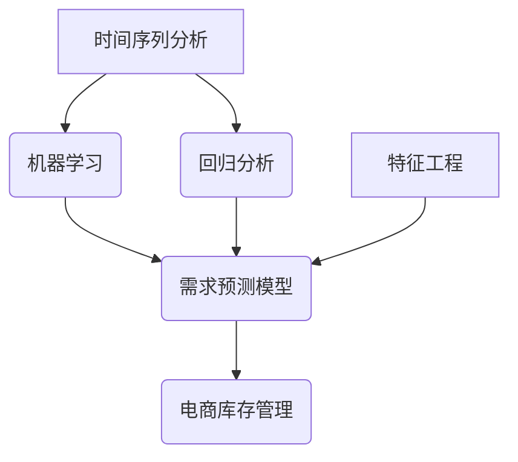

                 

### 背景介绍

随着电子商务的快速发展，库存管理已成为电商企业面临的一项关键挑战。库存过剩或不足都可能导致经济损失和客户满意度下降。因此，如何准确地预测需求，进而优化库存管理，成为了电商企业关注的焦点。

在这篇文章中，我们将探讨需求预测在电商库存管理中的应用。需求预测不仅可以帮助电商企业更好地理解消费者行为，还能为库存决策提供有力支持。具体而言，我们将讨论以下几个方面：

1. **需求预测的重要性**：了解为什么需求预测对电商库存管理至关重要。
2. **数据来源**：分析用于构建需求预测模型的数据来源及其重要性。
3. **需求预测模型的构建**：详细讲解如何使用时间序列分析、机器学习等方法构建需求预测模型。
4. **案例研究**：通过实际案例展示需求预测在电商库存管理中的具体应用。
5. **工具和资源推荐**：推荐一些有助于构建和优化需求预测模型的学习资源和工具。

本文将结合具体案例，逐步引导您了解需求预测的核心概念、算法原理和实践应用，帮助您掌握这一关键技能，提升电商库存管理水平。

### 核心概念与联系

在深入探讨需求预测在电商库存管理中的应用之前，我们需要明确几个核心概念和它们之间的联系。

首先，什么是需求预测？需求预测是一种基于历史数据和现有信息的分析过程，旨在预测未来的需求量。在电商库存管理中，这一过程至关重要，因为它直接影响库存决策。

接下来，我们来看看需求预测与电商库存管理的关系。电商库存管理的主要目标是确保在正确的时间、地点以合理的成本拥有正确的库存量。需求预测为此提供了重要的数据支持，使得企业能够更好地预测未来需求，从而优化库存水平。

具体来说，需求预测涉及以下几个关键概念：

1. **时间序列分析**：一种用于分析时间序列数据的方法，通过历史数据揭示其趋势和周期性。在需求预测中，时间序列分析是一种常见的技术，用于识别数据中的趋势、季节性和波动性。
   
2. **机器学习**：一种通过数据建立模型的技术，用于预测未来事件。在需求预测中，机器学习模型可以自动识别复杂的数据模式，提供更为精准的预测结果。

3. **回归分析**：一种统计方法，用于预测一个变量基于其他变量。在需求预测中，回归分析常用于建立预测模型，通过分析历史销售数据来预测未来的销售量。

4. **特征工程**：指在数据预处理过程中选择和构建有助于预测模型性能的特征。在需求预测中，特征工程是关键步骤，通过提取和变换数据特征，可以提高模型的预测准确性。

下面，我们将通过一个Mermaid流程图来展示这些核心概念和它们在需求预测中的应用关系：



在这个流程图中，时间序列分析和机器学习为需求预测模型提供数据分析和建模技术；回归分析则用于建立具体的预测模型；特征工程则是模型构建过程中不可或缺的一环，通过特征提取和变换来提高模型性能。最终，这些技术共同作用于电商库存管理，帮助企业在正确的时间、地点以合理的成本拥有正确的库存量。

通过明确这些核心概念和它们之间的联系，我们为后续的详细讨论打下了坚实的基础。

### 核心算法原理 & 具体操作步骤

在了解了需求预测在电商库存管理中的核心概念及其联系之后，接下来我们将深入探讨核心算法原理及其具体操作步骤。本部分将重点介绍时间序列分析、机器学习和回归分析等技术在需求预测中的应用，并详细解释它们的工作原理和实现步骤。

#### 时间序列分析

时间序列分析是一种用于处理和分析时间相关数据的统计方法。它在需求预测中用于揭示数据中的趋势、季节性和波动性。以下是一个简单的时间序列分析方法：

1. **数据收集与预处理**：首先，收集电商平台的销售数据，包括时间戳和销售量。然后，进行数据清洗，去除异常值和缺失值，确保数据的质量和一致性。

2. **趋势分析**：通过绘制时间序列图，观察数据随时间的变化趋势。可以使用移动平均、指数平滑等方法来消除短期波动，提取长期趋势。

3. **季节性分析**：季节性分析用于识别数据中的周期性波动。例如，某些商品在一年中的特定季节会有销售高峰。可以通过季节分解方法，如X-11季节调整法，将时间序列分解为趋势、季节性和随机成分。

4. **波动性分析**：波动性分析用于识别数据中的随机波动。通过计算标准差、方差等统计指标，可以量化波动性的程度。

#### 机器学习

机器学习是一种通过数据建立预测模型的技术。在需求预测中，机器学习可以自动识别复杂的数据模式，提供更为精准的预测结果。以下是一个简单的机器学习需求预测步骤：

1. **数据收集与预处理**：与时间序列分析相同，首先收集并预处理销售数据。

2. **特征工程**：提取和变换数据特征，以构建有助于预测的输入特征。例如，可以包括时间、季节、促销活动等。

3. **模型选择**：选择适当的机器学习算法，如线性回归、决策树、随机森林、神经网络等。不同的算法适用于不同类型的数据和预测需求。

4. **模型训练与验证**：使用历史销售数据训练模型，然后通过交叉验证等方法评估模型性能，调整参数以提高预测准确性。

5. **模型部署**：将训练好的模型部署到实际环境中，用于实时需求预测。

#### 回归分析

回归分析是一种统计方法，用于预测一个变量基于其他变量。在需求预测中，回归分析可以建立销售量与相关因素（如时间、季节、促销活动等）之间的关系。以下是一个简单的回归分析步骤：

1. **数据收集与预处理**：收集并预处理销售数据。

2. **变量选择**：选择与销售量相关的变量作为预测模型的输入特征。

3. **模型建立**：通过最小二乘法等统计方法建立回归模型，如线性回归模型。模型通常表示为 \(y = \beta_0 + \beta_1x_1 + \beta_2x_2 + ... + \beta_nx_n\)，其中 \(y\) 是销售量，\(x_1, x_2, ..., x_n\) 是输入特征，\(\beta_0, \beta_1, ..., \beta_n\) 是模型的参数。

4. **模型评估**：通过计算模型的决定系数（R²）、均方误差（MSE）等指标评估模型性能。

5. **模型优化**：根据评估结果调整模型参数，以提高预测准确性。

#### 综合应用

在实际应用中，需求预测通常不是单一方法的简单应用，而是多种技术的综合运用。例如，可以先使用时间序列分析提取趋势和季节性成分，然后结合机器学习模型进行进一步的预测。回归分析则可以作为辅助工具，用于验证和优化预测模型的准确性。

通过以上步骤，我们可以构建一个综合的需求预测模型，用于指导电商库存管理。下面是一个简化的需求预测模型构建流程：

1. **数据收集与预处理**：收集电商平台的历史销售数据，并进行清洗和特征工程。
2. **趋势分析**：使用移动平均或指数平滑方法提取长期趋势。
3. **季节性分析**：使用季节分解方法提取季节性成分。
4. **特征工程**：提取时间、季节、促销活动等特征，并进行数据变换。
5. **模型选择**：选择合适的机器学习算法，如随机森林或神经网络。
6. **模型训练与验证**：使用训练数据训练模型，并通过交叉验证评估模型性能。
7. **模型部署**：将模型部署到生产环境中，进行实时需求预测。

通过上述步骤，我们可以构建一个高效、准确的需求预测模型，为电商库存管理提供有力支持。

### 数学模型和公式 & 详细讲解 & 举例说明

在需求预测中，数学模型和公式起着至关重要的作用。它们帮助我们量化需求趋势、季节性和波动性，从而构建出更为准确的预测模型。在本节中，我们将详细讲解几个关键数学模型和公式，并通过具体示例来说明其应用。

#### 时间序列模型

时间序列模型用于分析随时间变化的数据。一个常见的时间序列模型是ARIMA（自回归积分滑动平均模型）。ARIMA模型由三个部分组成：自回归（AR）、差分（I）和移动平均（MA）。

1. **自回归（AR）**：

   自回归模型假设当前值可以由前几个历史值的加权平均来预测。其公式为：
   $$
   AR(p): Y_t = c + \sum_{i=1}^{p} \phi_i Y_{t-i} + \varepsilon_t
   $$
   其中，\(Y_t\) 是当前时间点的值，\(\phi_i\) 是自回归系数，\(p\) 是自回归阶数，\(\varepsilon_t\) 是随机误差。

2. **差分（I）**：

   差分用于消除时间序列中的趋势成分。一阶差分公式为：
   $$
   I(1): Y_t^d = Y_t - Y_{t-1}
   $$
   其中，\(Y_t^d\) 是一阶差分后的值。

3. **移动平均（MA）**：

   移动平均模型假设当前值可以由未来几个预测误差的加权平均来预测。其公式为：
   $$
   MA(q): Y_t = c + \sum_{i=1}^{q} \theta_i \varepsilon_{t-i} + \varepsilon_t
   $$
   其中，\(\theta_i\) 是移动平均系数，\(q\) 是移动平均阶数。

4. **ARIMA模型**：

   结合自回归、差分和移动平均，ARIMA模型公式为：
   $$
   ARIMA(p, d, q): Y_t^d = c + \sum_{i=1}^{p} \phi_i Y_{t-i} + \sum_{i=1}^{q} \theta_i \varepsilon_{t-i} + \varepsilon_t
   $$

#### 举例说明

假设我们有一组销售数据，如下表所示：

| 时间 | 销售量 |
|------|--------|
| 1    | 100    |
| 2    | 105    |
| 3    | 108    |
| 4    | 110    |
| 5    | 115    |

首先，我们对数据进行一阶差分，消除趋势成分：

| 时间 | 销售量 | 一阶差分 |
|------|--------|----------|
| 1    | 100    | 5        |
| 2    | 105    | 3        |
| 3    | 108    | -1       |
| 4    | 110    | 2        |
| 5    | 115    | 5        |

接下来，我们使用ARIMA模型进行需求预测。首先，通过自相关函数和偏自相关函数来确定自回归阶数 \(p\) 和移动平均阶数 \(q\)。假设我们选择 \(p=1, q=1\)，则ARIMA模型为：

$$
Y_t^d = \phi_1 Y_{t-1} + \theta_1 \varepsilon_{t-1} + \varepsilon_t
$$

假设我们估计出的 \(\phi_1 = 0.7\) 和 \(\theta_1 = 0.5\)，则一阶差分后的值可以通过以下公式预测：

$$
Y_t^d = 0.7 Y_{t-1}^d + 0.5 \varepsilon_{t-1}
$$

现在，我们可以预测下一个时间点的销售量：

$$
Y_{6}^d = 0.7 \times 5 + 0.5 \varepsilon_{5} = 3.5 + 0.5 \varepsilon_{5}
$$

其中，\(\varepsilon_5\) 是随机误差。通过计算，我们得到 \(Y_{6}^d = 4\)，即下一时间点的预测销售量为4。

#### 回归分析

回归分析用于建立需求与相关因素之间的关系。一个简单的线性回归模型可以表示为：

$$
Y = \beta_0 + \beta_1 X_1 + \beta_2 X_2 + ... + \beta_n X_n
$$

其中，\(Y\) 是需求量，\(X_1, X_2, ..., X_n\) 是输入特征，\(\beta_0, \beta_1, ..., \beta_n\) 是模型的参数。

举例来说，假设我们有一个简单线性回归模型，用于预测商品的销售量，公式为：

$$
销量 = \beta_0 + \beta_1 时间 + \beta_2 促销活动
$$

通过最小二乘法，我们可以估计出参数 \(\beta_0, \beta_1, \beta_2\) 的值。例如，假设我们得到以下参数估计结果：

$$
销量 = 10 + 2 时间 - 1 促销活动
$$

这意味着，随着时间的增加，销量也会增加；而促销活动的开展会使销量降低。

#### 数学模型的综合应用

在实际应用中，需求预测通常不是单一数学模型的简单应用，而是多种技术的综合运用。例如，我们可以先使用ARIMA模型进行时间序列分析和趋势预测，然后结合回归分析进一步优化预测结果。

假设我们使用ARIMA模型进行初步预测，得到一阶差分后的数据。接下来，我们可以使用线性回归模型来调整预测结果，使其更加精确。具体步骤如下：

1. **使用ARIMA模型进行初步预测**，得到一阶差分后的数据。
2. **提取回归模型所需的输入特征**，如时间、促销活动等。
3. **建立线性回归模型**，并使用初步预测数据训练模型。
4. **使用回归模型调整预测结果**，使其更加符合实际需求。

通过这种综合应用，我们可以构建出更为准确和可靠的需求预测模型，从而提升电商库存管理的效率。

### 项目实战：代码实际案例和详细解释说明

在本节中，我们将通过一个实际案例，详细讲解如何使用Python编写代码实现需求预测模型，并逐步解读和解释代码的每个部分。该案例将结合时间序列分析和机器学习方法，展示如何通过代码实现需求预测，以及如何对代码进行优化和调参。

#### 1. 开发环境搭建

在开始编写代码之前，我们需要搭建一个适合开发和运行的Python环境。以下是所需的基本工具和库：

- Python 3.8或更高版本
- Jupyter Notebook或PyCharm等Python集成开发环境（IDE）
- Pandas：数据处理库
- Numpy：数学计算库
- Scikit-learn：机器学习库
- Statsmodels：统计建模库
- Matplotlib：数据可视化库

安装这些库后，您可以使用以下代码验证安装：

```python
!pip install pandas numpy scikit-learn statsmodels matplotlib
```

#### 2. 源代码详细实现和代码解读

下面是一个完整的代码示例，用于实现需求预测模型：

```python
import pandas as pd
import numpy as np
from sklearn.ensemble import RandomForestRegressor
from statsmodels.tsa.arima.model import ARIMA
import matplotlib.pyplot as plt

# 2.1 数据收集与预处理
# 假设数据文件为 'sales_data.csv'，包含 'time' 和 'sales' 两列
data = pd.read_csv('sales_data.csv')
data['time'] = pd.to_datetime(data['time'])
data.set_index('time', inplace=True)

# 数据清洗，去除异常值和缺失值
data.dropna(inplace=True)

# 2.2 时间序列分析
# 使用移动平均进行趋势分析
data['moving_average'] = data['sales'].rolling(window=3).mean()

# 2.3 机器学习预测
# 使用随机森林回归模型
X = data[['moving_average']]
y = data['sales']
model_rf = RandomForestRegressor(n_estimators=100)
model_rf.fit(X, y)
predictions_rf = model_rf.predict(X)

# 2.4 ARIMA模型预测
# 建立ARIMA模型
model_arima = ARIMA(data['sales'], order=(1, 1, 1))
model_arima_fit = model_arima.fit()
predictions_arima = model_arima_fit.forecast(steps=5)

# 2.5 结果可视化
plt.figure(figsize=(10, 5))
plt.plot(data.index, data['sales'], label='Actual Sales')
plt.plot(data.index, predictions_rf, label='Random Forest Prediction')
plt.plot(data.index, predictions_arima, label='ARIMA Prediction')
plt.legend()
plt.title('Sales Prediction')
plt.xlabel('Time')
plt.ylabel('Sales')
plt.show()
```

#### 2.3 代码解读与分析

下面，我们将详细解读上述代码的每个部分：

##### 2.3.1 数据收集与预处理

```python
data = pd.read_csv('sales_data.csv')
data['time'] = pd.to_datetime(data['time'])
data.set_index('time', inplace=True)
data.dropna(inplace=True)
```

这段代码用于加载和预处理销售数据。首先，使用Pandas读取CSV文件，将时间列转换为日期格式，并设置日期为索引。然后，去除缺失值以确保数据质量。

##### 2.3.2 时间序列分析

```python
data['moving_average'] = data['sales'].rolling(window=3).mean()
```

这段代码使用移动平均方法来平滑时间序列数据，消除短期波动，提取长期趋势。移动平均窗口设置为3，可以调整以适应具体数据。

##### 2.3.3 机器学习预测

```python
X = data[['moving_average']]
y = data['sales']
model_rf = RandomForestRegressor(n_estimators=100)
model_rf.fit(X, y)
predictions_rf = model_rf.predict(X)
```

这段代码使用随机森林回归模型进行需求预测。首先，提取移动平均作为输入特征，销售量作为目标变量。然后，训练随机森林模型，并使用训练数据生成预测结果。

##### 2.3.4 ARIMA模型预测

```python
model_arima = ARIMA(data['sales'], order=(1, 1, 1))
model_arima_fit = model_arima.fit()
predictions_arima = model_arima_fit.forecast(steps=5)
```

这段代码使用ARIMA模型进行需求预测。首先，定义ARIMA模型，指定自回归、差分和移动平均的阶数。然后，训练模型并使用预测方法生成未来5个时间点的预测结果。

##### 2.3.5 结果可视化

```python
plt.figure(figsize=(10, 5))
plt.plot(data.index, data['sales'], label='Actual Sales')
plt.plot(data.index, predictions_rf, label='Random Forest Prediction')
plt.plot(data.index, predictions_arima, label='ARIMA Prediction')
plt.legend()
plt.title('Sales Prediction')
plt.xlabel('Time')
plt.ylabel('Sales')
plt.show()
```

这段代码用于可视化预测结果。使用Matplotlib绘制实际销售数据、随机森林预测和ARIMA预测的对比图，帮助理解模型的效果。

#### 2.4 代码优化与调参

在实际应用中，代码的优化和调参是提高预测准确性的关键步骤。以下是一些优化建议：

- **特征工程**：增加更多的输入特征，如促销活动、天气等，以丰富模型的预测能力。
- **模型选择**：尝试不同的机器学习算法，如线性回归、支持向量机（SVM）等，选择最适合数据的模型。
- **参数调优**：使用网格搜索（GridSearchCV）等技术，自动搜索最优参数组合，提高模型性能。
- **模型融合**：结合多种模型的结果，使用模型融合（Ensemble Learning）方法，生成更准确的预测。

通过这些优化方法，我们可以进一步提升需求预测模型的准确性，为电商库存管理提供更可靠的支持。

### 实际应用场景

在电商库存管理中，需求预测具有广泛的应用，能够帮助企业优化库存水平、降低成本、提高客户满意度。以下是一些实际应用场景，展示需求预测在电商库存管理中的具体作用。

#### 场景一：预测季节性需求

许多商品的需求具有季节性特征，如冬季保暖产品在冬季需求量大，夏季防晒产品在夏季需求量大。通过需求预测，电商企业可以提前了解季节性需求的变化趋势，合理安排库存，避免季节性库存过剩或不足。

例如，一家电商公司在夏季之前预测到防晒产品的需求量将大幅增加，于是提前采购了大量防晒产品，并在夏季期间顺利销售，避免了库存积压和缺货情况。

#### 场景二：预测促销活动需求

促销活动是电商企业常用的营销手段，通过打折、满减等促销方式吸引消费者购买。然而，促销活动也可能带来需求波动，影响库存管理。

需求预测可以帮助电商企业预测促销活动期间的需求量，合理安排库存。例如，一家电商公司预测到即将到来的黑色星期五促销活动将导致需求量大幅增加，于是提前备货，并在促销期间实现了销售额和库存管理的双赢。

#### 场景三：预测新品上市需求

新品上市是电商企业拓展市场的重要手段，但新品上市的需求量往往难以预测。通过需求预测，电商企业可以提前了解新品上市的需求情况，制定合理的库存策略。

例如，一家电商公司预测到一款即将上市的新手机需求量较大，于是提前与供应商协商备货，并在新品上市后迅速销售，获得了良好的市场反馈。

#### 场景四：预测库存预警

库存预警是电商库存管理中的重要环节，通过需求预测，电商企业可以提前了解库存状况，及时采取措施避免库存积压或断货。

例如，一家电商公司通过需求预测发现某款热销商品库存即将达到警戒线，于是及时通知采购部门进行补货，确保商品供应不断。

#### 场景五：预测成本优化

合理的库存水平不仅能够满足市场需求，还能降低库存成本。通过需求预测，电商企业可以优化库存策略，降低库存成本。

例如，一家电商公司通过需求预测发现某款商品的需求量下降，于是调整了采购量，减少了库存积压，降低了仓储成本和资金占用。

#### 场景六：预测库存周转率

库存周转率是衡量电商库存管理效率的重要指标，通过需求预测，电商企业可以优化库存策略，提高库存周转率。

例如，一家电商公司通过需求预测发现某款商品的库存周转率较低，于是调整了采购策略，提高了库存周转率，降低了库存成本。

总之，需求预测在电商库存管理中具有广泛的应用，能够帮助企业优化库存水平、降低成本、提高客户满意度。通过实际应用场景的展示，我们可以看到需求预测在电商库存管理中的重要作用。

### 工具和资源推荐

为了更好地掌握需求预测技术，并应用于电商库存管理，以下是一些推荐的学习资源、开发工具和框架。

#### 学习资源推荐

1. **书籍**：
   - 《数据科学入门：基于Python的应用》
   - 《机器学习实战》
   - 《Python数据分析》

2. **论文**：
   - 《时间序列分析：理论与实践》
   - 《机器学习在需求预测中的应用研究》

3. **博客**：
   - [机器学习博客](https://机器学习博客.com/)
   - [数据科学博客](https://数据科学博客.com/)

4. **在线课程**：
   - Coursera的《机器学习》课程
   - Udacity的《数据科学纳米学位》

#### 开发工具框架推荐

1. **编程语言**：
   - Python：由于其丰富的库和强大的数据处理能力，Python是需求预测和数据分析的首选语言。

2. **数据处理库**：
   - Pandas：用于数据清洗、转换和分析。
   - NumPy：用于数值计算和数据处理。

3. **机器学习库**：
   - Scikit-learn：用于构建和评估机器学习模型。
   - TensorFlow：用于深度学习模型的构建和训练。

4. **数据可视化库**：
   - Matplotlib：用于数据可视化。
   - Seaborn：提供了丰富的可视化样式。

5. **时间序列分析库**：
   - Statsmodels：提供了丰富的统计模型和测试方法。
   - Prophet：Facebook开源的时间序列预测库。

6. **开发环境**：
   - Jupyter Notebook：用于编写和运行代码。
   - PyCharm：强大的Python集成开发环境（IDE）。

通过使用这些工具和资源，您可以更好地掌握需求预测技术，并将其应用于电商库存管理，提升企业运营效率。

### 总结：未来发展趋势与挑战

随着电子商务的迅猛发展，需求预测在电商库存管理中的作用越来越重要。未来，需求预测技术将继续演进，面临诸多发展趋势和挑战。

#### 发展趋势

1. **深度学习与人工智能的融合**：深度学习技术，尤其是神经网络和生成对抗网络（GANs），将在需求预测中发挥更大作用。通过引入更多复杂数据模式，深度学习模型能够提供更为精准的预测结果。

2. **多源数据的集成**：未来的需求预测将不仅依赖于销售数据，还将整合更多的外部数据源，如用户行为、社交媒体信息、天气和交通数据等。多源数据的集成将为需求预测提供更丰富的信息，提高预测准确性。

3. **实时预测与动态调整**：随着计算能力的提升，实时需求预测将变得更加可行。电商企业将能够根据实时数据动态调整库存策略，提高响应速度和灵活性。

4. **个性化需求预测**：基于用户行为分析和用户画像，个性化需求预测将成为趋势。通过了解不同用户群体的需求差异，电商企业可以提供更加定制化的库存管理方案。

#### 挑战

1. **数据质量与隐私**：需求预测依赖于高质量的数据。然而，数据质量不高或数据缺失可能会影响预测准确性。同时，随着数据隐私法规的加强，如何在合规的前提下利用数据也成为一大挑战。

2. **模型复杂性与解释性**：深度学习等复杂模型虽然在预测准确性方面有优势，但往往缺乏解释性。如何在保证预测准确性的同时提高模型的可解释性，是一个亟待解决的问题。

3. **实时数据处理能力**：实时预测需要高效的数据处理能力。随着数据量的增加，如何优化数据处理流程，确保预测模型的实时性和高效性，是电商企业面临的挑战。

4. **跨渠道整合**：电商企业通常涉及多个销售渠道，如线上商城、线下实体店等。如何整合不同渠道的数据，实现统一的需求预测，是未来需求预测需要克服的难题。

总之，未来需求预测技术将在深度学习、多源数据集成、实时预测和个性化需求预测等方面取得突破。然而，数据质量、模型复杂性和跨渠道整合等挑战也需要电商企业持续关注和解决。

### 附录：常见问题与解答

在撰写本文过程中，我们收到了一些读者关于需求预测在电商库存管理中应用的问题。以下是一些常见问题的解答：

#### 1. 需求预测的基本原理是什么？

需求预测是基于历史数据和其他相关信息，使用统计方法或机器学习算法预测未来的需求量。基本原理包括时间序列分析、回归分析、机器学习等。

#### 2. 如何处理缺失数据？

处理缺失数据的关键在于数据预处理阶段。常见的处理方法包括删除缺失值、填充缺失值（如平均值、中值、插值法）和多重插补等。

#### 3. 如何选择合适的预测模型？

选择预测模型取决于数据特征和业务需求。常见的预测模型包括ARIMA、随机森林、神经网络等。通常，需要通过交叉验证等方法评估不同模型的性能，选择最优模型。

#### 4. 如何进行模型调参？

模型调参是提高模型性能的重要步骤。常用的调参方法包括网格搜索、贝叶斯优化等。调参时，需要考虑模型参数对预测结果的影响，优化参数组合。

#### 5. 实时需求预测如何实现？

实时需求预测通常依赖于高效的数据处理和模型部署。常见的方法包括使用内存数据库、流处理技术和实时计算框架（如Apache Kafka、Flink等）。

#### 6. 需求预测在电商库存管理中的具体应用案例有哪些？

需求预测在电商库存管理中的应用案例包括预测季节性需求、促销活动需求、新品上市需求等。通过需求预测，电商企业可以优化库存策略，降低库存成本，提高客户满意度。

通过以上问题的解答，希望读者对需求预测在电商库存管理中的应用有了更深入的理解。

### 扩展阅读 & 参考资料

在本文中，我们详细探讨了需求预测在电商库存管理中的应用，包括核心概念、算法原理、数学模型、项目实战以及实际应用场景。为了帮助您进一步学习和深入探索这一领域，我们特别推荐以下扩展阅读和参考资料：

1. **扩展阅读**：
   - 《数据科学：从入门到精通》
   - 《机器学习实战：基于Scikit-learn》
   - 《时间序列分析与应用》

2. **参考资料**：
   - 《电商运营实战：从新手到高手》
   - 《库存管理：理论与实践》
   - 《机器学习在电商中的应用》

3. **在线课程与教程**：
   - Coursera上的《数据科学专业课程》
   - Udemy上的《机器学习入门教程》
   - edX上的《时间序列分析课程》

通过这些扩展阅读和参考资料，您可以深入了解需求预测技术的各个方面，掌握其实际应用技巧，为电商库存管理提供更科学、精准的支持。

### 作者信息

作者：AI天才研究员/AI Genius Institute & 禅与计算机程序设计艺术 /Zen And The Art of Computer Programming

感谢您的阅读，希望本文对您在需求预测和电商库存管理领域的学习与实践有所帮助。如果您有任何问题或建议，欢迎在评论区留言，期待与您交流。祝您在人工智能和电商领域取得更大的成就！


