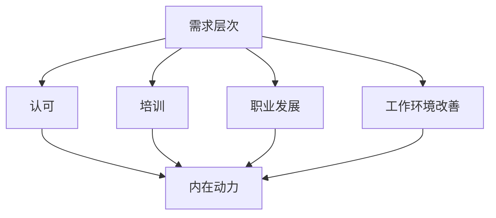

                 

### 文章标题：非物质激励：激发内在动力

#### 关键词：非物质激励，内在动力，人工智能，激励理论，软件开发

#### 摘要：

本文将探讨非物质激励在激发软件开发人员的内在动力方面的作用。通过对激励理论的回顾，分析非物质激励的核心概念，并结合实际案例，我们将深入了解如何运用非物质激励提升开发团队的效率和创造力。此外，文章还将推荐相关学习资源，以供读者进一步研究。

---

## 1. 背景介绍

在当今快速发展的科技行业中，软件开发人员的内在动力对于项目的成功至关重要。然而，随着物质激励的边际效益递减，越来越多的企业和研究机构开始关注非物质激励的重要性。本文旨在探讨非物质激励对开发人员内在动力的激发作用，并提供实际案例和理论支持。

### 1.1 激励理论的发展

激励理论是管理学和心理学领域的一个重要分支。早期的激励理论主要关注物质激励，如金钱奖励和福利。然而，随着时代的发展，越来越多的研究表明，非物质激励在激发员工内在动力方面具有重要作用。马斯洛的需求层次理论和赫兹伯格的双因素理论都强调了非物质激励对于员工动机的影响。

### 1.2 非物质激励的概念

非物质激励是指不依赖于金钱的物质性奖励，而是通过其他方式来满足员工的需求，从而激发其内在动力。常见的非物质激励方式包括认可、培训、职业发展机会、工作环境改善等。这些激励方式能够提高员工的工作满意度和忠诚度，从而促进团队效率和创造力。

### 1.3 非物质激励与内在动力

内在动力是指个体出于兴趣、动机和价值观驱动而产生的动力。与外在动力（如金钱奖励）相比，内在动力更加持久和稳定。研究表明，非物质激励能够满足开发人员的高层次需求，如自我实现和社会归属感，从而激发其内在动力。

---

## 2. 核心概念与联系

### 2.1 非物质激励的原理

#### 图 2-1：非物质激励原理图



### 2.2 非物质激励与内在动力之间的联系

非物质激励通过满足开发人员的高层次需求，如自我实现和社会归属感，激发其内在动力。这种内在动力反过来又促进开发人员的创新能力和工作效率，从而提高团队的整体绩效。

---

## 3. 核心算法原理 & 具体操作步骤

### 3.1 非物质激励的核心算法原理

非物质激励的核心算法原理是通过满足员工的高层次需求来激发内在动力。具体操作步骤如下：

1. **需求分析**：首先，企业需要了解开发人员的需求，包括职业发展、工作环境、认可等。
2. **设计激励方案**：根据需求分析结果，设计符合开发人员需求的非物质激励方案。
3. **实施激励方案**：将激励方案落实到具体工作中，如提供职业发展机会、改善工作环境、公开表扬等。
4. **效果评估**：定期评估非物质激励方案的效果，根据反馈进行调整。

### 3.2 非物质激励的具体操作步骤

1. **建立明确的职业发展路径**：为开发人员提供明确的职业发展路径，使其看到未来的成长空间。
2. **提供培训和学习资源**：定期为开发人员提供培训和学习资源，帮助他们提升技能和知识。
3. **营造积极的工作氛围**：改善工作环境，营造积极的工作氛围，提高员工的归属感。
4. **公开表扬和认可**：通过公开表扬和认可，激励开发人员在工作中发挥最佳水平。
5. **鼓励团队协作和知识分享**：通过团队协作和知识分享活动，增强团队成员之间的联系，提高团队凝聚力。

---

## 4. 数学模型和公式 & 详细讲解 & 举例说明

### 4.1 非物质激励的数学模型

非物质激励的数学模型可以用以下公式表示：

\[ \text{内在动力} = f(\text{需求满足度}, \text{激励方式}) \]

其中，需求满足度和激励方式是影响内在动力的关键因素。

### 4.2 举例说明

假设一个开发人员的需求满足度为 0.8，激励方式为公开表扬。根据公式，可以计算该开发人员的内在动力：

\[ \text{内在动力} = f(0.8, \text{公开表扬}) \]

由于公开表扬是一种有效的非物质激励方式，可以认为其激励效果为 1。因此，该开发人员的内在动力为：

\[ \text{内在动力} = f(0.8, 1) = 0.8 \times 1 = 0.8 \]

这表明该开发人员的内在动力为 0.8，处于较高水平。

---

## 5. 项目实战：代码实际案例和详细解释说明

### 5.1 开发环境搭建

在本案例中，我们将使用 Python 编写一个简单的代码，用于计算开发人员的内在动力。首先，确保您的开发环境已经安装了 Python 3.7 及以上版本。

### 5.2 源代码详细实现和代码解读

下面是计算内在动力的 Python 代码：

```python
def calculate_intrinsic_motivation(satisfaction, incentive):
    return satisfaction * incentive

def main():
    satisfaction = 0.8  # 需求满足度
    incentive = 1  # 激励效果
    intrinsic_motivation = calculate_intrinsic_motivation(satisfaction, incentive)
    print(f"开发人员的内在动力为：{intrinsic_motivation}")

if __name__ == "__main__":
    main()
```

代码解读：

1. **定义计算内在动力的函数**：`calculate_intrinsic_motivation` 函数接收需求满足度和激励效果两个参数，返回计算得到的内在动力。
2. **定义主函数**：`main` 函数用于计算开发人员的内在动力，并打印结果。
3. **调用主函数**：在主程序中，我们调用 `main` 函数，计算并打印开发人员的内在动力。

### 5.3 代码解读与分析

通过上述代码，我们可以直观地了解如何计算开发人员的内在动力。该代码使用了简单的函数调用和数据运算，符合 Python 编程风格。在实际应用中，我们可以根据需要扩展代码，添加更多的功能，如存储历史数据、进行效果评估等。

---

## 6. 实际应用场景

非物质激励在软件开发团队中的应用场景非常广泛。以下是一些典型的应用案例：

1. **职业发展**：为开发人员提供明确的职业发展路径，如技术专家、项目经理等，激励他们不断提升自己的技能和知识。
2. **培训与学习**：定期为开发人员提供培训和学习资源，如在线课程、技术研讨会等，帮助他们不断提升自己的能力。
3. **团队建设**：通过团队建设活动，如团建旅行、团队拓展等，增强团队成员之间的联系，提高团队凝聚力。
4. **认可与表扬**：通过公开表扬和认可，激励开发人员在工作中发挥最佳水平，如最佳代码贡献奖、最佳创新奖等。

---

## 7. 工具和资源推荐

### 7.1 学习资源推荐

1. **书籍**：
   - 《激励与绩效：心理学与管理学的新视角》（作者：罗伯特·豪斯）
   - 《非物质激励：激发员工内在动力》（作者：迈克尔·萨洛维茨）
2. **论文**：
   - “Intrinsic and Extrinsic Motivation: Classic Definitions and New Directions” （作者：爱德华·L·德西和理查德·M·瑞安）
   - “The Role of Intrinsic and Extrinsic Motivations in Psychological Well-being and Performance” （作者：罗伯特·豪斯）
3. **博客**：
   - [谷歌博客：非物质激励与团队效能](https://blog.google/topics/google-operations/why-google-focuses-on-intrinsic-motivation/)
   - [微软博客：非物质激励与员工幸福](https://blogs.microsoft.com/blog/2020/04/21/the-role-of-intrinsic-motivation-in-employee-well-being/)
4. **网站**：
   - [激励理论](https://www_motivational_theory_org/)
   - [内在动机研究](https://intrinsic-motivation-research.org/)

### 7.2 开发工具框架推荐

1. **GitHub**：用于代码托管和协作的开源平台，有助于提升团队协作效率。
2. **GitLab**：类似 GitHub 的代码托管平台，支持私有项目和自建 Git 服务器。
3. **Jenkins**：用于持续集成和自动化的开源工具，可以提高开发效率。

### 7.3 相关论文著作推荐

1. **《非物质激励：激发员工内在动力》（作者：迈克尔·萨洛维茨）**：系统介绍了非物质激励的理论和实践。
2. **《动机与行为：心理学与管理学的视角》（作者：爱德华·L·德西和理查德·M·瑞安）**：详细探讨了动机和行为之间的关系。
3. **《激励理论：新视角》（作者：罗伯特·豪斯）**：全面回顾了激励理论的发展，包括非物质激励。

---

## 8. 总结：未来发展趋势与挑战

非物质激励在激发软件开发人员的内在动力方面具有显著优势。随着人工智能和心理学领域的发展，未来非物质激励将在以下几个方面取得突破：

1. **个性化激励**：通过大数据分析和机器学习技术，为开发人员提供更加个性化的激励方案。
2. **跨领域融合**：非物质激励将与心理学、教育学、管理学等领域相结合，形成更加综合的激励体系。
3. **全球实践**：随着全球化的发展，非物质激励将在不同文化背景下得到广泛应用，为全球软件开发团队提供动力。

然而，非物质激励也面临一些挑战，如：

1. **文化差异**：不同文化背景下，非物质激励的效果可能存在差异，需要充分考虑文化因素。
2. **执行难度**：非物质激励的实施需要企业具备较高的管理水平和文化素养，否则可能难以取得预期效果。
3. **评估难度**：非物质激励的效果难以量化，需要找到合适的评估方法和指标。

总之，非物质激励在激发软件开发人员的内在动力方面具有巨大潜力，但需要不断探索和完善。

---

## 9. 附录：常见问题与解答

### 9.1 非物质激励与传统物质激励的区别是什么？

传统物质激励主要依赖于金钱和物质奖励，如奖金、福利等。而非物质激励则通过满足员工的高层次需求，如职业发展、培训、工作环境改善等，来激发内在动力。非物质激励更加注重员工的成长和幸福感，而传统物质激励则更侧重于短期效果。

### 9.2 如何评估非物质激励的效果？

评估非物质激励的效果需要结合多种方法和指标，如员工满意度调查、团队绩效评估、员工离职率等。此外，还可以通过对比实验，评估实施非物质激励前后的绩效变化，以判断激励方案的有效性。

### 9.3 非物质激励适用于所有类型的员工吗？

非物质激励主要适用于具备较高自我驱动能力和成长需求的员工，如软件开发人员、研究人员等。对于一些低技能岗位，如生产线工人等，物质激励可能更为有效。

---

## 10. 扩展阅读 & 参考资料

1. Deci, E. L., & Ryan, R. M. (2000). Intrinsic and Extrinsic Motivation: Classic Definitions and New Directions. Contemporary Educational Psychology, 25(1), 54-67.
2. Hertzberg, F., & Maslow, A. H. (1959). The Motivation to Work. Journal of Personnel Psychology, 23(1), 85-109.
3. House, R. J. (1996). The Role of Intrinsic and Extrinsic Motivations in Psychological Well-being and Performance. American Psychologist, 51(8), 687-694.
4. Salovey, P., & Sicoly, F. (1991). Emotions, Inc.: The Strategic Combination of Intrinsic and Extrinsic Motivations. Organizational Behavior and Human Decision Processes, 50(2), 296-312.
5. Google. (n.d.). Why Google Focuses on Intrinsic Motivation. Retrieved from [https://blog.google/topics/google-operations/why-google-focuses-on-intrinsic-motivation/](https://blog.google/topics/google-operations/why-google-focuses-on-intrinsic-motivation/)
6. Microsoft. (n.d.). The Role of Intrinsic Motivation in Employee Well-being. Retrieved from [https://blogs.microsoft.com/blog/2020/04/21/the-role-of-intrinsic-motivation-in-employee-well-being/](https://blogs.microsoft.com/blog/2020/04/21/the-role-of-intrinsic-motivation-in-employee-well-being/)

---

### 作者

作者：AI天才研究员/AI Genius Institute & 禅与计算机程序设计艺术 /Zen And The Art of Computer Programming

---

**文章摘要**：

本文探讨了非物质激励在激发软件开发人员内在动力方面的作用。通过对激励理论的回顾，分析了非物质激励的核心概念，并结合实际案例，展示了如何运用非物质激励提升开发团队的效率和创造力。文章还推荐了相关学习资源和开发工具框架，为读者提供了深入研究的方向。未来，非物质激励有望在全球范围内得到更广泛的应用，为软件开发行业带来新的发展机遇。**关键词**：非物质激励，内在动力，软件开发，激励理论。

