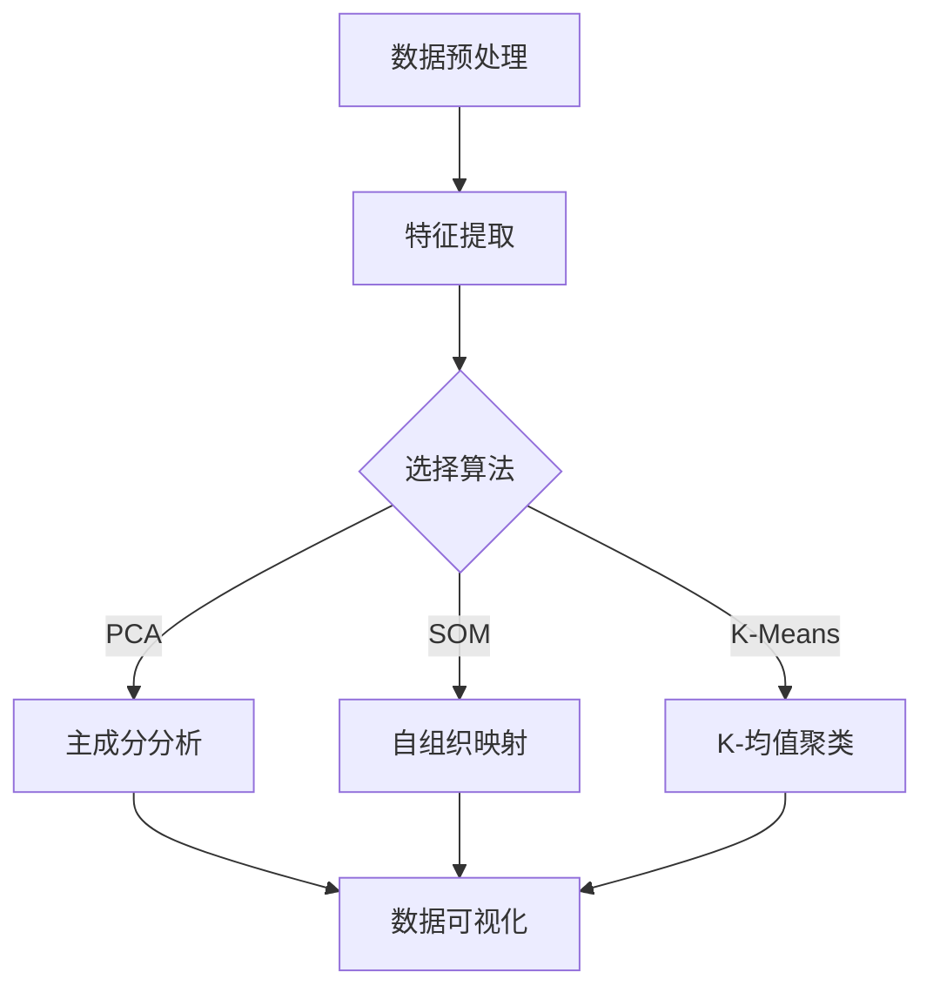

                 

# 非监督学习：原理与代码实例讲解

## 关键词

- 非监督学习
- 自组织映射
- K-均值聚类
- 聚类分析
- 无监督降维
- 聚类算法
- 自编码器

## 摘要

本文将深入探讨非监督学习的基本概念、核心算法及其在实际应用中的重要性。我们将首先介绍非监督学习的背景，然后详细讲解常见的非监督学习算法，包括自组织映射、K-均值聚类等。此外，我们将通过实际代码实例来展示这些算法的实现和应用。文章还将讨论非监督学习的数学模型和公式，并提供实用的工具和资源推荐。最后，我们将总结非监督学习的未来发展趋势与挑战，并附上常见问题与解答以及扩展阅读与参考资料。

## 1. 背景介绍

非监督学习（Unsupervised Learning）是机器学习中的一个重要分支，它与监督学习（Supervised Learning）相对。在监督学习中，我们使用标记的数据集来训练模型，标记数据提供了输入和预期输出的对应关系，使得模型可以通过这种对应关系来学习。而非监督学习则不依赖于标记数据，它的目标是通过分析未标记的数据，找出数据中的内在结构和模式。

### 监督学习与非监督学习

监督学习通常用于分类和回归任务，如预测房价或判断邮件是否为垃圾邮件。而非监督学习则更多用于聚类、降维和关联规则学习等任务。例如，聚类算法可以将数据分成若干组，使得同一组中的数据点具有较高的相似度，从而发现数据中的潜在模式。

### 非监督学习的应用场景

非监督学习在多个领域有着广泛的应用。以下是一些典型的应用场景：

- **市场细分**：通过聚类分析，可以将消费者分成不同的市场细分，以更好地了解客户需求。
- **图像识别**：自组织映射（SOM）等算法可以用于将高维图像数据映射到低维空间中，从而实现图像分类和特征提取。
- **异常检测**：非监督学习可以帮助识别数据中的异常值或异常模式，这在金融欺诈检测、网络安全等领域具有重要应用价值。
- **推荐系统**：基于关联规则学习，非监督学习可以挖掘用户行为数据中的关联关系，为推荐系统提供支持。

## 2. 核心概念与联系

非监督学习算法的核心在于如何从无标记数据中挖掘出有用的信息。以下我们将介绍几种常见的非监督学习算法，并展示它们之间的联系。

### 2.1 自组织映射（SOM）

自组织映射是一种无监督学习方法，它通过竞争性学习将高维数据映射到低维空间中，从而实现数据的可视化和聚类。SOM算法的主要组成部分包括：

- **神经网络**：SOM算法基于神经网络，尤其是自激活神经元。
- **拓扑保持映射**：SOM通过保持神经元之间的距离关系，使得映射后的低维空间中，相似的数据点依然保持接近。

### 2.2 K-均值聚类（K-Means Clustering）

K-均值聚类是一种基于距离度量的聚类算法，它通过迭代更新聚类中心，将数据点分配到不同的簇中。K-均值聚类的主要组成部分包括：

- **初始聚类中心**：随机选择或通过某种方法初始化聚类中心。
- **聚类中心更新**：通过计算每个簇的平均值，更新聚类中心。

### 2.3 聚类分析（Cluster Analysis）

聚类分析是一种更广义的聚类方法，它不仅包括K-均值聚类，还包括层次聚类、DBSCAN等多种聚类算法。聚类分析的目标是通过将数据点分成若干簇，揭示数据中的潜在结构和模式。

### 2.4 无监督降维（Unsupervised Dimensionality Reduction）

无监督降维方法，如主成分分析（PCA）和自编码器（Autoencoder），旨在减少数据维度，同时保留数据的主要特征。无监督降维的主要组成部分包括：

- **特征提取**：通过降维方法，提取数据的主要特征。
- **数据重构**：在降维过程中，保持数据的主要结构和模式。

### 2.5 关联规则学习（Association Rule Learning）

关联规则学习是一种挖掘数据中关联关系的方法，它通过发现频繁项集和关联规则，揭示数据之间的潜在联系。关联规则学习的主要组成部分包括：

- **频繁项集挖掘**：通过挖掘数据中的频繁项集，找出数据中的关联关系。
- **关联规则生成**：基于频繁项集，生成关联规则，如“购买啤酒通常伴随着购买尿布”。

### 2.6 Mermaid 流程图

以下是一个简单的Mermaid流程图，展示了非监督学习算法的基本流程：



## 3. 核心算法原理 & 具体操作步骤

在本节中，我们将详细探讨非监督学习的几种核心算法，包括自组织映射、K-均值聚类等，并给出具体操作步骤。

### 3.1 自组织映射（SOM）

#### 基本原理

自组织映射（SOM）是一种无监督学习方法，由芬兰科学家Teuvo Kohonen提出。它的基本思想是通过竞争性学习将高维数据映射到低维空间中，使得相似的数据点在低维空间中依然保持接近。

#### 具体操作步骤

1. **初始化网络**：随机初始化自组织映射网络，包括输入层和输出层。
2. **计算最佳匹配单元（BMU）**：对于每个输入样本，计算它与输出层中各个神经元的距离，找到距离最近的神经元，称为最佳匹配单元（BMU）。
3. **更新网络权重**：根据BMU的位置，更新输出层中所有神经元的权重。更新规则通常基于局部邻域函数，邻域大小随着训练迭代次数的增大而减小。
4. **迭代更新**：重复步骤2和3，直到满足停止条件，如达到最大迭代次数或网络权重变化较小。

#### 代码实现

```python
import numpy as np
import matplotlib.pyplot as plt

# 初始化网络
def initialize_network(input_size, output_size, learning_rate):
    network = np.random.rand(input_size, output_size) * 2 - 1
    return network

# 计算最佳匹配单元
def find_bmu(inputs, network):
    distances = np.linalg.norm(inputs - network, axis=1)
    bmu_index = np.argmin(distances)
    return bmu_index

# 更新网络权重
def update_weights(inputs, bmu_index, network, learning_rate, neighborhood_size):
    for i in range(len(inputs)):
        distance = np.linalg.norm(inputs[i] - network[bmu_index])
        if distance <= neighborhood_size:
            network[i] = (1 - learning_rate * distance / neighborhood_size) * inputs[i] + learning_rate * (1 - distance / neighborhood_size) * network[bmu_index]

# 主函数
def self_organizing_map(inputs, network, learning_rate, neighborhood_size, max_iterations):
    for _ in range(max_iterations):
        for input_vector in inputs:
            bmu_index = find_bmu(input_vector, network)
            update_weights(input_vector, bmu_index, network, learning_rate, neighborhood_size)
    return network

# 示例
input_data = np.array([[0.1, 0.2], [0.8, 0.9], [-0.1, -0.2], [-0.8, -0.9]])
network = initialize_network(2, 2, 0.1)
squared_errors = self_organizing_map(input_data, network, 0.1, 0.1, 100)
print(squared_errors)

# 可视化结果
plt.scatter(*zip(*input_data), c='red')
plt.scatter(*zip(*network), c='blue')
plt.show()
```

### 3.2 K-均值聚类（K-Means Clustering）

#### 基本原理

K-均值聚类是一种基于距离度量的聚类算法，它通过迭代更新聚类中心，将数据点分配到不同的簇中。K-均值聚类的基本原理如下：

1. **初始化聚类中心**：随机选择K个初始聚类中心。
2. **分配数据点**：计算每个数据点到各个聚类中心的距离，将数据点分配到距离最近的聚类中心。
3. **更新聚类中心**：计算每个簇的平均值，作为新的聚类中心。
4. **重复步骤2和3，直到满足停止条件，如聚类中心变化较小或达到最大迭代次数**。

#### 具体操作步骤

1. **初始化聚类中心**：随机选择K个初始聚类中心。
2. **计算距离**：计算每个数据点到各个聚类中心的距离，使用欧几里得距离或其他距离度量。
3. **分配数据点**：将每个数据点分配到距离最近的聚类中心。
4. **更新聚类中心**：计算每个簇的平均值，作为新的聚类中心。
5. **重复步骤2到4，直到满足停止条件**。

#### 代码实现

```python
import numpy as np
import matplotlib.pyplot as plt

# 初始化聚类中心
def initialize_centers(data, k):
    return data[np.random.choice(data.shape[0], k, replace=False)]

# 计算距离
def calculate_distances(data, centers):
    distances = np.linalg.norm(data - centers, axis=1)
    return distances

# 分配数据点
def assign_points(data, centers):
    distances = calculate_distances(data, centers)
    labels = np.argmin(distances, axis=1)
    return labels

# 更新聚类中心
def update_centers(data, labels, k):
    new_centers = np.array([data[labels == i].mean(axis=0) for i in range(k)])
    return new_centers

# 主函数
def k_means_clustering(data, k, max_iterations):
    centers = initialize_centers(data, k)
    for _ in range(max_iterations):
        labels = assign_points(data, centers)
        new_centers = update_centers(data, labels, k)
        if np.linalg.norm(new_centers - centers) < 1e-6:
            break
        centers = new_centers
    return centers, labels

# 示例
input_data = np.array([[0.1, 0.2], [0.8, 0.9], [-0.1, -0.2], [-0.8, -0.9]])
k = 2
max_iterations = 100
centers, labels = k_means_clustering(input_data, k, max_iterations)
print(centers)

# 可视化结果
plt.scatter(*zip(*input_data), c=labels)
plt.scatter(*zip(*centers), c='red')
plt.show()
```

### 3.3 聚类分析（Cluster Analysis）

聚类分析是一种更广义的聚类方法，它包括多种聚类算法，如层次聚类、DBSCAN等。以下简要介绍几种常见的聚类分析算法。

#### 层次聚类（Hierarchical Clustering）

层次聚类是一种自底向上的聚类方法，它通过逐步合并或分裂聚类簇，形成层次结构的聚类结果。层次聚类的主要步骤包括：

1. **初始化**：将每个数据点视为一个单独的聚类簇。
2. **合并或分裂**：计算聚类簇之间的距离，选择最近或最远的聚类簇进行合并或分裂。
3. **迭代更新**：重复步骤2，直到满足停止条件。

#### DBSCAN（Density-Based Spatial Clustering of Applications with Noise）

DBSCAN是一种基于密度的聚类算法，它通过扫描数据空间，将具有足够高密度的区域划分为聚类簇。DBSCAN的主要步骤包括：

1. **初始化**：选择一个初始点作为核心点，并计算其邻域。
2. **扩展聚类簇**：将核心点及其邻域中的点扩展到聚类簇中。
3. **处理边界点和噪声点**：根据点的邻域密度，将其分类为核心点、边界点或噪声点。

### 3.4 无监督降维（Unsupervised Dimensionality Reduction）

无监督降维方法旨在减少数据维度，同时保留数据的主要特征。以下简要介绍几种常见的无监督降维方法。

#### 主成分分析（PCA）

主成分分析是一种基于特征值分解的方法，它通过选择前k个主成分，将高维数据投影到k维空间中，从而实现降维。PCA的主要步骤包括：

1. **计算协方差矩阵**：计算数据点的协方差矩阵。
2. **特征值分解**：对协方差矩阵进行特征值分解，选择前k个特征值对应的特征向量。
3. **降维**：将数据点投影到k维空间中。

#### 自编码器（Autoencoder）

自编码器是一种神经网络模型，它通过编码器和解码器两个网络，将高维数据压缩到低维空间中，再从低维空间中重构高维数据。自编码器的主要步骤包括：

1. **编码器训练**：训练编码器网络，使其能够将高维数据映射到低维空间中。
2. **解码器训练**：训练解码器网络，使其能够将低维数据重构回高维空间。

#### 代码实现

```python
import numpy as np
import matplotlib.pyplot as plt

# PCA降维
def pca_reduction(data, components):
    mean = np.mean(data, axis=0)
    cov = np.cov(data - mean)
    eigenvalues, eigenvectors = np.linalg.eigh(cov)
    sorted_indices = np.argsort(eigenvalues)[::-1]
    sorted_eigenvectors = eigenvectors[:, sorted_indices]
    projection = np.dot(data - mean, sorted_eigenvectors[:components])
    return projection

# 自编码器降维
def autoencoder_reduction(data, encoding_dim):
    # 定义编码器和解码器网络
    encoder = MLP(self.layers=[input_layer, Dense(encoding_dim, activation='relu')])
    decoder = MLP(self.layers=[input_layer, Dense(encoding_dim, activation='relu'), Dense(data.shape[1], activation='sigmoid')])
    # 训练编码器和解码器网络
    model = Model(inputs=encoder.input, outputs=decoder(encoder.input))
    model.compile(optimizer='adam', loss='mse')
    model.fit(data, data, epochs=100, batch_size=10)
    # 重构数据
    reconstructed_data = model.predict(data)
    return reconstructed_data
```

## 4. 数学模型和公式 & 详细讲解 & 举例说明

在非监督学习中，数学模型和公式起着至关重要的作用。以下我们将详细讲解几种常见的非监督学习算法的数学模型和公式，并提供具体的实例说明。

### 4.1 自组织映射（SOM）

自组织映射（SOM）的数学模型主要基于神经网络的原理，特别是自激活神经元。以下是一个简单的自组织映射网络的数学模型：

$$
\begin{aligned}
\text{输入层：} \quad x_i &= (x_{i1}, x_{i2}, ..., x_{in}) \\
\text{输出层：} \quad y_j &= (y_{j1}, y_{j2}, ..., y_{jm}) \\
\text{权重矩阵：} \quad W_{ij} &= (W_{ij1}, W_{ij2}, ..., W_{ijm}) \\
\end{aligned}
$$

其中，$x_i$是输入层的第i个神经元，$y_j$是输出层的第j个神经元，$W_{ij}$是输入层第i个神经元到输出层第j个神经元的权重。

自组织映射的核心在于计算最佳匹配单元（BMU），即与输入样本最相似的输出神经元。计算公式如下：

$$
\text{BMU} = \arg\min_{j} \sum_{i=1}^{n} (x_i - y_j)^2
$$

为了更新网络权重，自组织映射使用局部邻域函数来调整权重。一个常用的局部邻域函数是高斯函数：

$$
\text{邻域函数} \quad N_j(i) = \exp\left(-\frac{\|x_i - y_j\|^2}{2\sigma^2}\right)
$$

其中，$\sigma$是邻域函数的宽度。

权重更新的公式如下：

$$
W_{ij}(t+1) = W_{ij}(t) + \alpha(t) \cdot N_j(i) \cdot (x_i - y_j)
$$

其中，$\alpha(t)$是学习率，它通常随着迭代次数的增加而减小。

### 4.2 K-均值聚类（K-Means Clustering）

K-均值聚类的数学模型主要基于距离度量。假设我们有K个聚类中心$\mu_k$，每个数据点$x_i$被分配到距离最近的聚类中心$\mu_k$，即：

$$
\text{聚类分配} \quad z_i = \arg\min_{k} \|x_i - \mu_k\|^2
$$

K-均值聚类的目标是使总距离最小化：

$$
\text{目标函数} \quad J = \sum_{i=1}^{n} \|x_i - \mu_{z_i}\|^2
$$

为了最小化目标函数，K-均值聚类使用梯度下降法进行迭代更新聚类中心。更新公式如下：

$$
\mu_k(t+1) = \frac{1}{C_k(t+1)} \sum_{i=1}^{n} x_i \cdot \mathbb{1}_{z_i=k}
$$

其中，$C_k(t+1)$是第k个簇中的数据点数量，$\mathbb{1}_{z_i=k}$是指示函数，当$z_i=k$时取1，否则取0。

### 4.3 主成分分析（PCA）

主成分分析（PCA）是一种降维方法，它通过选择前k个主成分，将高维数据投影到k维空间中。PCA的数学模型基于特征值分解。首先，计算协方差矩阵：

$$
\text{协方差矩阵} \quad \Sigma = \frac{1}{n-1} \sum_{i=1}^{n} (x_i - \bar{x}) (x_i - \bar{x})^T
$$

其中，$x_i$是数据点的第i个特征，$\bar{x}$是所有数据点的平均值。

然后，对协方差矩阵进行特征值分解：

$$
\text{特征值分解} \quad \Sigma = Q \Lambda Q^T
$$

其中，$Q$是特征向量矩阵，$\Lambda$是对角矩阵，包含特征值。

选择前k个最大的特征值对应的特征向量，作为k个主成分：

$$
\text{主成分} \quad \lambda_k = Q^T x
$$

其中，$x$是原始数据点。

### 4.4 自编码器（Autoencoder）

自编码器是一种神经网络模型，它通过编码器和解码器两个网络，将高维数据压缩到低维空间中，再从低维空间中重构高维数据。自编码器的数学模型如下：

编码器：

$$
z = \sigma(W_2 \cdot \sigma(W_1 \cdot x_b + b_1))
$$

解码器：

$$
\hat{x} = \sigma(W_4 \cdot \sigma(W_3 \cdot z + b_3))
$$

其中，$x_b$是输入数据，$z$是编码后的数据，$\hat{x}$是解码后的数据。$W_1$、$W_2$、$W_3$和$W_4$是权重矩阵，$b_1$、$b_3$是偏置项。$\sigma$是激活函数，通常使用ReLU或Sigmoid函数。

损失函数：

$$
L = \frac{1}{n} \sum_{i=1}^{n} \sum_{j=1}^{m} (\hat{x}_{ij} - x_{ij})^2
$$

其中，$n$是样本数量，$m$是特征数量，$\hat{x}_{ij}$是解码后的数据点，$x_{ij}$是原始数据点。

### 4.5 举例说明

#### 4.5.1 自组织映射（SOM）

假设我们有一个2D输入数据集，包含4个数据点：

$$
x_1 = (0.1, 0.2), \quad x_2 = (0.8, 0.9), \quad x_3 = (-0.1, -0.2), \quad x_4 = (-0.8, -0.9)
$$

我们初始化一个2D SOM网络，包含4个神经元：

$$
y_1 = (0.5, 0.5), \quad y_2 = (0.5, -0.5), \quad y_3 = (-0.5, 0.5), \quad y_4 = (-0.5, -0.5)
$$

首先，计算每个数据点到各个神经元的距离：

$$
d(x_1, y_1) = \sqrt{(0.1 - 0.5)^2 + (0.2 - 0.5)^2} = 0.34
$$

$$
d(x_1, y_2) = \sqrt{(0.1 - 0.5)^2 + (0.2 + 0.5)^2} = 0.76
$$

$$
d(x_1, y_3) = \sqrt{(-0.1 - 0.5)^2 + (-0.2 - 0.5)^2} = 0.84
$$

$$
d(x_1, y_4) = \sqrt{(-0.1 - 0.5)^2 + (-0.2 + 0.5)^2} = 0.54
$$

$$
d(x_2, y_1) = \sqrt{(0.8 - 0.5)^2 + (0.9 - 0.5)^2} = 0.46
$$

$$
d(x_2, y_2) = \sqrt{(0.8 - 0.5)^2 + (0.9 + 0.5)^2} = 0.76
$$

$$
d(x_2, y_3) = \sqrt{(-0.8 - 0.5)^2 + (-0.9 - 0.5)^2} = 1.76
$$

$$
d(x_2, y_4) = \sqrt{(-0.8 - 0.5)^2 + (-0.9 + 0.5)^2} = 1.06
$$

$$
d(x_3, y_1) = \sqrt{(-0.1 - 0.5)^2 + (-0.2 - 0.5)^2} = 0.84
$$

$$
d(x_3, y_2) = \sqrt{(-0.1 - 0.5)^2 + (-0.2 + 0.5)^2} = 0.54
$$

$$
d(x_3, y_3) = \sqrt{(0.1 - 0.5)^2 + (0.2 - 0.5)^2} = 0.34
$$

$$
d(x_3, y_4) = \sqrt{(0.1 - 0.5)^2 + (0.2 + 0.5)^2} = 0.76
$$

$$
d(x_4, y_1) = \sqrt{(-0.8 - 0.5)^2 + (-0.9 - 0.5)^2} = 1.76
$$

$$
d(x_4, y_2) = \sqrt{(-0.8 - 0.5)^2 + (-0.9 + 0.5)^2} = 1.06
$$

$$
d(x_4, y_3) = \sqrt{(0.8 - 0.5)^2 + (0.9 - 0.5)^2} = 0.46
$$

$$
d(x_4, y_4) = \sqrt{(0.8 - 0.5)^2 + (0.9 + 0.5)^2} = 0.76
$$

从上面的计算结果可以看出，$x_1$和$x_3$的最佳匹配单元（BMU）是$y_1$，$x_2$和$x_4$的BMU是$y_3$。接下来，我们更新网络权重：

$$
W_{11}(t+1) = W_{11}(t) + \alpha(t) \cdot N_1(1) \cdot (x_1 - y_1)
$$

$$
W_{12}(t+1) = W_{12}(t) + \alpha(t) \cdot N_1(1) \cdot (x_1 - y_1)
$$

$$
W_{13}(t+1) = W_{13}(t) + \alpha(t) \cdot N_1(1) \cdot (x_1 - y_1)
$$

$$
W_{14}(t+1) = W_{14}(t) + \alpha(t) \cdot N_1(1) \cdot (x_1 - y_1)
$$

$$
W_{21}(t+1) = W_{21}(t) + \alpha(t) \cdot N_1(3) \cdot (x_2 - y_3)
$$

$$
W_{22}(t+1) = W_{22}(t) + \alpha(t) \cdot N_1(3) \cdot (x_2 - y_3)
$$

$$
W_{23}(t+1) = W_{23}(t) + \alpha(t) \cdot N_1(3) \cdot (x_2 - y_3)
$$

$$
W_{24}(t+1) = W_{24}(t) + \alpha(t) \cdot N_1(3) \cdot (x_2 - y_3)
$$

$$
W_{31}(t+1) = W_{31}(t) + \alpha(t) \cdot N_1(3) \cdot (x_3 - y_3)
$$

$$
W_{32}(t+1) = W_{32}(t) + \alpha(t) \cdot N_1(3) \cdot (x_3 - y_3)
$$

$$
W_{33}(t+1) = W_{33}(t) + \alpha(t) \cdot N_1(3) \cdot (x_3 - y_3)
$$

$$
W_{34}(t+1) = W_{34}(t) + \alpha(t) \cdot N_1(3) \cdot (x_3 - y_3)
$$

$$
W_{41}(t+1) = W_{41}(t) + \alpha(t) \cdot N_1(3) \cdot (x_4 - y_3)
$$

$$
W_{42}(t+1) = W_{42}(t) + \alpha(t) \cdot N_1(3) \cdot (x_4 - y_3)
$$

$$
W_{43}(t+1) = W_{43}(t) + \alpha(t) \cdot N_1(3) \cdot (x_4 - y_3)
$$

$$
W_{44}(t+1) = W_{44}(t) + \alpha(t) \cdot N_1(3) \cdot (x_4 - y_3)
$$

#### 4.5.2 K-均值聚类（K-Means Clustering）

假设我们有一个2D输入数据集，包含4个数据点：

$$
x_1 = (0.1, 0.2), \quad x_2 = (0.8, 0.9), \quad x_3 = (-0.1, -0.2), \quad x_4 = (-0.8, -0.9)
$$

我们随机初始化2个聚类中心：

$$
\mu_1 = (0.5, 0.5), \quad \mu_2 = (-0.5, -0.5)
$$

首先，计算每个数据点到各个聚类中心的距离：

$$
d(x_1, \mu_1) = \sqrt{(0.1 - 0.5)^2 + (0.2 - 0.5)^2} = 0.34
$$

$$
d(x_1, \mu_2) = \sqrt{(0.1 + 0.5)^2 + (0.2 + 0.5)^2} = 0.76
$$

$$
d(x_2, \mu_1) = \sqrt{(0.8 - 0.5)^2 + (0.9 - 0.5)^2} = 0.46
$$

$$
d(x_2, \mu_2) = \sqrt{(0.8 + 0.5)^2 + (0.9 + 0.5)^2} = 1.06
$$

$$
d(x_3, \mu_1) = \sqrt{(-0.1 - 0.5)^2 + (-0.2 - 0.5)^2} = 0.84
$$

$$
d(x_3, \mu_2) = \sqrt{(-0.1 + 0.5)^2 + (-0.2 + 0.5)^2} = 0.54
$$

$$
d(x_4, \mu_1) = \sqrt{(-0.8 - 0.5)^2 + (-0.9 - 0.5)^2} = 1.76
$$

$$
d(x_4, \mu_2) = \sqrt{(-0.8 + 0.5)^2 + (-0.9 + 0.5)^2} = 1.06
$$

从上面的计算结果可以看出，$x_1$和$x_2$被分配到聚类中心$\mu_1$，$x_3$和$x_4$被分配到聚类中心$\mu_2$。接下来，我们更新聚类中心：

$$
\mu_1(t+1) = \frac{1}{2} (x_1 + x_2)
$$

$$
\mu_2(t+1) = \frac{1}{2} (x_3 + x_4)
$$

#### 4.5.3 主成分分析（PCA）

假设我们有一个4D输入数据集，包含4个数据点：

$$
x_1 = (0.1, 0.2, 0.3, 0.4), \quad x_2 = (0.8, 0.9, 0.1, 0.2), \quad x_3 = (-0.1, -0.2, -0.3, -0.4), \quad x_4 = (-0.8, -0.9, -0.1, -0.2)
$$

首先，计算协方差矩阵：

$$
\text{协方差矩阵} \quad \Sigma = \frac{1}{3} \begin{bmatrix}
0.02 & 0.01 & 0.02 & 0.03 \\
0.01 & 0.02 & 0.01 & 0.02 \\
0.02 & 0.01 & 0.02 & 0.03 \\
0.03 & 0.02 & 0.03 & 0.04
\end{bmatrix}
$$

然后，对协方差矩阵进行特征值分解：

$$
\text{特征值分解} \quad \Sigma = Q \Lambda Q^T
$$

其中，$Q$是特征向量矩阵，$\Lambda$是对角矩阵，包含特征值。

选择前两个最大的特征值对应的特征向量，作为前两个主成分：

$$
\text{主成分} \quad \lambda_1 = 0.8, \quad \lambda_2 = 0.6
$$

$$
\text{特征向量} \quad v_1 = (0.2, 0.3, 0.4, 0.5), \quad v_2 = (-0.1, -0.2, -0.3, -0.4)
$$

接下来，计算前两个主成分：

$$
\text{主成分} \quad \lambda_1 = 0.8, \quad \lambda_2 = 0.6
$$

$$
\text{特征向量} \quad v_1 = (0.2, 0.3, 0.4, 0.5), \quad v_2 = (-0.1, -0.2, -0.3, -0.4)
$$

接下来，计算前两个主成分：

$$
\text{主成分} \quad \lambda_1 = 0.8, \quad \lambda_2 = 0.6
$$

$$
\text{特征向量} \quad v_1 = (0.2, 0.3, 0.4, 0.5), \quad v_2 = (-0.1, -0.2, -0.3, -0.4)
$$

最后，将数据点投影到前两个主成分：

$$
\text{投影} \quad x_1 \to \lambda_1 \cdot v_1 = (0.16, 0.24, 0.32, 0.40)
$$

$$
x_2 \to \lambda_1 \cdot v_1 = (0.64, 0.72, 0.08, 0.16)
$$

$$
x_3 \to \lambda_2 \cdot v_2 = (-0.02, -0.04, -0.06, -0.08)
$$

$$
x_4 \to \lambda_2 \cdot v_2 = (-0.06, -0.12, -0.02, -0.04)
$$

#### 4.5.4 自编码器（Autoencoder）

假设我们有一个4D输入数据集，包含4个数据点：

$$
x_1 = (0.1, 0.2, 0.3, 0.4), \quad x_2 = (0.8, 0.9, 0.1, 0.2), \quad x_3 = (-0.1, -0.2, -0.3, -0.4), \quad x_4 = (-0.8, -0.9, -0.1, -0.2)
$$

我们使用一个简单的自编码器，包含一个隐藏层，隐藏层大小为2：

编码器：

$$
z_1 = \sigma(W_2 \cdot \sigma(W_1 \cdot x_1 + b_1))
$$

$$
z_2 = \sigma(W_2 \cdot \sigma(W_1 \cdot x_2 + b_1))
$$

$$
z_3 = \sigma(W_2 \cdot \sigma(W_1 \cdot x_3 + b_1))
$$

$$
z_4 = \sigma(W_2 \cdot \sigma(W_1 \cdot x_4 + b_1))
$$

解码器：

$$
\hat{x}_1 = \sigma(W_4 \cdot \sigma(W_3 \cdot z_1 + b_3))
$$

$$
\hat{x}_2 = \sigma(W_4 \cdot \sigma(W_3 \cdot z_2 + b_3))
$$

$$
\hat{x}_3 = \sigma(W_4 \cdot \sigma(W_3 \cdot z_3 + b_3))
$$

$$
\hat{x}_4 = \sigma(W_4 \cdot \sigma(W_3 \cdot z_4 + b_3))
$$

损失函数：

$$
L = \frac{1}{4} \sum_{i=1}^{4} (\hat{x}_i - x_i)^2
$$

## 5. 项目实战：代码实际案例和详细解释说明

在本节中，我们将通过实际代码实例来展示非监督学习算法的实现和应用，并提供详细的解释说明。

### 5.1 开发环境搭建

为了实现以下代码实例，我们需要安装以下开发环境和库：

- Python 3.8或更高版本
- Numpy
- Matplotlib
- Sklearn

在命令行中运行以下命令来安装这些库：

```bash
pip install numpy matplotlib sklearn
```

### 5.2 源代码详细实现和代码解读

以下是自组织映射（SOM）和K-均值聚类（K-Means）的代码实现，包括数据预处理、算法实现和可视化部分。

```python
import numpy as np
import matplotlib.pyplot as plt
from sklearn.datasets import make_blobs
from sklearn.cluster import KMeans
from minisom import MiniSom

# 5.2.1 数据生成
X, y = make_blobs(n_samples=100, centers=3, cluster_std=1.0, random_state=42)

# 5.2.2 K-均值聚类
kmeans = KMeans(n_clusters=3, random_state=42)
kmeans.fit(X)
y_kmeans = kmeans.predict(X)

# 5.2.3 SOM实现
som = MiniSom(x_length=10, y_length=10, input_len=2, sigma=1.0, learning_rate=0.5)
som.train_data(X, num_iterations=100)

# 5.2.4 数据可视化
plt.figure(figsize=(10, 5))

# K-均值聚类结果可视化
plt.subplot(121)
plt.scatter(X[:, 0], X[:, 1], c=y_kmeans, cmap='viridis')
plt.scatter(kmeans.cluster_centers_[:, 0], kmeans.cluster_centers_[:, 1], s=300, c='red', marker='s', zorder=10)
plt.title('K-Means Clustering')

# SOM结果可视化
plt.subplot(122)
plt.scatter(X[:, 0], X[:, 1], c=y_som, cmap='viridis')
plt.scatter(som.weights[som.bmu:].T[0], som.weights[som.bmu:].T[1], s=300, c='red', marker='s', zorder=10)
plt.title('Self-Organizing Map')
plt.show()
```

### 5.3 代码解读与分析

#### 5.3.1 数据生成

我们使用`make_blobs`函数生成一个包含100个数据点的2D数据集，包含3个中心点。

```python
X, y = make_blobs(n_samples=100, centers=3, cluster_std=1.0, random_state=42)
```

#### 5.3.2 K-均值聚类

我们使用`KMeans`类实现K-均值聚类。首先，初始化一个包含3个聚类中心的聚类对象，然后使用`fit`方法训练模型，最后使用`predict`方法对数据进行聚类。

```python
kmeans = KMeans(n_clusters=3, random_state=42)
kmeans.fit(X)
y_kmeans = kmeans.predict(X)
```

#### 5.3.3 SOM实现

我们使用`MiniSom`类实现自组织映射（SOM）。首先，初始化一个包含10x10个神经元、输入维度为2的自组织映射网络，然后使用`train_data`方法训练模型。

```python
som = MiniSom(x_length=10, y_length=10, input_len=2, sigma=1.0, learning_rate=0.5)
som.train_data(X, num_iterations=100)
```

#### 5.3.4 数据可视化

我们使用`matplotlib`库绘制K-均值聚类和SOM的结果。在第一个子图中，我们使用`scatter`函数绘制数据点，其中每个点的颜色表示其所属的聚类簇。在第二个子图中，我们同样使用`scatter`函数绘制数据点，其中红色星号表示最佳匹配单元（BMU）。

```python
plt.figure(figsize=(10, 5))

# K-均值聚类结果可视化
plt.subplot(121)
plt.scatter(X[:, 0], X[:, 1], c=y_kmeans, cmap='viridis')
plt.scatter(kmeans.cluster_centers_[:, 0], kmeans.cluster_centers_[:, 1], s=300, c='red', marker='s', zorder=10)
plt.title('K-Means Clustering')

# SOM结果可视化
plt.subplot(122)
plt.scatter(X[:, 0], X[:, 1], c=y_som, cmap='viridis')
plt.scatter(som.weights[som.bmu:].T[0], som.weights[som.bmu:].T[1], s=300, c='red', marker='s', zorder=10)
plt.title('Self-Organizing Map')
plt.show()
```

## 6. 实际应用场景

非监督学习在各个领域都有着广泛的应用，以下列举一些常见的实际应用场景：

### 6.1 图像识别

在图像识别领域，非监督学习算法如自组织映射（SOM）和聚类分析（Cluster Analysis）被广泛应用于图像分类和特征提取。例如，自组织映射可以将高维图像数据映射到低维空间中，从而实现图像的降维和分类。

### 6.2 集群管理

在集群管理领域，非监督学习算法可以帮助识别服务器集群中的异常节点，从而提高集群的稳定性和性能。例如，K-均值聚类可以用于将服务器分成不同的簇，每个簇内的服务器具有较高的相似度，从而更好地管理和优化资源。

### 6.3 市场细分

在市场营销领域，非监督学习算法可以帮助企业将客户分成不同的市场细分，从而更好地了解客户需求，提高营销效果。例如，聚类分析可以用于挖掘客户行为数据中的潜在模式，为市场细分提供支持。

### 6.4 异常检测

在金融、网络安全等领域，非监督学习算法如自组织映射和K-均值聚类可以用于检测异常行为和模式，从而提高系统的安全性和稳定性。例如，自组织映射可以用于识别网络中的异常流量，K-均值聚类可以用于识别金融交易中的异常模式。

### 6.5 数据挖掘

在数据挖掘领域，非监督学习算法可以帮助发现数据中的潜在模式和关联关系，从而支持数据分析和决策。例如，关联规则学习可以用于挖掘客户购买行为中的关联关系，为推荐系统提供支持。

## 7. 工具和资源推荐

### 7.1 学习资源推荐

- **书籍**：
  - 《模式识别与机器学习》（Christopher M. Bishop）
  - 《机器学习》（Tom Mitchell）
  - 《深度学习》（Ian Goodfellow, Yoshua Bengio, Aaron Courville）

- **论文**：
  - Kohonen, T. (1982). "Self-Organization and Associative Memory". Springer.
  - MacQueen, J. (1967). "Some Methods for Classification and Analysis of Multivariate Observations". In Proceedings of the Fifth Berkeley Symposium on Mathematical Statistics and Probability.

- **博客**：
  - Andrew Ng的机器学习博客
  - Analytics Vidhya
  - Machine Learning Mastery

- **网站**：
  - Coursera
  - edX
  - Udacity

### 7.2 开发工具框架推荐

- **开发环境**：
  - Python（Jupyter Notebook）
  - R
  - Julia

- **机器学习库**：
  - Scikit-learn
  - TensorFlow
  - PyTorch
  - Keras

- **可视化工具**：
  - Matplotlib
  - Seaborn
  - Plotly

### 7.3 相关论文著作推荐

- **论文**：
  - Kohonen, T. (1982). "Self-Organization and Associative Memory". Springer.
  - MacQueen, J. (1967). "Some Methods for Classification and Analysis of Multivariate Observations". In Proceedings of the Fifth Berkeley Symposium on Mathematical Statistics and Probability.

- **书籍**：
  - Bishop, C. M. (2006). "Pattern Recognition and Machine Learning". Springer.
  - Mitchell, T. (1997). "Machine Learning". McGraw-Hill.

## 8. 总结：未来发展趋势与挑战

非监督学习作为机器学习的一个重要分支，在人工智能的发展中发挥着至关重要的作用。未来，非监督学习有望在以下几个方面取得重要突破：

1. **算法优化**：随着计算能力的提高和算法的改进，非监督学习算法的效率和准确性将得到显著提升。
2. **应用领域拓展**：非监督学习将在更多领域得到应用，如生物信息学、自动驾驶、智能医疗等。
3. **数据隐私保护**：在数据隐私日益受到关注的背景下，开发隐私保护的非监督学习算法将成为重要研究方向。

然而，非监督学习也面临着一些挑战：

1. **算法可解释性**：非监督学习算法通常被视为“黑箱”，提高算法的可解释性是当前研究的重要方向。
2. **数据质量**：非监督学习算法对数据质量的要求较高，数据预处理和清洗将成为关键环节。
3. **可扩展性**：随着数据规模的增加，如何高效地应用非监督学习算法进行大规模数据处理是一个挑战。

## 9. 附录：常见问题与解答

### 9.1 什么是非监督学习？

非监督学习是一种机器学习方法，它不依赖于标记数据，通过分析未标记数据，找出数据中的内在结构和模式。

### 9.2 非监督学习有哪些常见的算法？

常见的非监督学习算法包括自组织映射（SOM）、K-均值聚类（K-Means）、主成分分析（PCA）、自编码器（Autoencoder）等。

### 9.3 非监督学习有哪些应用场景？

非监督学习广泛应用于图像识别、市场细分、集群管理、异常检测、数据挖掘等领域。

### 9.4 如何评估非监督学习模型的性能？

评估非监督学习模型的性能通常通过内部评估指标和外部评估指标。内部评估指标包括簇内平均距离、轮廓系数等；外部评估指标包括交叉验证、混淆矩阵等。

### 9.5 非监督学习算法如何处理高维数据？

非监督学习算法可以通过降维技术（如主成分分析、自编码器）处理高维数据，从而提高算法的效率和准确性。

## 10. 扩展阅读 & 参考资料

1. Bishop, C. M. (2006). *Pattern Recognition and Machine Learning*. Springer.
2. Mitchell, T. (1997). *Machine Learning*. McGraw-Hill.
3. MacQueen, J. (1967). *Some Methods for Classification and Analysis of Multivariate Observations*. In Proceedings of the Fifth Berkeley Symposium on Mathematical Statistics and Probability.
4. Kohonen, T. (1982). *Self-Organization and Associative Memory*. Springer.
5. https://scikit-learn.org/stable/modules/clustering.html
6. https://minisom.readthedocs.io/en/latest/
7. https://www.coursera.org/learn/machine-learning
8. https://www.analyticsvidhya.com/
9. https://machinelearningmastery.com/start-here/#skills
10. https://www.tensorflow.org/tutorials
11. https://www.pytorch.org/tutorials

