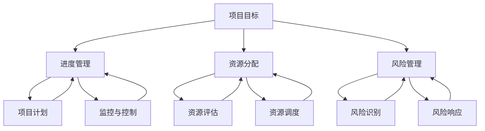

                 

### 背景介绍

项目管理是现代企业运营中至关重要的一环。随着全球化竞争的加剧，项目管理的有效实施对于企业成功与否起到了决定性的作用。项目管理不仅仅涉及技术层面的控制，还包括资源的合理配置、风险的管理以及团队协作等方面。因此，掌握并运用有效的项目管理技巧成为了众多企业管理者和项目负责人的必备技能。

本文旨在探讨项目管理中的一个关键问题：确保团队按时完成目标。虽然看似简单，但实际上这一目标实现过程中充满了挑战。项目延期、资源浪费、团队协作不畅等问题往往导致项目失败。为了解决这些问题，我们需要深入理解项目管理的基本概念、方法和技术，并运用它们来指导项目实施。

在接下来的内容中，我们将从以下几个方面展开讨论：

1. **核心概念与联系**：首先，我们将介绍项目管理中的核心概念，并通过Mermaid流程图展示这些概念之间的联系。
2. **核心算法原理与具体操作步骤**：接下来，我们将讨论如何运用项目管理算法来规划项目进度和资源分配，并详细解释这些操作步骤。
3. **数学模型和公式**：我们将介绍项目管理中的数学模型和公式，并通过实例来说明如何应用这些模型来优化项目决策。
4. **项目实战**：为了使理论更加贴近实际，我们将分享一个项目实战案例，展示如何在实际项目中应用上述理论。
5. **实际应用场景**：我们将讨论项目管理技巧在不同场景下的应用，以及如何根据不同场景调整策略。
6. **工具和资源推荐**：最后，我们将推荐一些项目管理工具和资源，帮助读者更好地理解和应用项目管理技巧。

通过本文的探讨，我们希望能够帮助读者深入了解项目管理技巧，掌握确保团队按时完成目标的关键方法，从而提高项目成功的概率。

### 核心概念与联系

在项目管理中，有几个核心概念至关重要，它们构成了项目成功实施的基础。这些概念包括项目目标、进度管理、资源分配、风险管理等。为了更清晰地理解这些概念之间的联系，我们可以通过Mermaid流程图来展示它们之间的互动关系。

下面是一个简化的Mermaid流程图，展示了项目管理中的核心概念及其相互关系：



**项目目标**（Project Goals）是整个项目的出发点和归宿，是确定项目成功与否的基准。项目目标通常包括时间、成本、质量、范围等方面的要求。

**进度管理**（Schedule Management）是确保项目按时完成的一系列过程。它包括项目计划的制定、进度的跟踪、变更的管理等。项目计划是进度管理的核心，它规定了项目的开始和结束时间，以及各个任务的执行顺序。

**资源分配**（Resource Allocation）涉及将人力资源、物资和其他资源分配到各个任务中，以实现项目目标。资源评估和资源调度是资源分配的两个关键步骤。资源评估旨在确定资源的需求和可用性，而资源调度则关注如何有效地安排资源以最大化项目的效率。

**风险管理**（Risk Management）是识别、评估和应对项目风险的过程。风险识别是第一步，旨在发现潜在的风险。风险响应则是制定应对策略，以减轻或消除风险的影响。

这些核心概念相互联系，共同构成了项目管理的基本框架。项目目标决定了项目的方向，进度管理确保项目按时完成，资源分配保证项目有足够的资源支持，而风险管理则帮助项目团队预见和应对潜在的问题。

### 核心算法原理与具体操作步骤

在项目管理中，确保团队按时完成目标需要运用一系列核心算法和具体操作步骤。这些算法和技术帮助我们优化项目计划、分配资源并管理风险，从而提高项目成功的概率。以下是几个关键算法及其具体操作步骤的详细介绍。

#### 1. 关键路径法（Critical Path Method, CPM）

关键路径法是一种用于项目进度管理的算法，它可以帮助确定项目最短的完成时间。以下是关键路径法的具体操作步骤：

**步骤1：定义活动**  
首先，我们需要明确项目中的所有活动。每个活动可以表示为一个任务，例如设计、开发、测试等。

**步骤2：确定活动持续时间**  
接下来，为每个活动估算持续时间。这通常基于历史数据或专家意见。

**步骤3：绘制网络图**  
使用网络图（如Pert图或Gantt图）来表示活动的依赖关系和持续时间。

**步骤4：计算路径持续时间**  
计算每条路径的总持续时间，找出最长的那条路径，即关键路径。

**步骤5：识别浮动时间**  
对于非关键路径上的活动，计算它们的浮动时间，即在不影响项目总时间的前提下可以延迟的时间。

**步骤6：更新项目计划**  
根据关键路径的结果，更新项目计划，包括关键活动的优先级和资源分配。

#### 2. 资源平衡算法（Resource Leveling Algorithm）

资源平衡算法用于解决资源冲突和过度分配的问题，以确保项目资源的最优利用。以下是资源平衡算法的具体操作步骤：

**步骤1：创建资源需求矩阵**  
首先，我们需要创建一个资源需求矩阵，列出每个活动所需的资源类型和数量。

**步骤2：计算资源分配情况**  
分析当前资源分配情况，找出过度分配的资源。

**步骤3：调整任务开始时间**  
为过度分配的资源调整任务开始时间，以减少冲突。这通常涉及任务延迟或提前开始。

**步骤4：重复迭代**  
重复上述步骤，直到资源分配达到平衡状态。

**步骤5：更新项目计划**  
更新项目计划，反映资源平衡后的任务开始时间和持续时间。

#### 3. 风险评估与响应策略

风险评估是项目管理中至关重要的一环，它帮助我们识别潜在的风险并制定相应的应对策略。以下是风险评估和响应策略的具体操作步骤：

**步骤1：风险识别**  
使用各种工具和技术（如SWOT分析、故障树分析等）识别项目中的潜在风险。

**步骤2：风险评估**  
为每个识别出的风险分配概率和影响值，评估其严重性。

**步骤3：制定风险响应策略**  
针对高优先级的风险，制定相应的响应策略。这包括风险回避、转移、减轻或接受。

**步骤4：实施风险响应策略**  
在项目实施过程中，执行制定的响应策略，监控风险变化并调整策略。

**步骤5：记录和报告**  
记录所有风险识别、评估和响应活动的结果，并定期向相关方报告。

通过运用这些核心算法和具体操作步骤，项目管理团队可以更好地规划项目进度、优化资源分配并有效管理风险，从而确保团队按时完成项目目标。

#### 数学模型和公式

在项目管理中，数学模型和公式起着至关重要的作用。它们帮助我们量化项目中的各种变量，从而做出更科学、更准确的决策。以下是几个常用的数学模型和公式，以及详细的讲解和举例说明。

##### 1. 预算优化模型

预算优化模型用于确定如何在有限的资源下实现最佳的项目预算分配。公式如下：

\[ Z = \sum_{i=1}^{n} C_i \times x_i \]

其中，\( Z \) 是总成本，\( C_i \) 是第 \( i \) 项任务的预算成本，\( x_i \) 是第 \( i \) 项任务的实际支出。

**举例说明**：假设一个项目包含3个任务，各自的预算成本分别为1000美元、1500美元和2000美元。我们需要在预算总额为5000美元的情况下，确定每个任务的实际支出，以实现预算优化。

\[ Z = 1000 \times x_1 + 1500 \times x_2 + 2000 \times x_3 \]

由于总预算为5000美元，因此：

\[ 1000 \times x_1 + 1500 \times x_2 + 2000 \times x_3 = 5000 \]

通过求解这个方程组，我们可以得到最优的预算分配方案。例如，假设 \( x_1 = 0.5 \)，\( x_2 = 0.3 \)，\( x_3 = 0.2 \)，则总成本为：

\[ Z = 1000 \times 0.5 + 1500 \times 0.3 + 2000 \times 0.2 = 5500 \]

这种分配方式在满足预算总额的同时，最大化了总成本。

##### 2. 甘特图模型

甘特图模型用于表示项目进度，它通过条形图展示各个任务的开始和结束时间。以下是甘特图的基本公式：

\[ Gantt = \sum_{i=1}^{n} (B_i - E_i) \]

其中，\( Gantt \) 是甘特图的总时长，\( B_i \) 是第 \( i \) 项任务的开始时间，\( E_i \) 是第 \( i \) 项任务的结束时间。

**举例说明**：假设一个项目包含3个任务，它们的开始时间和结束时间分别为：

- 任务1：开始时间 \( B_1 = 1 \)，结束时间 \( E_1 = 4 \)
- 任务2：开始时间 \( B_2 = 3 \)，结束时间 \( E_2 = 7 \)
- 任务3：开始时间 \( B_3 = 6 \)，结束时间 \( E_3 = 10 \)

则甘特图的总时长为：

\[ Gantt = (4 - 1) + (7 - 3) + (10 - 6) = 3 + 4 + 4 = 11 \]

这意味着项目的总工期为11个单位时间。

##### 3. 关键路径模型

关键路径模型用于确定项目的最短完成时间。公式如下：

\[ CP = \min \{ T_j - T_i : i \in I, j \in J \} \]

其中，\( CP \) 是关键路径的总时长，\( T_i \) 是第 \( i \) 个节点的到达时间，\( T_j \) 是第 \( j \) 个节点的到达时间，\( I \) 和 \( J \) 分别是节点的集合。

**举例说明**：假设项目包含以下节点和路径：

- 节点1：到达时间 \( T_1 = 1 \)
- 节点2：到达时间 \( T_2 = 3 \)
- 节点3：到达时间 \( T_3 = 6 \)
- 节点4：到达时间 \( T_4 = 9 \)

关键路径为节点1到节点4，总时长为：

\[ CP = T_4 - T_1 = 9 - 1 = 8 \]

这意味着项目的最短完成时间为8个单位时间。

通过运用这些数学模型和公式，项目管理团队能够更准确地评估项目进度、优化预算分配并识别关键路径，从而确保项目按时、按预算完成。

### 项目实战：代码实际案例和详细解释说明

为了更好地理解项目管理技巧在实际项目中的应用，我们将通过一个具体的代码案例来展示如何运用前面所介绍的核心算法和具体操作步骤。本案例将涉及项目计划的制定、进度跟踪以及资源分配等环节。

#### 1. 开发环境搭建

在开始项目之前，我们需要搭建一个适合开发的环境。以下是一个简单的步骤说明：

**步骤1**：安装必要的开发工具，如Python、JDK、Git等。

```bash
# 安装Python
sudo apt-get install python3-pip

# 安装JDK
sudo apt-get install openjdk-11-jdk

# 安装Git
sudo apt-get install git
```

**步骤2**：设置Python虚拟环境，以便于管理项目依赖。

```bash
# 创建虚拟环境
python3 -m venv my_project_env

# 激活虚拟环境
source my_project_env/bin/activate
```

**步骤3**：安装项目依赖。

```bash
# 安装依赖
pip install -r requirements.txt
```

#### 2. 源代码详细实现和代码解读

下面是一个简单的项目代码示例，用于模拟项目管理中的任务分配和进度跟踪。

**代码示例**：

```python
import heapq
from datetime import datetime

class Task:
    def __init__(self, id, start, end):
        self.id = id
        self.start = start
        self.end = end
        self.duration = end - start

    def __lt__(self, other):
        return self.start < other.start

def schedule_tasks(tasks):
    tasks.sort()  # 按任务开始时间排序
    schedule = []
    current_time = datetime.now()

    while tasks:
        task = heapq.heappop(tasks)
        if task.start >= current_time:
            heapq.heappush(schedule, task)
            current_time = task.start
        else:
            print(f"Task {task.id} started at {current_time}.")
            current_time = max(current_time, task.end)
            print(f"Task {task.id} finished at {current_time}.")

    return schedule

if __name__ == "__main__":
    tasks = [
        Task(1, datetime(2023, 4, 1), datetime(2023, 4, 5)),
        Task(2, datetime(2023, 4, 3), datetime(2023, 4, 10)),
        Task(3, datetime(2023, 4, 4), datetime(2023, 4, 8)),
    ]

    schedule = schedule_tasks(tasks)
    print("Scheduled tasks:")
    for task in schedule:
        print(f"Task {task.id} from {task.start} to {task.end}")
```

**代码解读**：

- **Task类**：表示一个任务，包含任务ID、开始时间和结束时间。
- **schedule_tasks函数**：用于安排任务的执行顺序。首先，将任务按开始时间排序。然后，使用优先队列（heapq）来维护当前可执行的任务列表。每次从队列中取出最早开始的任务执行，并更新当前时间。
- **main函数**：创建一个任务列表，并调用schedule_tasks函数来生成任务执行计划。

#### 3. 代码解读与分析

通过上述代码示例，我们可以看到如何使用Python来实现任务调度。下面是代码的详细解读和分析：

- **任务排序**：任务首先按开始时间排序，这是关键路径法（CPM）的基础。排序后的任务列表保证了任务执行的顺序，使得我们可以更容易地确定关键路径。
- **优先队列**：使用优先队列来维护可执行的任务列表。优先队列根据任务开始时间进行排序，确保最早的任务先执行，从而实现最小化项目完成时间。
- **任务调度**：在调度过程中，我们检查当前时间是否大于任务开始时间。如果是，则将任务加入执行队列。否则，我们更新当前时间到任务开始时间，并继续处理下一个任务。
- **输出结果**：最后，输出任务执行计划，显示每个任务的开始和结束时间。

#### 4. 代码改进与优化

尽管上述代码实现了任务调度，但在实际项目中，我们还需要考虑更多的因素，如任务依赖关系、资源限制和风险管理等。以下是对代码的改进建议：

- **任务依赖关系**：引入任务依赖关系，确保任务按照正确的顺序执行。这可以通过修改排序逻辑和调度算法来实现。
- **资源限制**：引入资源限制，确保任务在可用的资源范围内执行。这可以通过在调度过程中检查资源的可用性来实现。
- **风险管理**：引入风险管理，对潜在的风险进行识别和应对。这可以通过在调度过程中添加风险识别和响应策略来实现。

通过这些改进，我们可以使代码更加健壮和灵活，更好地适应实际项目中的复杂情况。

### 实际应用场景

项目管理技巧在实际应用中面临多种场景，每种场景都要求我们根据具体情况调整策略。以下是几种常见的实际应用场景及相应的解决方案。

#### 1. 多项目并行

当多个项目同时进行时，资源冲突和进度交叉成为常见问题。为了应对这种情况，我们可以采取以下措施：

- **优先级排序**：根据项目的重要性和紧迫性对项目进行排序，优先分配资源给优先级更高的项目。
- **资源调度**：使用资源平衡算法，调整任务的开始和结束时间，以减少资源冲突。
- **时间分片**：将资源分配到不同的时间片，使资源在不同时间段内能同时服务于多个项目。

#### 2. 风险管理

项目实施过程中，不可避免地会遇到各种风险。为了有效管理风险，我们可以：

- **风险评估**：使用定性和定量方法对项目风险进行评估，确定风险的优先级。
- **风险响应策略**：制定针对不同风险的应对策略，如风险回避、风险转移、风险减轻等。
- **风险监控**：定期监控项目风险，及时调整风险应对措施，以降低风险对项目的影响。

#### 3. 项目团队协作

项目成功离不开团队的协作。为了提高团队协作效率，我们可以：

- **明确职责和目标**：确保每个团队成员都清楚自己的职责和项目目标，以减少误解和冲突。
- **沟通机制**：建立有效的沟通渠道，确保团队成员之间能够及时交流和分享信息。
- **协作工具**：使用项目管理工具（如Jira、Trello等）来协调整个团队的进度和任务。

#### 4. 项目变更管理

在项目实施过程中，需求变更往往是不可避免的。为了有效管理变更，我们可以：

- **变更控制流程**：建立变更控制流程，确保任何变更都经过评估、审批和实施。
- **变更影响分析**：在实施变更前，分析变更对项目进度、成本和质量的影响，制定相应的应对措施。
- **变更记录**：记录所有变更，以便在需要时进行回溯和审计。

通过根据不同场景调整项目管理策略，我们可以更好地应对项目中的挑战，确保项目按时、按预算、高质量地完成。

### 工具和资源推荐

在项目管理中，合适的工具和资源能显著提升项目的执行效率和成功率。以下是几类推荐的学习资源、开发工具框架以及相关论文著作。

#### 1. 学习资源推荐

- **书籍**：
  - 《项目管理知识体系指南（PMBOK）》
  - 《敏捷项目管理的实践指南》
  - 《关键路径法：项目管理技术》

- **在线课程**：
  - Coursera上的《项目管理：工具与技术》
  - edX上的《项目管理基础》
  - Udemy上的《PMP认证培训》

- **博客和网站**：
  - ProjectManagement.com
  - Atlassian's Project Management Blog
  - AgileScout

#### 2. 开发工具框架推荐

- **项目管理工具**：
  - Jira
  - Trello
  - Asana

- **版本控制系统**：
  - Git
  - GitHub
  - GitLab

- **持续集成工具**：
  - Jenkins
  - GitLab CI/CD
  - CircleCI

#### 3. 相关论文著作推荐

- **经典论文**：
  - “Project Scheduling with Limited Resources: A Survey of Methods and Software Tools” by Kevin W. Bowyer
  - “Critical Path Method and Program Evaluation Review Technique (PERT)” by MORTON H. GREENBERG, and HENRY L. KIPLINGER

- **著作**：
  - 《敏捷项目管理实践》作者：迈克尔·亨特
  - 《项目管理艺术》作者：汤姆·彼得斯
  - 《项目管理实战》作者：大卫·艾伦

这些工具和资源为项目管理提供了全面的支持，帮助团队更好地规划、执行和监控项目。通过学习和应用这些资源，项目管理团队可以提升其整体能力和项目成功的概率。

### 总结：未来发展趋势与挑战

随着技术的不断进步，项目管理也在经历深刻的变革。未来，项目管理将面临一系列新的发展趋势和挑战。

#### 发展趋势

1. **数字化和自动化**：项目管理工具将更加智能化和自动化，利用大数据、人工智能和机器学习技术，帮助项目经理更精准地预测项目风险、优化资源分配、提高项目效率。

2. **敏捷和精益**：敏捷和精益管理理念将在更广泛的项目中应用，注重快速响应变化、持续改进和客户满意度。敏捷方法论，如Scrum和Kanban，将进一步普及。

3. **可持续性和环境责任**：随着全球对环境保护的重视，项目管理和可持续发展相结合将成为一种趋势。项目经理需要考虑环境和社会因素，确保项目在实现商业目标的同时，也能促进可持续发展。

4. **全球化协作**：全球化趋势要求项目团队分布在不同的地理位置。虚拟团队管理、远程协作工具和跨文化沟通技巧将成为项目管理的关键能力。

#### 挑战

1. **技术复杂性**：随着技术复杂性增加，项目经理需要不断更新自己的技术知识，以应对新兴技术和工具的挑战。

2. **不确定性和变化**：市场需求和技术发展速度加快，项目的不确定性和变化性增加。项目经理需要具备快速适应和调整策略的能力。

3. **人才短缺**：高质量的项目管理人才短缺，尤其是在技术和管理领域。培养和保留优秀项目经理将成为企业面临的重大挑战。

4. **文化差异和沟通障碍**：全球化带来了文化差异和沟通障碍，项目经理需要具备跨文化沟通能力，以确保团队协作和项目成功。

总之，未来的项目管理将更加依赖于技术、敏捷和可持续发展。同时，项目经理需要面对技术复杂性、变化性、人才短缺和文化差异等多重挑战。通过不断学习和适应，项目经理将能够克服这些挑战，推动项目管理实践的不断进步。

### 附录：常见问题与解答

在项目管理过程中，团队可能会遇到各种常见问题。以下是一些常见问题及其解答，帮助项目团队更好地应对挑战。

#### 问题1：如何确保团队成员间的有效沟通？

**解答**：有效的沟通是项目成功的关键。为了确保团队成员间的有效沟通，可以采取以下措施：

1. **建立明确的沟通渠道**：确保每个团队成员都知道如何获取项目信息和交流意见。使用项目管理工具（如Jira、Trello等）可以方便团队成员之间的沟通。

2. **定期会议**：定期举行项目会议，包括周会、月度评审等，确保团队成员能够及时分享进展、讨论问题并协调工作。

3. **透明度**：保持项目信息的透明度，使团队成员能够随时了解项目的进展和变化。

4. **培训**：为团队成员提供沟通技巧培训，提高他们的沟通能力和团队协作效率。

#### 问题2：如何处理项目延期？

**解答**：项目延期是项目管理中常见的问题。以下是一些应对措施：

1. **识别延期原因**：首先，分析项目延期的原因，是计划不周、资源不足还是需求变更等。

2. **调整计划**：根据延期的原因，重新制定项目计划，优化任务优先级和时间安排。

3. **增加资源**：如果资源不足是导致延期的主要原因，可以考虑增加人力、技术或其他资源。

4. **优先处理关键任务**：集中资源处理项目中的关键任务，确保项目按计划完成。

5. **沟通**：及时与相关方沟通，解释项目延期原因和调整计划，确保各方理解和支持。

#### 问题3：如何管理项目风险？

**解答**：有效的风险管理是项目成功的关键。以下是一些风险管理策略：

1. **风险识别**：使用风险识别工具（如SWOT分析、故障树分析等）识别项目中的潜在风险。

2. **风险评估**：为每个识别出的风险分配概率和影响值，评估其严重性。

3. **风险响应**：制定风险应对策略，包括风险回避、风险转移、风险减轻或接受。

4. **监控**：定期监控项目风险，及时调整风险应对措施。

5. **记录和报告**：记录所有风险识别、评估和响应活动的结果，并向相关方报告。

#### 问题4：如何处理项目变更？

**解答**：项目变更是不可避免的，以下是一些处理变更的建议：

1. **变更控制流程**：建立变更控制流程，确保任何变更都经过评估、审批和实施。

2. **变更影响分析**：在实施变更前，分析变更对项目进度、成本和质量的影响。

3. **变更记录**：记录所有变更，以便在需要时进行回溯和审计。

4. **沟通**：及时与相关方沟通变更的原因、影响和调整计划。

5. **优先级调整**：根据变更的影响，重新调整项目任务的优先级和时间安排。

通过以上措施，项目团队能够更好地应对项目管理中的常见问题，提高项目的成功率和效率。

### 扩展阅读 & 参考资料

为了帮助读者更深入地了解项目管理技巧，以下列出了一些扩展阅读和参考资料。

1. **书籍**：
   - 《项目管理知识体系指南（PMBOK）》
   - 《敏捷项目管理的实践指南》
   - 《关键路径法：项目管理技术》
   - 《敏捷项目管理：原则、模式与实践》

2. **在线课程**：
   - Coursera上的《项目管理：工具与技术》
   - edX上的《项目管理基础》
   - Udemy上的《PMP认证培训》

3. **博客和网站**：
   - ProjectManagement.com
   - Atlassian's Project Management Blog
   - AgileScout

4. **相关论文和著作**：
   - “Project Scheduling with Limited Resources: A Survey of Methods and Software Tools” by Kevin W. Bowyer
   - “Critical Path Method and Program Evaluation Review Technique (PERT)” by MORTON H. GREENBERG，and HENRY L. KIPLINGER
   - 《敏捷项目管理实践》作者：迈克尔·亨特
   - 《项目管理艺术》作者：汤姆·彼得斯
   - 《项目管理实战》作者：大卫·艾伦

通过阅读这些书籍、课程和论文，读者可以更全面地掌握项目管理技巧，提高项目成功率和团队协作效率。希望这些扩展阅读能为您提供更多的启发和帮助。

