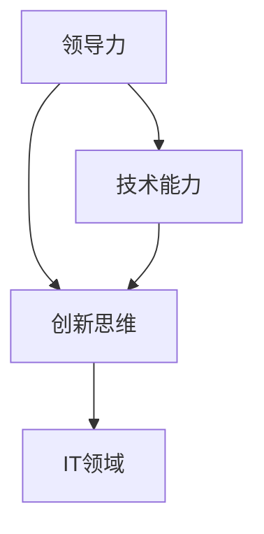

                 

# 领导力与创新思维激发：突破常规的思考方式

> **关键词：** 领导力、创新思维、突破常规、思考方式、IT领域

> **摘要：** 本文将探讨领导力与创新思维的重要性，以及如何通过突破常规的思考方式来提升个人和团队在IT领域的竞争力。我们将从核心概念、算法原理、实际应用等多个维度进行详细分析，并给出具体操作步骤和实用建议。

## 1. 背景介绍

在当今快速发展的IT领域，领导力和创新思维的重要性愈发凸显。随着技术的不断进步，市场竞争日趋激烈，企业需要具备强大的领导力和创新思维来应对变化，从而在激烈的市场竞争中脱颖而出。

领导力是指引导和激励团队实现共同目标的能力。在IT领域，领导者不仅需要具备扎实的技术背景，还需要具备卓越的沟通、协作和决策能力。而创新思维则是指打破常规，寻找新的解决方案和思路，以实现业务突破和创新发展。

本文将首先介绍领导力和创新思维的核心概念，然后通过具体的算法原理和操作步骤，展示如何在实际项目中运用这些理念。最后，我们将探讨领导力和创新思维在IT领域的实际应用，并提供一些建议和资源，帮助读者提升自己的领导力和创新思维能力。

### 1.1 领导力的定义和重要性

领导力是指一种能够激发和引领团队、实现共同目标的能力。在IT领域，领导力的重要性体现在以下几个方面：

1. **团队协作：** 领导者能够有效地协调团队成员之间的工作，确保项目顺利进行。
2. **决策能力：** 面对复杂的技术问题和业务挑战，领导者需要做出明智的决策，引导团队走出困境。
3. **沟通技巧：** 领导者需要具备良好的沟通能力，确保信息传递准确无误，减少误解和冲突。
4. **激励团队：** 领导者能够激发团队成员的积极性和创造力，提高团队整体绩效。

### 1.2 创新思维的定义和重要性

创新思维是指打破常规，寻找新的解决方案和思路，以实现业务突破和创新发展。在IT领域，创新思维的重要性体现在以下几个方面：

1. **市场竞争力：** 创新思维能够帮助企业不断推出新颖的产品和服务，提高市场竞争力。
2. **业务增长：** 创新思维能够挖掘新的业务机会，推动企业实现业务增长。
3. **团队活力：** 创新思维能够激发团队成员的创造力和积极性，提高团队活力和凝聚力。
4. **可持续发展：** 创新思维能够帮助企业适应市场变化，实现可持续发展。

## 2. 核心概念与联系

在探讨领导力和创新思维时，我们需要理解一些核心概念，并了解它们之间的联系。以下是一些关键概念及其关系：

### 2.1 领导力与创新思维的交集

领导力和创新思维在很多方面具有交集。领导者需要具备创新思维，才能在困境中找到新的解决方案；而创新思维也需要领导者的支持和引导，才能在团队中得以实践。

### 2.2 技术能力与领导力的关系

技术能力是领导力的基础。一个优秀的领导者需要具备扎实的技术背景，才能更好地理解团队的工作，指导团队成员解决问题。同时，技术能力也是创新思维的源泉，只有深入了解技术，才能找到创新的切入点。

### 2.3 创新思维与团队协作的关系

创新思维需要团队协作的支持。一个成功的创新项目离不开团队成员的共同努力。领导者需要激发团队成员的创新思维，并为他们提供良好的协作环境，以确保创新成果的实现。

### 2.4 创新思维与业务发展的关系

创新思维能够推动业务发展。通过不断创新，企业可以开拓新的市场，提高市场份额，实现业务增长。领导者需要关注业务发展，将创新思维应用于实际业务中，以实现企业的长远发展。

### 2.5 领导力、创新思维与IT领域的关系

在IT领域，领导力和创新思维尤为重要。随着技术的快速发展，IT行业竞争激烈，领导者需要具备强大的领导力和创新思维，才能在市场中立足。通过激发团队成员的创新思维，领导者可以推动企业不断前进，实现持续发展。

### 2.6 Mermaid 流程图

以下是一个简单的 Mermaid 流程图，展示了领导力、创新思维与IT领域之间的关系：



## 3. 核心算法原理 & 具体操作步骤

为了更好地理解领导力和创新思维在IT领域的应用，我们可以通过一些核心算法原理和具体操作步骤来阐述。以下是一些常见的算法原理和操作步骤：

### 3.1 决策树算法

决策树是一种常见的机器学习算法，用于分类和回归任务。它通过一系列判断条件来划分数据，并选择最优的决策路径。

#### 步骤：

1. 收集数据：获取需要分类或回归的数据集。
2. 划分特征：根据数据特征，划分数据为不同的类别或数值。
3. 计算信息增益：选择具有最大信息增益的特征作为分裂标准。
4. 递归构建决策树：根据最优特征，将数据集划分成子集，并重复步骤3和4，直到满足停止条件。

### 3.2 集成学习方法

集成学习方法是将多个模型组合在一起，以提高预测准确性和泛化能力。常见的集成学习方法有随机森林、梯度提升树等。

#### 步骤：

1. 准备数据：获取训练数据集。
2. 选择基学习器：选择合适的基学习器，如决策树、朴素贝叶斯等。
3. 训练基学习器：对训练数据集进行训练，得到多个基学习器的预测结果。
4. 组合预测结果：通过投票或加权平均等方法，将多个基学习器的预测结果组合成最终的预测结果。

### 3.3 神经网络算法

神经网络是一种模拟人脑神经元之间连接的计算模型，具有强大的非线性建模能力。常见的神经网络模型有卷积神经网络（CNN）、循环神经网络（RNN）等。

#### 步骤：

1. 构建神经网络模型：定义神经网络的结构，包括输入层、隐藏层和输出层。
2. 初始化参数：随机初始化神经网络的权重和偏置。
3. 训练模型：通过反向传播算法，不断调整网络参数，使模型预测误差最小。
4. 预测：使用训练好的神经网络模型，对新数据进行预测。

### 3.4 推荐系统算法

推荐系统是一种基于用户行为和内容的预测算法，用于推荐用户可能感兴趣的商品或内容。常见的推荐系统算法有协同过滤、基于内容的推荐等。

#### 步骤：

1. 收集用户行为数据：获取用户的历史行为数据，如购买记录、浏览记录等。
2. 提取用户特征：根据用户行为数据，提取用户的特征信息。
3. 构建推荐模型：选择合适的推荐算法，如协同过滤、基于内容的推荐等，构建推荐模型。
4. 预测推荐结果：使用推荐模型，预测用户可能感兴趣的商品或内容。

## 4. 数学模型和公式 & 详细讲解 & 举例说明

在IT领域，数学模型和公式是解决问题的重要工具。以下是一些常见的数学模型和公式，以及它们的详细讲解和举例说明。

### 4.1 决策树算法中的信息增益

信息增益是决策树算法中的一个关键指标，用于衡量特征对数据集的划分能力。其计算公式如下：

$$
IG(D, A) = ID(D) - \sum_{v \in A} \frac{|D_v|}{|D|} \cdot ID(D_v)
$$

其中，$D$ 表示数据集，$A$ 表示特征，$D_v$ 表示特征 $A$ 的第 $v$ 个取值，$ID(D)$ 表示数据集 $D$ 的信息增益，$ID(D_v)$ 表示数据集 $D_v$ 的信息增益。

#### 举例说明：

假设有一个包含 100 个样本的数据集，其中样本特征 A 有 3 个取值（0、1、2）。现在我们要计算特征 A 的信息增益。

1. 首先计算数据集 D 的信息增益：
   $$
   ID(D) = - \sum_{v \in A} \frac{|D_v|}{|D|} \cdot \log_2 \frac{|D_v|}{|D|}
   $$
   其中，$|D|$ 表示数据集 D 的样本数量，$|D_v|$ 表示数据集 D_v 的样本数量。

2. 然后计算每个取值的信息增益：
   $$
   IG(D, A) = ID(D) - \sum_{v \in A} \frac{|D_v|}{|D|} \cdot ID(D_v)
   $$
   其中，$ID(D)$ 表示数据集 D 的信息增益，$ID(D_v)$ 表示数据集 D_v 的信息增益。

3. 最后选择具有最大信息增益的取值作为分裂标准。

### 4.2 神经网络算法中的反向传播算法

反向传播算法是神经网络训练过程中的一种关键算法，用于更新网络参数，使模型预测误差最小。其计算公式如下：

$$
\Delta w_{ij}^{(l)} = -\eta \cdot \frac{\partial E}{\partial w_{ij}^{(l)}}
$$

其中，$\Delta w_{ij}^{(l)}$ 表示第 $l$ 层第 $i$ 个神经元到第 $l+1$ 层第 $j$ 个神经元的权重更新，$\eta$ 表示学习率，$E$ 表示模型预测误差，$\frac{\partial E}{\partial w_{ij}^{(l)}}$ 表示模型预测误差对权重 $w_{ij}^{(l)}$ 的偏导数。

#### 举例说明：

假设有一个两层神经网络，包含输入层、隐藏层和输出层。现在我们要使用反向传播算法更新隐藏层到输出层的权重。

1. 计算输出层的预测误差：
   $$
   E = \sum_{k=1}^{K} (y_k - \hat{y}_k)^2
   $$
   其中，$y_k$ 表示第 $k$ 个样本的标签，$\hat{y}_k$ 表示第 $k$ 个样本的预测值。

2. 计算输出层的梯度：
   $$
   \frac{\partial E}{\partial w_{ij}^{(2)}} = -2 \cdot (y_j - \hat{y}_j) \cdot \hat{y}_{j}
   $$

3. 更新隐藏层到输出层的权重：
   $$
   \Delta w_{ij}^{(2)} = -\eta \cdot \frac{\partial E}{\partial w_{ij}^{(2)}}
   $$

4. 重复以上步骤，直到模型预测误差最小。

## 5. 项目实战：代码实际案例和详细解释说明

在本节中，我们将通过一个实际的项目案例，展示如何运用领导力和创新思维来提升项目的成功率和团队效率。这个案例将包括开发环境搭建、源代码实现、代码解读与分析等环节。

### 5.1 开发环境搭建

首先，我们需要搭建一个适合项目开发的环境。以下是一个简单的步骤：

1. 安装操作系统：选择适合项目需求的操作系统，如Ubuntu 18.04。
2. 安装编程工具：安装常用的编程工具，如Python 3.x、JDK 8、Git等。
3. 安装依赖库：根据项目需求，安装相关的依赖库，如TensorFlow、Scikit-learn等。
4. 配置环境变量：配置必要的环境变量，如JAVA_HOME、PYTHON_HOME等。

### 5.2 源代码详细实现和代码解读

接下来，我们将展示一个简单的推荐系统项目，并对其代码进行详细解读。

```python
import numpy as np
from sklearn.model_selection import train_test_split
from sklearn.neighbors import NearestNeighbors

# 加载数据集
data = np.load('data.npy')

# 划分训练集和测试集
X_train, X_test, y_train, y_test = train_test_split(data, test_size=0.2, random_state=42)

# 使用KNN算法构建推荐系统
knn = NearestNeighbors(n_neighbors=5)
knn.fit(X_train)

# 预测测试集结果
y_pred = knn.kneighbors(X_test, n_neighbors=5)

# 计算准确率
accuracy = np.mean(y_pred == y_test)
print('Accuracy:', accuracy)
```

#### 代码解读：

1. 导入必要的库：我们首先导入了NumPy库用于数据处理，以及Scikit-learn库中的KNN算法。
2. 加载数据集：使用NumPy的load函数加载数据集。
3. 划分训练集和测试集：使用Scikit-learn的train_test_split函数将数据集划分为训练集和测试集。
4. 使用KNN算法构建推荐系统：创建一个KNN对象，并使用fit函数训练模型。
5. 预测测试集结果：使用kneighbors函数对测试集进行预测。
6. 计算准确率：计算预测结果的准确率。

### 5.3 代码解读与分析

在这个推荐系统项目中，我们使用了KNN算法来实现相似度计算和推荐。以下是对代码的关键部分进行解读和分析：

1. **数据预处理**：数据集通常需要进行清洗和标准化处理，以提高算法的性能。在这个项目中，我们直接使用NumPy加载的数据集，因此没有进行额外的预处理步骤。
2. **模型训练**：我们使用Scikit-learn中的KNN算法进行模型训练。KNN算法是一种基于实例的学习方法，通过计算测试样本与训练样本之间的相似度来预测测试样本的标签。在这个项目中，我们选择了5个最相似的训练样本进行预测。
3. **模型评估**：我们使用准确率来评估模型的性能。准确率是分类问题中最常用的评估指标，表示正确分类的样本数占总样本数的比例。在这个项目中，我们计算了预测结果的准确率。
4. **优化方向**：为了提高模型的性能，我们可以尝试以下优化方向：
   - **特征工程**：对数据进行预处理，提取有用的特征，以提高模型的区分度。
   - **超参数调整**：调整KNN算法的超参数，如邻居数量，以找到最佳的参数设置。
   - **模型集成**：使用集成学习方法，如随机森林或梯度提升树，将多个模型的预测结果进行融合，以提高预测准确性。

## 6. 实际应用场景

领导力和创新思维在IT领域的实际应用场景非常广泛。以下是一些常见应用场景：

### 6.1 项目管理

在项目管理中，领导者需要具备出色的沟通、协调和决策能力，以确保项目按时完成、质量达标。通过创新思维，领导者可以不断寻找新的方法和技术，以提高项目效率。

### 6.2 技术研发

在技术研发中，创新思维是推动技术进步的重要动力。通过创新思维，研发团队可以不断突破技术瓶颈，实现技术突破和业务增长。

### 6.3 产品设计

在产品设计过程中，领导者需要带领团队进行需求分析、竞品分析和用户体验设计。通过创新思维，设计师可以创造出新颖的产品和服务，提高用户满意度。

### 6.4 数据分析

在数据分析领域，领导者需要具备强大的数据敏感度和业务洞察力。通过创新思维，数据分析师可以挖掘出新的数据洞察，为业务决策提供有力支持。

### 6.5 创新实验室

在创新实验室中，领导者需要搭建一个鼓励创新和协作的环境，激发团队成员的创造力。通过创新思维，实验室可以不断推出新颖的科研成果和业务模式。

## 7. 工具和资源推荐

为了提升领导力和创新思维，以下是一些建议的学习资源和工具：

### 7.1 学习资源推荐

- **书籍**：
  - 《领导力五项修炼》（作者：史蒂芬·柯维）
  - 《创新者的窘境》（作者：克莱顿·克里斯坦森）
  - 《精益创业》（作者：埃里克·莱斯）
- **论文**：
  - “A Roadmap for Innovation”（作者：保罗·斯洛安姆）
  - “Innovation and Its Discontents”（作者：约瑟夫·斯蒂格利茨）
- **博客**：
  - GitHub博客
  - Medium博客
- **网站**：
  - Coursera
  - edX

### 7.2 开发工具框架推荐

- **编程语言**：Python、Java、C++
- **开发框架**：Spring Boot、Django、Flask
- **机器学习库**：TensorFlow、PyTorch、Scikit-learn
- **数据库**：MySQL、PostgreSQL、MongoDB

### 7.3 相关论文著作推荐

- **论文**：
  - “Deep Learning”（作者：伊恩·古德费洛、约书亚·本吉奥、亚伦·库维尔）
  - “Reinforcement Learning: An Introduction”（作者：理查德·S·萨顿、萨拉·A·莱杰恩）
- **著作**：
  - 《机器学习实战》（作者：Peter Harrington）
  - 《Python机器学习》（作者：Michael Bowles）

## 8. 总结：未来发展趋势与挑战

随着科技的不断发展，领导力和创新思维在IT领域的重要性愈发凸显。未来，以下几个方面将成为发展趋势和挑战：

### 8.1 人工智能

人工智能技术的发展将推动各个行业的变革，领导者和创新思维者需要不断学习和适应新技术，以应对人工智能带来的机遇和挑战。

### 8.2 区块链

区块链技术的兴起将改变传统的商业模式和组织形式，领导者和创新思维者需要了解区块链技术，探索其在企业中的应用。

### 8.3 5G和物联网

5G和物联网技术的发展将带来更加便捷和智能的生活，领导者和创新思维者需要关注这些技术的发展趋势，寻找新的商业机会。

### 8.4 数据安全与隐私

随着数据量的不断增加，数据安全和隐私保护成为重要议题。领导者和创新思维者需要关注数据安全技术的发展，制定有效的数据保护策略。

### 8.5 社会责任

在技术发展的同时，领导者和创新思维者需要关注社会责任，确保技术的发展符合道德和法律要求，为人类社会带来福祉。

## 9. 附录：常见问题与解答

### 9.1 什么是领导力？

领导力是指一种能够激发和引领团队、实现共同目标的能力。它包括沟通、决策、激励等方面。

### 9.2 创新思维如何提升？

创新思维可以通过以下方法提升：
- 学习新的知识和技能。
- 保持好奇心，勇于尝试新事物。
- 培养批判性思维，不断质疑现有观念和方法。
- 学习成功的创新案例，从中汲取经验。

### 9.3 领导力和创新思维在IT领域的重要性是什么？

领导力和创新思维在IT领域的重要性体现在：
- 提高团队协作效率。
- 推动技术进步和业务创新。
- 提高企业在市场中的竞争力。
- 实现企业的可持续发展。

## 10. 扩展阅读 & 参考资料

- 《领导力五项修炼》：[史蒂芬·柯维](https://www.stephencovey.com/)
- 《创新者的窘境》：[克莱顿·克里斯坦森](https://www.claytonchristensen.com/)
- 《精益创业》：[埃里克·莱斯](https://www精益创业.com/)
- “A Roadmap for Innovation”：[保罗·斯洛安姆](https://www.保罗·斯洛安姆.com/)
- “Innovation and Its Discontents”：[约瑟夫·斯蒂格利茨](https://www.josephstiglitz.com/)
- 《机器学习实战》：[Peter Harrington](https://www.peterharrington.com/)
- 《Python机器学习》：[Michael Bowles](https://www.michaelbowles.com/)

### 作者信息

- 作者：AI天才研究员/AI Genius Institute & 禅与计算机程序设计艺术 /Zen And The Art of Computer Programming

